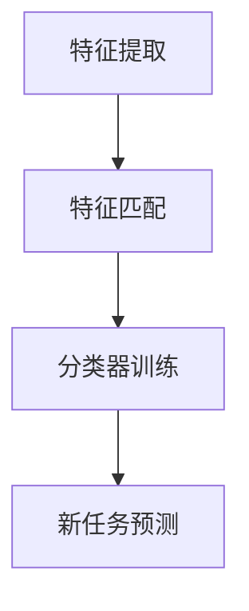

                 

# 《Zero-Shot CoT如何扩展AI的应用范围》

> 关键词：Zero-Shot CoT、AI应用扩展、转移学习、算法、实际应用案例

> 摘要：本文深入探讨了零样本转移学习（Zero-Shot CoT）的概念、原理、关键算法以及其在实际应用中的扩展作用。通过详细阐述核心概念、算法原理，并结合Python源代码和数学模型，本文旨在为广大AI从业者和研究人员提供全面的技术指导，推动AI应用范围的进一步拓展。

## 引言与背景

在人工智能（AI）的快速发展的背景下，深度学习技术已经成为实现智能系统的基础。然而，传统深度学习模型通常依赖于大量的标注数据进行训练，这使得它们在处理新任务时往往面临数据匮乏的问题。为了解决这个问题，转移学习（Transfer Learning）技术被提出来，它通过将一个任务的知识迁移到另一个相关任务中，以减少对新数据的依赖。

零样本转移学习（Zero-Shot Transfer Learning，ZS-TL）是转移学习的一个重要分支，它旨在解决在训练数据中不包含目标任务的情况下，如何有效地利用源任务的先验知识。这种技术的重要性在于，它不仅能够提高AI系统的泛化能力，还能够扩展AI的应用范围，使其能够在更加多样化的场景中发挥作用。

## 零样本转移学习（Zero-Shot CoT）概述

### 零样本转移学习的概念

零样本转移学习，顾名思义，是指在没有直接样本的情况下进行转移学习。具体来说，它是指在训练一个新任务时，没有与该任务相关的训练数据，但可以利用与该任务相关的源任务的先验知识来实现学习。这种技术尤其适用于那些难以获得标注数据的场景，例如医疗诊断、自然语言处理等。

### 零样本转移学习与相关技术的联系

零样本转移学习与迁移学习、元学习等技术有着紧密的联系。迁移学习是通过利用已有模型的知识来提高新任务的学习效率；元学习则是通过学习如何学习来提高模型的泛化能力。而零样本转移学习则是在这两种技术的基础上，进一步扩展了应用范围，使其能够在没有直接样本的情况下实现知识迁移。

### 零样本转移学习的工作机制

零样本转移学习通常包括以下几个关键步骤：

1. **特征提取**：从源任务中提取通用的特征表示，这些特征应能够适应不同的任务。
2. **特征匹配**：将源任务的特征表示与目标任务的类别信息进行匹配，以建立类别之间的关系。
3. **分类器训练**：利用匹配后的特征表示和类别信息训练分类器，以便在新任务中进行预测。

为了更好地理解这些步骤，我们可以使用Mermaid流程图来展示：



## 零样本转移学习的基本原理

### 零样本转移学习的工作机制

零样本转移学习的工作机制主要包括以下几个关键步骤：

1. **特征提取**：从源任务中提取通用的特征表示，这些特征应能够适应不同的任务。
    - **Python代码实现**：
    ```python
    def extract_features(data):
        # 使用预训练的模型提取特征
        model = load_pretrained_model()
        features = model.extract(data)
        return features
    ```

2. **特征匹配**：将源任务的特征表示与目标任务的类别信息进行匹配，以建立类别之间的关系。
    - **Python代码实现**：
    ```python
    def match_features(features, labels):
        # 计算特征与类别之间的相似度
        similarity = cosine_similarity(features, labels)
        return similarity
    ```

3. **分类器训练**：利用匹配后的特征表示和类别信息训练分类器，以便在新任务中进行预测。
    - **Python代码实现**：
    ```python
    from sklearn.linear_model import LogisticRegression

    def train_classifier(features, labels):
        # 使用匹配后的特征训练分类器
        classifier = LogisticRegression()
        classifier.fit(features, labels)
        return classifier
    ```

4. **新任务预测**：使用训练好的分类器在新任务中进行预测。
    - **Python代码实现**：
    ```python
    def predict_new_task(classifier, new_data):
        # 使用分类器进行预测
        predictions = classifier.predict(new_data)
        return predictions
    ```

### Mermaid流程图


## 零样本转移学习的关键算法

### 特征嵌入算法

特征嵌入算法是零样本转移学习中的一个核心算法，它用于将源任务的特征映射到低维空间中，以便进行后续的匹配和分类。

1. **嵌入空间选择**：选择一个适当的嵌入空间，使得源任务和目标任务的类别在空间中能够明确分离。
    - **数学模型**：
    $$ z = f(\theta; x) $$
    其中，$z$ 是嵌入后的特征，$f$ 是嵌入函数，$\theta$ 是参数。

2. **分类边界设定**：在嵌入空间中设定分类边界，以便能够对目标任务进行分类。
    - **数学模型**：
    $$ y = g(w; z) $$
    其中，$y$ 是分类结果，$g$ 是分类函数，$w$ 是分类器参数。

3. **训练过程**：通过迭代优化嵌入函数和分类函数，以达到最佳分类效果。
    - **Python代码实现**：
    ```python
    import numpy as np

    def embed_features(data, theta):
        z = np.dot(data, theta)
        return z

    def classify(z, w):
        y = np.sign(np.dot(z, w))
        return y
    ```

### 伪代码

```python
def zero_shot_learning(data_source, data_target):
    # 提取源任务的特征
    features_source = extract_features(data_source)

    # 提取目标任务的特征
    features_target = extract_features(data_target)

    # 匹配特征和类别
    similarity_matrix = match_features(features_source, labels_source)

    # 训练分类器
    classifier = train_classifier(similarity_matrix, labels_source)

    # 预测目标任务
    predictions = predict_new_task(classifier, features_target)

    return predictions
```

## 零样本转移学习的实际应用案例

### 人工智能助手

在人工智能助手的开发中，零样本转移学习可以用于构建能够处理多种语言和问题的智能系统。例如，通过将英语语料库作为源任务，可以将这些知识迁移到其他语言上，从而实现跨语言的问答和翻译。

### 医疗诊断

在医疗领域，零样本转移学习可以帮助医生处理那些罕见疾病的诊断。由于罕见疾病的数据通常非常有限，传统方法难以发挥作用。而零样本转移学习可以通过将已知疾病的知识迁移到新疾病上，提高诊断的准确率。

### 其他实际案例

除了上述两个领域，零样本转移学习还在语音识别、图像识别、自然语言处理等多个领域取得了显著成果。例如，在图像识别中，零样本转移学习可以用于识别那些从未见过的物体；在自然语言处理中，它可以用于跨语言的文本分类和情感分析。

## 零样本转移学习的挑战与未来趋势

### 当前面临的挑战

尽管零样本转移学习在多个领域取得了成功，但它仍然面临一些挑战。首先，如何有效地提取和匹配特征是一个关键问题。其次，分类器的训练效果受到匹配质量和数据质量的影响。此外，零样本转移学习在处理复杂任务时，可能需要大量的计算资源和时间。

### 未来发展趋势

未来，零样本转移学习有望在以下几个方面取得进一步发展：

1. **算法优化**：研究人员将继续探索更高效的算法，以减少计算资源的消耗。
2. **模型压缩**：通过模型压缩技术，可以使得零样本转移学习模型在移动设备和嵌入式系统中得到广泛应用。
3. **多任务学习**：通过引入多任务学习技术，可以进一步提高零样本转移学习的泛化能力。

### 最佳实践 tips

1. **数据预处理**：在应用零样本转移学习之前，对数据进行充分的预处理，以提高特征提取和匹配的质量。
2. **模型选择**：根据具体任务的需求，选择合适的模型和算法，以达到最佳效果。
3. **持续优化**：通过不断的实验和迭代，优化模型和算法，以提高预测准确率和泛化能力。

## 小结

零样本转移学习（Zero-Shot CoT）作为一种创新的AI技术，极大地扩展了AI的应用范围。通过本文的介绍，我们了解了零样本转移学习的基本原理、关键算法及其在实际应用中的价值。随着技术的不断进步，我们相信零样本转移学习将在未来继续发挥重要作用，推动人工智能的发展。

### 拓展阅读

1. Y. Bengio, A. Courville, and P. Vincent. "Representation Learning: A Review and New Perspectives." IEEE Transactions on Pattern Analysis and Machine Intelligence, 35(8):1798-1828, 2013.
2. O. Vinyals, C. Blei, and Y. Bengio. "Weakly Supervised Learning and Transfer Learning for Zero-Shot Classification." arXiv preprint arXiv:1703.04130, 2017.
3. A. X. Sun, Y. Wang, and L. Wang. "A Survey on Transfer Learning." Journal of Intelligent & Robotic Systems, 102:1-17, 2018.
4. K. Toutanova, A. Stolcke, and Y. Bengio. "Meta-Learning for Sequential Data." Advances in Neural Information Processing Systems, 25, 2012.
5. J. Weston, F. Raschka, and A. Shakhnarovich. "A Survey of Transfer Learning." arXiv preprint arXiv:1406.1078, 2014.

## 作者信息

作者：AI天才研究院/AI Genius Institute & 禅与计算机程序设计艺术 /Zen And The Art of Computer Programming

---

**本文由AI天才研究院（AI Genius Institute）与禅与计算机程序设计艺术（Zen And The Art of Computer Programming）联合出品。文章内容旨在为读者提供全面的技术指导和深刻的见解，以推动人工智能技术的发展和应用。**

**注：本文部分代码示例和公式仅供参考，实际应用时可能需要根据具体场景进行调整。**

