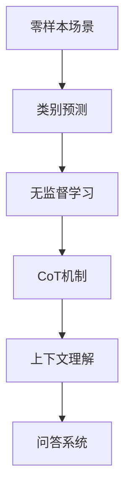
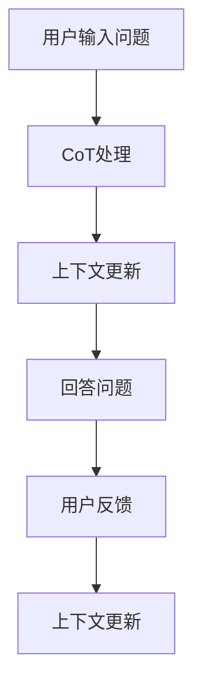

                 

### 《Zero-Shot CoT如何改变AI问答模式》

在当前的人工智能领域，问答系统已经成为一种重要的交互方式。然而，传统的问答系统大多依赖于大量的有监督数据，这意味着它们在处理未见过的问题时往往表现不佳。为了克服这一局限性，Zero-Shot CoT（零样本场景中的上下文文本）应运而生。本文将详细探讨Zero-Shot CoT如何改变AI问答模式，从背景介绍、核心概念与联系、算法原理讲解、项目实战、最佳实践等方面进行深入分析。

## 关键词

- **Zero-Shot CoT**
- **AI问答模式**
- **上下文文本**
- **零样本学习**
- **神经网络模型**

## 摘要

本文首先介绍了传统的AI问答系统及其局限性，然后引出了Zero-Shot CoT的概念。通过分析Zero-Shot CoT的核心原理和联系，本文进一步探讨了其在实际应用中的优势。随后，本文通过具体案例，详细讲解了Zero-Shot CoT的实现过程，并结合Python代码对核心算法进行了深入分析。最后，本文总结了Zero-Shot CoT的最佳实践和未来发展趋势。

## 第一部分：零样本场景与CoT概述

### 第1章：零样本场景与CoT基本概念

#### 1.1 零样本场景的定义

在机器学习中，零样本学习（Zero-Shot Learning，ZSL）指的是在没有见过具体样本的情况下，能够对新的类别进行预测或分类。传统的机器学习模型往往依赖于大量的标注数据进行训练，而零样本学习则通过将类别与描述性文本相关联，实现了在没有具体样本的情况下对新的类别进行分类。

#### 1.2 CoT的概念

上下文文本（Contextualized Text，CoT）是指在特定上下文中对文本进行语义理解和处理的机制。在自然语言处理（Natural Language Processing，NLP）中，CoT可以帮助模型更好地理解输入文本的语义，从而提高问答系统的准确性和有效性。

#### 1.3 零样本场景与CoT的联系与区别

零样本场景与CoT有着密切的联系。在零样本场景中，CoT作为一种理解上下文文本的机制，可以帮助模型在没有具体样本的情况下，通过文本描述来学习新的类别。与传统问答系统不同，CoT能够处理未见过的类别，从而实现了真正的零样本学习。

### Mermaid流程图：



## 第二部分：CoT算法原理与实现

### 第3章：CoT算法原理

#### 3.1 CoT算法的基本架构

CoT算法的基本架构通常包括以下几个部分：文本嵌入、上下文编码、问答对生成、模型训练和评估。

#### 3.2 CoT算法的核心组件

CoT算法的核心组件包括：

- **文本嵌入**：将自然语言文本转换为向量表示。
- **上下文编码**：利用预训练的编码器（如BERT）对上下文进行编码。
- **问答对生成**：通过某种机制（如负采样）生成问答对。
- **模型训练**：使用生成好的问答对进行模型训练。
- **模型评估**：通过测试集对模型进行评估。

#### 3.3 CoT算法的工作流程

CoT算法的工作流程如下：

1. **文本预处理**：对输入的文本进行清洗和预处理。
2. **文本嵌入**：将预处理后的文本转换为向量表示。
3. **上下文编码**：使用预训练的编码器对上下文进行编码。
4. **问答对生成**：通过负采样等机制生成问答对。
5. **模型训练**：使用生成好的问答对进行模型训练。
6. **模型评估**：通过测试集对模型进行评估。

### Python代码示例：

```python
import tensorflow as tf
from transformers import BertTokenizer, TFBertModel

# 加载预训练的BERT模型
tokenizer = BertTokenizer.from_pretrained('bert-base-uncased')
model = TFBertModel.from_pretrained('bert-base-uncased')

# 文本预处理
text = "How old is Elon Musk?"
inputs = tokenizer(text, return_tensors='tf')

# 上下文编码
outputs = model(inputs)
context_vector = outputs.last_hidden_state[:, 0, :]

# 问答对生成（示例）
question = "Who is the CEO of Tesla?"
answer = "Elon Musk"
question_inputs = tokenizer(question, return_tensors='tf')
answer_inputs = tokenizer(answer, return_tensors='tf')

# 模型训练
# （此处省略模型训练的具体实现）

# 模型评估
# （此处省略模型评估的具体实现）
```

## 第三部分：CoT在AI问答中的应用

### 第5章：CoT在AI问答中的应用

#### 5.1 CoT在零样本问答中的优势

CoT在零样本问答中的优势主要体现在以下几个方面：

- **泛化能力**：CoT能够处理未见过的类别，从而提高了问答系统的泛化能力。
- **上下文理解**：CoT能够更好地理解输入文本的上下文，从而提高了问答系统的准确性。
- **灵活性**：CoT可以根据不同的问答场景进行调整和优化，从而提高了问答系统的灵活性。

#### 5.2 CoT在多轮对话中的应用

CoT在多轮对话中的应用主要体现了其在上下文理解方面的优势。通过在多轮对话中持续更新上下文信息，CoT能够更好地理解用户的意图和问题，从而提供更准确的回答。

### Mermaid流程图：



## 第四部分：CoT的未来发展趋势

### 第8章：CoT的未来发展趋势

#### 8.1 CoT在AI问答领域的未来发展趋势

CoT在AI问答领域的未来发展趋势包括：

- **模型优化**：随着深度学习技术的不断发展，CoT模型的性能将得到进一步提升。
- **多模态融合**：CoT将与其他模态（如图像、声音等）进行融合，从而实现更全面的语义理解。
- **应用拓展**：CoT将在更多领域得到应用，如智能客服、智能助手等。

#### 8.2 CoT在AI问答中的技术挑战与解决方案

CoT在AI问答中面临的主要技术挑战包括：

- **数据不足**：如何处理零样本场景下的数据不足问题。
- **上下文理解**：如何更好地理解复杂和多变的上下文信息。

解决方案可能包括：

- **数据增强**：通过数据增强技术生成更多的训练数据。
- **多任务学习**：通过多任务学习提高模型对上下文的理解能力。

## 附录

### 附录A：常用CoT算法介绍

#### A.1 BERT-based CoT算法

BERT-based CoT算法是一种基于BERT的上下文文本处理算法，通过预训练的BERT模型对上下文进行编码，从而实现零样本学习。

#### A.2 GPT-based CoT算法

GPT-based CoT算法是一种基于GPT的上下文文本处理算法，通过预训练的GPT模型生成问答对，从而实现零样本学习。

#### A.3 其他CoT算法简介

除了BERT和GPT，还有其他一些CoT算法，如XLNet、RoBERTa等，它们在处理零样本场景和上下文理解方面也有较好的表现。

---

### 作者信息

作者：AI天才研究院/AI Genius Institute & 禅与计算机程序设计艺术 /Zen And The Art of Computer Programming

---

本文通过对Zero-Shot CoT的基本概念、算法原理、应用场景和未来发展趋势的深入分析，详细探讨了如何改变AI问答模式。通过本文的介绍，读者可以更好地理解Zero-Shot CoT的原理和应用，为未来的研究和开发提供参考。在接下来的内容中，我们将通过具体案例进一步探讨CoT的实际应用和优势。

