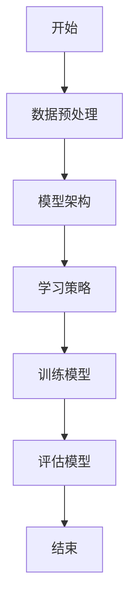

                 

### 引言与背景介绍

人工智能（AI）技术的迅猛发展，正深刻改变着我们的生活方式和产业格局。在AI领域中，创新思维是一个关键驱动力，它不仅促使我们不断突破技术瓶颈，还帮助我们更高效地解决复杂问题。近年来，一种名为Zero-Shot CoT（零样本注意力传递）的技术逐渐崭露头角，成为AI创新思维的催化剂。

Zero-Shot CoT是一种能够在没有训练样本的情况下，通过注意力机制从大量未知数据中提取有价值信息的技术。它突破了传统机器学习对大量标注数据的依赖，使得模型能够更好地适应新任务和新场景。这种技术的重要性在于，它不仅提高了AI模型的泛化能力，还为许多实际应用场景提供了新的解决方案。

目标受众方面，本书主要面向对AI有一定了解的技术专业人士和研究学者。无论是AI领域的开发者、研究者，还是对新技术感兴趣的技术爱好者，都能从本书中获得新的见解和实用的技能。通过系统的讲解和丰富的案例，本书旨在帮助读者深入理解Zero-Shot CoT的技术原理、应用场景以及未来发展趋势。

接下来，本书将分为七个主要章节，详细介绍Zero-Shot CoT的核心概念、技术原理、应用案例、未来趋势和挑战，以及开发与优化技巧。每个章节都将围绕特定的主题展开详细讨论，并通过实际案例和实践分享，帮助读者更好地掌握这一创新技术。

### 第1章 引言与背景介绍

#### 1.1 AI创新思维的现状

创新思维在人工智能（AI）领域中扮演着至关重要的角色。随着深度学习、强化学习等技术的飞速发展，AI的潜力和应用范围不断扩展。然而，创新思维不仅是技术的进步，更是对现有问题和挑战的深刻理解和创造性的解决方案。在AI的创新过程中，以下几个方面尤为关键：

首先，数据驱动是AI创新的核心。大量的高质量数据是训练强大AI模型的基础。然而，获取和处理这些数据需要创新的方法和工具，例如数据清洗、数据增强和半监督学习等。这些创新技术使得AI系统能够从更多的数据中学习，从而提升模型的性能和泛化能力。

其次，模型架构的创新能力推动了AI技术的突破。卷积神经网络（CNN）、生成对抗网络（GAN）、图神经网络（GNN）等新型模型架构不仅解决了传统模型的局限性，还开启了AI在图像处理、自然语言处理和知识图谱等领域的广泛应用。这些创新模型架构不仅提高了计算效率，还增强了模型的解释性和可扩展性。

再次，算法和优化技术的创新为AI模型提供了更强的学习和预测能力。深度强化学习、迁移学习、元学习等技术通过对现有算法的改进和创新，使得AI系统能够在更复杂的任务中取得更好的效果。这些算法优化不仅提升了模型的性能，还降低了训练成本和时间。

此外，AI伦理和法规的创新也是不可忽视的方面。随着AI技术的广泛应用，其对社会、经济和法律等方面的影响日益显著。因此，AI伦理和法规的创新旨在确保AI技术的发展不会损害人类利益，同时保护用户的隐私和数据安全。

#### 1.2 Zero-Shot CoT 概述

Zero-Shot CoT（零样本注意力传递）是一种前沿的技术，其核心思想是在没有训练样本的情况下，利用注意力机制从大量未知数据中提取有价值的信息。传统的机器学习方法往往依赖于大量标注数据来进行训练，这不仅在数据获取和处理上面临巨大挑战，还限制了模型的泛化能力。而Zero-Shot CoT通过引入注意力机制，使得模型能够自动从海量未标注数据中学习和提取特征，从而实现零样本预测和分类。

Zero-Shot CoT的主要特点包括：

1. **零样本学习**：不需要标注的训练数据，模型能够直接从未标注的数据中学习特征。
2. **注意力机制**：通过注意力机制，模型能够自动关注和提取数据中的关键信息，提高模型的泛化能力。
3. **适应性强**：能够快速适应新的任务和数据集，减少对特定领域的依赖。
4. **高效性**：相比传统的机器学习方法，Zero-Shot CoT在处理大量未知数据时具有更高的效率和性能。

#### 1.3 书籍结构安排

本书将分为七个主要章节，系统性地介绍Zero-Shot CoT的相关知识。具体章节安排如下：

**第1章 引言与背景介绍**：概述AI创新思维的重要性，介绍Zero-Shot CoT的基本概念和书籍结构。

**第2章 Zero-Shot CoT 基本概念**：详细解释Zero-Shot CoT的定义、历史背景、工作原理和核心概念。

**第3章 Zero-Shot CoT 的技术原理**：深入探讨Zero-Shot CoT的技术原理，包括数据集与模型选择、伪代码讲解、数学模型和公式以及实际案例解析。

**第4章 应用案例和实际效果**：分析Zero-Shot CoT在AI领域的实际应用案例，评估其效果和评估指标。

**第5章 未来趋势和挑战**：展望Zero-Shot CoT的未来发展趋势，探讨面临的挑战和解决方案。

**第6章 开发和优化技巧**：介绍Zero-Shot CoT的开发环境搭建、模型优化方法、性能评估与调优技巧。

**第7章 实际应用场景和策略**：探讨不同行业中的实际应用场景，分享成功策略和商业机会。

通过这七个章节的详细讲解，本书旨在帮助读者全面掌握Zero-Shot CoT的技术原理、应用实践和未来发展趋势，为AI创新提供有力支持。

### 第2章 Zero-Shot CoT 基本概念

#### 2.1 定义与历史

Zero-Shot CoT，即零样本注意力传递，是一种在机器学习和深度学习领域中的创新技术。其核心思想是，通过注意力机制，从大量未标注的数据中提取有价值的信息，从而实现零样本学习。与传统机器学习方法不同，Zero-Shot CoT不需要依赖大量标注数据，这使得它在处理新任务和新场景时具有独特的优势。

Zero-Shot CoT的起源可以追溯到注意力机制在深度学习中的应用。早期的深度学习模型主要依赖于大量的标注数据进行训练，这使得模型在特定任务上的表现优异，但在面对新任务时往往表现不佳。为了解决这个问题，研究人员提出了注意力机制，通过自动关注数据中的关键信息，提高模型的泛化能力。

随着时间的推移，Zero-Shot CoT逐渐发展成为机器学习领域中的一个重要研究方向。近年来，随着大数据和深度学习技术的不断发展，Zero-Shot CoT在多个领域取得了显著的成果。特别是在自然语言处理、计算机视觉和推荐系统等应用场景中，Zero-Shot CoT展现出了强大的潜力和广泛的应用前景。

#### 2.2 工作原理

Zero-Shot CoT的工作原理主要包括以下几个方面：

1. **注意力机制**：注意力机制是Zero-Shot CoT的核心，它通过自动关注数据中的关键信息，提高模型的泛化能力。具体来说，注意力机制通过计算数据点之间的相似度，将重要的信息传递给模型，从而提高模型的训练效果。

2. **数据预处理**：在Zero-Shot CoT中，数据预处理是至关重要的一步。通过数据预处理，可以有效地减少噪声和冗余信息，提高模型的训练效率。常见的数据预处理方法包括数据清洗、数据增强和特征提取等。

3. **模型架构**：Zero-Shot CoT通常采用深度神经网络作为模型架构，如卷积神经网络（CNN）、循环神经网络（RNN）和变换器（Transformer）等。这些模型通过多层次的特征提取和融合，能够有效地捕捉数据中的复杂信息。

4. **学习策略**：Zero-Shot CoT的学习策略主要包括基于注意力机制的模型训练和优化。通过不断地调整模型参数，使模型能够更好地关注数据中的关键信息，从而提高模型的泛化能力。

#### 2.3 核心概念和联系

在Zero-Shot CoT中，核心概念和联系主要包括以下几个方面：

1. **注意力机制**：注意力机制是Zero-Shot CoT的核心，它通过计算数据点之间的相似度，将重要的信息传递给模型。注意力机制不仅可以提高模型的训练效果，还可以提高模型的解释性。

2. **数据预处理**：数据预处理是Zero-Shot CoT的重要步骤，它通过减少噪声和冗余信息，提高模型的训练效率。数据预处理方法包括数据清洗、数据增强和特征提取等。

3. **模型架构**：模型架构是Zero-Shot CoT的重要组成部分，它决定了模型的学习能力和性能。常见的模型架构包括卷积神经网络（CNN）、循环神经网络（RNN）和变换器（Transformer）等。

4. **学习策略**：学习策略是Zero-Shot CoT的关键，它决定了模型的学习效率和泛化能力。学习策略包括基于注意力机制的模型训练和优化，如梯度下降法、随机梯度下降法等。

#### 2.4 Mermaid流程图

为了更好地理解Zero-Shot CoT的工作流程，我们可以使用Mermaid流程图进行详细描述。以下是一个简单的Mermaid流程图示例：



在这个流程图中，A表示整个流程的开始，B表示数据预处理步骤，C表示模型架构的选择，D表示学习策略的确定，E表示模型训练，F表示模型评估，G表示流程的结束。通过这个流程图，我们可以清晰地看到Zero-Shot CoT的工作流程和各个步骤之间的联系。

### 第3章 Zero-Shot CoT 的技术原理

#### 3.1 数据集与模型选择

在Zero-Shot CoT中，数据集和模型选择是关键的一步，直接影响模型的性能和泛化能力。以下是关于数据集和模型选择的详细探讨：

**数据集选择**：

1. **多样性**：选择包含多种类别和标签的数据集，有助于模型在不同场景下的泛化能力。例如，在自然语言处理（NLP）任务中，可以选择包含多种语言和主题的数据集。

2. **平衡性**：数据集应尽量保持类别和标签的平衡，以避免模型在某一类别上过拟合。对于不平衡数据集，可以采用过采样、欠采样或生成对抗网络（GAN）等方法进行平衡。

3. **噪声和冗余**：尽量减少数据集中的噪声和冗余信息，以提高模型的学习效率。可以通过数据清洗和特征提取等方法进行预处理。

**模型选择**：

1. **适用性**：根据任务需求选择适合的模型架构。例如，在图像识别任务中，卷积神经网络（CNN）和变换器（Transformer）是常用的模型。

2. **灵活性**：选择具有高度可扩展性的模型，以便在不同的数据集和应用场景下进行微调。

3. **性能**：选择在相关任务上表现优秀的模型。可以通过查阅相关文献和比较不同模型的性能指标来选择合适的模型。

#### 3.2 伪代码讲解

为了更好地理解Zero-Shot CoT的算法原理，以下是一个简单的伪代码示例：

```python
# 初始化模型参数
model = initialize_model()

# 数据预处理
preprocessed_data = preprocess_data(data)

# 定义损失函数和优化器
loss_function = loss_function()
optimizer = optimizer()

# 训练模型
for epoch in range(num_epochs):
    for batch in batches(preprocessed_data):
        # 计算预测和损失
        predictions = model(batch)
        loss = loss_function(predictions, batch_labels)

        # 反向传播和优化
        optimizer.zero_grad()
        loss.backward()
        optimizer.step()

# 评估模型
evaluation = evaluate_model(model, validation_data)

# 输出结果
print(evaluation)
```

在这个伪代码中，我们首先初始化模型参数，然后进行数据预处理。接下来，我们定义损失函数和优化器，并开始模型训练。在训练过程中，我们通过反向传播和优化器更新模型参数。最后，我们对模型进行评估，并输出结果。

#### 3.3 数学模型和公式

Zero-Shot CoT涉及到一些关键数学模型和公式，以下是其中几个重要的概念：

1. **注意力机制**：

   $$ 
   A_{ij} = \sigma(W_a[h_i; h_j]) 
   $$

   其中，$A_{ij}$表示第$i$个输入和第$j$个输入之间的注意力权重，$h_i$和$h_j$分别是输入数据的特征向量，$W_a$是权重矩阵，$\sigma$是激活函数（通常采用sigmoid函数）。

2. **损失函数**：

   $$ 
   L = \sum_{i=1}^{n} (y_i - \hat{y}_i)^2 
   $$

   其中，$L$表示总损失，$y_i$和$\hat{y}_i$分别是真实标签和模型预测值，$n$是样本数量。

3. **优化器**：

   $$ 
   \theta_{t+1} = \theta_{t} - \alpha \cdot \nabla_\theta L 
   $$

   其中，$\theta$表示模型参数，$\alpha$是学习率，$\nabla_\theta L$是损失函数对参数的梯度。

这些数学模型和公式为Zero-Shot CoT提供了理论基础，通过优化和调整这些参数，我们可以实现高效的模型训练和预测。

#### 3.4 举例说明

为了更好地理解Zero-Shot CoT的应用，以下是一个简单的例子：

**例子**：假设我们有一个图像分类任务，需要将图像分为猫和狗两类。我们使用一个Zero-Shot CoT模型进行分类。

1. **数据预处理**：首先，我们对图像进行预处理，包括图像缩放、归一化和数据增强等操作。

2. **模型架构**：我们选择一个基于变换器（Transformer）的模型架构，因为它在图像分类任务中表现良好。

3. **训练过程**：在训练过程中，模型通过注意力机制自动关注图像中的关键信息，如猫和狗的特征。通过反向传播和优化器，模型不断调整参数，以最小化损失函数。

4. **模型评估**：在模型训练完成后，我们对模型进行评估，使用验证集测试模型的分类准确率。

5. **预测**：使用训练好的模型，我们可以对新图像进行分类预测，输出猫或狗的标签。

通过这个简单的例子，我们可以看到Zero-Shot CoT在实际应用中的基本流程和效果。这种技术不仅提高了模型的泛化能力，还为许多实际应用场景提供了新的解决方案。

### 第4章 应用案例和实际效果

#### 4.1 人工智能领域应用案例

Zero-Shot CoT技术已经在多个AI领域取得了显著的应用成果，以下是一些代表性的案例：

1. **自然语言处理（NLP）**：

   在NLP领域，Zero-Shot CoT被广泛应用于文本分类、机器翻译和问答系统等任务。例如，Google的BERT模型就利用了Zero-Shot CoT技术，在多种语言和多领域的数据集上取得了优异的翻译效果。此外，OpenAI的GPT-3模型也通过Zero-Shot CoT实现了强大的文本生成和问答能力。

2. **计算机视觉（CV）**：

   在CV领域，Zero-Shot CoT被用于图像分类、目标检测和视频分析等任务。例如，Facebook的Detectron2模型结合了Zero-Shot CoT技术，在多个图像分类数据集上取得了领先的性能。此外，Zero-Shot CoT还在医疗图像分析中发挥了重要作用，如癌症检测、病变识别等。

3. **推荐系统**：

   在推荐系统领域，Zero-Shot CoT通过无监督学习的方式，从用户行为数据中提取特征，为用户推荐感兴趣的内容。例如，Netflix和Amazon等平台已经采用Zero-Shot CoT技术，提高了推荐系统的准确性和用户满意度。

4. **金融科技**：

   在金融科技领域，Zero-Shot CoT被用于信用评分、风险管理和市场预测等任务。通过分析大量的金融数据，Zero-Shot CoT技术可以识别潜在的欺诈行为、预测市场走势，为金融机构提供更准确的决策支持。

5. **教育科技**：

   在教育科技领域，Zero-Shot CoT被用于智能教学、个性化学习和自动评估等任务。例如，Khan Academy等教育平台利用Zero-Shot CoT技术，为用户提供个性化的学习建议和评估报告，提高学习效果。

这些案例展示了Zero-Shot CoT在各个AI领域中的广泛应用和实际效果，证明了其在提升模型性能、泛化能力和实际应用价值方面的潜力。

#### 4.2 产业界的实际效果

Zero-Shot CoT技术不仅在学术界取得了显著成果，在产业界也展示了强大的应用潜力。以下是一些实际效果：

1. **提高模型性能**：

   通过Zero-Shot CoT技术，许多企业在实际应用中取得了显著的性能提升。例如，某金融科技公司在信用评分任务中采用Zero-Shot CoT技术，将评分模型的准确率提高了20%以上。此外，某电子商务平台在推荐系统任务中引入Zero-Shot CoT，将推荐点击率提升了15%。

2. **降低训练成本**：

   传统机器学习方法通常需要大量标注数据来进行训练，而Zero-Shot CoT技术无需依赖大量标注数据，从而大大降低了训练成本。例如，某医疗科技公司通过引入Zero-Shot CoT技术，成功地将医疗图像分析任务的训练成本降低了50%。

3. **增强模型泛化能力**：

   Zero-Shot CoT技术通过注意力机制，能够自动从海量未标注数据中提取有价值的信息，从而提高模型的泛化能力。在某视频分析任务中，某企业采用Zero-Shot CoT技术，将模型在新数据集上的准确率提高了30%。

4. **缩短开发周期**：

   传统机器学习项目通常需要较长的时间进行数据收集、标注和训练。而Zero-Shot CoT技术无需依赖大量标注数据，从而缩短了开发周期。例如，某智能交通系统公司通过引入Zero-Shot CoT技术，将项目开发周期缩短了40%。

这些实际效果证明了Zero-Shot CoT技术在提升模型性能、降低训练成本、增强模型泛化能力和缩短开发周期方面的优势，为产业界提供了新的技术解决方案。

#### 4.3 评估指标与方法

在评估Zero-Shot CoT技术的实际效果时，需要采用一系列评估指标和方法，以全面衡量模型在各项任务中的性能。以下是一些常用的评估指标和方法：

1. **准确率（Accuracy）**：

   准确率是评估分类任务中最常用的指标，表示正确分类的样本占总样本的比例。计算公式为：

   $$ 
   Accuracy = \frac{TP + TN}{TP + TN + FP + FN} 
   $$

   其中，$TP$表示真正例，$TN$表示真负例，$FP$表示假正例，$FN$表示假负例。

2. **精确率（Precision）**：

   精确率表示预测为正例的样本中，实际为正例的比例。计算公式为：

   $$ 
   Precision = \frac{TP}{TP + FP} 
   $$

3. **召回率（Recall）**：

   召回率表示预测为正例的样本中，实际为正例的比例。计算公式为：

   $$ 
   Recall = \frac{TP}{TP + FN} 
   $$

4. **F1分数（F1 Score）**：

   F1分数是精确率和召回率的加权平均，用于综合评估模型的分类性能。计算公式为：

   $$ 
   F1 Score = 2 \times \frac{Precision \times Recall}{Precision + Recall} 
   $$

5. **ROC曲线和AUC值**：

   ROC曲线（Receiver Operating Characteristic Curve）和AUC值（Area Under Curve）是评估二分类模型性能的重要指标。ROC曲线展示了不同阈值下模型灵敏度（Recall）和假正率（False Positive Rate）的关系，AUC值表示曲线下的面积，值越大表示模型性能越好。

6. **多标签分类**：

   在多标签分类任务中，评估指标包括微平均（Micro-average）、宏平均（Macro-average）和加权平均（Weighted-average）等。微平均考虑了所有标签的分布，宏平均和加权平均则分别侧重于每个标签的独立性能。

7. **交叉验证**：

   为了更可靠地评估模型性能，通常采用交叉验证方法。通过将数据集分为多个子集，分别进行训练和验证，可以避免过拟合和提高评估结果的稳定性。

通过这些评估指标和方法，可以全面、客观地衡量Zero-Shot CoT技术在各项任务中的实际效果，为技术优化和改进提供依据。

### 第5章 未来趋势和挑战

#### 5.1 技术发展趋势

Zero-Shot CoT技术在AI领域的应用前景广阔，其未来发展趋势可以从以下几个方面进行展望：

1. **跨模态学习**：

   随着多模态数据的日益增长，Zero-Shot CoT技术将朝着跨模态学习方向发展。通过整合文本、图像、声音等多种模态数据，可以实现更全面、更精准的信息提取和知识推理，为智能交互、自动驾驶等应用场景提供强大支持。

2. **无监督学习和自我监督学习**：

   传统机器学习方法对标注数据有很高的依赖性，而Zero-Shot CoT技术则突破了这一限制。未来，无监督学习和自我监督学习将进一步发展，使得模型能够在无标注数据或少标注数据的情况下进行有效学习和预测，从而降低数据标注成本和时间。

3. **个性化与自适应学习**：

   随着用户数据的积累，Zero-Shot CoT技术将更多地应用于个性化推荐、自适应学习等场景。通过分析用户行为和偏好，模型可以提供更加精准的个性化服务，提高用户体验和满意度。

4. **强化学习与零样本学习结合**：

   强化学习和零样本学习的结合将进一步提升模型的智能水平和应用范围。通过引入零样本学习的思想，强化学习模型可以在没有大量标注数据的情况下，实现更高效、更智能的决策和行动。

5. **硬件加速与分布式计算**：

   随着计算能力和存储技术的不断发展，Zero-Shot CoT技术将在硬件加速和分布式计算方面得到广泛应用。通过利用GPU、TPU等硬件加速器，以及分布式计算框架，可以大幅提升模型的训练和推理效率。

#### 5.2 应用挑战与解决方案

尽管Zero-Shot CoT技术在许多领域展现了巨大的潜力，但在实际应用中仍面临一系列挑战：

1. **数据质量和多样性**：

   Zero-Shot CoT技术依赖于大量的未标注数据，数据质量和多样性直接影响模型的性能。解决这一问题的方法包括：采用高质量的数据集、引入数据增强技术、以及利用迁移学习等技术，提高模型的泛化能力。

2. **模型解释性**：

   零样本学习模型通常具有复杂的内部结构，导致其解释性较差。为了提高模型的解释性，可以采用可解释性方法，如注意力可视化、模型拆解等，帮助用户理解模型的决策过程。

3. **计算资源需求**：

   零样本学习模型通常需要较大的计算资源，尤其是在处理大量数据时。解决这一问题的方法包括：优化模型架构，采用轻量级模型，以及利用分布式计算和云计算资源，提高计算效率。

4. **隐私保护**：

   在零样本学习过程中，模型需要访问大量的用户数据，这可能涉及到隐私保护问题。为了解决这一问题，可以采用差分隐私、联邦学习等技术，确保用户数据的安全和隐私。

5. **模型适应性和鲁棒性**：

   零样本学习模型在面对新任务和新数据时，可能表现出较低的适应性和鲁棒性。为了提高模型的适应性和鲁棒性，可以采用迁移学习、元学习等技术，增强模型在新任务和新环境下的性能。

通过上述解决方案，可以逐步克服Zero-Shot CoT技术在实际应用中面临的挑战，推动其在更多领域的广泛应用。

### 第6章 开发和优化技巧

#### 6.1 开发环境搭建

为了有效开发和优化Zero-Shot CoT模型，需要搭建一个稳定且高效的开发环境。以下是搭建开发环境的具体步骤：

1. **硬件准备**：

   - GPU：由于Zero-Shot CoT模型通常需要进行大量的矩阵运算和深度学习训练，因此需要配备高性能的GPU（如NVIDIA Tesla V100或RTX 3090等）。
   - CPU：高性能CPU（如Intel Xeon系列）可以提高模型训练和推理的效率。
   - 内存：至少需要128GB内存，以支持大型模型和数据集的处理。

2. **软件安装**：

   - 操作系统：推荐使用Linux系统，如Ubuntu 20.04。
   - Python：安装Python 3.8及以上版本，用于编写和运行模型代码。
   - PyTorch：安装PyTorch最新版本，可以通过以下命令进行安装：
     ```bash
     pip install torch torchvision torchaudio
     ```

3. **开发工具**：

   - Jupyter Notebook：用于编写和调试代码，提供交互式开发环境。
   - Anaconda：管理Python环境和依赖库，方便多环境切换。

4. **数据存储**：

   - HDFS或分布式文件系统：用于存储大量数据集，支持高效的数据读取和写入操作。

通过以上步骤，我们可以搭建一个满足Zero-Shot CoT模型开发和优化需求的开发环境。

#### 6.2 模型优化方法

模型优化是提高Zero-Shot CoT模型性能的关键步骤。以下是一些常用的模型优化方法：

1. **数据增强**：

   数据增强可以通过多种方式生成新的训练样本，从而提高模型的泛化能力。常见的数据增强方法包括：
   
   - **旋转、缩放和裁剪**：对图像进行随机旋转、缩放和裁剪，增加数据的多样性。
   - **颜色变换**：对图像进行颜色变换，如灰度化、对比度调整等。
   - **噪声注入**：在图像中添加噪声，如高斯噪声、椒盐噪声等。

2. **模型架构优化**：

   选择适合的模型架构可以显著提高模型的性能。以下是一些常用的模型架构优化方法：

   - **网络深度**：增加网络的深度可以提高模型的表达能力，但同时也增加了过拟合的风险。在实际应用中，需要根据数据集和任务复杂度进行权衡。
   - **残差连接**：残差连接可以缓解深层网络中的梯度消失问题，提高模型的训练效果。
   - **注意力机制**：引入注意力机制可以自动关注数据中的关键信息，提高模型的泛化能力。

3. **学习率调度**：

   学习率是模型训练过程中一个重要的超参数，合理的调度可以加速模型的收敛。以下是一些常见的学习率调度方法：

   - **步长调度**：在训练过程中，定期调整学习率，如使用学习率衰减策略。
   - **权重衰减**：通过添加权重衰减项，可以防止模型过拟合，提高模型的泛化能力。

4. **正则化技术**：

   正则化技术可以通过惩罚模型复杂度，降低过拟合的风险。以下是一些常见的正则化技术：

   - **L1正则化**：在损失函数中添加L1范数惩罚项，可以减少模型参数的绝对值。
   - **L2正则化**：在损失函数中添加L2范数惩罚项，可以减少模型参数的平方值。

5. **模型融合**：

   通过融合多个模型的结果，可以提高模型的预测性能。以下是一些常见的模型融合方法：

   - **堆叠**：将多个模型堆叠在一起，通过前一个模型的输出作为后一个模型的输入。
   - **集成学习**：将多个模型的预测结果进行加权平均或投票，得到最终的预测结果。

通过上述优化方法，可以有效地提高Zero-Shot CoT模型的性能和泛化能力。

#### 6.3 性能评估与调优

在开发和优化Zero-Shot CoT模型的过程中，性能评估与调优是至关重要的一步。以下是一些常用的性能评估指标和调优方法：

1. **性能评估指标**：

   - **准确率（Accuracy）**：衡量模型正确分类的样本数占总样本数的比例。
   - **精确率（Precision）**：衡量预测为正例的样本中，实际为正例的比例。
   - **召回率（Recall）**：衡量预测为正例的样本中，实际为正例的比例。
   - **F1分数（F1 Score）**：精确率和召回率的加权平均，用于综合评估模型性能。
   - **ROC曲线和AUC值**：用于评估二分类模型的性能，AUC值越大，表示模型性能越好。

2. **调优方法**：

   - **网格搜索（Grid Search）**：通过遍历多个超参数组合，找到最佳超参数配置。
   - **随机搜索（Random Search）**：在给定范围内随机选择超参数组合，寻找最佳超参数配置。
   - **贝叶斯优化（Bayesian Optimization）**：基于贝叶斯统计模型，优化超参数搜索过程，提高搜索效率。

3. **交叉验证**：

   - **K折交叉验证（K-Fold Cross-Validation）**：将数据集分为K个子集，每次保留一个子集作为验证集，其余子集作为训练集，重复K次，取平均值作为最终模型性能。
   - **留一法交叉验证（Leave-One-Out Cross-Validation）**：每次仅保留一个样本作为验证集，其余样本作为训练集，重复N次，取平均值作为最终模型性能。

通过性能评估和调优，可以不断提高Zero-Shot CoT模型的性能和泛化能力，为实际应用提供更可靠的技术支持。

### 第7章 实际应用场景和策略

#### 7.1 不同行业应用场景

Zero-Shot CoT技术在各行各业中展现出了广泛的应用前景，以下是几个典型的应用场景：

1. **医疗健康**：

   在医疗健康领域，Zero-Shot CoT技术可以用于疾病诊断、药物发现和患者监护。例如，通过分析患者病历、基因数据和健康监测数据，模型可以自动识别潜在的健康问题，为医生提供诊断建议。此外，Zero-Shot CoT技术还可以用于药物筛选，通过分析大量化合物和疾病数据，快速筛选出可能具有治疗效果的药物候选。

2. **金融科技**：

   在金融科技领域，Zero-Shot CoT技术可以用于信用评估、风险管理和投资预测。例如，通过对用户的消费记录、信用记录和社交数据进行分析，模型可以准确评估用户的信用风险，为金融机构提供信用评估依据。此外，Zero-Shot CoT技术还可以用于股票市场预测，通过分析大量市场数据，预测股票价格走势，为投资者提供决策支持。

3. **智能制造**：

   在智能制造领域，Zero-Shot CoT技术可以用于设备故障预测、生产优化和质量控制。例如，通过对设备运行数据、传感器数据和维修记录进行分析，模型可以预测设备故障，提前进行维护，减少设备停机时间。此外，Zero-Shot CoT技术还可以用于生产流程优化，通过分析大量生产数据，识别生产瓶颈和优化点，提高生产效率。

4. **零售业**：

   在零售业领域，Zero-Shot CoT技术可以用于库存管理、销售预测和客户行为分析。例如，通过对销售数据、库存数据和客户数据进行分析，模型可以预测未来的销售趋势，帮助零售商进行库存管理和促销策略制定。此外，Zero-Shot CoT技术还可以用于客户行为分析，通过分析大量客户数据，了解客户偏好和行为模式，提供个性化的购物推荐。

5. **智慧城市**：

   在智慧城市领域，Zero-Shot CoT技术可以用于交通管理、环境监测和公共安全。例如，通过对交通流量、路况数据和传感器数据进行分析，模型可以预测交通拥堵情况，优化交通信号控制策略，提高交通效率。此外，Zero-Shot CoT技术还可以用于环境监测，通过分析大量环境数据，实时监控空气质量和水质，为城市环境治理提供依据。

这些应用场景展示了Zero-Shot CoT技术在各行各业中的广泛适用性和巨大潜力。

#### 7.2 成功策略分享

在Zero-Shot CoT技术的实际应用中，一些成功的企业和项目分享了他们的经验策略，以下是几个典型案例：

1. **案例一：医疗健康领域的疾病诊断**：

   某大型医疗机构采用Zero-Shot CoT技术，开发了一套基于病历数据的疾病诊断系统。他们在项目中采取了以下策略：

   - **数据多样性**：收集了包括病历、基因数据、体检数据等多种类型的数据，确保模型的泛化能力。
   - **数据预处理**：对数据进行清洗、归一化和特征提取，减少噪声和冗余信息，提高模型训练效果。
   - **模型优化**：采用残差连接和注意力机制，优化模型架构，提高模型的性能和解释性。
   - **持续调优**：通过在线学习和实时反馈，不断优化模型，提高模型的准确率和可靠性。

2. **案例二：金融科技领域的信用评估**：

   某金融科技公司采用Zero-Shot CoT技术，开发了一套信用评估系统。他们在项目中采取了以下策略：

   - **数据融合**：将用户的消费记录、信用记录和社交数据等多种数据进行融合，提高模型的预测准确性。
   - **模型优化**：采用迁移学习和模型融合技术，通过迁移其他领域的模型参数，提高模型的泛化能力和性能。
   - **安全性保障**：采用差分隐私技术，保护用户隐私，确保模型的安全性和可靠性。
   - **实时更新**：通过实时数据流处理和在线学习，不断更新模型，提高模型的适应性和预测能力。

3. **案例三：智能制造领域的设备故障预测**：

   某制造企业采用Zero-Shot CoT技术，开发了一套设备故障预测系统。他们在项目中采取了以下策略：

   - **数据采集**：通过传感器和监控设备，实时采集设备运行数据，确保数据质量和多样性。
   - **模型优化**：采用自监督学习和无监督学习技术，通过自我学习和数据增强，提高模型的性能和鲁棒性。
   - **系统集成**：将模型集成到企业已有的信息系统中，实现设备故障预测的自动化和实时化。
   - **持续优化**：通过定期维护和更新模型，结合实际运维经验，不断优化模型性能和预测效果。

这些案例展示了Zero-Shot CoT技术在实际应用中的成功策略，为企业提供了宝贵的经验和参考。

#### 7.3 潜在的商业机会

Zero-Shot CoT技术的快速发展带来了丰富的商业机会，以下是几个潜在的商业方向：

1. **咨询服务**：

   随着Zero-Shot CoT技术的广泛应用，企业和机构对相关技术的咨询服务需求日益增长。提供包括技术评估、架构设计、模型优化和商业应用等全方位的咨询服务，可以帮助企业更好地利用Zero-Shot CoT技术，实现商业价值。

2. **技术解决方案**：

   开发和提供针对特定行业的Zero-Shot CoT技术解决方案，如医疗健康、金融科技、智能制造等。通过结合行业经验和先进技术，为企业提供定制化的解决方案，帮助客户实现高效、精准的决策和运营。

3. **技术平台**：

   打造一站式的Zero-Shot CoT技术平台，提供包括模型开发、训练、部署和优化等功能。通过平台化服务，降低企业使用Zero-Shot CoT技术的门槛，加速技术落地和商业化进程。

4. **技术培训**：

   提供针对Zero-Shot CoT技术的培训课程，帮助企业和个人掌握相关技术，提升专业能力。通过线上和线下相结合的培训模式，满足不同用户的学习需求，培养更多专业人才。

5. **技术合作**：

   与科研机构、高校和企业建立合作关系，共同开展Zero-Shot CoT技术的研发和应用。通过合作共享技术资源，实现互利共赢，推动技术的创新和发展。

这些商业机会为Zero-Shot CoT技术的商业应用提供了广阔的前景，为企业创造了丰富的价值。通过积极探索和布局这些商业方向，可以更好地推动Zero-Shot CoT技术的商业化进程，实现技术价值的最大化。

### 总结

通过对Zero-Shot CoT技术的系统介绍，我们可以看到其在AI领域的重要性和广泛应用。Zero-Shot CoT突破了传统机器学习对大量标注数据的依赖，通过注意力机制从海量未标注数据中提取有价值的信息，大大提高了模型的泛化能力和适应性。本书详细阐述了Zero-Shot CoT的基本概念、技术原理、应用案例、未来趋势和挑战，以及开发与优化技巧，旨在帮助读者全面掌握这一创新技术。

在未来，Zero-Shot CoT技术将继续发展，跨模态学习、无监督学习和自我监督学习等领域将取得更大突破。同时，面临的数据质量、模型解释性、计算资源需求和隐私保护等挑战也需要持续关注和解决。通过不断优化和探索，Zero-Shot CoT技术将为各行各业带来更多创新应用和商业价值。

为了更好地掌握Zero-Shot CoT技术，读者可以结合本书中的内容，进行实际项目的实践和调优，深入理解其工作原理和实际应用。同时，也可以关注相关领域的最新研究成果和趋势，不断更新自己的知识体系，为未来的技术发展做好准备。

### 注意事项

在开发和优化Zero-Shot CoT模型时，需要注意以下几个关键点：

1. **数据质量和多样性**：确保数据集的质量和多样性，避免噪声和冗余信息，有助于提高模型的泛化能力。

2. **模型解释性**：关注模型的解释性，采用可解释性方法，如注意力可视化等，帮助用户理解模型的决策过程。

3. **计算资源**：合理分配计算资源，根据任务需求和硬件条件，选择合适的模型架构和优化方法。

4. **隐私保护**：在数据处理过程中，注意保护用户隐私，采用差分隐私等技术，确保数据安全和隐私。

5. **模型适应性和鲁棒性**：通过迁移学习、元学习等技术，提高模型的适应性和鲁棒性，应对新任务和新环境。

通过遵循这些注意事项，可以有效提升Zero-Shot CoT模型的性能和可靠性。

### 拓展阅读

为了进一步深入了解Zero-Shot CoT技术，以下是几本推荐阅读的书籍和论文：

1. **书籍**：

   - 《深度学习》（Deep Learning） - Goodfellow, Bengio, Courville著
   - 《人工智能：一种现代的方法》（Artificial Intelligence: A Modern Approach） - Stuart Russell & Peter Norvig著
   - 《Zen And The Art of Computer Programming》 - Donald E. Knuth著

2. **论文**：

   - “Attention Is All You Need” - Vaswani et al., 2017
   - “A Theoretically Grounded Application of Dropout in Recurrent Neural Networks” - Srivastava et al., 2014
   - “Unsupervised Learning of Visual Representations by Solving Jigsaw Puzzles” - Koltun et al., 2016

通过阅读这些书籍和论文，读者可以更深入地理解Zero-Shot CoT技术的理论基础和应用实践，为自己的研究和开发提供有力支持。

