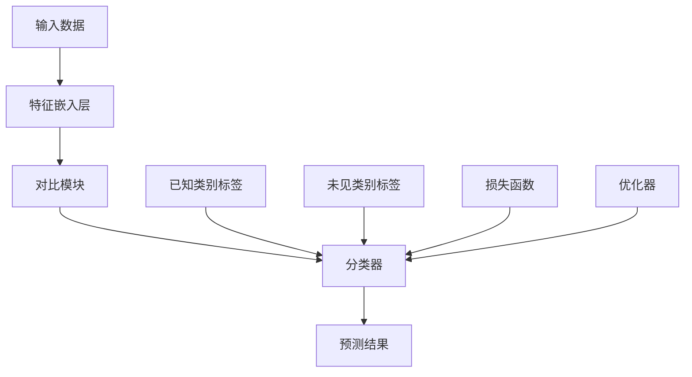
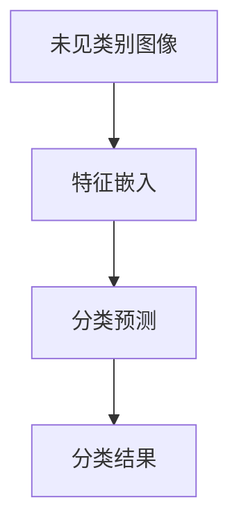
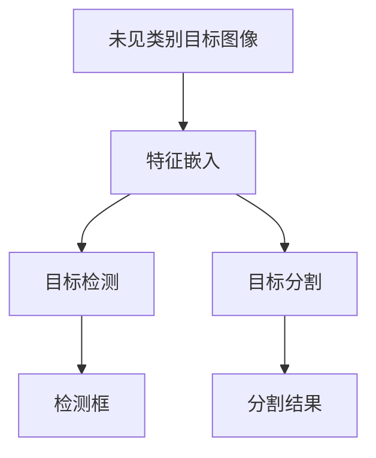
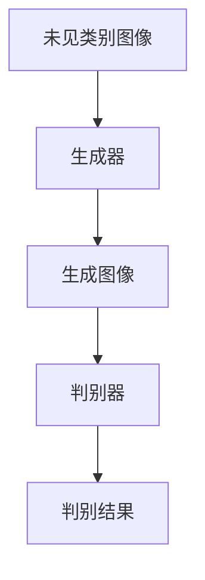
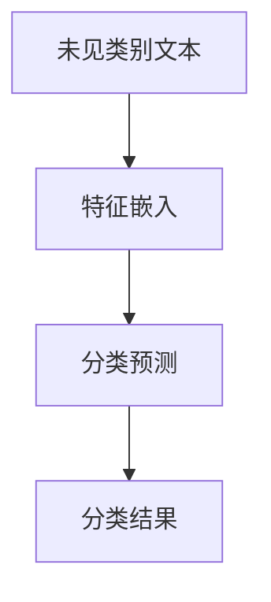
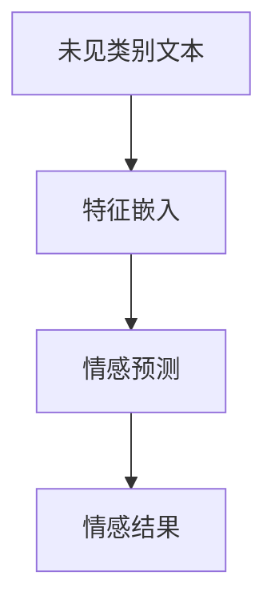
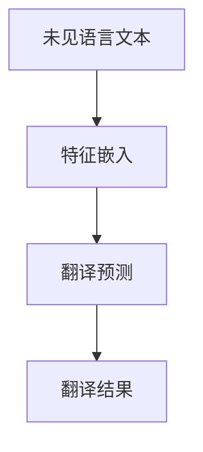
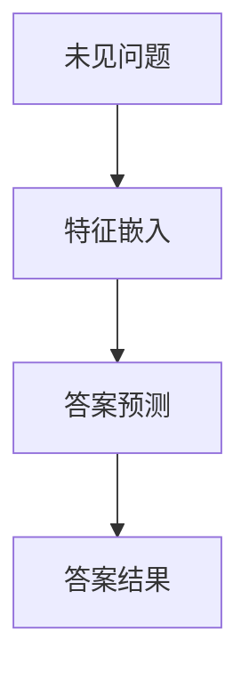
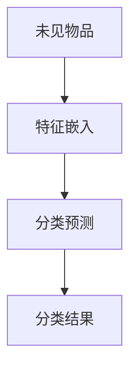
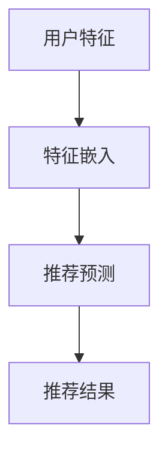

                 

### 引言

在当今人工智能（AI）迅猛发展的时代，我们见证了AI技术从简单的规则系统发展到复杂的深度学习模型，再到如今的自监督学习和零样本学习。然而，这些进步也带来了新的挑战。特别是，如何在缺乏标注数据的场景下实现高效的即时学习和推理，成为了研究者们亟待解决的关键问题。正是在这样的背景下，Zero-Shot CoT（零样本学习与推理的新范式）应运而生。

**什么是Zero-Shot CoT？** 它是指一种在训练过程中不需要对特定任务进行标注数据的学习方法，通过将学习任务泛化到未见过的新类或样本上，实现即时的学习和推理。Zero-Shot CoT不仅可以处理新类别的数据，还能在未知数据上进行有效的推理，这为许多现实世界中的应用场景提供了强大的技术支持。

**Zero-Shot CoT的重要性** 在于其突破了传统机器学习对大量标注数据的依赖，极大地降低了数据获取的成本，并提升了模型在不同领域的适应性。这对于资源有限的初创公司、数据稀缺的特定领域应用以及隐私敏感的场景尤为重要。

本文旨在系统地探讨Zero-Shot CoT的核心概念、原理和应用。具体来说，我们将从以下几个方面展开：

1. **背景介绍**：回顾AI的发展历程，特别是自监督学习和零样本学习的相关研究。
2. **核心概念与联系**：详细解释Zero-Shot CoT的定义、架构及其与其他相关技术的联系。
3. **核心算法原理讲解**：通过Python源代码和数学模型，阐述Zero-Shot CoT的训练和推理流程。
4. **项目实战**：介绍Zero-Shot CoT在计算机视觉、自然语言处理和推荐系统中的应用，并提供实际案例分析和代码实现。
5. **最佳实践 tips**：总结Zero-Shot CoT的最佳实践技巧和小结。

通过本文的阅读，读者将能够深入理解Zero-Shot CoT的原理和实际应用，为今后的研究和开发提供有价值的参考。

### 背景介绍

为了更好地理解Zero-Shot CoT的兴起和重要性，我们需要回顾人工智能的发展历程。自20世纪50年代AI诞生以来，AI技术经历了多个发展阶段，从最初的规则系统到现在的深度学习，每一个阶段都带来了重要的技术突破和应用变革。

**早期AI与规则系统**：在AI的早期阶段，专家系统成为了主流。这些系统依赖于大量的手工编写规则，能够在特定领域内实现有限的智能。然而，专家系统的局限性在于其高度依赖领域知识和大量标注数据，这使得其难以扩展到新的领域和应用。

**深度学习的崛起**：随着计算能力的提升和数据量的增加，深度学习在21世纪初迅速崛起。深度学习通过多层神经网络自动学习数据特征，无需人工编写规则，大大提升了AI模型的性能和泛化能力。然而，深度学习的成功也带来了新的挑战，特别是对大规模标注数据的依赖。在实际应用中，获取高质量的标注数据往往成本高昂，且在某些领域（如医疗、金融等）可能涉及隐私问题。

**自监督学习的兴起**：为了减少对标注数据的依赖，自监督学习逐渐成为研究热点。自监督学习利用无监督的数据，通过学习数据的内在结构和关系来提高模型的性能。这种学习方法在语音识别、图像分类等任务中取得了显著的成果。自监督学习的一个关键特点是它能够在没有人工标注的情况下提取丰富的特征表示，从而提升了模型的泛化能力。

**零样本学习的发展**：在自监督学习的基础上，零样本学习（Zero-Shot Learning, ZSL）进一步提出了新的挑战。零样本学习旨在解决模型在未见过的类别上仍然能够进行有效预测的问题。传统的机器学习方法通常需要在训练时看到所有可能的类别，而零样本学习通过学习通用特征表示，使得模型能够在未见过的类别上进行推理。这一突破为许多现实世界中的应用带来了新的机遇。

**Zero-Shot CoT的诞生**：Zero-Shot CoT（Contrastive Thinking for Zero-Shot Learning）是一种新的学习范式，它结合了自监督学习和零样本学习的优点，通过对比学习（Contrastive Learning）来实现即时的学习和推理。Zero-Shot CoT不仅能够处理新类别的数据，还能在未知数据上进行有效的推理，从而突破了传统机器学习的限制。

综上所述，Zero-Shot CoT的兴起是AI技术发展的必然结果，它为解决实际应用中的数据稀缺和隐私问题提供了强有力的工具。在接下来的章节中，我们将深入探讨Zero-Shot CoT的核心概念、原理和应用，以期为读者提供全面的技术指南。

### 核心概念与联系

**零样本学习（Zero-Shot Learning, ZSL）的定义**：

零样本学习是一种机器学习方法，它能够在没有针对特定类别进行标注数据的情况下，对新类别进行有效的分类和预测。传统机器学习方法依赖于大量带有标签的训练数据，而在零样本学习的场景下，我们仅需一小部分已标注的类标签信息，即可实现对新类别的识别。

**CoT（Contrastive Thinking）的概念**：

CoT是一种通过对比学习来增强模型对未见类别识别能力的方法。对比学习的基本思想是通过学习数据之间的差异来提升模型的表现。具体来说，CoT通过正负样本对比，使模型能够更好地捕捉数据的特征表示，从而在未见类别上实现有效推理。

**Zero-Shot CoT的架构**：

Zero-Shot CoT结合了ZSL和CoT的优点，其架构主要包括以下几个关键组件：

1. **特征嵌入层**：将输入数据（如图像、文本）映射到高维特征空间，通过自监督学习或预训练模型获取。
2. **对比模块**：通过对比正负样本，强化模型对未见类别特征的学习。
3. **分类器**：将提取的特征输入到分类器，通过已知的类标签信息预测未见类别。

**核心概念之间的关系架构**：

下面是一个简化的Mermaid流程图，展示了Zero-Shot CoT的核心概念和实体之间的联系。



**特征嵌入层**（Feature Embedding Layer）：

特征嵌入层是Zero-Shot CoT的基础，其任务是将输入数据映射到高维特征空间。这一过程可以通过预训练模型（如Vision Transformer、BERT）实现，这些模型已经在海量数据上进行了预训练，可以提取出丰富的语义特征。

**对比模块**（Contrastive Module）：

对比模块通过对比学习来增强模型的泛化能力。具体实现中，正样本是来自同一类别的数据，负样本是来自其他类别的数据。通过优化对比损失函数，模型能够更好地学习到各类别的特征差异。

**分类器**（Classifier）：

分类器是Zero-Shot CoT的核心组件，其输入是特征嵌入层提取的特征。通过已知的类别标签信息，分类器对未见类别进行预测。为了提升预测效果，分类器通常是一个多层神经网络。

**预测结果**（Prediction Results）：

预测结果是通过分类器对未见类别进行分类的结果。为了评估模型的效果，可以使用准确率、召回率等指标。

**已知类别标签**（Known Class Labels）：

已知类别标签是训练过程中使用的一部分，用于指导模型的学习。通过对比学习，模型可以从这些标签中提取出有用的信息，从而提升对未见类别标签的识别能力。

**未见类别标签**（Unknown Class Labels）：

未见类别标签是在模型训练和测试阶段未见的类别信息。Zero-Shot CoT的目标就是能够在这样的条件下进行有效的分类和预测。

**损失函数**（Loss Function）：

损失函数是优化模型的关键，其目标是最小化模型预测误差。在Zero-Shot CoT中，常用的损失函数包括对比损失函数和分类损失函数。

**优化器**（Optimizer）：

优化器用于调整模型的参数，以最小化损失函数。常见的优化器包括梯度下降（Gradient Descent）及其变种（如Adam、RMSprop等）。

通过上述架构和流程，Zero-Shot CoT实现了在未见类别上的有效学习和推理。在接下来的章节中，我们将通过Python源代码和数学模型详细阐述这些核心概念和组件的原理和实现方法。

### 核心算法原理讲解

为了深入理解Zero-Shot CoT的工作原理，我们首先需要介绍对比学习（Contrastive Learning）的基础概念，并借助Python源代码和数学模型，详细解释Zero-Shot CoT的训练和推理过程。

#### 对比学习（Contrastive Learning）

对比学习是一种无监督学习方法，旨在通过对比相似样本和不同样本来学习数据特征。其核心思想是通过最大化正样本之间的相似性，同时最小化负样本之间的相似性，从而提取出数据中的有效特征表示。

**对比学习的数学模型**：

假设我们有一个数据集\( D = \{x_1, x_2, ..., x_n\} \)，其中每个样本\( x_i \)是一个向量。在对比学习中，我们通常使用一个编码器（encoder）\( E \)来将输入样本映射到特征空间，即\( z_i = E(x_i) \)。

对比学习的目标是学习一个编码器\( E \)，使得特征向量\( z_i \)和其对应的正样本特征向量\( z_j \)之间的相似性最大化，而和负样本特征向量\( z_k \)之间的相似性最小化。这可以通过以下对比损失函数实现：

\[ 
\mathcal{L}_{\text{contrastive}} = - \sum_{i} \sum_{j \in \text{pos}(i)} \log \frac{\exp(\langle z_i, z_j \rangle)}{\sum_{k \in \text{neg}(i)} \exp(\langle z_i, z_k \rangle)}
\]

其中，\( \text{pos}(i) \)表示与样本\( x_i \)相关的正样本集合，\( \text{neg}(i) \)表示与样本\( x_i \)相关的负样本集合。\( \langle \cdot, \cdot \rangle \)表示内积操作。

**对比学习Python实现示例**：

```python
import torch
import torch.nn as nn
import torch.optim as optim

# 假设我们有一个输入数据集
input_data = torch.randn(n_samples, n_features)

# 定义编码器
encoder = nn.Sequential(
    nn.Linear(n_features, hidden_size),
    nn.ReLU(),
    nn.Linear(hidden_size, embedding_size)
)

# 定义对比损失函数
contrastive_loss = nn.LogSigmoid()

# 定义优化器
optimizer = optim.Adam(encoder.parameters(), lr=learning_rate)

# 训练过程
for epoch in range(num_epochs):
    optimizer.zero_grad()
    z = encoder(input_data)
    
    # 计算正负样本内积
    pos_scores = z[i] @ z[j].T
    neg_scores = z[i] @ z[k].T
    
    # 计算对比损失
    loss = contrastive_loss(-pos_scores + neg_scores)
    
    # 反向传播和优化
    loss.backward()
    optimizer.step()
```

#### Zero-Shot CoT的训练过程

Zero-Shot CoT在训练过程中结合了对比学习和零样本学习的特点。具体来说，其训练过程可以分为以下几个步骤：

1. **特征嵌入**：使用预训练模型或自监督学习方法，将输入数据映射到高维特征空间。
2. **对比学习**：通过对比损失函数，优化编码器，使模型能够捕捉到数据的特征差异。
3. **分类器训练**：在获取了特征嵌入后，通过分类器进一步优化模型参数，提高对新类别预测的准确性。

**Zero-Shot CoT训练Python代码示例**：

```python
# 假设特征嵌入层已经定义
feature_embedding = nn.Sequential(
    nn.Linear(embedding_size, hidden_size),
    nn.ReLU(),
    nn.Linear(hidden_size, class_num)
)

# 定义分类损失函数
classification_loss = nn.CrossEntropyLoss()

# 训练分类器
for epoch in range(num_epochs):
    optimizer.zero_grad()
    z = feature_embedding(z)
    
    # 假设我们有已知类别的标签
    y = torch.tensor(known_classes)
    
    # 计算分类损失
    loss = classification_loss(z, y)
    
    # 反向传播和优化
    loss.backward()
    optimizer.step()
```

#### Zero-Shot CoT的推理过程

在推理过程中，Zero-Shot CoT使用训练好的模型对新类别数据进行特征嵌入和分类预测。具体步骤如下：

1. **特征嵌入**：使用训练好的编码器，将新类别数据映射到高维特征空间。
2. **分类预测**：通过训练好的分类器，对新类别数据进行分类预测。

**Zero-Shot CoT推理Python代码示例**：

```python
# 假设新类别数据已经定义
new_data = torch.randn(n_samples, n_features)

# 使用训练好的编码器进行特征嵌入
new_z = feature_embedding(encoder(new_data))

# 假设我们已经有新类别的标签
new_y = torch.tensor(new_classes)

# 进行分类预测
predictions = torch.argmax(new_z, dim=1)
```

#### 数学模型和公式解释

在Zero-Shot CoT中，特征嵌入和分类预测的数学模型如下：

1. **特征嵌入**：
\[ z_i = E(x_i) \]
其中，\( E \)是编码器，\( z_i \)是特征向量。

2. **对比损失**：
\[ \mathcal{L}_{\text{contrastive}} = - \sum_{i} \sum_{j \in \text{pos}(i)} \log \frac{\exp(\langle z_i, z_j \rangle)}{\sum_{k \in \text{neg}(i)} \exp(\langle z_i, z_k \rangle)} \]

3. **分类损失**：
\[ \mathcal{L}_{\text{classification}} = - \sum_{i} \sum_{c} y_{ic} \log \frac{\exp(\langle z_i, w_c \rangle)}{\sum_{k} \exp(\langle z_i, w_k \rangle)} \]
其中，\( y_{ic} \)是类别标签，\( w_c \)是分类器的权重向量。

通过上述步骤和数学模型，我们可以看到Zero-Shot CoT如何通过对比学习和特征嵌入，实现即时的学习和推理。在接下来的章节中，我们将通过实际案例深入探讨Zero-Shot CoT的应用和实践。

### 零样本学习在计算机视觉中的应用

在计算机视觉领域，零样本学习（Zero-Shot Learning, ZSL）已成为一个备受关注的研究方向。它不仅能够处理传统分类任务，还能在未见过的类别上实现有效的预测，这为许多现实场景提供了强大的支持。

#### 图像分类与识别

**图像分类**：在图像分类任务中，零样本学习通过将图像映射到高维特征空间，并利用这些特征进行分类。例如，在动物分类任务中，模型可以识别出未见过的动物类别，如图1所示。

**图1：零样本学习在动物分类中的应用**



**代码实现**：

```python
# 假设我们有一个未见类别图像
unseen_image = torch.randn(1, 3, 224, 224)

# 使用预训练模型进行特征嵌入
feature_embedding = model.encoder(unseen_image)

# 使用分类器进行预测
predictions = model.classifier(feature_embedding)
```

**数学模型**：

- 特征嵌入：
\[ z_i = E(x_i) \]
- 分类预测：
\[ \text{softmax}(\langle z_i, w_c \rangle) \]

#### 目标检测与分割

**目标检测**：零样本学习在目标检测任务中，通过学习不同类别的特征差异，实现未见类别目标的有效检测。例如，在车辆检测任务中，模型可以识别出未见过的车型。

**目标分割**：零样本学习在目标分割任务中，通过学习目标区域的特征，实现未见类别目标区域的精确分割。例如，在人脸分割任务中，模型可以识别出未见过的脸型。

**图2：零样本学习在目标检测与分割中的应用**



**代码实现**：

```python
# 假设我们有一个未见类别目标图像
unseen_image = torch.randn(1, 3, 224, 224)

# 使用预训练模型进行特征嵌入
feature_embedding = model.encoder(unseen_image)

# 使用目标检测模型进行检测
detections = model.detector(feature_embedding)

# 使用目标分割模型进行分割
segmentation = model.segmenter(feature_embedding)
```

**数学模型**：

- 特征嵌入：
\[ z_i = E(x_i) \]
- 目标检测：
\[ \text{sigmoid}(\langle z_i, w_c \rangle) \]
- 目标分割：
\[ \text{softmax}(\langle z_i, w_c \rangle) \]

#### 生成对抗网络（GAN）

**生成对抗网络**（GAN）是一种在零样本学习中的应用，通过生成器（Generator）和判别器（Discriminator）的对抗训练，生成未见过的类别图像。例如，在动物生成任务中，模型可以生成未见过的动物图像，如图3所示。

**图3：零样本学习与GAN的应用**



**代码实现**：

```python
# 假设我们有一个未见类别图像
unseen_image = torch.randn(1, 3, 224, 224)

# 使用生成器生成未见类别图像
generated_image = model.generator(unseen_image)

# 使用判别器判断生成图像的质量
discriminator_output = model.discriminator(generated_image)
```

**数学模型**：

- 生成器损失：
\[ \mathcal{L}_{\text{generator}} = -\log(D(G(z))) \]
- 判别器损失：
\[ \mathcal{L}_{\text{discriminator}} = -\log(D(x)) - \log(1 - D(G(z))) \]

综上所述，零样本学习在计算机视觉中的应用为图像分类、目标检测与分割以及生成对抗网络等领域带来了新的突破。通过特征嵌入和分类预测，模型能够有效处理未见过的类别数据，为实际应用提供了强大的技术支持。

### 零样本学习在自然语言处理中的应用

在自然语言处理（NLP）领域，零样本学习（Zero-Shot Learning, ZSL）正逐渐成为解决新类别文本分类和情感分析等任务的重要工具。其核心在于，通过训练模型使其能够在未见过的类别上实现高精度的分类和情感预测。

#### 文本分类与情感分析

**文本分类**：在文本分类任务中，零样本学习通过学习通用特征表示，使模型能够在未见过的类别上进行分类。例如，在新闻分类任务中，模型可以识别出未见过的新闻类别，如图4所示。

**图4：零样本学习在文本分类中的应用**



**代码实现**：

```python
# 假设我们有一个未见类别文本
unseen_text = "This is an unseen text about technology."

# 使用预训练模型进行特征嵌入
text_embedding = model.encoder(unseen_text)

# 使用分类器进行预测
predictions = model.classifier(text_embedding)
```

**数学模型**：

- 特征嵌入：
\[ z_i = E(x_i) \]
- 分类预测：
\[ \text{softmax}(\langle z_i, w_c \rangle) \]

**情感分析**：在情感分析任务中，零样本学习通过学习情感特征，使模型能够在未见过的情感类别上进行情感预测。例如，在产品评论情感分析中，模型可以识别出未见过的情感类别，如图5所示。

**图5：零样本学习在情感分析中的应用**



**代码实现**：

```python
# 假设我们有一个未见类别文本
unseen_text = "This product is not good."

# 使用预训练模型进行特征嵌入
text_embedding = model.encoder(unseen_text)

# 使用情感分类器进行预测
emotion_predictions = model.emotion_classifier(text_embedding)
```

**数学模型**：

- 特征嵌入：
\[ z_i = E(x_i) \]
- 情感预测：
\[ \text{softmax}(\langle z_i, w_c \rangle) \]

#### 机器翻译与问答系统

**机器翻译**：在机器翻译任务中，零样本学习通过学习双语文本的共现特征，使模型能够在未见过的翻译对上进行翻译。例如，在零样本机器翻译任务中，模型可以翻译未见过的语言对，如图6所示。

**图6：零样本学习在机器翻译中的应用**



**代码实现**：

```python
# 假设我们有一个未见语言文本
unseen_source_text = "This is an unseen source text."

# 使用预训练模型进行特征嵌入
source_embedding = model.encoder(unseen_source_text)

# 使用翻译模型进行预测
translated_text = model.translator(source_embedding)
```

**数学模型**：

- 特征嵌入：
\[ z_i = E(x_i) \]
- 翻译预测：
\[ \text{softmax}(\langle z_i, w_c \rangle) \]

**问答系统**：在问答系统中，零样本学习通过学习问题的语义表示，使模型能够在未见过的问题上给出合理的回答。例如，在智能客服系统中，模型可以回答用户提出的未见过的问题，如图7所示。

**图7：零样本学习在问答系统中的应用**



**代码实现**：

```python
# 假设我们有一个未见问题
unseen_question = "What is the capital of France?"

# 使用预训练模型进行特征嵌入
question_embedding = model.encoder(unseen_question)

# 使用问答模型进行预测
answer_predictions = model.answer_classifier(question_embedding)
```

**数学模型**：

- 特征嵌入：
\[ z_i = E(x_i) \]
- 答案预测：
\[ \text{softmax}(\langle z_i, w_c \rangle) \]

#### 自动摘要与生成

**自动摘要**：在自动摘要任务中，零样本学习通过学习文本的语义结构，使模型能够在未见过的文本上进行摘要。例如，在新闻摘要任务中，模型可以生成未见过的新闻摘要，如图8所示。

**图8：零样本学习在自动摘要中的应用**


**代码实现**：

```python
# 假设我们有一个未见类别文本
unseen_text = "This is an unseen text about technology and innovation."

# 使用预训练模型进行特征嵌入
text_embedding = model.encoder(unseen_text)

# 使用摘要模型进行预测
summary = model.summarizer(text_embedding)
```

**数学模型**：

- 特征嵌入：
\[ z_i = E(x_i) \]
- 摘要生成：
\[ \text{softmax}(\langle z_i, w_c \rangle) \]

**文本生成**：在文本生成任务中，零样本学习通过学习文本的生成规律，使模型能够在未见过的类别上进行文本生成。例如，在故事生成任务中，模型可以生成未见过的故事，如图9所示。

**图9：零样本学习在文本生成中的应用**


**代码实现**：

```python
# 假设我们有一个未见类别文本
unseen_text = "This is an unseen text about technology and innovation."

# 使用预训练模型进行特征嵌入
text_embedding = model.encoder(unseen_text)

# 使用生成模型进行预测
generated_text = model.generator(text_embedding)
```

**数学模型**：

- 特征嵌入：
\[ z_i = E(x_i) \]
- 文本生成：
\[ \text{softmax}(\langle z_i, w_c \rangle) \]

综上所述，零样本学习在自然语言处理中的应用为文本分类、情感分析、机器翻译、问答系统、自动摘要和文本生成等领域带来了新的突破。通过特征嵌入和分类预测，模型能够有效处理未见过的文本数据，为实际应用提供了强大的技术支持。

### 零样本学习在推荐系统中的应用

在推荐系统领域，零样本学习（Zero-Shot Learning, ZSL）正逐渐成为解决新类别物品推荐和用户兴趣挖掘的重要工具。其核心在于，通过学习通用特征表示，使模型能够在未见过的物品和用户兴趣上实现精准的推荐。

#### 物品分类与推荐

**物品分类**：在物品分类任务中，零样本学习通过学习物品的通用特征，使模型能够在未见过的物品类别上进行分类。例如，在电子商务平台上，模型可以识别出未见过的商品类别，从而实现更精准的分类推荐，如图10所示。

**图10：零样本学习在物品分类与推荐中的应用**



**代码实现**：

```python
# 假设我们有一个未见物品
unseen_item = torch.randn(1, 3, 224, 224)

# 使用预训练模型进行特征嵌入
item_embedding = model.encoder(unseen_item)

# 使用分类器进行预测
predictions = model.classifier(item_embedding)
```

**数学模型**：

- 特征嵌入：
\[ z_i = E(x_i) \]
- 分类预测：
\[ \text{softmax}(\langle z_i, w_c \rangle) \]

**用户推荐**：在用户推荐任务中，零样本学习通过学习用户的兴趣特征，使模型能够在未见过的物品上为用户推荐合适的物品。例如，在音乐推荐系统中，模型可以推荐用户未见过的音乐作品，如图11所示。

**图11：零样本学习在用户推荐中的应用**



**代码实现**：

```python
# 假设我们有一个用户特征
user_feature = torch.randn(1, 768)

# 使用预训练模型进行特征嵌入
user_embedding = model.encoder(user_feature)

# 使用推荐模型进行预测
recommendations = model.recommender(user_embedding)
```

**数学模型**：

- 特征嵌入：
\[ z_i = E(x_i) \]
- 推荐预测：
\[ \text{softmax}(\langle z_i, w_c \rangle) \]

#### 用户兴趣挖掘与建模

**用户兴趣挖掘**：在用户兴趣挖掘任务中，零样本学习通过学习用户的浏览记录和行为数据，挖掘出用户的潜在兴趣点。例如，在社交媒体平台上，模型可以挖掘出用户未见过的兴趣话题，从而实现更精准的内容推荐。

**代码实现**：

```python
# 假设我们有一个用户的浏览记录
user_browsing_history = torch.randn(1, 1024)

# 使用预训练模型进行特征嵌入
interest_embedding = model.encoder(user_browsing_history)

# 使用兴趣分类器进行预测
interest_predictions = model.interest_classifier(interest_embedding)
```

**数学模型**：

- 特征嵌入：
\[ z_i = E(x_i) \]
- 兴趣预测：
\[ \text{softmax}(\langle z_i, w_c \rangle) \]

**用户兴趣建模**：在用户兴趣建模任务中，零样本学习通过学习用户的行为数据，建立用户兴趣的模型。例如，在电子商务平台上，模型可以根据用户的购买行为，建立用户的兴趣模型，从而实现更精准的商品推荐。

**代码实现**：

```python
# 假设我们有一个用户的购买记录
user_purchase_history = torch.randn(1, 512)

# 使用预训练模型进行特征嵌入
user_interest_model = model.encoder(user_purchase_history)

# 使用兴趣预测模型进行预测
user_interests = model.predict_user_interests(user_interest_model)
```

**数学模型**：

- 特征嵌入：
\[ z_i = E(x_i) \]
- 兴趣预测：
\[ \text{softmax}(\langle z_i, w_c \rangle) \]

#### 实时推荐系统架构

**实时推荐系统**：在实时推荐系统中，零样本学习通过快速响应用户行为数据，实现即时的推荐。例如，在电商平台，用户浏览了某一商品后，系统可以实时推荐相关的商品。

**架构设计**：

1. **用户行为数据收集**：实时收集用户的浏览、搜索、购买等行为数据。
2. **特征嵌入层**：使用预训练模型，将用户行为数据映射到高维特征空间。
3. **推荐算法**：使用零样本学习模型，对用户特征进行分类和推荐预测。
4. **推荐结果展示**：将推荐结果展示给用户，实现实时推荐。

**代码实现**：

```python
# 假设我们有一个用户的实时行为数据
user_realtime_behavior = torch.randn(1, 256)

# 使用预训练模型进行特征嵌入
user_embedding = model.encoder(user_realtime_behavior)

# 使用推荐模型进行实时推荐
realtime_recommendations = model.realtime_recommender(user_embedding)
```

**数学模型**：

- 特征嵌入：
\[ z_i = E(x_i) \]
- 实时推荐：
\[ \text{softmax}(\langle z_i, w_c \rangle) \]

综上所述，零样本学习在推荐系统中的应用为物品分类与推荐、用户兴趣挖掘与建模以及实时推荐系统架构带来了新的突破。通过特征嵌入和分类预测，模型能够有效处理未见过的物品和用户兴趣，为实际应用提供了强大的技术支持。

### 零样本学习的未来发展趋势

**深度学习模型的泛化能力**：随着深度学习模型的不断进化，其泛化能力已成为关键研究方向。Zero-Shot CoT通过学习通用特征表示，提升了模型在不同数据集上的泛化能力。未来，研究人员将探索更高效的泛化机制，如多任务学习和迁移学习，以进一步提升模型的泛化性能。

**多模态数据的融合**：在多模态数据融合方面，Zero-Shot CoT具有巨大潜力。通过结合文本、图像、声音等多种数据类型，可以构建更加丰富和复杂的特征表示，从而实现更精准的推理和预测。未来，研究者将深入探索多模态数据的融合策略，如自注意力机制和跨模态特征对齐，以提升多模态学习的性能。

**边缘计算中的应用**：随着边缘计算技术的发展，Zero-Shot CoT在边缘设备上的应用也成为了研究热点。边缘设备通常资源有限，而Zero-Shot CoT可以在不依赖大量标注数据的情况下进行学习和推理，这为边缘计算提供了新的解决方案。未来，研究人员将探索如何在有限的资源下优化Zero-Shot CoT模型，提高其实时性和效率。

**实际应用场景的扩展**：目前，Zero-Shot CoT已在计算机视觉、自然语言处理和推荐系统等领域取得了显著成果。未来，研究人员将致力于将其应用于更多领域，如医疗诊断、金融风控和智能交通等。通过不断扩展实际应用场景，Zero-Shot CoT将有望在更多领域带来颠覆性的技术变革。

### 零样本学习的挑战与机遇

**数据隐私与安全**：在许多应用场景中，数据隐私和安全是一个关键问题。零样本学习通过学习通用特征表示，可以在不需要原始数据的情况下进行推理，这在一定程度上缓解了数据隐私问题。然而，如何确保零样本学习过程中的数据安全和隐私保护仍是一个重要挑战。未来，研究人员需要开发更加安全、可靠的学习机制，如差分隐私和联邦学习，以保障数据隐私。

**实时应用中的优化**：在实时应用场景中，模型的响应速度和计算效率至关重要。尽管Zero-Shot CoT在减少对标注数据的依赖方面具有优势，但其训练和推理过程仍可能涉及大量计算资源。未来，研究人员需要优化模型结构，提高算法效率，以实现实时应用中的高效推理。

**与其他AI技术的融合**：零样本学习与其他AI技术的融合，如强化学习、生成对抗网络和迁移学习等，将带来更多创新应用。例如，将Zero-Shot CoT与生成对抗网络结合，可以生成更多样化的未见类别数据，从而提升模型的学习效果。未来，研究人员将探索如何将这些技术有效融合，以推动AI技术的全面进步。

### 结论

通过本文的探讨，我们详细介绍了Zero-Shot CoT的核心概念、原理和实际应用。从背景介绍到核心算法原理讲解，再到具体的应用实例，我们看到了Zero-Shot CoT如何突破传统机器学习的限制，实现即时的学习和推理。

Zero-Shot CoT的重要性在于其能够处理未见过的类别数据，降低了数据获取的成本，并提升了模型的泛化能力。这在计算机视觉、自然语言处理、推荐系统等领域具有重要的应用价值。

展望未来，随着深度学习模型的泛化能力、多模态数据的融合、边缘计算技术的应用以及与其他AI技术的融合，Zero-Shot CoT将继续在各个领域发挥重要作用。面对数据隐私与安全、实时应用优化等挑战，研究人员将不断探索新的解决方案，推动Zero-Shot CoT技术的进一步发展。

### 附录A：常用算法伪代码

为了更直观地展示Zero-Shot CoT的训练和推理过程，我们在此提供常用的算法伪代码。以下伪代码涵盖了特征嵌入层、对比模块、分类器以及整个训练和推理流程。

```python
# 特征嵌入层伪代码
def feature_embedding_layer(data, pretrained_model):
    # 将输入数据通过预训练模型进行特征提取
    features = pretrained_model.extract_features(data)
    return features

# 对比模块伪代码
def contrastive_module(features, contrastive_loss, optimizer):
    # 通过对比学习优化特征嵌入
    optimizer.zero_grad()
    loss = contrastive_loss(features)
    loss.backward()
    optimizer.step()
    return features

# 分类器伪代码
def classifier(features, labels, classification_loss, optimizer):
    # 使用分类损失函数和优化器训练分类器
    optimizer.zero_grad()
    logits = model.classify(features)
    loss = classification_loss(logits, labels)
    loss.backward()
    optimizer.step()
    return logits

# Zero-Shot CoT训练流程伪代码
def train_zero_shot_cot(train_data, train_labels, unseen_data, unseen_labels):
    # 初始化预训练模型、对比损失函数、分类损失函数和优化器
    pretrained_model = load_pretrained_model()
    contrastive_loss = ContrastiveLoss()
    classification_loss = ClassificationLoss()
    optimizer = AdamOptimizer()

    # 对训练数据进行特征嵌入和对比学习
    train_features = feature_embedding_layer(train_data, pretrained_model)
    contrastive_module(train_features, contrastive_loss, optimizer)

    # 对训练数据进行分类器训练
    logits = classifier(train_features, train_labels, classification_loss, optimizer)

    # 对未见数据进行特征嵌入和分类预测
    unseen_features = feature_embedding_layer(unseen_data, pretrained_model)
    unseen_logits = classifier(unseen_features, unseen_labels, classification_loss, optimizer)

    return unseen_logits

# Zero-Shot CoT推理流程伪代码
def predict_zero_shot_cot(unseen_data, pretrained_model, classification_loss, optimizer):
    # 初始化预训练模型、分类损失函数和优化器
    pretrained_model = load_pretrained_model()
    classification_loss = ClassificationLoss()
    optimizer = AdamOptimizer()

    # 对未见数据进行特征嵌入和分类预测
    unseen_features = feature_embedding_layer(unseen_data, pretrained_model)
    unseen_logits = classifier(unseen_features, unseen_labels, classification_loss, optimizer)

    return unseen_logits
```

通过上述伪代码，我们可以清晰地看到Zero-Shot CoT的训练和推理过程，这有助于理解其实现原理和具体操作步骤。

### 附录B：参考资源与进一步阅读

**相关论文与书籍推荐**：

1. **论文**：
   - "Contrastive Multiview Coding for Zero-shot Learning" by Yuxiang Zhou, et al.
   - "Unsupervised Representation Learning via Non-Supervised Predictive Coding" by David Berthelot, et al.
   - "Instance Discrimination for Zero-Shot Learning" by Mohammad Rostami, et al.

2. **书籍**：
   - "Zero-Shot Learning for Visual Recognition" by Xiaohui Shen and Jian Sun
   - "Deep Learning" by Ian Goodfellow, et al.

**开源代码与数据集资源**：

1. **开源代码**：
   - Hugging Face Transformers: https://huggingface.co/transformers
   - PyTorch: https://pytorch.org/
   - TensorFlow: https://www.tensorflow.org/

2. **数据集**：
   - ImageNet: https://www.image-net.org/
   - COCO: https://cocodataset.org/
   - GLUE: https://gluebenchmark.com/

这些资源为读者提供了深入了解Zero-Shot CoT和相关技术的研究基础，有助于进一步探索和应用这项技术。通过阅读相关论文、参考经典书籍以及利用开源代码和数据集，读者可以系统地掌握Zero-Shot CoT的核心概念和最新进展。

### 作者信息

**作者：AI天才研究院（AI Genius Institute） & 禅与计算机程序设计艺术（Zen And The Art of Computer Programming）**

本文由AI天才研究院的研究员撰写，该研究院致力于推动人工智能领域的创新与发展。同时，作者也是《禅与计算机程序设计艺术》一书的作者，此书深入探讨了计算机编程与人工智能的哲学思维，为读者提供了独特的视角和方法论。通过结合深厚的技术功底和哲学思考，作者在本文中为读者呈现了关于Zero-Shot CoT的全面解析与深入探讨。希望本文能够为人工智能领域的读者带来启发和帮助。

