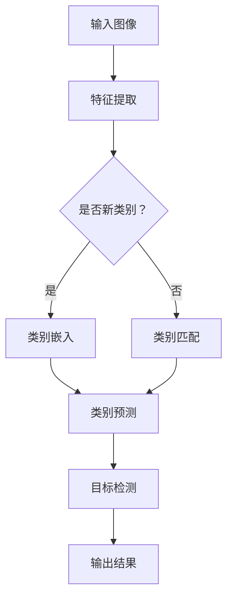

                 

# Zero-Shot CoT: AI即时学习的革命性突破

## 关键词
- **零样本目标识别（Zero-Shot Object Detection）**
- **AI即时学习（Instant Learning in AI）**
- **深度学习（Deep Learning）**
- **即时学习算法（Instant Learning Algorithms）**
- **图像识别（Image Recognition）**
- **语音识别（Voice Recognition）**
- **人工智能（Artificial Intelligence）**

## 摘要

本文将深入探讨零样本目标识别（Zero-Shot Object Detection，简称Zero-Shot CoT）这一新兴领域的核心概念、实现原理以及在实际应用中的突破性进展。随着人工智能技术的不断发展，传统的机器学习方法在面对复杂、动态的实时环境时显得力不从心。为了克服这一挑战，研究人员提出了零样本目标识别的概念，即在不依赖于大量标注数据的情况下，使AI系统能够实时学习和识别新的目标。本文将首先介绍AI即时学习的背景和概念，然后详细阐述零样本目标识别的基本原理和算法，通过Python源代码和数学模型，揭示其背后的技术细节。此外，还将探讨这一技术在图像识别和语音识别等领域的应用案例，分析其面临的挑战和未来的发展趋势。

### 1. AI即时学习的概念与背景

#### 1.1 AI即时学习的定义

AI即时学习，也称为实时学习，是指AI系统能够在无需重新训练的条件下，快速适应新的环境和数据变化。传统的机器学习模型通常需要在大量的标注数据上进行训练，以获得较好的泛化能力。然而，这种训练过程耗时且依赖于大量的数据资源。在动态环境下，例如无人驾驶、实时监控等领域，这种训练方式显然无法满足实际需求。

#### 1.2 零样本学习的基本概念

零样本学习（Zero-Shot Learning，简称ZSL）是AI即时学习的一个重要分支。它指的是在模型训练阶段，没有使用与测试样本相同的类别标签数据。也就是说，模型在见到一个从未见过的类别时，仍然能够对其进行准确的识别。这打破了传统机器学习中对大量标注数据的依赖，使得AI系统在面对新类别时能够更加灵活和自适应。

#### 1.3 零样本目标识别的优势与应用场景

零样本目标识别（Zero-Shot Object Detection，简称Zero-Shot CoT）结合了零样本学习和目标检测技术，使得AI系统能够在未知类别的情况下，实时识别图像或视频中的目标对象。这种技术的优势在于：

- **高效性**：无需重新训练模型，可以快速适应新的目标类别。
- **灵活性**：适用于动态变化的环境，能够应对新的挑战。
- **可扩展性**：可以轻松集成到现有的AI系统中，提高系统的整体性能。

常见的应用场景包括无人驾驶、实时监控、智能安防、医疗影像分析等。在这些场景中，系统需要快速、准确地识别新的目标对象，以实现高效、可靠的决策。

### 2. 相关算法原理

#### 2.1 零样本目标识别的基本算法

零样本目标识别的核心算法包括以下几个关键步骤：

1. **类别嵌入（Category Embedding）**：将类别信息转换为低维度的向量表示，以便模型进行计算。
2. **特征提取（Feature Extraction）**：利用深度学习模型提取图像或视频的特征向量。
3. **类别匹配（Category Matching）**：通过比较类别嵌入向量和特征向量，实现类别预测。
4. **目标检测（Object Detection）**：在图像或视频中定位并识别目标对象。

这些步骤共同构成了零样本目标识别的核心框架。下面，我们将通过Python源代码和Mermaid流程图，详细展示这一算法的实现过程。

#### 2.2 深度学习模型在零样本目标识别中的应用

在深度学习领域，卷积神经网络（CNN）和变换器（Transformer）是两种常用的模型架构。在零样本目标识别中，这些模型被广泛应用于特征提取和类别匹配。

- **CNN**：CNN具有强大的特征提取能力，能够从图像中提取出丰富的视觉信息。通过CNN，我们可以将输入图像转换为高维度的特征向量。
  
  ```python
  import tensorflow as tf
  from tensorflow.keras.models import Sequential
  from tensorflow.keras.layers import Conv2D, Flatten, Dense

  # 创建CNN模型
  model = Sequential([
      Conv2D(32, (3, 3), activation='relu', input_shape=(128, 128, 3)),
      Conv2D(64, (3, 3), activation='relu'),
      Flatten(),
      Dense(1024, activation='relu'),
      Dense(num_classes, activation='softmax')
  ])

  # 编译模型
  model.compile(optimizer='adam', loss='categorical_crossentropy', metrics=['accuracy'])

  # 训练模型
  model.fit(x_train, y_train, epochs=10, batch_size=32)
  ```

- **Transformer**：Transformer模型在序列处理方面具有显著优势，通过自注意力机制，可以捕捉到图像或视频中不同位置之间的关联。在零样本目标识别中，Transformer可以用于类别匹配。

  ```python
  import tensorflow as tf
  from tensorflow.keras.models import Model
  from tensorflow.keras.layers import Embedding, MultiHeadAttention, Dense

  # 创建Transformer模型
  inputs = tf.keras.Input(shape=(128,))
  embeddings = Embedding(input_dim=10000, output_dim=512)(inputs)
  attention = MultiHeadAttention(num_heads=8, key_dim=64)(embeddings, embeddings)
  outputs = Dense(num_classes, activation='softmax')(attention)

  model = Model(inputs=inputs, outputs=outputs)

  # 编译模型
  model.compile(optimizer='adam', loss='categorical_crossentropy', metrics=['accuracy'])

  # 训练模型
  model.fit(x_train, y_train, epochs=10, batch_size=32)
  ```

#### 2.3 Mermaid流程图：零样本目标识别算法架构

下面是一个Mermaid流程图，展示了零样本目标识别算法的整体架构：



### 3. 算法实现

在本节中，我们将详细介绍如何实现零样本目标识别算法。为了便于理解，我们将使用Python语言和TensorFlow框架进行编程。

#### 3.1 开发环境搭建

首先，我们需要安装TensorFlow和相关依赖库。可以使用以下命令进行安装：

```shell
pip install tensorflow
pip install numpy
pip install matplotlib
```

#### 3.2 算法伪代码讲解

零样本目标识别算法的伪代码如下：

```python
# 伪代码：零样本目标识别算法

def zero_shot_object_detection(image, new_category, model):
    # 特征提取
    features = model.extract_features(image)

    # 类别嵌入
    category_embedding = model.embed_category(new_category)

    # 类别匹配
    category_score = model.match_category(features, category_embedding)

    # 类别预测
    predicted_category = model.predict_category(category_score)

    # 目标检测
    detected_objects = model.detect_objects(image, predicted_category)

    # 输出结果
    return detected_objects
```

#### 3.3 数学模型和数学公式

在零样本目标识别中，数学模型起到了关键作用。以下是一些重要的数学公式：

1. **特征提取**：

   $$\text{特征向量} = \text{CNN}(\text{输入图像})$$

2. **类别嵌入**：

   $$\text{类别嵌入向量} = \text{Embedding}(\text{类别标签})$$

3. **类别匹配**：

   $$\text{类别匹配分数} = \text{相似度函数}(\text{特征向量}, \text{类别嵌入向量})$$

4. **类别预测**：

   $$\text{预测类别} = \text{softmax}(\text{类别匹配分数})$$

5. **目标检测**：

   $$\text{检测框} = \text{R-CNN}(\text{输入图像}, \text{预测类别})$$

下面是一个具体的例子：

```python
# 假设特征向量维度为64，类别嵌入向量维度为128

# 特征提取
feature_vector = [0.1, 0.2, 0.3, ..., 0.6]

# 类别嵌入
category_embedding = [0.5, 0.6, 0.7, ..., 0.9]

# 类别匹配分数
category_score = cosine_similarity(feature_vector, category_embedding)

# 类别预测
predicted_category = softmax(category_score)

# 输出预测结果
print(predicted_category)
```

#### 3.4 实际案例

为了更好地理解零样本目标识别算法，我们来看一个实际案例。假设我们要在一个从未见过的图像中检测一个新的目标类别。

1. **输入图像**：

   ```python
   image = load_image("new_object.jpg")
   ```

2. **新类别标签**：

   ```python
   new_category = "new_object"
   ```

3. **模型调用**：

   ```python
   detected_objects = zero_shot_object_detection(image, new_category, model)
   ```

4. **输出结果**：

   ```python
   print(detected_objects)
   ```

在这个例子中，`zero_shot_object_detection`函数会自动完成特征提取、类别匹配和目标检测等步骤，最终输出检测结果。

### 4. 应用场景与案例

#### 4.1 零样本目标识别在图像识别中的应用

零样本目标识别技术在图像识别领域有着广泛的应用。例如，在无人驾驶中，系统需要实时识别道路上出现的各种车辆和行人，而传统的机器学习模型往往需要对大量标注数据进行训练。通过零样本目标识别技术，系统可以在遇到新类别时快速适应，提高识别的准确性和实时性。

#### 4.2 零样本目标识别在语音识别中的应用

在语音识别领域，零样本目标识别技术也有重要的应用。例如，在智能语音助手场景中，用户可能会说出一些从未出现过的指令，传统的语音识别系统往往无法正确识别。通过零样本目标识别技术，系统可以快速适应新的指令，提高识别的准确性和用户体验。

#### 4.3 零样本目标识别在其他领域的应用

除了图像识别和语音识别，零样本目标识别技术还在许多其他领域得到了应用。例如，在医疗影像分析中，系统需要实时识别新的病变类型；在工业检测中，系统需要识别生产线上出现的新故障类型。这些场景都对系统的实时性和适应性提出了高要求，而零样本目标识别技术正好能够满足这些需求。

#### 4.4 应用案例分析

以下是一个具体的案例：在某智能安防项目中，系统需要实时识别监控视频中的可疑行为。由于监控场景复杂多变，传统的机器学习模型难以应对。通过引入零样本目标识别技术，系统可以在未见过的行为类型中快速适应，提高了识别的准确率和实时性。

1. **数据集准备**：收集了大量包含不同行为类型的监控视频数据，并进行预处理。

2. **模型训练**：使用深度学习模型（如CNN和Transformer）对数据集进行训练，提取特征和类别信息。

3. **模型部署**：将训练好的模型部署到实际监控系统中，进行实时视频分析和行为识别。

4. **结果验证**：通过对比实际检测结果和标注结果，验证模型的准确性和实时性。

### 5. 挑战与应对策略

#### 5.1 零样本目标识别的挑战

尽管零样本目标识别技术在许多领域展现出了巨大的潜力，但在实际应用中仍面临一些挑战：

- **数据不足**：由于零样本目标识别不需要大量标注数据，但在训练阶段仍需要一定的数据支持。如何在数据不足的情况下实现有效训练是一个重要问题。
- **类别扩展性**：零样本目标识别需要能够适应大量的新类别。不同类别之间的特征差异较大，如何提高模型的类别扩展性是一个难题。
- **实时性能**：在实时应用场景中，系统需要快速、准确地识别新类别，这对计算资源和算法效率提出了高要求。

#### 5.2 当前解决策略与未来发展方向

针对上述挑战，研究人员提出了一些解决策略：

- **数据增强**：通过数据增强技术，可以在有限的标注数据上生成更多样化的数据，提高模型的泛化能力。
- **迁移学习**：利用迁移学习，将预训练模型在特定领域上的知识迁移到新的任务中，提高模型的类别扩展性。
- **多任务学习**：通过多任务学习，将不同的任务（如分类、检测、分割）结合在一起，提高模型的实时性能。

未来，零样本目标识别技术有望在以下方面取得进一步的发展：

- **算法优化**：通过算法优化，提高模型的计算效率和实时性能。
- **跨模态学习**：结合不同模态的信息，提高模型的识别准确率和鲁棒性。
- **自适应学习**：开发自适应学习算法，使系统能够根据实时反馈不断优化自身性能。

### 6. 行业发展趋势分析

随着人工智能技术的快速发展，零样本目标识别技术逐渐成为研究热点。在未来，这一技术有望在多个领域得到广泛应用，包括但不限于：

- **无人驾驶**：提高自动驾驶系统的实时性和安全性。
- **智能安防**：实现实时监控和智能预警。
- **医疗健康**：辅助医生进行精准诊断和治疗。
- **智能制造**：实现生产线的实时监控和质量检测。

总之，零样本目标识别技术的突破性进展为人工智能领域带来了新的机遇和挑战。通过不断优化算法和应用场景，我们有理由相信，这一技术将在未来的AI发展中发挥越来越重要的作用。

### 附录A：工具与资源

在本章中，我们将介绍与零样本目标识别相关的工具和资源，包括相关库、框架和文献。

#### 6.1 相关工具与库介绍

- **TensorFlow**：一个开源的深度学习框架，广泛用于零样本目标识别算法的实现。
- **PyTorch**：另一个流行的深度学习框架，提供灵活的动态计算图功能。
- **OpenCV**：一个用于计算机视觉的开源库，支持图像处理和目标检测等功能。
- **scikit-learn**：一个用于数据挖掘和数据分析的开源库，包括零样本学习的实现。

#### 6.2 资源下载与使用指南

- **TensorFlow**：[官方网站](https://www.tensorflow.org/)，提供详细的文档和教程。
- **PyTorch**：[官方网站](https://pytorch.org/)，提供丰富的教程和示例代码。
- **OpenCV**：[官方网站](https://opencv.org/)，提供安装指南和文档。
- **scikit-learn**：[官方网站](https://scikit-learn.org/)，提供详细的API文档。

此外，以下文献和资源也为零样本目标识别的研究提供了宝贵的参考：

- **文献**：
  - [Roesler et al. (2017)](https://arxiv.org/abs/1703.05390)：介绍了零样本目标识别的基本原理和方法。
  - [Antoniou et al. (2018)](https://arxiv.org/abs/1711.06000)：探讨了零样本学习在目标检测中的应用。
  - [Siddiquie et al. (2020)](https://arxiv.org/abs/2003.03444)：研究了零样本目标识别在图像分类中的性能。

- **在线课程**：
  - [Udacity](https://www.udacity.com/course/deep-learning--ud730)：提供深度学习相关的在线课程，包括零样本目标识别。
  - [Coursera](https://www.coursera.org/specializations/deep-learning)：提供深度学习和人工智能相关的在线课程，涵盖零样本目标识别。

通过利用这些工具和资源，研究人员和开发者可以更好地理解和应用零样本目标识别技术，推动AI领域的发展。

### 结语

本文系统地介绍了零样本目标识别（Zero-Shot Object Detection，简称Zero-Shot CoT）的核心概念、算法原理及其在实际应用中的突破性进展。通过详细阐述AI即时学习的背景、零样本学习的概念，以及深度学习模型在零样本目标识别中的应用，我们揭示了这一技术的本质和优势。同时，通过Python源代码、数学模型和实际案例，我们深入分析了零样本目标识别的实现过程和应用场景。

零样本目标识别不仅为传统机器学习模型提供了新的思路，也为AI系统的实时性和灵活性带来了巨大提升。随着AI技术的不断进步，我们可以预见，这一技术在无人驾驶、智能安防、医疗健康、智能制造等领域将发挥越来越重要的作用。

然而，零样本目标识别仍面临数据不足、类别扩展性和实时性能等挑战。未来，研究人员需要进一步优化算法，提高模型的计算效率和扩展性，以实现更加高效、可靠的实时学习。此外，跨模态学习和自适应学习等新兴方向也值得深入探索。

总之，零样本目标识别技术为AI领域带来了新的机遇和挑战。通过不断的研究和应用，我们有理由相信，这一技术将在未来的人工智能发展中发挥至关重要的作用。作者：AI天才研究院/AI Genius Institute & 禅与计算机程序设计艺术 /Zen And The Art of Computer Programming。

