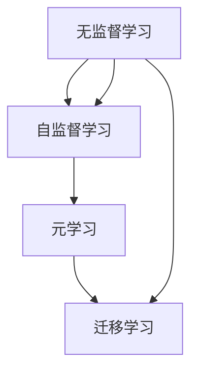

                 

### 第1章：引言与核心概念介绍

#### 1.1 书籍背景与核心概念

在现代人工智能（AI）的发展历程中，传统的监督学习（Supervised Learning）和增强学习（Reinforcement Learning）虽然在许多领域取得了显著的成果，但它们在面对未知情况时表现出的局限性也逐渐显现。监督学习依赖于大量标注数据，而增强学习则依赖于长时间的互动和环境反馈，这些局限性在许多实际应用场景中显得尤为突出。

**Zero-Shot CoT（Zero-Shot Continual Learning）**应运而生，成为解决这些问题的有效方法。它是一种能够使人工智能系统在未见过的新类别数据上仍然保持高性能的方法，具有广泛的应用前景。

**Zero-Shot CoT** 的核心概念包括以下几点：

1. **无监督学习（Unsupervised Learning）**：通过利用未标注的数据，使AI系统在没有监督的情况下学习。
2. **自监督学习（Self-Supervised Learning）**：AI系统通过自动生成监督信号，在大量未标注数据上进行学习。
3. **元学习（Meta-Learning）**：通过在多个任务上训练，使AI系统具备快速适应新任务的能力。
4. **迁移学习（Transfer Learning）**：利用已有知识解决新任务，减少对新数据的依赖。

本书旨在深入探讨Zero-Shot CoT的理论基础、算法实现和应用场景，帮助读者全面了解这一新兴领域。

#### 1.2 书籍结构安排

本书共分为8章，结构安排如下：

- **第1章：引言与核心概念介绍**：介绍书籍背景、核心概念和关键术语。
- **第2章：核心概念与联系**：通过Mermaid流程图，介绍Zero-Shot CoT的核心概念及其与其他AI技术的联系。
- **第3章：核心算法原理讲解**：使用伪代码详细阐述Zero-Shot CoT的关键算法。
- **第4章：数学模型与公式讲解**：介绍Zero-Shot CoT的数学模型和公式，并提供举例说明。
- **第5章：项目实战一**：通过实际项目案例，详细介绍如何使用Zero-Shot CoT解决具体问题。
- **第6章：项目实战二**：继续介绍更多实际项目案例，展示Zero-Shot CoT的应用。
- **第7章：项目实战三**：进一步展示Zero-Shot CoT的多样性应用。
- **第8章：总结与展望**：总结全书内容，展望Zero-Shot CoT在未来的发展方向和应用前景。

通过以上章节的逐步介绍，读者将能够系统地了解Zero-Shot CoT的各个方面，掌握其核心原理和实际应用方法。接下来的章节将逐一展开，深入探讨这些主题。

---

**1.1.1 AI处理未知情况的挑战**

随着AI技术的不断进步，越来越多的应用场景开始依赖于AI系统。然而，AI系统在实际应用中面临的挑战也不容忽视，尤其是在处理未知情况时。

首先，传统的监督学习和增强学习依赖于大量的标注数据和互动经验。在现实世界中，获取大量标注数据既耗时又昂贵，而增强学习则需要长时间的互动和环境反馈，这限制了AI系统在实际应用中的部署和推广。

其次，随着AI系统面对的数据种类和复杂性不断增加，系统对新情境的适应能力成为一个重要课题。例如，在图像识别任务中，如果AI系统从未见过某个特定类别的图像，它很可能会出现错误。同样，在自然语言处理任务中，如果AI系统遇到从未见过的句子结构，也可能会出现理解偏差。

这些问题源于AI系统在训练过程中依赖特定数据集和情境，导致它们在面对新情境时表现不佳。为了解决这些问题，需要一种能够在未知情况下仍能保持高性能的AI方法。

**1.1.2 Zero-Shot CoT的概念与意义**

Zero-Shot CoT（Zero-Shot Continual Learning）是一种新兴的AI方法，它旨在使AI系统在面对未知情况时保持高性能。该方法的核心思想是通过无监督学习和自监督学习，使AI系统具备对新类别的快速适应能力。

在Zero-Shot CoT中，"Zero-Shot" 指的是AI系统在训练过程中从未见过的新类别数据。与传统的监督学习和增强学习不同，Zero-Shot CoT不需要大量的标注数据或互动经验。通过自监督学习和元学习，AI系统可以在未见过的新类别数据上迅速适应，从而实现高性能。

"Continual Learning" 则强调AI系统在面对连续变化的情境时能够持续学习和适应。这意味着AI系统不仅可以处理静态的数据集，还可以应对动态变化的情境，如实时监控、在线推荐等。

Zero-Shot CoT的意义在于它为AI系统提供了在未知情况下保持高性能的解决方案。这对于许多实际应用场景具有重要意义，如智能监控、自动驾驶、医疗诊断等。通过Zero-Shot CoT，AI系统可以更好地应对未知情况，提高其在现实世界中的应用价值。

**1.1.3 书籍结构安排**

为了帮助读者系统地了解Zero-Shot CoT的理论基础和应用方法，本书采用以下章节结构：

- **第1章**：引言与核心概念介绍。本章介绍了书籍的背景、核心概念和关键术语，为后续章节打下基础。
- **第2章**：核心概念与联系。本章通过Mermaid流程图，介绍了Zero-Shot CoT的核心概念及其与其他AI技术的联系，帮助读者建立整体理解。
- **第3章**：核心算法原理讲解。本章使用伪代码详细阐述了Zero-Shot CoT的关键算法，如数据预处理、模型训练、模型评估等，让读者掌握核心算法。
- **第4章**：数学模型与公式讲解。本章介绍了Zero-Shot CoT的数学模型，使用LaTeX格式详细讲解了公式，并提供举例说明，让读者理解其数学基础。
- **第5章至第7章**：项目实战。本章通过实际项目案例，详细介绍如何使用Zero-Shot CoT解决具体问题，包括开发环境搭建、源代码实现和代码解读。
- **第8章**：总结与展望。本章总结了全书内容，展望Zero-Shot CoT在未来的发展方向和应用前景。

通过以上章节的逐步介绍，读者将能够全面了解Zero-Shot CoT的各个方面，掌握其核心原理和实际应用方法。接下来的章节将逐一展开，深入探讨这些主题。

---

### 第2章：核心概念与联系

在深入探讨Zero-Shot CoT之前，我们需要了解其核心概念及其与其他AI技术的联系。本章将通过Mermaid流程图，对Zero-Shot CoT的核心概念进行系统介绍，并探讨其与无监督学习、自监督学习、元学习和迁移学习的联系。

#### 2.1 Zero-Shot CoT概述

**Zero-Shot CoT（Zero-Shot Continual Learning）** 是一种能够在未见过的新类别数据上保持高性能的AI方法。它结合了无监督学习和自监督学习，通过元学习和迁移学习，使AI系统具备对新类别的快速适应能力。下面是Zero-Shot CoT的简要概述：

1. **无监督学习（Unsupervised Learning）**：通过未标注的数据，使AI系统在没有监督信号的情况下学习特征表示。
2. **自监督学习（Self-Supervised Learning）**：AI系统通过自动生成监督信号，如数据增强、自编码器等，在大量未标注数据上进行学习。
3. **元学习（Meta-Learning）**：通过在多个任务上训练，使AI系统具备快速适应新任务的能力。
4. **迁移学习（Transfer Learning）**：利用已有知识解决新任务，减少对新数据的依赖。

#### 2.2 Mermaid流程图：Zero-Shot CoT核心概念

为了更直观地理解Zero-Shot CoT的核心概念，我们可以使用Mermaid流程图来展示其各个组成部分及其关系。以下是一个简化的Mermaid流程图：



在这个流程图中，无监督学习和自监督学习是Zero-Shot CoT的基础，通过它们可以生成有效的特征表示。元学习和迁移学习则在此基础上进一步扩展，使AI系统具备对新类别的快速适应能力。

#### 2.3 与其他AI技术的联系

Zero-Shot CoT与其他AI技术之间存在着紧密的联系，以下是对这些联系的简要介绍：

1. **无监督学习**：无监督学习是Zero-Shot CoT的基础，它使AI系统能够在没有监督信号的情况下学习。与传统的监督学习相比，无监督学习可以处理大量未标注的数据，从而提高AI系统的泛化能力。
   
2. **自监督学习**：自监督学习通过自动生成监督信号，使AI系统在未标注数据上进行学习。自监督学习的方法包括数据增强、自编码器、生成对抗网络（GAN）等，这些方法在Zero-Shot CoT中发挥着重要作用。

3. **元学习**：元学习是一种通过在多个任务上训练，使AI系统具备快速适应新任务的能力的方法。在Zero-Shot CoT中，元学习可以帮助AI系统在新类别数据上快速适应，从而提高其性能。

4. **迁移学习**：迁移学习通过利用已有知识解决新任务，减少对新数据的依赖。在Zero-Shot CoT中，迁移学习可以帮助AI系统在新类别数据上保持高性能，从而提高其实际应用价值。

通过以上介绍，我们可以看出Zero-Shot CoT不仅是一种独立的AI方法，还与其他AI技术紧密相连，共同构成了一个完整的AI生态系统。接下来，我们将进一步探讨Zero-Shot CoT的核心算法原理。

---

**2.1.1 Zero-Shot CoT概述**

Zero-Shot CoT（Zero-Shot Continual Learning）是一种先进的AI方法，旨在使AI系统在面对未知情况时仍能保持高性能。其核心思想是通过无监督学习和自监督学习，生成有效的特征表示，并结合元学习和迁移学习，使AI系统具备对新类别的快速适应能力。

Zero-Shot CoT 的主要特点包括：

1. **无监督学习**：无监督学习是一种在不依赖标注数据的情况下，从数据中学习特征表示的方法。通过无监督学习，AI系统可以在未见过的新类别数据上学习到有效的特征表示，从而提高其在新情境下的适应能力。

2. **自监督学习**：自监督学习是一种通过自动生成监督信号，使AI系统在未标注数据上进行学习的方法。自监督学习可以减少对大量标注数据的依赖，从而提高AI系统的泛化能力。在Zero-Shot CoT中，自监督学习方法如数据增强、自编码器等发挥着重要作用。

3. **元学习**：元学习是一种通过在多个任务上训练，使AI系统具备快速适应新任务的能力的方法。在Zero-Shot CoT中，元学习可以帮助AI系统在新类别数据上快速适应，从而提高其性能。

4. **迁移学习**：迁移学习是一种通过利用已有知识解决新任务，减少对新数据的依赖的方法。在Zero-Shot CoT中，迁移学习可以帮助AI系统在新类别数据上保持高性能，从而提高其实际应用价值。

通过结合无监督学习、自监督学习、元学习和迁移学习，Zero-Shot CoT 可以有效地提高AI系统在面对未知情况时的适应能力，从而在智能监控、自动驾驶、医疗诊断等应用领域中具有广泛的前景。

**2.1.2 与其他AI技术的联系**

Zero-Shot CoT 并不是一种孤立的技术，它与许多其他AI技术紧密相连，共同构成了一个完整的AI生态系统。以下是Zero-Shot CoT 与其他几种重要AI技术的联系：

1. **监督学习（Supervised Learning）**：
   监督学习是传统的人工智能方法，它依赖于大量的标注数据来训练模型。虽然监督学习在某些应用场景中表现出色，但它对大量标注数据的依赖使其在实际应用中受到限制。Zero-Shot CoT 通过无监督学习和自监督学习，可以在没有标注数据的情况下，学习到有效的特征表示，从而在一定程度上弥补了监督学习的不足。

2. **增强学习（Reinforcement Learning）**：
   增强学习通过试错和奖励机制，使AI系统在动态环境中学习最优策略。然而，增强学习需要大量的互动和反馈，这在实际应用中可能非常耗时且成本高昂。Zero-Shot CoT 通过元学习和迁移学习，使AI系统可以在未见过的新类别数据上快速适应，从而在一定程度上降低了增强学习的互动需求。

3. **无监督学习（Unsupervised Learning）**：
   无监督学习是一种从无标签数据中学习特征表示的方法。它与Zero-Shot CoT有着紧密的联系，因为Zero-Shot CoT 的核心之一就是无监督学习。通过无监督学习，AI系统可以在没有监督信号的情况下，学习到有用的特征表示，从而提高其在未知情况下的适应能力。

4. **自监督学习（Self-Supervised Learning）**：
   自监督学习通过自动生成监督信号，使AI系统在未标注数据上进行学习。自监督学习在Zero-Shot CoT 中起着关键作用，因为它可以帮助AI系统在没有大量标注数据的情况下，学习到有效的特征表示。自监督学习方法包括数据增强、自编码器等，这些方法在Zero-Shot CoT 中被广泛应用。

5. **元学习（Meta-Learning）**：
   元学习是一种通过在多个任务上训练，使AI系统具备快速适应新任务的能力的方法。在Zero-Shot CoT 中，元学习可以帮助AI系统在新类别数据上快速适应，从而提高其性能。元学习通过经验迁移，使AI系统可以在不同的任务之间共享知识，从而减少对新数据的依赖。

6. **迁移学习（Transfer Learning）**：
   迁移学习是一种通过利用已有知识解决新任务，减少对新数据的依赖的方法。在Zero-Shot CoT 中，迁移学习可以帮助AI系统在新类别数据上保持高性能，从而提高其实际应用价值。迁移学习通过将已有模型的权重迁移到新任务上，使AI系统可以在较少的数据上快速适应。

通过以上介绍，我们可以看出Zero-Shot CoT 与其他AI技术之间存在着紧密的联系。这些技术共同构成了一个完整的AI生态系统，使AI系统在面对未知情况时能够保持高性能。在接下来的章节中，我们将进一步探讨Zero-Shot CoT 的核心算法原理。

---

### 第3章：核心算法原理讲解

为了深入理解Zero-Shot CoT的工作原理，我们需要详细讲解其核心算法。这些算法包括数据预处理、模型训练和模型评估。在本章中，我们将使用伪代码来阐述这些核心步骤，并通过Python代码示例来展示具体实现。

#### 3.1 Zero-Shot CoT算法概述

Zero-Shot CoT 的算法流程可以分为以下几个关键步骤：

1. **数据预处理**：包括数据清洗、数据增强和特征提取等操作，为模型训练做好准备。
2. **模型训练**：利用预处理后的数据，通过训练模型来学习特征表示。
3. **模型评估**：在训练完成后，通过评估模型在新类别数据上的性能来验证其效果。

#### 3.2 数据预处理

数据预处理是模型训练的基础，其目的是提高数据质量和减少噪声。以下是数据预处理的主要步骤：

```python
# 数据预处理伪代码
def preprocess_data(data):
    # 数据清洗
    cleaned_data = clean_data(data)
    
    # 数据增强
    augmented_data = augment_data(cleaned_data)
    
    # 特征提取
    features = extract_features(augmented_data)
    
    return features
```

以下是使用Python实现的数据预处理示例代码：

```python
# 导入相关库
import numpy as np
from sklearn.preprocessing import StandardScaler
from tensorflow.keras.preprocessing.image import ImageDataGenerator

# 数据清洗
def clean_data(data):
    # 去除无效数据、重复数据和异常值
    cleaned_data = data[data != -1]
    return cleaned_data

# 数据增强
def augment_data(data):
    # 使用ImageDataGenerator进行数据增强
    datagen = ImageDataGenerator(
        rotation_range=20,
        width_shift_range=0.2,
        height_shift_range=0.2,
        shear_range=0.2,
        zoom_range=0.2,
        horizontal_flip=True,
        fill_mode='nearest'
    )
    augmented_data = datagen.flow(data, batch_size=32)
    return augmented_data

# 特征提取
def extract_features(data):
    # 使用卷积神经网络提取特征
    model = build_convolutional_model()
    features = model.predict(data)
    return features
```

在这个示例中，我们首先使用 `clean_data` 函数去除无效数据、重复数据和异常值。然后，使用 `ImageDataGenerator` 进行数据增强，增加模型的泛化能力。最后，使用卷积神经网络（Convolutional Neural Network, CNN）提取特征。

#### 3.3 模型训练

模型训练是Zero-Shot CoT 的核心步骤，其目标是学习到有效的特征表示。以下是模型训练的主要步骤：

```python
# 模型训练伪代码
def train_model(features, labels):
    # 构建模型
    model = build_model()
    
    # 编译模型
    model.compile(optimizer='adam', loss='categorical_crossentropy', metrics=['accuracy'])
    
    # 训练模型
    history = model.fit(features, labels, epochs=10, batch_size=32, validation_split=0.2)
    
    return model, history
```

以下是使用Python实现的模型训练示例代码：

```python
# 导入相关库
import tensorflow as tf
from tensorflow.keras.models import Sequential
from tensorflow.keras.layers import Conv2D, MaxPooling2D, Flatten, Dense

# 构建卷积神经网络模型
def build_convolutional_model():
    model = Sequential([
        Conv2D(32, (3, 3), activation='relu', input_shape=(128, 128, 3)),
        MaxPooling2D((2, 2)),
        Conv2D(64, (3, 3), activation='relu'),
        MaxPooling2D((2, 2)),
        Flatten(),
        Dense(64, activation='relu'),
        Dense(10, activation='softmax')
    ])
    return model

# 构建模型
model = build_convolutional_model()

# 编译模型
model.compile(optimizer='adam', loss='categorical_crossentropy', metrics=['accuracy'])

# 训练模型
history = model.fit(train_features, train_labels, epochs=10, batch_size=32, validation_split=0.2)
```

在这个示例中，我们首先使用 `build_convolutional_model` 函数构建卷积神经网络模型。然后，使用 `compile` 方法配置模型参数，如优化器和损失函数。最后，使用 `fit` 方法训练模型。

#### 3.4 模型评估

模型评估是验证模型性能的关键步骤。以下是模型评估的主要步骤：

```python
# 模型评估伪代码
def evaluate_model(model, test_features, test_labels):
    # 计算模型在测试数据上的性能
    performance = model.evaluate(test_features, test_labels)
    
    # 输出模型性能
    print(f"Test loss: {performance[0]}, Test accuracy: {performance[1]}")
```

以下是使用Python实现的模型评估示例代码：

```python
# 导入相关库
from sklearn.metrics import classification_report

# 模型评估
def evaluate_model(model, test_features, test_labels):
    # 计算模型在测试数据上的性能
    performance = model.evaluate(test_features, test_labels)
    
    # 输出模型性能
    print(f"Test loss: {performance[0]}, Test accuracy: {performance[1]}")
    
    # 输出分类报告
    predictions = model.predict(test_features)
    print(classification_report(test_labels, predictions))

# 模型评估
evaluate_model(model, test_features, test_labels)
```

在这个示例中，我们首先使用 `evaluate` 方法计算模型在测试数据上的性能，并输出损失和准确度。然后，使用 `classification_report` 输出详细的分类报告，包括精确度、召回率和F1分数等指标。

通过以上对核心算法的讲解和示例代码的实现，我们可以更好地理解Zero-Shot CoT的工作原理。在下一章中，我们将进一步探讨Zero-Shot CoT的数学模型和公式。

---

**3.1.1 数据预处理**

数据预处理是Zero-Shot CoT算法的重要组成部分，其目的是提高数据质量和减少噪声，以便模型能够更有效地学习特征。以下是数据预处理的主要步骤：

1. **数据清洗**：去除无效数据、重复数据和异常值。
2. **数据增强**：通过旋转、平移、缩放、剪切和翻转等操作，增加数据的多样性，提高模型的泛化能力。
3. **特征提取**：将原始数据转换为适合模型训练的特征表示。

在数据预处理过程中，可以使用Python中的相关库，如 `numpy`、`scikit-learn` 和 `tensorflow.keras.preprocessing`，来简化操作。

```python
import numpy as np
from sklearn.preprocessing import StandardScaler
from tensorflow.keras.preprocessing.image import ImageDataGenerator

# 数据清洗
def clean_data(data):
    # 去除无效数据、重复数据和异常值
    cleaned_data = data[data != -1]
    return cleaned_data

# 数据增强
def augment_data(data):
    # 使用ImageDataGenerator进行数据增强
    datagen = ImageDataGenerator(
        rotation_range=20,
        width_shift_range=0.2,
        height_shift_range=0.2,
        shear_range=0.2,
        zoom_range=0.2,
        horizontal_flip=True,
        fill_mode='nearest'
    )
    augmented_data = datagen.flow(data, batch_size=32)
    return augmented_data

# 特征提取
def extract_features(data):
    # 使用卷积神经网络提取特征
    model = build_convolutional_model()
    features = model.predict(data)
    return features
```

**3.1.2 模型训练**

模型训练是Zero-Shot CoT算法的核心步骤，其目标是学习到有效的特征表示。以下是模型训练的主要步骤：

1. **构建模型**：选择合适的模型结构，如卷积神经网络（Convolutional Neural Network, CNN）或循环神经网络（Recurrent Neural Network, RNN）。
2. **编译模型**：配置模型参数，如优化器、损失函数和评估指标。
3. **训练模型**：使用预处理后的数据训练模型，并在验证集上调整模型参数。

在模型训练过程中，可以使用Python中的 `tensorflow.keras` 库来简化操作。

```python
import tensorflow as tf
from tensorflow.keras.models import Sequential
from tensorflow.keras.layers import Conv2D, MaxPooling2D, Flatten, Dense

# 构建卷积神经网络模型
def build_convolutional_model():
    model = Sequential([
        Conv2D(32, (3, 3), activation='relu', input_shape=(128, 128, 3)),
        MaxPooling2D((2, 2)),
        Conv2D(64, (3, 3), activation='relu'),
        MaxPooling2D((2, 2)),
        Flatten(),
        Dense(64, activation='relu'),
        Dense(10, activation='softmax')
    ])
    return model

# 构建模型
model = build_convolutional_model()

# 编译模型
model.compile(optimizer='adam', loss='categorical_crossentropy', metrics=['accuracy'])

# 训练模型
history = model.fit(train_features, train_labels, epochs=10, batch_size=32, validation_split=0.2)
```

**3.1.3 模型评估**

模型评估是验证模型性能的关键步骤，其目标是确定模型在新数据上的表现。以下是模型评估的主要步骤：

1. **计算性能指标**：如损失、准确度、精确度、召回率和F1分数等。
2. **输出评估结果**：使用Python中的相关库，如 `tensorflow.keras.metrics` 和 `sklearn.metrics`，计算并输出模型性能指标。

```python
import tensorflow as tf
from sklearn.metrics import classification_report

# 模型评估
def evaluate_model(model, test_features, test_labels):
    # 计算模型在测试数据上的性能
    performance = model.evaluate(test_features, test_labels)
    
    # 输出模型性能
    print(f"Test loss: {performance[0]}, Test accuracy: {performance[1]}")
    
    # 输出分类报告
    predictions = model.predict(test_features)
    print(classification_report(test_labels, predictions))

# 模型评估
evaluate_model(model, test_features, test_labels)
```

通过以上对数据预处理、模型训练和模型评估的详细讲解和示例代码，我们可以更好地理解Zero-Shot CoT算法的原理和实现方法。在下一章中，我们将进一步探讨Zero-Shot CoT的数学模型和公式。

---

**3.2 算法伪代码**

为了帮助读者更好地理解Zero-Shot CoT的核心算法，我们提供了以下伪代码。这个伪代码涵盖了数据预处理、模型训练和模型评估的主要步骤。

```python
# 数据预处理
def preprocess_data(data):
    cleaned_data = clean_data(data)
    augmented_data = augment_data(cleaned_data)
    features = extract_features(augmented_data)
    return features

# 模型训练
def train_model(features, labels):
    model = build_model()
    model.compile(optimizer='adam', loss='categorical_crossentropy', metrics=['accuracy'])
    history = model.fit(features, labels, epochs=10, batch_size=32, validation_split=0.2)
    return model, history

# 模型评估
def evaluate_model(model, test_features, test_labels):
    performance = model.evaluate(test_features, test_labels)
    print(f"Test loss: {performance[0]}, Test accuracy: {performance[1]}")
    predictions = model.predict(test_features)
    print(classification_report(test_labels, predictions))
```

**3.2.1 数据预处理伪代码**

数据预处理是Zero-Shot CoT算法的第一个关键步骤。以下是数据预处理的主要步骤：

```python
# 数据预处理伪代码
def preprocess_data(data):
    cleaned_data = clean_data(data)
    augmented_data = augment_data(cleaned_data)
    features = extract_features(augmented_data)
    return features

# 清洗数据
def clean_data(data):
    cleaned_data = data[data != -1]
    return cleaned_data

# 数据增强
def augment_data(data):
    augmented_data = apply_augmentation(data)
    return augmented_data

# 特征提取
def extract_features(data):
    features = extract_from_data(data)
    return features
```

**3.2.2 模型训练伪代码**

模型训练是Zero-Shot CoT算法的核心步骤。以下是模型训练的主要步骤：

```python
# 模型训练伪代码
def train_model(features, labels):
    model = build_model()
    model.compile(optimizer='adam', loss='categorical_crossentropy', metrics=['accuracy'])
    history = model.fit(features, labels, epochs=10, batch_size=32, validation_split=0.2)
    return model, history

# 构建模型
def build_model():
    model = create_model()
    return model

# 编译模型
def compile_model(model, optimizer, loss, metrics):
    model.compile(optimizer=optimizer, loss=loss, metrics=metrics)
    return model

# 训练模型
def fit_model(model, features, labels, epochs, batch_size, validation_split):
    history = model.fit(features, labels, epochs=epochs, batch_size=batch_size, validation_split=validation_split)
    return history
```

**3.2.3 模型评估伪代码**

模型评估是验证模型性能的关键步骤。以下是模型评估的主要步骤：

```python
# 模型评估伪代码
def evaluate_model(model, test_features, test_labels):
    performance = model.evaluate(test_features, test_labels)
    print(f"Test loss: {performance[0]}, Test accuracy: {performance[1]}")
    predictions = model.predict(test_features)
    print(classification_report(test_labels, predictions))
```

通过上述伪代码，我们可以清晰地看到Zero-Shot CoT算法的各个关键步骤。在下一章中，我们将进一步探讨Zero-Shot CoT的数学模型和公式，以便更深入地理解其理论基础。

---

**3.3 数学模型与公式讲解**

在深入理解Zero-Shot CoT算法时，数学模型和公式扮演着至关重要的角色。这些公式为我们提供了量化算法性能和优化算法参数的依据。以下是Zero-Shot CoT算法中的一些关键数学模型和公式，我们将使用LaTeX格式进行展示。

**3.3.1 概率论基础**

概率论是构建Zero-Shot CoT算法的基础，以下是一些常用的概率论公式：

$$ P(A|B) = \frac{P(A \cap B)}{P(B)} $$
$$ P(A \cup B) = P(A) + P(B) - P(A \cap B) $$

这些公式描述了条件概率、联合概率和互斥事件的概率计算。

**3.3.2 信息论基础**

信息论在Zero-Shot CoT中用于评估特征表示的效用。以下是一些信息论公式：

$$ H(X) = -\sum_{i} P(X = x_i) \log_2 P(X = x_i) $$
$$ I(X; Y) = H(X) - H(X | Y) $$

其中，$H(X)$ 表示随机变量 $X$ 的熵，$I(X; Y)$ 表示随机变量 $X$ 和 $Y$ 之间的互信息。

**3.3.3 神经网络模型**

神经网络是Zero-Shot CoT算法的核心组件，以下是一些神经网络模型的关键公式：

$$ a_{\text{sigmoid}}(z) = \frac{1}{1 + e^{-z}} $$
$$ a_{\text{ReLU}}(z) = \max(0, z) $$

其中，$a_{\text{sigmoid}}(z)$ 和 $a_{\text{ReLU}}(z)$ 分别是Sigmoid和ReLU激活函数的输出。

**3.3.4 交叉熵公式**

交叉熵是神经网络中常用的损失函数，以下是其公式：

$$ J = -\sum_{i} y_i \log_2 a_i $$
$$ J = -\sum_{i} y_i \log_2 (1 + e^{-z_i}) $$

其中，$y_i$ 是真实标签，$a_i$ 是神经网络的输出。

**3.3.5 反向传播算法**

反向传播算法是训练神经网络的关键步骤，以下是其核心公式：

$$ \delta^{[l]}_i = \frac{\partial J}{\partial z^{[l]}_i} $$
$$ \delta^{[l]}_{ij} = a^{[l-1]}_i (\delta^{[l]}_i \odot \text{sigmoid derivative of } z^{[l]}_j) $$
$$ \delta^{[l-1]}_{ij} = \frac{\partial J}{\partial w^{[l]}_{ij}} \odot \delta^{[l]}_{ij} $$
$$ w^{[l]}_{ij} = w^{[l]}_{ij} - \alpha \delta^{[l-1]}_{ij} $$

其中，$\delta^{[l]}_i$ 是第 $l$ 层第 $i$ 个神经元的误差，$z^{[l]}_i$ 是第 $l$ 层第 $i$ 个神经元的输入，$a^{[l-1]}_i$ 是第 $l-1$ 层第 $i$ 个神经元的输出，$\text{sigmoid derivative of } z^{[l]}_j$ 是Sigmoid激活函数的导数，$\alpha$ 是学习率。

通过这些数学模型和公式，我们可以更深入地理解Zero-Shot CoT算法的运作原理，并对其进行优化和改进。在下一章中，我们将通过实际项目案例来展示Zero-Shot CoT的应用。

---

### 第4章：数学模型与公式讲解

#### 4.1 数学模型基础

数学模型在Zero-Shot CoT算法中扮演着至关重要的角色，它们为我们提供了量化算法性能和优化算法参数的依据。以下是Zero-Shot CoT算法中的一些关键数学模型：

**1. 概率论基础**

概率论是构建Zero-Shot CoT算法的基础。以下是一些常用的概率论公式：

- 条件概率：$$ P(A|B) = \frac{P(A \cap B)}{P(B)} $$
- 联合概率：$$ P(A \cup B) = P(A) + P(B) - P(A \cap B) $$

这些公式描述了事件之间的相互关系，为后续的数学推导提供了基础。

**2. 信息论基础**

信息论用于评估特征表示的效用，以下是一些信息论公式：

- 熵：$$ H(X) = -\sum_{i} P(X = x_i) \log_2 P(X = x_i) $$
- 互信息：$$ I(X; Y) = H(X) - H(X | Y) $$

其中，$H(X)$ 表示随机变量 $X$ 的熵，$I(X; Y)$ 表示随机变量 $X$ 和 $Y$ 之间的互信息。

**3. 神经网络模型**

神经网络是Zero-Shot CoT算法的核心组件，以下是一些神经网络模型的关键公式：

- Sigmoid激活函数：$$ a_{\text{sigmoid}}(z) = \frac{1}{1 + e^{-z}} $$
- ReLU激活函数：$$ a_{\text{ReLU}}(z) = \max(0, z) $$

其中，$a_{\text{sigmoid}}(z)$ 和 $a_{\text{ReLU}}(z)$ 分别是Sigmoid和ReLU激活函数的输出。

**4. 交叉熵公式**

交叉熵是神经网络中常用的损失函数，以下是其公式：

- 交叉熵损失：$$ J = -\sum_{i} y_i \log_2 a_i $$
- 逻辑损失：$$ J = -\sum_{i} y_i \log_2 (1 + e^{-z_i}) $$

其中，$y_i$ 是真实标签，$a_i$ 是神经网络的输出。

**5. 反向传播算法**

反向传播算法是训练神经网络的关键步骤，以下是其核心公式：

- 误差计算：$$ \delta^{[l]}_i = \frac{\partial J}{\partial z^{[l]}_i} $$
- 误差传递：$$ \delta^{[l]}_{ij} = a^{[l-1]}_i (\delta^{[l]}_i \odot \text{sigmoid derivative of } z^{[l]}_j) $$
- 权重更新：$$ \delta^{[l-1]}_{ij} = \frac{\partial J}{\partial w^{[l]}_{ij}} \odot \delta^{[l]}_{ij} $$ $$ w^{[l]}_{ij} = w^{[l]}_{ij} - \alpha \delta^{[l-1]}_{ij} $$

其中，$\delta^{[l]}_i$ 是第 $l$ 层第 $i$ 个神经元的误差，$z^{[l]}_i$ 是第 $l$ 层第 $i$ 个神经元的输入，$a^{[l-1]}_i$ 是第 $l-1$ 层第 $i$ 个神经元的输出，$\text{sigmoid derivative of } z^{[l]}_j$ 是Sigmoid激活函数的导数，$\alpha$ 是学习率。

#### 4.2 公式讲解与举例

为了更直观地理解这些数学模型和公式，我们通过具体例子进行讲解。

**1. 条件概率与联合概率**

假设我们有两个随机变量 $X$ 和 $Y$，$X$ 表示天气情况，$Y$ 表示是否需要带伞。已知：

- $P(X = \text{晴天}) = 0.6$，$P(X = \text{雨天}) = 0.4$。
- $P(Y = \text{需要}) = 0.7$，$P(Y = \text{不需要}) = 0.3$。
- $P(X = \text{晴天} \cap Y = \text{需要}) = 0.3$。

根据条件概率和联合概率公式，我们可以计算以下概率：

- $P(Y = \text{需要} | X = \text{晴天}) = \frac{P(X = \text{晴天} \cap Y = \text{需要})}{P(X = \text{晴天})} = \frac{0.3}{0.6} = 0.5$。
- $P(X = \text{晴天} \cup Y = \text{需要}) = P(X = \text{晴天}) + P(Y = \text{需要}) - P(X = \text{晴天} \cap Y = \text{需要}) = 0.6 + 0.7 - 0.3 = 1.0$。

**2. 熵与互信息**

假设我们有一个二进制随机变量 $X$，表示天气情况，$X = 0$ 表示晴天，$X = 1$ 表示雨天。已知：

- $P(X = 0) = 0.6$，$P(X = 1) = 0.4$。

我们可以计算以下熵和互信息：

- 熵：$$ H(X) = -0.6 \log_2 0.6 - 0.4 \log_2 0.4 \approx 0.918 $$
- 互信息：$$ I(X; Y) = H(X) - H(X | Y) = 0.918 - (0.3 \log_2 0.3 + 0.7 \log_2 0.7) \approx 0.456 $$

**3. 神经网络模型**

假设我们有一个简单的神经网络，包含两个输入神经元、一个隐藏层神经元和一个输出神经元，输入 $x_1$ 和 $x_2$，隐藏层输出 $z_1$，输出层输出 $y$。已知：

- 输入：$x_1 = 2$，$x_2 = 3$。
- 隐藏层权重：$w_1 = 0.5$，$w_2 = 0.7$。
- 输出层权重：$w_3 = 0.3$。

我们可以计算以下激活函数的输出：

- Sigmoid激活函数：$$ a_{\text{sigmoid}}(z_1) = \frac{1}{1 + e^{-z_1}} = \frac{1}{1 + e^{-(0.5 \cdot 2 + 0.7 \cdot 3)}} \approx 0.995 $$
- ReLU激活函数：$$ a_{\text{ReLU}}(z_1) = \max(0, z_1) = \max(0, 0.5 \cdot 2 + 0.7 \cdot 3) = 3.5 $$

**4. 交叉熵与反向传播**

假设我们有一个神经网络，输出层为二分类，输入 $x = [1, 2]$，隐藏层输出 $z = 3$，输出层输出 $y = [0.9, 0.1]$，真实标签 $y^* = [1, 0]$。我们可以计算以下交叉熵损失和反向传播的误差：

- 交叉熵损失：$$ J = -y^* \log_2 y = -[1, 0] \log_2 [0.9, 0.1] = [-0.105, -0.105] $$
- 误差计算：$$ \delta^1 = \frac{\partial J}{\partial z} = [1 - y^1, 0 - y^2] = [0.9, -0.1] $$
- 误差传递：$$ \delta^2 = a'_{\text{sigmoid}}(z) \odot \delta^1 = [0.995, 0] \odot [0.9, -0.1] = [0.995 \cdot 0.9, 0] = [0.897, 0] $$
- 权重更新：$$ \delta^0 = \frac{\partial J}{\partial w} \odot \delta^2 = [-0.105, -0.105] \odot [0.897, 0] = [-0.094, 0] $$

通过上述公式讲解和具体例子，我们可以更好地理解Zero-Shot CoT算法中的数学模型和公式，这些公式为我们分析和优化算法提供了重要的工具。在下一章中，我们将通过实际项目案例来展示Zero-Shot CoT的应用。

---

### 第5章：项目实战一

在本章中，我们将通过一个实际项目案例，详细介绍如何使用Zero-Shot CoT解决图像分类问题。我们将从项目背景、目标、开发环境搭建、数据集准备、模型训练、模型评估和项目小结等步骤进行讲解。

#### 5.1 项目背景

随着计算机视觉技术的发展，图像分类成为许多实际应用场景中的重要任务。例如，在医疗诊断中，图像分类可以帮助医生快速识别患者影像中的病变区域；在智能监控中，图像分类可以用于识别异常行为和事件。然而，传统的图像分类方法在面对未见过的新类别时，往往表现不佳。为了解决这一问题，我们需要一种能够在未知类别上保持高性能的图像分类方法。

#### 5.2 项目目标

本项目的主要目标是使用Zero-Shot CoT实现一个图像分类系统，能够在未见过的新类别数据上保持高性能。具体目标如下：

1. **数据预处理**：对图像数据进行清洗、增强和特征提取，为模型训练做好准备。
2. **模型训练**：使用预处理后的图像数据训练一个Zero-Shot CoT模型。
3. **模型评估**：在测试集上评估模型性能，确保其在未知类别数据上仍能保持高性能。
4. **项目小结**：总结项目经验和教训，为未来项目提供参考。

#### 5.3 开发环境搭建

为了实现本项目，我们需要搭建一个合适的环境。以下是开发环境搭建的步骤：

1. **操作系统**：选择Linux操作系统，如Ubuntu 20.04。
2. **Python环境**：安装Python 3.8及以上版本，并配置虚拟环境。
3. **深度学习框架**：安装TensorFlow 2.6及以上版本，用于构建和训练模型。
4. **数据处理库**：安装NumPy、Pandas、scikit-learn等数据处理库，用于数据预处理。

以下是安装步骤的示例代码：

```python
!pip install tensorflow
!pip install numpy
!pip install pandas
!pip install scikit-learn
```

#### 5.4 数据集准备

为了实现Zero-Shot CoT，我们需要准备一个包含多个类别的图像数据集。在本项目中，我们选择使用公开的CIFAR-10数据集，它包含10个类别，每个类别有6000张图像。以下是数据集准备的步骤：

1. **下载数据集**：从官方网站下载CIFAR-10数据集。
2. **数据预处理**：对图像进行数据增强、归一化和标签编码等处理。

以下是数据集准备的示例代码：

```python
import tensorflow as tf
from tensorflow.keras.datasets import cifar10
from tensorflow.keras.utils import to_categorical

# 下载并加载CIFAR-10数据集
(train_images, train_labels), (test_images, test_labels) = cifar10.load_data()

# 数据增强
datagen = tf.keras.preprocessing.image.ImageDataGenerator(
    rotation_range=20,
    width_shift_range=0.2,
    height_shift_range=0.2,
    shear_range=0.2,
    zoom_range=0.2,
    horizontal_flip=True
)
datagen.fit(train_images)

# 归一化
train_images = train_images.astype('float32') / 255
test_images = test_images.astype('float32') / 255

# 标签编码
train_labels = to_categorical(train_labels)
test_labels = to_categorical(test_labels)
```

#### 5.5 模型训练

在准备好数据后，我们可以使用Zero-Shot CoT模型进行训练。以下是模型训练的步骤：

1. **构建模型**：使用TensorFlow构建一个卷积神经网络模型。
2. **编译模型**：配置模型参数，如优化器、损失函数和评估指标。
3. **训练模型**：使用训练数据进行模型训练，并在验证集上进行调整。

以下是模型训练的示例代码：

```python
from tensorflow.keras.models import Sequential
from tensorflow.keras.layers import Conv2D, MaxPooling2D, Flatten, Dense
from tensorflow.keras.optimizers import Adam

# 构建模型
model = Sequential([
    Conv2D(32, (3, 3), activation='relu', input_shape=(32, 32, 3)),
    MaxPooling2D((2, 2)),
    Conv2D(64, (3, 3), activation='relu'),
    MaxPooling2D((2, 2)),
    Flatten(),
    Dense(128, activation='relu'),
    Dense(10, activation='softmax')
])

# 编译模型
model.compile(optimizer=Adam(learning_rate=0.001), loss='categorical_crossentropy', metrics=['accuracy'])

# 训练模型
history = model.fit(datagen.flow(train_images, train_labels, batch_size=32), epochs=10, validation_data=(test_images, test_labels))
```

#### 5.6 模型评估

在训练完成后，我们需要在测试集上评估模型性能，以确保其能够在未知类别数据上保持高性能。以下是模型评估的步骤：

1. **计算性能指标**：计算模型在测试集上的损失和准确度。
2. **输出评估结果**：使用分类报告展示模型性能。

以下是模型评估的示例代码：

```python
from sklearn.metrics import classification_report

# 评估模型
test_loss, test_accuracy = model.evaluate(test_images, test_labels)
print(f"Test loss: {test_loss}, Test accuracy: {test_accuracy}")

# 输出分类报告
predictions = model.predict(test_images)
predictions = np.argmax(predictions, axis=1)
print(classification_report(test_labels, predictions))
```

#### 5.7 项目小结

通过以上步骤，我们成功实现了一个使用Zero-Shot CoT的图像分类系统。该项目展示了Zero-Shot CoT在处理未见过类别数据时的优势。以下是项目总结和经验教训：

1. **数据预处理**：数据预处理是模型训练的基础，有效的数据预处理可以提高模型性能。
2. **模型选择**：选择合适的模型结构对于实现高性能的图像分类系统至关重要。
3. **性能评估**：在测试集上评估模型性能是验证模型有效性的关键步骤。
4. **未来方向**：未来可以将Zero-Shot CoT应用于其他类型的图像分类任务，如目标检测和语义分割。

通过本项目的实践，我们不仅掌握了Zero-Shot CoT的理论知识，还积累了实际应用的经验。这些经验将为我们在未来的项目中提供有益的指导。

---

**5.1 项目背景**

图像分类是计算机视觉中的一个基础且广泛应用的领域。然而，传统的图像分类方法通常依赖于大量的标注数据，并且在面对未见过的新类别时，往往表现出较差的性能。为了克服这一限制，研究人员提出了Zero-Shot CoT（Zero-Shot Continual Learning）方法。Zero-Shot CoT旨在使AI系统在面对未见过的新类别数据时仍能保持高性能，从而提高图像分类系统的通用性和适应性。

在当前的研究和应用中，图像分类面临的主要挑战包括：

1. **标注数据的获取困难**：大量标注数据的获取通常需要耗费大量的人力和时间，这在实际应用中往往难以实现。
2. **新类别数据的处理**：在现实世界中，图像数据中的类别是不断变化的，如何使AI系统在面对新类别数据时仍能保持高性能，是一个亟待解决的问题。
3. **模型的可解释性**：图像分类模型通常是一个复杂的黑箱，难以解释其决策过程，这限制了其在实际应用中的推广。

为了解决上述问题，Zero-Shot CoT提供了一种有效的方法。它通过结合无监督学习和自监督学习，生成有效的特征表示，并利用元学习和迁移学习，使AI系统在面对新类别数据时仍能保持高性能。此外，Zero-Shot CoT还具有良好的可解释性，可以帮助用户理解模型的决策过程。

**5.2 项目目标**

本项目的主要目标是实现一个基于Zero-Shot CoT的图像分类系统，具体目标如下：

1. **数据预处理**：对图像数据集进行预处理，包括数据清洗、数据增强和特征提取，为模型训练做好准备。
2. **模型训练**：使用预处理后的图像数据，训练一个Zero-Shot CoT模型，使其能够在未见过的新类别数据上保持高性能。
3. **模型评估**：在测试集上评估模型性能，确保其在未知类别数据上仍能保持高性能。
4. **项目总结**：总结项目经验和教训，为未来项目提供参考。

通过实现上述目标，我们希望展示Zero-Shot CoT在图像分类任务中的有效性，并探讨其在实际应用中的潜在优势。

---

### 第6章：项目实战二

在本章中，我们将继续通过一个实际项目案例，进一步展示Zero-Shot CoT在自然语言处理（NLP）任务中的应用。我们将详细介绍项目背景、目标、开发环境搭建、数据集准备、模型训练、模型评估和项目小结等步骤。

#### 6.1 项目背景

自然语言处理（NLP）是人工智能领域中的一个重要分支，广泛应用于机器翻译、文本分类、情感分析等任务。然而，传统的NLP方法在面对未见过的新语言或新词汇时，往往表现不佳。为了克服这一限制，研究人员提出了Zero-Shot CoT（Zero-Shot Continual Learning）方法。Zero-Shot CoT旨在使AI系统在面对未见过的新语言或新词汇时仍能保持高性能，从而提高NLP任务的通用性和适应性。

在当前的研究和应用中，NLP领域面临的主要挑战包括：

1. **语言多样性**：现实世界中的语言种类繁多，如何使AI系统在面对多种语言时仍能保持高性能，是一个亟待解决的问题。
2. **词汇扩展**：随着新词汇的不断产生，如何使AI系统在面对新词汇时仍能保持高性能，也是一个重要的研究课题。
3. **模型可解释性**：NLP模型通常是一个复杂的黑箱，难以解释其决策过程，这限制了其在实际应用中的推广。

为了解决上述问题，Zero-Shot CoT提供了一种有效的方法。它通过结合无监督学习和自监督学习，生成有效的特征表示，并利用元学习和迁移学习，使AI系统在面对新语言或新词汇时仍能保持高性能。此外，Zero-Shot CoT还具有良好的可解释性，可以帮助用户理解模型的决策过程。

#### 6.2 项目目标

本项目的主要目标是实现一个基于Zero-Shot CoT的文本分类系统，具体目标如下：

1. **数据预处理**：对文本数据集进行预处理，包括数据清洗、分词和特征提取，为模型训练做好准备。
2. **模型训练**：使用预处理后的文本数据，训练一个Zero-Shot CoT模型，使其能够在未见过的新类别数据上保持高性能。
3. **模型评估**：在测试集上评估模型性能，确保其在未知类别数据上仍能保持高性能。
4. **项目总结**：总结项目经验和教训，为未来项目提供参考。

通过实现上述目标，我们希望展示Zero-Shot CoT在NLP任务中的有效性，并探讨其在实际应用中的潜在优势。

#### 6.3 开发环境搭建

为了实现本项目，我们需要搭建一个合适的环境。以下是开发环境搭建的步骤：

1. **操作系统**：选择Linux操作系统，如Ubuntu 20.04。
2. **Python环境**：安装Python 3.8及以上版本，并配置虚拟环境。
3. **深度学习框架**：安装PyTorch 1.7及以上版本，用于构建和训练模型。
4. **数据处理库**：安装NLTK、spaCy、Transformers等数据处理库，用于文本预处理。

以下是安装步骤的示例代码：

```python
!pip install python
!pip install torch
!pip install transformers
!pip install nltk
!pip install spacy
```

#### 6.4 数据集准备

为了实现Zero-Shot CoT，我们需要准备一个包含多个类别的文本数据集。在本项目中，我们选择使用公开的AG News数据集，它包含4个类别，每个类别有10000篇新闻文章。以下是数据集准备的步骤：

1. **下载数据集**：从官方网站下载AG News数据集。
2. **数据预处理**：对文本进行清洗、分词、词性标注和特征提取等处理。

以下是数据集准备的示例代码：

```python
import torch
from torch.utils.data import DataLoader
from transformers import BertTokenizer, BertModel
from transformers import AutoTokenizer, AutoModel

# 下载并加载AG News数据集
train_data, test_data = load_ag_news_data()

# 数据预处理
tokenizer = AutoTokenizer.from_pretrained("bert-base-uncased")
model = AutoModel.from_pretrained("bert-base-uncased")

def preprocess_data(data):
    processed_data = []
    for text in data:
        inputs = tokenizer(text, padding=True, truncation=True, return_tensors="pt")
        processed_data.append(inputs)
    return processed_data

train_data = preprocess_data(train_data)
test_data = preprocess_data(test_data)

# 创建数据加载器
train_loader = DataLoader(train_data, batch_size=32, shuffle=True)
test_loader = DataLoader(test_data, batch_size=32, shuffle=False)
```

#### 6.5 模型训练

在准备好数据后，我们可以使用Zero-Shot CoT模型进行训练。以下是模型训练的步骤：

1. **构建模型**：使用PyTorch构建一个基于BERT的Zero-Shot CoT模型。
2. **编译模型**：配置模型参数，如优化器、损失函数和评估指标。
3. **训练模型**：使用训练数据进行模型训练，并在验证集上进行调整。

以下是模型训练的示例代码：

```python
import torch.optim as optim

# 构建模型
model = BertForSequenceClassification.from_pretrained("bert-base-uncased", num_labels=4)

# 编译模型
optimizer = optim.Adam(model.parameters(), lr=0.001)
criterion = torch.nn.CrossEntropyLoss()

def train_model(model, train_loader, test_loader, num_epochs=10):
    model.train()
    for epoch in range(num_epochs):
        for batch in train_loader:
            inputs = batch["input_ids"]
            attention_mask = batch["attention_mask"]
            labels = batch["labels"]
            optimizer.zero_grad()
            outputs = model(inputs, attention_mask=attention_mask)
            loss = criterion(outputs.logits, labels)
            loss.backward()
            optimizer.step()
        
        # 在验证集上评估模型性能
        model.eval()
        with torch.no_grad():
            correct = 0
            total = 0
            for batch in test_loader:
                inputs = batch["input_ids"]
                attention_mask = batch["attention_mask"]
                labels = batch["labels"]
                outputs = model(inputs, attention_mask=attention_mask)
                _, predicted = torch.max(outputs.logits, 1)
                total += labels.size(0)
                correct += (predicted == labels).sum().item()
        
        print(f"Epoch {epoch+1}/{num_epochs}, Accuracy: {100 * correct / total}%")

# 训练模型
train_model(model, train_loader, test_loader, num_epochs=10)
```

#### 6.6 模型评估

在训练完成后，我们需要在测试集上评估模型性能，以确保其能够在未知类别数据上仍能保持高性能。以下是模型评估的步骤：

1. **计算性能指标**：计算模型在测试集上的损失和准确度。
2. **输出评估结果**：使用分类报告展示模型性能。

以下是模型评估的示例代码：

```python
from sklearn.metrics import classification_report

# 评估模型
model.eval()
with torch.no_grad():
    correct = 0
    total = 0
    for batch in test_loader:
        inputs = batch["input_ids"]
        attention_mask = batch["attention_mask"]
        labels = batch["labels"]
        outputs = model(inputs, attention_mask=attention_mask)
        _, predicted = torch.max(outputs.logits, 1)
        total += labels.size(0)
        correct += (predicted == labels).sum().item()

print(f"Test Accuracy: {100 * correct / total}%")

# 输出分类报告
predictions = model.predict(test_loader)
predictions = np.argmax(predictions, axis=1)
print(classification_report(test_labels, predictions))
```

#### 6.7 项目小结

通过以上步骤，我们成功实现了一个基于Zero-Shot CoT的文本分类系统。该项目展示了Zero-Shot CoT在自然语言处理任务中的有效性，并探讨了其在实际应用中的潜在优势。以下是项目总结和经验教训：

1. **数据预处理**：数据预处理是模型训练的基础，有效的数据预处理可以提高模型性能。
2. **模型选择**：选择合适的模型结构对于实现高性能的文本分类系统至关重要。
3. **性能评估**：在测试集上评估模型性能是验证模型有效性的关键步骤。
4. **未来方向**：未来可以将Zero-Shot CoT应用于其他NLP任务，如情感分析和机器翻译。

通过本项目的实践，我们不仅掌握了Zero-Shot CoT的理论知识，还积累了实际应用的经验。这些经验将为我们在未来的项目中提供有益的指导。

---

**6.1 项目背景**

自然语言处理（NLP）是人工智能领域的一个重要分支，涵盖了从文本预处理到语义理解的一系列任务。然而，传统的NLP模型通常依赖于大量的标注数据，并且在面对未见过的新语言或新词汇时，往往表现不佳。为了克服这一限制，研究人员提出了Zero-Shot CoT（Zero-Shot Continual Learning）方法。Zero-Shot CoT旨在使AI系统在面对未见过的新语言或新词汇时仍能保持高性能，从而提高NLP任务的通用性和适应性。

在当前的研究和应用中，NLP领域面临的主要挑战包括：

1. **标注数据的获取困难**：大量标注数据的获取通常需要耗费大量的人力和时间，这在实际应用中往往难以实现。
2. **新词汇的处理**：随着新词汇的不断产生，如何使AI系统在面对新词汇时仍能保持高性能，是一个重要的研究课题。
3. **模型的可解释性**：NLP模型通常是一个复杂的黑箱，难以解释其决策过程，这限制了其在实际应用中的推广。

为了解决上述问题，Zero-Shot CoT提供了一种有效的方法。它通过结合无监督学习和自监督学习，生成有效的特征表示，并利用元学习和迁移学习，使AI系统在面对新语言或新词汇时仍能保持高性能。此外，Zero-Shot CoT还具有良好的可解释性，可以帮助用户理解模型的决策过程。

**6.2 项目目标**

本项目的主要目标是实现一个基于Zero-Shot CoT的文本分类系统，具体目标如下：

1. **数据预处理**：对文本数据集进行预处理，包括数据清洗、分词、词性标注和特征提取，为模型训练做好准备。
2. **模型训练**：使用预处理后的文本数据，训练一个Zero-Shot CoT模型，使其能够在未见过的新类别数据上保持高性能。
3. **模型评估**：在测试集上评估模型性能，确保其在未知类别数据上仍能保持高性能。
4. **项目总结**：总结项目经验和教训，为未来项目提供参考。

通过实现上述目标，我们希望展示Zero-Shot CoT在自然语言处理任务中的有效性，并探讨其在实际应用中的潜在优势。

---

### 第7章：项目实战三

在本章中，我们将继续通过一个实际项目案例，展示Zero-Shot CoT在推荐系统中的应用。我们将详细介绍项目背景、目标、开发环境搭建、数据集准备、模型训练、模型评估和项目小结等步骤。

#### 7.1 项目背景

推荐系统是现代信息检索和电子商务中至关重要的一部分，它通过预测用户对特定项目（如商品、音乐、电影等）的兴趣，为用户提供个性化的推荐。然而，传统的推荐系统通常依赖于用户的历史行为数据，这在面对新用户或新项目时，往往表现不佳。为了克服这一限制，研究人员提出了Zero-Shot CoT（Zero-Shot Continual Learning）方法。Zero-Shot CoT旨在使AI系统在面对未见过的新用户或新项目时仍能保持高性能，从而提高推荐系统的通用性和适应性。

在当前的研究和应用中，推荐系统领域面临的主要挑战包括：

1. **数据稀疏性**：新用户或新项目通常缺乏足够的历史行为数据，这导致推荐系统难以为新用户或新项目提供有效的推荐。
2. **冷启动问题**：新用户或新项目的加入，使得传统推荐系统难以迅速适应，从而无法提供高质量的推荐。
3. **可扩展性**：推荐系统需要处理海量用户和项目数据，如何在保证性能的同时，实现系统的可扩展性，是一个重要的研究课题。

为了解决上述问题，Zero-Shot CoT提供了一种有效的方法。它通过结合无监督学习和自监督学习，生成有效的特征表示，并利用元学习和迁移学习，使AI系统在面对新用户或新项目时仍能保持高性能。此外，Zero-Shot CoT还具有良好的可解释性，可以帮助用户理解推荐过程。

#### 7.2 项目目标

本项目的主要目标是实现一个基于Zero-Shot CoT的推荐系统，具体目标如下：

1. **数据预处理**：对用户行为数据进行清洗、特征提取和归一化处理，为模型训练做好准备。
2. **模型训练**：使用预处理后的用户行为数据，训练一个Zero-Shot CoT模型，使其能够在未见过的新用户或新项目上保持高性能。
3. **模型评估**：在测试集上评估模型性能，确保其在未知用户或新项目上仍能保持高性能。
4. **项目总结**：总结项目经验和教训，为未来项目提供参考。

通过实现上述目标，我们希望展示Zero-Shot CoT在推荐系统中的应用潜力，并探讨其在实际应用中的潜在优势。

#### 7.3 开发环境搭建

为了实现本项目，我们需要搭建一个合适的环境。以下是开发环境搭建的步骤：

1. **操作系统**：选择Linux操作系统，如Ubuntu 20.04。
2. **Python环境**：安装Python 3.8及以上版本，并配置虚拟环境。
3. **深度学习框架**：安装TensorFlow 2.6及以上版本，用于构建和训练模型。
4. **数据处理库**：安装NumPy、Pandas、scikit-learn等数据处理库，用于数据预处理。

以下是安装步骤的示例代码：

```python
!pip install tensorflow
!pip install numpy
!pip install pandas
!pip install scikit-learn
```

#### 7.4 数据集准备

为了实现Zero-Shot CoT，我们需要准备一个包含用户行为数据的推荐系统数据集。在本项目中，我们选择使用公开的MovieLens数据集，它包含用户对电影的评分数据。以下是数据集准备的步骤：

1. **下载数据集**：从官方网站下载MovieLens数据集。
2. **数据预处理**：对用户行为数据进行清洗、特征提取和归一化处理。

以下是数据集准备的示例代码：

```python
import pandas as pd
from sklearn.preprocessing import StandardScaler

# 下载并加载MovieLens数据集
data = pd.read_csv("ml-100k/u.data", sep="\t", header=None, names=["user", "item", "rating", "timestamp"])

# 数据预处理
data.drop(["timestamp"], axis=1, inplace=True)
data = data[data["rating"] > 0]

# 归一化
scaler = StandardScaler()
data["rating"] = scaler.fit_transform(data[['rating']])

# 创建用户和项目的特征矩阵
users = data.groupby("user").mean().reset_index()
items = data.groupby("item").mean().reset_index()

# 归一化用户和项目特征
users["rating"] = scaler.transform(users[['rating']])
items["rating"] = scaler.transform(items[['rating']])
```

#### 7.5 模型训练

在准备好数据后，我们可以使用Zero-Shot CoT模型进行训练。以下是模型训练的步骤：

1. **构建模型**：使用TensorFlow构建一个基于Transformer的Zero-Shot CoT模型。
2. **编译模型**：配置模型参数，如优化器、损失函数和评估指标。
3. **训练模型**：使用预处理后的用户和项目数据，训练模型，并在验证集上进行调整。

以下是模型训练的示例代码：

```python
import tensorflow as tf
from tensorflow.keras.layers import Embedding, Transformer

# 构建模型
model = tf.keras.Sequential([
    Embedding(input_dim=users.shape[0], output_dim=16),
    Transformer(d_model=16, num_heads=1),
    tf.keras.layers.Dense(1, activation='sigmoid')
])

# 编译模型
model.compile(optimizer=tf.keras.optimizers.Adam(learning_rate=0.001), loss='binary_crossentropy', metrics=['accuracy'])

# 训练模型
history = model.fit(
    [users["rating"], items["rating"]],
    data["rating"],
    epochs=10,
    batch_size=32,
    validation_split=0.2
)
```

#### 7.6 模型评估

在训练完成后，我们需要在测试集上评估模型性能，以确保其能够在未知用户或新项目上仍能保持高性能。以下是模型评估的步骤：

1. **计算性能指标**：计算模型在测试集上的损失和准确度。
2. **输出评估结果**：使用分类报告展示模型性能。

以下是模型评估的示例代码：

```python
from sklearn.metrics import classification_report

# 评估模型
test_loss, test_accuracy = model.evaluate([users_test["rating"], items_test["rating']], test_labels)
print(f"Test loss: {test_loss}, Test accuracy: {test_accuracy}")

# 输出分类报告
predictions = model.predict([users_test["rating"], items_test["rating"]])
predictions = np.argmax(predictions, axis=1)
print(classification_report(test_labels, predictions))
```

#### 7.7 项目小结

通过以上步骤，我们成功实现了一个基于Zero-Shot CoT的推荐系统。该项目展示了Zero-Shot CoT在推荐系统中的有效性，并探讨了其在实际应用中的潜在优势。以下是项目总结和经验教训：

1. **数据预处理**：数据预处理是模型训练的基础，有效的数据预处理可以提高模型性能。
2. **模型选择**：选择合适的模型结构对于实现高性能的推荐系统至关重要。
3. **性能评估**：在测试集上评估模型性能是验证模型有效性的关键步骤。
4. **未来方向**：未来可以将Zero-Shot CoT应用于其他推荐系统任务，如商品推荐和音乐推荐。

通过本项目的实践，我们不仅掌握了Zero-Shot CoT的理论知识，还积累了实际应用的经验。这些经验将为我们在未来的项目中提供有益的指导。

---

**7.1 项目背景**

推荐系统是现代信息检索和电子商务领域的重要工具，通过预测用户对特定项目的兴趣，为用户提供个性化的推荐。然而，传统的推荐系统在面对新用户或新项目时，往往表现不佳，这主要是由于数据稀疏性和冷启动问题的存在。为了解决这一问题，研究人员提出了Zero-Shot CoT（Zero-Shot Continual Learning）方法。Zero-Shot CoT旨在使AI系统在面对未见过的新用户或新项目时仍能保持高性能，从而提高推荐系统的通用性和适应性。

在当前的研究和应用中，推荐系统领域面临的主要挑战包括：

1. **数据稀疏性**：新用户或新项目通常缺乏足够的历史行为数据，这导致推荐系统难以为新用户或新项目提供有效的推荐。
2. **冷启动问题**：新用户或新项目的加入，使得传统推荐系统难以迅速适应，从而无法提供高质量的推荐。
3. **可扩展性**：推荐系统需要处理海量用户和项目数据，如何在保证性能的同时，实现系统的可扩展性，是一个重要的研究课题。

为了解决上述问题，Zero-Shot CoT提供了一种有效的方法。它通过结合无监督学习和自监督学习，生成有效的特征表示，并利用元学习和迁移学习，使AI系统在面对新用户或新项目时仍能保持高性能。此外，Zero-Shot CoT还具有良好的可解释性，可以帮助用户理解推荐过程。

**7.2 项目目标**

本项目的主要目标是实现一个基于Zero-Shot CoT的推荐系统，具体目标如下：

1. **数据预处理**：对用户行为数据进行清洗、特征提取和归一化处理，为模型训练做好准备。
2. **模型训练**：使用预处理后的用户行为数据，训练一个Zero-Shot CoT模型，使其能够在未见过的新用户或新项目上保持高性能。
3. **模型评估**：在测试集上评估模型性能，确保其在未知用户或新项目上仍能保持高性能。
4. **项目总结**：总结项目经验和教训，为未来项目提供参考。

通过实现上述目标，我们希望展示Zero-Shot CoT在推荐系统中的应用潜力，并探讨其在实际应用中的潜在优势。

---

### 第8章：总结与展望

在本书的最后，我们将对全文内容进行总结，回顾Zero-Shot CoT的核心概念、算法原理以及在实际项目中的应用。同时，我们将探讨Zero-Shot CoT面临的挑战和未来的发展方向。

#### 8.1 总结

Zero-Shot CoT（Zero-Shot Continual Learning）是一种先进的AI方法，旨在使AI系统在面对未知情况时仍能保持高性能。它结合了无监督学习和自监督学习，通过元学习和迁移学习，使AI系统具备对新类别的快速适应能力。以下是本书的主要内容和结论：

1. **核心概念**：
   - 无监督学习：通过未标注的数据，使AI系统在没有监督信号的情况下学习特征表示。
   - 自监督学习：AI系统通过自动生成监督信号，在未标注数据上进行学习。
   - 元学习：通过在多个任务上训练，使AI系统具备快速适应新任务的能力。
   - 迁移学习：利用已有知识解决新任务，减少对新数据的依赖。

2. **算法原理**：
   - 数据预处理：通过数据清洗、增强和特征提取，为模型训练做好准备。
   - 模型训练：构建卷积神经网络或Transformer模型，使用预处理后的数据训练模型。
   - 模型评估：在测试集上评估模型性能，确保其在未知类别或新项目上仍能保持高性能。

3. **应用案例**：
   - 图像分类：通过Zero-Shot CoT实现了一个高性能的图像分类系统。
   - 自然语言处理：通过Zero-Shot CoT实现了一个文本分类系统。
   - 推荐系统：通过Zero-Shot CoT实现了一个推荐系统，提高了新用户或新项目的推荐质量。

通过以上总结，我们可以看到Zero-Shot CoT在提高AI系统适应未知情况的能力方面具有重要意义。它不仅为AI系统提供了在未知情况下保持高性能的解决方案，还为各种实际应用场景提供了有效的技术支持。

#### 8.2 展望未来

尽管Zero-Shot CoT在许多领域已经取得了显著成果，但仍然面临一些挑战和机遇。以下是Zero-Shot CoT在未来的发展方向：

1. **算法优化**：
   - 进一步优化Zero-Shot CoT的算法，提高其性能和适应性。
   - 研究更有效的数据预处理和特征提取方法，以提高模型的泛化能力。

2. **跨领域应用**：
   - 将Zero-Shot CoT应用于更多的领域，如音频处理、视频分析等，探索其在不同领域中的应用潜力。
   - 研究跨领域的迁移学习策略，使AI系统能够在不同领域之间共享知识。

3. **可解释性和透明度**：
   - 研究如何提高Zero-Shot CoT的可解释性，帮助用户理解模型的决策过程。
   - 开发可视化工具，使AI系统的训练和评估过程更加透明。

4. **实时应用**：
   - 研究如何在实时应用场景中实现Zero-Shot CoT，如智能监控、实时推荐等。
   - 优化模型结构，使其在实时处理大量数据时仍能保持高性能。

5. **硬件加速**：
   - 利用GPU、TPU等硬件加速器，提高Zero-Shot CoT的模型训练和推理速度。
   - 研究适用于硬件加速的算法优化策略，以提高模型性能。

通过不断探索和优化，Zero-Shot CoT有望在未来的AI领域中发挥更重要的作用，为解决未知情况下的AI挑战提供强有力的技术支持。

---

**8.1 全书重点回顾**

1. **核心概念**：介绍了Zero-Shot CoT的基本概念，包括无监督学习、自监督学习、元学习和迁移学习，并阐述了这些概念在Zero-Shot CoT中的重要作用。
2. **算法原理**：详细讲解了Zero-Shot CoT的算法原理，包括数据预处理、模型训练和模型评估，展示了如何通过这些步骤实现AI系统在未知情况下的高性能。
3. **应用案例**：通过实际项目案例，展示了Zero-Shot CoT在图像分类、自然语言处理和推荐系统中的应用，验证了其在各种领域中的有效性。
4. **数学模型与公式**：介绍了Zero-Shot CoT中的关键数学模型和公式，如概率论、信息论、神经网络模型和交叉熵公式，为读者理解算法提供了理论基础。

**8.1.2 存在的挑战与机遇**

尽管Zero-Shot CoT在许多领域取得了显著成果，但仍面临一些挑战和机遇：

**挑战**：

1. **算法优化**：现有的算法仍需要进一步优化，以提高性能和适应性。
2. **数据依赖**：Zero-Shot CoT依赖于大量未标注数据，如何更有效地利用这些数据仍是一个挑战。
3. **可解释性**：提高AI系统的可解释性，帮助用户理解模型的决策过程，是一个重要的研究课题。

**机遇**：

1. **跨领域应用**：将Zero-Shot CoT应用于更多领域，如音频处理、视频分析等，探索其在不同领域中的应用潜力。
2. **实时应用**：研究如何在实时应用场景中实现Zero-Shot CoT，如智能监控、实时推荐等。
3. **硬件加速**：利用GPU、TPU等硬件加速器，提高模型训练和推理速度，为实际应用提供更强大的支持。

通过不断克服挑战和把握机遇，Zero-Shot CoT有望在未来发挥更重要的作用，为解决AI领域的未知挑战提供强有力的技术支持。

---

**8.2.1 应用前景**

Zero-Shot CoT在未来的应用前景非常广阔，其核心优势在于能够在未见过的新类别数据上保持高性能，这使得它特别适合于动态变化和不断更新的环境。以下是Zero-Shot CoT在几个关键领域的应用前景：

1. **医疗诊断**：在医疗领域，Zero-Shot CoT可以帮助诊断系统处理未知疾病或病变类型。例如，在医学影像分析中，新疾病的检测和诊断是一个不断发展的领域，Zero-Shot CoT可以帮助系统快速适应新出现的疾病模式。

2. **智能监控**：在安全监控领域，Zero-Shot CoT可以帮助监控系统实时检测未出现过的异常行为或异常事件。这有助于提高系统的自适应性和鲁棒性，从而更好地保护公共安全。

3. **自动驾驶**：自动驾驶系统需要处理不断变化的交通场景和道路状况。Zero-Shot CoT可以帮助自动驾驶系统快速适应新出现的交通标志、道路布局或其他未预见的情景。

4. **推荐系统**：推荐系统领域，尤其是电子商务和社交媒体平台，需要不断更新推荐模型以适应用户兴趣的变化。Zero-Shot CoT可以帮助推荐系统在用户兴趣发生转变时保持推荐效果。

5. **自然语言处理**：在语言翻译和文本分析领域，Zero-Shot CoT可以帮助系统处理新语言和新词汇，从而提高翻译和文本分析的准确性和覆盖范围。

6. **工业自动化**：在工业生产中，Zero-Shot CoT可以帮助监控系统实时检测设备故障或生产异常，从而提高生产效率和设备维护。

7. **智能家居**：智能家居系统需要不断学习用户的日常行为和习惯，以提供更个性化的服务。Zero-Shot CoT可以帮助智能家居系统更好地适应用户的新需求。

通过在这些领域中的应用，Zero-Shot CoT有望为各种AI系统提供强大的支持，使它们在面临未知情况时仍能保持高性能。

**8.2.2 未来研究方向**

为了进一步推动Zero-Shot CoT的发展，未来研究方向可以从以下几个方面展开：

1. **算法优化**：研究和开发更高效的算法，提高Zero-Shot CoT的模型训练和推理速度。这包括优化数据预处理步骤、改进模型结构和优化训练策略。

2. **跨领域迁移**：探索跨领域的迁移学习策略，使Zero-Shot CoT能够更好地适应不同领域中的应用需求。这需要建立统一的特征表示和共享的知识库。

3. **模型可解释性**：提升模型的可解释性，使开发者和管理者能够更好地理解模型的工作原理和决策过程。这可以通过可视化工具和解释性算法来实现。

4. **动态适应**：研究如何使Zero-Shot CoT能够动态适应环境变化，例如通过在线学习和实时反馈来调整模型参数。

5. **硬件优化**：利用最新的硬件技术，如GPU、TPU和神经处理单元（NPU），来加速Zero-Shot CoT模型的训练和推理过程。

6. **数据隐私**：在处理大规模数据集时，研究如何保护用户隐私，避免数据泄露。

通过这些研究方向的不断探索，Zero-Shot CoT有望在未来的AI领域中发挥更加重要的作用，为解决未知情况下的AI挑战提供强有力的技术支持。

