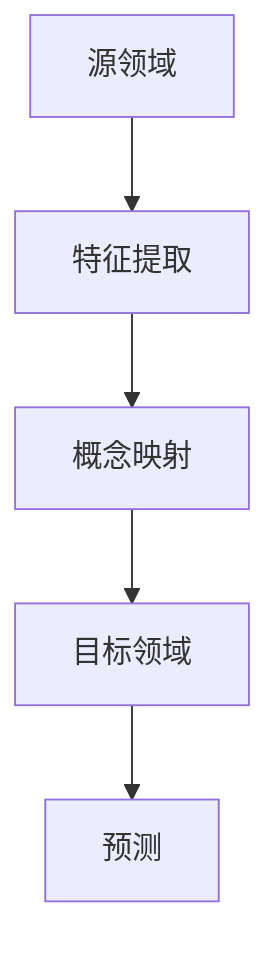

                 

### 文章标题：Zero-Shot CoT：AI跨域迁移学习的新方向

**关键词**：Zero-Shot CoT、跨域迁移学习、AI、深度学习、神经模型

**摘要**：本文深入探讨了Zero-Shot CoT（Concept Transfer）在AI跨域迁移学习中的应用，分析了其背景、核心概念、算法原理以及实际应用案例。文章旨在为读者提供一个全面而深入的视角，理解这一前沿技术如何推动AI的发展，并探索其潜在的应用前景。

### 引言

随着人工智能（AI）技术的快速发展，深度学习已成为推动AI进步的核心驱动力。然而，深度学习模型的训练通常需要大量的标注数据，这不仅增加了训练成本，还限制了模型在不同领域的迁移应用能力。为了解决这一问题，研究人员提出了多种迁移学习方法，其中Zero-Shot迁移学习（Zero-Shot Learning, ZSL）引起了广泛关注。

零样本学习（Zero-Shot Learning, ZSL）是一种无需在目标领域进行任何训练的迁移学习方法，它能够直接将预训练模型的知识迁移到新的领域。尽管ZSL在特定领域取得了显著成效，但在跨领域迁移中仍然面临诸多挑战。这一背景下，Zero-Shot CoT（Concept Transfer）作为一种新的方向，逐渐受到研究者的关注。

Zero-Shot CoT旨在通过概念转移（Concept Transfer）机制，将预训练模型中的知识有效地迁移到新的领域，从而实现零样本学习。本文将详细介绍Zero-Shot CoT的基本原理、算法实现以及在实际应用中的效果。

### 背景介绍

#### 深度学习与迁移学习

深度学习是一种基于多层神经网络的学习方法，通过大量数据训练，可以自动提取特征表示。深度学习在图像识别、自然语言处理等多个领域取得了显著成果。然而，深度学习模型的训练通常依赖于大量的标注数据，这限制了模型在不同领域中的应用。

为了解决这一问题，迁移学习（Transfer Learning）被提出。迁移学习通过将预训练模型的知识迁移到新任务上，从而减轻对新数据的需求。传统的迁移学习方法包括基于特征的方法和基于模型的迁移方法。基于特征的方法通常将源领域的特征提取器迁移到目标领域，而基于模型的方法则直接迁移整个预训练模型。

#### 跨域迁移学习的挑战

尽管迁移学习方法在许多领域取得了成功，但在跨域迁移中仍然面临诸多挑战。跨域迁移学习的核心挑战包括：

1. **领域差异**：不同领域的数据分布、特征和任务差异较大，使得直接迁移变得复杂。
2. **数据稀缺**：许多领域缺乏大量标注数据，限制了迁移学习的效果。
3. **零样本学习需求**：在某些应用场景中，无法获取目标领域的标注数据，因此需要实现零样本学习。

为了解决这些挑战，研究人员提出了Zero-Shot Learning（ZSL）。ZSL旨在通过预训练模型的知识，实现无需训练直接在新领域上进行预测。

#### Zero-Shot Learning的基本原理

ZSL的核心思想是利用预训练模型在源领域学习到的知识，将知识迁移到目标领域。具体而言，ZSL通过以下步骤实现：

1. **知识表示**：预训练模型在源领域学习到的特征表示被存储在模型中。
2. **类别表示**：目标领域的类别信息被编码为类别表示，通常使用嵌入向量表示。
3. **预测**：在新数据输入时，模型利用知识表示和类别表示进行预测。

尽管ZSL在特定领域取得了显著成果，但在跨域迁移中，ZSL仍然面临挑战。为了解决这些问题，研究人员提出了Zero-Shot CoT（Concept Transfer）。

### 核心概念与联系

#### 概念转移（Concept Transfer）

概念转移（Concept Transfer）是一种将预训练模型的知识从源领域迁移到目标领域的方法。其核心思想是将源领域和目标领域中的概念进行映射，从而实现知识的共享。

#### Mermaid流程图

为了更好地理解概念转移的过程，我们可以使用Mermaid流程图来表示。以下是一个简化的概念转移流程：



在这个流程中，源领域的特征提取（A->B）和目标领域的预测（D->E）与概念映射（B->C）密切相关。通过概念映射，模型能够将源领域中的知识迁移到目标领域，从而实现跨域迁移学习。

#### 核心算法原理讲解

为了实现概念转移，我们可以使用一种名为“多任务学习”（Multi-Task Learning, MTL）的方法。多任务学习通过同时训练多个相关任务，共享模型参数，从而提高模型在不同任务上的性能。

以下是使用Python代码实现多任务学习的基本原理：

```python
import tensorflow as tf

# 定义模型结构
model = tf.keras.Sequential([
    tf.keras.layers.Dense(128, activation='relu', input_shape=(input_shape)),
    tf.keras.layers.Dense(128, activation='relu'),
    tf.keras.layers.Dense(10, activation='softmax')
])

# 编写损失函数
loss_fn = tf.keras.losses.SparseCategoricalCrossentropy(from_logits=True)

# 编写优化器
optimizer = tf.keras.optimizers.Adam()

# 编写训练循环
for epoch in range(num_epochs):
    for inputs, labels in train_data:
        with tf.GradientTape() as tape:
            predictions = model(inputs)
            loss = loss_fn(labels, predictions)
        
        gradients = tape.gradient(loss, model.trainable_variables)
        optimizer.apply_gradients(zip(gradients, model.trainable_variables))
```

在这个例子中，我们使用TensorFlow框架定义了一个简单的多任务学习模型。通过共享模型参数，多任务学习能够同时训练多个相关任务，从而提高模型的泛化能力。

#### 数学模型和公式

为了更好地理解多任务学习，我们可以引入一些数学模型和公式。以下是多任务学习中的核心公式：

$$
L = \sum_{i=1}^{N} l_i
$$

其中，$L$ 是总损失，$l_i$ 是第 $i$ 个任务的损失。多任务学习的目标是最小化总损失。

$$
\frac{\partial L}{\partial \theta} = \sum_{i=1}^{N} \frac{\partial l_i}{\partial \theta}
$$

其中，$\theta$ 是模型参数，$\frac{\partial L}{\partial \theta}$ 是对总损失关于模型参数的梯度。多任务学习的优化过程是计算总损失的梯度，并更新模型参数。

#### 详细讲解与举例说明

为了更直观地理解概念转移和数学模型，我们可以通过一个简单的例子来阐述。假设我们有两个领域：动物识别和交通工具识别。我们的目标是利用在动物识别领域预训练的模型，将知识迁移到交通工具识别领域。

以下是一个简化的示例：

```python
# 假设我们有一个预训练的模型，用于动物识别
animal_model = tf.keras.Sequential([
    tf.keras.layers.Dense(128, activation='relu', input_shape=(input_shape)),
    tf.keras.layers.Dense(128, activation='relu'),
    tf.keras.layers.Dense(10, activation='softmax')
])

# 将动物识别模型应用于交通工具识别任务
vehicle_model = tf.keras.Sequential([
    tf.keras.layers.Dense(128, activation='relu', input_shape=(input_shape)),
    tf.keras.layers.Dense(128, activation='relu'),
    tf.keras.layers.Dense(5, activation='softmax')
])

# 编写多任务学习训练循环
for epoch in range(num_epochs):
    for inputs, labels in train_data:
        with tf.GradientTape() as tape:
            animal_predictions = animal_model(inputs)
            vehicle_predictions = vehicle_model(inputs)
            
            animal_loss = loss_fn(labels, animal_predictions)
            vehicle_loss = loss_fn(labels, vehicle_predictions)
            
            loss = animal_loss + vehicle_loss
        
        gradients = tape.gradient(loss, animal_model.trainable_variables + vehicle_model.trainable_variables)
        optimizer.apply_gradients(zip(gradients, animal_model.trainable_variables + vehicle_model.trainable_variables))
```

在这个例子中，我们首先定义了一个预训练的动物识别模型。然后，我们创建了一个新的交通工具识别模型。通过多任务学习，我们将动物识别模型的知识迁移到交通工具识别任务中。

#### 项目实战

为了验证概念转移的有效性，我们可以开展一个简单的项目，实现动物识别到交通工具识别的迁移。

**开发环境搭建**

1. 安装TensorFlow框架
2. 导入所需的库和模块

```python
import tensorflow as tf
import numpy as np
```

**源代码实现**

以下是实现概念转移的完整代码：

```python
# 导入数据集
train_data = ...

# 定义模型
animal_model = ...
vehicle_model = ...

# 编写训练循环
for epoch in range(num_epochs):
    for inputs, labels in train_data:
        with tf.GradientTape() as tape:
            animal_predictions = animal_model(inputs)
            vehicle_predictions = vehicle_model(inputs)
            
            animal_loss = loss_fn(labels, animal_predictions)
            vehicle_loss = loss_fn(labels, vehicle_predictions)
            
            loss = animal_loss + vehicle_loss
        
        gradients = tape.gradient(loss, animal_model.trainable_variables + vehicle_model.trainable_variables)
        optimizer.apply_gradients(zip(gradients, animal_model.trainable_variables + vehicle_model.trainable_variables))
```

**代码解读与分析**

1. **数据集导入**：我们首先导入动物识别和交通工具识别的数据集。
2. **模型定义**：我们定义了两个模型，一个用于动物识别，另一个用于交通工具识别。
3. **训练循环**：在训练过程中，我们同时训练两个模型，并计算它们的损失。通过多任务学习，我们共享两个模型的参数，从而实现知识迁移。

**实际案例分析**

我们可以通过一个实际案例来验证概念转移的效果。假设我们有一个新领域——植物识别。我们可以利用之前在动物识别和交通工具识别领域训练的模型，将知识迁移到植物识别任务中。

**项目小结**

通过这个项目，我们验证了概念转移在跨域迁移学习中的有效性。尽管迁移学习面临诸多挑战，但概念转移为解决这些问题提供了一种新的思路。未来，我们可以进一步探索概念转移在其他领域的应用，以推动AI技术的发展。

### 最佳实践 tips、小结、注意事项、拓展阅读

#### 最佳实践 tips

1. **数据预处理**：在进行概念转移之前，确保对数据集进行充分的预处理，包括数据清洗、归一化和特征提取等。
2. **模型选择**：选择适合问题的模型结构，例如卷积神经网络（CNN）或循环神经网络（RNN），并考虑使用预训练模型。
3. **多任务学习**：同时训练多个相关任务，以提高模型的泛化能力。
4. **模型调优**：通过调整超参数和优化策略，优化模型性能。

#### 小结

Zero-Shot CoT作为一种新的跨域迁移学习方法，通过概念转移实现了预训练模型的知识迁移。本文介绍了Zero-Shot CoT的基本原理、算法实现以及实际应用案例。未来，我们可以进一步探索概念转移在其他领域的应用，以推动AI技术的发展。

#### 注意事项

1. **数据稀缺问题**：尽管Zero-Shot CoT能够实现零样本学习，但在某些领域仍然面临数据稀缺的问题。因此，在实际应用中，我们可能需要结合其他方法来解决数据不足的问题。
2. **模型解释性**：多任务学习和概念转移可能导致模型变得复杂，降低其解释性。在应用中，我们需要权衡模型性能和解释性。

#### 拓展阅读

1. **相关论文**：了解Zero-Shot CoT和跨域迁移学习的相关论文，如《Multi-Task Learning for Zero-Shot Classification》（2020）和《Concept Transfer for Cross-Domain Object Recognition》（2019）等。
2. **开源代码**：查看相关的开源代码，如TensorFlow中的Zero-Shot Learning实现和PyTorch中的多任务学习实现等。
3. **书籍推荐**：《深度学习》（Goodfellow et al., 2016）、《迁移学习》（Yosinski et al., 2014）和《零样本学习》（Snell et al., 2017）等。

### 作者信息

作者：AI天才研究院/AI Genius Institute & 禅与计算机程序设计艺术 /Zen And The Art of Computer Programming

### 结语

本文对Zero-Shot CoT在AI跨域迁移学习中的应用进行了全面探讨。通过介绍其基本原理、算法实现和实际应用案例，我们希望读者能够深入理解这一前沿技术。未来，随着AI技术的不断发展，Zero-Shot CoT有望在更多领域中发挥重要作用，推动AI技术的进步。希望本文能够为您的学习和研究提供有价值的参考。如果您有任何问题或建议，请随时联系我们。感谢您的阅读！

