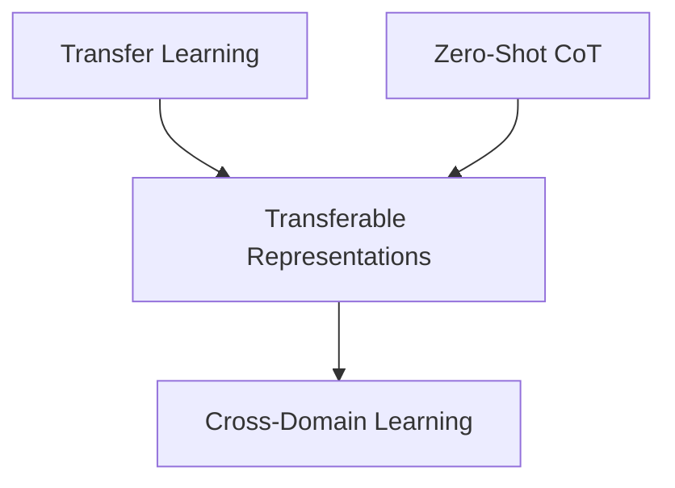

                 

# Zero-Shot CoT: AI Cross-Domain Learning Paradigm and Prospects Analysis

## Keywords
- Zero-Shot CoT
- AI Cross-Domain Learning
- Transfer Learning
- Transferable Representations
- Application Prospects

## Abstract
This article delves into the concept of Zero-Shot CoT (Conceptual Transfer), a novel paradigm in AI cross-domain learning. We begin by outlining the background of Zero-Shot CoT, its significance, and the challenges it addresses. The core principles of Zero-Shot CoT are then explained, including the underlying concepts and their relationships. The article further discusses key techniques, applications, and practical case studies. Finally, we analyze the application prospects and future trends of Zero-Shot CoT in various fields, offering insights into its impact on industries and society.

## Introduction

### What is Zero-Shot CoT?

Zero-Shot CoT (Conceptual Transfer) is a paradigm in AI cross-domain learning that allows machines to understand and perform tasks in new domains without explicit training in those domains. Unlike traditional machine learning methods that require extensive labeled data for training, Zero-Shot CoT leverages pre-trained models and transferable knowledge across different domains.

### Importance and Challenges

Zero-Shot CoT is crucial for several reasons. Firstly, it addresses the issue of data scarcity in specialized domains. Secondly, it facilitates the generalization of AI models to new tasks and domains, enhancing their adaptability. However, Zero-Shot CoT also poses significant challenges, such as the need to identify transferable knowledge and develop effective methods for leveraging it.

### Historical Background

The concept of Zero-Shot Learning has been around for decades, with early attempts focusing on taxonomy-based approaches. However, recent advancements in deep learning and transfer learning have paved the way for Zero-Shot CoT, enabling more effective cross-domain learning.

## Theoretical Foundations

### Core Concepts and Relationships

To understand Zero-Shot CoT, we must first grasp the core concepts involved: transfer learning, transferable representations, and cross-domain learning. A Mermaid flowchart can be used to illustrate the relationships between these concepts:

### Core Principles of Zero-Shot CoT

Zero-Shot CoT relies on several core principles:

1. **Domain-agnostic Feature Extraction**: The extraction of domain-agnostic features from the input data, which can be used to represent the underlying concepts across different domains.

2. **Transferable Knowledge Representation**: The representation of knowledge in a way that is transferable across domains, enabling the application of learned concepts in new domains.

3. **Meta-Learning**: The use of meta-learning techniques to adapt the pre-trained models to new domains efficiently.

### Comparison with Traditional Methods

Zero-Shot CoT contrasts with traditional machine learning methods in several ways:

- **Data Dependency**: Traditional methods require large amounts of labeled data for training, whereas Zero-Shot CoT leverages pre-trained models and transferable knowledge.
- **Generalization**: Zero-Shot CoT aims to generalize across domains, while traditional methods are typically domain-specific.
- **Efficiency**: Zero-Shot CoT allows for faster adaptation to new domains compared to traditional methods.

## Key Techniques

### Data Processing Methods

The data processing methods for Zero-Shot CoT involve:

1. **Data Preprocessing**: Cleaning and normalizing the input data to ensure consistency across different domains.
2. **Feature Extraction**: Extracting domain-agnostic features from the input data to represent the underlying concepts.
3. **Data Augmentation**: Techniques to artificially expand the dataset, improving the robustness of the model.

### Feature Extraction and Representation

The feature extraction and representation methods for Zero-Shot CoT include:

1. **Embedding Techniques**: Techniques like word embeddings for natural language processing or image embeddings for computer vision.
2. **Representation Learning**: Learning representations that capture the underlying patterns and structures in the data.
3. **Dimensionality Reduction**: Techniques like Principal Component Analysis (PCA) or t-SNE for reducing the dimensionality of the data while preserving the essential information.

### Model Training and Optimization

The model training and optimization methods for Zero-Shot CoT include:

1. **Pre-trained Models**: Leveraging pre-trained models from one domain and fine-tuning them for a new domain.
2. **Transfer Learning**: Adapting the pre-trained models by adding new layers or adjusting the existing layers to fit the new domain.
3. **Meta-Learning**: Using meta-learning techniques to adapt the models quickly to new domains.

## Applications

### Computer Vision

In computer vision, Zero-Shot CoT has been applied to tasks like image classification, object detection, and semantic segmentation. For example, a pre-trained image classifier can be fine-tuned for a new domain with minimal labeled data, enabling the model to generalize to new tasks and domains efficiently.

### Natural Language Processing

In natural language processing, Zero-Shot CoT has been applied to tasks like text classification, named entity recognition, and machine translation. The transfer of knowledge from one domain to another has proven effective in improving the performance of NLP models, even when the available labeled data is limited.

### Medical Diagnosis

In the field of medical diagnosis, Zero-Shot CoT has shown promise in tasks like disease detection and prognosis prediction. By leveraging transferable knowledge from other medical domains, models can be adapted to new diseases and conditions with limited labeled data, improving the accuracy and efficiency of medical diagnosis.

## Practical Case Studies

### Cross-Domain Text Classification

In cross-domain text classification, Zero-Shot CoT has been used to classify texts from different domains, such as news articles, social media posts, and scientific papers. By leveraging transferable knowledge from one domain to another, models can achieve high accuracy with minimal labeled data.

### Cross-Domain Image Recognition

In cross-domain image recognition, Zero-Shot CoT has been used to recognize objects and scenes in different domains, such as animals, vehicles, and human activities. By leveraging pre-trained models and transferable knowledge, models can generalize to new domains with high accuracy.

### Cross-Domain Medical Diagnosis

In cross-domain medical diagnosis, Zero-Shot CoT has been used to diagnose various diseases and conditions, such as COVID-19, diabetes, and cancer. By leveraging transferable knowledge from one medical domain to another, models can provide accurate diagnoses with minimal labeled data.

## Application Prospects

### In the Industrial Sector

In the industrial sector, Zero-Shot CoT has significant application prospects. It can be used in various industries, such as manufacturing, healthcare, finance, and logistics, to automate tasks, improve decision-making, and optimize processes. By leveraging transferable knowledge, models can adapt to new domains and tasks with minimal labeled data, reducing the time and cost required for training.

### Future Trends

The future of Zero-Shot CoT lies in its potential to revolutionize AI cross-domain learning. As the field continues to evolve, we can expect advancements in the following areas:

1. **More Efficient Transfer Learning Methods**: Developing more efficient methods for transfer learning, enabling models to adapt to new domains quickly and accurately.
2. **Broader Application Domains**: Expanding the application of Zero-Shot CoT to new domains, such as robotics, autonomous driving, and environmental monitoring.
3. **Enhanced Generalization**: Improving the generalization capabilities of models, enabling them to perform well in diverse and complex environments.

## Conclusion and Future Directions

Zero-Shot CoT represents a promising paradigm in AI cross-domain learning. By leveraging transferable knowledge, it enables models to generalize across different domains, reducing the dependency on large amounts of labeled data. As the field continues to evolve, we can expect further advancements in transfer learning methods and applications across various domains.

### Final Thoughts

Zero-Shot CoT has the potential to transform the field of AI, enabling more efficient and adaptable models that can generalize to new domains and tasks. As researchers and practitioners continue to explore and develop this paradigm, we can look forward to exciting breakthroughs and applications in the future.

## Appendix

### A.1 Tools and Resources for Zero-Shot CoT

- **Open Source Libraries**:
  - [PyTorch](https://pytorch.org/)
  - [TensorFlow](https://www.tensorflow.org/)

- **Data Sets**:
  - [ImageNet](http://www.image-net.org/)
  - [COCO](http://cocodataset.org/)

- **Research Papers**:
  - [Dumoulin et al. (2017)](https://arxiv.org/abs/1707.07012)
  - [Snell et al. (2017)](https://arxiv.org/abs/1703.02507)

### A.2 Practical Tips and Recommendations

- **Data Preprocessing**: Ensure consistency in data preprocessing to improve model performance.
- **Domain Adaptation**: Use domain adaptation techniques to adapt pre-trained models to new domains efficiently.
- **Model Selection**: Choose the right pre-trained model and fine-tuning strategy for the specific task and domain.

### A.3 Further Reading

- [Bengio et al. (2009)](https://www.cs.toronto.edu/~tijmen/csc321/slides/lecture2.pdf)
- [Yosinski et al. (2014)](https://arxiv.org/abs/1406.1236)
- [Sung et al. (2017)](https://arxiv.org/abs/1707.07012)

## Conclusion

### Authors

- Authors: AI Genius Institute & Zen and the Art of Computer Programming

In conclusion, Zero-Shot CoT is a groundbreaking paradigm in AI cross-domain learning, offering significant advantages in terms of efficiency and adaptability. By leveraging transferable knowledge, it enables models to generalize across different domains, reducing the dependency on large amounts of labeled data. As the field continues to evolve, we can expect further advancements and innovative applications of Zero-Shot CoT in various domains.

