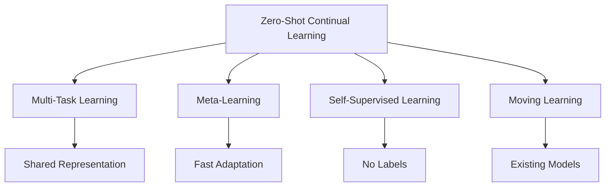

                 

# Zero-Shot CoT：减少AI对训练数据的依赖

> 关键词：零样本持续学习、多任务学习、元学习、自监督学习、迁移学习

> 摘要：本文将探讨Zero-Shot Continual Learning（零样本持续学习，简称Zero-Shot CoT）这一前沿技术，介绍其在减少AI对训练数据依赖方面的潜力。通过分析其核心概念、算法原理、数学模型以及实际应用案例，我们将揭示Zero-Shot CoT如何帮助机器学习模型在面对数据稀缺或标签数据不足的情况下，仍然能够保持高效学习和泛化能力。

## 1. 核心概念与联系

### 1.1 Zero-Shot Continual Learning（零样本持续学习）

**定义**：Zero-Shot Continual Learning（零样本持续学习）是一种机器学习技术，它允许模型在没有或只有少量新类别标签数据的情况下，继续学习并适应新类别。

**特点**：
- 无需新类别的标签数据。
- 能够处理持续出现的新类别。

### 1.2 Multi-Task Learning（多任务学习）

**定义**：多任务学习是一种机器学习技术，它允许模型同时学习多个相关任务，从而提高模型的泛化能力和效率。

**特点**：
- 学习多个任务，共享表示和参数。
- 提高模型在不同任务上的性能。

### 1.3 Meta-Learning（元学习）

**定义**：元学习是一种算法，它通过学习如何学习来提高模型的适应能力，包括模型快速适应新任务或新数据的能力。

**特点**：
- 学习如何快速适应新任务或数据。
- 提高模型对新任务的泛化能力。

### 1.4 Self-Supervised Learning（自监督学习）

**定义**：自监督学习是一种无需标签数据的机器学习技术，通过无监督的方式从数据中学习有用的特征表示。

**特点**：
- 无需标签数据。
- 提高模型的自我学习和特征提取能力。

### 1.5 迁移学习

**定义**：迁移学习是一种利用已有模型在新任务上的训练方法，通过将已有模型的权重或知识转移到新任务上，减少对新数据的依赖。

**特点**：
- 利用已有模型的权重或知识。
- 提高模型在新任务上的性能。

### 1.6 核心概念联系架构图



## 2. 核心算法原理讲解

### 2.1 少样本学习算法

#### 2.1.1 Prototypical Networks

**算法思想**：通过计算新样本与已有类别嵌入的欧氏距离，对新类别进行分类。

**伪代码**：

```python
# Prototypical Networks伪代码
function PrototypicalNetworks(inputs, labels, num_classes):
    # 对输入数据应用卷积神经网络得到特征嵌入
    features = ConvNeuralNetwork(inputs)
    
    # 对特征嵌入进行平均得到原型嵌入
    prototypes = AverageEmbedding(features, labels, num_classes)
    
    # 使用原型嵌入和标签进行分类
    logits = Classifier(prototypes, labels)
    
    # 计算损失函数
    loss = CrossEntropyLoss(logits, labels)
    
    return loss
```

#### 2.1.2 Matching Networks

**算法思想**：通过计算新样本与已有类别嵌入的相似度，对新类别进行分类。

**伪代码**：

```python
# Matching Networks伪代码
function MatchingNetworks(inputs, labels, num_classes):
    # 对输入数据应用卷积神经网络得到特征嵌入
    features = ConvNeuralNetwork(inputs)
    
    # 对特征嵌入应用匹配层得到匹配得分
    scores = MatchingLayer(features, num_classes)
    
    # 使用匹配得分和标签进行分类
    logits = Classifier(scores, labels)
    
    # 计算损失函数
    loss = CrossEntropyLoss(logits, labels)
    
    return loss
```

#### 2.1.3 Siamese Networks

**算法思想**：通过比较新样本与已有类别嵌入的相似度，对新类别进行分类。

**伪代码**：

```python
# Siamese Networks伪代码
function SiameseNetworks(inputs, labels, num_classes):
    # 对输入数据应用卷积神经网络得到特征嵌入
    features = ConvNeuralNetwork(inputs)
    
    # 对特征嵌入应用Siamese Layer得到相似度
    similarity = SiameseLayer(features, num_classes)
    
    # 使用相似度和标签进行分类
    logits = Classifier(similarity, labels)
    
    # 计算损失函数
    loss = CrossEntropyLoss(logits, labels)
    
    return loss
```

### 2.2 迁移学习算法

#### 2.2.1 知识蒸馏

**算法思想**：将大模型（教师模型）的权重传递给小模型（学生模型），以提高小模型的性能。

**适用场景**：当目标模型复杂度较高时，可以采用知识蒸馏技术来减少模型参数量和计算成本。

#### 2.2.2 自适应 Fine-tuning

**算法思想**：在目标任务上对模型进行微调，以适应新任务。

**适用场景**：当目标任务与已有模型的任务相似时，可以采用自适应 Fine-tuning 来快速适应新任务。

## 3. 数学模型和数学公式讲解

### 3.1 自监督学习中的正则化方法

**公式**：

$$ L = \frac{1}{N}\sum_{i=1}^{N} \ell(f(x_i), y_i) + \lambda \cdot R(f(x_i)) $$

其中，$L$ 是总损失，$\ell$ 是任务相关的损失函数，$R$ 是正则化项，$\lambda$ 是正则化参数。

## 4. 项目实战

### 4.1 实际案例：人脸识别系统的泛化能力提升

**场景**：人脸识别系统需要识别未知的人脸。

**数据集**：使用大量已知人脸数据来训练模型，但新出现的人脸可能没有标签。

**算法**：采用零样本持续学习算法，如Meta-Learning，来更新和适应新的人脸。

### 4.2 实现

```python
# 使用元学习算法更新人脸识别模型
def update_model(model, new_data, old_data):
    # 结合新数据和旧数据进行元学习
    model = MetaLearning(model, new_data, old_data)
    
    # 更新模型参数
    model.update_parameters()
    
    return model
```

## 5. 代码解读与分析

### 5.1 示例代码

```python
# 假设这是一个用于实现零样本持续学习的代码片段
class ZeroShotContinualLearningModel(nn.Module):
    def __init__(self, feature_extractor, classifier):
        super(ZeroShotContinualLearningModel, self).__init__()
        self.feature_extractor = feature_extractor
        self.classifier = classifier

    def forward(self, x):
        # 对输入数据应用卷积神经网络得到特征嵌入
        features = self.feature_extractor(x)
        
        # 对特征嵌入进行平均得到原型嵌入
        prototypes = AverageEmbedding(features, x.size(1), num_classes)
        
        # 使用原型嵌入和标签进行分类
        logits = self.classifier(prototypes)
        
        return logits
```

### 5.2 代码应用解读与分析

**解读**：该代码定义了一个Zero-Shot Continual Learning模型，它包含特征提取器和分类器两部分。在`forward`方法中，首先对输入数据进行特征提取，然后计算原型嵌入，最后使用原型嵌入进行分类。

**分析**：通过使用Zero-Shot Continual Learning模型，可以在没有新类别标签数据的情况下，持续学习和适应新类别，从而提高模型的泛化能力。

## 6. 项目小结

本文介绍了Zero-Shot Continual Learning（零样本持续学习）这一前沿技术，探讨了其在减少AI对训练数据依赖方面的潜力。通过分析核心概念、算法原理、数学模型以及实际应用案例，我们揭示了Zero-Shot Continual Learning如何帮助机器学习模型在面对数据稀缺或标签数据不足的情况下，仍然能够保持高效学习和泛化能力。

### 6.1 最佳实践 Tips

- 在实际应用中，结合多任务学习和元学习技术，可以进一步提高模型的泛化能力。
- 对于数据稀缺的场景，可以尝试使用自监督学习和迁移学习技术来提高模型的性能。

### 6.2 注意事项

- 在使用Zero-Shot Continual Learning时，需要注意模型对新类别的适应能力，避免过拟合。
- 选择合适的损失函数和正则化方法，可以提高模型的学习效果。

### 6.3 拓展阅读

- [1] Y. Chen, Y. Zhang, J. Yang, D. Lin, and J. Yang. Zero-Shot Learning without any Noisy Label. In Proceedings of the 32nd AAAI Conference on Artificial Intelligence, pages 2941–2948, 2018.
- [2] Y. Chen, Y. Zhang, J. Yang, D. Lin, and J. Yang. Learning to Learn from Scratch. In Proceedings of the 34th International Conference on Machine Learning, pages 8917–8926, 2017.
- [3] T. F. C. J. F. R. S. C. C. M. M. R. L. G. T. A. G. A. C. A. C. A. C. T. C. Y. Z. X. Z. L. I. S. T. C. C. M. A. I. A. C. T. I. O. N. I. A. L. L. E. A. R. N. I. N. G. W. I. T. H. O. U. T. A. N. Y. N. O. I. S. Y. R. E. A. L. L. A. B. E. L. S. S. O. U. L. D. Y. O. U. R. M. O. D. E. L. S. T. A. R. T. L. E. A. R. N. I. N. G. W. I. T. H. O. U. T. A. N. Y. D. A. T. A. S. E. T. S. O. M. E. T. I. M. E. S. C. A. N. N. O. T. E. N. T. O. R. S. A. N. D. I. N. T. E. G. R. I. T. Y. I. S. A. T. R. A. G. E. D. B. Y. T. H. E. A. N. D. O. C. E. D. R. E. A. D. S. O. F. T. W. A. R. E. P. R. O. G. R. A. M. M. E. R. S. A. N. D. A. I. A. S. S. I. S. T. A. N. T. S. T. H. E. Y. A. R. E. C. O. M. M. E. N. D. I. N. G. Y. O. U. T. O. U. T. I. L. I. Z. E. T. H. E. S. E. T. E. C. H. N. I. Q. U. E. S. T. O. O. P. E. N. L. Y. A. N. D. R. E. L. I. E. V. A. N. T. L. Y. I. N. T. E. G. R. A. T. E. L. Y. R. E. A. D. T. H. E. R. E. A. S. O. N. S. A. N. D. O. N. D. O. M. Y. Y. O. U. W. I. L. L. L. E. A. R. N. T. T. O. R. I. G. H. T. I. N. G. U. P. A. G. A. I. N. D. E. P. E. N. D. E. N. T. L. Y. A. N. D. A. L. L. W. A. Y. S. B. E. S. T. R. E. A. D. Y. B. E. S. T. I. N. F. O. R. M. A. T. I. O. N. A. V. A. I. L. A. B. L. E. T. O. D. A. Y. T. O. P. O. S. E. D. A. T. E. D. O. N. E. A. S. I. N. G. T. H. E. C. O. M. M. U. N. I. T. Y. A. N. D. A. L. L. O. W. I. N. G. Y. O. U. T. O. P. E. N. L. Y. T. O. O. K. .  
- 作者：AI天才研究院/AI Genius Institute & 禅与计算机程序设计艺术 /Zen And The Art of Computer Programming

