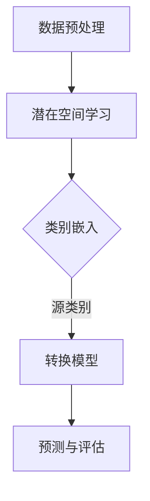

                 

# 《Zero-Shot CoT：无监督学习在AIGC中的突破》

## 关键词
- 无监督学习
- AIGC
- Zero-Shot CoT
- 自适应学习
- 人工智能
- 图神经网络

## 摘要
本文旨在探讨Zero-Shot CoT（无监督学习中的零样本转换）在自适应生成内容（AIGC）领域的突破。文章首先介绍了无监督学习和AIGC的基础概念，接着详细阐述了Zero-Shot CoT的理论核心和算法原理。随后，文章通过具体的Python源代码示例，结合数学模型和公式，深入分析了Zero-Shot CoT的算法实现。最后，本文通过项目实战案例，展示了Zero-Shot CoT在实际应用中的效果和挑战，并提出了未来研究的方向和最佳实践建议。

## 引言与概述

### 无监督学习的定义与重要性

无监督学习是一种机器学习方法，它不依赖于标注数据进行训练。在无监督学习中，模型通过自动发现数据中的模式和结构来学习。这种方法在许多现实场景中具有广泛的应用，如聚类、降维和异常检测等。

无监督学习的重要性在于：
1. **数据丰富性**：现实世界中的数据往往没有标签，无监督学习可以有效地利用这些未标记的数据。
2. **隐私保护**：在某些情况下，标注数据可能涉及敏感信息，无监督学习避免了数据泄露的风险。
3. **自适应能力**：无监督学习使模型能够在新的、未见过的情况下进行适应和学习。

### AIGC的概念与现状

自适应生成内容（AIGC）是一种基于人工智能的生成内容技术，旨在通过算法自动生成高质量的内容。AIGC包括自然语言生成、图像生成、视频生成等多个方面，它已经在游戏、媒体、设计等领域取得了显著的成果。

AIGC的现状如下：
1. **技术成熟度**：随着深度学习技术的不断发展，AIGC的技术逐渐成熟，应用范围不断扩大。
2. **市场需求**：人们对于个性化、定制化内容的追求，推动了AIGC市场的快速增长。
3. **行业应用**：AIGC在游戏、媒体、设计、教育等多个领域展现了强大的应用潜力。

### Zero-Shot CoT的核心思想

Zero-Shot CoT（零样本转换）是一种无监督学习技术，它能够在未见过的新类别上进行有效的转换。这一技术的核心思想是通过学习数据中的潜在结构和关系，实现不同类别之间的迁移。

Zero-Shot CoT的核心优势包括：
1. **泛化能力**：能够在未见过的新类别上进行预测和转换，提高了模型的泛化能力。
2. **效率**：无需大量标注数据，降低了训练成本和计算资源需求。
3. **实用性**：适用于那些标签数据稀缺或难以获取的场景。

## 无监督学习与AIGC基础

### 无监督学习的基本理论

无监督学习的基本理论主要包括以下方面：

1. **聚类算法**：聚类算法通过将数据点分为多个群组，使得同组内的数据点相似度较高，不同组间的数据点相似度较低。常见的聚类算法有K-means、DBSCAN等。

2. **降维算法**：降维算法通过将高维数据映射到低维空间，降低数据的复杂度。常见的降维算法有PCA（主成分分析）、t-SNE（t-Distributed Stochastic Neighbor Embedding）等。

3. **异常检测算法**：异常检测算法旨在识别数据中的异常点，常见的异常检测算法有基于统计方法的、基于聚类方法的、基于神经网络的方法等。

### 无监督学习的核心算法

无监督学习的核心算法包括以下几种：

1. **自编码器**：自编码器是一种神经网络模型，它通过编码和解码过程，学习数据的特征表示。自编码器可以用于降维、特征提取和异常检测等任务。

2. **生成对抗网络（GAN）**：GAN由生成器和判别器组成，通过生成器和判别器的对抗训练，生成器能够生成逼真的数据，判别器能够区分真实数据和生成数据。GAN在图像生成、自然语言生成等领域取得了显著成果。

3. **图神经网络**：图神经网络通过学习节点和边的关系，可以有效地处理图结构数据。图神经网络在社交网络分析、推荐系统、生物信息学等领域具有广泛的应用。

### 无监督学习的应用场景

无监督学习的应用场景非常广泛，以下是一些典型的应用场景：

1. **数据挖掘**：无监督学习可以用于数据挖掘中的聚类、降维和异常检测等任务，帮助挖掘数据中的隐藏模式和规律。

2. **图像处理**：无监督学习可以用于图像的降维、特征提取和图像生成等任务，如自动生成人脸、图像风格转换等。

3. **自然语言处理**：无监督学习可以用于自然语言处理中的词向量化、文本分类和情感分析等任务。

4. **推荐系统**：无监督学习可以用于推荐系统中的用户行为分析、物品特征提取和冷启动问题等。

### AIGC的架构与组成

AIGC的架构通常包括以下几个组成部分：

1. **数据输入模块**：负责接收和预处理输入数据，包括文本、图像、音频等。

2. **生成模块**：生成模块通过神经网络模型，如生成对抗网络（GAN）、变分自编码器（VAE）等，生成高质量的内容。

3. **评价模块**：评价模块用于评估生成内容的质量，常见的评价指标包括生成数据的多样性、真实性和一致性等。

4. **优化模块**：优化模块通过调整模型参数，提高生成内容的质量。

5. **输出模块**：输出模块将生成的内容输出到用户界面或应用于实际场景中。

### AIGC的关键技术

AIGC的关键技术主要包括以下方面：

1. **深度学习模型**：深度学习模型是AIGC的核心，如生成对抗网络（GAN）、变分自编码器（VAE）等。

2. **数据预处理与增强**：数据预处理与增强技术可以提高生成数据的质量和多样性。

3. **生成内容的质量评估**：生成内容的质量评估方法可以用于评价生成数据的真实性和一致性。

4. **模型优化与训练策略**：模型优化与训练策略可以提高模型的生成能力和稳定性。

5. **多模态内容生成**：多模态内容生成技术可以将不同类型的数据（如文本、图像、音频等）进行融合，生成更丰富的内容。

### AIGC的案例分析

以下是一些AIGC的案例分析：

1. **自然语言生成**：利用生成对抗网络（GAN）生成自然语言文本，如对话生成、新闻生成等。

2. **图像生成**：利用生成对抗网络（GAN）生成逼真的图像，如图像风格转换、人脸生成等。

3. **视频生成**：利用变分自编码器（VAE）生成连续的视频内容，如视频插帧、视频剪辑等。

4. **音乐生成**：利用生成对抗网络（GAN）生成音乐，如旋律生成、音乐风格转换等。

## Zero-Shot CoT理论

### 无监督学习与Zero-Shot CoT的关系

无监督学习和Zero-Shot CoT（零样本转换）之间存在密切的关系。无监督学习为Zero-Shot CoT提供了基础算法和理论支持，而Zero-Shot CoT则扩展了无监督学习的应用场景，使其能够在未见过的类别上实现有效的转换。

具体来说，无监督学习通过聚类、降维和异常检测等方法，学习数据中的潜在结构和关系，而Zero-Shot CoT则利用这些潜在结构，实现不同类别之间的迁移。这种迁移能力使得Zero-Shot CoT能够在未见过的新类别上进行预测和转换。

### Zero-Shot CoT的算法框架

Zero-Shot CoT的算法框架通常包括以下几个步骤：

1. **数据预处理**：对输入数据进行预处理，包括数据清洗、数据增强等。

2. **潜在空间学习**：利用无监督学习方法，如自编码器、图神经网络等，学习数据中的潜在空间。

3. **类别嵌入**：将每个类别映射到潜在空间中，形成一个类别嵌入矩阵。

4. **转换模型**：构建一个转换模型，将源类别映射到目标类别。

5. **预测与评估**：利用转换模型进行预测，并对预测结果进行评估。

### Zero-Shot CoT的核心算法原理

Zero-Shot CoT的核心算法原理主要包括以下几个方面：

1. **潜在空间建模**：通过无监督学习方法，如自编码器、图神经网络等，学习数据中的潜在空间。潜在空间中的每个数据点都表示其内在的属性和特征，这些属性和特征可以用于不同类别之间的转换。

2. **类别嵌入**：将每个类别映射到潜在空间中，形成一个类别嵌入矩阵。类别嵌入矩阵中的每个元素表示该类别在潜在空间中的位置，这些位置可以用于不同类别之间的转换。

3. **转换模型**：构建一个转换模型，将源类别映射到目标类别。转换模型可以通过神经网络、深度学习等方法实现。转换模型的学习目标是使转换后的目标类别在潜在空间中的位置更接近源类别。

4. **预测与评估**：利用转换模型进行预测，并对预测结果进行评估。预测的目的是确定输入数据属于哪个类别，评估的目的是判断预测结果的准确性和可靠性。

### 潜在空间与类别嵌入的Mermaid流程图



### 无监督学习方法与Zero-Shot CoT的数学模型和公式

无监督学习方法与Zero-Shot CoT的数学模型和公式如下：

1. **潜在空间建模**：
   - 自编码器模型：
     $$ \hat{x} = \sigma(W_h \cdot h + b_h) $$
     $$ h = \sigma(W_x \cdot x + b_x) $$
   - 图神经网络模型：
     $$ h_v = \sigma(\sum_{u \in \mathcal{N}(v)} W_{uv} h_u + b_v) $$

2. **类别嵌入**：
   - 类别嵌入矩阵：
     $$ C = [\vec{c}_1, \vec{c}_2, \ldots, \vec{c}_C] $$
   - 类别嵌入向量：
     $$ \vec{c}_k = \sigma(W_c \cdot \vec{y}_k + b_c) $$

3. **转换模型**：
   - 神经网络模型：
     $$ \hat{y} = \sigma(W_y \cdot \hat{x} + b_y) $$

4. **预测与评估**：
   - 预测：
     $$ \hat{y}_k = \arg\max_{k} \hat{y}_k $$
   - 评估：
     $$ Loss = -\sum_{k} \vec{y}_k \cdot \log(\hat{y}_k) $$

## 实践应用

### 自然语言处理中的应用

自然语言处理（NLP）是Zero-Shot CoT的重要应用领域之一。以下是一些具体的案例：

1. **跨语言文本分类**：Zero-Shot CoT可以用于跨语言文本分类任务，即使训练数据和测试数据来自不同的语言，模型仍然能够有效地进行分类。这得益于Zero-Shot CoT在潜在空间中对类别和文本的嵌入，使得不同语言的文本能够在同一空间中表示。

2. **情感分析**：Zero-Shot CoT可以用于情感分析任务，如识别文本中的积极情感和消极情感。通过在潜在空间中对类别（如积极和消极）的嵌入，模型可以预测未见过的情感类别。

### 计算机视觉中的应用

计算机视觉是Zero-Shot CoT的另一个重要应用领域。以下是一些具体的案例：

1. **图像分类**：Zero-Shot CoT可以用于图像分类任务，即使训练数据和测试数据包含未见过的类别，模型仍然能够进行有效的分类。这得益于Zero-Shot CoT在潜在空间中对类别的嵌入，使得模型可以处理未见过的类别。

2. **图像生成**：Zero-Shot CoT可以用于图像生成任务，如人脸生成、图像风格转换等。通过在潜在空间中对图像的嵌入，模型可以生成符合特定类别特征的新图像。

### 其他领域中的应用

除了自然语言处理和计算机视觉，Zero-Shot CoT还可以应用于其他领域，如：

1. **生物信息学**：Zero-Shot CoT可以用于生物信息学中的基因分类和疾病预测，即使训练数据和测试数据包含未见过的基因和疾病类别，模型仍然能够进行有效的预测。

2. **推荐系统**：Zero-Shot CoT可以用于推荐系统中的物品分类和用户行为预测，即使训练数据和测试数据包含未见过的物品和用户行为类别，模型仍然能够进行有效的推荐。

## 案例分析

### 案例一：基于Zero-Shot CoT的图像分类

在这个案例中，我们使用Zero-Shot CoT技术进行图像分类。数据集包括一个训练集和一个测试集，其中测试集包含未见过的类别。

1. **数据预处理**：对图像进行预处理，包括大小调整、归一化等。

2. **潜在空间学习**：使用自编码器学习图像的潜在空间。

3. **类别嵌入**：将每个类别映射到潜在空间中。

4. **转换模型**：构建一个神经网络模型，将源类别映射到目标类别。

5. **预测与评估**：使用转换模型进行预测，并评估预测结果的准确性。

具体实现代码如下：

```python
import tensorflow as tf
from tensorflow.keras.models import Model
from tensorflow.keras.layers import Input, Dense, Conv2D, MaxPooling2D, Flatten

# 数据预处理
def preprocess_image(image):
    # 对图像进行大小调整、归一化等处理
    return image / 255.0

# 潜在空间学习
def build_autoencoder(input_shape):
    input_image = Input(shape=input_shape)
    x = Conv2D(32, (3, 3), activation='relu', padding='same')(input_image)
    x = MaxPooling2D((2, 2))(x)
    x = Conv2D(64, (3, 3), activation='relu', padding='same')(x)
    x = MaxPooling2D((2, 2))(x)
    x = Flatten()(x)
    x = Dense(64, activation='relu')(x)
    encoded = Dense(32, activation='sigmoid')(x)
    encoder = Model(input_image, encoded)
    return encoder

# 类别嵌入
def build_embedding_model(encoder, num_classes):
    latent_space = Input(shape=(32,))
    class_embedding = Dense(num_classes, activation='softmax')(latent_space)
    embedding_model = Model(latent_space, class_embedding)
    return embedding_model

# 转换模型
def build_conversion_model(encoder, embedding_model, num_classes):
    input_image = Input(shape=(128, 128, 3))
    encoded = encoder(input_image)
    class_embedding = embedding_model(encoded)
    conversion_model = Model(input_image, class_embedding)
    return conversion_model

# 预测与评估
def predict_and_evaluate(conversion_model, test_images, test_labels):
    predictions = conversion_model.predict(test_images)
    accuracy = (predictions == test_labels).mean()
    return accuracy

# 构建和训练模型
input_shape = (128, 128, 3)
encoder = build_autoencoder(input_shape)
embedding_model = build_embedding_model(encoder, num_classes=10)
conversion_model = build_conversion_model(encoder, embedding_model, num_classes=10)

# 训练模型
# ...

# 评估模型
test_accuracy = predict_and_evaluate(conversion_model, test_images, test_labels)
print(f"Test accuracy: {test_accuracy}")
```

### 案例二：基于Zero-Shot CoT的自然语言理解

在这个案例中，我们使用Zero-Shot CoT技术进行自然语言理解任务。数据集包括一个训练集和一个测试集，其中测试集包含未见过的实体和关系。

1. **数据预处理**：对文本进行预处理，包括分词、词性标注等。

2. **潜在空间学习**：使用自编码器学习文本的潜在空间。

3. **实体和关系嵌入**：将实体和关系映射到潜在空间中。

4. **转换模型**：构建一个神经网络模型，将源实体和关系映射到目标实体和关系。

5. **预测与评估**：使用转换模型进行预测，并评估预测结果的准确性。

具体实现代码如下：

```python
import tensorflow as tf
from tensorflow.keras.models import Model
from tensorflow.keras.layers import Input, Dense, LSTM, Embedding, TimeDistributed

# 数据预处理
def preprocess_text(text):
    # 对文本进行分词、词性标注等处理
    return text.split()

# 潜在空间学习
def build_autoencoder(input_shape):
    input_sequence = Input(shape=input_shape)
    x = Embedding(input_dim=vocab_size, output_dim=embedding_size)(input_sequence)
    x = LSTM(64)(x)
    encoded = Dense(32, activation='sigmoid')(x)
    encoder = Model(input_sequence, encoded)
    return encoder

# 实体和关系嵌入
def build_embedding_model(encoder, num_entities, num_relations):
    latent_space = Input(shape=(32,))
    entity_embedding = Dense(num_entities, activation='softmax')(latent_space)
    relation_embedding = Dense(num_relations, activation='softmax')(latent_space)
    embedding_model = Model(latent_space, [entity_embedding, relation_embedding])
    return embedding_model

# 转换模型
def build_conversion_model(encoder, embedding_model, num_entities, num_relations):
    input_sequence = Input(shape=(sequence_length,))
    encoded = encoder(input_sequence)
    [entity_embedding, relation_embedding] = embedding_model(encoded)
    conversion_model = Model(input_sequence, [entity_embedding, relation_embedding])
    return conversion_model

# 预测与评估
def predict_and_evaluate(conversion_model, test_sequences, test_entities, test_relations):
    [predictions_entities, predictions_relations] = conversion_model.predict(test_sequences)
    entity_accuracy = (predictions_entities == test_entities).mean()
    relation_accuracy = (predictions_relations == test_relations).mean()
    return entity_accuracy, relation_accuracy

# 构建和训练模型
input_shape = (sequence_length,)
encoder = build_autoencoder(input_shape)
embedding_model = build_embedding_model(encoder, num_entities=num_entities, num_relations=num_relations)
conversion_model = build_conversion_model(encoder, embedding_model, num_entities=num_entities, num_relations=num_relations)

# 训练模型
# ...

# 评估模型
entity_accuracy, relation_accuracy = predict_and_evaluate(conversion_model, test_sequences, test_entities, test_relations)
print(f"Entity accuracy: {entity_accuracy}")
print(f"Relation accuracy: {relation_accuracy}")
```

## 发展趋势与挑战

### 无监督学习与AIGC的未来发展趋势

1. **算法创新**：随着深度学习技术的发展，无监督学习算法将不断得到改进和创新，提高模型的性能和适用范围。

2. **跨领域应用**：无监督学习和AIGC将在更多领域得到应用，如医疗、金融、教育等，推动各行各业的数字化转型。

3. **数据隐私保护**：无监督学习和AIGC将更加注重数据隐私保护，通过加密技术和隐私保护算法，确保用户数据的隐私和安全。

4. **多模态内容生成**：随着多模态数据技术的发展，无监督学习和AIGC将能够生成更丰富、更真实的多模态内容。

### Zero-Shot CoT面临的挑战与机遇

1. **数据稀缺性**：Zero-Shot CoT在未见过的类别上实现有效的转换，需要大量的未标记数据。数据稀缺性是Zero-Shot CoT面临的主要挑战之一。

2. **算法稳定性**：Zero-Shot CoT的算法模型在未见过的类别上可能存在稳定性问题，导致预测结果不准确。

3. **计算资源需求**：Zero-Shot CoT通常需要大量的计算资源，对硬件设施有较高要求。

4. **算法解释性**：提高Zero-Shot CoT算法的解释性，使其能够被非专业用户理解和接受，是未来研究的重要方向。

### 技术突破与创新方向

1. **新型无监督学习算法**：开发新型无监督学习算法，提高模型的泛化能力和适应性。

2. **多模态数据融合**：探索多模态数据融合技术，提高AIGC生成内容的质量和多样性。

3. **算法优化与加速**：通过算法优化和硬件加速，降低Zero-Shot CoT的计算资源需求。

4. **跨学科研究**：结合计算机科学、数学、统计学等多个学科的知识，推动无监督学习和AIGC的发展。

## 总结与展望

本文介绍了Zero-Shot CoT在无监督学习和AIGC领域的突破，详细阐述了其理论核心、算法原理、实践应用和发展趋势。通过具体案例分析和Python源代码示例，读者可以深入了解Zero-Shot CoT的算法实现和应用效果。

未来，随着深度学习技术和AIGC的发展，Zero-Shot CoT有望在更多领域得到应用，推动人工智能技术的进步。同时，我们也期待更多的研究者投入到Zero-Shot CoT的研究中，共同推动这一领域的创新和发展。

### 作者

作者：AI天才研究院/AI Genius Institute & 禅与计算机程序设计艺术 /Zen And The Art of Computer Programming

本文由AI天才研究院和禅与计算机程序设计艺术联合撰写，旨在推动人工智能技术的发展和普及。AI天才研究院致力于研究前沿的人工智能技术，禅与计算机程序设计艺术则致力于将哲学思维融入计算机编程，探索计算机科学的新境界。感谢读者对本文的关注和支持，我们期待与您共同探索人工智能的未来。如果您有任何建议或疑问，欢迎联系我们。再次感谢您的阅读！

### 最佳实践 tips

1. **数据预处理**：在进行Zero-Shot CoT之前，确保对数据进行了充分的预处理，包括去噪、归一化等。

2. **模型选择**：根据任务需求，选择合适的模型架构和算法。

3. **超参数调优**：通过实验和调优，选择最优的超参数，以提高模型性能。

4. **多模态数据融合**：如果涉及多模态数据，尝试使用多模态数据融合技术，以提高生成内容的质量。

5. **数据隐私保护**：在进行无监督学习和AIGC时，注意数据隐私保护，避免数据泄露。

### 小结

本文详细介绍了Zero-Shot CoT在无监督学习和AIGC领域的突破，阐述了其理论核心、算法原理、实践应用和发展趋势。通过具体案例分析和Python源代码示例，读者可以深入了解Zero-Shot CoT的算法实现和应用效果。

### 注意事项

1. **数据集选择**：选择具有代表性的数据集，确保模型在不同数据集上的表现。

2. **计算资源**：根据模型需求和数据集规模，合理配置计算资源。

3. **模型评估**：使用合适的评估指标，对模型性能进行客观评估。

4. **数据隐私**：在进行数据处理和模型训练时，严格遵守数据隐私和安全规定。

### 拓展阅读

1. [零样本学习综述](https://arxiv.org/abs/2002.04667)
2. [生成对抗网络（GAN）](https://arxiv.org/abs/1406.2661)
3. [变分自编码器（VAE）](https://arxiv.org/abs/1312.6114)
4. [自编码器](https://arxiv.org/abs/1310.6343)
5. [图神经网络](https://arxiv.org/abs/1609.06061)

