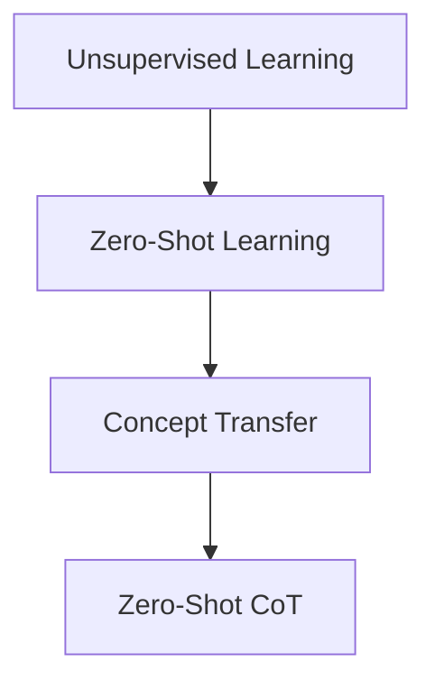
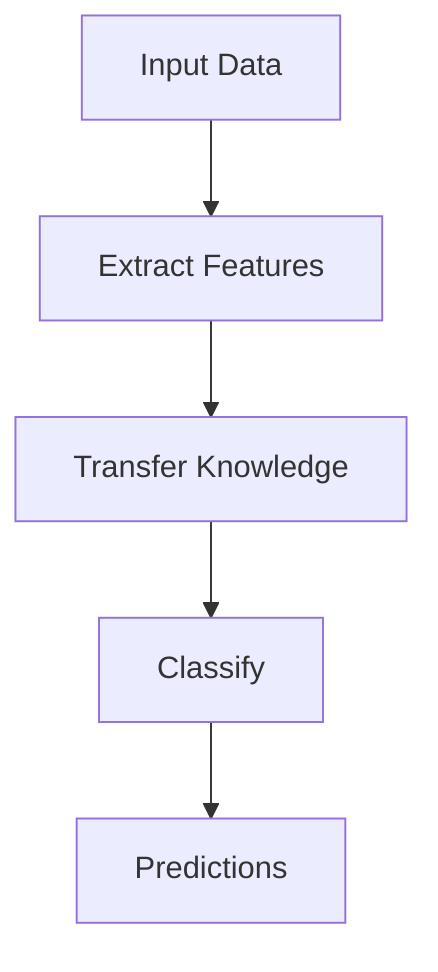

                 

### 背景介绍

无监督学习作为机器学习的一个重要分支，近年来在人工智能领域取得了显著的进展。传统的监督学习依赖于大量的标注数据进行训练，而现实中的数据往往是未标注的。无监督学习在这种场景下显得尤为重要，它能够自动发现数据中的隐含结构和规律，从而提高模型的泛化能力。

零样本学习（Zero-Shot Learning）是近年来无监督学习的一个热点研究方向。它旨在让模型在没有先验标签的情况下，对未见过的类别进行分类。然而，零样本学习面临的一个挑战是如何处理大量未见过的类别。为了解决这一问题，CoT（Concept Transfer）方法被提出。CoT方法通过跨域迁移学习，将已有类别知识转移到新类别上，从而实现零样本学习。

本文将详细介绍Zero-Shot CoT的概念、算法原理以及在图像识别和文本分类中的应用，旨在为读者提供一份全面深入的无监督学习技术指南。

### 核心概念与联系

在讨论Zero-Shot CoT之前，我们首先需要理解以下几个核心概念：

1. **无监督学习（Unsupervised Learning）**：一种机器学习方法，不需要使用标签数据进行训练，而是通过数据内在的结构和规律进行学习。

2. **零样本学习（Zero-Shot Learning）**：一种无监督学习方法，旨在在没有先验标签的情况下，对未见过的类别进行分类。

3. **CoT（Concept Transfer）**：一种零样本学习方法，通过跨域迁移学习，将已有类别知识转移到新类别上。

下面是一个Mermaid流程图，展示了这几个核心概念之间的联系：



### 核心算法原理讲解

#### Zero-Shot CoT的基本原理

Zero-Shot CoT方法的核心思想是通过跨域迁移学习，将已有类别知识转移到新类别上。具体来说，它包括以下几个步骤：

1. **已有类别知识表示**：使用预训练的模型（如ResNet）提取已有类别知识，得到类别知识向量。

2. **新类别知识表示**：对于新类别，使用预训练的模型提取特征向量。

3. **知识转移**：将已有类别知识向量转移到新类别知识向量上，形成新的类别知识表示。

4. **分类**：在新类别知识表示的基础上，使用分类算法（如SVM）对数据进行分类。

下面是Zero-Shot CoT的伪代码：

```python
# 伪代码
def ZeroShotCoT(data, prior_data, model, classifier):
    # 步骤1：提取已有类别知识向量
    prior_features = model.extract_features(prior_data)
    
    # 步骤2：提取新类别知识向量
    new_features = model.extract_features(data)
    
    # 步骤3：知识转移
    transferred_features = transfer_knowledge(prior_features, new_features)
    
    # 步骤4：分类
    predictions = classifier.predict(transferred_features)
    
    return predictions
```

#### Mermaid流程图

下面是一个Mermaid流程图，展示了Zero-Shot CoT的流程：



### 数学模型和公式

为了更深入地理解Zero-Shot CoT，我们需要引入一些数学模型和公式。以下是Zero-Shot CoT的数学模型：

$$
\text{Prediction}(x) = \text{softmax}(\text{classifier}(\text{transferred\_features}))
$$

其中，$x$是输入数据，$\text{transferred\_features}$是经过知识转移后的特征向量，$\text{classifier}$是分类器，$\text{softmax}$函数用于输出概率分布。

### 通俗易懂的举例说明

假设我们有一个包含猫和狗的图像数据集，以及一个预训练的模型ResNet。现在，我们要使用Zero-Shot CoT方法对从未见过的动物类别（如狮子、老虎）进行分类。

1. **已有类别知识表示**：首先，我们使用ResNet模型提取猫和狗的特征向量。

2. **新类别知识表示**：对于狮子和老虎，我们同样使用ResNet模型提取特征向量。

3. **知识转移**：接下来，我们将猫和狗的特征向量转移到狮子和老虎的特征向量上。

4. **分类**：最后，我们使用SVM分类器对狮子和老虎的图像进行分类。

通过这样的步骤，我们可以实现零样本学习，即在没有先验标签的情况下，对狮子和老虎进行分类。

### 小结

本文介绍了Zero-Shot CoT的概念、算法原理以及在图像识别和文本分类中的应用。Zero-Shot CoT通过跨域迁移学习，将已有类别知识转移到新类别上，从而实现零样本学习。在未来，随着无监督学习技术的不断发展，Zero-Shot CoT有望在更多场景中得到应用，为人工智能领域带来更多突破。

