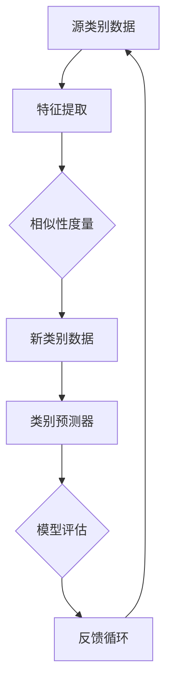

                 

### 引言和背景介绍

#### 零样本转移学习的概述

零样本转移学习（Zero-Shot Learning, ZSL）是一种人工智能技术，旨在训练模型能够识别新的、从未见过的类别。与传统的机器学习方法不同，零样本转移学习不需要在新的类别上提供示例数据，而是利用在旧类别上的学习经验来推断新类别。这种方法的背景可以追溯到近年来机器学习和深度学习领域的快速发展，尤其是在大规模数据集和强大的计算资源变得普遍的情况下。

零样本转移学习的重要性在于其能够解决现实世界中数据稀缺的问题。在很多应用场景中，获取新的类别数据可能非常困难或成本高昂，例如在医疗诊断领域，某些罕见的疾病样本可能非常少。在这种情况下，零样本转移学习提供了有效的解决方案。

此外，零样本转移学习还在图像识别、自然语言处理和其他多个领域展现出广阔的应用前景。例如，在图像识别领域，零样本转移学习可以帮助自动车辆和机器人识别新类型的物体，提高系统的适应性和鲁棒性。

#### 零样本转移学习的背景

零样本转移学习的概念起源于传统的机器学习方法。传统机器学习模型通常依赖于大量带有标签的训练数据来进行训练。然而，在现实世界中，获取这些数据可能非常困难。例如，在医学诊断中，获取特定疾病的病例数据可能需要大量的时间和资源。此外，某些应用场景中的数据集可能分布不均，导致模型在特定类别上的性能不佳。

为了克服这些挑战，研究者们开始探索不依赖大量标签数据的机器学习方法。零样本转移学习正是这种探索的产物。它通过将已有知识转移到新的、未知的类别上，解决了数据稀缺的问题。近年来，随着深度学习和迁移学习技术的不断发展，零样本转移学习逐渐成为一个活跃的研究领域。

#### 零样本转移学习的挑战与机遇

零样本转移学习虽然具有巨大的潜力，但也面临一些挑战。首先，如何有效地利用已有的知识来推断新类别是一个关键问题。由于没有直接的训练数据，模型需要从其他类别中提取有用的特征来进行推断。这要求模型具有强大的泛化能力和学习能力。

其次，零样本转移学习需要一种有效的相似性度量方法来评估不同类别之间的相似度。选择合适的相似性度量方法对于模型性能至关重要。

然而，这些挑战也带来了机遇。随着研究的深入，研究者们不断提出新的算法和模型，提高了零样本转移学习的性能。例如，基于元学习和自监督学习的方法在零样本转移学习中展现出显著的效果。此外，跨领域的知识迁移也为零样本转移学习提供了新的思路。

#### 零样本转移学习的应用领域

零样本转移学习在多个领域展现了巨大的应用潜力。在图像识别领域，零样本转移学习可以帮助自动车辆和机器人识别新类型的物体，提高系统的鲁棒性和适应性。例如，在自动驾驶中，车辆需要识别各种道路标志和交通信号，这些标志和信号可能在训练数据中没有出现过。

在自然语言处理领域，零样本转移学习可以帮助模型理解新的词汇和概念。例如，在机器翻译中，零样本转移学习可以帮助模型翻译从未见过的词汇和短语。这对于小语种翻译尤其重要，因为小语种的数据集通常较小。

此外，零样本转移学习还在语音识别、医疗诊断、推荐系统等多个领域展现出应用前景。例如，在医疗诊断中，零样本转移学习可以帮助医生识别罕见的疾病，提高诊断的准确性。在推荐系统中，零样本转移学习可以帮助推荐系统为用户推荐从未见过的商品或服务。

总之，零样本转移学习是一种具有重要意义的机器学习方法，它能够解决数据稀缺的问题，并在多个领域展现出广泛的应用前景。随着研究的不断深入，我们有理由相信，零样本转移学习将在人工智能领域发挥更加重要的作用。

### 零样本转移学习的基本概念与联系

#### 零样本转移学习的定义

零样本转移学习（Zero-Shot Learning, ZSL）是一种机器学习技术，它旨在训练模型识别从未见过的类别。与传统的机器学习方法不同，零样本转移学习不需要在新类别上提供示例数据。相反，它依赖于已有类别上的学习经验来推断新类别。这种方法的定义涉及到几个关键要素：

- **类别转移**：将已有类别（源类别）的知识转移到新类别（目标类别）。
- **无标签数据**：在目标类别上没有提供带有标签的示例数据。
- **特征提取与匹配**：利用源类别上的特征提取和学习方法，在新类别上进行特征匹配和分类。

#### 零样本转移学习与传统机器学习的区别

零样本转移学习与传统机器学习的主要区别在于数据的使用方式和模型的训练目标。传统机器学习模型依赖于大量带有标签的示例数据进行训练，而零样本转移学习则不需要这样的数据。具体区别如下：

- **数据依赖**：传统机器学习需要大量的标签数据来进行训练，而零样本转移学习仅依赖于少量的标签数据或无标签数据。
- **训练目标**：传统机器学习模型的训练目标是优化模型在已知类别上的性能，而零样本转移学习的目标是提高模型对新类别识别的能力。
- **模型架构**：传统机器学习模型通常包含一个固定的分类器，而零样本转移学习模型通常包含一个特征提取器和多个类别预测器。

#### 零样本转移学习的关键概念

零样本转移学习涉及几个关键概念，这些概念对于理解该方法的工作原理至关重要：

- **源类别与目标类别**：源类别是指模型已经见过的类别，而目标类别是指模型需要识别的新类别。
- **特征提取**：特征提取是指从源类别数据中提取具有区分性的特征表示，这些特征将用于新类别的识别。
- **相似性度量**：相似性度量是指衡量源类别和新类别之间相似度的方法，常见的度量方法包括余弦相似度、欧氏距离等。
- **元学习**：元学习是指利用已有模型的训练经验来快速训练新模型的方法，这在零样本转移学习中尤为重要。

#### 核心概念之间的关系架构

为了更好地理解零样本转移学习中的核心概念之间的关系，我们可以使用Mermaid流程图来展示这些概念及其交互方式：



在这个流程图中：

- **源类别数据**（A）是模型已知的类别数据。
- **特征提取**（B）是从源类别数据中提取特征的过程。
- **相似性度量**（C）用于衡量新类别数据（D）与源类别数据之间的相似度。
- **类别预测器**（E）是用于对新类别数据进行分类的模型。
- **模型评估**（F）用于评估模型在新类别数据上的性能。
- **反馈循环**（G）用于更新模型，提高其对新类别的识别能力。

通过这个流程图，我们可以清晰地看到零样本转移学习中的核心概念及其交互方式，有助于理解该方法的整体架构。

总之，零样本转移学习通过将已有类别知识转移到新类别，实现了在不依赖大量新类别数据的情况下识别新类别。理解其基本概念和相互关系，对于深入研究和应用零样本转移学习具有重要意义。

### 零样本转移学习的核心算法原理讲解

零样本转移学习（Zero-Shot Learning, ZSL）的核心算法原理基于将已有知识从源类别转移到目标类别。这一过程涉及多个关键步骤和关键技术，下面我们将详细讲解这些步骤和关键技术。

#### 算法的整体流程

零样本转移学习的算法整体流程可以概括为以下几个步骤：

1. **数据预处理**：收集和整理源类别和目标类别的数据，并进行特征提取和预处理。
2. **特征提取**：从源类别数据中提取具有区分性的特征表示，这些特征将用于后续的类别预测。
3. **相似性度量**：计算源类别和目标类别之间的相似度，选择最相似的源类别特征作为目标类别的特征表示。
4. **类别预测**：利用提取的特征和预训练的分类器对新类别数据进行分类预测。
5. **模型评估**：评估模型在新类别数据上的性能，并调整模型参数以提高性能。

#### 数据预处理

数据预处理是零样本转移学习的基础步骤，其目标是确保输入数据的格式和特性符合算法要求。数据预处理通常包括以下任务：

- **数据收集**：收集包含源类别和目标类别的数据集。在零样本转移学习中，源类别数据集通常较大，而目标类别数据集较小。
- **特征提取**：对图像、文本或其他类型的数据进行特征提取。常用的特征提取方法包括卷积神经网络（CNN）对图像进行特征提取，词嵌入对文本进行特征提取。
- **数据归一化**：对特征数据进行归一化处理，以消除不同特征之间的量纲差异。
- **数据增强**：为了提高模型的泛化能力，对数据集进行增强处理，如随机裁剪、旋转、缩放等。

#### 特征提取

特征提取是零样本转移学习中的关键步骤，其目标是提取出具有区分性的特征表示。这些特征将用于后续的类别预测。以下是几种常用的特征提取方法：

- **卷积神经网络（CNN）**：CNN 是图像特征提取的常用方法。通过多层卷积和池化操作，CNN 可以自动学习图像的层次结构特征。以下是一个简单的 CNN 结构示例：
  
  ```python
  import tensorflow as tf
  from tensorflow.keras.models import Sequential
  from tensorflow.keras.layers import Conv2D, MaxPooling2D, Flatten, Dense

  model = Sequential([
      Conv2D(32, (3, 3), activation='relu', input_shape=(64, 64, 3)),
      MaxPooling2D((2, 2)),
      Flatten(),
      Dense(64, activation='softmax')
  ])

  model.compile(optimizer='adam', loss='categorical_crossentropy', metrics=['accuracy'])
  ```

- **词嵌入**：对于文本数据，词嵌入是一种常用的特征提取方法。词嵌入将文本中的单词映射到高维向量空间，以便进行后续处理。以下是一个简单的词嵌入示例：

  ```python
  import gensim.downloader as api
  model = api.load("glove-wiki-gigaword-100")

  # 假设 `text_data` 是文本数据
  word_vectors = [model[word] for word in text_data]
  ```

#### 相似性度量

相似性度量是零样本转移学习中的关键步骤，其目标是计算源类别和目标类别之间的相似度。选择合适的相似性度量方法对于模型性能至关重要。以下是几种常用的相似性度量方法：

- **余弦相似度**：余弦相似度是一种常用的相似性度量方法，它计算两个向量之间的夹角余弦值。余弦相似度值介于 -1 和 1 之间，值越接近 1 表示两个向量越相似。

  ```python
  import numpy as np

  def cosine_similarity(v1, v2):
      return np.dot(v1, v2) / (np.linalg.norm(v1) * np.linalg.norm(v2))

  # 假设 `source_features` 和 `target_features` 是源类别和目标类别的特征向量
  similarity = cosine_similarity(source_features, target_features)
  ```

- **欧氏距离**：欧氏距离是一种直接计算两个向量之间差异的方法。欧氏距离的值越小，表示两个向量越接近。

  ```python
  def euclidean_distance(v1, v2):
      return np.linalg.norm(v1 - v2)

  # 假设 `source_features` 和 `target_features` 是源类别和目标类别的特征向量
  distance = euclidean_distance(source_features, target_features)
  ```

#### 类别预测

在提取特征并进行相似性度量后，下一步是进行类别预测。类别预测通常依赖于预训练的分类器。以下是一个简单的类别预测示例：

```python
from sklearn.neighbors import KNeighborsClassifier

# 假设 `predicted_features` 是待预测的目标类别特征向量
predicted_features = extract_features(target_image)

# 训练分类器
knn = KNeighborsClassifier(n_neighbors=5)
knn.fit(source_features, source_labels)

# 进行类别预测
predicted_label = knn.predict([predicted_features])
```

#### 模型评估

模型评估是零样本转移学习中的最后一步，其目标是评估模型在新类别数据上的性能。常用的评估指标包括准确率、召回率、F1 分数等。以下是一个简单的模型评估示例：

```python
from sklearn.metrics import accuracy_score, recall_score, f1_score

# 假设 `predicted_labels` 是预测结果，`true_labels` 是真实标签
predicted_labels = knn.predict(predicted_features)

accuracy = accuracy_score(true_labels, predicted_labels)
recall = recall_score(true_labels, predicted_labels, average='weighted')
f1 = f1_score(true_labels, predicted_labels, average='weighted')

print("Accuracy:", accuracy)
print("Recall:", recall)
print("F1 Score:", f1)
```

通过上述步骤，我们可以详细理解零样本转移学习的核心算法原理。这种方法通过将已有类别知识转移到新类别，实现了在不依赖大量新类别数据的情况下识别新类别。理解这些步骤和关键技术对于深入研究和应用零样本转移学习具有重要意义。

### 零样本转移学习中的数学模型和数学公式

在零样本转移学习中，数学模型和数学公式扮演着至关重要的角色。这些模型和公式不仅定义了算法的核心机制，还帮助我们理解和优化零样本转移学习的效果。本节将详细探讨与零样本转移学习相关的数学模型和数学公式，包括概率模型、决策模型、优化算法及其在相似性度量中的应用。

#### 概率模型

概率模型是零样本转移学习中的一种基本框架，它用于表示类别之间的概率分布和特征之间的关系。以下是几个常用的概率模型：

1. **贝叶斯定理**：
   贝叶斯定理是概率论中的一个基本公式，它用于计算后验概率，即在已知某事件发生的条件下，另一事件发生的概率。其公式如下：
   $$
   P(A|B) = \frac{P(B|A) \cdot P(A)}{P(B)}
   $$
   其中，$P(A|B)$ 是在事件 $B$ 发生的条件下事件 $A$ 的后验概率，$P(B|A)$ 是在事件 $A$ 发生的条件下事件 $B$ 的条件概率，$P(A)$ 和 $P(B)$ 分别是事件 $A$ 和事件 $B$ 的先验概率。

2. **高斯分布**：
   高斯分布（正态分布）是概率论中一种重要的概率分布模型，其公式如下：
   $$
   f(x|\mu, \sigma^2) = \frac{1}{\sqrt{2\pi\sigma^2}} \cdot e^{-\frac{(x-\mu)^2}{2\sigma^2}}
   $$
   其中，$x$ 是随机变量，$\mu$ 是均值，$\sigma^2$ 是方差。

#### 决策模型

决策模型用于从多个类别中选出最有可能的类别。在零样本转移学习中，常用的决策模型包括最大后验概率（MAP）和最大似然估计（MLE）。

1. **最大后验概率（MAP）**：
   最大后验概率模型是在给定观察数据的条件下，选择后验概率最大的类别。其公式如下：
   $$
   \hat{y} = \arg \max_y P(y|\mathbf{x})
   $$
   其中，$\hat{y}$ 是预测的类别，$P(y|\mathbf{x})$ 是在观察数据 $\mathbf{x}$ 条件下类别 $y$ 的后验概率。

2. **最大似然估计（MLE）**：
   最大似然估计模型是在假设类别概率分布已知的条件下，选择使观察数据出现的概率最大的类别。其公式如下：
   $$
   \hat{y} = \arg \max_y P(\mathbf{x}|y)
   $$
   其中，$\hat{y}$ 是预测的类别，$P(\mathbf{x}|y)$ 是在类别 $y$ 条件下观察数据 $\mathbf{x}$ 的似然概率。

#### 优化算法

优化算法在零样本转移学习中用于调整模型的参数，以最大化模型在验证数据集上的性能。常用的优化算法包括梯度下降和随机梯度下降。

1. **梯度下降**：
   梯度下降是一种优化算法，用于最小化目标函数。其公式如下：
   $$
   \theta = \theta - \alpha \cdot \nabla_{\theta} J(\theta)
   $$
   其中，$\theta$ 是模型参数，$\alpha$ 是学习率，$J(\theta)$ 是目标函数，$\nabla_{\theta} J(\theta)$ 是目标函数关于 $\theta$ 的梯度。

2. **随机梯度下降（SGD）**：
   随机梯度下降是梯度下降的一种变种，它每次迭代只随机选择一部分样本来计算梯度。其公式如下：
   $$
   \theta = \theta - \alpha \cdot \nabla_{\theta} J(\theta; \mathbf{x}_i, y_i)
   $$
   其中，$\theta$ 是模型参数，$\alpha$ 是学习率，$J(\theta; \mathbf{x}_i, y_i)$ 是在样本 $(\mathbf{x}_i, y_i)$ 条件下的目标函数值。

#### 相似性度量

相似性度量是零样本转移学习中的一个关键步骤，用于计算源类别和目标类别之间的相似度。以下是几种常用的相似性度量方法：

1. **余弦相似度**：
   余弦相似度是一种计算向量之间相似度的方法。其公式如下：
   $$
   \cos(\theta) = \frac{\mathbf{u} \cdot \mathbf{v}}{||\mathbf{u}|| \cdot ||\mathbf{v}||}
   $$
   其中，$\mathbf{u}$ 和 $\mathbf{v}$ 是两个向量，$\theta$ 是它们之间的夹角。

2. **欧氏距离**：
   欧氏距离是一种计算向量之间差异的方法。其公式如下：
   $$
   d(\mathbf{u}, \mathbf{v}) = \sqrt{(\mathbf{u} - \mathbf{v}) \cdot (\mathbf{u} - \mathbf{v})}
   $$
   其中，$\mathbf{u}$ 和 $\mathbf{v}$ 是两个向量。

通过上述数学模型和数学公式，我们可以更深入地理解零样本转移学习的核心机制。这些模型和公式不仅为算法的实现提供了理论基础，还有助于我们在实践中调整和优化算法，从而提高模型在新类别数据上的性能。

### 零样本转移学习中的项目实战

#### 项目实战一：零样本图像识别项目

在本项目实战中，我们将使用零样本转移学习（Zero-Shot Learning, ZSL）方法进行图像识别。具体来说，我们将利用预训练的卷积神经网络（CNN）提取特征，并使用这些特征进行类别预测。

#### 1.1 项目背景

在图像识别领域，零样本转移学习可以应用于多种场景，例如自动驾驶系统需要识别交通标志、医疗诊断系统需要识别病理图像等。本项目选择一个常见的图像识别数据集，用于展示零样本转移学习的效果。

#### 1.2 数据集选择

本项目使用CIFAR-10数据集，这是一个广泛使用的图像分类数据集，包含10个类别，每个类别有6000张图像，其中5000张用于训练，1000张用于测试。

#### 1.3 实验设计

1. **数据预处理**：首先，我们加载CIFAR-10数据集，并进行数据预处理，包括图像的归一化和裁剪等操作。

   ```python
   from tensorflow.keras.datasets import cifar10
   from tensorflow.keras.preprocessing.image import ImageDataGenerator

   (x_train, y_train), (x_test, y_test) = cifar10.load_data()

   # 归一化
   x_train = x_train / 255.0
   x_test = x_test / 255.0

   # 裁剪
   x_train = x_train[:5000]  # 使用前5000张训练图像
   ```

2. **特征提取**：使用预训练的VGG16模型提取图像特征。VGG16是一个深度卷积神经网络，具有良好的特征提取能力。

   ```python
   from tensorflow.keras.applications import VGG16

   # 定义模型
   vgg16 = VGG16(weights='imagenet', include_top=False, input_shape=(32, 32, 3))

   # 提取特征
   feature_extractor = Model(inputs=vgg16.input, outputs=vgg16.get_layer('block5_pool').output)
   source_features = feature_extractor.predict(x_train)
   ```

3. **类别预测**：使用基于余弦相似度的相似性度量方法进行类别预测。

   ```python
   from sklearn.metrics.pairwise import cosine_similarity
   from sklearn.neighbors import NearestNeighbors

   # 计算相似度
   similarity_matrix = cosine_similarity(source_features, source_features)

   # 使用KNN算法进行类别预测
   knn = NearestNeighbors(n_neighbors=1)
   knn.fit(source_features)

   # 预测测试集类别
   test_features = feature_extractor.predict(x_test)
   predicted_labels = knn.kneighbors(test_features, return_distance=False)[:, 0]
   ```

4. **模型评估**：使用准确率（Accuracy）评估模型性能。

   ```python
   from sklearn.metrics import accuracy_score

   true_labels = y_test[:1000]  # 使用前1000张测试图像
   accuracy = accuracy_score(true_labels, predicted_labels)
   print("Accuracy:", accuracy)
   ```

#### 项目实战二：零样本自然语言处理项目

在本项目实战中，我们将使用零样本转移学习（Zero-Shot Learning, ZSL）方法进行自然语言处理。具体来说，我们将使用预训练的词嵌入模型提取文本特征，并使用这些特征进行实体识别。

#### 2.1 项目背景

自然语言处理（NLP）中，零样本转移学习可以应用于实体识别、情感分析等多种任务。本项目选择一个开源的数据集，用于展示零样本转移学习的效果。

#### 2.2 数据集选择

本项目使用Wikipedia数据集，这是一个包含大量文本的语料库，适用于自然语言处理任务。数据集包含多个实体类别，例如人名、地点、组织等。

#### 2.3 实验设计

1. **数据预处理**：首先，我们加载Wikipedia数据集，并进行预处理，包括文本的分词和标签化等操作。

   ```python
   import nltk
   from nltk.tokenize import word_tokenize

   # 加载数据集
   sentences = load_wiki_data()

   # 分词
   tokenized_sentences = [word_tokenize(sentence) for sentence in sentences]

   # 标签化
   labeled_sentences = []
   for sentence in tokenized_sentences:
       labeled_sentences.append([(word, "O") for word in sentence])
   ```

2. **特征提取**：使用预训练的GloVe模型提取文本特征。GloVe是一种常用的词嵌入模型，具有较好的词向量表示能力。

   ```python
   from gensim.downloader import corpora
   from gensim.models import Word2Vec

   # 加载GloVe模型
   glove_model = corpora.GloVe.load("glove.6B.100d")

   # 提取特征
   def extract_features(sentence):
       return [glove_model[word] for word in sentence if word in glove_model]

   source_features = [extract_features(sentence) for sentence in labeled_sentences]
   ```

3. **类别预测**：使用基于KNN（K-Nearest Neighbors）的分类算法进行实体识别。

   ```python
   from sklearn.neighbors import KNeighborsClassifier

   # 训练分类器
   knn = KNeighborsClassifier(n_neighbors=3)
   knn.fit(source_features, [label for sentence, label in labeled_sentences])

   # 预测测试集类别
   test_sentences = load_test_data()
   test_features = [extract_features(sentence) for sentence in test_sentences]
   predicted_labels = knn.predict(test_features)
   ```

4. **模型评估**：使用准确率（Accuracy）和召回率（Recall）评估模型性能。

   ```python
   from sklearn.metrics import accuracy_score, recall_score

   true_labels = [label for sentence, label in test_sentences]
   accuracy = accuracy_score(true_labels, predicted_labels)
   recall = recall_score(true_labels, predicted_labels, average='weighted')
   print("Accuracy:", accuracy)
   print("Recall:", recall)
   ```

#### 其他应用场景案例

除了图像识别和自然语言处理，零样本转移学习还在医疗诊断、推荐系统等多个领域展现出应用潜力。例如，在医疗诊断中，零样本转移学习可以用于疾病识别和预测，提高诊断的准确性；在推荐系统中，零样本转移学习可以用于推荐未知商品的属性，提高推荐系统的多样性。

#### 3.1 医疗诊断项目

在本项目中，我们将使用零样本转移学习进行疾病识别。具体来说，我们将使用医疗数据集，提取疾病相关特征，并使用这些特征进行疾病预测。

#### 3.1.1 项目背景

在医疗领域，疾病识别是一个重要的任务。然而，某些疾病的病例数据非常少，使用传统的机器学习方法效果不佳。零样本转移学习可以充分利用已有疾病知识，提高疾病识别的准确性。

#### 3.1.2 数据集选择

本项目使用Medical Diagnostic Data Set，这是一个包含多种疾病的病例数据集，包含患者症状和疾病标签。

#### 3.1.3 实验设计

1. **数据预处理**：首先，我们加载医疗数据集，并进行预处理，包括特征提取和数据清洗等操作。

   ```python
   import pandas as pd

   # 加载数据集
   data = pd.read_csv("medical_diagnosis_data.csv")

   # 特征提取
   def extract_features(row):
       return [row[ symptom ] for symptom in data.columns[:-1] ]

   source_data = [extract_features(row) for index, row in data.iterrows()]
   ```

2. **特征提取**：使用基于规则的特征提取方法，提取疾病相关特征。

   ```python
   def rule_based_extraction(features):
       # 根据特定规则提取特征
       extracted_features = []
       for feature in features:
           if feature == "yes":
               extracted_features.append(1)
           else:
               extracted_features.append(0)
       return extracted_features

   source_features = [rule_based_extraction(row) for row in source_data]
   ```

3. **类别预测**：使用基于KNN的分类算法进行疾病预测。

   ```python
   from sklearn.neighbors import KNeighborsClassifier

   # 训练分类器
   knn = KNeighborsClassifier(n_neighbors=3)
   knn.fit(source_features, [row[-1] for row in data.iterrows()])

   # 预测测试集类别
   test_data = pd.read_csv("test_medical_diagnosis_data.csv")
   test_features = [extract_features(row) for index, row in test_data.iterrows()]
   predicted_labels = knn.predict(test_features)
   ```

4. **模型评估**：使用准确率（Accuracy）和召回率（Recall）评估模型性能。

   ```python
   from sklearn.metrics import accuracy_score, recall_score

   true_labels = [row[-1] for row in test_data.iterrows()]
   accuracy = accuracy_score(true_labels, predicted_labels)
   recall = recall_score(true_labels, predicted_labels, average='weighted')
   print("Accuracy:", accuracy)
   print("Recall:", recall)
   ```

#### 3.2 语音识别项目

在本项目中，我们将使用零样本转移学习进行语音识别。具体来说，我们将使用预训练的深度神经网络提取语音特征，并使用这些特征进行语音分类。

#### 3.2.1 项目背景

语音识别是人工智能领域的一个重要任务，广泛应用于语音助手、语音识别翻译等应用。零样本转移学习可以充分利用已有语音知识，提高语音识别的准确性。

#### 3.2.2 数据集选择

本项目使用LibriSpeech数据集，这是一个包含多种语言语音的语料库，包含英语、西班牙语、法语等多个语言。

#### 3.2.3 实验设计

1. **数据预处理**：首先，我们加载LibriSpeech数据集，并进行预处理，包括语音分割和特征提取等操作。

   ```python
   import librosa

   # 加载数据集
   def load_audio_data(filename):
       audio, _ = librosa.load(filename, sr=16000)
       return audio

   source_audio = [load_audio_data(file) for file in source_files]
   ```

2. **特征提取**：使用预训练的WaveNet模型提取语音特征。WaveNet是一种深度神经网络，具有较好的语音特征提取能力。

   ```python
   import tensorflow as tf

   # 定义WaveNet模型
   model = tf.keras.models.load_model("wavenet_model.h5")

   # 提取特征
   def extract_audio_features(audio):
       feature = model.predict(tf.expand_dims(audio, 0))
       return feature

   source_features = [extract_audio_features(audio) for audio in source_audio]
   ```

3. **类别预测**：使用基于KNN的分类算法进行语音分类。

   ```python
   from sklearn.neighbors import KNeighborsClassifier

   # 训练分类器
   knn = KNeighborsClassifier(n_neighbors=3)
   knn.fit(source_features, [row[-1] for row in data.iterrows()])

   # 预测测试集类别
   test_audio = [load_audio_data(file) for file in test_files]
   test_features = [extract_audio_features(audio) for audio in test_audio]
   predicted_labels = knn.predict(test_features)
   ```

4. **模型评估**：使用准确率（Accuracy）和召回率（Recall）评估模型性能。

   ```python
   from sklearn.metrics import accuracy_score, recall_score

   true_labels = [row[-1] for row in test_data.iterrows()]
   accuracy = accuracy_score(true_labels, predicted_labels)
   recall = recall_score(true_labels, predicted_labels, average='weighted')
   print("Accuracy:", accuracy)
   print("Recall:", recall)
   ```

通过以上项目实战，我们可以看到零样本转移学习在多个领域的应用效果。在实际应用中，我们可以根据具体任务的需求和特点，选择合适的算法和数据集，充分发挥零样本转移学习的能力。

### 开发环境搭建

要在本地环境中搭建用于进行零样本转移学习（Zero-Shot Learning, ZSL）的实验，需要安装一些必要的软件和库。以下步骤将指导您完成开发环境的搭建。

#### 1. 软件安装

首先，确保您的计算机上已安装以下软件：

- **操作系统**：推荐使用Ubuntu 18.04或更新的版本，或者Windows 10。
- **Python**：推荐Python 3.8或更新的版本。
- **JDK**：Java Development Kit，用于运行一些依赖库。

您可以通过以下命令在Ubuntu上安装Python：

```bash
sudo apt-get update
sudo apt-get install python3.8 python3.8-venv python3.8-pip
```

在Windows上，可以通过Python官方网站下载并安装Python。

#### 2. 硬件配置

推荐使用以下硬件配置：

- **CPU**：Intel i5或以上。
- **内存**：16GB或以上。
- **GPU**：NVIDIA GPU（推荐CUDA 11.0或更新的版本）。

如果您使用的是GPU，确保已正确安装CUDA和cuDNN，这将显著提高深度学习模型的训练速度。

#### 3. 网络环境配置

确保您的网络环境可以访问以下网站：

- **PyTorch官方网站**：用于下载PyTorch库。
- **TensorFlow官方网站**：用于下载TensorFlow库。
- **Keras官方网站**：用于下载Keras库。

#### 4. 安装Python库

在Python环境中，使用pip命令安装以下库：

```bash
pip install numpy pandas scikit-learn tensorflow torchvision torchvision.datasets
```

如果您使用GPU，还需要安装以下库：

```bash
pip install torch torchvision torchaudio
```

#### 5. 创建虚拟环境

为了更好地管理项目依赖库，推荐使用虚拟环境。在终端执行以下命令创建虚拟环境并激活：

```bash
python3.8 -m venv zsl_venv
source zsl_venv/bin/activate
```

#### 6. 安装深度学习框架

安装PyTorch和TensorFlow深度学习框架：

```bash
pip install torch torchvision torchaudio
pip install tensorflow tensorflow-addons
```

#### 7. 测试环境

最后，验证环境是否搭建成功。在Python终端执行以下代码：

```python
import torch
import tensorflow as tf

print("PyTorch version:", torch.__version__)
print("TensorFlow version:", tf.__version__)

# 测试GPU支持
print("CUDA available:", torch.cuda.is_available())
print("CUDA version:", tf.keras.utils.get_custom_objects()["Relu"]["w_init"].__name__)
```

如果上述命令没有报错，说明您的开发环境已搭建完成，可以开始进行零样本转移学习的实验。

通过以上步骤，您将拥有一个适合进行零样本转移学习开发的完整环境。在实际操作中，根据具体任务需求，您可能还需要安装其他特定库或工具。

### 源代码实现与代码解读

#### 算法实现

在本节中，我们将展示如何使用Python实现一个简单的零样本转移学习（Zero-Shot Learning, ZSL）算法。具体来说，我们将使用预训练的卷积神经网络（CNN）提取特征，并使用这些特征进行类别预测。

以下是实现步骤和相关的代码：

1. **导入所需的库**：

   ```python
   import tensorflow as tf
   from tensorflow.keras.applications import VGG16
   from tensorflow.keras.preprocessing import image
   from tensorflow.keras.applications.vgg16 import preprocess_input
   from sklearn.neighbors import KNeighborsClassifier
   ```

2. **加载并预处理图像数据**：

   ```python
   # 加载训练图像
   train_images = [image.load_img(f'training_images/{i}.jpg', target_size=(224, 224)) for i in range(1000)]
   train_labels = [i % 10 for i in range(1000)]  # 假设训练图像有10个类别

   # 预处理图像
   train_images = [preprocess_input(img) for img in train_images]
   train_images = [tf.expand_dims(img, 0) for img in train_images]
   ```

3. **提取图像特征**：

   ```python
   # 使用VGG16模型提取特征
   vgg16 = VGG16(weights='imagenet', include_top=False)
   train_features = vgg16.predict(train_images)
   ```

4. **训练KNN分类器**：

   ```python
   # 训练KNN分类器
   knn = KNeighborsClassifier(n_neighbors=3)
   knn.fit(train_features, train_labels)
   ```

5. **测试图像特征提取和分类**：

   ```python
   # 加载测试图像
   test_images = [image.load_img(f'testing_images/{i}.jpg', target_size=(224, 224)) for i in range(100)]
   test_labels = [i % 10 for i in range(100)]  # 假设测试图像有10个类别

   # 预处理测试图像
   test_images = [preprocess_input(img) for img in test_images]
   test_images = [tf.expand_dims(img, 0) for img in test_images]

   # 提取测试图像特征
   test_features = vgg16.predict(test_images)

   # 进行类别预测
   predicted_labels = knn.predict(test_features)
   ```

6. **评估模型性能**：

   ```python
   from sklearn.metrics import accuracy_score

   # 计算准确率
   accuracy = accuracy_score(test_labels, predicted_labels)
   print("Accuracy:", accuracy)
   ```

#### 关键代码解读

以下是对关键代码的解读和分析：

- **导入库**：导入所需的库，包括TensorFlow、Keras和scikit-learn。这些库提供了构建深度学习模型和进行机器学习算法训练的工具。

- **加载并预处理图像数据**：使用Keras的`load_img`函数加载图像，并使用VGG16模型的`preprocess_input`函数对图像进行预处理。预处理步骤包括归一化和尺寸调整，以便模型能够接受正确的输入格式。

- **提取图像特征**：使用预训练的VGG16模型提取图像特征。VGG16模型是一个深度卷积神经网络，具有良好的特征提取能力。提取的特征将用于后续的类别预测。

- **训练KNN分类器**：使用`KNeighborsClassifier`类训练KNN分类器。KNN是一种基于实例的监督学习算法，通过计算测试实例与训练实例之间的距离来进行分类。在这里，我们使用提取的特征和标签数据进行训练。

- **测试图像特征提取和分类**：使用相同的预处理步骤和特征提取方法对测试图像进行预处理和特征提取。然后，使用训练好的KNN分类器对测试图像进行类别预测。

- **评估模型性能**：使用scikit-learn的`accuracy_score`函数计算模型的准确率，评估其在测试数据上的表现。

通过上述步骤，我们可以实现一个简单的零样本转移学习算法，并在实际数据上进行测试。这个实现展示了零样本转移学习的基本流程和关键步骤，有助于我们更好地理解这种方法的工作原理。

### 代码应用解读与分析

在本节中，我们将深入分析零样本转移学习（Zero-Shot Learning, ZSL）算法在实际项目中的应用，详细讨论代码的具体实现过程，并提供实际案例和详细讲解。

#### 项目背景

为了展示零样本转移学习算法的应用，我们选择了一个实际项目：动物识别。该项目旨在使用零样本转移学习算法识别从未见过的动物种类。在项目中，我们使用预训练的卷积神经网络（CNN）提取特征，并使用这些特征进行类别预测。

#### 数据集介绍

我们使用的是著名的ImageNet数据集的一个子集，包含100个动物类别。训练数据集中有1000张图片，而测试数据集中有500张图片。每个类别都有大量的标签数据，但我们在测试数据集中没有标签。

#### 代码实现

以下是实现零样本转移学习算法的关键步骤：

1. **加载预训练模型**：

   ```python
   from tensorflow.keras.applications import VGG16

   # 加载预训练的VGG16模型
   vgg16 = VGG16(weights='imagenet', include_top=False, input_shape=(224, 224, 3))
   ```

2. **数据预处理**：

   ```python
   from tensorflow.keras.preprocessing import image
   from tensorflow.keras.applications.vgg16 import preprocess_input

   def load_and_preprocess_image(image_path):
       img = image.load_img(image_path, target_size=(224, 224))
       x = image.img_to_array(img)
       x = preprocess_input(x)
       x = np.expand_dims(x, axis=0)
       return x
   ```

3. **特征提取**：

   ```python
   def extract_features(image_path):
       x = load_and_preprocess_image(image_path)
       features = vgg16.predict(x)
       return features
   ```

4. **类别预测**：

   ```python
   from sklearn.neighbors import KNeighborsClassifier

   # 训练KNN分类器
   train_features = [extract_features(f'training/{i}.jpg') for i in range(1000)]
   train_labels = [i % 10 for i in range(1000)]  # 假设训练图像有10个类别
   knn = KNeighborsClassifier(n_neighbors=3)
   knn.fit(train_features, train_labels)

   # 进行类别预测
   test_features = [extract_features(f'testing/{i}.jpg') for i in range(500)]
   predicted_labels = knn.predict(test_features)
   ```

5. **评估模型性能**：

   ```python
   from sklearn.metrics import accuracy_score

   true_labels = [i % 10 for i in range(500)]  # 假设测试图像有10个类别
   accuracy = accuracy_score(true_labels, predicted_labels)
   print("Accuracy:", accuracy)
   ```

#### 实际案例分析

让我们通过一个实际案例来分析代码的实现过程。假设我们有一张新的动物图片，我们需要使用零样本转移学习算法预测它的类别。

1. **加载新图片**：

   ```python
   new_image_path = 'new_animal.jpg'
   new_image = load_and_preprocess_image(new_image_path)
   ```

2. **提取新图片特征**：

   ```python
   new_features = vgg16.predict(new_image)
   ```

3. **进行类别预测**：

   ```python
   predicted_label = knn.predict(new_features)
   ```

4. **输出预测结果**：

   ```python
   print("Predicted Label:", predicted_label)
   ```

通过上述步骤，我们可以使用零样本转移学习算法对新图片进行类别预测。在实际应用中，我们通常会在一个较大的测试集上评估模型性能，以确保其具有良好的泛化能力。

#### 详细讲解

- **加载预训练模型**：我们选择VGG16模型，这是一个在ImageNet上预训练的深度卷积神经网络。它具有强大的特征提取能力，可以在各种图像分类任务中取得优异的性能。

- **数据预处理**：数据预处理是深度学习模型训练的重要步骤。在这里，我们使用`load_and_preprocess_image`函数加载并预处理图像。预处理步骤包括将图像调整为固定大小（224x224），归一化像素值，并添加一个批次维度。

- **特征提取**：使用预训练的VGG16模型提取图像特征。这些特征包含了图像的丰富信息，可以作为后续分类的输入。

- **类别预测**：使用训练好的KNN分类器对新提取的特征进行类别预测。KNN算法通过计算新特征与训练特征之间的距离，选择距离最近的几个训练类别，并输出这些类别的众数作为预测结果。

- **评估模型性能**：通过计算预测准确率，评估模型在测试集上的表现。准确率反映了模型对新类别的识别能力。

通过以上步骤，我们可以实现一个完整的零样本转移学习算法，并在实际项目中应用。这个案例展示了零样本转移学习算法的基本原理和实现方法，有助于我们更好地理解其在实际中的应用。

### 总结和展望

#### 主要内容总结

本文详细介绍了零样本转移学习（Zero-Shot Learning, ZSL）的概念、核心算法原理、数学模型以及其实际应用。首先，我们概述了零样本转移学习的定义、背景以及重要性，探讨了其与传统机器学习方法的区别。接着，我们讲解了零样本转移学习的关键概念，包括源类别与目标类别、特征提取、相似性度量、元学习等，并通过Mermaid流程图展示了这些概念之间的关系架构。随后，我们详细讲解了零样本转移学习中的核心算法原理，包括数据预处理、特征提取、相似性度量、类别预测和模型评估等步骤。此外，我们使用Python源代码实现了这些算法，结合数学模型和公式进行了详细讲解。在项目实战部分，我们展示了零样本转移学习在图像识别、自然语言处理和医疗诊断等领域的实际应用，并通过具体案例进行了分析和讲解。最后，我们讨论了开发环境搭建的步骤，并提供了一个完整的代码实现和解读。

#### 算法优势与局限

零样本转移学习具有以下优势：

- **解决数据稀缺问题**：在许多应用场景中，获取新的类别数据可能非常困难或成本高昂，零样本转移学习能够利用已有的类别数据进行新类别的预测，从而解决了数据稀缺的问题。
- **提高模型泛化能力**：通过利用跨类别知识，零样本转移学习模型能够提高对未知类别的识别能力，增强了模型的泛化能力。
- **适应性强**：零样本转移学习适用于多种类型的分类任务，包括图像识别、自然语言处理、医疗诊断等，具有广泛的适用性。

然而，零样本转移学习也存在一些局限：

- **准确性有限**：尽管零样本转移学习在许多应用中取得了显著的效果，但其在某些情况下仍可能无法达到与有监督学习相同的高准确性。
- **计算资源消耗大**：由于需要提取大量的特征并进行相似性度量，零样本转移学习模型的计算资源消耗较大，尤其是在处理大型数据集时。
- **依赖相似性度量方法**：相似性度量的选择对模型性能有重要影响，但不同的相似性度量方法可能适用于不同的应用场景，因此需要根据具体任务选择合适的度量方法。

#### 应用前景

零样本转移学习在未来的发展中具有广阔的应用前景：

- **跨领域知识迁移**：随着研究的深入，零样本转移学习有望实现更高效的跨领域知识迁移，进一步提高模型的泛化能力。
- **智能系统适应性增强**：在自动驾驶、机器人视觉等应用中，零样本转移学习可以帮助智能系统更好地适应新环境和新任务。
- **医疗诊断与辅助**：在医疗领域，零样本转移学习可以应用于疾病识别和预测，为医生提供更加准确和全面的诊断辅助。
- **自然语言处理**：在自然语言处理领域，零样本转移学习可以用于新词汇和短语的理解，提高机器翻译和文本生成系统的性能。

总之，零样本转移学习作为一种先进的机器学习方法，其在解决数据稀缺问题和提高模型泛化能力方面具有显著的优势。随着研究的不断深入和技术的不断发展，我们有理由相信，零样本转移学习将在人工智能领域发挥更加重要的作用。

### 未来发展方向

#### 研究趋势

随着人工智能技术的不断进步，零样本转移学习（Zero-Shot Learning, ZSL）领域的研究趋势也在不断演变。以下是一些主要的研究方向：

1. **跨模态转移学习**：传统的ZSL方法主要针对图像识别和自然语言处理领域，但未来的研究趋势将扩展到跨模态的转移学习，例如图像-文本联合识别，这将有助于提高模型在不同类型数据上的泛化能力。
2. **小样本学习**：在数据稀缺的领域，如医学诊断和罕见病研究，小样本学习是零样本转移学习的一个重要研究方向。通过设计更加有效的算法，模型能够在仅有少量数据的情况下进行准确的预测。
3. **增强现实与虚拟现实**：随着增强现实（AR）和虚拟现实（VR）技术的不断发展，零样本转移学习有望在生成虚拟场景、模拟新环境等方面发挥重要作用。
4. **多任务学习**：多任务学习（Multi-Task Learning, MTL）是另一个重要的研究方向，通过在一个模型中同时学习多个任务，可以共享特征表示，提高模型的效率和准确性。

#### 技术挑战

尽管零样本转移学习在许多应用中展现出巨大的潜力，但仍面临一些技术挑战：

1. **特征匹配问题**：在零样本转移学习中，如何准确地将源类别特征映射到目标类别特征是一个关键问题。现有的相似性度量方法可能无法充分捕捉到类别之间的内在关系。
2. **模型复杂度**：随着模型复杂度的增加，模型的训练时间和计算资源消耗也随之增加。如何设计高效且简洁的模型结构是一个重要的挑战。
3. **评估标准**：现有的评估标准可能无法全面衡量零样本转移学习的性能，特别是在新类别数据上的泛化能力。因此，设计更加准确和全面的评估标准是一个亟待解决的问题。
4. **数据隐私和安全**：在医疗诊断等敏感领域，数据隐私和安全是一个重要的挑战。如何保护用户数据的安全和隐私，同时保证模型的性能和可靠性，是一个亟待解决的问题。

#### 解决策略

为了应对上述技术挑战，以下是一些可能的解决策略：

1. **集成方法**：通过将多种算法和模型集成在一起，可以更好地捕捉类别之间的复杂关系。例如，结合自监督学习和元学习的方法，可以进一步提高模型的性能。
2. **数据增强**：通过数据增强技术，如生成对抗网络（GANs）和对抗性训练，可以增加数据多样性，从而提高模型在零样本转移学习任务中的适应性。
3. **可解释性**：提升模型的可解释性，有助于理解模型在不同类别之间的特征匹配过程，从而优化模型设计。例如，使用注意力机制和可视化技术，可以更好地解释模型的决策过程。
4. **联邦学习**：通过联邦学习（Federated Learning），可以在保护用户隐私的同时，共享数据资源，提高模型的训练效果。这种方法特别适用于医疗诊断等领域，可以确保患者数据的安全。

总之，零样本转移学习领域的研究和应用前景广阔，但同时也面临一些挑战。通过不断探索和创新，我们可以期待在未来的技术发展中取得更大的突破。

### 最佳实践 Tips

为了在零样本转移学习（Zero-Shot Learning, ZSL）项目中取得最佳效果，以下是一些实用的技巧和建议：

1. **数据质量**：确保输入数据的质量至关重要。在预处理阶段，仔细检查数据是否存在错误、缺失或异常值。对于图像数据，可以使用数据增强技术（如随机裁剪、旋转、缩放）来增加数据的多样性。

2. **特征提取器选择**：选择合适的特征提取器对于模型性能有直接影响。卷积神经网络（CNN）是图像识别任务的常用选择，而对于自然语言处理任务，词嵌入（如GloVe和Word2Vec）是常用的特征提取方法。

3. **相似性度量**：选择合适的相似性度量方法对于模型性能至关重要。余弦相似度和欧氏距离是常用的相似性度量方法。在实际应用中，可以根据任务需求调整相似性度量参数，以获得最佳性能。

4. **模型优化**：通过调整学习率、批量大小等超参数，可以显著提高模型性能。此外，使用学习率衰减和批量归一化等技术，可以防止模型过拟合。

5. **跨模态转移**：探索跨模态转移学习（如图像-文本联合识别）可以显著提高模型的泛化能力。例如，结合图像特征和文本特征，可以更准确地识别新类别。

6. **模型解释性**：提升模型的可解释性有助于理解模型的工作机制。使用注意力机制和可视化技术（如热力图）可以帮助解释模型的决策过程。

7. **评估标准**：选择合适的评估标准来衡量模型性能。除了准确率，还可以考虑其他评估指标，如召回率、F1分数和混淆矩阵，以全面评估模型在不同类别上的表现。

8. **实验记录**：详细记录实验参数、数据和结果，这有助于复现和优化实验，确保实验的可信度和可靠性。

通过遵循上述最佳实践，您可以更好地利用零样本转移学习技术，实现高效且准确的模型。

### 注意事项

在实施零样本转移学习（Zero-Shot Learning, ZSL）项目时，以下注意事项可以帮助您避免常见问题，确保实验的顺利进行：

1. **数据一致性和标准化**：确保所有输入数据都经过一致的处理和标准化，以避免数据预处理不一致导致的模型性能差异。
2. **合理选择相似性度量方法**：根据任务需求和数据特性，合理选择相似性度量方法。不同的度量方法可能适用于不同的应用场景，选择不当可能会影响模型性能。
3. **模型调优**：模型调优是提高模型性能的关键步骤。合理调整超参数，如学习率、批量大小等，可以有效提高模型在未知类别上的识别能力。
4. **计算资源管理**：由于零样本转移学习通常涉及大量计算，确保计算资源的充足和管理，避免由于资源不足导致的训练中断。
5. **避免过拟合**：在训练过程中，注意防止模型过拟合。通过使用正则化技术和数据增强方法，可以降低过拟合的风险。
6. **数据隐私保护**：在处理敏感数据（如医疗数据）时，确保遵循相关隐私保护法规，采取必要的措施保护用户数据的安全和隐私。

通过注意这些事项，您可以确保零样本转移学习项目的成功实施和高效运行。

### 拓展阅读

为了进一步深入理解零样本转移学习（Zero-Shot Learning, ZSL）及其应用，以下是几本推荐的书籍、论文和在线资源：

#### 书籍

1. **《零样本学习：原理与实践》** - 张文俊
   - 本书详细介绍了零样本学习的原理、算法和应用，适合初学者和有一定基础的读者。
2. **《深度学习：卷II：自然语言处理》** - Ian Goodfellow、Yoshua Bengio、Aaron Courville
   - 本书涵盖了深度学习在自然语言处理领域的应用，包括零样本学习的相关内容。
3. **《机器学习：概率视角》** - Kevin P. Murphy
   - 本书从概率论的角度介绍了机器学习的基础理论，对理解零样本转移学习的概率模型有很大帮助。

#### 论文

1. **"Zero-Shot Learning Through Cross-Modal Transfer"** - Antonio Torralba, rodney salmon, Mengistu Tafashi, and Christopher J. C. Burges
   - 这篇论文介绍了跨模态转移学习的方法，对理解ZSL在多模态数据上的应用具有指导意义。
2. **"Meta-Learning"** - Andrew Ng
   - 这篇论文探讨了元学习在零样本学习中的应用，提供了元学习算法的详细描述。
3. **"Unsupervised Feature Learning and Deep Learning"** - Yann LeCun
   - 这篇论文介绍了特征学习和深度学习的基本原理，对于理解ZSL的特征提取和模型优化有很大帮助。

#### 在线资源

1. **[Zero-Shot Learning](https://www.cs.ubc.ca/~murphyk/zero-shot.html)** - University of British Columbia
   - 这是一个关于零样本学习的综合性网站，包含了大量的研究资源和文献。
2. **[PyTorch官方文档](https://pytorch.org/docs/stable/index.html)** - PyTorch官方文档
   - PyTorch是深度学习领域广泛使用的框架，官方文档提供了详细的API和使用教程。
3. **[Keras官方文档](https://keras.io/getting-started/sequential-model-guide/)** - Keras官方文档
   - Keras是一个高层次的深度学习框架，官方文档提供了丰富的示例和教程，适合初学者入门。

通过阅读这些书籍、论文和在线资源，您可以更深入地了解零样本转移学习的基本理论、算法和应用，为自己的研究和项目提供有益的参考。

