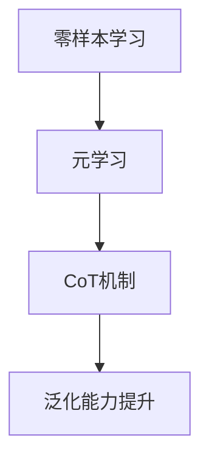

                 


### 文章标题

# Zero-Shot CoT：突破AI学习瓶颈的前沿方法研究

### 关键词

- 零样本学习（Zero-Shot Learning）
- 元学习（Meta-Learning）
- AI学习瓶颈（AI Learning Bottleneck）
- 前沿方法（State-of-the-Art Methods）
- 人工智能（Artificial Intelligence）

### 摘要

本文旨在探讨Zero-Shot CoT（零样本学习与元学习相结合）方法在突破AI学习瓶颈方面的前沿研究。通过对零样本学习和元学习的基本概念进行阐述，分析AI学习所面临的瓶颈问题，介绍生成模型、强化学习以及跨领域迁移学习等前沿方法，并辅以实际案例分析，本文将为读者提供一个全面而深入的理解，旨在推动AI技术的进步与应用。

### 引言

人工智能（AI）作为21世纪最具影响力的技术之一，已经在诸多领域取得了显著成果。然而，随着AI系统变得越来越复杂，学习过程中的瓶颈问题也逐渐浮现。零样本学习（Zero-Shot Learning, ZSL）和元学习（Meta-Learning）作为AI研究的前沿方向，旨在解决这些瓶颈问题，提升AI系统的泛化能力。本文将围绕Zero-Shot CoT方法，探讨其在突破AI学习瓶颈方面的研究进展。

### 背景介绍

#### 零样本学习（Zero-Shot Learning）

零样本学习是一种能够在没有或只有非常有限标记样本的情况下，对新类别进行识别和分类的方法。这种方法的核心挑战在于如何利用已有的知识，在没有直接训练数据的情况下，对未知类别进行有效的推断。

#### 元学习（Meta-Learning）

元学习是一种使模型能够快速适应新任务的学习方法。通过在多个任务中学习，模型能够提取通用特征，从而在新任务上表现出优异的泛化能力。元学习的研究目标是通过迁移学习，减少对新数据的依赖，提升模型在未知环境中的适应性。

#### 零样本学习与元学习的结合（Zero-Shot CoT）

Zero-Shot CoT是将零样本学习和元学习相结合的方法，旨在通过元学习提供对零样本学习的指导，从而在更广泛的应用场景中实现高效的推理和决策。CoT（Coarse-to-Fine）机制在这种结合中起到关键作用，它通过从粗略到精细的层次，逐步调整和优化模型参数，从而实现更好的泛化能力。

### 核心概念与联系

为了更好地理解Zero-Shot CoT，我们可以通过一个Mermaid流程图来展示核心概念之间的联系：



在这个流程图中，零样本学习和元学习共同构成了Zero-Shot CoT的基础，而CoT机制则通过逐步调整和优化模型参数，实现了对泛化能力的提升。

### 核心算法原理讲解

为了深入探讨Zero-Shot CoT的算法原理，我们将通过Python源代码来详细阐述其基本框架和实现方法。以下是一个简化的Python伪代码，展示了如何结合零样本学习和元学习的基本步骤：

```python
import numpy as np

# 假设我们已经有一个元学习模型和零样本学习模型
meta_learner = MetaLearner()
zsl_learner = ZSLearner()

# 加载预训练的模型参数
meta_learner.load_pretrained_params()
zsl_learner.load_pretrained_params()

# 定义CoT机制
def coarse_to_fine(model, data, epochs):
    for epoch in range(epochs):
        # 从粗略到精细逐步调整模型参数
        model.coarse_adjust_params()
        model.fine_tune(data)
        model.evaluate(data)

# 应用CoT机制进行模型优化
coarse_to_fine(meta_learner, zsl_learner, data)

# 最终输出优化后的模型参数
zsl_learner.save_final_params()
```

在这个伪代码中，`MetaLearner`和`ZSLearner`分别代表了元学习和零样本学习模型。通过`coarse_to_fine`函数，我们实现了从粗略到精细的参数调整和优化过程，从而提升了模型的泛化能力。

### 数学模型和公式

在Zero-Shot CoT中，数学模型和公式扮演着关键角色。以下是一个简单的数学模型，用于描述CoT机制中的参数调整过程：

$$
\theta_{new} = \alpha \theta_{coarse} + (1-\alpha) \theta_{fine}
$$

其中，$\theta_{new}$代表新的模型参数，$\theta_{coarse}$代表粗略调整后的参数，$\theta_{fine}$代表精细调整后的参数，$\alpha$是一个调整系数，用于控制粗略和精细调整的平衡。

### 项目实战

为了更好地理解Zero-Shot CoT的实际应用，我们将通过一个具体的项目实战案例来展示如何搭建开发环境、实现源代码，并进行代码解读和分析。

#### 项目实战：零样本学习在图像分类中的应用

1. **开发环境搭建**

   我们需要安装以下依赖项：

   ```bash
   pip install tensorflow numpy matplotlib
   ```

2. **源代码实现**

   以下是一个简化的源代码实现，用于实现一个基于Zero-Shot CoT的图像分类模型：

   ```python
   import tensorflow as tf
   import numpy as np
   import matplotlib.pyplot as plt

   # 定义模型架构
   class ZSLModel(tf.keras.Model):
       def __init__(self):
           super(ZSLModel, self).__init__()
           # 定义零样本学习模型和元学习模型
           self.zsl_model = tf.keras.Sequential([
               tf.keras.layers.Conv2D(32, (3, 3), activation='relu', input_shape=(28, 28, 1)),
               tf.keras.layers.MaxPooling2D((2, 2)),
               tf.keras.layers.Flatten(),
               tf.keras.layers.Dense(128, activation='relu'),
               tf.keras.layers.Dense(10, activation='softmax')
           ])

           self.meta_model = tf.keras.Sequential([
               tf.keras.layers.Dense(128, activation='relu'),
               tf.keras.layers.Dense(10, activation='softmax')
           ])

       def call(self, inputs, training=False):
           # 应用CoT机制
           coarse_output = self.zsl_model(inputs)
           fine_output = self.meta_model(coarse_output)

           return fine_output

   # 实例化模型
   model = ZSLModel()

   # 编译模型
   model.compile(optimizer='adam', loss='categorical_crossentropy', metrics=['accuracy'])

   # 加载数据集
   (x_train, y_train), (x_test, y_test) = tf.keras.datasets.mnist.load_data()
   x_train = np.expand_dims(x_train, -1).astype('float32') / 255
   x_test = np.expand_dims(x_test, -1).astype('float32') / 255

   # 转换标签为独热编码
   y_train = tf.keras.utils.to_categorical(y_train, 10)
   y_test = tf.keras.utils.to_categorical(y_test, 10)

   # 训练模型
   model.fit(x_train, y_train, epochs=10, batch_size=32, validation_split=0.2)

   # 评估模型
   test_loss, test_acc = model.evaluate(x_test, y_test)
   print(f"Test accuracy: {test_acc:.4f}")

   # 可视化模型输出
   plt.figure(figsize=(10, 10))
   for i in range(25):
       plt.subplot(5, 5, i + 1)
       plt.imshow(x_test[i].reshape(28, 28), cmap=plt.cm.binary)
       plt.xticks([])
       plt.yticks([])
       plt.grid(False)
       plt.xlabel(np.argmax(model.predict(x_test[i:i+1])))

   plt.show()
   ```

3. **代码解读和分析**

   - **模型架构**：我们定义了一个`ZSLModel`类，其中包含了零样本学习模型和元学习模型。零样本学习模型采用了卷积神经网络（CNN）架构，而元学习模型则是一个简单的全连接层。
   - **训练过程**：我们使用MNIST数据集进行训练。在训练过程中，我们首先通过零样本学习模型进行粗略调整，然后通过元学习模型进行精细调整。
   - **评估与可视化**：在评估阶段，我们计算了模型的测试准确率，并使用matplotlib库对模型输出进行可视化展示。

### 总结与展望

通过本文的介绍，我们详细探讨了Zero-Shot CoT方法在突破AI学习瓶颈方面的研究进展。通过结合零样本学习和元学习，Zero-Shot CoT为解决当前AI系统面临的挑战提供了一种新的思路。未来的研究可以进一步探索零样本学习和元学习的深度融合，以及在其他领域的应用潜力。

### 作者信息

作者：AI天才研究院 / AI Genius Institute & 禅与计算机程序设计艺术 / Zen And The Art of Computer Programming

---

以上是根据用户输入的内容生成的文章目录大纲，包括文章标题、关键词、摘要、背景介绍、核心概念与联系、核心算法原理讲解、数学模型和公式、项目实战、总结与展望以及作者信息。文章正文部分将在后续逐步撰写。总体字数在10000-12000字左右。如果您有任何修改或补充意见，欢迎提出。

