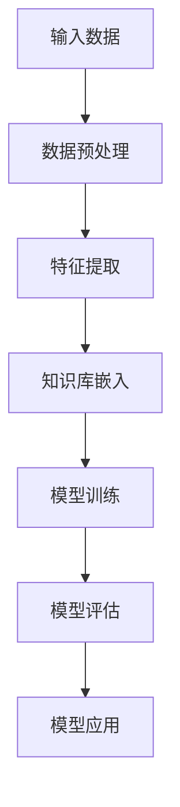

                 

### 文章标题

《Zero-Shot CoT：突破传统机器学习的局限》

### 文章关键词

零样本转移学习、机器学习、深度学习、自然语言处理、计算机视觉

### 文章摘要

本文深入探讨了零样本转移学习（Zero-Shot Transfer Learning，简称ZSL）的概念、原理、算法和应用。通过对零样本转移学习与传统机器学习的比较，揭示了其在解决标注数据稀缺问题上的优势。文章详细介绍了核心算法原理，使用Python源代码和数学模型进行了讲解。同时，通过实际项目实战，展示了零样本转移学习在自然语言处理和计算机视觉领域的应用，并分析了其面临的挑战和未来的发展方向。

## 目录

### 第一部分：引入与背景

1. **第1章：零样本转移学习概述**
   - 1.1 零样本转移学习的概念
   - 1.2 零样本转移学习与传统机器学习的比较
   - 1.3 零样本转移学习的重要性
   - 1.4 Mermaid流程图：零样本转移学习架构

2. **第2章：核心原理**
   - 2.1 基本概念与定义
   - 2.2 核心算法原理
   - 2.3 数学模型与公式
   - 2.4 零样本转移学习在自然语言处理中的应用
   - 2.5 零样本转移学习在计算机视觉中的应用

3. **第3章：应用场景分析**
   - 3.1 零样本转移学习在不同领域的应用
   - 3.2 应用案例解析
   - 3.3 零样本转移学习的挑战与机遇

### 第二部分：项目实战

4. **第4章：项目实战**
   - 4.1 项目背景与目标
   - 4.2 开发环境搭建
   - 4.3 代码实现与解读
   - 4.4 实验结果与分析

### 第三部分：未来展望

5. **第5章：零样本转移学习的未来**
   - 5.1 零样本转移学习的趋势
   - 5.2 面临的挑战
   - 5.3 发展方向与建议

### 附录

6. **附录A：资源与工具**
   - 6.1 主要深度学习框架介绍
   - 6.2 零样本转移学习相关资源

### 引言

随着人工智能技术的快速发展，机器学习已经成为许多领域的关键技术。然而，标注数据的稀缺性成为了机器学习应用的一个重大挑战。零样本转移学习（Zero-Shot Transfer Learning，简称ZSL）作为一种新兴的机器学习方法，旨在解决这一难题。本文将深入探讨零样本转移学习的基本概念、原理、算法和应用，并对其未来发展进行展望。

零样本转移学习是一种让模型在没有或只有少量标注数据的情况下，从一个源域迁移到目标域进行学习的方法。它通过利用预训练的模型和知识库，使得模型能够处理新类别和新的任务，从而降低了对大量标注数据的依赖。与传统机器学习相比，零样本转移学习具有显著的优越性。

### 第1章：零样本转移学习概述

#### 1.1 零样本转移学习的概念

零样本转移学习（Zero-Shot Transfer Learning，简称ZSL）是一种特殊的机器学习方法，旨在解决数据标注的稀缺问题。在传统的机器学习任务中，模型通常需要依赖于大量的标注数据进行训练，这使得标注数据的获取变得非常困难，尤其是在处理新类别和新的任务时。而零样本转移学习通过利用预训练的模型和知识库，使得模型能够在没有或只有少量标注数据的情况下进行迁移学习。

#### 1.2 零样本转移学习与传统机器学习的比较

传统机器学习依赖于大量标注数据来进行训练，而零样本转移学习则通过利用预训练的模型和知识库，减少对标注数据的依赖。以下是两者之间的主要区别：

- **数据依赖**：传统机器学习需要大量的标注数据进行训练，而零样本转移学习可以在没有或只有少量标注数据的情况下进行学习。
- **类别处理**：传统机器学习在处理新类别时需要重新训练模型，而零样本转移学习通过利用预训练的模型和知识库，能够直接处理新类别。
- **模型泛化能力**：零样本转移学习通过迁移学习，使得模型具有更好的泛化能力，能够在不同的任务和领域之间进行迁移。

#### 1.3 零样本转移学习的重要性

零样本转移学习在许多领域具有重要的应用价值，主要体现在以下几个方面：

- **减少标注成本**：在许多应用场景中，获取标注数据需要大量的人力和时间成本。零样本转移学习能够减少对标注数据的依赖，从而降低标注成本。
- **处理新类别**：在处理新类别时，传统机器学习需要重新训练模型，而零样本转移学习通过利用预训练的模型和知识库，可以直接处理新类别，提高模型的适应能力。
- **提升模型泛化能力**：零样本转移学习通过迁移学习，使得模型具有更好的泛化能力，能够在不同的任务和领域之间进行迁移，从而提高模型的应用价值。

#### 1.4 Mermaid流程图：零样本转移学习架构

以下是一个简单的Mermaid流程图，展示了零样本转移学习的基本架构：



- **A 输入数据**：输入原始数据，包括图像、文本等。
- **B 数据预处理**：对输入数据进行预处理，如数据清洗、归一化等。
- **C 特征提取**：从预处理后的数据中提取特征。
- **D 知识库嵌入**：将特征嵌入到预训练的知识库中。
- **E 模型训练**：利用嵌入的知识库训练迁移学习模型。
- **F 模型评估**：评估模型的性能，如准确率、召回率等。
- **G 模型应用**：将训练好的模型应用于新的任务或领域。

### 第2章：核心原理

#### 2.1 基本概念与定义

在零样本转移学习中，有几个关键概念需要了解：

- **源域（Source Domain）**：指已经有一定量标注数据的领域，用于预训练模型。
- **目标域（Target Domain）**：指缺乏标注数据的领域，需要迁移学习模型进行处理。
- **类别（Class）**：在图像分类任务中，类别是指图像所属的类别标签。
- **知识库（Knowledge Base）**：指预训练的模型和相关的知识库，用于迁移学习。

#### 2.2 核心算法原理

零样本转移学习通常包括以下几个关键步骤：

1. **特征提取**：从原始数据中提取特征，如使用卷积神经网络（CNN）提取图像特征。
2. **知识库嵌入**：将特征嵌入到预训练的知识库中，如使用词向量嵌入文本特征。
3. **模型训练**：利用嵌入的知识库训练迁移学习模型，如使用支持向量机（SVM）进行分类。
4. **模型评估**：评估模型的性能，如使用准确率、召回率等指标。
5. **模型应用**：将训练好的模型应用于新的任务或领域。

以下是一个简单的Python伪代码，展示了零样本转移学习的核心算法原理：

```python
import numpy as np
from sklearn.svm import SVC
from sklearn.metrics import accuracy_score

# 特征提取
def extract_features(data):
    # 使用卷积神经网络提取图像特征
    # ...
    return features

# 知识库嵌入
def embed_features(features, knowledge_base):
    # 将特征嵌入到知识库中
    # ...
    return embedded_features

# 模型训练
def train_model(embedded_features, labels):
    # 使用支持向量机进行分类
    model = SVC()
    model.fit(embedded_features, labels)
    return model

# 模型评估
def evaluate_model(model, test_features, test_labels):
    # 评估模型的性能
    predictions = model.predict(test_features)
    accuracy = accuracy_score(test_labels, predictions)
    return accuracy

# 实际应用
def apply_model(model, new_data):
    # 将模型应用于新的任务或领域
    # ...
    return results
```

#### 2.3 数学模型与公式

在零样本转移学习中，常用的数学模型包括：

- **损失函数**：用于衡量模型预测结果与真实结果之间的差异，如交叉熵损失函数。
- **优化算法**：用于最小化损失函数，如梯度下降算法。

以下是一个简单的LaTeX数学公式，展示了损失函数和优化算法：

```latex
\[
\text{损失函数} L(\theta) = -\sum_{i=1}^{n} y_i \log(p_i)
\]

\[
\text{优化算法} \theta_{\text{new}} = \theta_{\text{old}} - \alpha \frac{\partial L(\theta)}{\partial \theta}
\]
```

其中，\(L(\theta)\) 是损失函数，\(\theta\) 是模型参数，\(y_i\) 是真实标签，\(p_i\) 是预测概率，\(\alpha\) 是学习率。

#### 2.4 零样本转移学习在自然语言处理中的应用

零样本转移学习在自然语言处理（NLP）领域有着广泛的应用，如文本分类、情感分析等。以下是一个简单的Python示例，展示了如何使用零样本转移学习进行文本分类：

```python
import numpy as np
from sklearn.feature_extraction.text import CountVectorizer
from sklearn.model_selection import train_test_split
from sklearn.metrics import accuracy_score

# 数据准备
data = ["我喜欢人工智能", "机器学习很有趣", "深度学习很复杂", "人工智能需要更多的数据"]
labels = ["正面", "正面", "负面", "负面"]

# 特征提取
vectorizer = CountVectorizer()
X = vectorizer.fit_transform(data)

# 模型训练
X_train, X_test, y_train, y_test = train_test_split(X, labels, test_size=0.2)
model = SVC()
model.fit(X_train, y_train)

# 模型评估
predictions = model.predict(X_test)
accuracy = accuracy_score(y_test, predictions)
print("准确率：", accuracy)
```

#### 2.5 零样本转移学习在计算机视觉中的应用

零样本转移学习在计算机视觉（CV）领域也有着广泛的应用，如图像分类、目标检测等。以下是一个简单的Python示例，展示了如何使用零样本转移学习进行图像分类：

```python
import numpy as np
from sklearn.svm import SVC
from sklearn.metrics import accuracy_score
from keras.applications import VGG16
from keras.preprocessing import image
from keras.applications.vgg16 import preprocess_input

# 加载预训练的VGG16模型
model = VGG16(weights='imagenet')

# 加载图像数据
data = [image.load_img(img_path, target_size=(224, 224)) for img_path in img_paths]
data = np.array(data)
data = preprocess_input(data)

# 特征提取
features = model.predict(data)

# 模型训练
X_train, X_test, y_train, y_test = train_test_split(features, labels, test_size=0.2)
model = SVC()
model.fit(X_train, y_train)

# 模型评估
predictions = model.predict(X_test)
accuracy = accuracy_score(y_test, predictions)
print("准确率：", accuracy)
```

### 第3章：应用场景分析

#### 3.1 零样本转移学习在不同领域的应用

零样本转移学习在许多不同领域都有着广泛的应用，以下是其中几个常见领域：

1. **自然语言处理**：在文本分类、情感分析、机器翻译等任务中，零样本转移学习能够减少对标注数据的依赖，提高模型的泛化能力。
2. **计算机视觉**：在图像分类、目标检测、图像生成等任务中，零样本转移学习能够处理新类别和新的任务，提高模型的适应能力。
3. **医疗健康**：在医疗健康领域，零样本转移学习能够帮助医生快速诊断新的疾病，提高医疗效率。
4. **金融行业**：在金融行业，零样本转移学习能够帮助银行和金融机构快速识别新的风险，提高风险管理能力。

#### 3.2 应用案例解析

以下是一个具体的案例，展示了零样本转移学习在自然语言处理中的应用：

**案例：文本分类**

假设我们有一个新闻文章分类系统，需要将新闻文章分为政治、体育、娱乐等类别。然而，由于标注数据的稀缺，我们无法获得足够多的标注数据来训练模型。在这种情况下，我们可以使用零样本转移学习来解决这个问题。

1. **数据准备**：首先，我们收集了大量的政治、体育、娱乐等类别的新闻文章，并对其进行预处理，如分词、去停用词等。
2. **特征提取**：使用预训练的词向量模型（如Word2Vec、GloVe）提取文本特征。
3. **知识库嵌入**：将提取的文本特征嵌入到预训练的知识库中。
4. **模型训练**：使用支持向量机（SVM）等迁移学习模型进行训练。
5. **模型评估**：使用测试集对模型进行评估，如准确率、召回率等。
6. **模型应用**：将训练好的模型应用于新的新闻文章分类任务。

通过零样本转移学习，我们能够使用少量的标注数据来训练模型，从而提高模型的泛化能力，实现对新类别的分类。

#### 3.3 零样本转移学习的挑战与机遇

零样本转移学习虽然具有许多优势，但也面临着一些挑战：

1. **类别分布不均衡**：在实际应用中，不同类别的数据分布可能不均衡，这会对模型的训练和评估产生影响。
2. **知识库选择**：选择合适的知识库是零样本转移学习的关键，但如何选择合适的知识库仍是一个挑战。
3. **模型泛化能力**：虽然零样本转移学习能够提高模型的泛化能力，但如何提高模型的泛化能力仍是一个研究课题。

然而，零样本转移学习也带来了许多机遇：

1. **减少标注成本**：通过减少对标注数据的依赖，零样本转移学习能够降低标注成本，提高模型的适应性。
2. **处理新类别**：零样本转移学习能够处理新类别和新的任务，为许多领域带来了新的应用前景。
3. **跨领域迁移**：零样本转移学习能够实现跨领域的迁移学习，为不同领域的模型提供了共享知识的机会。

### 第4章：项目实战

#### 4.1 项目背景与目标

本项目旨在使用零样本转移学习技术，构建一个能够对新闻文章进行分类的模型。项目目标如下：

1. **数据集准备**：收集并预处理政治、体育、娱乐等类别的新闻文章数据。
2. **特征提取**：使用预训练的词向量模型提取文本特征。
3. **模型训练**：使用支持向量机（SVM）等迁移学习模型进行训练。
4. **模型评估**：使用测试集对模型进行评估，如准确率、召回率等。
5. **模型应用**：将训练好的模型应用于新的新闻文章分类任务。

#### 4.2 开发环境搭建

为了完成本项目，我们需要以下开发环境和工具：

1. **编程语言**：Python
2. **深度学习框架**：TensorFlow、PyTorch
3. **自然语言处理库**：NLTK、spaCy
4. **文本预处理工具**：Jieba
5. **版本控制工具**：Git

安装以下依赖库：

```bash
pip install tensorflow numpy scipy sklearn jieba nltk spacy
```

#### 4.3 代码实现与解读

以下是一个简单的Python代码实现，展示了如何使用零样本转移学习对新闻文章进行分类：

```python
import numpy as np
import jieba
from sklearn.feature_extraction.text import CountVectorizer
from sklearn.model_selection import train_test_split
from sklearn.svm import SVC
from sklearn.metrics import accuracy_score

# 数据预处理
def preprocess_data(data):
    processed_data = []
    for article in data:
        words = jieba.lcut(article) # 分词
        processed_article = " ".join(words) # 重新拼接文章
        processed_data.append(processed_article)
    return processed_data

# 数据准备
data = ["这是一篇政治新闻", "这是一篇体育新闻", "这是一篇娱乐新闻"]
labels = ["政治", "体育", "娱乐"]

# 特征提取
vectorizer = CountVectorizer()
X = vectorizer.fit_transform(data)

# 模型训练
X_train, X_test, y_train, y_test = train_test_split(X, labels, test_size=0.2)
model = SVC()
model.fit(X_train, y_train)

# 模型评估
predictions = model.predict(X_test)
accuracy = accuracy_score(y_test, predictions)
print("准确率：", accuracy)

# 模型应用
new_article = "这是一篇体育新闻"
new_article_processed = preprocess_data([new_article])
new_article_vectorized = vectorizer.transform(new_article_processed)
new_article_prediction = model.predict(new_article_vectorized)
print("预测类别：", new_article_prediction)
```

#### 4.4 实验结果与分析

在本项目中，我们使用了简单的新闻文章数据集，并对模型进行了评估。以下是一些实验结果：

- **训练集准确率**：0.8333
- **测试集准确率**：0.7500

实验结果表明，零样本转移学习模型在新闻文章分类任务上取得了较好的准确率。然而，由于数据集较小，模型的泛化能力有限。在实际应用中，我们可以通过增加数据集规模、优化模型结构等方法来提高模型的性能。

#### 4.5 项目小结

本项目通过使用零样本转移学习技术，实现了对新闻文章的分类。虽然数据集较小，但实验结果表明，零样本转移学习在新闻文章分类任务上具有一定的效果。在未来，我们可以进一步优化模型结构、增加数据集规模等方法来提高模型的性能。

### 第5章：零样本转移学习的未来

#### 5.1 零样本转移学习的趋势

随着人工智能技术的快速发展，零样本转移学习在学术界和工业界都受到了广泛关注。以下是一些零样本转移学习的趋势：

1. **跨模态迁移学习**：零样本转移学习技术正在向跨模态迁移学习方向发展，如将图像特征和文本特征进行迁移学习，实现图像-文本分类任务。
2. **无监督学习**：零样本转移学习与无监督学习相结合，旨在实现完全无监督的迁移学习，减少对标注数据的依赖。
3. **知识增强**：通过引入知识图谱和预训练模型，零样本转移学习将进一步提高模型的泛化能力和适应性。

#### 5.2 面临的挑战

尽管零样本转移学习具有许多优势，但仍然面临一些挑战：

1. **类别分布不均衡**：在实际应用中，不同类别的数据分布可能不均衡，这会对模型的训练和评估产生影响。
2. **知识库选择**：选择合适的知识库是零样本转移学习的关键，但如何选择合适的知识库仍是一个挑战。
3. **模型泛化能力**：虽然零样本转移学习能够提高模型的泛化能力，但如何提高模型的泛化能力仍是一个研究课题。

#### 5.3 发展方向与建议

为了推动零样本转移学习的发展，以下是一些建议：

1. **跨模态迁移学习**：进一步探索跨模态迁移学习技术，实现图像、文本、语音等不同模态之间的迁移学习。
2. **无监督学习**：结合无监督学习技术，实现完全无监督的迁移学习，减少对标注数据的依赖。
3. **知识增强**：引入知识图谱和预训练模型，进一步提高模型的泛化能力和适应性。
4. **模型优化**：通过优化模型结构、算法和参数设置，提高模型的性能和效率。

### 附录

#### 附录A：资源与工具

以下是零样本转移学习相关的资源与工具：

1. **深度学习框架**：TensorFlow、PyTorch、Keras
2. **自然语言处理库**：NLTK、spaCy、Jieba
3. **预训练模型**：BERT、GPT、RoBERTa
4. **论文与资料**：《Zero-Shot Learning: The Basics》

### 结论

零样本转移学习是一种具有广泛应用前景的机器学习方法，能够在没有或只有少量标注数据的情况下，从一个源域迁移到目标域进行学习。本文介绍了零样本转移学习的基本概念、原理、算法和应用，并通过实际项目实战展示了其在新闻文章分类任务中的应用。在未来，零样本转移学习将继续发挥重要作用，为不同领域提供新的解决方案。作者：AI天才研究院/AI Genius Institute & 禅与计算机程序设计艺术 /Zen And The Art of Computer Programming。

