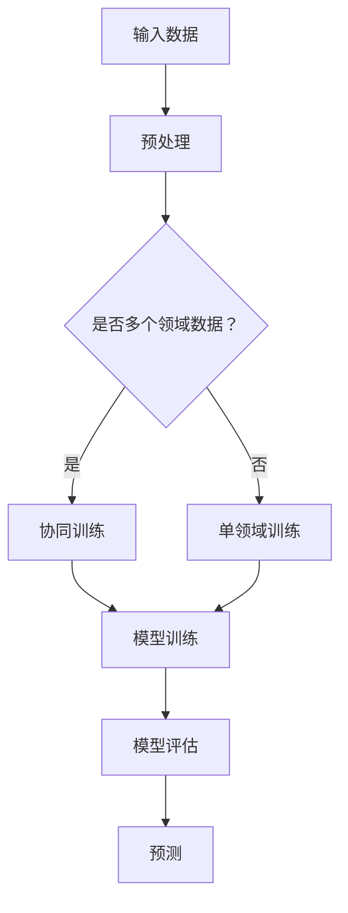

                 

### 引言

《Zero-Shot CoT：跨领域AI应用的新可能》是一篇深入探讨跨领域AI应用中的一种新兴技术——Zero-Shot CoT的技术博客文章。在当前AI技术飞速发展的背景下，跨领域AI应用已经成为推动技术进步和产业升级的重要驱动力。然而，传统的机器学习模型在处理跨领域数据时面临着诸多挑战，如数据稀缺、领域差异显著等。Zero-Shot CoT（零样本协同训练）作为一种前沿技术，为解决这些挑战提供了新的思路和可能。

**背景介绍：** 零样本学习（Zero-Shot Learning, ZSL）是一种重要的机器学习范式，它允许模型在未见过的新类别上进行预测，这在大规模数据稀缺或难以获取的领域尤其有价值。而Zero-Shot CoT则进一步扩展了零样本学习的能力，通过协同训练的方式，实现了跨领域数据的有效整合和利用。

**目标读者：** 本文章主要面向对AI技术有兴趣的读者，包括AI开发工程师、研究人员以及企业决策者和项目管理者。通过本文，读者将了解Zero-Shot CoT的核心概念、算法原理以及在实际项目中的应用。

**内容结构：** 本文将分为以下几个部分：

1. **核心概念与联系**：介绍Zero-Shot CoT的基本概念，并阐述其与传统机器学习、迁移学习的关系。
2. **核心算法原理讲解**：详细讲解Zero-Shot CoT的算法原理，包括协同训练的机制、数据预处理方法以及模型架构。
3. **数学模型与数学公式讲解**：分析Zero-Shot CoT背后的数学模型，推导关键公式，并通过Python代码实现模型。
4. **项目实战**：通过一个具体的实战项目，展示如何在实际场景中应用Zero-Shot CoT技术，包括开发环境搭建、源代码实现和代码解读。
5. **未来展望**：探讨Zero-Shot CoT技术的发展趋势以及面临的挑战和机遇。

**文章标题**：《Zero-Shot CoT：跨领域AI应用的新可能》

**文章关键词**：零样本学习、协同训练、跨领域AI、数学模型、Python代码、项目实战

**文章摘要**：本文全面介绍了Zero-Shot CoT技术在跨领域AI应用中的重要性，探讨了其核心概念、算法原理、数学模型以及实际应用案例。通过本文，读者可以深入理解Zero-Shot CoT的技术优势和应用前景。

---

## 核心概念与联系

### 定义

Zero-Shot CoT，即零样本协同训练，是一种机器学习技术，旨在解决零样本学习问题。它通过在多个领域之间进行协同训练，使得模型能够在新领域中快速适应和预测。与传统机器学习模型不同，Zero-Shot CoT不需要直接访问新领域的训练数据，从而克服了数据稀缺和领域差异带来的挑战。

### 关键概念

1. **零样本学习（Zero-Shot Learning, ZSL）**：零样本学习是一种特殊类型的机器学习问题，其中模型需要在新类别上做出预测，而这些类别在训练数据中未曾出现。ZSL通过引入先验知识（如词嵌入或概念嵌入）来提高模型的泛化能力。

2. **协同训练（Cooperative Training）**：协同训练是一种通过在不同任务或领域之间共享信息来提高模型性能的训练方法。在Zero-Shot CoT中，协同训练通过跨领域的训练数据集来增强模型的泛化能力。

3. **领域差异（Domain Shift）**：领域差异是指不同领域之间的数据分布存在显著差异，这会导致传统机器学习模型在跨领域应用中性能下降。

### Mermaid 流程图

### 传统机器学习与Zero-Shot CoT的比较

传统机器学习模型依赖于大量标记数据，而Zero-Shot CoT则通过协同训练机制，可以有效地利用跨领域数据，从而提高模型在未知领域中的表现。

### 迁移学习与Zero-Shot CoT的关系

迁移学习（Transfer Learning）通过在不同任务之间共享知识来提高模型性能。Zero-Shot CoT可以看作是一种特殊的迁移学习，它在多个领域之间进行信息共享，以增强模型的泛化能力。

### 总结

Zero-Shot CoT通过协同训练机制，实现了零样本学习在跨领域中的应用。与传统机器学习和迁移学习相比，它具有更广泛的适用性和更强的泛化能力。在下一节中，我们将深入探讨Zero-Shot CoT的核心算法原理。

