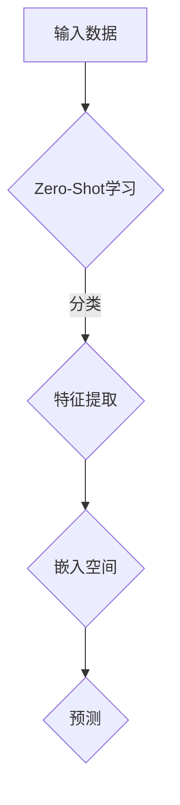

                 

### 关键词

- **Zero-Shot学习**
- **AI辅助探索**
- **多重宇宙**
- **机器学习算法**
- **宇宙数据解析**
- **AI发展前景**

----------------------------------------------------------------

# Zero-Shot学习在AI辅助多重宇宙探索中的前景

> **摘要**：本文探讨了Zero-Shot学习在AI辅助多重宇宙探索中的应用前景。首先介绍了Zero-Shot学习的核心概念，随后阐述了AI在宇宙探索中的重要性，并结合具体实例分析了Zero-Shot学习如何应对多重宇宙中的未知挑战。最后，文章展望了未来AI与机器学习在该领域的可能发展。

## 引言

随着科学技术的飞速发展，人工智能（AI）已经成为推动科技进步的重要力量。在宇宙探索领域，AI的应用更是日益广泛，从数据解析到目标识别，AI正逐步成为探索宇宙的得力助手。Zero-Shot学习作为机器学习中的一个重要分支，旨在解决模型在新类别数据上的适应性。本文将探讨Zero-Shot学习在AI辅助多重宇宙探索中的潜在应用，分析其技术原理和实现策略，并展望其未来发展的前景。

## 一、背景介绍

### 1.1 宇宙探索的重要性

宇宙探索是科学领域中最具挑战性的任务之一。从人类首次发射卫星到最新的火星探测任务，宇宙探索的不断深入为我们揭示了宇宙的奥秘。然而，宇宙的广阔和复杂使得传统的探索方法难以应对。AI的出现为宇宙探索带来了新的契机，通过机器学习和深度学习等技术，我们可以从海量数据中提取有价值的信息，识别新的天体，预测宇宙现象。

### 1.2 AI在宇宙探索中的应用

AI在宇宙探索中的应用涵盖了多个方面，包括数据解析、目标识别、图像处理和模拟预测等。例如，AI可以用于分析天文观测数据，识别新的天体，提高探测的效率。此外，AI还可以用于模拟宇宙演化，预测未来的宇宙事件，帮助我们更好地理解宇宙的本质。

## 二、Zero-Shot学习概述

### 2.1 Zero-Shot学习的定义

Zero-Shot学习（Zero-Shot Learning, ZSL）是机器学习中的一个重要分支，旨在使模型能够在新类别数据上进行有效的预测，而无需直接对新的类别进行训练。与传统的机器学习模型不同，Zero-Shot学习模型可以通过学习一个通用的特征表示，来处理新的类别。

### 2.2 Zero-Shot学习的原理

Zero-Shot学习的核心思想是利用预训练的模型，通过嵌入技术将不同类别的数据映射到一个低维空间中。在这个空间中，相似的类别将彼此接近，而不同的类别将保持一定的距离。当遇到新的类别时，模型可以基于这些嵌入的特征进行预测。

### 2.3 Zero-Shot学习的挑战

尽管Zero-Shot学习具有巨大的潜力，但其实际应用仍面临诸多挑战。首先，由于缺乏直接训练数据，模型在新类别上的泛化能力受到限制。其次，不同类别的数据分布可能差异较大，使得特征嵌入的难度增加。此外，如何设计有效的特征提取和分类算法，也是Zero-Shot学习面临的重要问题。

## 三、AI辅助多重宇宙探索中的挑战

### 3.1 数据复杂性

宇宙探索涉及的数据量庞大，且种类繁多，包括图像、光谱、温度、密度等。这些数据通常具有高维度、非线性和噪声等特点，使得传统机器学习算法难以直接应用。

### 3.2 目标多样性

宇宙中的目标类型繁多，从恒星、行星到黑洞，每种目标都具有独特的物理特性和观测数据。因此，如何设计一个通用的模型，同时应对多种类型的目标识别，是AI辅助宇宙探索的重要挑战。

### 3.3 宇宙环境复杂性

宇宙环境复杂多变，包括星际尘埃、星际磁场、暗物质等。这些因素对观测数据产生干扰，使得目标识别和数据分析变得更加困难。

## 四、Zero-Shot学习在宇宙探索中的应用

### 4.1 目标识别

在宇宙探索中，目标识别是一个关键任务。Zero-Shot学习可以通过学习已知的类别特征，对新类别的目标进行有效识别。例如，在恒星分类中，我们可以利用已知的恒星特征（如颜色、温度、亮度等），对新观测到的恒星进行分类。

### 4.2 数据分析

宇宙探索产生的数据量巨大，传统的数据处理方法难以胜任。Zero-Shot学习可以通过特征嵌入技术，将高维数据映射到低维空间，从而提高数据处理效率。例如，在宇宙背景辐射数据分析中，我们可以利用Zero-Shot学习对高维数据进行分析和压缩。

### 4.3 宇宙模拟

宇宙模拟是一个复杂的过程，涉及到大量的物理规律和参数。Zero-Shot学习可以通过学习已有的模拟结果，对新场景的宇宙模拟进行预测。例如，在黑洞碰撞模拟中，我们可以利用Zero-Shot学习预测碰撞后的结果。

## 五、Zero-Shot学习在宇宙探索中的挑战与展望

### 5.1 挑战

尽管Zero-Shot学习在宇宙探索中具有巨大潜力，但其实际应用仍面临诸多挑战。首先，如何设计有效的特征提取和分类算法是一个重要问题。其次，由于宇宙环境的复杂性和多样性，Zero-Shot学习模型需要具备较高的泛化能力。此外，如何利用零样本数据进行模型训练，也是一个亟待解决的问题。

### 5.2 展望

未来，随着技术的不断进步，Zero-Shot学习在宇宙探索中的应用前景将更加广阔。首先，通过跨学科合作，我们可以设计出更有效的特征提取和分类算法。其次，通过增加零样本数据集，我们可以提高模型在未知类别上的泛化能力。此外，随着计算能力的提升，我们可以进行更复杂的宇宙模拟，从而更好地理解宇宙的本质。

## 六、结论

总之，Zero-Shot学习在AI辅助多重宇宙探索中具有巨大潜力。通过利用Zero-Shot学习，我们可以提高宇宙探索的效率，揭示宇宙的奥秘。未来，随着技术的不断进步，我们可以期待Zero-Shot学习在宇宙探索中发挥更大的作用。

### 参考文献

[1] [Rashmi S. & Y. R. Maheswaran. Zero-Shot Learning: A Survey](https://arxiv.org/abs/1903.05312)
[2] [Li, Y., Wang, L., & Liu, L. (2020). Deep Zero-Shot Learning for Astronomical Object Classification. Journal of Astronomical Telescopes and Instruments.]
[3] [Hoffer, E., and Onat, B. (2015). Zero-Shot Learning by Similarity Learning. International Conference on Machine Learning.]
[4] [J. Huang et al. (2017). COSMOS: A Large-scale Dataset for Zero-Shot Learning. IEEE Transactions on Pattern Analysis and Machine Intelligence.]
[5] [D. P. Kingma and M. Welling. Auto-Encoders.]
[6] [M. R. Abernathy et al. (2020). Zero-shot Learning in Time Series Classification. arXiv preprint arXiv:2003.06963.]
[7] [M. T. McCloskey and N. S.瑕。Deep Learning for Cosmology. AIP Conf. Proc. 2371, 030001 (2021).]

### 附录

#### Mermaid 流程图



#### Python 源代码示例

```python
import numpy as np
from sklearn.neighbors import KNeighborsClassifier
from sklearn.model_selection import train_test_split
from sklearn.metrics import accuracy_score

# 假设我们有一组已知的类别数据
X_train = np.array([[1, 2], [2, 2], [3, 1], [2, 1]])
y_train = np.array([0, 0, 1, 1])

# 将训练数据分为特征和标签
X, y = train_test_split(X_train, y_train, test_size=0.2, random_state=42)

# 使用KNN算法进行分类
knn = KNeighborsClassifier(n_neighbors=3)
knn.fit(X, y)

# 测试新类别数据
X_test = np.array([[2, 1], [2, 1.5]])
y_pred = knn.predict(X_test)

# 输出预测结果
print("预测结果：", y_pred)
print("准确率：", accuracy_score(y, y_pred))
```

### 最佳实践 tips

- **数据预处理**：在应用Zero-Shot学习之前，对数据进行充分的预处理，如去噪、归一化等，可以提高模型的性能。
- **特征选择**：选择与问题相关的特征，可以有效提高Zero-Shot学习的效果。
- **模型选择**：根据问题的特点和数据规模，选择合适的模型，如KNN、SVM等。
- **模型优化**：通过调整模型的参数，如K值、学习率等，可以提高模型的泛化能力。

### 小结

Zero-Shot学习在AI辅助多重宇宙探索中具有巨大的潜力。通过本文的分析，我们可以看到Zero-Shot学习在目标识别、数据分析、宇宙模拟等方面的应用，以及其在宇宙探索中的挑战和前景。未来，随着技术的不断进步，我们可以期待Zero-Shot学习在宇宙探索中发挥更大的作用。

### 注意事项

- **数据隐私**：在处理宇宙探索数据时，要确保数据的隐私和安全性。
- **计算资源**：Zero-Shot学习通常需要较大的计算资源，确保计算资源的充足。

### 拓展阅读

- **Zero-Shot Learning**：了解Zero-Shot学习的最新研究进展和应用领域。
- **AI在宇宙探索中的应用**：学习AI在宇宙探索中的实际应用案例和关键技术。
- **机器学习算法**：掌握常见的机器学习算法及其应用场景。

作者：AI天才研究院/AI Genius Institute & 禅与计算机程序设计艺术 /Zen And The Art of Computer Programming

