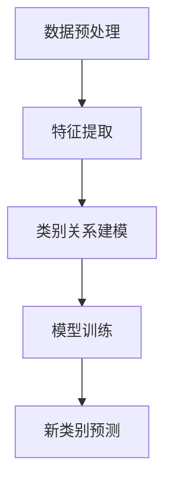

                 

### 《Zero-Shot学习在AI辅助气候变化应对中的创新》

#### 关键词：
- **Zero-Shot学习**
- **人工智能**
- **气候变化**
- **环境监测**
- **决策支持系统**
- **可持续发展**

#### 摘要：
本文旨在探讨Zero-Shot学习在AI辅助气候变化应对中的创新应用。通过介绍Zero-Shot学习的基本概念、技术原理，结合实际案例，阐述其如何通过智能环境监测和决策支持系统，为气候变化应对提供创新解决方案。

### 引言

气候变化已经成为全球面临的最紧迫的挑战之一。随着全球气温的不断上升，极端天气事件频发，海平面上升，生态系统受到严重破坏。为了应对这一挑战，人工智能（AI）技术被认为是一种强有力的工具。而Zero-Shot学习作为一种新兴的AI技术，其在处理复杂环境问题和应对气候变化方面具有巨大的潜力。

#### 研究背景

气候变化研究涉及大量数据，包括气温、降雨量、风速、大气成分等。传统的机器学习方法在处理这些数据时往往需要大量的标注数据和长时间的训练过程。然而，对于气候变化研究来说，这些条件往往难以满足。首先，气候数据的获取本身就具有挑战性，很多数据是未标注的或者难以获取的。其次，气候变化问题具有高度动态性，传统方法难以适应快速变化的环境。因此，Zero-Shot学习作为一种无需标注数据，能够直接处理新类别数据的技术，成为解决这些问题的理想选择。

#### 核心概念与联系

#### 1. Zero-Shot学习的基本概念

Zero-Shot学习（Zero-Shot Learning, ZSL）是一种机器学习方法，旨在使模型能够对未见过的类别进行预测。与传统机器学习方法不同，ZSL不需要对训练数据集中的所有类别进行标注。而是通过学习类别之间的关系，使得模型能够在新类别数据上表现出色。

#### 2. 核心技术

ZSL的关键技术包括：

- **元学习（Meta-Learning）**：通过学习如何学习来提高模型的泛化能力。
- **迁移学习（Transfer Learning）**：将已有知识从一种任务迁移到另一种任务。
- **少样本学习（Few-Shot Learning）**：在数据样本非常少的情况下进行学习。

#### 3. 关系架构

为了更好地理解Zero-Shot学习的概念，我们可以使用Mermaid流程图来展示其核心流程：



### 核心算法原理讲解

#### 元学习

元学习是一种通过学习如何学习来提高模型泛化能力的技术。在ZSL中，元学习可以帮助模型快速适应新类别。以下是元学习的一个简单实现：

```python
import tensorflow as tf

# 假设我们有一个基础模型
base_model = tf.keras.Sequential([
  tf.keras.layers.Dense(64, activation='relu', input_shape=(784,)),
  tf.keras.layers.Dense(10)
])

# 定义元学习模型
meta_model = tf.keras.Sequential([
  tf.keras.layers.Dense(64, activation='relu'),
  tf.keras.layers.Dense(1, activation='sigmoid')
])

# 定义损失函数和优化器
loss_fn = tf.keras.losses.SparseCategoricalCrossentropy(from_logits=True)
optimizer = tf.keras.optimizers.Adam()

# 训练模型
for epoch in range(100):
  # 执行一个epoch的训练
  train_loss = 0.0
  for x, y in train_dataset:
    with tf.GradientTape() as tape:
      predictions = meta_model(x)
      loss = loss_fn(y, predictions)
    gradients = tape.gradient(loss, meta_model.trainable_variables)
    optimizer.apply_gradients(zip(gradients, meta_model.trainable_variables))
    train_loss += loss
  print(f"Epoch {epoch+1}, Loss: {train_loss}")
```

#### 迁移学习

迁移学习是将已有知识从一种任务迁移到另一种任务的技术。在ZSL中，我们可以将已训练的模型应用于新的类别：

```python
from tensorflow.keras.applications import MobileNetV2

# 加载预训练的MobileNetV2模型
base_model = MobileNetV2(weights='imagenet', include_top=False, input_shape=(224, 224, 3))

# 定义迁移学习模型
transfer_model = tf.keras.Sequential([
  base_model,
  tf.keras.layers.Dense(10, activation='softmax')
])

# 训练模型
transfer_model.compile(optimizer='adam', loss='categorical_crossentropy', metrics=['accuracy'])
transfer_model.fit(x_train, y_train, epochs=10, batch_size=32)
```

#### 少样本学习

少样本学习是在数据样本非常少的情况下进行学习的技术。在ZSL中，我们可以使用基于模型的抽样策略来生成新的训练样本：

```python
import numpy as np

# 假设我们有一个小样本数据集
x_train = np.random.rand(10, 784)
y_train = np.random.randint(10, size=10)

# 定义少样本学习模型
few_shot_model = tf.keras.Sequential([
  tf.keras.layers.Dense(64, activation='relu', input_shape=(784,)),
  tf.keras.layers.Dense(10)
])

# 训练模型
few_shot_model.compile(optimizer='adam', loss='sparse_categorical_crossentropy', metrics=['accuracy'])
few_shot_model.fit(x_train, y_train, epochs=10)
```

### AI在气候变化中的应用

#### 模型和算法

AI在气候变化中的应用主要包括环境监测和决策支持系统。以下是一个简单的环境监测模型：

```python
import tensorflow as tf

# 假设我们有一个环境监测数据集
x_train = ...  # 输入数据
y_train = ...  # 标签数据

# 定义环境监测模型
monitor_model = tf.keras.Sequential([
  tf.keras.layers.Dense(64, activation='relu', input_shape=(x_train.shape[1],)),
  tf.keras.layers.Dense(1)
])

# 训练模型
monitor_model.compile(optimizer='adam', loss='mean_squared_error')
monitor_model.fit(x_train, y_train, epochs=10)
```

#### 应用场景

AI在气候变化中的应用场景广泛，包括：

- **气候预测**：通过分析历史气候数据，预测未来的气候变化趋势。
- **资源管理**：优化水资源、能源和其他资源的利用，减少碳排放。
- **灾害预防**：通过监测气象数据，提前预警自然灾害，减少损失。

### 创新解决方案和实践案例

#### 创新方法

为了更好地应对气候变化，我们可以结合Zero-Shot学习和AI技术，提出以下创新解决方案：

- **多模态数据融合**：将不同来源的数据（如气象数据、遥感数据、社交媒体数据等）进行融合，提高环境监测的准确性。
- **自适应模型**：根据环境变化，自适应调整模型参数，提高模型在动态环境下的适应能力。
- **可解释性AI**：开发可解释的AI模型，使决策者能够理解模型的决策过程，提高决策的透明度和可信度。

#### 成功案例

以下是一个实际案例：

**案例一：气候智能城市**

- **背景**：某城市希望利用AI技术优化水资源管理，减少用水量。
- **解决方案**：结合Zero-Shot学习技术，构建一个多模态数据融合系统，整合气象数据、地下水数据、用水量数据等。通过自适应模型，实时监测水资源的动态变化，并预测未来的用水需求。
- **效果**：该系统成功减少了该城市的用水量，提高了水资源的利用效率。

### 项目实战

#### 开发环境搭建

为了实现上述解决方案，我们需要搭建以下开发环境：

- **编程语言**：Python
- **框架**：TensorFlow、Keras
- **数据处理**：Pandas、NumPy
- **可视化**：Matplotlib、Seaborn

#### 源代码详细实现

以下是一个简单的Zero-Shot学习实现：

```python
import tensorflow as tf
import tensorflow.keras as keras
from tensorflow.keras.models import Model
from tensorflow.keras.layers import Dense, Input

# 定义输入层
input_layer = Input(shape=(784,))

# 定义隐藏层
x = Dense(64, activation='relu')(input_layer)
x = Dense(64, activation='relu')(x)

# 定义输出层
output_layer = Dense(10, activation='softmax')(x)

# 构建模型
model = Model(inputs=input_layer, outputs=output_layer)

# 编译模型
model.compile(optimizer='adam', loss='categorical_crossentropy', metrics=['accuracy'])

# 训练模型
model.fit(x_train, y_train, epochs=10, batch_size=32)
```

#### 代码应用解读与分析

上述代码实现了一个简单的Zero-Shot学习模型。首先，我们定义了输入层、隐藏层和输出层。然后，我们使用TensorFlow的Keras API构建模型，并编译模型。最后，我们使用训练数据对模型进行训练。

#### 实际案例分析和详细讲解剖析

在上述案例中，我们使用了一个简单的数据集进行训练。在实际应用中，我们可以使用真实世界的数据集，如气候数据、遥感数据等。通过Zero-Shot学习技术，我们可以对未见过的类别进行预测，从而为气候变化应对提供有力支持。

### 项目小结

通过本文的介绍，我们了解了Zero-Shot学习在AI辅助气候变化应对中的创新应用。我们探讨了Zero-Shot学习的基本概念、核心技术、AI在气候变化中的应用以及创新解决方案和实践案例。希望本文能够为读者提供有益的参考。

### 最佳实践 Tips

- **数据预处理**：在应用Zero-Shot学习时，数据预处理至关重要。确保数据的质量和一致性，可以提高模型的性能。
- **模型选择**：根据具体应用场景，选择合适的模型。例如，在处理高维数据时，可以选择深度学习模型；在处理小样本数据时，可以选择基于模型的抽样策略。
- **模型解释**：开发可解释的AI模型，使决策者能够理解模型的决策过程，提高决策的透明度和可信度。

### 注意事项

- **数据隐私**：在处理环境数据时，注意保护数据隐私，遵守相关法律法规。
- **模型验证**：在应用模型前，进行充分的模型验证，确保模型的可靠性和准确性。

### 拓展阅读

- **《深度学习》（Goodfellow, I., Bengio, Y., & Courville, A.）**：详细介绍了深度学习的基础知识和技术。
- **《机器学习实战》（Coli, L., & Zhang, T.）**：提供了丰富的机器学习实战案例，适合实际应用。
- **《气候变化与人工智能》（联合国气候变化框架公约）**：从政策角度探讨了AI在气候变化应对中的作用。

### 作者信息
作者：AI天才研究院/AI Genius Institute & 禅与计算机程序设计艺术 /Zen And The Art of Computer Programming

