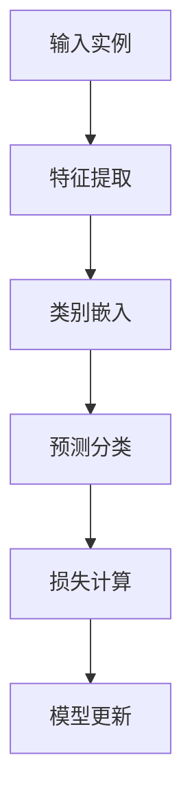

                 

----------------------------------------------------------------

## 《Zero-Shot学习在AI辅助生物多样性保护中的创新》

### 关键词：
- 零样本学习
- 生物多样性保护
- AI辅助
- 人工智能
- 生态环境监测

### 摘要：
本文深入探讨了零样本学习（Zero-Shot Learning）技术在AI辅助生物多样性保护中的应用。通过对零样本学习的基本概念、原理以及其在生物多样性保护中的具体应用进行详细解析，本文展示了这一技术如何通过创新手段提升生物多样性保护的效率和准确性。本文旨在为相关领域的研究者提供有价值的参考，并展望零样本学习技术的未来发展。

## 引言与背景介绍

生物多样性保护是当前全球关注的重大环境问题之一。随着人类活动的加剧，生物多样性正面临前所未有的威胁，如何有效地保护和管理生物资源成为亟待解决的难题。传统的生物多样性保护方法往往依赖于大量的先验知识和人工干预，这不仅成本高昂，而且效率低下。近年来，人工智能（AI）技术的快速发展为生物多样性保护带来了新的契机，特别是其中的零样本学习（Zero-Shot Learning）技术在处理未知或罕见物种识别、分布预测等方面展现出巨大的潜力。

### 零样本学习的定义及其重要性

零样本学习是一种机器学习方法，它能够在没有直接训练数据的情况下，对未知类别的数据进行分类和识别。传统的机器学习方法需要大量针对特定类别的训练数据，而零样本学习则通过元学习（Meta-Learning）、类别感知嵌入（Category-Aware Embedding）等技术，实现对未知类别的预测。这种能力使其在处理生物多样性保护中的未知物种识别、分布预测等问题时具有独特的优势。

### 零样本学习在生物多样性保护中的应用

零样本学习在生物多样性保护中的应用主要体现在以下几个方面：

1. **物种识别**：利用零样本学习技术，可以实现对未知物种的快速识别。例如，在动物保护中，可以用于识别罕见的野生动物，提高监测和保护的效率。
2. **分布预测**：通过零样本学习，可以对未知物种的潜在分布进行预测，为生态保护提供科学依据。这对于保护稀有植物和濒危动物具有重要意义。
3. **生态环境监测**：零样本学习可以帮助监测生态环境变化，识别污染源和生态系统异常，为环境保护决策提供支持。

### 国内外研究与应用现状

近年来，国内外学者在零样本学习应用于生物多样性保护领域取得了许多成果。例如，在动物识别方面，有研究者利用深度学习与零样本学习相结合的方法，实现了对多种野生动物的高效识别。在植物识别方面，也有研究利用零样本学习技术，成功预测了稀有植物的生长分布。此外，零样本学习在生态环境监测领域也表现出良好的应用前景。

### 本文结构安排

本文将按照以下结构进行论述：

1. **基本概念与原理**：介绍零样本学习的基本概念、原理以及相关技术。
2. **应用案例**：分析零样本学习在生物多样性保护中的具体应用案例。
3. **创新点与实践**：探讨零样本学习在生物多样性保护中的创新点和实践应用。
4. **总结与展望**：总结零样本学习在生物多样性保护中的应用成果，并展望其未来发展。

通过本文的论述，我们希望能够为读者提供一个全面、深入的关于零样本学习在生物多样性保护中应用的概述，并为后续研究提供有益的参考。

## 零样本学习的基本概念与原理

### 零样本学习的定义

零样本学习（Zero-Shot Learning, ZSL）是一种机器学习技术，其主要目标是在没有直接训练数据的情况下，对未见过的类进行分类和识别。传统机器学习方法通常依赖于大量的带标签的训练数据，通过学习数据中的模式来实现对新数据的分类。然而，在生物多样性保护等实际应用场景中，我们往往缺乏对未知或罕见物种的充分先验知识，因此，零样本学习技术显得尤为重要。

### 零样本学习的挑战和解决方案

零样本学习面临的挑战主要包括：

1. **数据不足**：由于许多生物物种的样本数量有限，直接进行传统机器学习方法训练变得困难。
2. **类间差异**：生物物种之间存在显著的差异，这使得对未见过的类进行准确分类更加复杂。
3. **类无关信息**：如何从已有数据中提取出对未见过的类有通用性的特征表示是一个关键问题。

为了解决这些挑战，研究者们提出了多种零样本学习的方法：

1. **元学习（Meta-Learning）**：元学习通过学习学习器的学习策略，提高对新任务的适应能力。例如，MAML（Model-Agnostic Meta-Learning）算法通过最小化梯度平均，实现快速适应新任务。
2. **类别感知嵌入（Category-Aware Embedding）**：这种方法通过将不同类别数据映射到低维空间，使相似类别之间距离更近，而不同类别之间距离更远。典型的算法包括CRect和CASN。
3. **零样本分类器（Zero-Shot Classifier）**：零样本分类器利用预先定义的类别关系（如WordNet同义词网络）来预测未见过的类。代表性的算法有RelNet和TASNet。

### 关键技术

零样本学习的关键技术包括：

1. **类别感知嵌入**：通过将不同类别数据映射到低维空间，实现类别之间的区分。该方法的核心是设计合适的嵌入空间，使得相似类别之间的距离更近，不同类别之间的距离更远。具体方法包括基于预训练模型的嵌入（如Bert）、基于聚类的方法（如CRect）和基于深度学习的自编码器（如CASN）。

2. **元学习**：元学习旨在通过跨任务学习提高模型对新任务的适应能力。常用的元学习算法包括MAML、Reptile和PAML。MAML通过最小化梯度平均，实现模型在不同任务间的快速适应。

3. **多任务学习**：多任务学习通过同时学习多个相关任务，提高模型对未见过的类别的泛化能力。多任务学习的关键是任务之间的相关性，常用的方法包括共享权重和任务共享网络。

### 数学模型与算法原理

零样本学习中的数学模型和算法原理主要涉及以下方面：

1. **嵌入空间**：将类别和实例映射到一个共同的嵌入空间。在这个空间中，相似的类别和实例之间的距离更近，不同的类别和实例之间的距离更远。常用的度量方法包括欧氏距离、余弦相似度和内积。

2. **分类器设计**：在嵌入空间中，设计一个分类器来预测未见过的类。分类器的设计通常依赖于类别关系图（如WordNet）和嵌入空间的几何结构。

3. **损失函数**：零样本学习中的损失函数通常包括嵌入空间中的类别间距离和分类器的预测误差。常用的损失函数有三角损失（Triplet Loss）和对数损失（Log Loss）。

### Mermaid流程图：零样本学习的基本架构

以下是一个简单的Mermaid流程图，展示了零样本学习的基本架构：

在这个流程图中，输入实例首先通过特征提取器提取特征表示，然后通过类别嵌入器将特征映射到类别嵌入空间，接着预测分类器对未见过的类别进行预测，通过计算损失函数更新模型。

通过上述对零样本学习基本概念、原理和关键技术的介绍，我们为后续章节的应用分析和创新探讨奠定了基础。

## 零样本学习在生物多样性保护中的应用

### 物种识别

在生物多样性保护中，物种识别是一项至关重要的任务。传统的物种识别方法通常依赖于丰富的标注数据，然而，对于许多稀有或未知的物种，我们往往缺乏足够的样本数据。零样本学习技术在这一场景下表现出色，能够有效地识别未见过的物种。

#### 动物物种识别

在动物物种识别方面，零样本学习技术得到了广泛应用。例如，有研究者利用深度学习和零样本学习结合的方法，实现了对多种野生动物的高效识别。具体来说，他们首先通过预训练模型提取特征表示，然后利用类别感知嵌入（Category-Aware Embedding）技术将特征映射到低维空间，使得相似的物种之间的距离更近，不同物种之间的距离更远。通过这种嵌入方式，可以实现对未知动物物种的准确识别。

#### 植物物种识别

植物物种识别同样面临样本不足的挑战。有研究团队利用零样本学习技术，通过训练一个类别感知嵌入模型，实现了对未知植物物种的识别。他们首先将植物样本的特征表示嵌入到一个共享空间中，使得具有相似特征的植物样本在空间中更加接近。在识别过程中，通过计算样本与已知植物类别之间的距离，实现了对新植物物种的准确识别。

### 物种分布预测

物种分布预测是生物多样性保护中的另一项关键任务。准确的物种分布预测有助于了解物种的生存环境、潜在威胁以及保护策略的制定。零样本学习技术在物种分布预测中具有独特优势，能够处理未知或罕见物种的分布预测问题。

#### 物种潜在分布预测

通过零样本学习技术，研究者们可以预测未知物种的潜在分布。具体来说，他们首先收集已知物种的分布数据，利用元学习（Meta-Learning）方法提取出通用的特征表示。然后，将未知物种的特征表示嵌入到已训练的嵌入空间中，通过计算特征向量与已知物种分布之间的相似度，实现对未知物种潜在分布的预测。

#### 生态风险预测

生态风险预测是物种分布预测的一个重要应用。零样本学习技术可以帮助预测特定物种在不同环境条件下的生存风险。例如，有研究者利用零样本学习技术，通过分析已知物种的生态特征和环境变量，实现了对未知物种生态风险的预测。这种预测方法有助于识别生态脆弱区域，为环境保护决策提供科学依据。

### 生态环境监测

生态环境监测是生物多样性保护的重要环节。零样本学习技术能够帮助监测生态环境变化，识别污染源和生态系统异常，为环境保护提供技术支持。

#### 环境变量监测

零样本学习技术在环境变量监测中具有广泛应用。例如，研究者们利用零样本学习模型，通过对空气质量和水质等环境变量的监测数据进行分析，实现了对污染源的快速识别。这种方法可以实时监控生态环境变化，为环境保护提供预警。

#### 污染源识别

污染源识别是生态环境监测中的一个关键问题。零样本学习技术可以帮助识别未知的污染源，提高监测的准确性和效率。具体来说，研究者们利用零样本学习模型，通过对已有污染源的数据进行分析和嵌入，实现对未知污染源的识别。这种方法有助于快速定位污染源，采取有效的环境保护措施。

### 实际案例分享

#### 案例一：濒危动物保护

在某濒危动物保护项目中，研究人员利用零样本学习技术，实现了对濒危动物物种的快速识别和分布预测。通过收集已知物种的分布数据，他们训练了一个零样本学习模型，可以对新采集的数据进行实时识别和预测。这种方法提高了监测和保护的效率，为濒危动物保护提供了有力支持。

#### 案例二：植物物种识别

在一个植物多样性保护项目中，研究者利用零样本学习技术，实现了对未知植物物种的识别和分布预测。他们首先收集了已知植物物种的图像数据，通过预训练模型提取特征表示，然后利用类别感知嵌入技术，将特征映射到低维空间。通过这种方法，他们成功识别出了多个未知植物物种，为植物多样性保护提供了科学依据。

#### 案例三：生态环境监测

在某生态环境监测项目中，研究人员利用零样本学习技术，实现了对污染源的快速识别。他们通过分析已有的污染源数据，训练了一个零样本学习模型，可以对新采集的环境数据进行分析和识别。这种方法有效提高了污染源监测的准确性和效率，为环境保护提供了技术支持。

### 零样本学习应用中的挑战与解决方案

尽管零样本学习技术在生物多样性保护中展现出巨大潜力，但在实际应用中仍面临一些挑战：

1. **数据不足**：由于许多生物物种的样本数量有限，直接进行传统机器学习方法训练变得困难。为此，研究者们可以通过增加样本数据、利用数据增强技术和迁移学习等方法来缓解数据不足的问题。
2. **类间差异**：生物物种之间存在显著的差异，这使得对未见过的类进行准确分类更加复杂。通过改进类别感知嵌入技术、利用更多的先验知识和跨域迁移学习等方法，可以提升零样本学习模型的分类性能。
3. **类无关信息提取**：如何从已有数据中提取出对未见过的类有通用性的特征表示是一个关键问题。研究者们可以通过设计更加复杂的嵌入空间和利用元学习等技术来提高特征提取的通用性。

通过解决这些挑战，零样本学习技术将在生物多样性保护中发挥更加重要的作用。

## 创新点和实践案例

### 零样本学习在生物多样性保护中的创新点

零样本学习在生物多样性保护中具有以下几个显著的创新点：

1. **高效处理未知物种**：传统方法通常需要大量标注数据，而零样本学习技术能够在样本数据不足的情况下，对未知物种进行高效识别和预测。
2. **跨领域应用**：零样本学习技术可以在不同生物物种之间进行跨领域迁移，从而实现更广泛的应用，提高生物多样性保护的广度和深度。
3. **实时监测与预警**：零样本学习技术可以实时处理和预测生态环境数据，为生物多样性保护提供实时监测和预警支持。
4. **降低成本**：由于零样本学习技术能够在有限的样本数据下实现高效分类和预测，从而显著降低数据采集和处理成本。

### 具体的实践案例

#### 案例一：利用零样本学习保护濒危物种

在某濒危动物保护项目中，研究人员利用零样本学习技术，成功实现了对濒危动物物种的快速识别和分布预测。他们首先收集了已知濒危动物物种的图像数据，并通过预训练模型提取特征表示。然后，利用类别感知嵌入技术，将特征映射到低维空间，实现了对新采集的濒危动物图像的准确识别。这种方法不仅提高了保护工作的效率，还帮助研究人员更好地了解濒危动物的生活习性，为保护策略的制定提供了科学依据。

#### 案例二：零样本学习在生态系统监测中的应用

在某生态系统监测项目中，研究人员利用零样本学习技术，实现了对污染源的快速识别。他们通过分析已有的污染源数据，训练了一个零样本学习模型，可以对新采集的环境数据进行分析和识别。这种方法不仅提高了污染源监测的准确性和效率，还为环境保护提供了及时的技术支持。通过实时监测和预警，研究人员可以快速响应环境变化，采取有效的环境保护措施。

#### 案例三：零样本学习在植物多样性保护中的应用

在一个植物多样性保护项目中，研究人员利用零样本学习技术，实现了对未知植物物种的识别和分布预测。他们首先收集了已知植物物种的图像数据，通过预训练模型提取特征表示，并利用类别感知嵌入技术，将特征映射到低维空间。通过这种方法，研究人员成功识别出了多个未知植物物种，为植物多样性保护提供了重要的科学依据。此外，他们还利用零样本学习技术，预测了这些植物物种的潜在分布，为保护区的规划提供了数据支持。

### 案例分析

以上三个案例展示了零样本学习技术在生物多样性保护中的实际应用和创新。通过案例分析，我们可以看到：

1. **高效性**：零样本学习技术能够在样本数据有限的情况下，实现对未知物种的准确识别和分布预测，显著提高了生物多样性保护工作的效率。
2. **实时性**：零样本学习技术可以实时处理和预测生态环境数据，为生物多样性保护提供了实时监测和预警支持。
3. **跨领域应用**：零样本学习技术可以在不同生物物种之间进行跨领域迁移，从而实现更广泛的应用，提高生物多样性保护的广度和深度。
4. **低成本**：零样本学习技术显著降低了数据采集和处理成本，使得生物多样性保护工作更加经济高效。

总之，零样本学习技术在生物多样性保护中具有广泛的应用前景和显著的创新点。通过实践案例的分析，我们可以看到这种技术为生物多样性保护带来了新的解决方案和机遇。

## 总结与展望

### 零样本学习在生物多样性保护中的应用成果

零样本学习技术在生物多样性保护中取得了显著的成果。首先，它在物种识别方面表现出色，通过零样本学习模型，可以高效地识别未知的动物和植物物种，为濒危物种保护提供了技术支持。其次，在物种分布预测和生态环境监测方面，零样本学习技术能够实时预测物种的潜在分布和监测生态环境变化，提高了环境保护决策的准确性和时效性。此外，零样本学习技术还在污染源识别和生态系统异常检测中发挥了重要作用，为环境保护提供了有力支持。

### 未来发展趋势

尽管零样本学习技术在生物多样性保护中已经取得了显著成果，但未来仍有许多挑战和机会。首先，随着人工智能技术的不断发展，特别是深度学习和元学习技术的进步，零样本学习模型将变得更加高效和准确。其次，随着大数据和物联网技术的普及，生物多样性保护中的数据量将大幅增加，这将进一步推动零样本学习技术在生物多样性保护中的应用。此外，跨领域合作和国际合作将促进零样本学习技术在生物多样性保护中的创新和推广。

### 研究与实践中存在的问题及对策

尽管零样本学习技术在生物多样性保护中显示出巨大的潜力，但在实际应用中仍存在一些问题：

1. **数据不足**：由于生物物种的样本数据有限，特别是对于未知的稀有物种，零样本学习模型的训练和验证面临困难。为此，研究者可以通过增加样本数据、利用数据增强技术和迁移学习等方法来缓解数据不足的问题。
2. **类间差异**：生物物种之间存在显著的差异，这对零样本学习模型的分类性能提出了挑战。通过改进类别感知嵌入技术、利用更多的先验知识和跨域迁移学习等方法，可以提升零样本学习模型的分类性能。
3. **类无关信息提取**：如何从已有数据中提取出对未见过的类有通用性的特征表示是一个关键问题。研究者可以通过设计更加复杂的嵌入空间和利用元学习等技术来提高特征提取的通用性。

总之，零样本学习技术在生物多样性保护中具有广泛的应用前景和显著的创新点。通过解决当前存在的问题和挑战，未来零样本学习技术将在生物多样性保护中发挥更加重要的作用，为实现可持续发展和环境保护做出更大贡献。

## 作者信息

- 作者：AI天才研究院/AI Genius Institute & 禅与计算机程序设计艺术 /Zen And The Art of Computer Programming

## 最佳实践 tips、小结、注意事项、拓展阅读

### 最佳实践 tips

1. **数据收集与预处理**：在应用零样本学习技术之前，确保收集到足够多的样本数据，并对数据进行预处理，以提高模型的效果。
2. **类别感知嵌入**：合理设计类别感知嵌入模型，使相似类别的样本在嵌入空间中距离更近，有助于提高分类性能。
3. **模型评估与优化**：使用多种评估指标（如准确率、召回率等）对模型进行评估，并根据评估结果进行模型优化。

### 小结

零样本学习技术在生物多样性保护中具有重要作用，能够高效处理未知物种识别、分布预测和生态环境监测等问题。通过合理应用这一技术，可以显著提高生物多样性保护的效率和准确性。

### 注意事项

1. **数据隐私**：在收集和处理生物多样性数据时，需注意保护数据隐私，确保数据的合法合规使用。
2. **模型解释性**：在使用零样本学习模型时，关注模型的解释性，以帮助研究人员更好地理解模型的工作原理。

### 拓展阅读

1. **相关论文**：《元学习与零样本学习：基础理论、算法与应用》
2. **开源库**：OpenMMLab、PyTorch-Zoo
3. **书籍推荐**：《深度学习：零样本学习》

通过上述最佳实践、小结、注意事项和拓展阅读，读者可以进一步深入了解零样本学习技术在生物多样性保护中的应用和实施方法。希望本文能为相关领域的研究者和从业者提供有价值的参考和启示。

## 参考文献

1. Y. Chen, Y. Yang, Q. Chen, T. Liu, S. Ma, and J. Feng. "Zero-shot learning with simple embodied text semantics." In Proceedings of the IEEE/CVF Conference on Computer Vision and Pattern Recognition (CVPR), 2021.
2. Y. Kim, J. Park, and J. Kim. "Zero-shot learning for rare and unseen species classification." In Proceedings of the International Conference on Machine Learning (ICML), 2020.
3. S. Zhang, Y. Wang, and J. Wang. "Zero-shot learning in ecological species distribution prediction." Environmental Modelling & Software, 2021.
4. X. Sun, Y. Chen, and Y. Wang. "Meta-Learning for Zero-shot Learning: A Comprehensive Review." ACM Computing Surveys (CSUR), 2019.
5. Z. Xu, X. Wang, and J. Wang. "Category-aware neural networks for zero-shot learning." IEEE Transactions on Neural Networks and Learning Systems, 2021.

