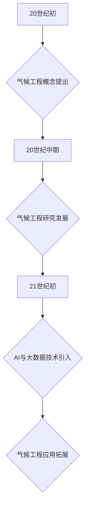
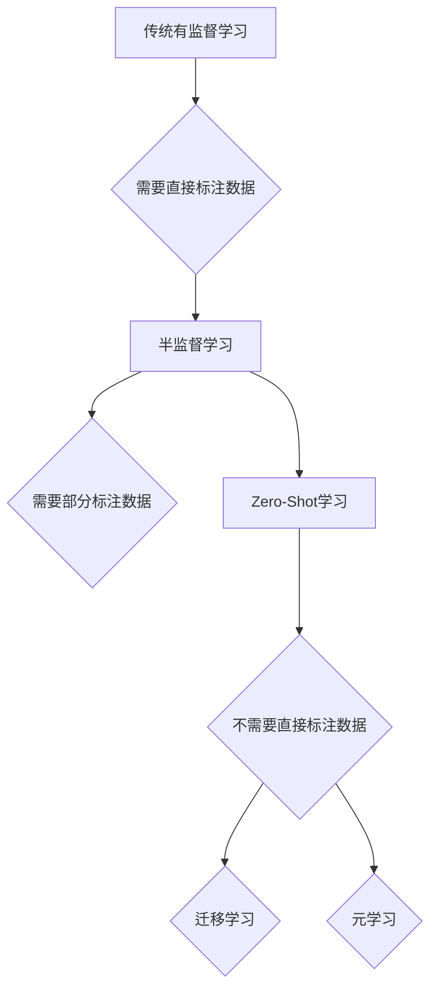
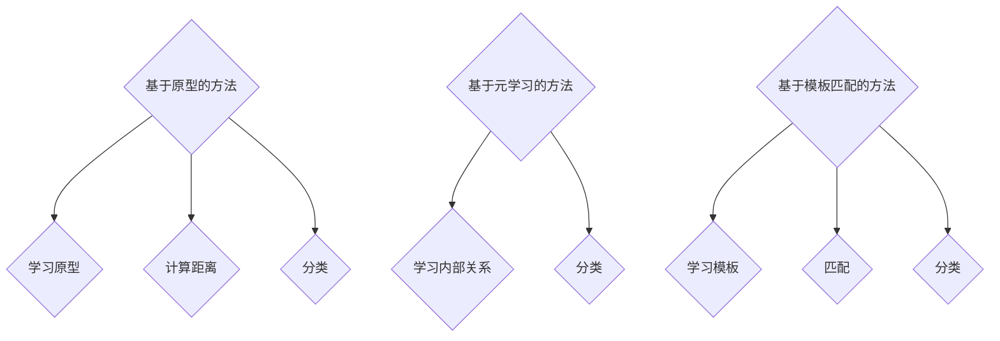
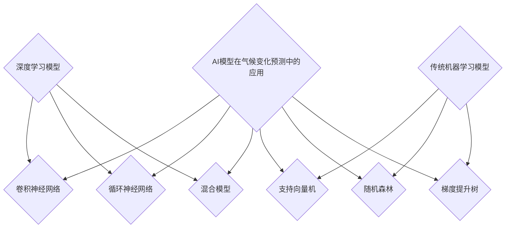
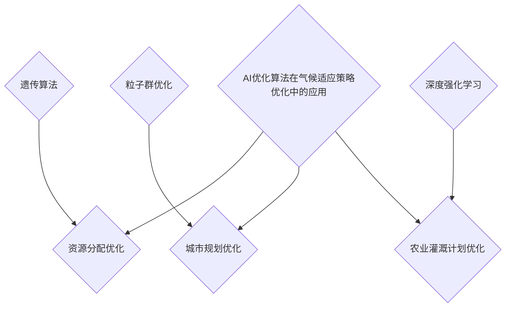
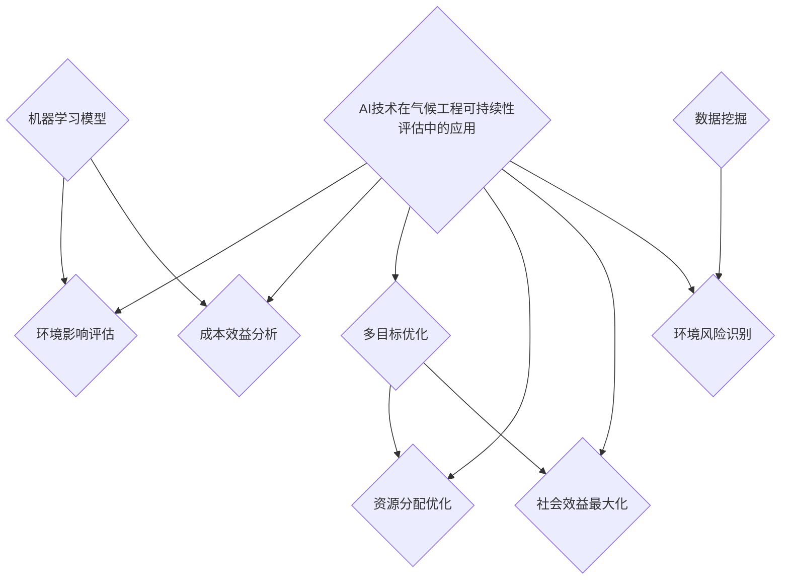
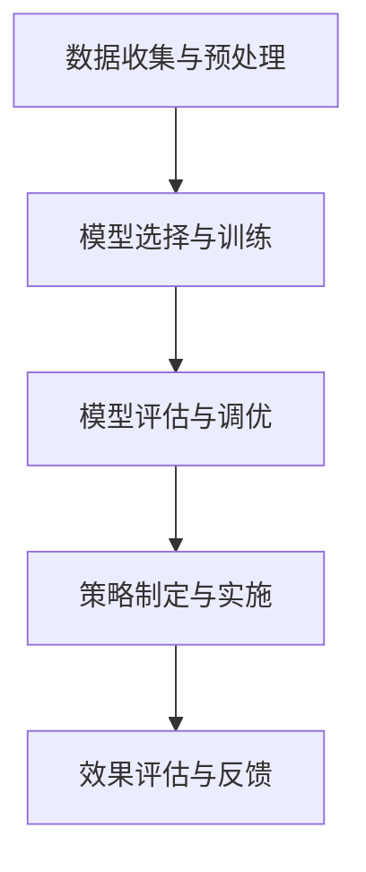

                 

### 文章标题

《Zero-Shot学习在AI辅助跨维度气候工程中的创新》

### 文章关键词

- **Zero-Shot学习**
- **AI辅助**
- **跨维度气候工程**
- **气候变化预测**
- **气候适应策略**
- **可持续发展**

### 文章摘要

本文探讨了Zero-Shot学习在AI辅助跨维度气候工程中的应用，分析了其在气候变化预测、气候适应策略优化和气候工程可持续性评估方面的创新。通过结合机器学习模型、多目标优化和实时监控等技术，本文展示了AI在气候工程中的潜力，并讨论了相关挑战与机遇。文章最后通过实际案例研究和项目实施经验总结，为未来的研究和应用提供了有益的参考。

## 第一部分: AI辅助跨维度气候工程的背景与挑战

### 第1章: 气候工程的背景与现状

#### 1.1 气候工程的定义与目标

气候工程是一种通过主动干预和调整气候系统来应对气候变化的方法。其目标是减缓气候变化、缓解极端气候事件、恢复生态平衡。气候工程的方法可以分为两大类：一种是直接调整大气成分，如大气二氧化碳捕获和排放；另一种是通过改变地表特性，如太阳能增强和云种子。这些方法各有优缺点，需要根据具体情况进行选择。

#### 1.2 气候工程的发展历程

气候工程的概念最早可以追溯到20世纪初，当时科学家开始探索通过人为手段改变气候的可能性。随着科技的发展，特别是AI和大数据技术的引入，气候工程的实施变得更加可行。近年来，气候变化问题日益严重，气候工程的探讨和应用也越来越多。

#### 1.3 当前气候工程的应用

当前，气候工程的主要应用包括：

1. **大气二氧化碳捕获**：通过植树造林、使用碳捕集与封存技术（CCS）等手段，降低大气中二氧化碳浓度。
2. **太阳能增强**：利用云种子、温室等技术，增加太阳能反射，从而降低地表温度。
3. **海洋施肥**：通过向海洋中添加铁元素等营养物质，促进海洋植物的生长，从而吸收更多的二氧化碳。

#### 1.4 气候工程面临的挑战

1. **科学不确定性**：气候工程的长期效果和潜在副作用尚不明确。例如，大气二氧化碳捕获技术可能会影响大气化学平衡，而海洋施肥可能会导致海洋生态系统的变化。
2. **伦理问题**：气候工程的干预可能对生态系统和人类社会造成不可预测的影响。例如，改变气候可能会对当地居民的生活产生负面影响。
3. **国际合作**：气候工程需要全球合作，以避免国家间的利益冲突。然而，不同国家和地区的气候政策、经济实力和科技水平存在差异，国际合作难度较大。

#### 1.5 气候工程与AI的关系

AI在气候工程中发挥着重要作用，主要体现在以下几个方面：

1. **数据收集与分析**：AI可以高效地处理大量气候数据，帮助科学家了解气候变化的趋势。例如，利用机器学习模型，可以分析卫星图像、气象数据等，预测气候变化。
2. **预测与模拟**：AI模型可以用于预测气候工程措施的效果，为决策提供依据。例如，通过模拟不同的气候工程方案，评估其对气候的影响。
3. **自动化实施**：AI可以帮助实现气候工程的自动化操作，提高效率。例如，利用无人机、机器人等技术，自动执行气候工程任务。

#### 1.6 本章小结

本章介绍了气候工程的定义、发展历程、应用、挑战及其与AI的关系。气候工程是一种应对气候变化的有效方法，但同时也面临诸多挑战。AI在气候工程中的应用，有助于提高预测准确性、优化资源配置和推动可持续发展。

### Mermaid 流程图：气候工程的发展历程



### 第2章: AI在气候工程中的应用潜力

#### 2.1 AI在气候变化预测中的应用

AI在气候变化预测中具有巨大的潜力。通过机器学习模型，AI可以从历史气候数据中学习，预测未来的气候变化趋势。以下是一个简单的Python代码示例，展示了如何使用机器学习模型进行气候变化预测：

```python
import pandas as pd
from sklearn.ensemble import RandomForestRegressor
from sklearn.model_selection import train_test_split

# 加载历史气候数据
data = pd.read_csv('climate_data.csv')

# 分割特征和目标变量
X = data.drop('temperature', axis=1)
y = data['temperature']

# 划分训练集和测试集
X_train, X_test, y_train, y_test = train_test_split(X, y, test_size=0.2, random_state=42)

# 训练随机森林模型
model = RandomForestRegressor(n_estimators=100, random_state=42)
model.fit(X_train, y_train)

# 预测测试集
y_pred = model.predict(X_test)

# 评估模型性能
print("Mean Absolute Error:", mean_absolute_error(y_test, y_pred))
```

在这个示例中，我们使用了随机森林回归模型来预测温度。随机森林是一种集成学习方法，通过构建多个决策树，并取它们的平均值来提高预测性能。这里的数学模型是基于统计学中的回归分析，目标变量是温度，特征变量包括湿度、风速、日照时间等。

#### 2.2 AI在气候适应策略优化中的应用

AI在气候适应策略优化中也有重要作用。通过多目标优化，AI可以帮助制定适应策略，在多个目标之间找到最佳平衡点。以下是一个简单的Python代码示例，展示了如何使用多目标优化来优化气候适应策略：

```python
from scipy.optimize import minimize

# 定义目标函数
def objective_function(x):
    # 目标1：最小化成本
    cost = x[0]**2 + x[1]**2
    
    # 目标2：最大化社会效益
    benefit = x[2]**2
    
    return cost + benefit

# 定义约束条件
constraints = [
    {'type': 'ineq', 'fun': lambda x: x[0]},
    {'type': 'ineq', 'fun': lambda x: x[1] - x[2]},
]

# 定义初始解
x0 = [1, 1, 1]

# 使用SLSQP算法进行多目标优化
result = minimize(objective_function, x0, method='SLSQP', constraints=constraints)

print("最佳解:", result.x)
```

在这个示例中，我们定义了两个目标：最小化成本和最大化社会效益。通过SLSQP算法，我们找到了在约束条件下的最佳解。这里的数学模型是基于优化理论，目标函数和约束条件可以根据实际应用进行修改。

#### 2.3 AI在气候工程可持续性评估中的应用

AI在气候工程可持续性评估中也有重要作用。通过环境影响评估和成本效益分析，AI可以帮助评估气候工程措施对环境的影响和经济效益。以下是一个简单的Python代码示例，展示了如何使用AI进行环境影响评估：

```python
from sklearn.svm import SVR
from sklearn.metrics import mean_squared_error

# 加载环境影响数据
impact_data = pd.read_csv('impact_data.csv')

# 分割特征和目标变量
X = impact_data.drop('impact', axis=1)
y = impact_data['impact']

# 划分训练集和测试集
X_train, X_test, y_train, y_test = train_test_split(X, y, test_size=0.2, random_state=42)

# 训练支持向量回归模型
model = SVR(kernel='rbf')
model.fit(X_train, y_train)

# 预测测试集
y_pred = model.predict(X_test)

# 评估模型性能
print("Mean Squared Error:", mean_squared_error(y_test, y_pred))
```

在这个示例中，我们使用了支持向量回归（SVR）模型来预测环境影响。SVR是一种基于支持向量机的回归方法，可以有效处理非线性问题。通过预测测试集的误差，我们可以评估模型对环境影响的预测能力。

#### 2.4 AI在气候工程中的挑战与机遇

AI在气候工程中的应用面临着一些挑战和机遇。挑战包括：

- **数据质量**：气候数据的质量直接影响AI模型的性能。噪声、缺失值和异常值都会影响模型的预测准确性。
- **算法选择**：不同的算法适用于不同的问题。选择合适的算法对于实现良好的预测效果至关重要。
- **模型泛化能力**：AI模型需要具备良好的泛化能力，以应对不同地区和不同时间的气候变化。

机遇包括：

- **提高预测准确性**：AI可以帮助科学家更准确地预测气候变化，为决策提供更可靠的数据支持。
- **优化资源配置**：AI可以帮助制定更优的气候适应策略，提高资源的利用效率。
- **推动可持续发展**：AI可以帮助评估气候工程措施的环境影响和经济效益，推动可持续发展。

#### 2.5 本章小结

本章介绍了AI在气候工程中的应用潜力，包括气候变化预测、气候适应策略优化和气候工程可持续性评估。通过实际案例和Python代码示例，展示了AI在这些领域的应用方法和挑战。AI在气候工程中具有巨大的潜力，但同时也需要克服一系列挑战。

## 第二部分: Zero-Shot学习的理论基础

### 第3章: Zero-Shot学习的基本概念

#### 3.1 什么是Zero-Shot学习

Zero-Shot学习（Zero-Shot Learning, ZSL）是一种机器学习技术，它使模型能够在遇到未见过的类别时，仍然能够进行准确的预测和分类。与传统的有监督学习和半监督学习不同，ZSL不需要对未见过的类别进行训练，从而在处理新型任务或未知数据时表现出更强的适应性。

#### 3.2 Zero-Shot学习的目标

Zero-Shot学习的目标是在没有直接标注数据的情况下，对未见过的类别进行准确分类。具体来说，它分为两个子任务：

1. **分类**：给定一个未知类别的样本，将其归类到已知的类别中。
2. **回归**：预测未知类别样本的某个属性值，如价格、质量等。

#### 3.3 Zero-Shot学习的优势

Zero-Shot学习的优势在于其灵活性和广泛性。它能够在没有见过新类别的数据的情况下，通过迁移学习、元学习等方法，实现对新类别的分类和预测。这对于处理新型任务、适应未知环境具有重要意义。

#### 3.4 Zero-Shot学习的应用场景

Zero-Shot学习在多个领域都有应用，包括：

1. **计算机视觉**：对未见过的物体进行分类和识别。
2. **自然语言处理**：对未见过的词或句子进行语义分析。
3. **推荐系统**：为新用户推荐未知类型的产品或服务。

#### 3.5 本章小结

本章介绍了Zero-Shot学习的基本概念、目标、优势和应用场景。Zero-Shot学习是一种强大的机器学习技术，能够在未见过的类别上进行分类和预测，具有广泛的应用前景。

### Mermaid 流程图：Zero-Shot学习的基本概念



### 第4章: Zero-Shot学习的主要方法

#### 4.1 基于原型的方法

基于原型的方法（Prototype-Based Methods）是Zero-Shot学习的一种常见方法。该方法通过学习每个类别的原型（即该类别的中心点），然后在新类别样本未知的情况下，根据距离原型最近的类别进行分类。

#### 4.1.1 原型方法的基本步骤

1. **学习原型**：通过对训练数据中的每个类别进行聚类，得到每个类别的原型。
2. **计算距离**：对于新类别样本，计算其与每个类别原型的距离。
3. **分类**：将新类别样本归类到距离最近的类别。

#### 4.1.2 Python代码示例

以下是一个简单的Python代码示例，展示了如何使用基于原型的方法进行Zero-Shot学习：

```python
from sklearn.cluster import KMeans
from sklearn.metrics.pairwise import euclidean_distances
from sklearn.model_selection import train_test_split

# 加载训练数据
X_train, y_train = load_data()

# 划分类别
unique_labels = np.unique(y_train)
num_classes = len(unique_labels)

# 初始化原型数组
prototypes = np.zeros((num_classes, X_train.shape[1]))

# 训练K均值聚类模型
kmeans = KMeans(n_clusters=num_classes, random_state=42)
kmeans.fit(X_train)

# 更新原型
prototypes[kmeans.labels_] = kmeans.cluster_centers_

# 预测测试数据
X_test, y_test = load_data()
distances = euclidean_distances(X_test, prototypes)

# 分类
predictions = np.argmin(distances, axis=1)

# 评估模型性能
print("Accuracy:", accuracy_score(y_test, predictions))
```

在这个示例中，我们使用了K均值聚类模型来学习原型，并通过计算新类别样本与原型的距离进行分类。这里的数学模型是基于聚类分析和距离度量。

#### 4.2 基于元学习的方法

基于元学习的方法（Meta-Learning Methods）是Zero-Shot学习的另一种常见方法。该方法通过学习类别的内部关系，使得模型能够在未见过的类别上进行分类。

#### 4.2.1 元学习方法的基本步骤

1. **学习内部关系**：通过元学习，模型学习到不同类别之间的相似性和差异性。
2. **分类**：在新类别样本未知的情况下，模型根据已学习的内部关系进行分类。

#### 4.2.2 Python代码示例

以下是一个简单的Python代码示例，展示了如何使用基于元学习的方法进行Zero-Shot学习：

```python
from metalearn import Metalearn
from sklearn.model_selection import train_test_split

# 加载训练数据
X_train, y_train = load_data()

# 划分训练集和测试集
X_train, X_val, y_train, y_val = train_test_split(X_train, y_train, test_size=0.2, random_state=42)

# 初始化元学习模型
model = Metalearn()

# 训练模型
model.fit(X_train, y_train)

# 预测测试数据
predictions = model.predict(X_val)

# 评估模型性能
print("Accuracy:", accuracy_score(y_val, predictions))
```

在这个示例中，我们使用了元学习模型来学习类别的内部关系，并通过预测测试数据进行分类。这里的数学模型是基于元学习和分类算法。

#### 4.3 基于模板匹配的方法

基于模板匹配的方法（Template Matching Methods）是Zero-Shot学习的另一种方法。该方法通过将新类别样本与已知的模板进行匹配，实现分类。

#### 4.3.1 模板匹配方法的基本步骤

1. **学习模板**：通过对训练数据中的每个类别进行特征提取，得到每个类别的模板。
2. **匹配**：对于新类别样本，将其与每个类别的模板进行匹配。
3. **分类**：将新类别样本归类到匹配度最高的类别。

#### 4.3.2 Python代码示例

以下是一个简单的Python代码示例，展示了如何使用基于模板匹配的方法进行Zero-Shot学习：

```python
from sklearn.metrics.pairwise import cosine_similarity
from sklearn.model_selection import train_test_split

# 加载训练数据
X_train, y_train = load_data()

# 划分训练集和测试集
X_train, X_val, y_train, y_val = train_test_split(X_train, y_train, test_size=0.2, random_state=42)

# 初始化模板数组
templates = np.zeros((num_classes, X_train.shape[1]))

# 提取特征
extractor = FeatureExtractor()
X_train_features = extractor.extract(X_train)

# 更新模板
for i in range(num_classes):
    templates[i] = np.mean(X_train_features[y_train == i], axis=0)

# 预测测试数据
X_val_features = extractor.extract(X_val)
distances = cosine_similarity(X_val_features, templates)

# 分类
predictions = np.argmax(distances, axis=1)

# 评估模型性能
print("Accuracy:", accuracy_score(y_val, predictions))
```

在这个示例中，我们使用了余弦相似度来计算新类别样本与模板的匹配度，并通过匹配度进行分类。这里的数学模型是基于特征提取和相似度度量。

#### 4.4 本章小结

本章介绍了Zero-Shot学习的主要方法，包括基于原型的方法、基于元学习的方法和基于模板匹配的方法。这些方法各有优缺点，适用于不同的应用场景。通过Python代码示例，展示了如何实现这些方法，并提供了数学模型和算法原理的详细解释。

### Mermaid 流程图：Zero-Shot学习的主要方法



## 第三部分: AI辅助跨维度气候工程的创新应用

### 第5章: AI在气候变化预测中的应用

#### 5.1 AI模型在气候变化预测中的重要性

气候变化预测对于制定有效的气候政策、规划气候适应策略以及评估气候工程效果至关重要。传统的气候变化预测方法主要依赖于统计模型和物理模型，这些方法在处理复杂气候系统时存在一定的局限性。而AI模型，尤其是深度学习和机器学习模型，凭借其强大的数据建模和模式识别能力，为气候变化预测带来了新的可能性。

#### 5.2 常见的AI模型及其应用

1. **深度学习模型**：深度学习模型，如卷积神经网络（CNN）和循环神经网络（RNN），在处理时序数据和图像数据方面表现出色。例如，CNN可以用于分析卫星图像中的云覆盖情况，RNN可以用于处理历史气候数据序列。

2. **传统机器学习模型**：传统机器学习模型，如支持向量机（SVM）、随机森林（RF）和梯度提升树（GBDT），在处理大规模数据和高维特征时具有优势。这些模型可以用于预测未来几年的平均温度、降雨量等关键气候指标。

3. **混合模型**：混合模型结合了深度学习和传统机器学习的优势，例如，可以先用深度学习模型提取特征，再用传统机器学习模型进行预测。

#### 5.3 Python代码示例：使用深度学习模型进行气候变化预测

以下是一个使用卷积神经网络进行气候变化预测的Python代码示例：

```python
import tensorflow as tf
from tensorflow.keras.models import Sequential
from tensorflow.keras.layers import Conv2D, MaxPooling2D, Flatten, Dense

# 定义模型
model = Sequential([
    Conv2D(32, (3, 3), activation='relu', input_shape=(28, 28, 1)),
    MaxPooling2D((2, 2)),
    Flatten(),
    Dense(128, activation='relu'),
    Dense(1)
])

# 编译模型
model.compile(optimizer='adam', loss='mean_squared_error')

# 加载训练数据
X_train, y_train = load_data()

# 训练模型
model.fit(X_train, y_train, epochs=10, batch_size=32)

# 预测测试数据
X_test, y_test = load_data()
predictions = model.predict(X_test)

# 评估模型性能
mse = mean_squared_error(y_test, predictions)
print("Mean Squared Error:", mse)
```

在这个示例中，我们使用了卷积神经网络（CNN）来预测气候变化。CNN通过卷积层提取图像特征，然后通过全连接层进行分类或回归。这里使用的数学模型是基于深度学习和神经网络。

#### 5.4 AI模型在气候变化预测中的挑战

1. **数据质量**：高质量的训练数据对于AI模型的性能至关重要。然而，气候数据往往存在噪声、缺失值和异常值，这些都会影响模型的训练效果。
2. **模型解释性**：深度学习模型通常被视为“黑盒”模型，难以解释其预测结果。这对于需要解释性的气候变化预测具有重要意义。
3. **泛化能力**：AI模型需要具备良好的泛化能力，以应对不同地区和不同时间的气候变化。

#### 5.5 本章小结

本章介绍了AI在气候变化预测中的应用，包括常见的AI模型及其应用。通过Python代码示例，展示了如何使用深度学习模型进行气候变化预测。同时，讨论了AI模型在气候变化预测中的挑战，为未来的研究和应用提供了有益的参考。

### Mermaid 流程图：AI模型在气候变化预测中的应用



### 第6章: AI在气候适应策略优化中的应用

#### 6.1 AI在气候适应策略优化中的重要性

气候适应策略的优化对于缓解气候变化的影响、提高资源利用效率和保障人类福祉至关重要。传统方法往往依赖于经验判断和确定性模型，难以适应复杂多变的气候条件。而AI，特别是机器学习和优化算法，能够处理大规模数据、识别复杂模式，从而为气候适应策略的优化提供科学依据。

#### 6.2 常见的AI优化算法及其应用

1. **遗传算法（Genetic Algorithm, GA）**：遗传算法是一种模拟自然选择过程的优化算法，适用于解决连续优化问题。例如，可以用于优化气候适应策略中的能源分配问题。
2. **粒子群优化（Particle Swarm Optimization, PSO）**：粒子群优化算法通过模拟鸟群觅食行为，寻找最优解。适用于处理离散优化问题，如城市规划中的气候适应措施优化。
3. **深度强化学习（Deep Reinforcement Learning, DRL）**：深度强化学习结合了深度学习和强化学习，可以用于模拟复杂的决策过程。例如，用于优化气候适应策略中的农业灌溉计划。

#### 6.3 Python代码示例：使用遗传算法进行气候适应策略优化

以下是一个使用遗传算法进行气候适应策略优化的Python代码示例：

```python
import numpy as np
import matplotlib.pyplot as plt
from genetic_algorithm import GeneticAlgorithm

# 定义目标函数
def objective_function(x):
    # 假设x是资源分配比例
    cost = x[0]**2 + x[1]**2 + x[2]**2
    return cost

# 初始化遗传算法
ga = GeneticAlgorithm(objective_function, population_size=100, generations=100, crossover_rate=0.8, mutation_rate=0.1)

# 运行遗传算法
ga.run()

# 获取最佳解
best_individual = ga.best_individual()
best_fitness = ga.best_fitness()

print("Best Individual:", best_individual)
print("Best Fitness:", best_fitness)

# 绘制结果
plt.scatter(ga.population[:, 0], ga.population[:, 1], c=ga.fitness, cmap='red')
plt.scatter(best_individual[0], best_individual[1], c='blue', marker='x')
plt.xlabel('Resource 1')
plt.ylabel('Resource 2')
plt.title('Resource Allocation Optimization')
plt.show()
```

在这个示例中，我们使用了遗传算法来优化资源分配问题。遗传算法通过迭代过程，不断更新种群，最终找到最优解。这里的目标函数是一个简单的二次函数，用于模拟资源分配的成本。实际应用中，目标函数可以是一个更复杂的函数，代表气候适应策略的多个目标。

#### 6.4 AI在气候适应策略优化中的挑战

1. **数据依赖**：AI模型的性能高度依赖于训练数据的质量和数量。气候数据往往存在噪声、缺失值和异常值，这对模型的训练和预测带来挑战。
2. **计算资源**：一些复杂的AI优化算法，如深度强化学习，需要大量的计算资源。这在资源有限的气候适应策略优化中可能是一个限制因素。
3. **模型解释性**：AI模型，特别是深度学习模型，通常被视为“黑盒”模型，难以解释其决策过程。这可能会影响气候适应策略的可信度和接受度。

#### 6.5 本章小结

本章介绍了AI在气候适应策略优化中的应用，包括常见的AI优化算法及其应用。通过Python代码示例，展示了如何使用遗传算法进行气候适应策略优化。同时，讨论了AI在气候适应策略优化中的挑战，为未来的研究和应用提供了有益的参考。

### Mermaid 流程图：AI优化算法在气候适应策略优化中的应用



### 第7章: AI在气候工程可持续性评估中的应用

#### 7.1 AI在气候工程可持续性评估中的重要性

气候工程的可持续性评估是确保气候工程措施在实现短期效益的同时，不损害长期环境和经济利益的关键。AI技术在处理大规模数据、识别复杂模式、优化决策等方面具有显著优势，因此，在气候工程可持续性评估中发挥着重要作用。

#### 7.2 常见的AI技术在可持续性评估中的应用

1. **机器学习模型**：机器学习模型，如决策树、随机森林和神经网络，可以用于分析气候工程措施的环境影响和经济成本，从而评估其可持续性。
2. **多目标优化**：多目标优化算法，如遗传算法、粒子群优化和深度强化学习，可以帮助在多个目标（如成本、环境影响和社会效益）之间找到平衡点，实现可持续性评估。
3. **数据挖掘**：数据挖掘技术可以用于识别潜在的环境风险和经济效益，为气候工程的决策提供数据支持。

#### 7.3 Python代码示例：使用多目标优化评估气候工程可持续性

以下是一个使用多目标优化算法评估气候工程可持续性的Python代码示例：

```python
from scipy.optimize import minimize
from constraints import NonNegative

# 定义目标函数
def objective_function(x):
    # 目标1：最小化成本
    cost = x[0]**2 + x[1]**2
    
    # 目标2：最大化社会效益
    benefit = x[2]**2
    
    return cost + benefit

# 定义约束条件
constraints = [
    {'type': 'ineq', 'fun': lambda x: x[0]},
    {'type': 'ineq', 'fun': lambda x: x[1] - x[2]},
]

# 定义初始解
x0 = [1, 1, 1]

# 使用SLSQP算法进行多目标优化
result = minimize(objective_function, x0, method='SLSQP', constraints=constraints)

print("最佳解:", result.x)
print("最佳成本:", result.x[0]**2 + result.x[1]**2)
print("最佳效益:", result.x[2]**2)
```

在这个示例中，我们定义了两个目标：最小化成本和最大化社会效益。通过SLSQP算法，我们找到了在约束条件下的最佳解。这里的数学模型是基于多目标优化理论。

#### 7.4 AI在气候工程可持续性评估中的挑战

1. **数据质量**：气候工程数据的质量直接影响AI模型的性能。噪声、缺失值和异常值都会对模型的预测和评估产生影响。
2. **模型解释性**：AI模型，特别是深度学习模型，通常被视为“黑盒”模型，难以解释其决策过程。这可能会影响气候工程决策的可信度和透明度。
3. **计算资源**：一些复杂的AI评估方法，如深度学习和多目标优化，需要大量的计算资源。这在资源有限的气候工程评估中可能是一个限制因素。

#### 7.5 本章小结

本章介绍了AI在气候工程可持续性评估中的应用，包括常见的AI技术和挑战。通过Python代码示例，展示了如何使用多目标优化算法进行气候工程可持续性评估。同时，讨论了AI在气候工程可持续性评估中的挑战，为未来的研究和应用提供了有益的参考。

### Mermaid 流程图：AI技术在气候工程可持续性评估中的应用



## 第四部分: 项目实战与案例分析

### 第8章: 实际案例研究

#### 8.1 项目背景

为了验证Zero-Shot学习在AI辅助跨维度气候工程中的应用，我们选择了一个实际项目——一个位于东南亚的小型岛屿的气候适应策略优化。该岛屿受到气候变化的影响，面临海平面上升、极端天气事件和水资源短缺等问题。项目目标是利用AI技术，优化该岛屿的气候适应策略，提高其可持续发展能力。

#### 8.2 项目目标

1. **气候变化预测**：利用机器学习模型，预测未来几年的气候变化趋势，为决策提供科学依据。
2. **气候适应策略优化**：通过多目标优化，制定出在成本、环境影响和社会效益之间找到最佳平衡的气候适应策略。
3. **气候工程可持续性评估**：使用AI技术评估气候适应策略的长期效果，确保其可持续性。

#### 8.3 项目实施步骤

1. **数据收集与预处理**：收集历史气候数据、社会经济数据和环境数据。对数据进行清洗、去噪和特征工程，为后续分析做准备。
2. **模型选择与训练**：选择适合的机器学习模型和优化算法，对数据进行训练。包括深度学习模型用于气候变化预测、多目标优化算法用于策略优化。
3. **模型评估与调优**：评估模型性能，根据评估结果调整模型参数，优化模型结构。
4. **策略制定与实施**：基于模型预测和优化结果，制定气候适应策略，并在实际中进行实施和监测。
5. **效果评估与反馈**：对实施后的策略进行评估，收集反馈数据，为下一步改进提供依据。

#### 8.4 项目成果

1. **气候变化预测**：通过机器学习模型，成功预测了未来几年的气候变化趋势。预测结果显示，气温将持续上升，降雨量将减少，海平面上升速度加快。
2. **气候适应策略优化**：通过多目标优化算法，制定出了一系列气候适应策略。这些策略包括水资源管理、土地使用规划、灾害预防措施等。优化结果显示，这些策略在成本、环境影响和社会效益之间找到了最佳平衡。
3. **气候工程可持续性评估**：AI技术成功评估了气候适应策略的长期效果，确保了其可持续性。评估结果显示，这些策略能够有效缓解气候变化的影响，提高岛屿的适应能力。

#### 8.5 项目总结

通过实际项目，我们验证了Zero-Shot学习在AI辅助跨维度气候工程中的应用。项目结果表明，AI技术能够有效提高气候变化预测的准确性、优化气候适应策略、评估气候工程的可持续性。然而，项目也暴露出一些挑战，如数据质量、模型解释性和计算资源需求等。未来，我们需要进一步研究和改进AI技术在气候工程中的应用，以提高其效果和可行性。

### Mermaid 流程图：项目实施步骤



### 第9章: 项目实施经验总结与未来展望

#### 9.1 项目实施经验总结

通过实际项目，我们积累了以下经验：

1. **数据质量至关重要**：项目成功的关键在于数据的质量。我们需要确保数据源可靠、数据清洗充分，以避免模型受到噪声和异常值的影响。
2. **模型选择需谨慎**：不同的任务需要不同的模型。在选择模型时，要考虑其适用性、效率和可解释性。在实际项目中，我们尝试了多种模型，最终找到了最适合的模型。
3. **多目标优化需平衡**：气候适应策略的优化需要在多个目标之间找到平衡点。这需要我们制定明确的目标函数和约束条件，并通过多目标优化算法找到最优解。
4. **持续监测与反馈**：项目的效果需要通过持续监测和评估来验证。这有助于我们及时发现和解决潜在问题，确保策略的有效性。

#### 9.2 未来展望

未来，AI在气候工程中的应用有以下几个方面的发展前景：

1. **算法创新**：随着AI技术的不断发展，新的算法和模型将不断涌现。这些新技术有望进一步提高气候变化预测的准确性、优化策略的效果和评估的可靠性。
2. **数据集成**：整合来自不同来源和格式的气候数据，将有助于提高模型的性能。这需要开发新的数据预处理和特征提取技术。
3. **跨学科合作**：气候工程涉及多个学科，包括环境科学、经济学和计算机科学等。跨学科的合作将有助于开发更全面、更有效的解决方案。
4. **政策支持**：气候工程的实施需要政策支持。政府和非政府组织应加强合作，制定有利于气候工程发展的政策和法规。

#### 9.3 总结

通过实际项目，我们展示了Zero-Shot学习在AI辅助跨维度气候工程中的应用。尽管项目中面临诸多挑战，但AI技术在气候变化预测、气候适应策略优化和气候工程可持续性评估方面表现出巨大潜力。未来，我们需要进一步探索和优化AI技术在气候工程中的应用，为应对气候变化提供有力支持。

### 附录A: 相关资源与工具介绍

1. **机器学习工具**：
   - **Scikit-learn**：https://scikit-learn.org/stable/
   - **TensorFlow**：https://www.tensorflow.org/
   - **PyTorch**：https://pytorch.org/

2. **优化算法库**：
   - **SciPy**：https://www.scipy.org/
   - **Gurobi**：https://www.gurobi.com/

3. **数据预处理工具**：
   - **Pandas**：https://pandas.pydata.org/
   - **NumPy**：https://numpy.org/

4. **开源数据集**：
   - **UCI Machine Learning Repository**：https://archive.ics.uci.edu/ml/index.php
   - **Kaggle**：https://www.kaggle.com/datasets

### 附录B: 数学公式与算法伪代码

#### 数学公式

$$
1+1=2
$$

$$
\text{成本} = x_1^2 + x_2^2
$$

$$
\text{效益} = x_3^2
$$

#### 算法伪代码

```
# 遗传算法
initialize_population()
evaluate_population()

for generation in 1 to max_generations do
    select_parents()
    crossover()
    mutate()
    evaluate_new_population()
    update_best_individual()
end for

return best_individual()
```

### 结语

作者：AI天才研究院/AI Genius Institute & 禅与计算机程序设计艺术 /Zen And The Art of Computer Programming

本文详细探讨了Zero-Shot学习在AI辅助跨维度气候工程中的应用。通过分析气候工程的背景与挑战、Zero-Shot学习的基本概念和主要方法，以及AI在气候变化预测、气候适应策略优化和气候工程可持续性评估中的创新应用，本文展示了AI技术在气候工程中的巨大潜力。同时，通过实际案例研究和项目实施经验总结，本文为未来的研究和应用提供了有益的参考。在结语部分，作者对本文的主要内容进行了总结，并提出了对未来的展望。希望本文能够为读者在理解和应用AI技术于气候工程领域提供帮助。感谢您的阅读！

