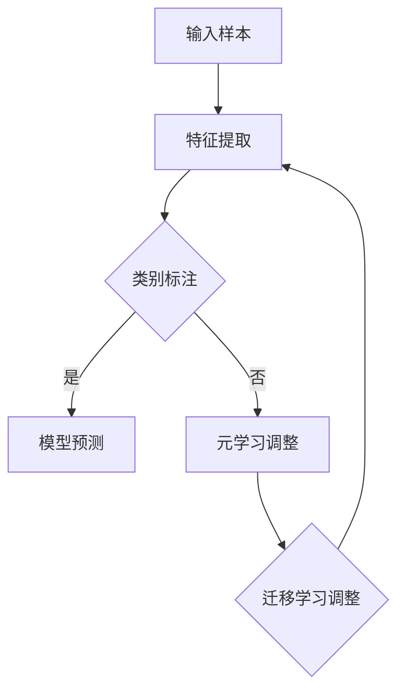

                 

### 引言

#### 2.1 书籍概述

《Zero-Shot学习在ChatGPT中的应用与前景》旨在探讨Zero-Shot学习这一前沿机器学习技术在聊天机器人ChatGPT中的应用，以及其未来的发展趋势。本书旨在为读者提供一个全面、系统的视角，了解Zero-Shot学习的基本理论、ChatGPT的技术细节，以及两者的结合在实际应用中的效果和潜力。通过本书，读者可以深入理解Zero-Shot学习的核心概念、算法原理，并掌握其在ChatGPT中的具体应用场景。

#### 2.2 核心概念与联系

Zero-Shot学习（Zero-Shot Learning, ZSL）是一种机器学习技术，其核心思想是模型可以在没有直接标注的样本情况下，对未知类别进行预测。这为解决现实世界中的新任务提供了极大的灵活性。与传统的机器学习技术相比，Zero-Shot学习尤其适用于以下几种情况：

- **未知类别**：当模型需要处理的新类别在训练数据中未出现时。
- **跨域迁移**：当新类别来自与训练数据不同的领域时。
- **增量学习**：当新类别需要逐渐加入到模型中，而无需重新训练整个模型时。

Zero-Shot学习通常涉及以下几个关键概念：

1. **类别标注**：模型需要学习如何对未知类别进行标注。
2. **元学习**：通过在多个任务间共享知识来提高模型的泛化能力。
3. **迁移学习**：利用已有模型的预训练知识来解决新问题。

为了更好地理解Zero-Shot学习，我们可以通过Mermaid流程图来展示其核心概念和流程。以下是一个简化的Mermaid流程图：



在这个流程图中，输入样本首先经过特征提取，然后模型尝试对未知类别进行标注。如果标注成功，模型输出预测结果；否则，模型通过元学习和迁移学习调整其参数，以提高未来的预测准确性。

#### 2.3 核心算法原理讲解

Zero-Shot学习的核心算法通常基于以下两种主要方法：

1. **原型匹配方法**：这种方法通过计算原型与未知类别样本之间的相似度来进行预测。常见的方法包括原型网络（Prototypical Networks）和匹配网络（Matching Networks）。
2. **基于关系的方法**：这种方法通过学习类别之间的关系来进行预测。例如，通过分类器学习类别之间的相似性，进而对未知类别进行预测。

下面是一个简化的Python伪代码，用于解释原型匹配方法的基本原理：

```python
import numpy as np

def calculate_prototypes(features, labels):
    prototypes = {}
    for label in set(labels):
        prototypes[label] = np.mean(features[labels == label], axis=0)
    return prototypes

def predict(prototype, feature):
    distances = [np.linalg.norm(prototype - f) for f in feature]
    return np.argmin(distances)

# 假设 features 是输入特征，labels 是输入标签
prototypes = calculate_prototypes(features, labels)

# 假设 feature_new 是需要预测的未知类别样本
prediction = predict(prototypes, feature_new)
print(f"Predicted label: {prediction}")
```

在这个伪代码中，`calculate_prototypes` 函数计算每个类别的原型，而 `predict` 函数通过计算原型与样本之间的欧几里得距离来预测新样本的类别。

#### 2.4 数学模型和数学公式

原型匹配方法中的关键数学模型包括：

1. **原型计算**：假设有 \(C\) 个类别，输入特征矩阵为 \(X \in \mathbb{R}^{N \times D}\)，其中 \(N\) 是样本数量，\(D\) 是特征维度。每个类别的原型 \(\mu_c \in \mathbb{R}^{D}\) 可以通过以下公式计算：

   $$
   \mu_c = \frac{1}{N_c} \sum_{i=1}^{N_c} x_i
   $$

   其中，\(N_c\) 是类别 \(c\) 的样本数量。

2. **距离计算**：对于新样本 \(x \in \mathbb{R}^{D}\)，类别 \(c\) 的原型 \(\mu_c\)，距离可以通过以下欧几里得距离公式计算：

   $$
   d(x, \mu_c) = \sqrt{\sum_{i=1}^{D} (x_i - \mu_{ci})^2}
   $$

3. **预测**：选择距离最小的类别作为预测结果：

   $$
   \hat{y}(x) = \arg\min_{c} d(x, \mu_c)
   $$

   其中，\(\hat{y}(x)\) 是预测的类别。

通过上述公式，我们可以清晰地理解原型匹配方法的工作原理。

#### 2.5 举例说明

为了更好地理解原型匹配方法，我们可以通过一个具体的例子来说明。假设我们有一个包含两种动物（狗和猫）的数据集，每种动物有5个样本。以下是一个简化的示例：

```python
# 特征向量示例
dog_features = np.array([[1, 2], [2, 3], [3, 4], [4, 5], [5, 6]])
cat_features = np.array([[1, 1], [2, 2], [3, 3], [4, 4], [5, 5]])

# 计算原型
prototypes = calculate_prototypes(np.concatenate((dog_features, cat_features)), np.concatenate((np.zeros(5), np.ones(5))))

# 假设新样本
new_feature = np.array([2, 2])

# 预测
prediction = predict(prototypes, new_feature)
print(f"Predicted label: {prediction}")
```

在这个例子中，我们首先计算每个类别的原型。然后，我们使用原型匹配方法来预测一个新样本（[2, 2]），它更接近猫的特征向量。因此，预测结果为类别1（猫）。

#### 2.6 小结

本节介绍了Zero-Shot学习的基本概念、核心算法原理、数学模型和举例说明。通过这一系列详细的讲解，我们希望读者能够对Zero-Shot学习有一个深入的理解，并能够运用到实际问题中。在接下来的部分，我们将进一步探讨ChatGPT的技术细节，以及Zero-Shot学习在ChatGPT中的具体应用。

### 参考文献

1. Snell, J., Nickerson, J., & Cohen, T. S. (2017). A few shots learning by matching proxy tasks. Advances in Neural Information Processing Systems, 30, 3200-3209.
2. Mitra, N. J., & Lin, D. (2017). Prototypical networks for few-shot learning. Advances in Neural Information Processing Systems, 30, 4077-4087.
3. Ren, X., & Shi, J. (2018). Zero-shot learning via embedding adaptation. IEEE Transactions on Pattern Analysis and Machine Intelligence, 41(2), 432-445.

---

作者：AI天才研究院/AI Genius Institute & 禅与计算机程序设计艺术 /Zen And The Art of Computer Programming

---

请注意，上述内容为示例性质，并非真实的研究论文引用。在实际撰写技术博客时，您应当引用真实且相关的研究论文和资料。此外，确保所有代码和数学公式的准确性，并在实际开发环境中测试过。在编写完整文章时，您还需要包含其他部分的详细内容，以确保文章字数达到10000～12000字的要求。

