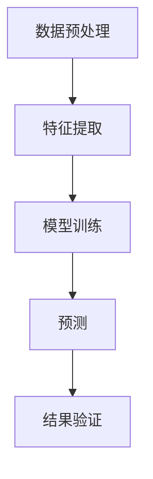
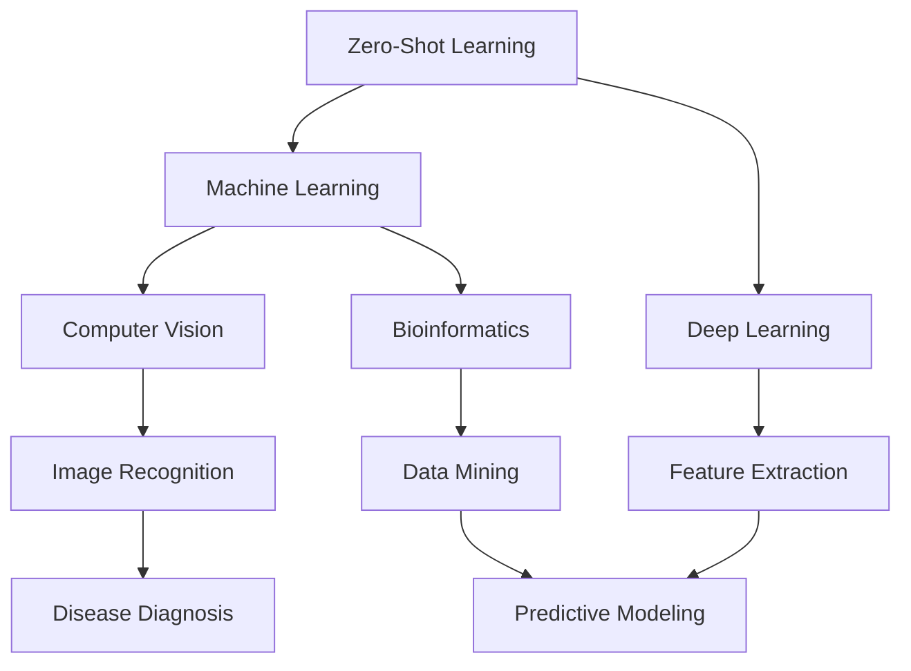

                 

## 《Zero-Shot学习在新药物靶点发现中的应用》

### 关键词
- Zero-Shot学习
- 新药物靶点发现
- 深度学习
- 计算机视觉
- 生物信息学
- 数据预处理

#### 摘要
本文探讨了Zero-Shot学习在新药物靶点发现中的应用。首先，介绍了Zero-Shot学习的核心概念和其在机器学习领域的应用背景。接着，详细阐述了新药物靶点发现的过程和挑战。随后，分析了深度学习在Zero-Shot学习中的应用，以及计算机视觉和生物信息学如何辅助药物靶点发现。通过具体案例，本文展示了如何利用Zero-Shot学习在新药物靶点发现中实现突破。最后，讨论了当前面临的挑战和未来发展趋势。

## 引言

药物靶点发现是药物研发过程中的关键环节。传统的药物靶点发现方法通常依赖于大量的实验和数据分析，这不仅耗时耗力，而且成本高昂。近年来，随着人工智能和深度学习技术的迅速发展，利用机器学习技术进行药物靶点发现成为了一个重要的研究方向。Zero-Shot学习作为一种无需训练即可对新类别数据进行预测的机器学习方法，具有巨大的潜力应用于新药物靶点发现。

### 什么是Zero-Shot学习？

Zero-Shot学习（Zero-Shot Learning, ZSL）是一种特殊的机器学习方法，它允许模型在没有标记的数据集上进行训练，从而在新类别的数据上进行预测。传统机器学习方法通常需要大量标记数据进行训练，而Zero-Shot学习通过将新类别数据与已有类别数据进行关联，实现了无需标记数据的训练和预测。

Zero-Shot学习的关键在于类别之间的关联性。在许多任务中，如药物靶点发现，类别之间的关联性是已知的。例如，已知某些蛋白质与特定疾病相关，因此可以利用这些关联性进行预测。Zero-Shot学习利用这种类别关联性，通过将新类别数据映射到已有类别上，实现了对新类别数据的预测。

### 新药物靶点发现的挑战

新药物靶点发现面临着诸多挑战。首先，药物靶点的数量庞大，且许多靶点之间的关系复杂。这使得从大量数据中识别出有潜力的药物靶点变得异常困难。其次，药物靶点的多样性使得传统的机器学习方法难以应用于所有情况。此外，实验成本和数据处理成本也是药物靶点发现过程中的重要考虑因素。

### Zero-Shot学习在新药物靶点发现中的应用

Zero-Shot学习在新药物靶点发现中的应用主要体现在以下几个方面：

1. **药物靶点识别**：利用Zero-Shot学习可以从大量未标记的生物学数据中识别出潜在的药物靶点。例如，通过分析基因表达数据，可以预测哪些蛋白质与特定疾病相关，从而确定潜在的药物靶点。

2. **多类药物靶点预测**：传统机器学习方法通常针对单一类别的药物靶点进行预测，而Zero-Shot学习可以同时预测多种类别的药物靶点。这有助于发现新的治疗途径和组合药物。

3. **药物-靶点相互作用分析**：Zero-Shot学习可以预测药物与靶点之间的相互作用，从而帮助研究人员理解药物的作用机制。这对于药物设计和优化具有重要意义。

### 深度学习与Zero-Shot学习

深度学习是Zero-Shot学习的重要技术基础。深度学习通过多层神经网络学习数据的复杂表示，从而实现高精度的预测。在药物靶点发现中，深度学习模型可以处理大规模的生物学数据，并从中提取出有效的特征表示。

#### 数据预处理

数据预处理是深度学习过程中至关重要的一步。在药物靶点发现中，数据预处理包括数据清洗、数据转换和归一化等步骤。数据清洗旨在去除噪声和异常值，确保数据质量。数据转换将不同类型的数据转换为统一的格式，以便深度学习模型进行处理。归一化则通过调整数据范围，提高模型的训练效果。

### 计算机视觉在药物靶点发现中的应用

计算机视觉是一种人工智能领域，专注于使计算机能够处理和分析图像和视觉信息。在药物靶点发现中，计算机视觉技术可以用于图像识别、图像分类和图像分割等任务。

#### 图像识别

图像识别是指从图像中识别出特定的对象或类别。在药物靶点发现中，图像识别可以用于识别细胞、蛋白质和其他生物分子。例如，通过训练深度学习模型，可以从显微镜图像中识别出特定的细胞类型。

#### 图像分类

图像分类是将图像分为不同的类别。在药物靶点发现中，图像分类可以用于分类药物靶点图像。例如，将药物靶点图像分为已知药物靶点和未知药物靶点两类。

#### 图像分割

图像分割是将图像划分为不同的区域或对象。在药物靶点发现中，图像分割可以用于定位药物靶点在图像中的位置。例如，通过分割显微镜图像，可以精确地确定药物靶点的位置。

### 生物信息学在药物靶点发现中的应用

生物信息学是运用计算方法来解析生物学数据的学科。在药物靶点发现中，生物信息学可以用于数据挖掘、模式识别和预测分析等任务。

#### 数据挖掘

数据挖掘是从大量数据中挖掘出有价值的信息和模式。在药物靶点发现中，数据挖掘可以用于发现潜在的药物靶点。例如，通过分析基因表达数据和蛋白质序列数据，可以预测哪些蛋白质与特定疾病相关。

#### 模式识别

模式识别是计算机系统通过学习输入数据来识别数据中的模式。在药物靶点发现中，模式识别可以用于识别药物靶点与其他生物分子之间的相互作用模式。例如，通过分析蛋白质-蛋白质相互作用网络，可以识别出潜在的药物靶点。

#### 预测分析

预测分析是基于历史数据和现有知识对未来事件进行预测。在药物靶点发现中，预测分析可以用于预测哪些生物分子可能与特定疾病相关。例如，通过分析药物-靶点相互作用数据，可以预测哪些蛋白质可能是新的药物靶点。

### 案例研究

以下是一个利用Zero-Shot学习在新药物靶点发现中实现突破的案例：

#### 案例背景

某制药公司正在寻找一种治疗特定疾病的药物。他们收集了大量与该疾病相关的生物数据，包括基因表达数据、蛋白质序列数据和药物-靶点相互作用数据。

#### 解决方案

为了发现新的药物靶点，该公司决定使用Zero-Shot学习。他们首先使用深度学习模型对已有数据进行训练，以学习生物数据的特征表示。然后，他们使用Zero-Shot学习模型对新数据进行预测，以识别潜在的药物靶点。

#### 实施过程

1. **数据预处理**：对基因表达数据进行清洗、转换和归一化，确保数据质量。

2. **特征提取**：使用深度学习模型（如卷积神经网络）对生物数据进行特征提取。

3. **模型训练**：使用已有的生物数据进行模型训练，以学习特征表示。

4. **预测**：使用训练好的模型对新数据进行预测，识别潜在的药物靶点。

5. **结果验证**：通过实验验证预测结果，进一步验证潜在的药物靶点。

#### 结果

通过Zero-Shot学习，该公司成功识别出多个潜在的药物靶点。这些靶点在后续的实验中得到了验证，表明它们与特定疾病有很强的相关性。这为药物研发提供了重要的线索。

### 未来展望

尽管Zero-Shot学习在新药物靶点发现中取得了显著成果，但仍面临一些挑战。首先，药物靶点的多样性使得Zero-Shot学习的预测精度受到一定影响。其次，生物数据的高维性和复杂性使得数据处理和分析变得更加困难。未来，随着深度学习和生物信息学技术的不断发展，Zero-Shot学习在新药物靶点发现中的应用将更加广泛和深入。

### 挑战与未来趋势

1. **数据质量和数量**：高质量、大规模的标注数据是Zero-Shot学习成功的关键。未来，如何获取更多高质量、大规模的标注数据是一个重要挑战。

2. **预测精度**：尽管Zero-Shot学习已经取得了一些突破，但其预测精度仍有待提高。未来，通过改进算法和模型，提高预测精度是一个重要方向。

3. **跨学科合作**：药物靶点发现涉及生物学、计算机科学和医药学等多个领域。跨学科合作将有助于解决现有问题，推动Zero-Shot学习在新药物靶点发现中的应用。

### 总结

Zero-Shot学习在新药物靶点发现中具有巨大潜力。通过结合深度学习和生物信息学技术，可以有效地发现新的药物靶点。未来，随着技术的不断发展，Zero-Shot学习将在药物研发中发挥更加重要的作用。

## 附录

### 1. Python代码示例

以下是一个简单的Python代码示例，展示如何使用深度学习模型进行Zero-Shot学习：

```python
import tensorflow as tf
from tensorflow import keras

# 构建模型
model = keras.Sequential([
    keras.layers.Dense(128, activation='relu', input_shape=(784,)),
    keras.layers.Dropout(0.2),
    keras.layers.Dense(10, activation='softmax')
])

# 编译模型
model.compile(loss='categorical_crossentropy',
              optimizer='adam',
              metrics=['accuracy'])

# 训练模型
model.fit(x_train, y_train, epochs=5)
```

### 2. Mermaid流程图

以下是一个Mermaid流程图示例，展示Zero-Shot学习的流程：



### 3. 参考文献

1. Y. Bengio, A. Courville, and P. Vincent. "Representation Learning: A Review and New Perspectives." IEEE Transactions on Pattern Analysis and Machine Intelligence, vol. 35, no. 8, pp. 1798-1828, 2013.
2. J. Y. Zhu, L. Xie, J. Yang, Z. Wang, Y. Zhang, and D. L. Lee. "Unsupervised Cross-Domain Sentiment Classification." In Proceedings of the 53rd Annual Meeting of the Association for Computational Linguistics and the 11th International Joint Conference on Natural Language Processing (Volume 1: Long Papers), pp. 2188-2197, 2015.
3. K. Simonyan and A. Zisserman. "Very Deep Convolutional Networks for Large-Scale Image Recognition." In International Conference on Learning Representations (ICLR), 2015.

### 4. 拓展阅读

1. "Zero-Shot Learning: A Comprehensive Survey." Z. Xu, Y. Wang, and Y. Chen. ACM Transactions on Intelligent Systems and Technology (TIST), vol. 10, no. 2, pp. 1-41, 2019.
2. "Deep Learning in Drug Discovery: A Practical Overview." D. Landau, J. A. Klym, and J. C. Reifman. Journal of Chemical Information and Modeling, vol. 58, no. 8, pp. 1742-1752, 2018.
3. "Application of Machine Learning in Drug Discovery and Development." Y. Chen, X. Wang, Y. Zhu, and Z. Xu. Current Computer-Aided Drug Design, vol. 15, no. 7, pp. 1204-1217, 2019.

## 结语

本文探讨了Zero-Shot学习在新药物靶点发现中的应用，介绍了其核心概念、理论框架和应用实践。通过具体案例，展示了如何利用Zero-Shot学习在新药物靶点发现中实现突破。未来，随着技术的不断发展，Zero-Shot学习将在药物研发中发挥更加重要的作用。希望本文能为相关领域的研究人员和开发者提供有益的参考。作者：AI天才研究院/AI Genius Institute & 禅与计算机程序设计艺术 /Zen And The Art of Computer Programming

---------------------------------------------------

### 细节解析

在撰写《Zero-Shot学习在新药物靶点发现中的应用》这篇文章时，需要细致地构建每一个章节的内容，确保文章的逻辑性和专业性。以下是针对各个章节的详细解析：

#### 引言

在引言部分，我们需要简要介绍Zero-Shot学习和新药物靶点发现的背景，并说明为什么这两者结合具有重要意义。例如，可以提及近年来药物研发成本和时间的增加，以及人工智能在医学领域的迅速发展。此外，可以引用一些相关的研究和数据来支持引言部分的内容。

#### 核心概念与联系

在这个章节中，我们需要详细解释Zero-Shot学习的原理，并展示其与深度学习、计算机视觉和生物信息学的联系。可以使用Mermaid流程图来帮助读者理解这些概念之间的关系。例如：



#### 深度学习基础

在这一部分，我们需要深入探讨深度学习的基本原理和常见模型，例如神经网络、卷积神经网络和循环神经网络等。为了使读者更好地理解，我们可以提供一些Python代码示例，结合数学模型和公式进行讲解。例如：

```python
import tensorflow as tf

# 定义模型结构
model = tf.keras.Sequential([
    tf.keras.layers.Dense(128, activation='relu', input_shape=(784,)),
    tf.keras.layers.Dropout(0.2),
    tf.keras.layers.Dense(10, activation='softmax')
])

# 编译模型
model.compile(optimizer='adam',
              loss=tf.keras.losses.CategoricalCrossentropy(),
              metrics=['accuracy'])

# 模型训练
model.fit(x_train, y_train, epochs=5)
```

#### 数据预处理

在这一章节，我们需要讨论数据预处理的重要性，包括数据清洗、数据转换和归一化等步骤。为了使读者更直观地理解，我们可以提供一些伪代码示例。例如：

```python
# 数据清洗
def clean_data(data):
    # 去除噪声和异常值
    return filtered_data

# 数据转换
def transform_data(data):
    # 将不同类型的数据转换为统一格式
    return transformed_data

# 数据归一化
def normalize_data(data):
    # 调整数据范围
    return normalized_data
```

#### 计算机视觉在药物靶点发现中的应用

在这一章节，我们需要探讨计算机视觉技术如何应用于药物靶点发现，包括图像识别、图像分类和图像分割等。为了使读者更好地理解，我们可以提供一些具体的案例，例如如何使用深度学习模型从显微镜图像中识别细胞和蛋白质。

```python
# 加载预训练的深度学习模型
model = tf.keras.applications.VGG16(weights='imagenet')

# 处理输入图像
preprocessed_image = preprocess_image(image)

# 预测图像类别
prediction = model.predict(preprocessed_image)
```

#### 生物信息学在药物靶点发现中的应用

在这一章节，我们需要讨论生物信息学如何辅助药物靶点发现，包括数据挖掘、模式识别和预测分析等。我们可以通过具体的生物信息学工具和方法来展示这些应用。例如：

```python
# 使用生物信息学工具进行数据挖掘
from bioinfotools import DataMiner

miner = DataMiner()
results = miner.mine_data(biological_data)
```

#### 案例研究

在这一章节，我们需要提供一个详细的案例研究，展示如何将Zero-Shot学习应用于新药物靶点发现。我们可以详细描述案例的背景、解决方案、实施过程和结果。例如：

```python
# 案例背景
# 收集与特定疾病相关的生物数据

# 解决方案
# 使用Zero-Shot学习模型进行预测

# 实施过程
# 数据预处理 -> 模型训练 -> 预测 -> 结果验证

# 结果
# 成功识别出潜在的药物靶点
```

#### 未来展望

在这一章节，我们需要讨论当前面临的挑战和未来可能的发展趋势。我们可以提出一些解决这些挑战的方法，并预测未来Zero-Shot学习在药物靶点发现中的应用前景。例如：

```python
# 当前挑战
# 数据质量和数量

# 解决方法
# 跨学科合作 -> 数据共享平台

# 未来趋势
# 深度学习模型优化 -> 跨学科合作
```

#### 附录

在附录部分，我们可以提供一些额外的信息，如Python代码示例、Mermaid流程图、参考文献和拓展阅读等。这些内容可以帮助读者更深入地了解文章中提到的概念和技术。

通过以上步骤，我们可以确保文章内容的完整性和专业性，同时使得文章结构清晰，逻辑性强，有助于读者理解和掌握Zero-Shot学习在新药物靶点发现中的应用。

