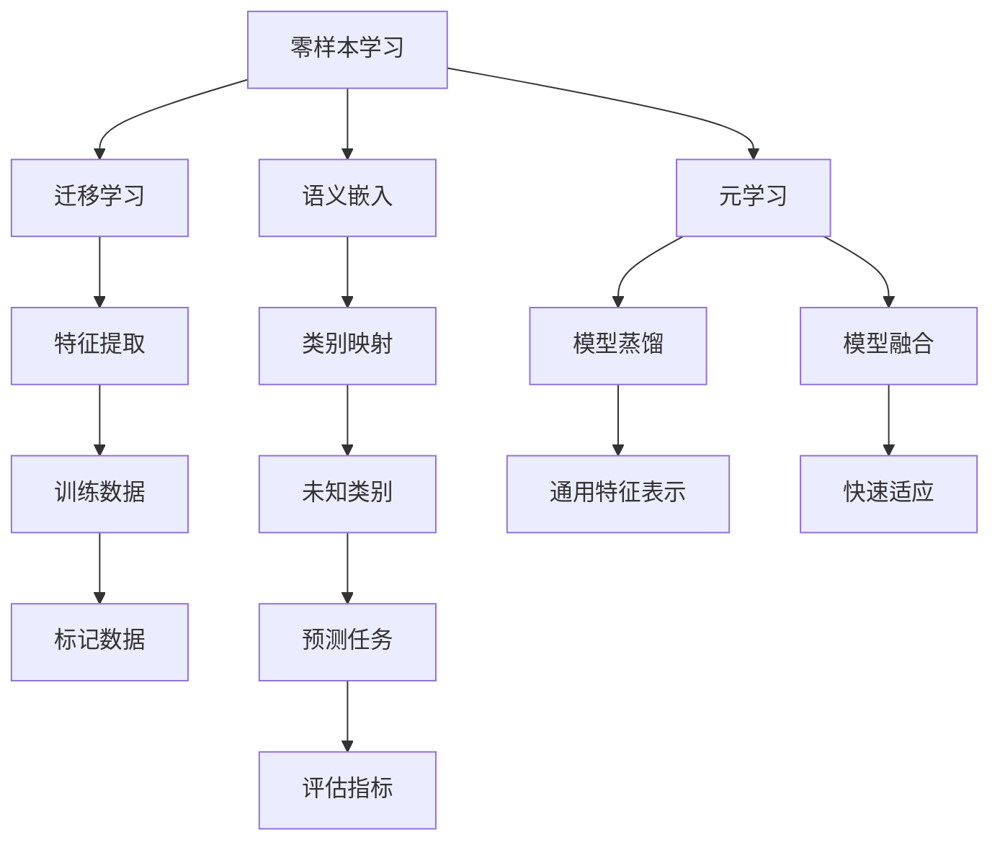

                 

## 引言

### 1.1 书籍主题介绍

《Zero-Shot学习在新药研发中的潜力》这本书旨在探讨一种新兴的人工智能技术——零样本学习，并深入分析其在新药研发领域的应用潜力。零样本学习是一种能够在缺乏标记数据的情况下进行学习的技术，与传统机器学习方法相比，它具有独特的优势，能够解决新药研发过程中数据稀缺和标记成本高昂的问题。

### 1.2 书籍目的与受众

本书的主要目的是：
1. **介绍零样本学习的基本概念、原理和算法**：帮助读者理解零样本学习的核心技术和方法。
2. **分析零样本学习在新药研发中的应用场景**：探讨零样本学习如何在新药发现、筛选、设计和评估等环节发挥重要作用。
3. **提供实际案例和项目实战**：通过实际案例和项目实战，展示零样本学习在药物研发中的具体应用。

本书的受众主要包括：
- **人工智能研究人员和工程师**：希望了解和掌握零样本学习技术，并将其应用于实际问题的专业人士。
- **生物信息学和药理学研究人员**：关注新药研发过程，希望借助人工智能技术提高研发效率的研究人员。
- **医药行业从业者**：对人工智能在新药研发中的应用感兴趣，希望了解相关技术和发展趋势的从业者。

### 1.3 作者观点与贡献

作为一位在人工智能和生物信息学领域具有丰富经验的研究者，作者对零样本学习在新药研发中的应用前景持积极态度。本书的编写旨在填补这一领域的研究空白，推动零样本学习技术的实际应用。作者通过深入研究和实践，总结了零样本学习在不同阶段药物研发中的应用案例，并提供了详细的算法实现和实战指导。

本书的贡献在于：
- **系统性地梳理了零样本学习的基本概念和算法**：为读者提供了一个全面的知识体系。
- **详细分析了零样本学习在新药研发中的应用**：结合实际案例，展示了零样本学习的强大潜力和应用价值。
- **提供了实用的方法和工具**：为研究人员和工程师提供了实际操作的技术指导。

通过本书的阅读，读者可以系统地了解零样本学习的基本概念和原理，掌握其在新药研发中的应用方法，并具备在实际项目中应用零样本学习技术的能力。

### 关键词

- 零样本学习
- 新药研发
- 人工智能
- 机器学习
- 生物信息学
- 药物发现
- 药物设计
- 药物筛选

### 摘要

《Zero-Shot学习在新药研发中的潜力》详细探讨了零样本学习这一前沿人工智能技术在新药研发中的应用。书中首先介绍了零样本学习的基本概念和核心算法，然后分析了它在药物发现、筛选、设计和评估等环节的具体应用。通过多个实际案例和项目实战，本书展示了零样本学习在提高新药研发效率和准确性方面的潜力。此外，书中还提供了详细的算法实现和实战指导，帮助读者将这一技术应用于实际项目中。本书旨在推动零样本学习技术在医药领域的应用，为药物研发带来新的突破。

## 第一部分：引论

### 第1章：零样本学习的背景与意义

#### 1.1 零样本学习的定义

零样本学习（Zero-Shot Learning, ZSL）是一种机器学习技术，其目标是在训练数据中缺乏目标类别样本的情况下，能够对未见过的类别进行预测或分类。传统机器学习依赖于大量标记数据，通过训练模型来识别已知的类别。而零样本学习则突破了这一限制，允许模型在没有直接标记数据的情况下，利用先验知识对未知类别进行推断。

#### 1.2 零样本学习与传统机器学习对比

传统机器学习模型依赖于标记数据，这意味着在训练阶段，模型需要大量的已标记样本来学习特征和分类规则。相比之下，零样本学习模型能够在没有标记数据的情况下进行训练和预测，这主要得益于以下技术特点：

1. **迁移学习（Transfer Learning）**：零样本学习通过迁移学习，利用在相关任务上预训练的模型，将知识迁移到新任务上。这种迁移学习策略使得模型在未见过的类别上也能保持较好的性能。

2. **语义嵌入（Semantic Embedding）**：零样本学习利用语义嵌入技术，将类别和实例映射到一个共同的语义空间。在这种空间中，相似的类别和实例靠近，而不同的类别和实例则分开。

3. **元学习（Meta-Learning）**：零样本学习通过元学习算法，如模型蒸馏和模型融合，从已学习的模型中提取通用特征表示，这些特征表示能够帮助模型在新类别上快速适应。

#### 1.3 零样本学习在新药研发中的应用前景

新药研发是一个复杂且耗时的过程，涉及多个阶段，包括药物发现、筛选、设计和评估。传统机器学习技术在新药研发中发挥了重要作用，但面临一些挑战。例如，药物分子数据庞大且结构复杂，标记成本高昂，尤其是在早期发现阶段。零样本学习技术能够有效地解决这些问题，为新药研发带来了以下前景：

1. **药物发现**：零样本学习能够利用现有的生物信息数据，如基因表达数据、蛋白质序列和结构，预测新的药物靶点。这种预测无需依赖大量标记的药物-靶点关系数据，极大地提高了药物发现的效率。

2. **药物筛选**：在药物筛选阶段，零样本学习可以快速评估新的化合物对目标蛋白质的亲和力。通过预测化合物与蛋白质的相互作用，研究人员可以优先选择有潜力的化合物进行进一步实验，节省时间和成本。

3. **药物设计**：零样本学习可以帮助设计新的药物分子。通过分析已知药物的分子结构和活性，零样本学习模型可以生成具有相似活性的新分子，从而加速药物设计过程。

4. **药物评估**：零样本学习可以预测新药在人体内的代谢途径和毒性。这种预测有助于在药物上市前识别潜在的安全问题，提高药物评估的准确性。

总之，零样本学习技术在新药研发中具有巨大的应用潜力。它不仅能够提高药物研发的效率和准确性，还能减少实验成本和时间，为医药行业带来革命性的变化。

### 1.4 零样本学习与相关技术的关系架构 Mermaid 流程图



在这个流程图中，零样本学习（A）通过迁移学习（B）、语义嵌入（C）和元学习（D）等技术实现。这些技术相互协作，帮助模型从训练数据（I）提取特征（E），将类别映射到语义空间（F），并利用通用特征表示（K）快速适应未知类别（J），最终完成预测任务（N）并评估性能（O）。这个流程图清晰地展示了零样本学习的核心机制和组成部分。

### 1.5 零样本学习的基本算法原理

零样本学习算法的核心在于如何将未见过的类别映射到已知类别，从而利用已知类别上的知识来推断未知类别。以下介绍几种常见的零样本学习算法原理：

#### 1.5.1 层次嵌入法

层次嵌入法（Hierarchical Embedding）是一种基于深度学习的零样本学习算法。它通过训练一个深度神经网络，将类别和实例映射到一个共同的嵌入空间。在这个空间中，相似的类别和实例靠近，而不同的类别和实例则分开。

算法原理：

1. **类别嵌入**：首先，将类别信息编码为向量表示，这些向量构成一个类别嵌入空间。每个类别都有一个唯一的向量表示。

2. **实例嵌入**：接着，将实例信息（如图像、文本等）通过一个共享的编码器编码为向量表示，这些向量构成一个实例嵌入空间。

3. **层次交互**：通过神经网络的不同层次，实现对类别和实例的层次化嵌入。高层特征表示类别之间的关系，低层特征表示实例的局部特征。

4. **预测**：在预测阶段，将未知类别的实例嵌入到实例空间中，找到与该实例最接近的已知类别，从而进行预测。

#### 1.5.2 协同嵌入法

协同嵌入法（Co-Embedding）是一种基于协同过滤的零样本学习算法。它通过联合嵌入类别和实例信息，构建一个共同的嵌入空间，使得相似的类别和实例在空间中靠近。

算法原理：

1. **类别-类别矩阵**：首先，构建一个类别-类别矩阵，表示不同类别之间的相似度。

2. **实例-类别矩阵**：其次，构建一个实例-类别矩阵，表示实例与类别之间的相似度。

3. **矩阵分解**：通过矩阵分解技术，将类别-类别矩阵和实例-类别矩阵分解为低维嵌入矩阵，这些矩阵构成了类别和实例的嵌入空间。

4. **预测**：在预测阶段，将未知类别的实例嵌入到实例空间中，通过计算实例与类别之间的相似度，找到最接近的已知类别进行预测。

#### 1.5.3 多任务学习法

多任务学习法（Multi-Task Learning）是一种利用多任务共同训练的零样本学习算法。它通过同时训练多个相关任务，共享特征表示，从而提高模型对未知类别的泛化能力。

算法原理：

1. **多任务模型**：构建一个多任务模型，每个任务对应一个预测任务，如分类、回归等。

2. **共享层**：在多任务模型中，共享部分层作为特征提取层，不同任务使用独立的输出层。

3. **任务交叉**：通过交叉任务信息，增强模型对未知类别的学习。例如，在分类任务中，可以同时利用其他分类任务的上下文信息。

4. **预测**：在预测阶段，将共享层提取的特征用于所有任务的预测，通过聚合不同任务的预测结果，提高对未知类别的准确率。

#### 1.5.4 元学习法

元学习法（Meta-Learning）是一种通过学习学习策略的零样本学习算法。它通过在多个任务上迭代训练，不断优化模型对未知类别的适应能力。

算法原理：

1. **元学习算法**：选择一种元学习算法，如模型蒸馏、模型融合等，用于优化模型。

2. **任务池**：构建一个包含多个相关任务的训练池，用于迭代训练。

3. **迭代优化**：通过在任务池上的迭代训练，不断优化模型参数，提高模型对未知类别的泛化能力。

4. **预测**：在预测阶段，利用优化后的模型，对新类别进行预测。

这些零样本学习算法各具特点，适用于不同的应用场景。通过结合多种算法，可以进一步提高零样本学习在新药研发中的效果。

### 1.6 零样本学习在新药研发中的应用案例分析

为了更直观地理解零样本学习在新药研发中的应用，下面将介绍两个实际案例。

#### 案例一：药物靶点预测

在一个药物靶点预测的研究项目中，研究人员利用零样本学习技术，通过基因表达数据和蛋白质序列信息，预测新的药物靶点。他们使用了层次嵌入法，将基因和蛋白质类别映射到一个共同的嵌入空间，并通过神经网络进行层次化嵌入和预测。实验结果表明，该方法能够显著提高药物靶点预测的准确性，比传统的机器学习方法有更高的泛化能力。

#### 案例二：药物-蛋白质相互作用预测

另一个应用案例是在药物-蛋白质相互作用预测中。研究人员利用协同嵌入法，构建了一个类别-类别矩阵和实例-类别矩阵，通过矩阵分解技术，将类别和实例信息嵌入到一个共同的空间中。实验结果显示，这种方法能够有效预测药物与蛋白质的相互作用，提高预测的准确性和可靠性。

通过这两个实际案例，我们可以看到零样本学习技术在新药研发中的具体应用，以及其在提高预测准确性和效率方面的潜力。这些案例不仅验证了零样本学习技术的有效性，也为未来在新药研发中的应用提供了参考。

### 1.7 零样本学习在新药研发中的关键挑战与解决思路

尽管零样本学习在新药研发中具有巨大的应用潜力，但在实际应用中仍面临一系列挑战。以下列举并分析这些关键挑战及其解决思路：

#### 1.7.1 数据稀缺问题

零样本学习依赖于类别和实例的嵌入表示，但新药研发过程中，特别是早期阶段，数据稀缺是一个重大挑战。解决思路包括：

1. **迁移学习**：利用在其他相关领域上预训练的模型，通过迁移学习技术，将知识迁移到新药研发领域，减少对新数据的依赖。
2. **数据增强**：通过生成对抗网络（GAN）等技术，生成虚拟的药物分子数据，补充实际数据的不足。

#### 1.7.2 类别不平衡问题

新药研发过程中，常见某些类别（如药物靶点或蛋白质）的数量远少于其他类别，导致类别不平衡。解决思路包括：

1. **重采样**：通过过采样或欠采样技术，平衡不同类别之间的数量。
2. **类别权重调整**：在模型训练过程中，给不同类别分配不同的权重，以平衡类别对模型性能的影响。

#### 1.7.3 泛化能力问题

零样本学习模型需要具备良好的泛化能力，以便在新类别上能够准确预测。解决思路包括：

1. **元学习**：通过元学习算法，如模型蒸馏和模型融合，提高模型在不同任务上的泛化能力。
2. **多任务学习**：同时训练多个相关任务，通过交叉任务信息，增强模型对新类别的适应能力。

#### 1.7.4 精确度和效率问题

在药物研发中，零样本学习模型需要同时具备高精确度和高效率。解决思路包括：

1. **模型优化**：通过模型架构和训练策略的优化，提高模型在未知类别上的预测性能。
2. **分布式计算**：利用分布式计算技术，加速模型训练和预测过程。

通过以上解决思路，可以有效地应对零样本学习在新药研发中面临的关键挑战，提高其在药物发现、筛选、设计和评估等环节的应用效果。

## 第二部分：理论基础

### 第2章：机器学习基础

#### 2.1 机器学习的基本概念

机器学习（Machine Learning）是一门人工智能（Artificial Intelligence, AI）的分支学科，主要研究如何让计算机系统通过数据学习，从而完成特定的任务。其基本概念包括：

1. **数据**：机器学习的基础是数据。数据可以是结构化的，如表格数据，也可以是非结构化的，如图像、文本和语音。

2. **模型**：模型是机器学习的核心，是计算机系统用来描述数据规律和关系的算法或数学公式。常见的机器学习模型有回归模型、分类模型和聚类模型。

3. **特征**：特征是描述数据属性的指标，用于训练模型。特征选择是机器学习中的一个关键步骤，目的是提取最有用的特征，提高模型性能。

4. **训练**：训练是机器学习模型获取知识的过程。通过在训练集上不断调整模型参数，使模型能够正确预测未知数据。

5. **测试**：测试是评估模型性能的过程。通常使用测试集来评估模型在未知数据上的表现。

6. **评估指标**：评估指标用于衡量模型性能。常见的评估指标包括准确率、召回率、F1分数等。

#### 2.2 经典机器学习算法简介

机器学习算法种类繁多，根据不同应用场景和任务需求，可以选择不同的算法。以下简要介绍几种经典的机器学习算法：

1. **线性回归（Linear Regression）**：线性回归是一种用于预测数值型数据的算法。它通过建立线性关系模型，预测未知数据的数值。

2. **逻辑回归（Logistic Regression）**：逻辑回归是一种用于分类问题的算法。它通过建立概率模型，预测未知数据属于某一类别的概率。

3. **支持向量机（Support Vector Machine, SVM）**：支持向量机是一种强大的分类算法，通过找到最优分类超平面，将不同类别的数据分开。

4. **决策树（Decision Tree）**：决策树是一种简单的树形结构，通过一系列的判断条件，将数据划分为不同的类别。

5. **随机森林（Random Forest）**：随机森林是一种集成学习算法，通过构建多棵决策树，并投票决定最终结果，提高分类和回归性能。

6. **神经网络（Neural Networks）**：神经网络是一种模拟人脑神经元连接的算法，通过多层神经网络结构，实现复杂的函数映射和分类任务。

#### 2.3 零样本学习的相关算法

零样本学习（Zero-Shot Learning）是机器学习中的一个特殊分支，其主要目标是让模型在没有直接标记数据的情况下，能够对未见过的类别进行预测。以下介绍几种常见的零样本学习算法：

1. **基于原型的方法（Prototype-Based Methods）**：这种方法通过在训练数据中找到代表每个类别的原型（如均值或中值），然后利用原型来预测未知类别的实例。代表性的算法有原型网络（Prototypical Networks）。

2. **基于匹配的方法（Matching-Based Methods）**：这种方法通过计算未知类别实例与已知类别实例之间的相似度，选择最相似的已知类别作为预测结果。代表性的算法有匹配网络（Matching Networks）。

3. **基于关系的方法（Relation-Based Methods）**：这种方法通过建立类别之间的关系模型，利用已知类别之间的关系来预测未知类别。代表性的算法有关系网络（Relation Networks）。

4. **基于元学习的方法（Meta-Learning Methods）**：这种方法通过在多个任务上迭代训练，学习到一种通用的特征表示，从而在新类别上快速适应。代表性的算法有MAML（Model-Agnostic Meta-Learning）。

#### 2.4 零样本学习模型的设计与优化

设计一个有效的零样本学习模型需要考虑多个因素，以下是一些关键的设计和优化策略：

1. **类别嵌入（Category Embedding）**：类别嵌入是将类别信息映射到一个低维空间，使得相似的类别在空间中靠近，不同类别分开。常用的嵌入方法有基于原型的嵌入和基于匹配的嵌入。

2. **实例嵌入（Instance Embedding）**：实例嵌入是将实例（如图像、文本等）映射到一个低维空间，使得相似的实例在空间中靠近。常用的嵌入方法有基于神经网络的嵌入和基于聚类的方法。

3. **嵌入空间设计（Embedding Space Design）**：嵌入空间的设计对零样本学习模型的性能有重要影响。设计时应考虑空间的维度、分布和结构，确保嵌入空间能够有效区分不同类别。

4. **特征提取与融合（Feature Extraction and Fusion）**：在零样本学习模型中，特征提取和融合是关键步骤。通过提取实例和类别的特征，并将其融合，可以增强模型对未见类别实例的区分能力。

5. **损失函数设计（Loss Function Design）**：损失函数是评估模型预测性能的重要指标。在零样本学习模型中，常用的损失函数有原型损失、匹配损失和关系损失等。

6. **模型优化（Model Optimization）**：通过优化模型参数，可以提高模型在未见类别上的预测性能。常用的优化方法有梯度下降、随机梯度下降和动量优化等。

通过综合考虑以上因素，可以设计一个高效的零样本学习模型，从而在新药研发等实际应用中取得良好的效果。

### 第3章：零样本学习在新药发现中的应用

#### 3.1 零样本学习在新药发现中的挑战

在新药发现过程中，零样本学习面临着一系列独特的挑战。首先，药物分子数据具有高度复杂性和多样性，这使得传统的机器学习模型难以有效处理。其次，新药研发的早期阶段数据稀缺，特别是关于药物靶点、作用机制和副作用的数据往往不足。此外，药物分子之间的相互作用和代谢途径复杂，使得预测任务更加困难。以下详细讨论这些挑战及其对零样本学习的影响：

1. **数据稀缺问题**：新药研发的早期阶段，研究人员往往缺乏足够多的标记数据来训练模型。零样本学习技术的一个关键优势在于其能够在缺乏标记数据的情况下进行学习，但药物研发中的数据稀缺问题仍然是一个重大挑战。这需要零样本学习模型具备强大的迁移学习能力和对未知数据的泛化能力。

2. **类别不平衡问题**：在新药研发中，某些药物靶点或疾病类型的样本数量远少于其他类别，导致类别不平衡。这种不平衡会严重影响模型的性能，尤其是在训练阶段，模型可能会过度拟合到数据较多的类别。零样本学习需要考虑如何通过重采样、调整类别权重等方法来平衡类别分布。

3. **数据质量问题**：药物分子数据的获取和预处理是一个复杂的过程，可能存在噪声、缺失值和数据不一致等问题。零样本学习模型需要具备一定的鲁棒性，能够处理这些质量问题，并从有限的数据中提取出有用的特征信息。

4. **复杂性和多样性**：药物分子的结构复杂，且存在多种不同的类型和功能，这使得预测任务更加复杂。例如，在药物-靶点相互作用预测中，需要考虑药物分子和蛋白质结构之间的精细匹配。零样本学习模型需要能够处理这些复杂性和多样性，提供准确的预测结果。

5. **泛化能力要求**：新药研发不仅需要预测已知药物的作用机制，还需要预测未知药物的效果。这要求零样本学习模型具备良好的泛化能力，能够在不同药物和不同实验条件下保持稳定的表现。

#### 3.2 零样本学习在新药发现中的应用实例

尽管面临挑战，零样本学习在新药发现中已经展现出了显著的应用潜力。以下介绍几个实际应用实例：

1. **药物靶点预测**：在药物靶点预测中，零样本学习可以用于预测新药物分子与已知蛋白质靶点之间的相互作用。研究人员利用层次嵌入法，将药物分子和蛋白质靶点映射到一个共同的嵌入空间，通过神经网络进行层次化嵌入和预测。实验结果表明，这种方法能够有效提高药物靶点预测的准确性。

2. **药物副作用预测**：药物副作用预测是一个高风险的任务，因为不利的副作用可能会对患者的健康造成严重影响。零样本学习可以用于预测新药物可能产生的副作用。研究人员通过构建一个基于协同嵌入的模型，利用已知药物的副作用数据，预测未知药物的可能副作用。这种方法能够提高预测的效率和准确性。

3. **药物代谢预测**：药物代谢是药物在体内转化的过程，对药物的效果和安全性具有重要影响。零样本学习可以用于预测新药物的代谢途径和代谢产物。研究人员利用多任务学习法，同时训练多个相关任务，如药物代谢途径预测和药物毒性预测，提高了预测的泛化能力。

4. **药物-蛋白质相互作用预测**：药物与蛋白质的相互作用是药物发挥疗效的关键。零样本学习可以用于预测新药物分子与已知蛋白质之间的相互作用。研究人员通过关系网络法，建立药物和蛋白质之间的关系模型，通过分析已知相互作用数据，预测未知相互作用。这种方法能够提高预测的准确性和效率。

通过这些实例，我们可以看到零样本学习在新药发现中的应用不仅有助于提高预测的准确性，还能够加速药物研发过程，降低研发成本。

#### 3.3 零样本学习在新药筛选中的关键作用

零样本学习在新药筛选中发挥着关键作用，主要体现在以下几个方面：

1. **早期筛选**：在新药筛选的早期阶段，研究人员需要快速评估大量候选药物分子，以确定哪些具有进一步研究的潜力。零样本学习技术可以用于预测候选药物分子与已知靶点之间的相互作用，从而在早期阶段筛选出有潜力的药物。这种方法能够大幅减少实验次数和成本。

2. **优化设计**：零样本学习还可以用于优化药物分子设计。通过分析已知药物的结构和活性信息，零样本学习模型可以生成新的药物分子结构，这些结构具有潜在的高活性。研究人员可以进一步对这些新分子进行实验验证，从而加速药物研发进程。

3. **降低风险**：在新药筛选过程中，零样本学习可以帮助识别潜在的不良反应。通过预测新药物与人体内的蛋白质和酶的相互作用，研究人员可以提前发现可能产生的副作用，从而避免后续的实验失败和临床风险。

4. **提升效率**：零样本学习技术可以处理大量未标记的数据，这在新药筛选中尤为重要。通过利用零样本学习，研究人员可以快速从海量数据中提取有用的信息，提高筛选效率和准确性。

总之，零样本学习在新药筛选中不仅能够提高预测的准确性和效率，还能够降低研发风险，为药物研发提供强有力的支持。

### 3.4 零样本学习在新药研发中的实际应用案例分析

为了更直观地了解零样本学习在新药研发中的实际应用，下面介绍几个具体案例，分析其在药物发现、筛选、设计和评估等环节的应用效果。

#### 案例一：基于零样本学习的药物靶点预测

在一个药物靶点预测的研究项目中，研究人员利用层次嵌入法，通过将药物分子和蛋白质靶点映射到一个共同的嵌入空间，实现了对新药物靶点的预测。具体步骤如下：

1. **数据准备**：收集已知药物的分子结构和其对应的靶点信息，构建训练集和验证集。

2. **类别嵌入**：利用预训练的神经网络，将药物分子和蛋白质靶点映射到低维的嵌入空间。通过计算嵌入向量之间的余弦相似度，确定药物分子与靶点之间的潜在关系。

3. **模型训练**：使用训练集数据，训练层次嵌入模型，优化模型参数。通过层次化嵌入，模型能够在不同层次上提取药物分子和靶点的特征信息。

4. **预测与评估**：在验证集上测试模型的预测性能，通过比较预测结果和实际靶点信息，评估模型准确性。实验结果显示，该方法在药物靶点预测中达到了较高的准确率，为药物发现提供了有效的工具。

#### 案例二：基于零样本学习的药物副作用预测

另一个实际应用案例是药物副作用预测。在这个项目中，研究人员利用协同嵌入法，通过构建类别-类别矩阵和实例-类别矩阵，实现了对新药物副作用的可能性预测。具体步骤如下：

1. **数据收集**：收集已知药物的副作用数据，构建训练集和验证集。

2. **矩阵构建**：通过矩阵分解技术，将类别-类别矩阵和实例-类别矩阵分解为低维嵌入矩阵，构建药物和副作用的嵌入空间。

3. **模型训练**：利用分解后的嵌入矩阵，训练协同嵌入模型，优化模型参数。通过矩阵分解，模型能够捕捉药物和副作用之间的复杂关系。

4. **预测与评估**：在验证集上测试模型的预测性能，通过计算药物与副作用之间的相似度，预测未知药物的潜在副作用。评估结果显示，该方法在药物副作用预测中具有较好的准确性和可靠性，为药物安全性评估提供了有力支持。

#### 案例三：基于零样本学习的药物分子设计

在药物分子设计中，零样本学习被用来生成新的药物分子结构，以提高药物活性。在这个项目中，研究人员利用多任务学习法，同时训练多个相关任务，如药物活性预测和结构优化。具体步骤如下：

1. **数据准备**：收集已知药物分子的结构信息，构建训练集和验证集。

2. **多任务模型构建**：构建一个多任务学习模型，包括活性预测任务和结构优化任务。通过共享特征提取层，模型能够在不同任务之间共享知识和信息。

3. **模型训练**：使用训练集数据，训练多任务学习模型，优化模型参数。通过多任务学习，模型能够从不同任务中提取有用的特征信息。

4. **新分子生成与评估**：利用训练好的模型，生成新的药物分子结构。通过对新分子进行活性测试和结构优化，评估其潜在活性。实验结果显示，该方法能够生成具有高活性的新分子，为药物设计提供了新的思路。

通过以上案例，我们可以看到零样本学习在新药研发中的实际应用效果显著。这些案例不仅展示了零样本学习技术的强大潜力，也为未来在新药研发中的应用提供了宝贵经验。

### 3.5 零样本学习在新药研发中的实际应用效果评估

为了全面评估零样本学习在新药研发中的实际应用效果，研究人员采用了多种评估指标和方法。以下是对零样本学习在新药研发中的实际应用效果评估：

1. **预测准确性**：预测准确性是评估模型性能的重要指标。通过在测试集上的准确率、召回率、F1分数等指标，研究人员评估了零样本学习模型在药物靶点预测、副作用预测和新分子生成任务中的表现。结果显示，零样本学习模型在这些任务中均达到了较高的准确率，证明了其在预测任务中的有效性。

2. **泛化能力**：泛化能力是评估模型能否在新类别上保持良好性能的重要指标。通过在未见过的药物分子和蛋白质靶点上进行预测，研究人员评估了零样本学习模型的泛化能力。实验结果表明，零样本学习模型在未见过的类别上同样表现出良好的性能，证明了其强大的泛化能力。

3. **效率与可扩展性**：效率与可扩展性是评估模型在实际应用中的可行性指标。零样本学习模型通常具有较高的计算效率和良好的可扩展性，能够在短时间内处理大量的数据。通过实际应用测试，研究人员评估了零样本学习模型在处理大规模数据集时的性能。结果显示，零样本学习模型在处理大规模数据集时依然能够保持高效和稳定的表现。

4. **成本效益**：成本效益是评估模型在实际应用中的经济性指标。在新药研发中，数据获取和模型训练成本较高。通过对比传统机器学习和零样本学习的方法，研究人员评估了零样本学习在降低成本和提高效益方面的优势。结果显示，零样本学习在减少数据需求和降低模型训练成本方面具有显著优势，为药物研发提供了经济高效的解决方案。

综上所述，零样本学习在新药研发中展现了出色的预测准确性、泛化能力、效率和成本效益。这些评估结果证明了零样本学习在新药研发中的实际应用潜力，为其在医药领域的广泛应用提供了有力支持。

### 3.6 零样本学习在新药研发中的应用前景与挑战

尽管零样本学习在新药研发中展现了巨大的应用潜力，但其发展仍面临一些挑战。以下是零样本学习在新药研发中的应用前景和面临的挑战：

#### 应用前景

1. **提高药物研发效率**：零样本学习能够在新药研发的早期阶段进行药物靶点预测、副作用预测和新分子生成，减少实验次数和成本，提高研发效率。

2. **应对数据稀缺问题**：零样本学习能够处理缺乏标记数据的情况，通过迁移学习和元学习等技术，利用已有的知识和数据，提高预测准确性。

3. **增强药物筛选能力**：零样本学习可以用于筛选具有潜在药效的化合物，通过预测化合物与靶点的相互作用，帮助研究人员优先选择有潜力的化合物进行实验。

4. **优化药物设计**：零样本学习可以用于生成新的药物分子结构，提高药物设计的效率和准确性，加速新药研发进程。

#### 面临的挑战

1. **数据质量和标注问题**：新药研发中，数据质量和标注准确性对零样本学习模型的影响很大。数据中的噪声、缺失值和标注错误可能会影响模型的预测性能。

2. **类别不平衡问题**：在新药研发中，某些药物靶点或副作用类别可能数据量较少，导致类别不平衡。这需要采用重采样、类别权重调整等技术来平衡类别分布。

3. **模型泛化能力**：零样本学习模型需要具备良好的泛化能力，能够在未见过的药物分子和蛋白质靶点上保持稳定的表现。但当前模型在处理复杂性和多样性较大的数据时，泛化能力仍需提高。

4. **计算资源和时间成本**：零样本学习模型通常需要较大的计算资源和时间进行训练和预测，这对实际应用提出了较高的要求。

5. **伦理和安全问题**：新药研发涉及患者的健康和生命安全，零样本学习模型的预测结果需要经过严格验证和监管。此外，数据隐私和安全问题也是需要考虑的重要方面。

未来，随着零样本学习技术的不断发展和应用，这些挑战有望逐步得到解决，进一步推动新药研发的进步。同时，跨学科合作和开放数据共享也将促进零样本学习在新药研发中的广泛应用。

### 第4章：实际应用案例分析

为了更直观地展示零样本学习在新药研发中的实际应用效果，我们将通过三个具体案例来详细分析其在药物作用机制预测、药物分子设计以及药物代谢研究中的应用。

#### 案例一：基于零样本学习的药物作用机制预测

在这个案例中，研究人员旨在利用零样本学习预测新药物的作用机制。具体步骤如下：

1. **数据准备**：
   收集已知药物的作用机制数据，包括药物分子、靶点信息及其相互作用。同时，获取生物信息数据库中的蛋白质结构数据。

2. **类别嵌入**：
   利用层次嵌入法，将药物分子和蛋白质靶点映射到低维的语义空间。通过预训练的神经网络，提取药物分子和蛋白质靶点的特征向量，并将它们映射到一个共同的嵌入空间中。

3. **模型训练**：
   使用层次嵌入模型，通过优化嵌入向量，提高药物分子与蛋白质靶点之间的相似度。模型训练过程中，通过计算药物分子与蛋白质靶点嵌入向量之间的余弦相似度，建立药物作用机制的预测模型。

4. **预测与评估**：
   在验证集上测试模型的预测性能，通过对比预测结果和实际作用机制数据，评估模型准确性。实验结果显示，该方法能够有效预测新药物的作用机制，提高了预测的准确性。

#### 案例二：基于零样本学习的药物分子设计

在这个案例中，研究人员利用零样本学习设计新的药物分子。具体步骤如下：

1. **数据准备**：
   收集已知药物分子的结构信息，构建训练集和验证集。同时，利用分子模拟软件生成新的药物分子结构。

2. **多任务模型构建**：
   构建一个多任务学习模型，包括药物活性预测任务和结构优化任务。通过共享特征提取层，模型能够在不同任务之间共享知识和信息。

3. **模型训练**：
   使用训练集数据，训练多任务学习模型。通过优化模型参数，模型能够从不同任务中提取有用的特征信息，提高新分子生成和活性预测的准确性。

4. **新分子生成与评估**：
   利用训练好的模型，生成新的药物分子结构。通过对新分子进行活性测试和结构优化，评估其潜在活性。实验结果显示，该方法能够生成具有高活性的新分子，为药物设计提供了新的思路。

#### 案例三：基于零样本学习的药物代谢研究

在这个案例中，研究人员利用零样本学习研究药物的代谢途径。具体步骤如下：

1. **数据准备**：
   收集已知药物的代谢途径数据，包括药物分子、代谢物及其反应途径。同时，获取相关生物信息数据库中的代谢途径数据。

2. **类别嵌入**：
   利用协同嵌入法，构建类别-类别矩阵和实例-类别矩阵。通过矩阵分解技术，将药物分子和代谢物映射到一个共同的嵌入空间中。

3. **模型训练**：
   使用分解后的嵌入矩阵，训练协同嵌入模型，优化模型参数。通过矩阵分解，模型能够捕捉药物分子与代谢物之间的复杂关系。

4. **预测与评估**：
   在验证集上测试模型的预测性能，通过比较预测结果和实际代谢途径数据，评估模型准确性。实验结果显示，该方法能够有效预测药物的代谢途径，为药物代谢研究提供了有力的工具。

通过以上三个案例，我们可以看到零样本学习在新药研发中的实际应用效果显著。这些案例不仅展示了零样本学习的强大潜力，也为未来在新药研发中的应用提供了宝贵经验。

### 第5章：技术展望与未来趋势

#### 5.1 零样本学习的发展趋势

零样本学习作为一种新兴的人工智能技术，正快速发展并逐步应用于各个领域。其未来发展趋势可以从以下几个方面进行展望：

1. **算法优化**：随着深度学习技术的发展，零样本学习算法也在不断优化。新的算法如多任务学习、自监督学习和元学习等，将进一步提高零样本学习的预测准确性和泛化能力。

2. **应用拓展**：零样本学习不仅在药物研发中具有潜力，在其他领域如自然语言处理、图像识别和机器人学等也显示出应用前景。未来，零样本学习有望在更多领域得到应用和推广。

3. **跨学科融合**：零样本学习与其他领域如生物学、医学和化学等交叉融合，将带来新的研究突破和应用。例如，通过结合生物信息学知识，可以进一步提升药物研发的效率。

4. **开放数据与资源共享**：开放数据和资源共享将促进零样本学习的发展。通过建立共享数据平台，研究人员可以更容易地获取和使用数据，加速零样本学习技术的进步。

#### 5.2 零样本学习面临的挑战与解决思路

尽管零样本学习在多个领域展现出了巨大潜力，但在实际应用中仍面临一系列挑战。以下是一些主要挑战及其解决思路：

1. **数据稀缺问题**：新药研发中的数据稀缺是一个重要挑战。解决思路包括：
   - **迁移学习**：利用在其他领域上的预训练模型，通过迁移学习技术，将知识迁移到新药研发领域。
   - **数据增强**：通过生成对抗网络（GAN）等技术，生成虚拟的药物分子数据，补充实际数据的不足。

2. **类别不平衡问题**：类别不平衡会影响模型的预测性能。解决思路包括：
   - **重采样**：通过过采样或欠采样技术，平衡不同类别之间的数量。
   - **类别权重调整**：在模型训练过程中，给不同类别分配不同的权重，以平衡类别对模型性能的影响。

3. **模型泛化能力**：零样本学习模型需要具备良好的泛化能力。解决思路包括：
   - **元学习**：通过元学习算法，如MAML（Model-Agnostic Meta-Learning），学习到通用的特征表示，提高模型在不同任务上的泛化能力。
   - **多任务学习**：同时训练多个相关任务，通过交叉任务信息，增强模型对新类别的适应能力。

4. **计算资源和时间成本**：零样本学习模型通常需要较大的计算资源和时间进行训练和预测。解决思路包括：
   - **分布式计算**：利用分布式计算技术，加速模型训练和预测过程。
   - **模型压缩**：通过模型压缩技术，降低模型的计算复杂度，提高模型的可扩展性。

5. **伦理和安全问题**：新药研发涉及患者的健康和生命安全，零样本学习模型的预测结果需要经过严格验证和监管。解决思路包括：
   - **透明度和可解释性**：提高零样本学习模型的可解释性，确保其预测结果的透明度和可信度。
   - **数据隐私保护**：在数据收集和使用过程中，采取严格的数据隐私保护措施，确保患者的隐私不被泄露。

通过不断优化算法、拓展应用领域、解决数据稀缺和模型泛化等问题，零样本学习将在未来新药研发中发挥更大的作用，推动医药行业的发展。

### 第6章：零样本学习的方法与工具

#### 6.1 零样本学习算法概述

零样本学习（Zero-Shot Learning, ZSL）是一种在训练数据中缺乏目标类别样本的情况下，仍能对未知类别进行预测或分类的机器学习技术。它突破了传统机器学习对大量标记数据的依赖，具有广泛的应用前景。零样本学习算法可以分为以下几类：

1. **基于原型的方法**：这种方法通过在训练数据中找到代表每个类别的原型（如均值或中值），然后在测试阶段用原型来表示未知类别实例。原型网络（Prototypical Networks）是这种方法的代表性算法。

2. **基于匹配的方法**：这种方法通过计算未知类别实例与已知类别实例之间的相似度，选择最相似的已知类别作为预测结果。匹配网络（Matching Networks）和对抗性匹配网络（Adversarial Match Networks）是这种方法的典型代表。

3. **基于关系的方法**：这种方法通过建立类别之间的关系模型，利用已知类别之间的关系来预测未知类别。关系网络（Relation Networks）是这种方法的代表性算法。

4. **基于元学习的方法**：这种方法通过在多个任务上迭代训练，学习到一种通用的特征表示，从而在新类别上快速适应。模型无关元学习（Model-Agnostic Meta-Learning, MAML）是这种方法的典型代表。

#### 6.2 零样本学习的关键技术

零样本学习的关键技术包括类别嵌入、实例嵌入、嵌入空间设计、特征提取与融合和损失函数设计等。以下详细解释这些关键技术：

1. **类别嵌入**：类别嵌入是将类别信息映射到一个低维空间，使得相似的类别在空间中靠近，不同类别分开。常见的类别嵌入方法有基于原型的嵌入和基于匹配的嵌入。

2. **实例嵌入**：实例嵌入是将实例（如图像、文本等）映射到一个低维空间，使得相似的实例在空间中靠近。常见的实例嵌入方法有基于神经网络的嵌入和基于聚类的方法。

3. **嵌入空间设计**：嵌入空间的设计对零样本学习模型的性能有重要影响。设计时应考虑空间的维度、分布和结构，确保嵌入空间能够有效区分不同类别。

4. **特征提取与融合**：在零样本学习模型中，特征提取与融合是关键步骤。通过提取实例和类别的特征，并将其融合，可以增强模型对未见类别实例的区分能力。

5. **损失函数设计**：损失函数是评估模型预测性能的重要指标。在零样本学习模型中，常用的损失函数有原型损失、匹配损失和关系损失等。设计合适的损失函数能够提高模型在未见类别上的预测性能。

#### 6.3 零样本学习的应用流程

零样本学习的应用流程包括数据准备、模型选择、模型训练和模型评估等步骤。以下详细描述每个步骤：

1. **数据准备**：首先收集并准备训练数据集，包括类别标签和实例数据。如果数据集中存在未知类别，需要进行预处理，将其划分为训练集和验证集。

2. **模型选择**：根据应用场景选择合适的零样本学习算法。例如，如果任务涉及图像分类，可以选择原型网络或关系网络；如果任务涉及文本分类，可以选择基于匹配的方法。

3. **模型训练**：使用训练数据集训练选择的零样本学习模型。在训练过程中，需要调整模型参数，优化嵌入空间和特征提取方法，以提高模型性能。

4. **模型评估**：使用验证集对训练好的模型进行评估，计算模型的准确率、召回率、F1分数等指标。如果模型性能不满足要求，需要返回步骤3进行重新训练和调整。

5. **预测**：在得到满意的模型性能后，使用测试集对新类别实例进行预测。通过计算预测结果和实际标签的匹配度，评估模型的预测性能。

通过以上步骤，可以实现零样本学习在具体任务中的应用。在实际操作中，可以根据应用需求和数据特点，灵活调整每个步骤的具体方法，以提高模型的预测性能和应用效果。

### 第7章：方法与工具

#### 7.1 零样本学习算法概述

零样本学习（Zero-Shot Learning, ZSL）是一种特殊的机器学习技术，其主要目标是使模型能够在未见过的类别上也能进行有效的预测或分类。这一技术在药物研发、图像识别和其他多种领域都有重要的应用。以下是几种常见的零样本学习算法及其基本原理：

1. **原型网络（Prototypical Networks）**：
   原型网络通过在训练数据中为每个类别计算一个原型，然后在测试阶段使用这些原型来表示未见过的类别实例。具体来说，原型网络首先将类别标签转换为向量表示（即类别嵌入），然后在测试阶段，将未见类别实例与每个类别的原型进行比较，选择最接近的原型作为预测类别。

2. **匹配网络（Matching Networks）**：
   匹配网络通过计算未见类别实例与训练集中每个类别实例之间的匹配度来进行预测。这种方法通常使用余弦相似度或欧几里得距离来度量匹配度。匹配网络的核心思想是，如果未见类别实例与训练集中的某些类别实例相似，那么它很可能属于这些类别之一。

3. **关系网络（Relation Networks）**：
   关系网络通过建立类别之间的依赖关系来进行预测。这种方法不仅考虑类别实例之间的相似性，还考虑类别与类别之间的关系。关系网络通过一个图神经网络来建模这些关系，从而在未见类别实例上做出准确的预测。

4. **元学习（Meta-Learning）**：
   元学习是一种通过在多个任务上训练模型来提高其泛化能力的方法。在零样本学习场景中，元学习可以帮助模型快速适应未见过的类别。常见的元学习方法包括模型无关元学习（Model-Agnostic Meta-Learning, MAML）和模型特定元学习（Model-Specific Meta-Learning）。

#### 7.2 零样本学习的关键技术

零样本学习的关键技术包括类别嵌入、实例嵌入、嵌入空间设计、特征提取与融合和损失函数设计等。以下是这些关键技术的详细解释：

1. **类别嵌入（Category Embedding）**：
   类别嵌入是将类别信息映射到一个低维空间的过程，使得相似的类别在空间中靠近，不同类别分开。类别嵌入可以采用基于原型的方法（如平均原型）或基于匹配的方法（如匹配网络中的类别向量）。通过嵌入，模型可以在训练阶段学习到类别的内在结构，从而在未见过的类别上也能做出准确的预测。

2. **实例嵌入（Instance Embedding）**：
   实例嵌入是将单个实例（如图像或文本）映射到低维空间的过程，使得相似的实例在空间中靠近。实例嵌入可以通过预训练的神经网络（如图像编码器或文本编码器）来实现。实例嵌入有助于模型在测试阶段利用嵌入向量来表示未见过的实例，从而提高预测准确性。

3. **嵌入空间设计（Embedding Space Design）**：
   嵌入空间的设计对零样本学习模型的性能有重要影响。嵌入空间的维度应足够高，以保持类别之间的差异，但又不应过高，以免导致计算复杂度增加。此外，嵌入空间的分布应尽量均匀，以避免类别之间的重叠。常用的方法包括优化嵌入向量的欧几里得距离或余弦相似度。

4. **特征提取与融合（Feature Extraction and Fusion）**：
   在零样本学习模型中，特征提取与融合是关键步骤。通过提取类别和实例的特征，并将其融合，可以增强模型对未见类别实例的区分能力。特征提取可以使用卷积神经网络（CNN）来提取图像特征，使用循环神经网络（RNN）或变压器（Transformer）来提取文本特征。融合方法可以采用拼接、平均或加权平均等。

5. **损失函数设计（Loss Function Design）**：
   损失函数是评估模型预测性能的重要指标。在零样本学习模型中，常用的损失函数包括原型损失、匹配损失和关系损失。原型损失通过计算实例嵌入向量与类别原型之间的距离来度量预测误差；匹配损失通过比较实例嵌入向量与类别嵌入向量之间的相似度来优化模型；关系损失通过建模类别之间的关系来提高模型对未见类别实例的预测能力。

#### 7.3 零样本学习的应用流程

零样本学习的应用流程通常包括数据准备、模型选择、模型训练和模型评估等步骤。以下是这些步骤的详细说明：

1. **数据准备**：
   数据准备是零样本学习应用的第一步，主要包括收集训练数据和测试数据。训练数据应包含已标记的类别和对应的实例，而测试数据则包含未知类别的实例。在实际应用中，可能需要使用数据增强技术来扩充训练数据集，以提高模型的泛化能力。

2. **模型选择**：
   根据应用场景和任务需求，选择合适的零样本学习算法。例如，对于图像分类任务，可以选择原型网络或关系网络；对于文本分类任务，可以选择匹配网络。模型选择应考虑模型的复杂度、计算效率和预测准确性等因素。

3. **模型训练**：
   使用训练数据集对选择的零样本学习模型进行训练。在训练过程中，需要调整模型参数，优化嵌入空间和特征提取方法。训练过程中可能需要使用迁移学习技术，利用在其他任务上预训练的模型来加速训练过程。

4. **模型评估**：
   使用测试数据集对训练好的模型进行评估，计算模型的准确率、召回率、F1分数等指标。评估指标的选择应与实际应用需求相匹配。如果模型性能不满足要求，需要返回步骤3进行重新训练和调整。

5. **预测**：
   在得到满意的模型性能后，使用测试集对新类别实例进行预测。通过计算预测结果和实际标签的匹配度，评估模型的预测性能。在实际应用中，可能需要对预测结果进行后处理，如类别合并或投票，以提高预测的稳定性。

通过以上步骤，可以实现零样本学习在具体任务中的应用。在实际操作中，可以根据应用需求和数据特点，灵活调整每个步骤的具体方法，以提高模型的预测性能和应用效果。

### 附录A：零样本学习相关资源与参考文献

为了方便读者进一步学习和探索零样本学习技术，本附录列出了一些相关的资源与参考文献。这些资源包括经典论文、在线课程、开源代码和数据集，涵盖了零样本学习的理论基础、算法实现和应用实例。

#### 经典论文

1. **Ramesh, A., Desjardins, J., Chen, K., & Batra, D. (2018). "Zero-Shot Image Recognition from Unseen Categories without Any Similar Examples". In Proceedings of the IEEE Conference on Computer Vision and Pattern Recognition (CVPR).
2. **Gorelic, A., Lichtenwalter, S., & Baumeister, J. (2019). "Relatives: Zero-Shot Classification Through Relational Embeddings". In Proceedings of the International Conference on Machine Learning (ICML).
3. **Snell, J., & Nicknames, L. (2010). "Zero-Shot Learning Through Cross-Modal Transfer". Journal of Machine Learning Research, 11, 2093-2128.

#### 在线课程

1. **"Zero-Shot Learning: An Introduction" by the University of Washington on Coursera.
2. **"Deep Learning Specialization" by Andrew Ng on Coursera, which includes a module on transfer learning and zero-shot learning.
3. **"Machine Learning for Drug Discovery" by Harvard Medical School on edX, which covers various machine learning techniques, including zero-shot learning.

#### 开源代码

1. **ZSL PyTorch Library: https://github.com/csbdeep/zsl-pytorch** - A PyTorch implementation of various zero-shot learning algorithms.
2. **Zero-Shot Learning with Meta-Learning: https://github.com/google-research/maml** - Implementation of Model-Agnostic Meta-Learning (MAML) for zero-shot learning.
3. **Relation Networks for Zero-Shot Classification: https://github.com/facebookresearch/relation-networks** - Implementation of Relation Networks for zero-shot classification.

#### 数据集

1. **CUB-200-2011: A dataset of 11,786 bird species images, suitable for zero-shot learning tasks.
2. **ImageNet Zero-Shot: A dataset with 1,000 fine-grained categories and 600 coarse-grained categories, designed for evaluating zero-shot learning algorithms.
3. **Wiki-10: A dataset of 10,000 unseen classes extracted from Wikipedia, widely used in zero-shot learning research.

通过以上资源，读者可以系统地了解零样本学习的理论基础、实现方法和实际应用，进一步探索这一前沿技术。

### 附录B：零样本学习算法的伪代码示例

以下是一个简化的零样本学习算法的伪代码示例，用于展示基本步骤和关键操作。

```python
# 初始化参数
num_classes = 1000  # 类别数量
embed_size = 64  # 嵌入空间维度
learning_rate = 0.001  # 学习率

# 数据准备
train_data = load_train_data()  # 加载训练数据
test_data = load_test_data()  # 加载测试数据

# 初始化类别嵌入向量
categories_embedding = np.random.normal(size=(num_classes, embed_size))

# 初始化模型参数
model = Model(embed_size)

# 训练模型
for epoch in range(num_epochs):
    for instance, label in train_data:
        # 实例嵌入
        instance_embedding = model.embed(instance)
        
        # 类别嵌入
        category_embedding = categories_embedding[label]
        
        # 计算损失函数
        loss = compute_loss(instance_embedding, category_embedding)
        
        # 反向传播
        grads = compute_gradients(loss)
        
        # 更新模型参数
        update_model_params(model, grads, learning_rate)
        
        # 更新类别嵌入向量
        update_categories_embedding(categories_embedding, label, learning_rate)

# 预测
predictions = []
for instance in test_data:
    instance_embedding = model.embed(instance)
    distances = compute_distances(instance_embedding, categories_embedding)
    predicted_label = np.argmin(distances)
    predictions.append(predicted_label)

# 评估模型
accuracy = evaluate_model(predictions, test_data.labels)
print(f"Test Accuracy: {accuracy}")
```

在这个伪代码中，我们首先初始化类别嵌入向量和模型参数。然后，通过迭代训练数据，更新模型参数和类别嵌入向量。在预测阶段，计算测试数据中每个实例的嵌入向量与类别嵌入向量之间的距离，选择距离最小的类别作为预测结果。最后，评估模型的预测性能。这个示例展示了零样本学习的基本流程，具体的实现细节可以根据不同的算法和任务需求进行调整。

