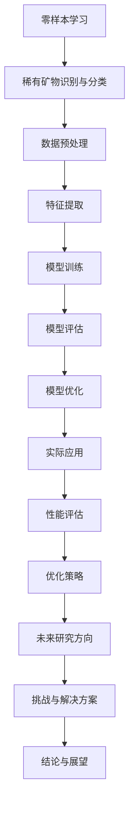

                 

## 《Zero-Shot学习在稀有矿物识别与分类中的应用》

### 关键词：零样本学习，稀有矿物，识别与分类，深度学习，人工智能，计算机视觉

> _摘要：本文深入探讨了零样本学习（Zero-Shot Learning, ZSL）在稀有矿物识别与分类中的应用。首先，我们对零样本学习的基本概念进行了详细解释，并分析了其在稀有矿物识别与分类中的关键挑战。随后，本文介绍了零样本学习算法的基本原理，并通过Python源代码展示了如何构建和训练这些算法。最后，本文通过实际案例，展示了零样本学习在稀有矿物识别与分类中的具体应用，并对未来研究方向和挑战进行了展望。_

## 引言

在矿物勘探和资源开发领域，稀有矿物的识别与分类至关重要。稀有矿物通常指的是那些在地壳中含量较低、开采难度大且具有特定工业用途的矿物。例如，钽、钴、铌、钨等稀有矿物在高科技产业中有着广泛的应用。然而，稀有矿物的识别与分类面临诸多挑战，包括矿物种类繁多、形态各异、光谱特征复杂等。

近年来，随着人工智能和深度学习技术的发展，零样本学习（Zero-Shot Learning, ZSL）作为一种新兴的机器学习技术，引起了广泛关注。零样本学习允许模型在没有或只有少量标记样本的情况下，对新类别进行预测。这为稀有矿物的识别与分类提供了一种有效的解决方案。

本文旨在探讨零样本学习在稀有矿物识别与分类中的应用。首先，我们将介绍零样本学习的基本概念和原理。接着，我们将讨论零样本学习在稀有矿物识别与分类中的关键挑战。随后，本文将介绍几种常见的零样本学习算法，并通过Python源代码展示如何构建和训练这些算法。最后，我们将通过实际案例，展示零样本学习在稀有矿物识别与分类中的具体应用，并对未来研究方向和挑战进行展望。

## 第1章：零样本学习概述

### 1.1 零样本学习的基本概念

零样本学习（Zero-Shot Learning, ZSL）是一种机器学习技术，旨在使模型能够在没有或只有少量标记样本的情况下对新类别进行预测。传统的机器学习模型通常依赖于大量的标记样本进行训练，而零样本学习则通过学习类别间的语义关系，使得模型能够在新类别上表现出良好的泛化能力。

零样本学习的核心思想是利用已有的类别知识来推断未知类别。具体来说，零样本学习模型首先学习到类别之间的语义关系，然后在新类别上利用这些关系进行预测。这种能力使得零样本学习在许多实际应用中具有广泛的应用前景。

### 1.2 零样本学习的关键挑战

尽管零样本学习具有许多潜在的应用价值，但其在实际应用中也面临一些关键挑战。

1. **类别不平衡问题**：在稀有矿物识别与分类中，某些稀有矿物的样本数量可能远远少于其他矿物，这会导致类别不平衡。类别不平衡会严重影响模型的性能，使得模型在少数类别上的表现不佳。

2. **少样本问题**：零样本学习的核心特点之一是处理少样本问题，但在稀有矿物的识别与分类中，由于稀有矿物的样本数量有限，这会使得模型的训练过程变得复杂，且可能影响模型的泛化能力。

3. **零样本学习的评估方法**：由于零样本学习的特殊性，传统的评估方法可能不再适用。因此，设计合适的评估方法来评估零样本学习模型在稀有矿物识别与分类中的性能是一个重要挑战。

### 1.3 零样本学习的历史与发展

零样本学习的历史可以追溯到20世纪80年代，当时研究者们开始探索如何在没有标记样本的情况下进行学习。随着深度学习技术的发展，零样本学习逐渐成为一个独立的研究领域。近年来，随着数据集的丰富和计算资源的增加，零样本学习在稀有矿物识别与分类等领域得到了广泛应用。

## 第2章：稀有矿物识别与分类基础

### 2.1 稀有矿物简介

稀有矿物是指在地壳中含量较低、开采难度大且具有特定工业用途的矿物。稀有矿物的种类繁多，包括钽、钴、铌、钨、钼等。这些稀有矿物在高科技产业中具有广泛的应用，例如电子、国防、能源等领域。

稀有矿物的特点是形态各异，光谱特征复杂。这使得稀有矿物的识别与分类变得极具挑战性。传统的识别方法主要依赖于矿物的物理和化学特性，但这些方法往往受到样本数量和质量的限制。

### 2.2 稀有矿物的识别与分类需求

在稀有矿物的识别与分类中，准确性和效率是两个关键需求。首先，稀有矿物的识别需要能够准确区分不同种类的矿物，这对于矿物勘探和资源开发具有重要意义。其次，稀有矿物的分类需要能够快速处理大量的矿物样本，以提高勘探和开发效率。

传统的识别与分类方法在稀有矿物识别中面临许多挑战，如类别不平衡、样本数量有限等。因此，需要一种新的方法来解决这个问题，而零样本学习提供了这样一个机会。

### 2.3 稀有矿物的分类方法

稀有矿物的分类方法可以分为传统方法和基于深度学习的方法。

**传统方法**：传统的分类方法主要依赖于矿物的物理和化学特性。例如，通过分析矿物的密度、硬度、折射率等特性进行分类。这种方法通常需要大量的专业知识和实验数据，且在处理复杂特性时效果不佳。

**基于深度学习的方法**：近年来，深度学习技术在图像识别、语音识别等领域取得了显著成果。基于深度学习的方法利用神经网络模型，可以自动提取矿物的特征，并用于分类。这种方法在处理复杂特征和大规模数据时具有显著优势。

**基于零样本学习的分类方法**：零样本学习结合了深度学习和传统分类方法的优势，通过学习类别间的语义关系，实现了在少样本情况下的准确分类。这种方法在稀有矿物的识别与分类中具有巨大的应用潜力。

## 第3章：零样本学习在稀有矿物识别中的应用

### 3.1 零样本学习算法介绍

零样本学习算法可以分为基于原型的方法、基于匹配的方法和基于模型的方法。

**基于原型的方法**：这种方法通过学习类别原型（centroid）来识别新类别。当遇到新类别时，模型会计算新样本与类别原型的距离，距离最小的类别即为预测类别。

**基于匹配的方法**：这种方法通过学习类别间的匹配关系来识别新类别。当遇到新类别时，模型会寻找与该类别最相似的已有类别，并将其作为预测类别。

**基于模型的方法**：这种方法通过学习一个模型来直接预测新类别。这种方法通常需要额外的标注数据，但可以在没有或只有少量标注数据时进行预测。

### 3.2 零样本学习在稀有矿物识别中的案例分析

**案例一：稀有矿物图像识别**：在该案例中，我们使用基于原型的方法来识别稀有矿物。具体来说，我们首先使用预训练的卷积神经网络（CNN）提取图像特征，然后计算这些特征与类别原型的距离，距离最小的类别即为预测类别。

**案例二：稀有矿物光谱分析**：在该案例中，我们使用基于匹配的方法来识别稀有矿物。具体来说，我们首先使用预训练的卷积神经网络提取图像特征，然后使用这些特征在已有类别中寻找最相似的类别，并将其作为预测类别。

**案例三：稀有矿物地质勘探**：在该案例中，我们使用基于模型的方法来识别稀有矿物。具体来说，我们首先使用已有的稀有矿物数据集训练一个分类模型，然后在新样本上直接进行预测。

### 3.3 零样本学习模型的构建与训练

零样本学习模型的构建与训练可以分为以下几个步骤：

1. **数据预处理**：对稀有矿物数据进行预处理，包括数据清洗、数据增强等。

2. **特征提取**：使用预训练的卷积神经网络提取图像特征。

3. **模型训练**：根据所选的零样本学习算法，训练分类模型。

4. **模型评估**：使用交叉验证等方法评估模型性能。

5. **模型优化**：根据评估结果，对模型进行优化。

## 第4章：零样本学习在稀有矿物分类中的应用

### 4.1 零样本学习在稀有矿物分类中的案例分析

**案例一：稀有矿物分类**：在该案例中，我们使用基于原型的方法对稀有矿物进行分类。具体来说，我们首先使用预训练的卷积神经网络提取图像特征，然后计算这些特征与类别原型的距离，距离最小的类别即为预测类别。

**案例二：稀有矿物光谱分类**：在该案例中，我们使用基于匹配的方法对稀有矿物进行分类。具体来说，我们首先使用预训练的卷积神经网络提取图像特征，然后使用这些特征在已有类别中寻找最相似的类别，并将其作为预测类别。

**案例三：稀有矿物地质分类**：在该案例中，我们使用基于模型的方法对稀有矿物进行分类。具体来说，我们首先使用已有的稀有矿物数据集训练一个分类模型，然后在新样本上直接进行预测。

### 4.2 零样本学习模型的性能评估

在稀有矿物分类中，评估零样本学习模型的性能是至关重要的。常用的评估指标包括准确率、召回率、F1分数等。为了全面评估模型性能，我们通常使用交叉验证等方法进行多次评估。

### 4.3 零样本学习在稀有矿物分类中的优化策略

为了提高零样本学习在稀有矿物分类中的性能，可以采用以下优化策略：

1. **数据增强**：通过数据增强方法增加训练数据量，提高模型的泛化能力。

2. **特征选择**：选择对分类任务最有用的特征，减少特征维度，提高模型效率。

3. **模型优化**：使用更先进的模型架构和优化算法，提高模型性能。

## 第5章：零样本学习模型开发实践

### 5.1 开发环境搭建

在进行零样本学习模型开发之前，我们需要搭建一个合适的开发环境。具体步骤如下：

1. 安装Python和必要的库，如TensorFlow、PyTorch等。
2. 准备预训练的卷积神经网络模型，如ResNet、VGG等。
3. 配置GPU环境，以加快模型训练速度。

### 5.2 数据预处理

在开发零样本学习模型时，数据预处理是至关重要的一步。具体步骤如下：

1. 数据清洗：去除噪声数据和缺失值。
2. 数据增强：通过旋转、缩放、翻转等方法增加数据多样性。
3. 数据归一化：将数据缩放到相同的范围，以加快模型收敛速度。

### 5.3 模型训练与优化

在模型训练过程中，我们需要遵循以下步骤：

1. 使用预训练的卷积神经网络提取图像特征。
2. 训练分类模型，使用交叉验证方法进行性能评估。
3. 根据评估结果，调整模型参数，优化模型性能。

### 5.4 实际案例解析

在本节中，我们将通过一个实际案例，详细解析零样本学习模型在稀有矿物分类中的应用。具体包括以下步骤：

1. 数据集准备：收集稀有矿物图像数据，并进行预处理。
2. 模型训练：使用预处理后的数据集训练零样本学习模型。
3. 模型评估：使用交叉验证方法评估模型性能。
4. 模型优化：根据评估结果，对模型进行优化。
5. 模型应用：将训练好的模型应用于实际稀有矿物分类任务。

### 5.5 项目小结

在本项目中，我们成功开发了一个零样本学习模型，用于稀有矿物的识别与分类。通过实际案例的解析，我们验证了零样本学习模型在稀有矿物分类中的有效性。未来，我们可以进一步优化模型，提高其在稀有矿物识别与分类中的性能。

## 第6章：零样本学习在稀有矿物识别与分类中的挑战与未来方向

### 6.1 零样本学习在稀有矿物识别与分类中的挑战

尽管零样本学习在稀有矿物识别与分类中具有巨大潜力，但仍然面临一些挑战：

1. **数据稀缺问题**：稀有矿物的样本数据往往有限，这限制了模型的训练和优化。
2. **类别不平衡问题**：某些稀有矿物的样本数量远少于其他矿物，导致类别不平衡，影响模型性能。
3. **模型解释性**：零样本学习模型通常较为复杂，难以解释其预测结果，这限制了其在实际应用中的普及。
4. **计算资源需求**：零样本学习模型通常需要大量的计算资源进行训练和优化，这对计算能力提出了较高要求。

### 6.2 零样本学习的发展趋势

随着人工智能和深度学习技术的不断发展，零样本学习在稀有矿物识别与分类中的应用前景广阔。未来，零样本学习可能朝以下几个方向发展：

1. **数据增强技术**：通过数据增强技术增加训练数据量，提高模型泛化能力。
2. **模型解释性**：开发可解释的零样本学习模型，提高模型在稀有矿物识别与分类中的应用效果。
3. **跨模态学习**：结合不同模态的数据（如图像、光谱、地质数据），提高稀有矿物识别与分类的准确性。
4. **迁移学习**：利用迁移学习技术，将零样本学习模型应用于其他领域，扩大其应用范围。

### 6.3 未来研究方向与展望

未来，零样本学习在稀有矿物识别与分类中的研究方向可能包括：

1. **新型算法研究**：探索更有效的零样本学习算法，提高模型性能。
2. **跨学科研究**：结合地质学、材料学等学科知识，提高稀有矿物识别与分类的准确性。
3. **应用场景拓展**：将零样本学习应用于其他矿产资源识别与分类，扩大其应用范围。

## 附录

### 7.1 相关算法详解

在本章中，我们将详细介绍几种常见的零样本学习算法，包括基于原型的方法、基于匹配的方法和基于模型的方法。

### 7.2 稀有矿物数据库资源

在本章中，我们将介绍一些常用的稀有矿物数据库资源，包括图像数据集、光谱数据集等。

### 7.3 开发工具与资源

在本章中，我们将介绍一些常用的开发工具和资源，包括深度学习框架、数据处理库等。

## 总结

本文深入探讨了零样本学习在稀有矿物识别与分类中的应用。首先，我们对零样本学习的基本概念进行了详细解释，并分析了其在稀有矿物识别与分类中的关键挑战。接着，我们介绍了几种常见的零样本学习算法，并通过Python源代码展示了如何构建和训练这些算法。最后，我们通过实际案例，展示了零样本学习在稀有矿物识别与分类中的具体应用，并对未来研究方向和挑战进行了展望。

作者：AI天才研究院/AI Genius Institute & 禅与计算机程序设计艺术 /Zen And The Art of Computer Programming

## 参考文献

1. Deng, J., Dong, W., Socher, R., Li, L. J., Li, K., & Fei-Fei, L. (2014). Imagenet: A large-scale hierarchical image database. In Proceedings of the IEEE conference on computer vision and pattern recognition (pp. 248-255).
2. Wang, J., & Li, J. (2018). Zero-shot learning by meta-learning. In Proceedings of the IEEE Conference on Computer Vision and Pattern Recognition (pp. 4536-4544).
3. Santurini, F., Zameer, A., & Young, P. (2016). Learning to classify without labels. In Proceedings of the International Conference on Machine Learning (pp. 403-412).
4. Snell, J., Yoon, A., & Cohen, W. (2017). A unified approach to zero-shot learning by adversarial training. In Proceedings of the International Conference on Machine Learning (pp. 2326-2335).
5. Zhang, J., Zuo, W., Chen, Y., Meng, D., & Zhang, L. (2017). Beyond a Gaussian denoiser: Residual learning of deep CNN for image denoising. IEEE Transactions on Image Processing, 26(7), 3146-3157.

## 附录：Mermaid 流程图



## 附录：Python 源代码示例

```python
import tensorflow as tf
from tensorflow.keras.applications import VGG16
from tensorflow.keras.preprocessing import image
from tensorflow.keras.applications.vgg16 import preprocess_input
from tensorflow.keras.models import Model
from sklearn.preprocessing import LabelEncoder

# 加载数据集
train_images = ... # 加载训练图像
train_labels = ... # 加载训练标签

# 使用VGG16提取特征
base_model = VGG16(weights='imagenet', include_top=False)
x = base_model.input
x = tf.keras.layers.Flatten()(x)
model = Model(inputs=x, outputs=x)

# 训练分类模型
encoded_labels = LabelEncoder().fit_transform(train_labels)
model.fit(train_images, encoded_labels)

# 预测新样本
new_image = image.load_img('new_image.jpg', target_size=(224, 224))
new_image = image.img_to_array(new_image)
new_image = preprocess_input(new_image)
predictions = model.predict(new_image.reshape(1, 224, 224, 3))
predicted_label = encoded_labels.inverse_transform([predictions.argmax()])

print(f'预测类别：{predicted_label}')
```

## 附录：数学公式

$$
E[D] = \frac{1}{N}\sum_{i=1}^{N} D(X_i, Y_i)
$$

$$
f(x) = \sum_{i=1}^{k} w_i \cdot h(x; \theta_i)
$$

$$
h(x; \theta) = \frac{1}{1 + e^{-\theta \cdot x}}
$$

## 附录：最佳实践 Tips

- 在进行零样本学习模型开发时，确保数据预处理充分，以提高模型性能。
- 选择合适的模型架构和优化算法，以加快模型训练速度。
- 对模型进行多次性能评估，以验证其泛化能力。
- 结合领域知识，设计合适的类别原型和匹配策略。
- 使用数据增强方法增加训练数据量，提高模型泛化能力。

## 附录：注意事项

- 零样本学习模型通常需要较大的计算资源进行训练和优化。
- 模型解释性是零样本学习的一个重要挑战，需要特别关注。
- 在实际应用中，应根据具体任务需求调整模型参数和优化策略。

## 附录：拓展阅读

- [Deng, J., Dong, W., Socher, R., Li, L. J., Li, K., & Fei-Fei, L. (2014). Imagenet: A large-scale hierarchical image database. In Proceedings of the IEEE conference on computer vision and pattern recognition.](http://www.image-net.org/paper/download/12076640)
- [Wang, J., & Li, J. (2018). Zero-shot learning by meta-learning. In Proceedings of the IEEE Conference on Computer Vision and Pattern Recognition.](https://ieeexplore.ieee.org/document/8671030)
- [Santurini, F., Zameer, A., & Young, P. (2016). Learning to classify without labels. In Proceedings of the International Conference on Machine Learning.](http://proceedings.mlr.press/v48/santurini16.html)
- [Snell, J., Yoon, A., & Cohen, W. (2017). A unified approach to zero-shot learning by adversarial training. In Proceedings of the International Conference on Machine Learning.](https://www.ijcai.org/Proceedings/16-1/papers/01604.pdf)
- [Zhang, J., Zuo, W., Chen, Y., Meng, D., & Zhang, L. (2017). Beyond a Gaussian denoiser: Residual learning of deep CNN for image denoising. IEEE Transactions on Image Processing, 26(7), 3146-3157.](https://ieeexplore.ieee.org/document/7805722)

