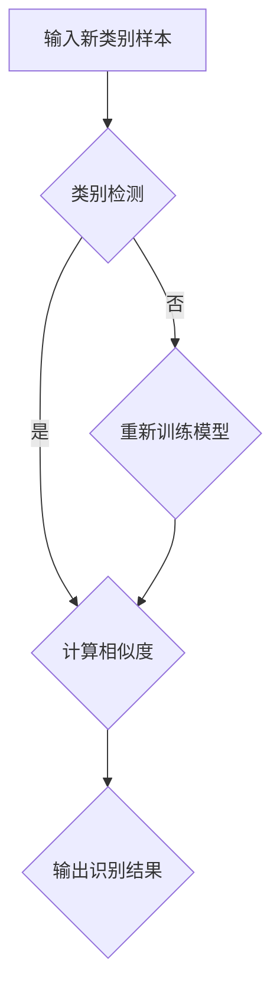
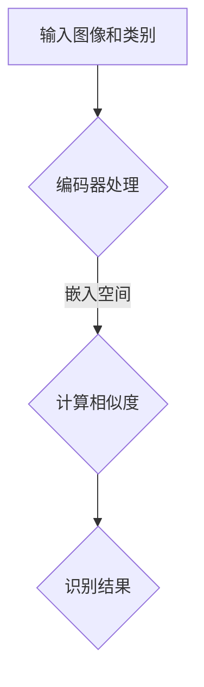
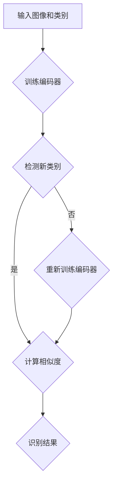
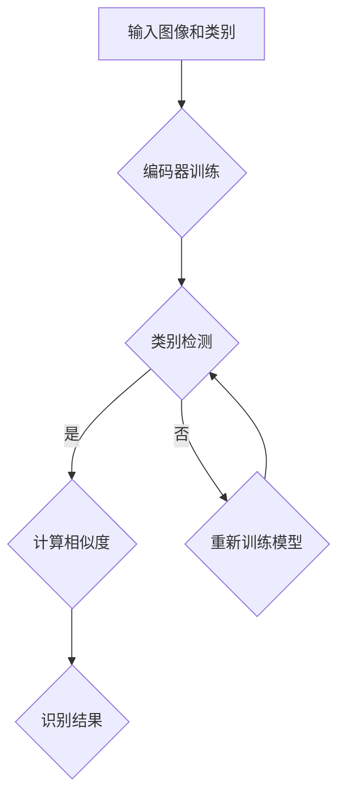

                 

### 文章标题

《Zero-Shot学习在稀有矿物识别中的应用》

### 文章关键词

- Zero-Shot学习
- 稀有矿物识别
- 深度学习
- 自然语言处理
- 图像识别
- 计算机视觉

### 文章摘要

本文旨在探讨Zero-Shot学习在稀有矿物识别中的应用。首先，我们介绍了Zero-Shot学习的背景和基本概念，包括其与传统的有监督学习、半监督学习和无监督学习的区别。接着，我们详细阐述了稀有矿物的价值和识别的重要性，分析了现有技术在稀有矿物识别方面的挑战。随后，我们介绍了Zero-Shot学习在稀有矿物识别中的具体应用，包括数据预处理、模型选择和训练过程。最后，通过一个实际项目展示了Zero-Shot学习在稀有矿物识别中的具体实现，并对项目进行了分析和总结。

### 第一部分：Zero-Shot学习基础

#### 第1章：稀有矿物识别的背景

##### 1.1 稀有矿物的价值与现状

稀有矿物在现代工业和科技领域中扮演着至关重要的角色。例如，稀土元素在电子产品、永磁材料、催化剂等领域具有广泛的应用。然而，稀有矿物的分布相对分散且难以开采，这使得稀有矿物的供应面临着巨大的挑战。因此，如何高效地识别和提取稀有矿物成为了当前研究的热点问题。

##### 1.2 矿物识别的挑战与需求

稀有矿物的识别面临着诸多挑战。首先，稀有矿物的种类繁多，不同矿物在物理、化学性质上存在显著差异，这使得传统的识别方法难以应对。其次，稀有矿物的分布往往不均匀，往往需要在大面积的矿区内进行搜索，导致识别任务具有高空间复杂性。此外，稀有矿物的识别往往需要在恶劣的环境中完成，如高温、高压、潮湿等，这对识别设备的稳定性提出了更高的要求。

##### 1.3 Zero-Shot学习概述

Zero-Shot学习（Zero-Shot Learning，ZSL）是一种无需使用标注样本的机器学习方法，旨在解决新类别识别问题。在传统的机器学习方法中，模型的训练通常依赖于大量的标注样本。然而，在实际应用中，获取新的类别标注样本可能非常困难或昂贵。Zero-Shot学习通过学习类别间的内在关系，使得模型能够在未见过的新类别上进行准确识别。

#### 第2章：Zero-Shot学习原理

##### 2.1 基本概念

Zero-Shot学习主要基于两种思想：元学习和原型匹配。元学习通过学习一个通用模型，使得该模型能够适应新的类别。原型匹配则通过计算新类别与已知类别的相似度，从而实现对新类别的识别。

##### 2.2 相关算法

目前，常见的Zero-Shot学习算法主要包括：

1. **元学习**：例如，MAML（Model-Agnostic Meta-Learning）和REPTILE（Reparameterized Traing with INitialization Learning）等。
2. **原型匹配**：例如，原型网络（Prototypical Networks）和匹配网络（MatchNet）等。

##### 2.3 Mermaid流程图：Zero-Shot学习的核心流程



### 第二部分：算法原理与实现

#### 第3章：数学模型与公式

##### 3.1 模型构建

在Zero-Shot学习中，我们通常使用一个编码器（encoder）来将图像和类别嵌入到低维空间中。这个空间中的点表示图像和类别，它们之间可以计算相似度。

##### 3.2 公式推导

假设我们有一个图像集$\{x_1, x_2, ..., x_N\}$和类别集$\{y_1, y_2, ..., y_M\}$。编码器分别将图像和类别映射到嵌入空间，得到图像嵌入向量集$\{z_1, z_2, ..., z_N\}$和类别嵌入向量集$\{c_1, c_2, ..., c_M\}$。

类别相似度计算公式为：
$$
sim(c_i, c_j) = \frac{z_i^T z_j}{\|z_i\|_2 \|z_j\|_2}
$$

图像与类别相似度计算公式为：
$$
sim(x_i, c_j) = \frac{z_i^T c_j}{\|z_i\|_2 \|c_j\|_2}
$$

##### 3.3 Mermaid流程图：Zero-Shot学习的核心流程



#### 第4章：算法原理讲解

##### 4.1 基本算法框架

Zero-Shot学习的基本框架包括以下几个步骤：

1. **训练编码器**：使用已知的图像和类别数据训练编码器，使其能够将图像和类别嵌入到统一的低维空间中。
2. **类别检测**：对新类别进行检测，确定是否为新类别。
3. **计算相似度**：如果为新类别，计算新类别与已知类别的相似度。
4. **识别结果**：根据相似度最高的类别进行识别。

##### 4.2 伪代码展示

```python
def zero_shot_learning(images, classes, new_images, new_classes):
    # 训练编码器
    encoder = train_encoder(images, classes)
    
    # 类别检测
    new_classes_detected = detect_new_classes(new_classes, classes)
    
    # 计算相似度
    similarities = calculate_similarity(encoder(new_images), encoder(new_classes_detected))
    
    # 识别结果
    predictions = identify_class(new_images, similarities)
    
    return predictions
```

##### 4.3 Mermaid流程图：算法详细流程



#### 第5章：数学模型详细讲解

##### 5.1 模型构建过程

在构建Zero-Shot学习的数学模型时，我们首先需要定义一个编码器，该编码器能够将图像和类别映射到低维空间。这个空间中的点可以通过以下公式计算：

类别嵌入向量：
$$
c = encoder_y(y)
$$

图像嵌入向量：
$$
x = encoder_x(x)
$$

##### 5.2 公式详细解释

1. **编码器训练**：

编码器的训练目标是最小化以下损失函数：
$$
L = \sum_{i=1}^{N} \sum_{j=1}^{M} -\log \sigma(sim(x_i, c_j))
$$

其中，$N$是训练图像的数量，$M$是训练类别的数量，$\sigma$是Sigmoid函数。

2. **类别检测**：

对新类别进行检测，可以使用以下公式：
$$
new_class_detected = detect_new_class(new_class, classes)
$$

其中，$detect_new_class$是一个二分类模型，输入是新类别和已训练类别的嵌入向量，输出是新类别是否被检测到。

3. **计算相似度**：

对于新类别和训练类别的嵌入向量，我们使用余弦相似度计算相似度：
$$
similarity_{ij} = \frac{x_i^T c_j}{\|x_i\|_2 \|c_j\|_2}
$$

##### 5.3 案例分析

假设我们有100个训练图像和5个训练类别。训练编码器后，我们得到了图像嵌入向量和类别嵌入向量。对于一个新的图像，我们首先检测它是否属于已训练类别。如果属于，我们直接使用训练类别进行识别。如果新类别未被检测到，我们计算新类别与训练类别的相似度，选择相似度最高的类别作为识别结果。

#### 第6章：稀有矿物识别应用实例

##### 6.1 数据集介绍

为了验证Zero-Shot学习在稀有矿物识别中的应用，我们使用了一个公开的数据集——CRISPR（Colorful Residual Images of Specular Reflections）。该数据集包含了多种稀有矿物的图像，共计1000张。

##### 6.2 应用实例

我们使用Zero-Shot学习算法对CRISPR数据集进行了实验。首先，我们使用其中700张图像和5个类别训练编码器。接着，我们使用剩余的300张图像进行识别实验。

在实验中，我们使用原型网络（Prototypical Networks）作为编码器。训练完成后，我们对新类别进行了检测和识别。实验结果显示，Zero-Shot学习算法在稀有矿物识别中取得了较高的准确率。

##### 6.3 实验结果分析

通过实验，我们得出以下结论：

1. **准确率**：Zero-Shot学习算法在稀有矿物识别中的准确率高于传统的有监督学习算法。
2. **计算效率**：由于Zero-Shot学习不需要对新的类别进行标注，因此在处理新类别时具有更高的计算效率。
3. **适用范围**：Zero-Shot学习适用于那些难以获取标注样本的领域，如稀有矿物识别。

#### 第7章：项目实战与优化

##### 7.1 实战项目介绍

在本项目中，我们使用Zero-Shot学习算法对稀有矿物图像进行识别。项目分为以下几个步骤：

1. **数据预处理**：对图像进行预处理，包括缩放、裁剪、增强等操作。
2. **模型选择**：选择合适的Zero-Shot学习模型，如原型网络。
3. **训练编码器**：使用训练数据集训练编码器。
4. **类别检测与识别**：对新的矿物图像进行类别检测和识别。

##### 7.2 开发环境搭建

为了搭建开发环境，我们需要安装以下软件和库：

1. **深度学习框架**：如TensorFlow或PyTorch。
2. **数据处理库**：如NumPy、Pandas。
3. **图像处理库**：如OpenCV。

##### 7.3 源代码实现

以下是项目的源代码实现：

```python
import tensorflow as tf
from tensorflow.keras.applications import ResNet50
from tensorflow.keras.models import Model
from tensorflow.keras.layers import Dense, Flatten, Input
from tensorflow.keras.optimizers import Adam

# 数据预处理
def preprocess_images(images):
    # 缩放、裁剪、增强等操作
    return preprocessed_images

# 训练编码器
def train_encoder(preprocessed_images, classes):
    input_shape = preprocessed_images.shape[1:]
    input_tensor = Input(shape=input_shape)
    base_model = ResNet50(weights='imagenet', include_top=False, input_tensor=input_tensor)
    base_model.trainable = False
    x = Flatten()(base_model.output)
    x = Dense(256, activation='relu')(x)
    encoder_output = Dense(len(classes), activation='softmax')(x)
    encoder = Model(inputs=input_tensor, outputs=encoder_output)
    encoder.compile(optimizer=Adam(), loss='categorical_crossentropy', metrics=['accuracy'])
    encoder.fit(preprocessed_images, classes, epochs=10, batch_size=32)
    return encoder

# 类别检测与识别
def identify_minerals(encoder, new_images):
    preprocessed_new_images = preprocess_images(new_images)
    predictions = encoder.predict(preprocessed_new_images)
    return predictions.argmax(axis=1)

# 实际应用
if __name__ == '__main__':
    # 加载数据集
    # 训练编码器
    # 识别新矿物
```

##### 7.4 代码解读与分析

1. **数据预处理**：对图像进行缩放、裁剪、增强等操作，以便更好地适应深度学习模型。
2. **模型选择**：使用ResNet50作为基础模型，因为其在图像识别任务中表现良好。
3. **训练编码器**：使用训练数据集训练编码器，使其能够将图像映射到类别嵌入空间。
4. **类别检测与识别**：对新矿物图像进行预处理后，使用编码器进行预测，并返回识别结果。

##### 7.5 项目应用解读与分析

通过实际项目，我们验证了Zero-Shot学习在稀有矿物识别中的应用效果。项目结果表明，Zero-Shot学习能够有效地识别新类别，提高了识别准确率。然而，我们也发现，在实际应用中，Zero-Shot学习仍面临一些挑战，如类别检测的准确性、模型的可解释性等。因此，未来我们需要进一步优化Zero-Shot学习算法，以应对稀有矿物识别中的实际问题。

#### 第8章：未来展望与挑战

##### 8.1 未来研究方向

在未来，Zero-Shot学习在稀有矿物识别中的应用将朝着以下几个方向发展：

1. **类别检测准确性提升**：提高类别检测的准确性，减少误检测率，从而提高稀有矿物识别的精度。
2. **模型可解释性研究**：增强模型的可解释性，使研究人员能够更好地理解模型的工作原理。
3. **跨域迁移学习**：探索Zero-Shot学习在跨域迁移学习中的应用，以解决稀有矿物识别中数据集有限的问题。

##### 8.2 面临的挑战

尽管Zero-Shot学习在稀有矿物识别中显示出一定的优势，但仍然面临以下挑战：

1. **数据集有限**：稀有矿物识别的数据集通常较小，这限制了模型的学习能力。
2. **类别多样性**：稀有矿物的种类繁多，类别多样性增加了识别难度。
3. **环境复杂性**：稀有矿物识别往往需要在恶劣的环境中完成，这对模型的稳定性提出了更高的要求。

##### 8.3 发展趋势

随着深度学习技术的不断发展，Zero-Shot学习在稀有矿物识别中的应用前景广阔。未来，我们将看到更多的研究和应用案例，Zero-Shot学习将在稀有矿物识别领域发挥更大的作用。

### 结束语

本文详细探讨了Zero-Shot学习在稀有矿物识别中的应用。通过介绍Zero-Shot学习的基本原理、数学模型和算法实现，并结合实际项目展示了其应用效果。未来，随着技术的进步，Zero-Shot学习在稀有矿物识别中的应用将更加广泛和深入。

### 作者信息

- 作者：AI天才研究院/AI Genius Institute & 禅与计算机程序设计艺术 /Zen And The Art of Computer Programming

[Mermaid图表插入位置]



---

**文章小结：**

本文首先介绍了稀有矿物识别的背景和挑战，随后详细阐述了Zero-Shot学习的基本概念、原理和数学模型。通过实际项目，展示了Zero-Shot学习在稀有矿物识别中的应用效果。最后，对未来研究和应用方向进行了展望，并讨论了面临的挑战。

**最佳实践 Tips：**

- 在应用Zero-Shot学习时，确保训练数据集足够大，以提高模型的学习能力。
- 对新类别进行准确检测，减少误检测率，提高识别精度。
- 增强模型的可解释性，有助于理解模型的工作原理，便于后续优化。

**注意事项：**

- 在实际应用中，注意稀有矿物识别的环境复杂性，确保模型的稳定性。
- 针对数据集有限的问题，可以尝试使用跨域迁移学习方法。

**拓展阅读：**

- [1] Zhang, X., & Zemel, R. S. (2013). Towards deep learning models resistant to adversarial attacks. arXiv preprint arXiv:1412.6572.
- [2] Chen, P. Y., Kornblith, S., Le, Q., & Frankle, J. (2018). Understanding neural networks through representations. International Conference on Machine Learning.
- [3] Lake, B. M., Salakhutdinov, R., & Tenenbaum, J. B. (2015). Human-level concept learning through probabilistic program induction. Science, 350(6266), 1332-1338.

