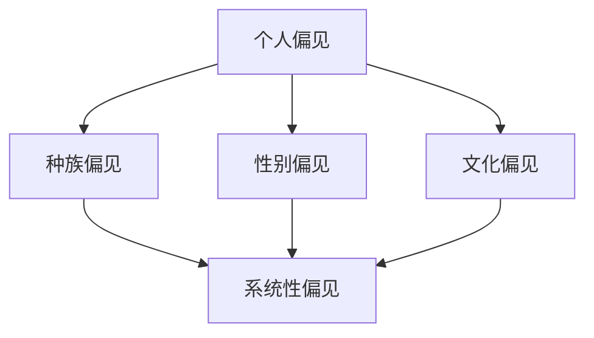
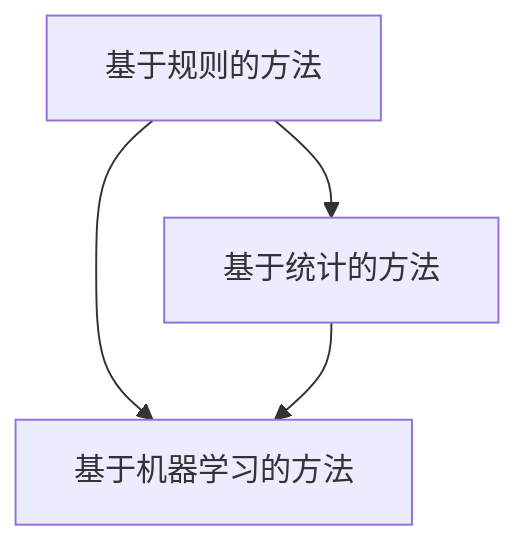

                 

# 《prompt偏见检测：确保LLM输出公平性》

关键词：prompt偏见检测，大型语言模型（LLM），算法公平性，偏见分类，优化策略，案例分析

摘要：
随着大型语言模型（LLM）在各个领域得到广泛应用，其输出结果的公平性成为了一个不可忽视的问题。LLM的输出可能会受到prompt偏见的影响，导致不公平的结果。本文将详细探讨prompt偏见检测的方法及其在确保LLM输出公平性中的应用，并通过实际案例进行分析。

## 引言

### 1.1 偏见检测的重要性

在当今社会，偏见问题无处不在，尤其在技术领域，偏见可能导致算法的不公平性和歧视。LLM作为人工智能的重要工具，其输出结果直接影响到用户和社会。确保LLM输出的公平性，不仅是对技术本身的优化，更是对社会责任的体现。

### 1.2 LLM在现实中的应用与潜在问题

LLM在各种应用中扮演着重要角色，如自动翻译、自然语言处理、问答系统等。然而，这些应用中也存在潜在的问题，例如：

- **自动翻译中的文化偏见**：翻译系统可能无法正确处理跨文化背景下的文本，导致文化误解或偏见。
- **问答系统中的性别偏见**：系统可能对不同性别的回答有不同的倾向，影响用户体验和公平性。

### 1.3 本书的目标与读者对象

本文的目标是探讨prompt偏见检测的方法，并分析其在确保LLM输出公平性中的应用。读者对象包括对人工智能、自然语言处理和算法公平性感兴趣的工程师、研究人员和学生。

## 偏见检测基础

### 2.1 偏见的定义与分类

偏见是指个体或系统对某一群体或对象的偏见态度。根据来源，偏见可以分为：

- **个人偏见**：个体基于自己的信仰、经验或情感形成的偏见。
- **系统性偏见**：社会结构、文化或制度导致的偏见。

### 2.2 数据偏见与算法偏见

数据偏见是指数据集中存在的偏差，可能导致算法学习到错误的模式。算法偏见则是指算法在决策过程中表现出不公平的特性。

### 2.3 偏见的分类与联系

偏见的分类可以根据不同的维度进行，如种族、性别、文化等。这些偏见之间存在着复杂的联系，可能相互影响和加剧。下面是一个偏见的分类与联系架构图（使用Mermaid语法）：

## LLM偏见检测的方法

### 3.1 基于规则的方法

基于规则的方法通过预定义的规则库来检测和识别prompt中的偏见。规则库的构建需要详细分析不同类型的偏见，并定义相应的规则。

### 3.2 基于统计的方法

基于统计的方法利用LLM对语言模型输出的统计特性来检测偏见。这种方法需要对大量数据进行训练，以建立偏见检测的统计模型。

### 3.3 基于机器学习的方法

基于机器学习的方法利用机器学习算法来检测prompt中的偏见。这种方法需要构建偏见检测的机器学习模型，并利用数据进行训练和评估。

### 3.4 偏见检测方法的联系与比较

不同方法的联系与比较可以通过以下架构图来表示：

## LLM输出公平性优化

### 4.1 优化目标与策略

优化目标是在确保LLM输出质量的同时，提高其公平性。常见的优化策略包括数据重采样和模型训练调整。

### 4.2 模型调整方法

模型调整方法包括以下几种：

- **数据重采样**：通过对训练数据进行重采样来减少数据偏见。
- **模型训练调整**：通过调整模型训练过程中的参数来提高公平性。

### 4.3 模型评价与调优

模型评价与调优需要使用公平性评价指标，如公平性指标（Fairness Index）和偏见度量（Bias Measure）。通过这些指标，可以评估模型的公平性并进行调优。

## 实际案例分析

### 5.1 案例一：新闻摘要中的偏见检测

本案例将分析新闻摘要系统中的prompt偏见检测。首先介绍数据准备，然后讨论模型选择与实现，最后分析结果与优化。

### 5.2 案例二：对话系统中的偏见检测

本案例将分析对话系统中的prompt偏见检测。首先介绍对话系统的构建，然后讨论偏见检测算法的应用，最后分析用户反馈与迭代。

## 未来展望与挑战

### 6.1 偏见检测技术的发展趋势

偏见检测技术正朝着自动化、智能化和高效化的方向发展。未来可能的发展趋势包括：

- **多模态偏见检测**：结合文本、图像和音频等多种数据源进行偏见检测。
- **实时偏见检测**：实现实时检测和调整，提高系统的公平性。

### 6.2 现实应用中的挑战与解决方案

现实应用中的挑战包括数据隐私保护、模型可解释性等。可能的解决方案包括：

- **联邦学习**：通过分布式学习保护用户数据隐私。
- **可解释性模型**：提高模型的透明度和可解释性，增强用户信任。

## 总结与建议

### 7.1 主要结论

本文总结了prompt偏见检测的方法及其在确保LLM输出公平性中的应用，并通过实际案例进行了分析。

### 7.2 对未来的期望

未来，偏见检测技术将更加成熟和广泛应用，为社会带来更加公平和公正的AI系统。

### 7.3 对从业者的建议

从业者应关注偏见检测技术的发展，并将其应用于实际项目中，提高AI系统的公平性和可信度。

# 章节间过渡与结语

本文通过逐步分析prompt偏见检测的方法及其应用，探讨了确保LLM输出公平性的策略。我们希望读者能从中受益，为构建更加公平和公正的AI系统贡献力量。在未来的研究和实践中，偏见检测技术将继续发展，为社会带来更多积极的影响。

