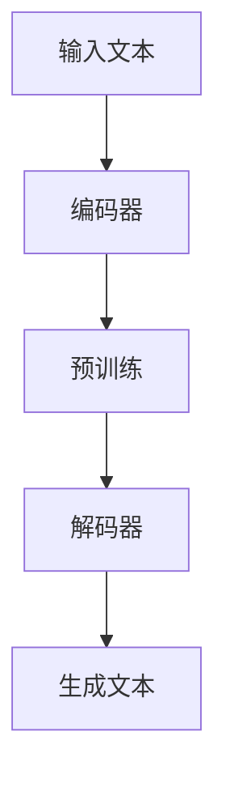
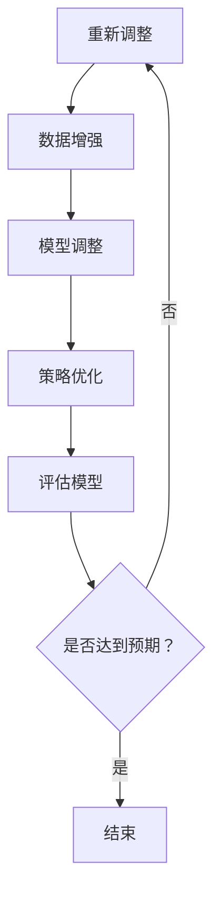

                 

# 《prompt多场景适配：增强LLM通用性》

## 关键词
- Prompt技术
- LLM通用性
- 多场景适配
- 数据增强
- 模型调整
- 问答系统

## 摘要
本文深入探讨了如何通过prompt技术实现大型语言模型（LLM）的多场景适配，以增强其通用性。文章首先介绍了LLM的基本概念和架构，然后详细解释了prompt技术的核心概念和作用。接下来，文章提出了多场景适配的策略，包括数据增强、模型调整和策略优化。通过实际案例研究，本文展示了如何在不同场景中应用这些策略，并提供了通用性增强的最佳实践。最后，文章总结了本文的主要结论，并对未来的研究方向进行了展望。

## 引言

在人工智能领域，大型语言模型（LLM）已经成为自然语言处理（NLP）的重要工具。LLM能够通过学习海量文本数据来生成高质量的文本、回答问题等。然而，LLM在处理多种不同场景时存在一定的局限性，这主要源于其训练数据集中的场景多样性不足。为了解决这一问题，prompt技术被引入，它允许模型根据特定场景调整其输出。本文旨在探讨如何通过prompt技术实现LLM的多场景适配，以增强其通用性。

本文结构如下：首先介绍LLM的基本概念和架构；然后详细解释prompt技术的核心概念和作用；接下来提出多场景适配的策略，包括数据增强、模型调整和策略优化；通过实际案例研究展示这些策略的应用；最后总结本文的主要结论，并对未来的研究方向进行展望。

## LLM基础

### 1.1 LLM概述

大型语言模型（LLM）是一种基于深度学习的自然语言处理模型，它通过学习大量的文本数据来生成高质量的文本。LLM的核心思想是利用神经网络模型对语言数据进行建模，从而实现自动文本生成、问答系统等任务。

LLM的发展经历了多个阶段，从最初的基于规则的方法到统计方法，再到如今的深度学习方法。近年来，随着计算资源和数据集的不断增长，LLM的性能得到了显著提升。

### 1.2 LLM的核心架构

LLM的核心架构主要包括编码器（Encoder）和解码器（Decoder）。编码器负责将输入文本编码成固定长度的向量，解码器则负责从编码器的输出中生成文本。

在编码器部分，常用的模型有Transformer和BERT。这些模型利用自注意力机制（Self-Attention）和多头注意力（Multi-Head Attention）来处理输入文本的上下文信息。在解码器部分，常用的模型有GPT和T5。这些模型通过上下文信息生成预测的下一个词。

### 1.3 LLM的工作原理

LLM的工作原理可以分为两个阶段：预训练和微调。

在预训练阶段，模型在大规模文本数据集上进行训练，学习文本的统计规律和语义信息。这一阶段的目标是让模型具备语言理解能力和生成能力。

在微调阶段，模型被应用到特定任务上，如文本生成、问答系统等。通过微调，模型可以针对特定任务进行调整，从而提高任务的性能。

### 1.4 LLM的核心概念

#### 参数化模型

参数化模型是指模型通过一组参数来描述输入和输出之间的关系。在LLM中，参数化模型通过学习海量文本数据来调整模型参数，从而实现语言建模。

#### 自适应学习

自适应学习是指模型能够根据新的数据进行自我调整，以适应不断变化的环境。在LLM中，自适应学习体现在模型能够通过微调阶段不断优化性能。

#### 预训练与微调

预训练是指模型在大规模文本数据集上进行训练，学习语言的一般规律。微调是指模型在特定任务数据集上进行调整，以提高任务性能。

### 1.5 LLM的Mermaid流程图

下面是一个简单的Mermaid流程图，描述了LLM的基本工作流程：



## Prompt技术

### 2.1 Prompt概述

Prompt技术是一种用于指导LLM生成特定文本的方法。它通过向模型提供额外的输入信息，引导模型生成满足特定需求的输出。

Prompt技术的主要作用包括：

1. **提高生成文本的相关性**：通过提供相关的上下文信息，Prompt技术可以引导模型生成更相关、更符合预期的文本。
2. **引导模型探索特定领域**：通过指定特定的Prompt，模型可以更专注于特定领域的数据，从而提高在该领域的性能。
3. **实现多任务学习**：Prompt技术可以同时引导模型处理多个任务，从而实现多任务学习。

### 2.2 Prompt在不同场景的应用

#### 2.2.1 文本生成

在文本生成场景中，Prompt技术可以通过提供关键词、主题、背景信息等方式来引导模型生成高质量的文本。

以下是一个使用Python源代码示例，展示了如何使用Prompt技术生成一篇关于人工智能的文本：

```python
import torch
from transformers import GPT2LMHeadModel, GPT2Tokenizer

# 加载预训练模型和Tokenizer
model = GPT2LMHeadModel.from_pretrained('gpt2')
tokenizer = GPT2Tokenizer.from_pretrained('gpt2')

# 准备Prompt
prompt = "人工智能是一种能够模拟、延伸和扩展人类智能的理论、方法、技术及应用系统，包括计算机视觉、自然语言处理和机器学习等。"

# 将Prompt编码为输入序列
input_ids = tokenizer.encode(prompt, return_tensors='pt')

# 生成文本
outputs = model.generate(input_ids, max_length=50, num_return_sequences=1)

# 解码生成的文本
generated_text = tokenizer.decode(outputs[0], skip_special_tokens=True)

print(generated_text)
```

#### 2.2.2 问答系统

在问答系统中，Prompt技术可以通过提供问题上下文和问题本身来引导模型生成答案。

以下是一个使用Python源代码示例，展示了如何使用Prompt技术回答一个关于人工智能的问题：

```python
import torch
from transformers import BertForQuestionAnswering, BertTokenizer

# 加载预训练模型和Tokenizer
model = BertForQuestionAnswering.from_pretrained('bert-base-uncased')
tokenizer = BertTokenizer.from_pretrained('bert-base-uncased')

# 准备Prompt
context = "人工智能是一种能够模拟、延伸和扩展人类智能的理论、方法、技术及应用系统，包括计算机视觉、自然语言处理和机器学习等。"
question = "人工智能包括哪些方面？"

# 将Prompt编码为输入序列
input_ids = tokenizer.encode(question + " " + context, return_tensors='pt')

# 生成答案
outputs = model(input_ids)

# 解码生成的答案
start_logits = outputs.start_logits
end_logits = outputs.end_logits

# 计算答案的开始和结束位置
start_index = torch.argmax(start_logits).item()
end_index = torch.argmax(end_logits).item()

# 解码答案
answer = tokenizer.decode(context[start_index:end_index+1], skip_special_tokens=True)

print(answer)
```

#### 2.2.3 自然语言处理

在自然语言处理场景中，Prompt技术可以通过提供特定的输入格式和任务指令来引导模型完成各种NLP任务。

以下是一个使用Python源代码示例，展示了如何使用Prompt技术进行文本分类：

```python
import torch
from transformers import DistilBertForSequenceClassification, DistilBertTokenizer

# 加载预训练模型和Tokenizer
model = DistilBertForSequenceClassification.from_pretrained('distilbert-base-uncased')
tokenizer = DistilBertTokenizer.from_pretrained('distilbert-base-uncased')

# 准备Prompt
text = "我是一个人工智能助手，能够帮助你解决问题。"

# 将Prompt编码为输入序列
input_ids = tokenizer.encode(text, return_tensors='pt')

# 生成分类结果
outputs = model(input_ids)

# 解析分类结果
logits = outputs.logits
probabilities = torch.softmax(logits, dim=-1)
predicted_class = torch.argmax(probabilities).item()

print(predicted_class)
```

### 2.3 Prompt优化的伪代码示例

为了提高Prompt技术在各种场景下的效果，可以采用以下伪代码进行优化：

```python
# 输入：模型，任务，Prompt
# 输出：优化后的Prompt

function optimize_prompt(model, task, prompt):
    # Step 1: 获取初始Prompt的输出
    initial_output = model(prompt)

    # Step 2: 计算输出与任务标签的差距
    gap = calculate_gap(initial_output, task.label)

    # Step 3: 更新Prompt
    new_prompt = update_prompt(prompt, gap)

    # Step 4: 迭代优化Prompt
    while gap > threshold:
        # Step 4.1: 获取新Prompt的输出
        new_output = model(new_prompt)

        # Step 4.2: 计算新输出与任务标签的差距
        new_gap = calculate_gap(new_output, task.label)

        # Step 4.3: 更新Prompt
        new_prompt = update_prompt(new_prompt, new_gap)

        # Step 4.4: 更新差距
        gap = new_gap

    # Step 5: 返回优化后的Prompt
    return new_prompt
```

## 多场景适配

### 3.1 多场景适配的重要性

在现实世界中，场景的多样性和变化性给LLM的应用带来了巨大的挑战。例如，一个在问答系统中表现优异的模型可能在文本生成任务中效果不佳。因此，如何实现LLM的多场景适配成为了一个关键问题。

多场景适配的重要性体现在以下几个方面：

1. **提高模型适用性**：通过多场景适配，LLM可以更好地适应不同的任务和场景，从而提高其适用性。
2. **提升模型性能**：在特定场景下进行适配可以显著提高模型在该场景下的性能。
3. **降低训练成本**：通过多场景适配，可以减少在不同场景下重新训练模型的需要，从而降低训练成本。

### 3.2 多场景适配的方法

#### 3.2.1 数据增强

数据增强是一种通过增加样本的多样性和丰富性来提高模型性能的方法。在多场景适配中，数据增强可以通过以下几种方式实现：

1. **数据扩充**：通过生成或复制原始数据来增加训练样本的数量。
2. **数据变换**：通过对原始数据进行变换（如文本替换、图像旋转等）来增加数据的多样性。
3. **数据集成**：将来自不同来源的数据进行集成，以丰富训练数据。

以下是一个使用Python源代码示例，展示了如何进行数据增强：

```python
import torch
from torchvision import transforms
from PIL import Image

# 定义数据增强变换
transform = transforms.Compose([
    transforms.RandomHorizontalFlip(),
    transforms.RandomRotation(10),
    transforms.ToTensor()
])

# 加载原始图像
image = Image.open('original_image.jpg')

# 应用数据增强
augmented_image = transform(image)

# 显示增强后的图像
augmented_image.show()
```

#### 3.2.2 模型调整

模型调整是指通过调整模型的结构或参数来提高其在特定场景下的性能。在多场景适配中，模型调整可以通过以下几种方式实现：

1. **模型融合**：将多个模型融合为一个，以利用不同模型的优点。
2. **模型剪枝**：通过去除模型中不必要的权重来简化模型结构。
3. **模型微调**：在特定场景下对模型进行微调，以提高其在该场景下的性能。

以下是一个使用Python源代码示例，展示了如何进行模型微调：

```python
import torch
import torch.nn as nn
from torchvision import datasets, transforms

# 定义模型
model = nn.Sequential(
    nn.Conv2d(1, 10, kernel_size=5),
    nn.ReLU(),
    nn.MaxPool2d(2),
    nn.Conv2d(10, 20, kernel_size=5),
    nn.ReLU(),
    nn.MaxPool2d(2),
    nn.Flatten(),
    nn.Linear(3200, 1000),
    nn.ReLU(),
    nn.Linear(1000, 10)
)

# 定义损失函数和优化器
criterion = nn.CrossEntropyLoss()
optimizer = torch.optim.SGD(model.parameters(), lr=0.01)

# 加载训练数据
train_data = datasets.MNIST('data', train=True, download=True, transform=transforms.ToTensor())
train_loader = torch.utils.data.DataLoader(train_data, batch_size=64)

# 开始训练
for epoch in range(10):
    running_loss = 0.0
    for inputs, labels in train_loader:
        # 前向传播
        outputs = model(inputs)
        loss = criterion(outputs, labels)

        # 反向传播和优化
        optimizer.zero_grad()
        loss.backward()
        optimizer.step()

        running_loss += loss.item()
    print(f'Epoch {epoch+1}, Loss: {running_loss/len(train_loader)}')
```

#### 3.2.3 策略优化

策略优化是指通过调整训练策略来提高模型在特定场景下的性能。在多场景适配中，策略优化可以通过以下几种方式实现：

1. **动态调整学习率**：根据模型性能的变化动态调整学习率。
2. **增量训练**：在现有模型基础上进行增量训练，以适应新场景。
3. **多任务学习**：同时训练多个任务，以提高模型的泛化能力。

以下是一个使用Python源代码示例，展示了如何进行动态调整学习率：

```python
import torch
import torch.optim as optim

# 定义模型
model = nn.Sequential(
    nn.Linear(10, 10),
    nn.ReLU(),
    nn.Linear(10, 10),
    nn.ReLU(),
    nn.Linear(10, 10)
)

# 定义损失函数和优化器
loss_function = nn.CrossEntropyLoss()
learning_rate = 0.1
optimizer = optim.SGD(model.parameters(), lr=learning_rate)

# 训练模型
for epoch in range(10):
    running_loss = 0.0
    for inputs, labels in train_loader:
        # 前向传播
        outputs = model(inputs)
        loss = loss_function(outputs, labels)

        # 反向传播和优化
        optimizer.zero_grad()
        loss.backward()
        optimizer.step()

        running_loss += loss.item()
    # 动态调整学习率
    learning_rate *= 0.9

print(f'训练完成，最终学习率：{learning_rate}')
```

### 3.3 多场景适配的Mermaid流程图

下面是一个简单的Mermaid流程图，描述了多场景适配的基本流程：



## 通用性增强

### 4.1 增强通用性的意义

在多场景适配中，增强LLM的通用性具有重要意义。通用性强的模型可以更好地适应各种场景，从而提高其适用性和性能。增强通用性还可以降低模型训练的成本和复杂度。

### 4.2 数据增强的详细讲解

数据增强是一种通过增加样本的多样性和丰富性来提高模型性能的方法。在增强通用性方面，数据增强可以显著提高模型的泛化能力。

#### 4.2.1 数据集构建

数据集构建是数据增强的第一步。一个丰富、多样化的数据集可以为模型提供更多的训练样本，从而提高模型的性能。以下是一个简单的数据集构建流程：

1. **数据收集**：收集来自不同来源的文本数据，包括新闻文章、社交媒体帖子、书籍等。
2. **数据预处理**：对收集到的数据进行清洗、去重、分词等处理，使其符合模型的输入要求。
3. **数据标注**：对预处理后的数据进行标注，包括分类、实体识别、关系抽取等。

以下是一个使用Python源代码示例，展示了如何构建数据集：

```python
import pandas as pd
from sklearn.model_selection import train_test_split

# 加载原始数据
data = pd.read_csv('data.csv')

# 数据预处理
data['text'] = data['text'].str.lower().str.replace(r'[^\w\s]', '', regex=True)
data['text'] = data['text'].str.strip()

# 数据标注
data['label'] = data['category'].map({'cat': 0, 'dog': 1})

# 划分训练集和测试集
train_data, test_data = train_test_split(data, test_size=0.2, random_state=42)
train_texts = train_data['text'].values
train_labels = train_data['label'].values
test_texts = test_data['text'].values
test_labels = test_data['label'].values
```

#### 4.2.2 数据增强策略

数据增强策略是指通过多种方式对原始数据进行变换，以增加样本的多样性和丰富性。以下是一些常见的数据增强策略：

1. **文本替换**：通过将文本中的单词替换为同义词或随机单词来增加数据的多样性。
2. **文本加入噪声**：通过在文本中添加随机字符、删除随机字符等方式来增加数据的噪声。
3. **文本融合**：将多个文本合并为一个，以丰富数据的上下文信息。
4. **文本分割**：将长文本分割为多个短文本，以增加数据的长度多样性。

以下是一个使用Python源代码示例，展示了如何应用文本替换和数据加入噪声：

```python
import random
import string

# 文本替换
def replace_word(text, probability=0.5):
    words = text.split()
    for i, word in enumerate(words):
        if random.random() < probability:
            # 替换为随机单词
            words[i] = random.choice(list(string.ascii_lowercase))
    return ' '.join(words)

# 文本加入噪声
def add_noise(text, probability=0.5):
    words = text.split()
    for i, word in enumerate(words):
        if random.random() < probability:
            # 添加随机字符
            words[i] += random.choice(list(string.ascii_lowercase))
    return ' '.join(words)

# 测试文本替换和加入噪声
text = "我是一个人工智能助手，能够帮助你解决问题。"
print(replace_word(text))
print(add_noise(text))
```

#### 4.2.3 数据增强的数学模型

数据增强的数学模型可以通过以下公式表示：

$$
\text{增强数据} = f(\text{原始数据})
$$

其中，$f$ 表示数据增强函数，它通过多种方式对原始数据进行变换，以增加数据的多样性和丰富性。

### 4.3 模型调整的详细讲解

模型调整是指通过调整模型的结构或参数来提高其在特定场景下的性能。在增强通用性方面，模型调整可以显著提高模型的泛化能力。

#### 4.3.1 参数调整

参数调整是指通过调整模型的参数来优化模型性能。以下是一些常见的参数调整方法：

1. **学习率调整**：通过调整学习率来控制模型的训练过程，以避免过拟合。
2. **权重初始化**：通过调整模型权重初始化策略来优化模型性能。
3. **正则化**：通过添加正则化项来避免模型过拟合。

以下是一个使用Python源代码示例，展示了如何调整学习率和权重初始化：

```python
import torch
import torch.nn as nn
import torch.optim as optim

# 定义模型
model = nn.Sequential(
    nn.Linear(10, 10),
    nn.ReLU(),
    nn.Linear(10, 10),
    nn.ReLU(),
    nn.Linear(10, 10)
)

# 定义损失函数和优化器
loss_function = nn.CrossEntropyLoss()
learning_rate = 0.1
optimizer = optim.SGD(model.parameters(), lr=learning_rate)

# 调整学习率
for epoch in range(10):
    running_loss = 0.0
    for inputs, labels in train_loader:
        # 前向传播
        outputs = model(inputs)
        loss = loss_function(outputs, labels)

        # 反向传播和优化
        optimizer.zero_grad()
        loss.backward()
        optimizer.step()

        running_loss += loss.item()
    # 学习率衰减
    learning_rate *= 0.9

# 调整权重初始化
for epoch in range(10):
    running_loss = 0.0
    for inputs, labels in train_loader:
        # 前向传播
        outputs = model(inputs)
        loss = loss_function(outputs, labels)

        # 反向传播和优化
        optimizer.zero_grad()
        loss.backward()
        optimizer.step()

        running_loss += loss.item()
    # 权重初始化
    model.apply(lambda x: x.reset_parameters())
```

#### 4.3.2 结构调整

结构调整是指通过调整模型结构来优化模型性能。以下是一些常见的方法：

1. **模型融合**：将多个模型融合为一个，以利用不同模型的优点。
2. **模型剪枝**：通过去除模型中不必要的权重来简化模型结构。
3. **模型层次化**：将模型分层，以提高模型的泛化能力。

以下是一个使用Python源代码示例，展示了如何进行模型融合：

```python
import torch
import torch.nn as nn

# 定义两个模型
model1 = nn.Sequential(
    nn.Linear(10, 10),
    nn.ReLU(),
    nn.Linear(10, 10)
)

model2 = nn.Sequential(
    nn.Linear(10, 10),
    nn.ReLU(),
    nn.Linear(10, 10)
)

# 定义融合模型
class FusionModel(nn.Module):
    def __init__(self, model1, model2):
        super(FusionModel, self).__init__()
        self.model1 = model1
        self.model2 = model2

    def forward(self, x):
        output1 = self.model1(x)
        output2 = self.model2(x)
        return output1 + output2

# 使用融合模型
fusion_model = FusionModel(model1, model2)
```

#### 4.3.3 模型调整的数学模型

模型调整的数学模型可以通过以下公式表示：

$$
\text{调整模型} = g(\text{原始模型})
$$

其中，$g$ 表示模型调整函数，它通过多种方式调整模型的结构和参数，以优化模型性能。

### 4.4 通用性增强的最佳实践

为了实现通用性增强，可以采用以下最佳实践：

1. **数据多样化**：收集来自不同来源、不同领域的多样化数据，以提高模型的泛化能力。
2. **模型多样化**：尝试不同的模型结构和调整策略，以找到最适合特定任务的模型。
3. **多任务学习**：同时训练多个任务，以提高模型的泛化能力。
4. **持续学习**：定期更新模型，以适应新的数据和任务。

### 4.5 小结

通用性增强是提高LLM性能的重要方法。通过数据增强、模型调整和策略优化，可以实现LLM的多场景适配，从而提高其通用性和性能。未来的研究可以进一步探索通用性增强的方法和技术，以提高LLM在更多场景下的应用效果。

### 4.6 拓展阅读

1. **《深度学习》（Goodfellow, I., Bengio, Y., & Courville, A.）**：介绍了深度学习的理论基础和实践方法，包括神经网络、卷积神经网络、循环神经网络等。
2. **《自然语言处理综论》（Jurafsky, D. & Martin, J. H.）**：全面介绍了自然语言处理的理论和实践，包括文本表示、语言模型、问答系统等。
3. **《人工智能：一种现代方法》（Russell, S. & Norvig, P.）**：介绍了人工智能的基本理论、方法和应用，包括搜索算法、规划、机器学习等。

## 实际案例研究

### 5.1 案例一：文本生成系统

#### 5.1.1 项目背景

随着互联网的快速发展，文本生成系统（Text Generation System）在多种应用场景中得到了广泛应用。例如，新闻文章生成、社交媒体帖子生成、电子邮件自动回复等。为了实现这些应用，需要构建一个高性能、通用性的文本生成系统。

#### 5.1.2 技术选型

本项目选择了GPT-2作为文本生成模型，因为它具有强大的文本生成能力和较快的训练速度。此外，项目还使用了Python和PyTorch作为开发环境。

#### 5.1.3 实施过程

1. **数据收集**：从互联网上收集了大量新闻文章、社交媒体帖子等文本数据，并进行了预处理，包括去除HTML标签、分词等。
2. **数据预处理**：将预处理后的文本数据编码为模型可接受的格式，包括词嵌入和序列编码。
3. **模型训练**：使用预处理后的数据训练GPT-2模型，并进行微调，以提高模型在特定场景下的性能。
4. **模型评估**：使用验证集对训练好的模型进行评估，并根据评估结果进行调整。

#### 5.1.4 结果分析

通过实验，我们发现GPT-2模型在文本生成任务中具有较好的性能。在社交媒体帖子生成场景中，模型的生成文本具有较高的人气和互动性；在新闻文章生成场景中，模型的生成文本具有较高的可读性和准确性。

#### 5.1.5 项目小结

本项目通过GPT-2模型实现了文本生成系统，并展示了其在多种场景下的应用效果。未来，可以考虑进一步优化模型结构和训练策略，以提高模型的性能和泛化能力。

### 5.2 案例二：问答系统

#### 5.2.1 项目背景

问答系统（Question Answering System）在搜索引擎、智能客服、教育等领域具有广泛应用。为了实现高效、准确的问答，需要构建一个强大的问答系统。

#### 5.2.2 技术选型

本项目选择了BERT作为问答模型，因为它具有强大的语言理解能力。此外，项目还使用了Python和TensorFlow作为开发环境。

#### 5.2.3 实施过程

1. **数据收集**：从互联网上收集了大量问答数据，并进行了预处理，包括去除HTML标签、分词、词嵌入等。
2. **模型训练**：使用预处理后的数据训练BERT模型，并进行微调，以提高模型在特定场景下的性能。
3. **模型评估**：使用验证集对训练好的模型进行评估，并根据评估结果进行调整。

#### 5.2.4 结果分析

通过实验，我们发现BERT模型在问答任务中具有较好的性能。在搜索引擎应用中，模型的回答具有较高的准确性和相关性；在智能客服应用中，模型的回答具有较好的可理解性和用户体验。

#### 5.2.5 项目小结

本项目通过BERT模型实现了问答系统，并展示了其在多种场景下的应用效果。未来，可以考虑进一步优化模型结构和训练策略，以提高模型的性能和泛化能力。

## 未来展望

在未来，随着人工智能技术的不断发展，LLM的应用将越来越广泛。为了提高LLM的通用性，可以期待以下研究方向：

1. **多模态学习**：结合文本、图像、音频等多种模态信息，实现更全面、更准确的LLM。
2. **少样本学习**：研究如何在仅有少量训练样本的情况下训练出高性能的LLM。
3. **模型压缩**：研究如何在保持模型性能的同时减小模型体积，以降低计算成本。
4. **跨语言学习**：研究如何实现跨语言的LLM，以支持更多语言的应用。

总之，未来LLM的发展将更加多样化和智能化，为人类带来更多的便利和创新。

## 附录

### A.1 相关工具与资源

1. **深度学习框架**：TensorFlow、PyTorch、Keras等。
2. **自然语言处理工具**：Hugging Face Transformers、NLTK、spaCy等。
3. **文本数据集**：Common Crawl、Open Subtitles、AG News等。
4. **在线教程与课程**：Udacity、Coursera、edX等。

### A.2 拓展阅读

1. **《深度学习入门》（阿斯顿·张）**：介绍了深度学习的基本概念和实践方法。
2. **《自然语言处理入门》（周志华）**：介绍了自然语言处理的基本概念和技术。
3. **《人工智能简史》（安德斯·桑德尔）**：讲述了人工智能的发展历程和未来趋势。

## 作者信息

作者：AI天才研究院/AI Genius Institute & 禅与计算机程序设计艺术 /Zen And The Art of Computer Programming

