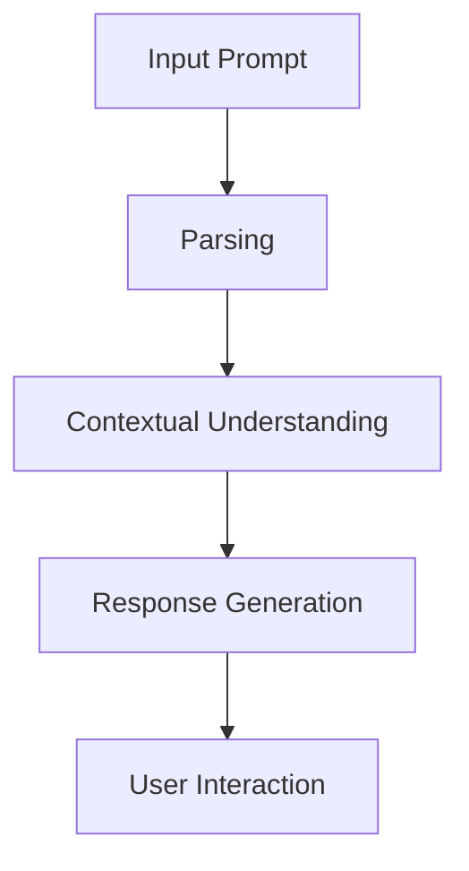

                 

# Prompt Multidimensional Thinking: Enhancing LLM Creativity

> Keywords: Prompt Engineering, Language Models, Creativity, Neural Networks, Transformer Models, Recursive Neural Networks

> Abstract: This article delves into the concept of prompt multidimensional thinking, highlighting its importance in enhancing the creativity of Language Learning Models (LLMs). We explore the foundational concepts, algorithms, and mathematical models that underpin prompt engineering, alongside practical implementations and case studies. The goal is to provide a comprehensive understanding of how to boost the creativity of LLMs using structured approaches and advanced techniques.

## 1. Introduction to Prompt Multidimensional Thinking

### 1.1 The Evolution of Prompt Engineering

Prompt engineering has undergone significant transformation over the years. Historically, prompts were simplistic and designed to elicit basic responses from machines. Traditional methods involved using a fixed set of keywords or phrases to guide the machine’s output. However, as AI and machine learning advanced, so did the sophistication of prompt engineering.

The advent of modern prompt techniques has revolutionized the field. Modern prompts are context-aware and dynamic, leveraging advanced algorithms to better understand the user's intent and generate more nuanced responses. This evolution has been driven by the increasing complexity of language and the need for more human-like interactions with machines.

#### 1.1.1 From Traditional to Modern Prompt Techniques

In traditional prompt engineering, the focus was on providing a set of keywords to guide the machine’s response. This approach was limited and often resulted in generic or boilerplate answers. Modern prompt techniques, on the other hand, involve a more nuanced approach to understanding and generating responses. These techniques include natural language processing (NLP) algorithms, context-aware prompts, and personalized responses based on user data.

#### 1.1.2 The Role of AI in Prompt Engineering

AI has played a pivotal role in the development of modern prompt engineering. AI algorithms, such as transformers and recursive neural networks, have enabled machines to understand and generate more complex and contextually relevant responses. These algorithms are trained on vast amounts of data, allowing them to learn patterns and nuances in language that traditional methods could not capture.

### 1.2 The Importance of Creativity in LLMs

Creativity is a cornerstone of human intelligence and plays a crucial role in problem-solving, innovation, and communication. In the context of LLMs, creativity enhances the ability of these models to generate original and insightful content. A creative LLM can generate unique and engaging responses, making interactions more meaningful and human-like.

#### 1.2.1 The Definition of Creativity

Creativity can be defined as the ability to generate new and valuable ideas, often by combining existing knowledge in novel ways. In the context of LLMs, creativity manifests as the ability to produce original content, think outside the box, and adapt to new situations.

#### 1.2.2 Enhancing Creativity in Language Models

Enhancing the creativity of LLMs involves improving their ability to generate original and valuable content. This can be achieved through several approaches, including:

1. **Advanced Training Algorithms**: Using sophisticated algorithms that encourage the generation of diverse and creative outputs.
2. **Contextual Awareness**: Ensuring that LLMs understand the context of the conversation and can generate responses that are relevant and creative.
3. **Data Augmentation**: Providing LLMs with a diverse and extensive dataset to learn from, promoting the generation of unique content.
4. **Human-in-the-loop**: Incorporating human feedback to guide the training process and encourage creative outputs.

### 1.3 Overview of the Book

This book is organized into several sections, each addressing a different aspect of prompt multidimensional thinking. The book aims to provide a comprehensive understanding of how to enhance the creativity of LLMs using advanced techniques and algorithms.

#### 1.3.1 Structure and Organization

The book is structured as follows:

1. **Introduction**: Provides an overview of prompt engineering and the importance of creativity in LLMs.
2. **Foundations of Prompt Multidimensional Thinking**: Discusses core concepts, algorithms, and mathematical models.
3. **Advanced Techniques**: Explores advanced techniques for enhancing creativity in LLMs.
4. **Case Studies**: Presents practical case studies and applications of prompt engineering.
5. **Conclusion**: Summarizes the key insights and provides a roadmap for future research.

#### 1.3.2 Key Takeaways

- Prompt engineering has evolved from traditional to modern techniques.
- Creativity is essential for enhancing the performance and relevance of LLMs.
- Advanced algorithms and techniques can be used to boost the creativity of LLMs.
- Practical case studies demonstrate the effectiveness of prompt engineering in real-world scenarios.

## 2. Foundations of Prompt Multidimensional Thinking

### 2.1 Core Concepts and Relationships

Understanding the core concepts and their relationships is crucial for effectively employing prompt engineering techniques. At the heart of prompt engineering lies the interaction between input prompts, parsing, contextual understanding, response generation, and user interaction.

#### 2.1.1 Mermaid Diagram of Prompt Engineering

Below is a Mermaid diagram illustrating the core components and their relationships in prompt engineering:



In this diagram, the input prompt serves as the starting point, which is then parsed to extract relevant information. The parsed data is used to understand the context, which in turn guides the response generation. The generated response is then used to interact with the user, creating a loop that can be iterated to enhance the user's experience.

### 2.2 Core Algorithms and Principles

The success of prompt engineering is heavily reliant on the algorithms and principles that underpin it. Two of the most influential algorithms in this field are Recursive Neural Networks (RvNN) and Transformer Models.

#### 2.2.1 Recursive Neural Networks (RvNN)

Recursive Neural Networks are a type of neural network designed to process tree-structured data, making them particularly suitable for natural language processing tasks. RvNNs operate by recursively breaking down complex structures into simpler components.

##### 2.2.1.1 Introduction to RvNN

RvNNs work by defining a set of operations that can be applied recursively to the nodes of a tree. This allows them to capture the hierarchical relationships within the data, which is essential for understanding the structure and meaning of sentences.

##### 2.2.1.2 Algorithm Explanation

Here's a simplified pseudo code for a basic RvNN:

```python
def RvNN(node):
    if node is a leaf:
        return node.value
    else:
        left_child = RvNN(node.left)
        right_child = RvNN(node.right)
        return apply_recursive_function(left_child, right_child)
```

In this pseudo code, `node` represents a tree structure, and `apply_recursive_function` is a function that performs a specific operation on the values of the left and right children.

#### 2.2.2 Transformer Models

Transformer Models are a type of neural network architecture that has revolutionized natural language processing. They are based on the self-attention mechanism, which allows the model to weigh the importance of different words in the input sequence dynamically.

##### 2.2.2.1 Overview of Transformer Models

Transformer Models consist of an encoder and a decoder. The encoder processes the input sequence and generates a set of context vectors. The decoder then uses these context vectors to generate the output sequence.

##### 2.2.2.2 Algorithm Explanation

Here's a simplified pseudo code for a basic Transformer Model:

```python
def Transformer(input_sequence):
    embedding = embedding_layer(input_sequence)
    encoder_output = multihead_attention(embedding)
    encoder_output = feedforward_layer(encoder_output)
    decoder_output = multihead_attention(encoder_output, encoder_output)
    decoder_output = feedforward_layer(decoder_output)
    return decoder_output
```

In this pseudo code, `input_sequence` represents the input sequence of words, `embedding_layer` converts words into vectors, `multihead_attention` calculates the attention weights, and `feedforward_layer` applies a non-linear transformation.

### 2.3 Mathematical Models and Formulas

Understanding the mathematical models and formulas used in prompt engineering is essential for grasping the underlying principles. One of the key mathematical concepts in prompt engineering is the attention mechanism, which is central to Transformer Models.

#### 2.3.1 Attention Mechanism

The attention mechanism is a way of allowing the model to focus on different parts of the input sequence when generating the output. The attention weight is calculated using the following formula:

$$
\text{Attention}(Q, K, V) = \text{softmax}\left(\frac{QK^T}{\sqrt{d_k}}\right) V
$$

Where:
- $Q$ is the query vector.
- $K$ is the key vector.
- $V$ is the value vector.
- $d_k$ is the dimension of the key vector.

This formula computes the attention weights by taking the dot product of the query and key vectors, followed by a softmax function to normalize the results. The resulting attention weights are then used to weight the value vectors, allowing the model to focus on the most relevant parts of the input sequence.

#### 2.3.2 Encoder-Decoder Attention

Encoder-decoder attention is a specific type of attention mechanism used in Transformer Models to compute the context vector for the decoder. The context vector is calculated as follows:

$$
C = \text{Attention}(D, S, V)
$$

Where:
- $D$ is the encoder output.
- $S$ is the decoder output.
- $V$ is the value vector.

This formula computes the context vector by taking the attention weights, calculated using the encoder output and decoder output, and weighting the value vector accordingly.

### Conclusion

In this chapter, we have explored the foundational concepts and algorithms of prompt engineering. We discussed the evolution of prompt techniques, the importance of creativity in LLMs, and the core algorithms, such as RvNN and Transformer Models. Additionally, we introduced the mathematical models and formulas that underpin these algorithms. Understanding these foundational concepts is crucial for effectively employing prompt engineering techniques to enhance the creativity of LLMs.

