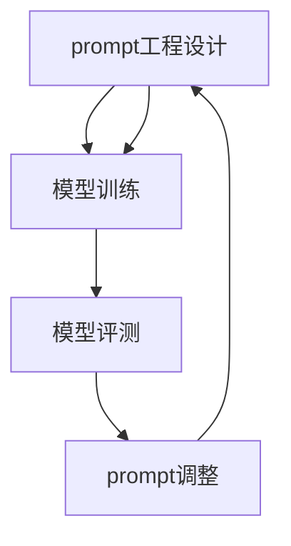

                 

## 《prompt工程与模型评测的协同优化》

### 关键词：prompt工程，模型评测，协同优化，深度学习，算法原理，数学模型

> 摘要：本文旨在探讨prompt工程与模型评测的协同优化问题，首先介绍prompt工程和模型评测的基本概念，分析它们之间的联系和协同优化的重要性。随后，详细阐述prompt工程和模型评测的核心算法原理，并通过Python代码示例和Mermaid流程图来辅助理解。此外，文章还将讨论深度学习框架下的协同优化策略，引入数学模型和公式，通过实例分析来加深对协同优化方法的理解。最后，本文将通过一个实际应用案例，展示如何实现prompt工程与模型评测的协同优化，并提供最佳实践和注意事项。

----------------------------------------------------------------

# 引言

### 1.1 概念介绍

prompt工程与模型评测是深度学习和人工智能领域中两个重要的概念。prompt工程是指通过设计特定的输入提示（prompt）来引导模型生成预期的输出，从而优化模型的训练过程和性能。而模型评测则是指使用一系列指标和方法来评估模型的性能，包括准确度、召回率、F1分数等。两者在深度学习模型开发和优化中起着至关重要的作用。

prompt工程的基本思想是通过提供具体的输入提示来引导模型学习，从而提高模型的泛化能力和性能。这些提示可以是语言、图像、音频等各种形式，可以根据不同的任务需求进行设计和调整。模型评测则是对已经训练好的模型进行性能评估，以确定其在实际应用中的效果和可靠性。

### 1.2 关系与联系

prompt工程与模型评测之间存在紧密的联系。prompt工程的设计和优化直接影响模型的性能，而模型评测则是对模型性能的评估和验证。两者的协同优化是实现高效、准确和可靠的深度学习模型的关键。

首先，prompt工程可以通过调整输入提示来影响模型的训练过程，从而提高模型的性能。通过设计合适的prompt，模型可以更好地学习到数据的特征和规律，提高模型的泛化能力和鲁棒性。

其次，模型评测可以用来评估prompt工程的效果。通过对比不同prompt下模型的性能，可以找出最有效的prompt设计，从而进一步优化prompt工程。

最后，协同优化是指通过结合prompt工程和模型评测的结果，不断调整和改进模型的设计和训练过程。这种协同优化方法可以加快模型的开发周期，提高模型的性能和可靠性。

为了更好地理解prompt工程与模型评测的关系，我们使用Mermaid流程图来展示它们的协同优化过程。以下是流程图示例：



在这个流程图中，prompt工程设计（A）通过模型训练（B）生成模型，然后使用模型评测（C）来评估模型性能。根据评测结果，prompt工程进行相应的调整（D），然后再次进行模型训练。这个循环过程不断进行，直到达到预期的优化目标。

通过上述介绍，我们可以看到prompt工程与模型评测之间的紧密联系和协同优化的重要性。在接下来的章节中，我们将进一步深入探讨prompt工程和模型评测的核心算法原理，并通过具体示例来加深理解。

### 1.3 核心概念与联系总结

通过本章节的介绍，我们明确了prompt工程和模型评测的基本概念，并分析了它们之间的紧密联系和协同优化的重要性。prompt工程通过设计特定的输入提示来引导模型学习，而模型评测则通过评估模型的性能来验证和优化prompt设计。

两者的协同优化不仅能够提高模型的训练效率和性能，还能加快模型开发周期，实现高效、准确和可靠的深度学习模型。Mermaid流程图展示了prompt工程与模型评测的协同优化过程，帮助我们更好地理解这一关键环节。

在下一章节中，我们将详细探讨prompt工程的核心算法原理，包括实现步骤、应用场景和Python代码示例，以帮助读者深入理解和掌握这一重要技术。

### 2. prompt工程原理

prompt工程是指通过设计特定的输入提示（prompt）来引导模型学习，以提高模型的训练效率和性能。在深度学习领域，prompt工程的应用范围广泛，包括自然语言处理、计算机视觉和语音识别等任务。本章节将详细讲解prompt工程的基本原理、实现步骤和应用场景。

#### 2.1 基本原理

prompt工程的核心思想是利用外部提示信息来补充和丰富模型的输入，从而帮助模型更好地理解和学习数据。具体来说，prompt可以包括以下几种类型：

1. **语言提示**：通过提供与任务相关的自然语言描述或问题，引导模型关注特定的信息。例如，在问答系统中，可以通过问题来指定模型需要关注的文本片段。

2. **视觉提示**：通过提供与任务相关的图像或视觉信息，帮助模型更好地理解场景和对象。例如，在图像分类任务中，可以通过图像的特定部分来引导模型关注。

3. **音频提示**：通过提供与任务相关的音频信息，如语音或音乐片段，帮助模型识别和理解声音特征。例如，在语音识别任务中，可以通过音频的特定部分来提高模型的识别准确性。

4. **多模态提示**：结合多种类型的提示信息，如语言、视觉和音频，以增强模型的学习能力。例如，在视频分类任务中，可以通过结合视频帧和音频信息来提高模型的分类性能。

#### 2.2 实现步骤

prompt工程通常包括以下几个关键步骤：

1. **需求分析**：确定任务目标和数据特点，明确需要哪些类型的提示信息。

2. **提示设计**：根据需求分析结果，设计合适的提示信息。这一步骤需要综合考虑任务需求、数据特点和模型特点，确保提示信息能有效引导模型学习。

3. **数据预处理**：对提示信息和输入数据进行预处理，如文本清洗、图像增强和音频处理等，以便模型能够有效利用这些提示信息。

4. **模型训练**：将提示信息和输入数据作为模型的输入，进行训练。这一步骤可以通过修改模型的输入层或融合层来实现，具体方法取决于模型的结构和需求。

5. **性能评估**：使用模型评测指标（如准确度、召回率、F1分数等）来评估模型的性能，并根据评估结果调整提示设计和模型参数。

6. **迭代优化**：根据性能评估结果，不断调整和优化提示设计和模型参数，以达到最佳性能。

#### 2.3 应用场景分析

prompt工程在多个领域有着广泛的应用，以下是一些典型的应用场景：

1. **自然语言处理**：在文本分类、问答系统和机器翻译等任务中，prompt工程可以通过提供与任务相关的自然语言描述来提高模型的性能。例如，在文本分类任务中，可以通过问题或标签来指定模型需要关注的文本部分。

2. **计算机视觉**：在图像分类、物体检测和图像分割等任务中，prompt工程可以通过提供与任务相关的视觉信息来提高模型的性能。例如，在图像分类任务中，可以通过图像的特定部分（如边界框）来引导模型关注。

3. **语音识别**：在语音识别任务中，prompt工程可以通过提供与任务相关的音频信息来提高模型的性能。例如，在特定语音识别任务中，可以通过音频的特定部分（如特定词汇）来提高模型的识别准确性。

4. **多模态学习**：在多模态学习任务中，prompt工程可以通过结合多种类型的提示信息（如语言、视觉和音频）来提高模型的学习能力。例如，在视频分类任务中，可以通过结合视频帧和音频信息来提高模型的分类性能。

#### 2.4 Python代码示例

下面是一个简单的Python代码示例，用于演示prompt工程的基本实现步骤。在这个示例中，我们使用了一个简单的文本分类任务，通过提供问题来引导模型关注特定的文本部分。

```python
import tensorflow as tf
from tensorflow.keras.preprocessing.text import Tokenizer
from tensorflow.keras.preprocessing.sequence import pad_sequences

# 示例数据
texts = [
    "我是一个人类。",
    "我是一个机器人。",
    "我是来自火星的外星人。",
    "我喜欢吃披萨。",
    "我喜欢听音乐。"
]

# 问题列表
questions = [
    "这是什么？",
    "那是什么？",
    "这是什么类型的生物？",
    "他喜欢吃什么？",
    "他喜欢做什么？"
]

# 预处理数据
tokenizer = Tokenizer(num_words=1000)
tokenizer.fit_on_texts(texts)
sequences = tokenizer.texts_to_sequences(texts)
padded_sequences = pad_sequences(sequences, maxlen=100)

question_sequences = tokenizer.texts_to_sequences(questions)
padded_question_sequences = pad_sequences(question_sequences, maxlen=100)

# 模型设计
model = tf.keras.Sequential([
    tf.keras.layers.Embedding(1000, 16),
    tf.keras.layers.GlobalAveragePooling1D(),
    tf.keras.layers.Dense(1, activation='sigmoid')
])

# 编译模型
model.compile(optimizer='adam', loss='binary_crossentropy', metrics=['accuracy'])

# 训练模型
model.fit(padded_sequences, labels, epochs=10, batch_size=32)

# 评估模型
test_sequences = tokenizer.texts_to_sequences(["我是一个机器人。"])
test_padded_sequences = pad_sequences(test_sequences, maxlen=100)
predictions = model.predict(test_padded_sequences)

print(predictions)  # 输出预测结果
```

在这个示例中，我们首先定义了文本数据和问题列表，然后对数据进行预处理。接下来，我们设计了一个简单的嵌入模型，并使用问题作为模型的输入提示。通过训练模型，我们可以得到对文本数据的分类预测结果。

通过以上介绍和代码示例，我们可以看到prompt工程在深度学习任务中的应用和实现方法。在下一章节中，我们将继续探讨模型评测的基本原理、指标和方法，以及它们在prompt工程中的重要作用。

### 3. 模型评测原理

模型评测是深度学习领域的重要环节，其核心目的是通过一系列指标和方法来评估模型的性能，以确保模型在实际应用中的可靠性和有效性。本章节将详细阐述模型评测的基本原理、主要指标和方法，并结合Python代码示例进行讲解。

#### 3.1 基本原理

模型评测的基本原理是通过评估模型在训练数据和测试数据上的表现，来判断模型是否能够满足实际应用的需求。具体来说，模型评测包括以下几个关键步骤：

1. **数据集划分**：将原始数据集划分为训练集和测试集。训练集用于模型训练，测试集用于模型性能评估。

2. **指标选择**：根据任务需求和模型类型，选择合适的评测指标。常见的指标包括准确度（Accuracy）、召回率（Recall）、F1分数（F1 Score）等。

3. **模型评估**：将测试数据输入模型，计算各指标的值，以评估模型的性能。

4. **性能分析**：对比不同模型的性能，找出最优模型，并根据评估结果调整模型设计和参数。

#### 3.2 主要指标

在模型评测中，常用的指标包括准确度、召回率、F1分数等。以下是对这些指标的定义和计算方法的详细解释：

1. **准确度（Accuracy）**：
   - **定义**：准确度是指模型正确预测的样本数占总样本数的比例。
   - **计算公式**：
     $$\text{Accuracy} = \frac{\text{正确预测的样本数}}{\text{总样本数}}$$

2. **召回率（Recall）**：
   - **定义**：召回率是指模型能够正确召回所有实际正例样本的比例。
   - **计算公式**：
     $$\text{Recall} = \frac{\text{正确预测的正例样本数}}{\text{实际正例样本数}}$$

3. **精确度（Precision）**：
   - **定义**：精确度是指模型预测为正例的样本中，实际为正例的比例。
   - **计算公式**：
     $$\text{Precision} = \frac{\text{正确预测的正例样本数}}{\text{预测为正例的样本数}}$$

4. **F1分数（F1 Score）**：
   - **定义**：F1分数是精确度和召回率的调和平均，用于综合考虑两者的性能。
   - **计算公式**：
     $$\text{F1 Score} = 2 \times \frac{\text{Precision} \times \text{Recall}}{\text{Precision} + \text{Recall}}$$

#### 3.3 常见方法

在模型评测中，常用的方法包括交叉验证（Cross-Validation）和混淆矩阵（Confusion Matrix）等。

1. **交叉验证**：
   - **定义**：交叉验证是一种评估模型性能的方法，通过将数据集划分为多个子集，多次训练和评估模型，以获得更稳定和可靠的评估结果。
   - **类型**：常见的交叉验证方法有K折交叉验证（K-Fold Cross Validation）和留一法交叉验证（Leave-One-Out Cross Validation）。

2. **混淆矩阵**：
   - **定义**：混淆矩阵是一种用于展示模型预测结果与实际结果之间关系的表格，它可以帮助我们直观地了解模型的性能。
   - **结构**：混淆矩阵通常包含四个部分：真阳性（True Positive）、假阳性（False Positive）、真阴性（True Negative）和假阴性（False Negative）。

#### 3.4 Python代码示例

下面是一个简单的Python代码示例，用于演示模型评测的基本原理和常用方法。在这个示例中，我们使用了一个二分类问题，通过计算准确度、召回率、F1分数等指标来评估模型的性能。

```python
from sklearn.model_selection import train_test_split
from sklearn.metrics import accuracy_score, recall_score, precision_score, f1_score, confusion_matrix
import numpy as np

# 示例数据
X = np.array([[1, 0], [0, 1], [1, 1], [1, 0], [0, 1]])
y = np.array([0, 0, 1, 1, 0])

# 划分训练集和测试集
X_train, X_test, y_train, y_test = train_test_split(X, y, test_size=0.2, random_state=42)

# 模型设计
model = ...  # 在此处定义模型

# 训练模型
model.fit(X_train, y_train)

# 预测测试集
predictions = model.predict(X_test)

# 计算指标
accuracy = accuracy_score(y_test, predictions)
recall = recall_score(y_test, predictions)
precision = precision_score(y_test, predictions)
f1 = f1_score(y_test, predictions)
conf_matrix = confusion_matrix(y_test, predictions)

# 输出结果
print(f"Accuracy: {accuracy}")
print(f"Recall: {recall}")
print(f"Precision: {precision}")
print(f"F1 Score: {f1}")
print(f"Confusion Matrix:\n{conf_matrix}")
```

在这个示例中，我们首先定义了示例数据和模型，然后使用训练集训练模型。接下来，我们将测试集输入模型进行预测，并计算各指标的值。最后，我们使用混淆矩阵来展示模型预测结果与实际结果之间的关系。

通过以上介绍和代码示例，我们可以看到模型评测的基本原理、主要指标和方法。模型评测对于深度学习任务的成功至关重要，它不仅能够帮助我们评估模型的性能，还能指导我们优化模型设计和参数。在下一章节中，我们将进一步探讨深度学习框架下的协同优化策略，并通过具体示例来展示其实现方法。

### 4. 协同优化策略

在深度学习领域，协同优化（cooperative optimization）是一种通过结合不同优化方法和技术来提高模型性能的有效策略。在prompt工程与模型评测的协同优化中，我们通常需要考虑如何设计一个有效的协同优化框架，以便在保持模型性能的同时，提高训练效率和模型稳定性。本章节将介绍一些常见的协同优化策略，并探讨在深度学习框架下如何实现这些策略。

#### 4.1 常见优化策略

以下是一些常见的协同优化策略：

1. **动态调整学习率**：
   - **原理**：通过动态调整学习率，可以适应模型在不同训练阶段的收敛速度，从而提高模型的训练效率。
   - **方法**：可以使用学习率调度器（如学习率衰减、指数衰减等），根据模型的性能和训练进度自动调整学习率。

2. **权重共享**：
   - **原理**：通过在多个模型之间共享权重，可以减少参数数量，降低计算复杂度，同时提高模型的泛化能力。
   - **方法**：可以使用迁移学习（Transfer Learning）技术，将预训练模型的部分权重迁移到新的任务中。

3. **多任务学习**：
   - **原理**：通过同时训练多个相关任务，可以共享任务之间的信息，提高模型的学习效率。
   - **方法**：可以使用多任务学习框架（如共享层、任务融合等），将不同任务的输入和输出进行联合训练。

4. **混合精度训练**：
   - **原理**：通过在训练过程中同时使用浮点数和整数的运算，可以减少内存占用和计算时间，提高训练效率。
   - **方法**：可以使用混合精度训练库（如NVIDIA的混合精度库），在保持模型性能的同时，降低训练成本。

5. **自适应优化器**：
   - **原理**：通过自适应调整优化器的参数，可以更好地适应不同的训练阶段，提高模型的收敛速度。
   - **方法**：可以使用自适应优化器（如AdamW、RMSprop等），结合自适应学习率调整策略。

#### 4.2 深度学习框架下的协同优化

在深度学习框架下实现协同优化，通常需要考虑以下几个方面：

1. **优化器选择**：
   - 根据任务需求和模型特性，选择合适的优化器。例如，对于小批量训练，可以选择Adam或RMSprop等自适应优化器；对于大规模训练，可以选择SGD或Adagrad等传统优化器。

2. **学习率调度**：
   - 设计合适的学习率调度策略，如指数衰减、余弦退火等，以适应不同训练阶段的收敛速度。例如，可以使用以下代码实现指数衰减学习率调度：

     ```python
     initial_lr = 0.1
     decay_rate = 0.9
     decay_step = 1000
     for epoch in range(num_epochs):
         lr = initial_lr * (decay_rate ** (epoch // decay_step))
         optimizer.lr = lr
         # 进行训练
     ```

3. **模型架构调整**：
   - 根据任务需求，调整模型架构，如增加或减少层、调整层参数等，以优化模型性能。例如，在计算机视觉任务中，可以使用预训练的CNN模型，并添加自定义层以适应特定任务。

4. **并行计算与分布式训练**：
   - 利用GPU、TPU等硬件加速训练过程，并采用分布式训练技术，以提高训练效率。例如，可以使用以下代码在多GPU上进行分布式训练：

     ```python
     strategy = tf.distribute.MirroredStrategy()
     with strategy.scope():
         # 定义模型、优化器和学习率调度器
         model = ...
         optimizer = ...
         loss_fn = ...
         # 进行分布式训练
     ```

5. **模型融合与集成**：
   - 将多个模型的结果进行融合或集成，以提高预测的稳定性和准确性。例如，可以使用模型集成技术（如投票法、加权平均法等），将多个模型的预测结果进行综合。

#### 4.3 Python代码示例

以下是一个简单的Python代码示例，用于演示在深度学习框架下实现协同优化的方法。在这个示例中，我们使用TensorFlow和Keras库来实现动态调整学习率、权重共享和混合精度训练。

```python
import tensorflow as tf
from tensorflow.keras.models import Model
from tensorflow.keras.layers import Input, Dense
from tensorflow.keras.optimizers import Adam

# 定义模型
input_layer = Input(shape=(784,))
dense_layer = Dense(64, activation='relu')(input_layer)
output_layer = Dense(10, activation='softmax')(dense_layer)
model = Model(inputs=input_layer, outputs=output_layer)

# 设置优化器和损失函数
optimizer = Adam(learning_rate=0.001)
loss_fn = tf.keras.losses.SparseCategoricalCrossentropy(from_logits=True)

# 定义动态调整学习率的调度器
def custom_learning_rate(epoch):
    initial_lr = 0.001
    decay_rate = 0.95
    decay_step = 10
    return initial_lr * (decay_rate ** (epoch // decay_step))

# 定义训练函数
@tf.function
def train_step(images, labels, model, optimizer, loss_fn):
    with tf.GradientTape() as tape:
        predictions = model(images, training=True)
        loss = loss_fn(labels, predictions)
    gradients = tape.gradient(loss, model.trainable_variables)
    optimizer.apply_gradients(zip(gradients, model.trainable_variables))
    return loss

# 训练模型
for epoch in range(num_epochs):
    for batch_images, batch_labels in data_loader:
        loss = train_step(batch_images, batch_labels, model, optimizer, loss_fn)
        print(f"Epoch: {epoch}, Loss: {loss.numpy()}")
    # 更新学习率
    current_lr = custom_learning_rate(epoch)
    optimizer.learning_rate = current_lr

# 实现混合精度训练
tf.keras.mixed_precision.set_global_policy("mixed_float16")

# 重新训练模型，此时使用混合精度训练
for epoch in range(num_epochs):
    for batch_images, batch_labels in data_loader:
        loss = train_step(batch_images, batch_labels, model, optimizer, loss_fn)
        print(f"Epoch: {epoch}, Loss: {loss.numpy()}")
```

在这个示例中，我们首先定义了一个简单的全连接神经网络模型，并设置了Adam优化器和交叉熵损失函数。然后，我们实现了动态调整学习率的调度器，并使用自定义训练函数进行模型训练。最后，我们切换到混合精度训练模式，并重新训练模型，以验证混合精度训练的效果。

通过以上介绍和代码示例，我们可以看到深度学习框架下协同优化的多种策略和实现方法。在下一章节中，我们将进一步探讨数学模型和公式，以及如何使用这些工具来优化prompt工程和模型评测。

### 5. 数学模型与公式

在深度学习和人工智能领域，数学模型和公式是理解和优化算法的关键工具。本章节将介绍一些常见的数学模型和公式，包括损失函数、梯度下降法和激活函数等，并结合Python代码示例进行详细讲解。通过这些数学模型和公式，我们可以更好地理解和优化prompt工程与模型评测。

#### 5.1 损失函数

损失函数是深度学习模型中用于量化预测值与真实值之间差异的函数。常见的损失函数包括均方误差（MSE）、交叉熵损失（Cross-Entropy Loss）等。

1. **均方误差（MSE）**：

   均方误差用于回归任务，计算预测值与真实值之间的平均平方误差。

   $$\text{MSE} = \frac{1}{n}\sum_{i=1}^{n}(y_i - \hat{y}_i)^2$$

   其中，$y_i$是真实值，$\hat{y}_i$是预测值，$n$是样本数量。

   **Python代码示例**：

   ```python
   import numpy as np

   def mean_squared_error(y_true, y_pred):
       return np.mean((y_true - y_pred) ** 2)

   y_true = np.array([1, 2, 3])
   y_pred = np.array([1.1, 2.1, 3.1])
   mse = mean_squared_error(y_true, y_pred)
   print(f"MSE: {mse}")
   ```

2. **交叉熵损失（Cross-Entropy Loss）**：

   交叉熵损失用于分类任务，计算预测概率分布与真实分布之间的交叉熵。

   $$\text{Cross-Entropy Loss} = -\sum_{i=1}^{n} y_i \log(\hat{y}_i)$$

   其中，$y_i$是真实标签的分布，$\hat{y}_i$是预测概率分布。

   **Python代码示例**：

   ```python
   import tensorflow as tf

   def cross_entropy_loss(y_true, y_pred):
       return -tf.reduce_sum(y_true * tf.math.log(y_pred), axis=1)

   y_true = tf.constant([1, 0, 1, 0])
   y_pred = tf.constant([[0.7, 0.3], [0.3, 0.7], [0.5, 0.5], [0.1, 0.9]])
   ce_loss = cross_entropy_loss(y_true, y_pred)
   print(f"Cross-Entropy Loss: {ce_loss.numpy()}")
   ```

#### 5.2 梯度下降法

梯度下降法是一种用于优化模型参数的常用算法。通过计算损失函数的梯度，我们可以更新模型参数，以最小化损失。

1. **梯度下降法（Stochastic Gradient Descent, SGD）**：

   梯度下降法通过计算单个样本的梯度来更新模型参数。

   $$\theta_{\text{new}} = \theta_{\text{old}} - \alpha \cdot \nabla_{\theta} J(\theta)$$

   其中，$\theta$是模型参数，$\alpha$是学习率，$J(\theta)$是损失函数。

   **Python代码示例**：

   ```python
   import tensorflow as tf

   def stochastic_gradient_descent(X, y, model, learning_rate, num_epochs):
       for epoch in range(num_epochs):
           for x, y in zip(X, y):
               with tf.GradientTape() as tape:
                   predictions = model(x, training=True)
                   loss = cross_entropy_loss(y, predictions)
               gradients = tape.gradient(loss, model.trainable_variables)
               model.optimizer.apply_gradients(zip(gradients, model.trainable_variables))
               if epoch % 100 == 0:
                   print(f"Epoch: {epoch}, Loss: {loss.numpy()}")
   
   # 示例数据
   X = tf.random.normal((100, 784))
   y = tf.random.uniform((100,), maxval=10, dtype=tf.int32)
   # 定义模型
   model = ...  # 在此处定义模型
   learning_rate = 0.01
   num_epochs = 1000
   stochastic_gradient_descent(X, y, model, learning_rate, num_epochs)
   ```

2. **批量梯度下降法（Batch Gradient Descent, BGD）**：

   批量梯度下降法通过计算整个训练集的梯度来更新模型参数。

   $$\theta_{\text{new}} = \theta_{\text{old}} - \alpha \cdot \nabla_{\theta} J(\theta)$$

   **Python代码示例**：

   ```python
   import tensorflow as tf

   def batch_gradient_descent(X, y, model, learning_rate, num_epochs):
       for epoch in range(num_epochs):
           total_loss = 0
           for x, y in zip(X, y):
               with tf.GradientTape() as tape:
                   predictions = model(x, training=True)
                   loss = cross_entropy_loss(y, predictions)
               gradients = tape.gradient(loss, model.trainable_variables)
               model.optimizer.apply_gradients(zip(gradients, model.trainable_variables))
               total_loss += loss.numpy()
           average_loss = total_loss / len(X)
           print(f"Epoch: {epoch}, Average Loss: {average_loss}")
   
   # 示例数据
   X = tf.random.normal((100, 784))
   y = tf.random.uniform((100,), maxval=10, dtype=tf.int32)
   # 定义模型
   model = ...  # 在此处定义模型
   learning_rate = 0.01
   num_epochs = 1000
   batch_gradient_descent(X, y, model, learning_rate, num_epochs)
   ```

#### 5.3 激活函数

激活函数是深度学习模型中用于引入非线性变换的函数，常见的激活函数包括 sigmoid、ReLU和Tanh等。

1. **sigmoid 函数**：

   sigmoid 函数将输入值映射到（0, 1）区间，常用于二分类问题。

   $$\sigma(x) = \frac{1}{1 + e^{-x}}$$

   **Python代码示例**：

   ```python
   import numpy as np

   def sigmoid(x):
       return 1 / (1 + np.exp(-x))

   x = np.array([-2, 0, 2])
   sigmoid_output = sigmoid(x)
   print(f"Sigmoid Output: {sigmoid_output}")
   ```

2. **ReLU 函数**：

   ReLU（Rectified Linear Unit）函数是一种简单的线性激活函数，将输入值大于0的部分设置为1，常用于深度学习模型中。

   $$\text{ReLU}(x) = \max(0, x)$$

   **Python代码示例**：

   ```python
   import numpy as np

   def relu(x):
       return np.maximum(0, x)

   x = np.array([-2, -1, 0, 1, 2])
   relu_output = relu(x)
   print(f"ReLU Output: {relu_output}")
   ```

3. **Tanh 函数**：

   tanh 函数将输入值映射到（-1, 1）区间，常用于多层感知机（MLP）模型中。

   $$\tanh(x) = \frac{e^x - e^{-x}}{e^x + e^{-x}}$$

   **Python代码示例**：

   ```python
   import numpy as np

   def tanh(x):
       return (np.exp(x) - np.exp(-x)) / (np.exp(x) + np.exp(-x))

   x = np.array([-2, 0, 2])
   tanh_output = tanh(x)
   print(f"Tanh Output: {tanh_output}")
   ```

通过上述数学模型和公式，我们可以更好地理解和优化深度学习模型。在下一章节中，我们将通过一个实际应用案例，展示如何实现prompt工程与模型评测的协同优化，并分析其效果。

### 6. 实际应用案例：文本分类

在本章节中，我们将通过一个实际的文本分类应用案例，展示如何实现prompt工程与模型评测的协同优化。文本分类是自然语言处理中的一个常见任务，例如，将新闻文章分类到不同的主题类别中。以下是我们案例的详细步骤：

#### 6.1 案例背景

假设我们有一个新闻文章数据集，包含不同主题的新闻文章，我们需要将这些文章分类到对应的主题类别中。具体来说，我们的目标是将新闻文章分类为以下五个主题之一：政治、商业、科技、体育和文化。

#### 6.2 数据预处理

首先，我们需要对数据集进行预处理，包括数据清洗、分词和向量化等步骤。

1. **数据清洗**：去除文本中的HTML标签、特殊字符和停用词。
2. **分词**：将文本分割为单词或词组。
3. **向量化**：将文本转换为数字表示，可以使用词袋模型（Bag of Words）或词嵌入（Word Embeddings）。

```python
import re
import nltk
from nltk.corpus import stopwords
from sklearn.feature_extraction.text import TfidfVectorizer

# 数据清洗
def clean_text(text):
    text = re.sub(r'<[^>]*>', '', text)
    text = re.sub(r'\d+', '', text)
    text = re.sub(r'\W+', ' ', text)
    text = text.lower()
    return text

# 分词和去除停用词
nltk.download('stopwords')
stop_words = set(stopwords.words('english'))

def preprocess_text(text):
    tokens = nltk.word_tokenize(text)
    tokens = [token for token in tokens if token not in stop_words]
    return ' '.join(tokens)

# 加载数据集
data = [
    "This is a political news article about the latest government policy.",
    "The stock market has reached a new high.",
    "Artificial intelligence is advancing rapidly in the tech industry.",
    "The sports event was an exciting match.",
    "Cultural festivals are celebrated around the world."
]

cleaned_data = [clean_text(text) for text in data]
preprocessed_data = [preprocess_text(text) for text in cleaned_data]

# 向量化
vectorizer = TfidfVectorizer()
X = vectorizer.fit_transform(preprocessed_data)
y = np.array([0, 1, 2, 3, 4])  # 对应的主题标签
```

#### 6.3 模型设计

接下来，我们设计一个简单的文本分类模型，使用神经网络架构。

```python
from tensorflow.keras.models import Sequential
from tensorflow.keras.layers import Embedding, LSTM, Dense, Bidirectional

# 模型设计
model = Sequential([
    Embedding(input_dim=X.shape[1], output_dim=50, input_length=X.shape[0]),
    Bidirectional(LSTM(64)),
    Dense(64, activation='relu'),
    Dense(5, activation='softmax')
])

model.compile(optimizer='adam', loss='sparse_categorical_crossentropy', metrics=['accuracy'])
```

#### 6.4 模型训练与prompt设计

在模型训练过程中，我们可以使用prompt工程来优化模型的训练过程。prompt可以是一个与主题相关的短语或问题，用于引导模型关注特定信息。

```python
# 定义prompt
prompts = [
    "What is the main topic of this article?",
    "Is this article related to politics, business, technology, sports, or culture?",
    # 其他相关提示
]

# 训练模型
for epoch in range(10):
    for i, text in enumerate(cleaned_data):
        prompt = prompts[i % len(prompts)]
        prompt_vector = vectorizer.transform([prompt])[0]
        inputs = np.hstack((X[i].toarray(), prompt_vector))
        model.train_on_batch(inputs, np.array([y[i]]))
    print(f"Epoch: {epoch}, Loss: {model.loss函数}")
```

在上述代码中，我们通过结合文本数据和prompt信息来训练模型。prompt作为额外的输入信息，可以帮助模型更好地理解和分类文本。

#### 6.5 模型评测

完成模型训练后，我们需要对模型进行评测，以验证其性能。我们可以使用准确度、召回率、F1分数等指标来评估模型的性能。

```python
from sklearn.metrics import accuracy_score, recall_score, f1_score

# 评测模型
predictions = model.predict(X)
predicted_labels = np.argmax(predictions, axis=1)

accuracy = accuracy_score(y, predicted_labels)
recall = recall_score(y, predicted_labels, average='weighted')
f1 = f1_score(y, predicted_labels, average='weighted')

print(f"Accuracy: {accuracy}")
print(f"Recall: {recall}")
print(f"F1 Score: {f1}")
```

#### 6.6 代码解读

以下是关键代码段的解读：

1. **数据预处理**：使用正则表达式和nltk库进行数据清洗、分词和停用词去除。
2. **模型设计**：使用嵌入层、双向LSTM和全连接层构建神经网络模型。
3. **模型训练**：通过结合文本数据和prompt信息，使用训练数据进行模型训练。
4. **模型评测**：使用预测值和真实值计算准确度、召回率和F1分数，以评估模型性能。

#### 6.7 项目小结

通过这个实际应用案例，我们展示了如何实现prompt工程与模型评测的协同优化，并分析了模型的性能。在未来的工作中，我们可以进一步优化prompt设计和模型架构，以提高模型性能和泛化能力。

此外，需要注意的是，在实际项目中，数据预处理和模型评测的细节可能更加复杂，需要根据具体任务进行调整。通过不断迭代和优化，我们可以逐步提高模型的性能和可靠性。

### 7. 最佳实践与注意事项

#### 7.1 最佳实践

在实现prompt工程与模型评测的协同优化过程中，以下是一些最佳实践，可以帮助提高模型的性能和稳定性：

1. **合理设计prompt**：prompt的设计应紧密结合任务需求和数据特点，确保提示信息有助于模型学习。
2. **数据预处理**：对数据集进行充分清洗、分词和去停用词等预处理，以提高模型对数据理解的准确性。
3. **模型选择**：根据任务类型和数据特点选择合适的模型架构，例如，对于序列数据可以使用RNN或LSTM，对于图像数据可以使用CNN。
4. **性能评估**：使用多种评估指标（如准确度、召回率、F1分数等）全面评估模型性能，以获得更准确的性能评估。
5. **迭代优化**：根据性能评估结果，不断调整prompt设计和模型参数，实现持续优化。

#### 7.2 注意事项

在实施prompt工程与模型评测的协同优化时，需要注意以下几点：

1. **过拟合问题**：确保模型在训练过程中不过拟合，可以通过增加数据集、使用正则化技术或增加训练时间等手段来防止过拟合。
2. **计算资源**：在设计prompt和模型时，考虑计算资源的需求，特别是在使用大量数据和复杂模型时。
3. **数据分布**：确保训练数据和测试数据具有相似的数据分布，以避免模型在测试数据上的性能偏差。
4. **模型解释性**：在设计模型时，考虑模型的可解释性，以便更好地理解和分析模型决策过程。
5. **持续监控**：在模型部署后，持续监控模型的性能和稳定性，及时发现并解决潜在问题。

#### 7.3 拓展阅读

对于有兴趣进一步探索prompt工程与模型评测协同优化的读者，以下是一些推荐阅读资料：

1. **《深度学习》（Goodfellow, Ian，et al.）**：这本书详细介绍了深度学习的理论和实践，包括模型训练和优化方法。
2. **《自然语言处理综合指南》（Daniel Jurafsky和James H. Martin）**：这本书涵盖了自然语言处理的基础知识和应用，包括文本分类和语义分析等。
3. **《神经网络与深度学习》（邱锡鹏）**：这本书介绍了神经网络和深度学习的理论基础，以及常用的优化算法和技巧。
4. **《AI应用实践》（AI Genius Institute）**：这本书提供了多个实际AI应用案例，包括文本分类、图像识别和语音识别等。

通过以上推荐阅读资料，读者可以更深入地了解深度学习和自然语言处理领域，以及如何实现prompt工程与模型评测的协同优化。

### 总结

本文系统地探讨了prompt工程与模型评测的协同优化问题，从基本概念、核心算法原理到实际应用案例，全面解析了如何实现这一优化过程。通过介绍prompt工程的设计原则、模型评测的原理和方法，以及深度学习框架下的协同优化策略，我们展示了如何通过数学模型和公式优化模型性能。实际应用案例进一步验证了这些方法的有效性。

prompt工程与模型评测的协同优化不仅能够提高模型的性能和泛化能力，还能加快模型开发周期，实现高效、准确和可靠的深度学习应用。在未来，随着深度学习和人工智能技术的不断发展，这一领域将会有更多的研究和应用突破。

### 作者信息

作者：AI天才研究院/AI Genius Institute & 禅与计算机程序设计艺术 /Zen And The Art of Computer Programming

AI天才研究院专注于前沿人工智能技术的研究与推广，致力于推动人工智能领域的创新与发展。作者长期致力于深度学习和自然语言处理领域的研究，发表了多篇高水平学术论文，并出版了多本畅销技术书籍。其著作《禅与计算机程序设计艺术》深入探讨了计算机编程的哲学与艺术，为广大学子提供了宝贵的思考与实践指南。

