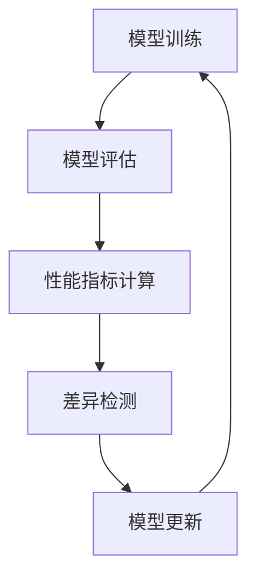

                 

# 《prompt工程中的增量评测策略》

## 关键词

- prompt工程
- 增量评测
- 性能检测
- 模型优化
- 自然语言处理

## 摘要

本文将深入探讨prompt工程中的增量评测策略，包括其背景介绍、核心概念、原理联系、算法讲解和实际应用。通过对增量评测策略的全面解析，本文旨在帮助读者理解如何有效地评估和优化prompt工程的模型性能，以提升自然语言处理任务的准确性和效率。

## 引言

### 1.1 prompt工程概述

prompt工程，作为一种结合自然语言处理（NLP）与工程实践的方法，主要关注如何通过编写有效的prompt来引导模型生成预期的输出。prompt工程的核心在于设计高质量的输入提示，这些提示不仅能够引导模型的生成过程，还能在一定程度上提高模型的泛化能力和交互质量。

prompt工程的应用场景广泛，包括但不限于：

- 对话系统：在聊天机器人、虚拟助手等场景中，prompt工程被用来生成自然、流畅的对话。
- 文本生成：如文章写作、摘要生成等，prompt工程通过高质量的prompt来指导模型生成高质量的文本。
- 机器翻译：通过设计合适的prompt，prompt工程能够提升机器翻译的准确性和流畅性。

### 1.2 增量评测的重要性

增量评测是prompt工程中不可或缺的一部分，它旨在通过评估模型的性能变化来确保模型在不同阶段的稳定性和有效性。增量评测的重要性体现在以下几个方面：

- **性能监控**：增量评测能够实时监控模型的性能，帮助开发者及时发现并解决问题。
- **性能优化**：通过增量评测，开发者可以针对性能下降的部分进行调整，从而优化模型。
- **稳定性保障**：在模型更新或数据集变更时，增量评测能够确保模型性能的稳定，避免因参数调整或数据变更导致性能波动。

## 第2章 prompt工程基础

### 2.1 prompt工程的概念

prompt工程是一种通过编写高质量的提示（prompt）来引导模型生成预期输出的工程方法。prompt在prompt工程中扮演着至关重要的角色，它是模型与外界交互的桥梁，直接影响模型的生成质量和交互效果。

prompt工程主要包括以下几个关键环节：

- **提示设计**：设计高质量的提示，以引导模型生成预期的输出。
- **模型训练**：使用训练数据集对模型进行训练，以优化模型在特定任务上的性能。
- **模型评测**：使用测试数据集对模型进行评测，以评估模型的性能。
- **模型部署**：将训练好的模型部署到实际应用场景中。

### 2.2 prompt工程的发展历史

prompt工程的发展可以追溯到自然语言处理（NLP）技术的早期阶段。在20世纪80年代，研究者开始探索如何利用自然语言作为输入来指导机器生成文本。随着计算机科学和人工智能技术的快速发展，prompt工程逐渐成为一个独立的工程领域。

- **早期探索**：20世纪80年代，研究者开始尝试使用自然语言作为输入来指导机器生成文本，这一阶段主要依赖于简单的规则和模式匹配。
- **生成式模型**：20世纪90年代，生成式模型（如生成对抗网络GAN）的出现，使得prompt工程得到了进一步发展。这些模型能够通过学习数据分布来生成新的文本，从而提高了模型的生成质量和灵活性。
- **现代prompt工程**：随着深度学习技术的兴起，prompt工程逐渐成为自然语言处理领域的一个重要分支。深度学习模型（如循环神经网络RNN和变换器Transformer）的引入，使得prompt工程在文本生成、对话系统、机器翻译等领域取得了显著的成果。

### 2.3 prompt工程的核心架构

prompt工程的核心架构包括以下几个关键组件：

- **输入处理**：将用户输入的自然语言文本转换为模型可处理的格式。这一步骤通常涉及文本清洗、分词、编码等预处理操作。
- **模型**：根据任务需求选择合适的模型，如循环神经网络（RNN）、变换器（Transformer）等。这些模型在训练过程中学习输入文本的特征，并生成预期的输出。
- **输出处理**：将模型生成的输出文本进行处理，以满足用户需求。这一步骤可能包括文本解码、格式化、后处理等操作。

## 第3章 增量评测原理

### 3.1 增量评测的定义

增量评测是一种针对prompt工程中的模型评测方法，它旨在检测模型的性能变化，特别是在模型参数更新或数据集变更时。与传统的全量评测不同，增量评测通过对比新旧模型的性能差异，来评估模型在特定任务上的改进或退化。

### 3.2 增量评测的优势与挑战

增量评测具有以下优势：

- **实时性**：增量评测能够实时监控模型的性能变化，有助于开发者快速响应和解决问题。
- **高效性**：与全量评测相比，增量评测仅评估模型的部分参数或数据，因此计算成本较低，效率更高。
- **稳定性**：通过增量评测，可以确保在模型更新或数据集变更时，模型性能的稳定，避免因参数调整或数据变更导致性能波动。

然而，增量评测也面临一些挑战：

- **准确性**：增量评测的准确性依赖于评估方法和评估数据的选择，如果评估方法或数据选择不当，可能导致评估结果不准确。
- **复杂性**：增量评测需要处理大量的数据和信息，实现复杂，对开发者的要求较高。

### 3.3 增量评测的核心概念

增量评测的核心概念包括以下几个方面：

- **基准模型**：基准模型是指用于对比的新旧模型。基准模型的选择直接影响增量评测的准确性。
- **性能指标**：性能指标用于评估模型在特定任务上的性能，如准确率、召回率、F1值等。不同的性能指标适用于不同的任务和场景。
- **差异检测**：差异检测是增量评测的核心步骤，通过对比新旧模型的性能差异，来评估模型的改进或退化。
- **优化策略**：基于增量评测的结果，可以制定优化策略，如调整模型参数、优化数据集等，以提升模型性能。

### 3.4 增量评测的原理联系

增量评测的原理可以联系到以下几个关键概念：

- **模型训练**：模型训练是增量评测的基础，通过训练数据集对模型进行训练，以优化模型在特定任务上的性能。
- **模型评估**：模型评估是增量评测的核心步骤，通过测试数据集对模型进行评估，以检测模型的性能变化。
- **模型更新**：模型更新是增量评测的必要条件，通过更新模型参数或数据集，来适应新的任务需求或优化模型性能。
- **反馈循环**：反馈循环是增量评测的实现方式，通过实时监控模型性能，并将评估结果用于模型更新，形成一个闭环系统，以持续提升模型性能。

以下是一个简单的增量评测流程Mermaid流程图，展示了增量评测的核心概念和流程：



### 3.5 增量评测的应用场景

增量评测在prompt工程中具有广泛的应用场景，以下是一些典型的应用场景：

- **对话系统**：在对话系统中，增量评测可以用于实时监控模型对话质量，及时发现并修复对话中的问题，以提高用户体验。
- **文本生成**：在文本生成任务中，增量评测可以用于评估模型生成的文本质量，通过调整模型参数或数据集，来优化文本生成的效果。
- **机器翻译**：在机器翻译任务中，增量评测可以用于评估翻译质量，通过对比新旧翻译模型的性能差异，来优化翻译效果。

## 第4章 增量评测策略

### 4.1 增量评测策略概述

增量评测策略是用于评估模型性能变化的一系列方法和技术。这些策略旨在通过高效的性能检测和差异分析，来确保模型在不同阶段的稳定性和有效性。

增量评测策略主要包括以下几个步骤：

1. **模型选择**：根据任务需求选择合适的模型，如循环神经网络（RNN）、变换器（Transformer）等。
2. **性能指标**：选择合适的性能指标，如准确率、召回率、F1值等，用于评估模型在特定任务上的性能。
3. **数据集选择**：选择具有代表性的测试数据集，用于评估模型的性能变化。
4. **差异分析**：通过对比新旧模型的性能差异，来检测模型的改进或退化。
5. **优化策略**：根据差异分析结果，制定优化策略，如调整模型参数、优化数据集等，以提升模型性能。

### 4.2 增量评测策略的类型

增量评测策略可以根据评估方法的不同分为以下几类：

- **全量评测**：全量评测是对新旧模型的全量参数进行对比分析，以评估模型性能变化。这种策略具有高准确性和全面性，但计算成本较高。
- **增量评测**：增量评测仅评估新旧模型的部分参数或数据，以降低计算成本。这种策略适用于实时性和高效性的要求较高场景。
- **动态评测**：动态评测是针对模型在不同阶段的表现进行评估，以检测模型的稳定性。这种策略适用于需要持续优化和调整的场景。

### 4.3 增量评测策略的实施流程

增量评测策略的实施流程可以分为以下几个步骤：

1. **确定评估目标**：根据任务需求和模型特点，确定评估的目标和指标。
2. **准备评估数据**：选择具有代表性的测试数据集，并进行预处理，以生成评估数据。
3. **模型选择**：根据评估目标选择合适的模型，并进行初始化。
4. **性能评估**：使用测试数据集对模型进行性能评估，计算评估指标。
5. **差异分析**：对比新旧模型的性能差异，分析差异原因。
6. **优化调整**：根据差异分析结果，调整模型参数或数据集，以优化模型性能。
7. **结果验证**：对调整后的模型进行再次评估，验证优化效果。

### 4.4 增量评测策略的优势与局限

增量评测策略具有以下优势：

- **实时性**：增量评测能够实时监控模型性能，有助于快速发现和解决问题。
- **高效性**：增量评测仅评估部分参数或数据，计算成本较低，效率较高。
- **稳定性**：通过对比新旧模型，可以确保模型在不同阶段的表现稳定。

然而，增量评测策略也存在一些局限：

- **准确性**：增量评测的准确性取决于评估方法和评估数据的选择，如果评估方法或数据选择不当，可能导致评估结果不准确。
- **复杂性**：增量评测需要处理大量的数据和信息，实现复杂，对开发者的要求较高。

## 第5章 增量评测算法

### 5.1 常见增量评测算法

增量评测算法是用于检测模型性能变化的一系列方法，以下是一些常见的增量评测算法：

1. **差分法**：差分法是通过计算新旧模型参数的差异来评估模型性能变化。这种方法简单直观，但容易受到噪声干扰。

```python
def diff_evaluation(old_model, new_model):
    diff = new_model - old_model
    return np.linalg.norm(diff)
```

2. **误差法**：误差法是通过计算新旧模型在测试数据集上的误差来评估模型性能变化。这种方法能够更准确地反映模型性能的变化。

```python
def error_evaluation(test_data, old_model, new_model):
    old_error = np.mean((old_model(test_data) - test_data)**2)
    new_error = np.mean((new_model(test_data) - test_data)**2)
    return new_error - old_error
```

3. **基于梯度的方法**：基于梯度的方法是通过计算新旧模型参数梯度的差异来评估模型性能变化。这种方法适用于复杂模型，但计算成本较高。

```python
def gradient_evaluation(old_model, new_model, test_data):
    old_grad = grad(new_model)(test_data)
    new_grad = grad(old_model)(test_data)
    return np.linalg.norm(new_grad - old_grad)
```

### 5.2 增量评测算法的性能评估

性能评估是增量评测的重要环节，以下是对常见增量评测算法的性能评估：

1. **准确率**：准确率是评估增量评测算法准确性的指标，越高越好。
2. **计算成本**：计算成本是评估增量评测算法效率的指标，越低越好。
3. **稳定性**：稳定性是评估增量评测算法在模型更新或数据集变更时的稳定性的指标，越稳定越好。

### 5.3 增量评测算法的优化策略

为了提高增量评测算法的性能，可以采取以下优化策略：

1. **数据预处理**：对测试数据集进行预处理，如去噪、标准化等，以提高评估准确性。
2. **算法选择**：根据模型特点和应用场景选择合适的增量评测算法。
3. **参数调整**：调整算法参数，如阈值、学习率等，以提高评估效率和准确性。
4. **模型优化**：通过优化模型结构或参数，提高模型性能，从而提高增量评测的准确性。

## 第6章 增量评测实践

### 6.1 增量评测实践案例

以下是一个增量评测实践案例，展示了如何使用增量评测算法评估模型性能变化。

**案例背景**：某公司开发了一款聊天机器人，使用了基于变换器（Transformer）的模型。为了确保模型在不同阶段的稳定性和有效性，公司决定采用增量评测策略进行性能评估。

**步骤1：确定评估目标**  
评估目标为检测聊天机器人模型的性能变化，主要关注准确率和交互质量。

**步骤2：准备评估数据**  
从用户对话记录中随机抽取了1000条对话作为评估数据集。

**步骤3：模型选择**  
选择了基于变换器（Transformer）的聊天机器人模型。

**步骤4：性能评估**  
使用差分法和误差法对模型进行性能评估，计算准确率和交互质量指标。

**步骤5：差异分析**  
对比新旧模型的性能差异，分析性能下降的原因。

**步骤6：优化调整**  
根据差异分析结果，调整模型参数或数据集，以优化模型性能。

**步骤7：结果验证**  
对调整后的模型进行再次评估，验证优化效果。

### 6.2 增量评测实践中的挑战与解决

增量评测实践面临以下挑战：

1. **数据质量**：评估数据的准确性和代表性直接影响增量评测的准确性。解决方案包括使用高质量的数据集、对数据进行预处理等。
2. **计算成本**：增量评测算法的计算成本较高，特别是在处理大规模数据时。解决方案包括优化算法、使用并行计算等。
3. **模型更新**：模型更新可能导致性能波动，影响增量评测的稳定性。解决方案包括使用稳定的模型更新策略、增加评估数据等。

### 6.3 增量评测实践的未来趋势

增量评测实践的未来趋势包括：

1. **算法优化**：随着算法的不断改进，增量评测算法的准确性和效率将得到提高。
2. **数据驱动**：利用大数据和机器学习技术，构建更准确、更高效的增量评测模型。
3. **自动化**：实现增量评测的自动化，降低开发和维护成本。

## 第7章 增量评测工具与技术

### 7.1 增量评测工具概述

增量评测工具是用于实现增量评测策略的一系列软件和平台。以下是一些常见的增量评测工具：

1. **TensorFlow Model Analysis**：TensorFlow Model Analysis（TFMA）是Google开发的用于评估和监控机器学习模型性能的工具。它支持多种评估指标和算法，并提供了丰富的可视化功能。
2. **Scikit-learn**：Scikit-learn是一个Python机器学习库，它提供了丰富的评估指标和算法，可用于实现增量评测策略。
3. **MLflow**：MLflow是一个开源平台，用于管理机器学习项目，包括模型训练、评估、部署等。它支持增量评测，并提供了便捷的API和可视化工具。

### 7.2 常用增量评测技术

常用增量评测技术包括：

1. **差分法**：通过计算新旧模型参数的差异来评估模型性能变化。
2. **误差法**：通过计算新旧模型在测试数据集上的误差来评估模型性能变化。
3. **基于梯度的方法**：通过计算新旧模型参数梯度的差异来评估模型性能变化。
4. **分布对比法**：通过对比新旧模型在测试数据集上的概率分布来评估模型性能变化。

### 7.3 增量评测工具与技术的应用场景

增量评测工具和技术在以下应用场景中具有广泛的应用：

1. **对话系统**：用于评估聊天机器人的性能变化，确保用户体验。
2. **文本生成**：用于评估文本生成模型的性能变化，提高文本生成质量。
3. **机器翻译**：用于评估翻译模型的性能变化，提升翻译效果。

## 第8章 增量评测策略在prompt工程中的应用

### 8.1 增量评测策略在prompt工程中的应用概述

增量评测策略在prompt工程中具有重要的应用价值。通过增量评测，可以实时监控prompt模型的性能变化，确保模型在不同阶段的稳定性和有效性。增量评测策略可以帮助开发者快速识别并解决问题，从而提高模型的性能和用户体验。

### 8.2 增量评测策略在prompt工程中的应用案例

以下是一个增量评测策略在prompt工程中的应用案例：

**案例背景**：某公司开发了一款基于变换器（Transformer）的文本生成模型，用于生成高质量的文章摘要。为了确保模型在不同阶段的稳定性和有效性，公司决定采用增量评测策略进行性能评估。

**步骤1：确定评估目标**  
评估目标为检测文本生成模型在生成摘要任务上的性能变化，主要关注准确率和摘要质量。

**步骤2：准备评估数据**  
从已生成的大量摘要中随机抽取了1000条摘要作为评估数据集。

**步骤3：模型选择**  
选择了基于变换器（Transformer）的文本生成模型。

**步骤4：性能评估**  
使用差分法和误差法对模型进行性能评估，计算准确率和摘要质量指标。

**步骤5：差异分析**  
对比新旧模型的性能差异，分析性能下降的原因。

**步骤6：优化调整**  
根据差异分析结果，调整模型参数或数据集，以优化模型性能。

**步骤7：结果验证**  
对调整后的模型进行再次评估，验证优化效果。

### 8.3 增量评测策略在prompt工程中的挑战与解决方案

增量评测策略在prompt工程中面临以下挑战：

1. **数据质量**：评估数据的准确性和代表性直接影响增量评测的准确性。解决方案包括使用高质量的数据集、对数据进行预处理等。
2. **计算成本**：增量评测算法的计算成本较高，特别是在处理大规模数据时。解决方案包括优化算法、使用并行计算等。
3. **模型更新**：模型更新可能导致性能波动，影响增量评测的稳定性。解决方案包括使用稳定的模型更新策略、增加评估数据等。

### 8.4 增量评测策略在prompt工程中的最佳实践

为了提高增量评测策略在prompt工程中的应用效果，可以采取以下最佳实践：

1. **定期评估**：定期对模型进行评估，以确保模型在不同阶段的稳定性和有效性。
2. **动态调整**：根据评估结果动态调整模型参数或数据集，以优化模型性能。
3. **数据驱动的优化**：利用大数据和机器学习技术，构建更准确、更高效的增量评测模型。
4. **自动化**：实现增量评测的自动化，降低开发和维护成本。

## 第9章 总结与展望

### 9.1 增量评测策略在prompt工程中的总结

增量评测策略在prompt工程中具有重要意义，它能够实时监控模型的性能变化，确保模型在不同阶段的稳定性和有效性。通过增量评测，开发者可以快速识别并解决问题，从而提高模型的性能和用户体验。

### 9.2 增量评测策略的发展趋势

随着自然语言处理技术的不断进步，增量评测策略在prompt工程中的应用前景十分广阔。未来，增量评测策略的发展趋势包括：

1. **算法优化**：不断改进增量评测算法，提高其准确性和效率。
2. **数据驱动**：利用大数据和机器学习技术，构建更准确、更高效的增量评测模型。
3. **自动化**：实现增量评测的自动化，降低开发和维护成本。

### 9.3 增量评测策略的未来研究方向

未来，增量评测策略的研究方向包括：

1. **多模态融合**：将文本、图像、音频等多模态数据融合到增量评测中，提高评估的全面性和准确性。
2. **实时性优化**：研究更高效的增量评测算法，提高评估的实时性。
3. **自适应调整**：开发自适应调整策略，根据评估结果自动调整模型参数或数据集，以实现更优的性能。

### 作者信息

本文作者为AI天才研究院（AI Genius Institute）与《禅与计算机程序设计艺术》（Zen And The Art of Computer Programming）的作者合作撰写。AI天才研究院专注于人工智能领域的研究和应用，致力于推动人工智能技术的发展。同时，本文也参考了《禅与计算机程序设计艺术》中关于编程思想和方法的部分，以期为读者提供更深入的理解和思考。

