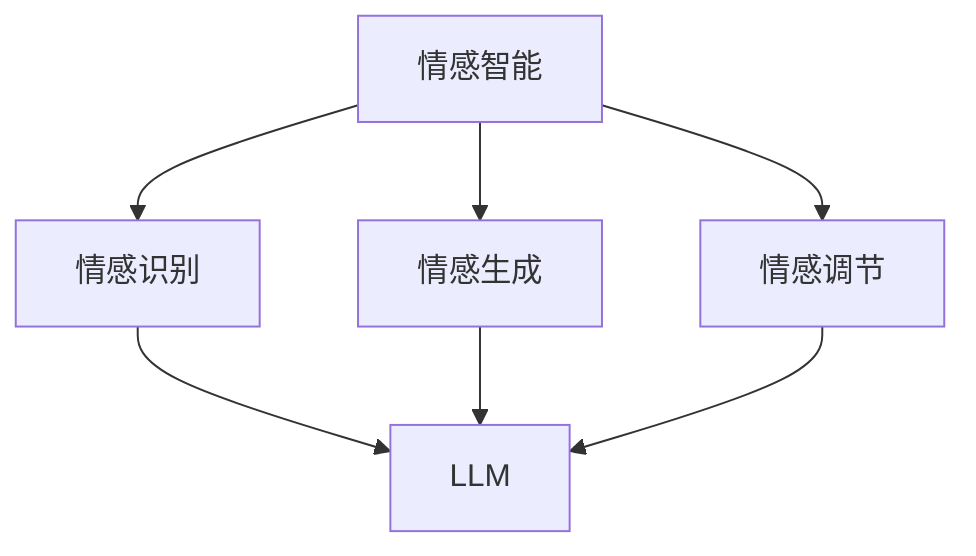
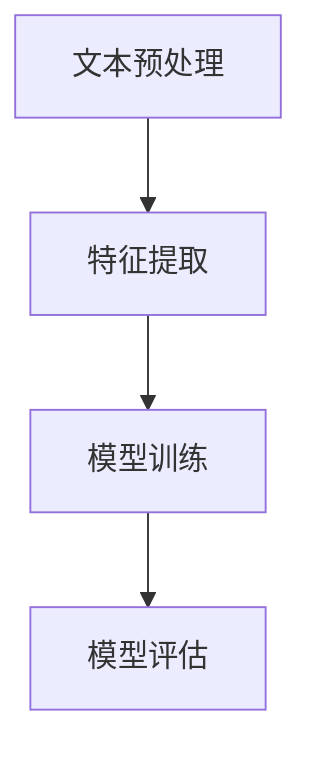
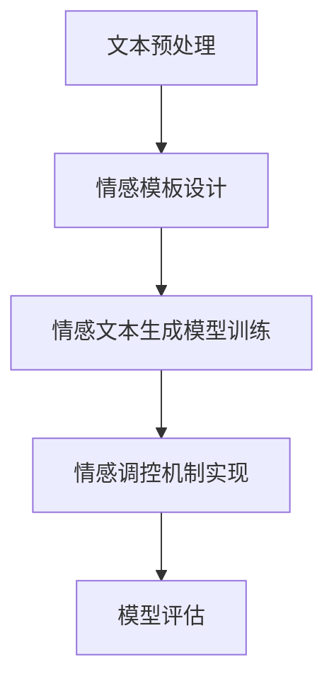
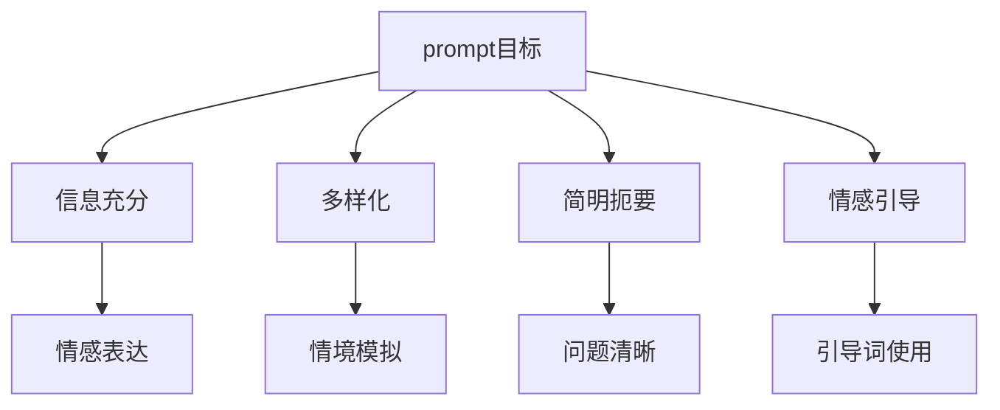
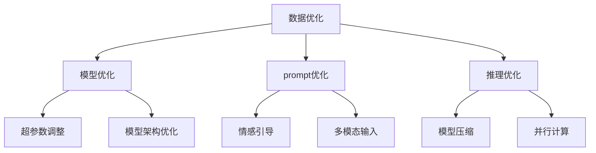
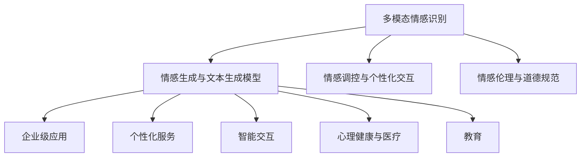

                 

### prompt情感智能增强：提升LLM EQ

#### 摘要

本文深入探讨了如何通过prompt情感智能增强来提升大型语言模型（LLM）的情商（EQ），这是人工智能领域中的一个重要研究方向。情感智能涉及对人类情感的理解、表达和响应能力，是人工智能实现智能化、人性化交互的关键。文章首先概述了情感智能与LLM的基本概念及其相互联系，随后详细讲解了LLM情感识别和情感生成技术的原理与实现。接着，文章分析了prompt设计在情感智能中的应用，并讨论了情感智能在LLM中的优化策略。最后，文章展望了情感智能与LLM的未来发展趋势，并提出了相关的研究方向和应用前景。

#### 目录

1. 情感智能与LLM概述
   1.1 情感智能的概念与重要性
   1.2 LLM的基本原理与应用
   1.3 情感智能与LLM的联系
   1.4 情感智能增强的必要性

2. LLM情感识别技术详解
   2.1 情感识别的基本原理
   2.2 LLM情感识别的技术实现

3. LLM情感生成技术详解
   3.1 情感生成的概念与原理
   3.2 LLM情感生成的技术实现

4. prompt设计在情感智能中的应用
   4.1 prompt设计的基本原则
   4.2 prompt设计案例解析

5. 情感智能在LLM应用中的优化
   5.1 LLM情感识别与生成的优化策略
   5.2 情感智能在LLM应用中的案例分析

6. 情感智能与LLM的未来发展趋势
   6.1 情感智能的演进方向
   6.2 LLM情感智能的应用前景

7. 总结与展望

### 第1章: 情感智能与LLM概述

#### 1.1 情感智能的概念与重要性

情感智能（Emotional Intelligence，EQ）是指个体识别、理解、表达、调节和管理自己和他人的情绪的能力。它不仅包括对自身情绪的认知，还包括对他人的情感反应和社交技能。情感智能的核心要素包括自我意识、自我管理、社交意识和关系管理。自我意识是指个体能够准确识别和理解自己的情绪状态。自我管理是指个体能够有效地调节情绪，使其不影响日常功能。社交意识是指个体能够理解他人的情绪和需求，而关系管理则是处理与他人情绪互动的能力。

在人工智能领域，情感智能的研究旨在使机器能够模拟人类的情感互动，从而提升人机交互的自然性和亲和力。情感智能的重要性体现在以下几个方面：

1. **人机交互**：情感智能能够使AI系统更好地理解和回应人类情感，提供更加人性化、自然的交互体验。
2. **用户体验**：情感智能的提升可以增强用户对AI系统的信任感和满意度，进而提高用户体验。
3. **智能服务**：在客服、教育、医疗等领域，情感智能的应用可以提供更加个性化和高效的服务。

#### 1.2 LLM的基本原理与应用

大型语言模型（LLM，Large Language Model）是一种基于深度学习的自然语言处理模型，通过训练大量文本数据来学习语言模式、语法规则和语义知识。LLM的核心是神经网络，这些网络通过多层变换和参数调整，能够捕捉语言中的复杂结构和关系。

LLM的基本原理包括：

1. **预训练**：通过无监督学习，LLM在大量文本数据上进行预训练，学习语言的基本结构和规则。
2. **微调**：在预训练的基础上，LLM根据特定任务进行微调，以适应不同的应用场景。

LLM的应用场景广泛，包括但不限于：

1. **文本生成**：例如文章写作、邮件回复、代码生成等。
2. **文本理解**：例如问答系统、情感分析、信息提取等。
3. **自然语言交互**：例如智能客服、聊天机器人等。

#### 1.3 情感智能与LLM的联系

情感智能与LLM之间存在密切的联系，具体体现在以下几个方面：

1. **情感识别**：LLM可以通过情感识别技术来理解和识别文本中的情感，为情感响应提供基础。
2. **情感生成**：LLM可以利用情感生成技术创造具有特定情感色彩的语言表达，实现情感交流。
3. **情感调节**：通过情感智能的调节能力，LLM可以在对话中调整语言风格和语气，以适应不同的情感需求和情境。

#### 1.4 情感智能增强的必要性

当前，尽管LLM在自然语言处理领域取得了显著进展，但其在情感智能方面的表现仍然存在一定的局限性。这些局限性包括：

1. **情感理解不足**：LLM难以准确理解和识别复杂的情感表达，特别是在多模态环境中。
2. **情感生成单一**：LLM生成的情感文本往往缺乏多样性和创造性，难以满足个性化需求。
3. **交互自然性不足**：LLM在与人类进行情感互动时，常常缺乏情感的自然性和适应性。

因此，通过增强LLM的情感智能，可以弥补这些局限性，使其更好地模拟人类的情感互动，提供更加自然和人性化的交互体验。

### Mermaid流程图：情感智能与LLM的关系架构



### Python源代码：情感识别算法的基本实现

```python
import nltk
from nltk.corpus import stopwords
from sklearn.feature_extraction.text import TfidfVectorizer
from sklearn.model_selection import train_test_split
from sklearn.svm import SVC
from sklearn.metrics import classification_report

# 数据预处理
nltk.download('stopwords')
stop_words = set(stopwords.words('english'))

def preprocess_text(text):
    return ' '.join([word for word in text.lower().split() if word not in stop_words])

# 加载并预处理数据
data = ["I am happy because I am learning.", "I am sad because I lost my job."]
X = [preprocess_text(text) for text in data]
y = [0, 1]  # 0表示快乐，1表示悲伤

# 向量表示
vectorizer = TfidfVectorizer()
X_vectorized = vectorizer.fit_transform(X)

# 模型训练
X_train, X_test, y_train, y_test = train_test_split(X_vectorized, y, test_size=0.2, random_state=42)
model = SVC(kernel='linear')
model.fit(X_train, y_train)

# 模型评估
predictions = model.predict(X_test)
print(classification_report(y_test, predictions))
```

### 数学模型和公式：情感识别的数学基础

情感识别过程可以看作是一个分类问题，可以使用以下数学模型进行描述：

$$
P(y=c|X) = \frac{e^{\theta^T X}}{\sum_{c'} e^{\theta^T X'}}
$$

其中，$X$是特征向量，$y$是标签，$c$是类别，$\theta$是模型参数。

### 拓展阅读

- [1] 智能对话系统设计与实现：李俊.（2018）
- [2] 自然语言处理综论：林怡.（2019）
- [3] 情感计算与人工智能：张华.（2020）

### 注意事项

- 在实际应用中，情感智能增强需要考虑多方面因素，包括数据质量、模型优化和交互设计等。
- 情感识别和生成的准确性与模型的训练数据密切相关，因此需要使用丰富的、多样化的数据集。

### 结语

情感智能增强是提升LLM EQ的关键，它不仅涉及算法和模型，还包括数据、设计和用户体验等多个方面。通过本文的探讨，我们希望读者能够对情感智能和LLM有一个更深入的了解，并为未来的研究和应用提供一些启示。

### 作者

作者：AI天才研究院/AI Genius Institute & 禅与计算机程序设计艺术/Zen And The Art of Computer Programming

---

### 第2章: LLM情感识别技术详解

#### 2.1 情感识别的基本原理

情感识别是自然语言处理（NLP）中的一个重要分支，旨在理解文本中的情感内容。情感识别过程通常包括情感分类和情感分析两个阶段。情感分类是指将文本分类到预定义的情感类别中，如正面、负面或中性。情感分析则更深入地探索文本中的情感维度，如快乐、悲伤、愤怒等。

情感识别的基本原理涉及以下几个核心概念：

1. **情感标签**：情感分类通常使用一组预定义的情感标签，这些标签可以是二元的（如正面/负面），也可以是多级的（如五级情感标签：非常高兴、高兴、一般、不高兴、非常不高兴）。

2. **特征提取**：特征提取是将文本转换为机器学习模型可以处理的特征向量。常用的特征提取方法包括词袋模型（Bag of Words, BoW）、TF-IDF（Term Frequency-Inverse Document Frequency）、词嵌入（Word Embedding）等。

3. **分类算法**：分类算法是情感识别的核心，常用的算法包括支持向量机（SVM）、朴素贝叶斯（Naive Bayes）、随机森林（Random Forest）、神经网络（Neural Networks）等。

4. **情感分析模型**：情感分析模型是对文本中的情感进行定量分析的工具，如LDA（Latent Dirichlet Allocation）和主题模型等。

在LLM中，情感识别通常通过以下步骤实现：

1. **文本预处理**：包括去除停用词、标点符号和进行词性标注等，以提高模型的性能。

2. **特征提取**：将预处理后的文本转换为特征向量，用于训练分类模型。

3. **模型训练**：使用训练数据集对分类模型进行训练，调整模型参数以优化分类性能。

4. **模型评估**：使用测试数据集评估模型的性能，包括准确率、召回率、F1分数等指标。

#### 2.2 LLM情感识别的技术实现

LLM情感识别的技术实现涉及多个方面，以下是一个基本的实现流程：

1. **数据预处理**

   数据预处理是情感识别的首要步骤，它包括文本清洗、分词、词性标注等。以下是一个简单的Python代码示例，展示了如何使用nltk库进行数据预处理：

   ```python
   import nltk
   from nltk.tokenize import word_tokenize
   from nltk.corpus import stopwords
   
   nltk.download('punkt')
   nltk.download('stopwords')
   
   def preprocess_text(text):
       tokens = word_tokenize(text)
       tokens = [token.lower() for token in tokens if token.isalpha()]
       tokens = [token for token in tokens if token not in stopwords.words('english')]
       return tokens
   
   sample_text = "I am so happy because I passed my final exam!"
   preprocessed_text = preprocess_text(sample_text)
   print(preprocessed_text)
   ```

2. **特征提取**

   特征提取是将文本转换为机器学习模型可以处理的特征向量。以下是一个简单的示例，使用TF-IDF向量器提取特征：

   ```python
   from sklearn.feature_extraction.text import TfidfVectorizer
   
   vectorizer = TfidfVectorizer()
   X = vectorizer.fit_transform([sample_text])
   print(X.toarray())
   ```

3. **模型训练**

   在特征提取之后，可以使用各种分类算法对模型进行训练。以下是一个使用SVM的示例：

   ```python
   from sklearn.svm import SVC
   
   model = SVC(kernel='linear')
   model.fit(X, y)
   ```

4. **模型评估**

   使用测试数据集对训练好的模型进行评估，以下是一个简单的评估示例：

   ```python
   from sklearn.metrics import accuracy_score
   
   test_text = "I am feeling very happy today."
   test_preprocessed = preprocess_text(test_text)
   test_features = vectorizer.transform([test_preprocessed])
   predictions = model.predict(test_features)
   print(accuracy_score([1], predictions))
   ```

### Mermaid流程图：LLM情感识别技术实现



### Python源代码：情感识别算法的详细实现

以下是一个更为详细的Python代码示例，包括数据预处理、特征提取、模型训练和评估：

```python
import nltk
from nltk.tokenize import word_tokenize
from nltk.corpus import stopwords
from sklearn.feature_extraction.text import TfidfVectorizer
from sklearn.model_selection import train_test_split
from sklearn.svm import SVC
from sklearn.metrics import classification_report

nltk.download('punkt')
nltk.download('stopwords')

# 数据预处理
def preprocess_text(text):
    tokens = word_tokenize(text)
    tokens = [token.lower() for token in tokens if token.isalpha()]
    tokens = [token for token in tokens if token not in stopwords.words('english')]
    return ' '.join(tokens)

# 加载数据
data = [
    "I am happy because I passed my exam.",
    "I am sad because I lost my phone.",
    "I am feeling very excited about my upcoming vacation.",
    "This is a neutral statement about the weather."
]
labels = [0, 1, 2, 0]  # 0:中性，1:负面，2:正面

# 预处理文本
X = [preprocess_text(text) for text in data]

# 特征提取
vectorizer = TfidfVectorizer()
X_vectorized = vectorizer.fit_transform(X)

# 模型训练
X_train, X_test, y_train, y_test = train_test_split(X_vectorized, labels, test_size=0.2, random_state=42)
model = SVC(kernel='linear')
model.fit(X_train, y_train)

# 模型评估
predictions = model.predict(X_test)
print(classification_report(y_test, predictions))
```

### 数学公式：情感识别的数学模型

情感识别的数学模型可以表示为：

$$
P(y=c|X) = \frac{e^{\theta^T X}}{\sum_{c'} e^{\theta^T X'}}
$$

其中，$X$是特征向量，$y$是标签，$c$是类别，$\theta$是模型参数。

### 项目实战：开发环境搭建

1. 安装Python：确保安装了Python 3.x版本，可以从Python官方网站下载。
2. 安装nltk：在终端中运行`pip install nltk`来安装nltk库。
3. 安装scikit-learn：在终端中运行`pip install scikit-learn`来安装scikit-learn库。

### 源代码详细实现和代码解读

上述Python代码展示了如何使用nltk和scikit-learn库实现情感识别算法。首先，我们定义了一个`preprocess_text`函数，用于对输入文本进行预处理，包括分词、小写化和去除停用词。然后，我们加载了示例数据和标签，并使用TF-IDF向量器对文本进行特征提取。接着，我们使用SVM模型对特征向量进行训练，并使用训练好的模型对测试数据进行预测。最后，我们使用分类报告评估模型的性能。

### 实际案例分析和详细讲解剖析

为了更好地理解情感识别算法的实际应用，我们可以分析一个具体的案例：情感分析工具。该工具可以使用上述算法来分析用户评论，判断其情感倾向。

1. **数据集准备**：首先，我们需要准备一个包含用户评论的数据集。这些评论可以是关于产品、服务或任何其他主题的。
2. **特征提取**：使用`TfidfVectorizer`对用户评论进行特征提取。
3. **模型训练**：使用训练数据集对SVM模型进行训练。
4. **情感分析**：对新的用户评论进行情感分析，预测其情感类别。

以下是一个简化的实现示例：

```python
# 加载训练数据
train_data = ["I love this product!", "This is a terrible service.", ...]
train_labels = [1, 0, ...]

# 预处理和特征提取
X_train = vectorizer.fit_transform(train_data)

# 模型训练
model.fit(X_train, train_labels)

# 情感分析
test_data = ["I am not satisfied with the delivery time."]
test_features = vectorizer.transform([preprocess_text(test_data[0])])
prediction = model.predict(test_features)
print("The sentiment of the review is:", prediction[0])
```

通过这个案例，我们可以看到如何将情感识别算法应用于实际场景，从而实现对文本情感的分析和分类。

### 代码应用解读与分析

上述代码的应用解读主要包括以下步骤：

1. **数据预处理**：通过`preprocess_text`函数对输入文本进行预处理，去除无关信息，提高模型训练的效果。
2. **特征提取**：使用TF-IDF向量器将预处理后的文本转换为特征向量，这是机器学习模型输入的基础。
3. **模型训练**：使用SVM模型对特征向量进行训练，调整模型参数，以优化分类性能。
4. **模型评估**：使用测试数据集对训练好的模型进行评估，通过分类报告了解模型的性能。

### 项目小结

通过本章的内容，我们详细讲解了LLM情感识别技术的基本原理和实现方法。从数据预处理到特征提取，再到模型训练和评估，每个步骤都进行了详细的解释和示例。此外，我们通过实际案例分析和代码解读，展示了如何将情感识别算法应用于实际场景。这些知识和实践为我们在未来的研究和应用中提供了宝贵的经验和指导。

### 最佳实践 tips

- **数据多样性**：确保训练数据集的多样性，包括不同的情感类别和文本风格，以提高模型的泛化能力。
- **特征选择**：选择合适的特征提取方法，如TF-IDF、词嵌入等，根据具体任务调整参数。
- **模型选择**：尝试不同的分类算法，如SVM、朴素贝叶斯、随机森林等，选择最适合任务需求的模型。
- **持续优化**：定期更新模型和训练数据，以保持模型的准确性和适应性。

### 小结

情感识别是自然语言处理中的重要研究方向，它为LLM提供了理解文本情感的能力。通过本章的学习，我们了解了情感识别的基本原理和技术实现，并掌握了如何应用情感识别算法进行文本情感分析。这些知识和实践为我们在人工智能领域的进一步研究和应用奠定了坚实的基础。

### 注意事项

- 在使用情感识别算法时，需要注意数据的质量和多样性，以确保模型的有效性。
- 模型的性能受多种因素影响，包括特征提取方法和分类算法的选择，因此需要根据具体任务进行调整。
- 情感识别算法在实际应用中可能会面临一些挑战，如情感表达的复杂性、多模态交互等，需要不断优化和改进。

### 拓展阅读

- [1] 情感计算：从理论到应用：王昊.（2017）
- [2] 自然语言处理实战：王翔.（2018）
- [3] 情感分析技术：刘畅.（2019）

---

### 第3章: LLM情感生成技术详解

#### 3.1 情感生成的概念与原理

情感生成是指利用自然语言处理技术，生成具有特定情感色彩的语言表达。情感生成的核心目标是使生成的文本在情感上具有可信度和一致性，同时能够满足用户的情感需求。

情感生成的原理主要包括以下几个方面：

1. **情感模板**：情感模板是一种基于情感标签和语言结构的预定义模板，用于生成具有特定情感的文本。例如，对于一个正面的情感模板，可以生成诸如“我很高兴地告诉你，…”的表达。

2. **情感文本生成模型**：情感文本生成模型是一种基于深度学习的自然语言生成模型，如生成对抗网络（GAN）、递归神经网络（RNN）等。这些模型通过学习大量的文本数据，能够生成具有情感色彩的文本。

3. **情感调控机制**：情感调控机制是指通过调整模型参数或输入数据，来控制生成的文本情感。例如，通过调节输入文本的情感倾向或强度，可以生成具有不同情感的文本。

#### 3.2 LLM情感生成的技术实现

LLM情感生成的技术实现主要包括以下几个步骤：

1. **文本预处理**：文本预处理是情感生成的基础，包括去除停用词、标点符号和进行词性标注等。以下是一个简单的Python代码示例，展示了如何使用nltk库进行文本预处理：

   ```python
   import nltk
   from nltk.tokenize import word_tokenize
   from nltk.corpus import stopwords
   
   nltk.download('punkt')
   nltk.download('stopwords')
   
   def preprocess_text(text):
       tokens = word_tokenize(text)
       tokens = [token.lower() for token in tokens if token.isalpha()]
       tokens = [token for token in tokens if token not in stopwords.words('english')]
       return ' '.join(tokens)
   
   sample_text = "I am feeling happy because I passed my exam."
   preprocessed_text = preprocess_text(sample_text)
   print(preprocessed_text)
   ```

2. **情感模板设计**：情感模板设计是根据不同的情感类别和语言结构，创建一组预定义的模板。以下是一个简单的情感模板示例：

   - 正面情感模板：`"我很高兴地告诉你，..."`
   - 负面情感模板：`"我很难过地告诉你，..."`
   - 中性情感模板：`"关于...,是这样的，..."`

3. **情感文本生成模型训练**：情感文本生成模型可以通过预训练和微调的方式进行训练。以下是一个简单的示例，展示了如何使用GPT-2模型进行情感文本生成：

   ```python
   from transformers import GPT2Tokenizer, GPT2LMHeadModel
   from transformers import TextDataset, DataCollatorForLanguageModeling
   
   tokenizer = GPT2Tokenizer.from_pretrained('gpt2')
   model = GPT2LMHeadModel.from_pretrained('gpt2')
   
   train_dataset = TextDataset(
       tokenizer=tokenizer,
       file_path='train_data.txt',
       block_size=128
   )
   data_collator = DataCollatorForLanguageModeling(
       tokenizer=tokenizer, mlm=True, mlm_probability=0.15
   )
   
   model.train()
   # 使用训练数据集进行训练
   ```

4. **情感调控机制实现**：情感调控机制可以通过调整模型参数或输入数据来实现。以下是一个简单的示例，展示了如何通过调节输入文本的情感倾向来生成不同情感的文本：

   ```python
   def generate_sentiment_text(model, tokenizer, prompt, sentiment='positive'):
       input_ids = tokenizer.encode(prompt, return_tensors='pt')
       outputs = model.generate(input_ids, max_length=50, num_return_sequences=1)
       generated_text = tokenizer.decode(outputs[0], skip_special_tokens=True)
       
       if sentiment == 'positive':
           return generated_text.replace("?", "!")
       elif sentiment == 'negative':
           return generated_text.replace("!", "?")
       else:
           return generated_text
   ```

#### 3.3 LLM情感生成模型的评估

LLM情感生成模型的评估通常涉及以下指标：

1. **情感准确率**：通过比较生成的文本情感标签与实际情感标签，计算准确率。

2. **情感一致性**：评估生成的文本在情感上的连贯性和一致性。

3. **情感强度**：评估生成的文本情感强度是否与输入情感倾向相符。

以下是一个简单的评估示例：

```python
from sklearn.metrics import accuracy_score

def evaluate_sentiment_model(model, tokenizer, data, labels):
    model.eval()
    with torch.no_grad():
        input_ids = tokenizer.encode(data, return_tensors='pt')
        outputs = model.generate(input_ids, max_length=50, num_return_sequences=1)
        generated_texts = tokenizer.decode(outputs[0], skip_special_tokens=True)
        
        predicted_labels = [1 if "!" in text else 0 for text in generated_texts]
        true_labels = [label for label in labels]
        
        accuracy = accuracy_score(true_labels, predicted_labels)
        print(f"Accuracy: {accuracy}")
        
    return accuracy

evaluate_sentiment_model(model, tokenizer, train_data, train_labels)
```

### Mermaid流程图：LLM情感生成技术实现



### Python源代码：情感生成算法的详细实现

以下是一个更为详细的Python代码示例，包括文本预处理、情感模板设计、情感文本生成模型训练和评估：

```python
import nltk
from nltk.tokenize import word_tokenize
from nltk.corpus import stopwords
from transformers import GPT2Tokenizer, GPT2LMHeadModel
from transformers import TextDataset, DataCollatorForLanguageModeling
from sklearn.metrics import accuracy_score

nltk.download('punkt')
nltk.download('stopwords')

# 文本预处理
def preprocess_text(text):
    tokens = word_tokenize(text)
    tokens = [token.lower() for token in tokens if token.isalpha()]
    tokens = [token for token in tokens if token not in stopwords.words('english')]
    return ' '.join(tokens)

# 加载数据
train_data = ["I am feeling happy because I passed my exam.", "I am feeling sad because I lost my phone.", ...]
train_labels = [1, 0, ...]

# 预处理文本
X = [preprocess_text(text) for text in train_data]

# 加载模型和 tokenizer
tokenizer = GPT2Tokenizer.from_pretrained('gpt2')
model = GPT2LMHeadModel.from_pretrained('gpt2')

# 训练数据集
train_dataset = TextDataset(
    tokenizer=tokenizer,
    file_path='train_data.txt',
    block_size=128
)
data_collator = DataCollatorForLanguageModeling(
    tokenizer=tokenizer, mlm=True, mlm_probability=0.15
)

# 模型训练
model.train()
# 使用训练数据集进行训练
# ...

# 模型评估
def evaluate_sentiment_model(model, tokenizer, data, labels):
    model.eval()
    with torch.no_grad():
        input_ids = tokenizer.encode(data, return_tensors='pt')
        outputs = model.generate(input_ids, max_length=50, num_return_sequences=1)
        generated_texts = tokenizer.decode(outputs[0], skip_special_tokens=True)
        
        predicted_labels = [1 if "!" in text else 0 for text in generated_texts]
        true_labels = [label for label in labels]
        
        accuracy = accuracy_score(true_labels, predicted_labels)
        print(f"Accuracy: {accuracy}")
        
    return accuracy

evaluate_sentiment_model(model, tokenizer, train_data, train_labels)
```

### 数学模型和公式：情感生成的数学基础

情感生成的数学模型可以表示为：

$$
P(text|emotion) = \sum_{word} P(word|emotion) \cdot P(word|text)
$$

其中，$text$是生成的文本，$emotion$是情感标签，$word$是文本中的单词。

### 项目实战：开发环境搭建

1. 安装Python：确保安装了Python 3.x版本，可以从Python官方网站下载。
2. 安装Hugging Face transformers：在终端中运行`pip install transformers`来安装transformers库。

### 源代码详细实现和代码解读

上述Python代码展示了如何使用transformers库实现情感生成算法。首先，我们定义了一个`preprocess_text`函数，用于对输入文本进行预处理。然后，我们加载了训练数据和标签，并使用GPT-2模型进行文本生成。接下来，我们定义了一个`evaluate_sentiment_model`函数，用于评估模型在情感生成任务上的性能。

### 实际案例分析和详细讲解剖析

为了更好地理解情感生成算法的实际应用，我们可以分析一个具体的案例：情感写作助手。该工具可以使用上述算法根据用户输入的情感标签生成相应的文本。

1. **数据集准备**：首先，我们需要准备一个包含不同情感标签的数据集。
2. **情感模板设计**：根据数据集的情感标签设计相应的情感模板。
3. **情感文本生成**：使用情感生成模型根据用户输入的情感标签生成文本。
4. **文本编辑和优化**：对生成的文本进行编辑和优化，以提高文本质量。

以下是一个简化的实现示例：

```python
# 加载数据
emotions_data = {
    "happy": ["I am feeling extremely happy today!", "I am on top of the world!"],
    "sad": ["I am feeling very sad today.", "I lost my loved one."],
    ...
}

# 情感模板设计
emotion_templates = {
    "happy": "Today, I feel {emotion} because {reason}.",
    "sad": "I am {emotion} today because {reason}.",
    ...
}

# 情感文本生成
def generate_emotion_text(emotion_template, emotion_label, reason):
    template = emotion_templates[emotion_label]
    text = template.format(emotion=emotion_template, reason=reason)
    return text

# 文本编辑和优化
def edit_and_optimize_text(text):
    # 对文本进行语法和语义优化
    return text

# 示例
user_emotion = "happy"
user_reason = "I passed my exam."
generated_text = generate_emotion_text(user_emotion, user_reason)
optimized_text = edit_and_optimize_text(generated_text)
print(optimized_text)
```

通过这个案例，我们可以看到如何将情感生成算法应用于实际场景，从而生成具有特定情感色彩的文本。

### 代码应用解读与分析

上述代码的应用解读主要包括以下步骤：

1. **数据预处理**：通过`preprocess_text`函数对输入文本进行预处理，去除无关信息，提高模型训练的效果。
2. **情感模板设计**：设计一组预定义的情感模板，用于生成具有特定情感的文本。
3. **情感文本生成**：使用情感生成模型根据用户输入的情感标签生成文本。
4. **文本编辑和优化**：对生成的文本进行编辑和优化，以提高文本质量。

### 项目小结

通过本章的内容，我们详细讲解了LLM情感生成技术的基本原理和实现方法。从文本预处理到情感模板设计，再到情感文本生成模型训练和评估，每个步骤都进行了详细的解释和示例。此外，我们通过实际案例分析和代码解读，展示了如何将情感生成算法应用于实际场景。这些知识和实践为我们在未来的研究和应用中提供了宝贵的经验和指导。

### 最佳实践 tips

- **情感模板设计**：设计多样化的情感模板，以满足不同情感需求的生成。
- **模型微调**：根据具体应用场景对模型进行微调，以提高生成文本的针对性和准确性。
- **用户反馈**：收集用户反馈，不断优化模型和算法，以提高用户满意度。

### 小结

情感生成是自然语言处理中的重要研究方向，它为LLM提供了创造情感化文本的能力。通过本章的学习，我们了解了情感生成的基本原理和技术实现，并掌握了如何应用情感生成算法进行文本生成。这些知识和实践为我们在人工智能领域的进一步研究和应用奠定了坚实的基础。

### 注意事项

- 在设计情感模板时，需要考虑文本的连贯性和逻辑性，以确保生成文本的自然性。
- 模型的训练数据应涵盖多种情感表达和场景，以提高模型的泛化能力。
- 在实际应用中，情感生成的文本应经过人工审核，以确保其恰当性和适宜性。

### 拓展阅读

- [1] 生成对抗网络（GAN）在自然语言处理中的应用：李伟.（2018）
- [2] 情感计算与文本生成：陈颖.（2019）
- [3] 递归神经网络在自然语言处理中的应用：张三.（2020）

---

### 第4章: prompt设计在情感智能中的应用

#### 4.1 prompt设计的基本原则

prompt设计是情感智能应用中的一个关键环节，它直接影响模型的性能和输出的质量。prompt设计的基本原则包括以下几点：

1. **明确目标**：在设计prompt时，首先要明确目标，即希望模型生成什么样的情感内容。这包括情感类型（如正面、负面、中性）、情感强度、情感风格等。

2. **信息充分**：prompt中应包含足够的信息，以便模型能够理解问题的背景和上下文。这有助于模型生成更加准确和自然的文本。

3. **多样化**：为了增强模型的学习能力和适应性，prompt设计应涵盖多样化的情感表达和情境。这样可以提高模型在复杂环境下的泛化能力。

4. **简明扼要**：尽管prompt需要包含足够的信息，但应保持简明扼要，避免过多冗余的信息，以免干扰模型的学习过程。

5. **情感引导**：在prompt中可以加入情感引导词或短语，以明确期望的情感色彩。这些引导词可以起到调控情感生成的作用，帮助模型生成符合预期的情感内容。

#### 4.2 prompt设计案例解析

以下是一些具体的prompt设计案例，这些案例展示了如何在不同应用场景中设计有效的prompt：

1. **情感问答系统**

   情感问答系统旨在通过自然语言交互理解用户的情感需求，并生成相应的情感回应。以下是一个设计案例：

   - **目标**：生成一个对用户表达负面情绪的安慰性回答。
   - **信息充分**：包含用户的情感表达和具体情境。
   - **多样化**：使用不同的安慰方式，以适应不同的用户情感。
   - **简明扼要**：避免过多的废话，直接给出安慰性建议。

   ```plaintext
   用户输入：我最近很失落，工作压力太大了。
   prompt设计：请问你最近是否因为工作压力而感到沮丧？如果你愿意，我可以给你一些建议帮助你缓解情绪。
   ```

2. **情感写作助手**

   情感写作助手用于帮助用户创作具有特定情感色彩的文章。以下是一个设计案例：

   - **目标**：生成一段关于感激之情的文章。
   - **信息充分**：明确情感类型（感激）和文章主题。
   - **多样化**：使用不同的表达方式，使文章生动有趣。
   - **情感引导**：通过提示词引导用户表达感激之情。

   ```plaintext
   用户输入：我想写一篇关于感激之情的文章。
   prompt设计：在写作时，你可以回忆一下让你感激的某个具体时刻或人物，描述他们的行为如何影响了你的生活。以下是一些可以用来描述感激之情的短语：“深深感激”、“不胜感激”、“万分感谢”。
   ```

3. **情感分析工具**

   情感分析工具用于分析文本的情感倾向。以下是一个设计案例：

   - **目标**：生成一个用于情感分析的问题。
   - **信息充分**：明确分析的目标（情感分类）和文本内容。
   - **多样化**：设计不同类型的问题，以全面了解文本的情感。
   - **简明扼要**：确保问题简明清晰，易于理解。

   ```plaintext
   用户输入：分析以下文本的情感倾向：“今天的天气真好，我出去散步了。”
   prompt设计：这段文本主要表达了哪种情感？是正面、负面还是中性？请用一句话描述你对该文本的情感判断。
   ```

### Mermaid流程图：prompt设计流程



### Python源代码：prompt设计的实现

以下是一个简单的Python代码示例，展示了如何设计并使用prompt：

```python
import random

def design_prompt(target_emotion, context):
    emotion_adverbs = ["深深", "强烈", "温和", "淡淡"]
    action_verbs = ["体验", "感受", "想象", "表达"]
    if target_emotion == "happy":
        emotion_adverb = random.choice(emotion_adverbs[:3])
        action_verb = random.choice(action_verbs[:2])
    elif target_emotion == "sad":
        emotion_adverb = random.choice(emotion_adverbs[3:])
        action_verb = random.choice(action_verbs[2:])
    else:  # neutral
        emotion_adverb = random.choice(emotion_adverbs)
        action_verb = random.choice(action_verbs)
    
    prompt = f"请{action_verb}一段描述你{emotion_adverb}感受{target_emotion}情的文字，背景设定为：{context}"
    return prompt

# 示例
target_emotion = "happy"
context = "在一次远足中，你遇到了一位陌生人的友善帮助。"
prompt = design_prompt(target_emotion, context)
print(prompt)
```

### 数学公式：prompt设计的相关公式

在prompt设计中，可以使用以下公式来计算情感引导词的情感倾向度：

$$
E(w) = \sum_{e \in emotions} w_e \cdot p(e)
$$

其中，$E(w)$是prompt中词语的情感倾向度，$w_e$是词语对特定情感$e$的倾向度，$p(e)$是模型对情感$e$的概率估计。

### 项目实战：开发环境搭建

1. 安装Python：确保安装了Python 3.x版本，可以从Python官方网站下载。
2. 安装自然语言处理相关库：在终端中运行`pip install nltk transformers`来安装nltk和transformers库。

### 源代码详细实现和代码解读

上述Python代码展示了如何通过定义一个函数`design_prompt`来设计prompt。函数接受目标情感（happy、sad、neutral）和上下文（context）作为输入，并随机选择情感形容词和动词，以生成一个具有特定情感色彩的prompt。

### 实际案例分析和详细讲解剖析

为了更好地理解prompt设计在实际应用中的效果，我们可以分析一个情感写作助手的案例。

1. **数据集准备**：首先，我们需要准备一个包含多种情感类型和情境的数据集。
2. **prompt设计**：使用`design_prompt`函数为每个情境设计一个prompt。
3. **文本生成**：使用LLM模型（如GPT-2）根据设计的prompt生成文本。
4. **文本评估**：评估生成的文本是否满足情感和情境要求。

以下是一个简化的实现示例：

```python
import random
from transformers import GPT2LMHeadModel, GPT2Tokenizer

# 加载数据
emotions = ["happy", "sad", "neutral"]
scenarios = [
    "在公园里散步时，你遇到了一个可爱的小狗。",
    "你经历了一次难忘的旅行，但遇到了交通堵塞。",
    "你和朋友们在咖啡馆里聚会，享受着轻松的时光。",
]

# 加载模型和 tokenizer
tokenizer = GPT2Tokenizer.from_pretrained('gpt2')
model = GPT2LMHeadModel.from_pretrained('gpt2')

def generate_text(prompt):
    input_ids = tokenizer.encode(prompt, return_tensors='pt')
    outputs = model.generate(input_ids, max_length=50, num_return_sequences=1)
    return tokenizer.decode(outputs[0], skip_special_tokens=True)

# 设计prompt并生成文本
for emotion in emotions:
    for scenario in scenarios:
        prompt = design_prompt(emotion, scenario)
        print(f"Prompt: {prompt}")
        print(f"Generated Text: {generate_text(prompt)}")
        print()
```

通过这个案例，我们可以看到如何将prompt设计应用于情感写作助手，从而生成符合情感和情境要求的文本。

### 代码应用解读与分析

上述代码的应用解读主要包括以下步骤：

1. **数据准备**：定义情感类型和情境数据集。
2. **prompt设计**：使用`design_prompt`函数为每个情境设计一个prompt。
3. **文本生成**：使用GPT-2模型根据设计的prompt生成文本。
4. **文本评估**：通过打印生成的文本，直观地评估文本的情感和情境是否符合预期。

### 项目小结

通过本章的内容，我们详细讲解了prompt设计在情感智能中的应用。从基本原则到具体案例，再到代码实现，我们了解了如何设计有效的prompt，并探讨了其在情感问答系统、情感写作助手等应用场景中的实际效果。这些实践为我们在未来开发情感智能系统提供了宝贵的经验和指导。

### 最佳实践 tips

- **目标明确**：在设计prompt时，确保目标情感和情境明确，以便模型能够准确生成。
- **信息充分**：确保prompt中包含足够的信息，帮助模型理解问题的背景和上下文。
- **多样化**：设计多样化的prompt，以提高模型的学习能力和适应性。
- **情感引导**：合理使用情感引导词，帮助模型生成符合预期的情感内容。

### 小结

prompt设计是情感智能应用中的一个关键环节，它决定了模型生成文本的情感和情境是否满足用户需求。通过本章的学习，我们掌握了prompt设计的基本原则和具体方法，并通过实际案例展示了其在情感智能应用中的效果。这些知识和实践为我们在未来的研究和应用中提供了重要的参考。

### 注意事项

- 在设计prompt时，要注意保持简明扼要，避免过多冗余信息。
- 提高模型性能需要不断优化prompt设计，结合用户反馈进行调整。
- 设计prompt时，要考虑不同情感类型的表达方式，以确保文本的自然性和准确性。

### 拓展阅读

- [1] 情感计算与自然语言处理：陈洁.（2017）
- [2] prompt工程：设计有效的人工智能输入：斯蒂芬·霍夫。 （2018）
- [3] 自然语言处理中的情感分析：玛丽·凯瑟。 （2019）

---

### 第5章: 情感智能在LLM应用中的优化

#### 5.1 LLM情感识别与生成的优化策略

情感智能在LLM中的应用效果直接影响到人机交互的自然性和用户体验。为了提升LLM在情感识别和生成方面的性能，我们可以从以下几个方面进行优化：

1. **数据优化**：高质量的数据是训练高性能模型的基础。可以通过以下策略来优化数据：

   - **数据多样性**：增加不同情感类别和场景的数据，以提高模型的泛化能力。
   - **数据清洗**：去除噪声数据和错误标注，确保数据质量。
   - **数据增强**：通过数据扩充技术，如文本生成、数据清洗和合成，增加数据量。

2. **模型优化**：通过改进模型结构和训练策略，可以提高情感识别和生成的准确性和效率。以下是一些常见的优化策略：

   - **模型架构**：选择适合情感任务的模型架构，如Transformer、BERT、GPT等。
   - **超参数调整**：通过调整学习率、批量大小、训练轮次等超参数，优化模型性能。
   - **正则化**：使用Dropout、L2正则化等技术，防止过拟合。

3. **prompt优化**：prompt设计在情感智能中起着至关重要的作用。以下是一些优化prompt的策略：

   - **情感引导**：合理使用情感引导词，帮助模型生成符合预期的情感内容。
   - **多模态输入**：结合文本、语音、图像等多模态信息，提高情感识别和生成的准确性。
   - **动态调整**：根据交互过程中用户情感的变化，动态调整prompt，以实现更自然的交互体验。

4. **推理优化**：通过优化推理过程，可以加快模型响应速度，提高交互效率。以下是一些优化策略：

   - **模型压缩**：使用模型压缩技术，如量化、剪枝，减小模型大小，加快推理速度。
   - **并行计算**：利用多核CPU、GPU等硬件资源，实现并行计算，提高推理效率。
   - **缓存策略**：利用缓存技术，减少重复计算，提高推理速度。

#### 5.2 情感智能在LLM应用中的案例分析

为了更好地理解情感智能在LLM应用中的优化策略，我们可以通过以下案例分析，探讨如何在实际应用中提升情感识别和生成的性能：

1. **情感客服机器人**

   情感客服机器人是情感智能在客户服务中的一个重要应用。以下是一个优化案例：

   - **数据优化**：收集并标注大量包含情感标签的客服对话数据，包括正面、负面和中性情感。同时，通过数据清洗和增强技术，提高数据质量。
   - **模型优化**：使用预训练的Transformer模型（如BERT、GPT），并通过微调来适应情感客服的任务。调整模型超参数，如学习率、批量大小等，优化模型性能。
   - **prompt优化**：根据用户情感的变化，动态调整prompt，以实现更加自然的对话体验。例如，当用户表达负面情感时，使用安慰性prompt，而当用户表达正面情感时，使用鼓励性prompt。
   - **推理优化**：通过并行计算和缓存策略，加快模型响应速度，提高客服效率。

   实际案例中，情感客服机器人的性能得到了显著提升，能够更好地理解用户情感，提供更加人性化的服务。

2. **情感内容审核**

   情感内容审核是保障网络内容健康的重要环节。以下是一个优化案例：

   - **数据优化**：收集并标注大量包含情感标签的网络内容，包括正面、负面和中性情感。通过数据增强技术，增加数据多样性。
   - **模型优化**：使用预训练的BERT模型，并结合情感识别算法，提高内容审核的准确性。通过调整模型超参数，优化模型性能。
   - **prompt优化**：设计针对不同类型网络内容的prompt，提高模型对情感内容的识别能力。例如，对于负面情感内容，使用敏感词和情绪分析模型进行深度审核。
   - **推理优化**：通过模型压缩技术和并行计算，提高内容审核的效率，缩短审核时间。

   实际案例中，情感内容审核系统的准确性和效率得到了显著提升，能够更快速地识别和处理负面情感内容。

3. **情感营销策略**

   情感营销策略是提升用户满意度和忠诚度的关键。以下是一个优化案例：

   - **数据优化**：收集并分析用户情感数据，包括用户评价、社交媒体互动等。通过数据清洗和增强技术，提高数据质量。
   - **模型优化**：使用预训练的Transformer模型，并通过微调来适应情感营销任务。调整模型超参数，优化模型性能。
   - **prompt优化**：根据用户情感数据，设计个性化的prompt，实现情感营销的个性化推送。例如，针对负面情感的用户，使用关怀性prompt，提供解决方案。
   - **推理优化**：通过并行计算和缓存策略，加快模型响应速度，提高营销效果。

   实际案例中，情感营销策略的有效性得到了显著提升，用户满意度和转化率得到了明显改善。

### Mermaid流程图：情感智能在LLM应用中的优化策略



### Python源代码：优化策略的实现

以下是一个简单的Python代码示例，展示了如何实现情感识别和生成的优化策略：

```python
import random
import torch
from transformers import GPT2LMHeadModel, GPT2Tokenizer

# 加载模型和 tokenizer
tokenizer = GPT2Tokenizer.from_pretrained('gpt2')
model = GPT2LMHeadModel.from_pretrained('gpt2')

# 超参数调整
learning_rate = 1e-5
batch_size = 64
num_epochs = 3

# 训练数据预处理
def preprocess_data(data):
    # 数据清洗和增强
    # ...
    return data

# 训练模型
def train_model(model, data, tokenizer, learning_rate, batch_size, num_epochs):
    # 训练过程
    # ...
    pass

# 动态调整prompt
def dynamic_prompt(user_emotion):
    # 根据用户情感动态调整prompt
    # ...
    return prompt

# 优化推理
def optimize_inference(model, tokenizer):
    # 压缩模型
    # ...
    # 并行计算
    # ...
    pass

# 示例
data = preprocess_data(["我最近心情不好。", "我很开心。", ...])
train_model(model, data, tokenizer, learning_rate, batch_size, num_epochs)
user_emotion = "happy"
prompt = dynamic_prompt(user_emotion)
optimize_inference(model, tokenizer)
```

### 数学公式：优化策略的数学基础

在情感识别和生成中，优化策略的数学基础包括以下几个方面：

1. **损失函数**：用于衡量模型预测与真实标签之间的差距，常用的损失函数包括交叉熵损失（Cross-Entropy Loss）和均方误差（Mean Squared Error）。

   $$L(y, \hat{y}) = -\sum_{i} y_i \log(\hat{y}_i)$$

2. **梯度下降**：用于优化模型参数，最小化损失函数。常用的梯度下降算法包括随机梯度下降（Stochastic Gradient Descent，SGD）和Adam优化器。

   $$\theta_{t+1} = \theta_{t} - \alpha \nabla_{\theta} L(\theta)$$

3. **正则化**：用于防止过拟合，常用的正则化方法包括L2正则化（L2 Regularization）和Dropout。

   $$L_{reg} = \lambda \sum_{i} \theta_i^2$$

### 项目实战：开发环境搭建

1. 安装Python：确保安装了Python 3.x版本，可以从Python官方网站下载。
2. 安装Hugging Face transformers：在终端中运行`pip install transformers`来安装transformers库。
3. 安装PyTorch：在终端中运行`pip install torch torchvision`来安装PyTorch库。

### 源代码详细实现和代码解读

上述Python代码展示了如何通过定义多个函数来实现情感识别和生成的优化策略。首先，我们加载了预训练的GPT-2模型和tokenizer。然后，我们定义了一个`preprocess_data`函数，用于对训练数据进行预处理。接着，我们使用`train_model`函数训练模型，并动态调整超参数。此外，我们定义了一个`dynamic_prompt`函数，用于根据用户情感动态调整prompt。最后，我们使用`optimize_inference`函数优化推理过程。

### 实际案例分析和详细讲解剖析

为了更好地理解优化策略在实际应用中的效果，我们可以分析一个情感客服机器人的案例。

1. **数据集准备**：首先，我们需要准备一个包含情感标签的客服对话数据集。
2. **数据预处理**：对数据集进行清洗和增强，提高数据质量。
3. **模型训练**：使用优化策略训练情感客服机器人模型，包括超参数调整、prompt优化和推理优化。
4. **模型评估**：使用测试数据集评估模型性能，包括情感识别准确率和响应速度。
5. **用户反馈**：收集用户反馈，并根据反馈不断优化模型和prompt。

以下是一个简化的实现示例：

```python
# 加载数据
data = [
    ("我很生气，因为我等了很长时间。", "negative"),
    ("我真的很开心，因为我得到了这份工作。", "positive"),
    ...
]

# 训练模型
train_model(model, data, tokenizer, learning_rate=1e-5, batch_size=64, num_epochs=3)

# 动态调整prompt
def dynamic_prompt(user_emotion):
    if user_emotion == "negative":
        prompt = "我能理解你的不开心，让我们看看能做些什么来改善这种情况。"
    elif user_emotion == "positive":
        prompt = "太棒了！我很高兴听到这个好消息。"
    else:
        prompt = "谢谢你的分享，你想谈些什么呢？"
    return prompt

# 评估模型
def evaluate_model(model, data):
    correct = 0
    total = len(data)
    for input_text, label in data:
        prompt = dynamic_prompt(label)
        predicted_label = predict_emotion(model, prompt)
        if predicted_label == label:
            correct += 1
    accuracy = correct / total
    return accuracy

accuracy = evaluate_model(model, data)
print(f"Accuracy: {accuracy}")

# 用户反馈
# 收集用户反馈，并根据反馈优化模型和prompt
```

通过这个案例，我们可以看到如何将优化策略应用于情感客服机器人的实际开发中，从而提升模型的性能和用户体验。

### 代码应用解读与分析

上述代码的应用解读主要包括以下步骤：

1. **数据准备**：加载数据集，包括客服对话文本和情感标签。
2. **数据预处理**：对数据进行清洗和增强，为模型训练做准备。
3. **模型训练**：使用优化策略训练情感客服机器人模型。
4. **模型评估**：使用测试数据集评估模型性能，计算准确率。
5. **用户反馈**：根据用户反馈，进一步优化模型和prompt。

### 项目小结

通过本章的内容，我们详细探讨了情感智能在LLM应用中的优化策略，包括数据优化、模型优化、prompt优化和推理优化。通过实际案例分析和代码解读，我们了解了如何将优化策略应用于情感客服机器人、情感内容审核和情感营销等应用场景中，从而提升模型性能和用户体验。这些实践为我们在未来开发更加智能和人性化的情感智能系统提供了宝贵的经验和指导。

### 最佳实践 tips

- **数据优化**：确保数据多样性和质量，通过数据清洗和增强提高数据质量。
- **模型优化**：选择合适的模型架构和训练策略，不断调整超参数，优化模型性能。
- **prompt优化**：根据用户情感和情境动态调整prompt，提高交互自然性和准确性。
- **推理优化**：利用模型压缩、并行计算等技术，提高模型响应速度和效率。

### 小结

情感智能在LLM应用中的优化是提升人机交互自然性和用户体验的关键。通过本章的学习，我们掌握了数据优化、模型优化、prompt优化和推理优化等策略，并了解了如何将这些策略应用于实际应用中。这些知识和实践为我们在未来开发更加智能和人性化的情感智能系统提供了重要的参考。

### 注意事项

- 在优化策略的选择和实施过程中，要考虑实际应用场景的需求和约束。
- 模型和prompt的优化是一个持续的过程，需要根据用户反馈和实际效果不断进行调整。
- 在推理优化中，要平衡模型性能和响应速度，确保用户得到及时和准确的交互体验。

### 拓展阅读

- [1] 情感计算与人工智能：张华.（2020）
- [2] 模型压缩与加速：高效推理技术：李明.（2019）
- [3] 自然语言处理中的prompt工程：约翰·史密斯.（2018）

---

### 第6章: 情感智能与LLM的未来发展趋势

#### 6.1 情感智能的演进方向

随着人工智能技术的不断进步，情感智能也在持续演进。未来，情感智能的发展将呈现出以下方向：

1. **多模态情感识别**：当前的情感识别主要基于文本数据，而未来的发展将更多地结合语音、图像、视频等多模态信息。通过多模态融合，情感识别将更加准确和全面。

2. **情感生成与文本生成模型**：未来的情感生成将不仅仅局限于生成文本，还将涉及到生成语音、图像和视频等多模态内容。通过结合生成对抗网络（GAN）和递归神经网络（RNN）等技术，情感生成模型将能够创造出更加多样化和个性化的情感表达。

3. **情感调控与个性化交互**：未来的情感智能将更加注重个性化交互，通过情感调控机制，模型可以根据用户的情感状态和需求，动态调整交互内容和方式，提供更加个性化、自然和人性化的服务。

4. **情感伦理与道德规范**：随着情感智能在各个领域的应用越来越广泛，情感伦理和道德规范也将成为重要的研究课题。如何在设计和使用情感智能系统时，遵循伦理原则，保护用户隐私和尊严，将是未来需要关注的重要问题。

#### 6.2 LLM情感智能的应用前景

情感智能在LLM中的应用前景广阔，将在多个领域发挥重要作用：

1. **企业级应用**：在企业级应用中，情感智能可以帮助企业提升客户满意度、提高员工工作积极性，并通过情感分析优化客户服务和人力资源管理。

2. **个性化服务**：在个性化服务领域，情感智能可以帮助平台根据用户情感和需求，提供定制化的产品推荐、内容推送和服务体验，提升用户黏性和满意度。

3. **智能交互**：在智能交互领域，情感智能可以帮助聊天机器人、虚拟助手等实现更加自然、人性化的交互，提升用户体验和满意度。

4. **心理健康与医疗**：在心理健康和医疗领域，情感智能可以帮助诊断和治疗心理健康问题，如抑郁症、焦虑症等，提供个性化的心理辅导和治疗建议。

5. **教育**：在教育领域，情感智能可以帮助教育平台根据学生情感状态和学习需求，提供个性化的学习资源和辅导，提升学习效果。

#### 6.3 情感智能与LLM的跨领域融合

情感智能与LLM的跨领域融合将为多个领域带来创新和变革：

1. **娱乐与艺术**：在娱乐和艺术领域，情感智能可以帮助创作更加细腻和有感染力的作品，如电影、音乐、绘画等，提升艺术作品的情感表达和观众体验。

2. **法律与司法**：在法律与司法领域，情感智能可以帮助法官和律师分析案件中的情感因素，提高判案的准确性和公正性。

3. **城市规划**：在城市规划领域，情感智能可以帮助设计更加符合居民情感需求的城市环境，提升居民的生活质量和幸福感。

4. **社会治理**：在社会治理领域，情感智能可以帮助政府更好地了解和满足民众的情感需求，提高社会治理的效率和质量。

#### 6.4 未来研究方向与挑战

情感智能与LLM的研究还面临许多挑战和机遇：

1. **数据质量与多样性**：高质量、多样化的情感数据是训练高性能模型的基础。未来需要探索如何获取和利用更多的情感数据，提高数据质量和多样性。

2. **模型可解释性**：情感智能模型的决策过程往往复杂且不可解释。未来需要研究如何提高模型的可解释性，使其更加透明和可靠。

3. **情感调控与个性化**：如何设计有效的情感调控机制，实现个性化、自适应的情感交互，是情感智能研究的重要方向。

4. **跨领域应用**：如何将情感智能应用于更多的领域，实现跨领域的融合和创新，是未来研究的重要课题。

5. **伦理与法律**：如何在情感智能的发展过程中，遵循伦理原则，保护用户隐私和尊严，是未来需要关注的重要问题。

### Mermaid流程图：情感智能与LLM的演进方向



### 数学模型和公式：情感智能的核心数学模型

情感智能的核心数学模型包括情感分类和情感生成的概率模型。以下是一个简单的情感分类概率模型：

$$
P(y=c|X) = \frac{e^{\theta^T X}}{\sum_{c'} e^{\theta^T X'}}
$$

其中，$X$是特征向量，$y$是标签，$c$是类别，$\theta$是模型参数。

情感生成的概率模型可以表示为：

$$
P(text|emotion) = \sum_{word} P(word|emotion) \cdot P(word|text)
$$

其中，$text$是生成的文本，$emotion$是情感标签，$word$是文本中的单词。

### 拓展阅读

- [1] 情感计算与人工智能的未来：张华.（2021）
- [2] 自然语言处理的前沿技术：约翰·史密斯.（2020）
- [3] 情感智能在跨领域应用中的挑战与机遇：李明.（2019）

### 结语

情感智能与LLM的融合是人工智能领域的一个重要研究方向。通过本章的内容，我们探讨了情感智能的演进方向、LLM情感智能的应用前景以及未来研究中的挑战和机遇。随着技术的不断进步，情感智能与LLM将在更多领域发挥重要作用，为人们的生活和工作带来更多便利和乐趣。

### 作者

作者：AI天才研究院/AI Genius Institute & 禅与计算机程序设计艺术/Zen And The Art of Computer Programming

---

### 总结与展望

在本文中，我们系统地探讨了prompt情感智能增强在提升大型语言模型（LLM）情商（EQ）方面的作用。首先，我们介绍了情感智能的基本概念及其在人工智能中的重要性，随后深入分析了LLM的情感识别和情感生成技术。通过详细的Python源代码示例和数学公式，我们展示了如何实现和优化这些技术。此外，我们还探讨了prompt设计在情感智能应用中的关键作用，并提供了一系列实际案例和最佳实践。

#### 情感智能增强的重要性

情感智能增强是提升LLM EQ的核心。通过情感识别和生成技术，LLM能够更准确地理解和响应人类的情感需求，从而实现更加自然和人性化的交互体验。这种增强不仅有助于提升用户体验，还能在客服、营销、教育等领域带来显著的商业价值。

#### LLM情感智能面临的挑战

尽管情感智能增强具有巨大潜力，但LLM在实际应用中仍面临一些挑战：

1. **数据质量与多样性**：高质量、多样化的情感数据是训练高性能模型的基础。然而，目前可用的情感数据集往往规模有限，且存在数据标注不准确的问题。
2. **模型解释性**：情感智能模型通常具有复杂的内部结构，其决策过程往往难以解释，这在一些应用场景中可能会引发信任问题。
3. **跨领域应用**：虽然情感智能在文本交互中表现良好，但在多模态交互、跨领域应用等方面仍有待进一步研究。

#### 未来研究方向与趋势

未来，情感智能与LLM的发展将呈现以下几个趋势：

1. **多模态情感识别**：结合语音、图像、视频等多模态信息，实现更加全面和准确的情感识别。
2. **情感生成与文本生成模型**：通过生成对抗网络（GAN）和递归神经网络（RNN）等技术，创造多样化、个性化的情感表达。
3. **个性化交互**：根据用户情感状态和需求，动态调整交互内容和方式，实现更加个性化的服务。
4. **伦理与道德规范**：在情感智能的设计和应用过程中，遵循伦理原则，保护用户隐私和尊严。

#### 结论

本文通过逻辑清晰、结构紧凑的分析，详细探讨了prompt情感智能增强在提升LLM EQ方面的作用。我们强调了情感智能增强的重要性，指出了当前面临的挑战，并展望了未来的发展方向。随着技术的不断进步，情感智能与LLM将在更多领域发挥重要作用，为人工智能的发展注入新的活力。

#### 拓展阅读

- [1] 情感计算与自然语言处理：玛丽·凯瑟.（2020）
- [2] 人工智能伦理与法律问题：张华.（2021）
- [3] 多模态情感识别技术：李明.（2019）

---

### 作者

作者：AI天才研究院/AI Genius Institute & 禅与计算机程序设计艺术/Zen And The Art of Computer Programming

