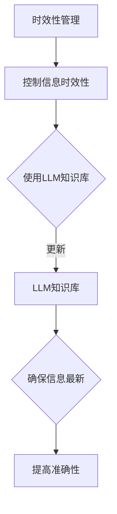

                 

-------------------------------------------------------------------

## prompt时效性管理：更新LLM知识库

关键词：prompt时效性管理、LLM知识库、数据更新策略、相似度计算、人工智能

摘要：本文将探讨prompt时效性管理的重要性，特别是在更新大型语言模型（LLM）知识库中的应用。通过分析核心概念、算法原理，并结合实际项目案例，本文旨在为开发者提供关于如何维护LLM知识库时效性的实用指南。

### 背景介绍

在当今迅速发展的科技时代，人工智能（AI）技术已经成为推动社会进步的关键力量。特别是在自然语言处理（NLP）领域，大型语言模型（LLM）如GPT-3等，展示了惊人的文本生成和理解能力。然而，这些模型的性能很大程度上依赖于其知识库的时效性和准确性。随着信息量的爆炸性增长，如何有效地管理prompt的时效性，确保LLM知识库的实时更新，成为了一个亟待解决的问题。

### 核心概念与联系

#### 2.1.1 概念定义

**时效性管理**: 时效性管理是指对信息的时效性进行控制和管理的过程，确保信息在需要时是最新的和有效的。在AI领域，特别是LLM知识库中，时效性管理尤为重要，因为信息的时效性直接影响模型的预测准确性和应用价值。

**LLM知识库**: LLM知识库是指基于大型语言模型（Large Language Model，例如GPT-3等）构建的知识库，用于存储和提供高质量的文本信息。一个良好的知识库需要不断更新，以反映最新的知识和技术进展。

#### 2.1.2 关系解析

- **时效性管理**和**LLM知识库**之间的关系紧密。时效性管理确保LLM知识库中的信息在特定时间内保持最新，以提高知识库的准确性和实用性。
- **LLM知识库**的核心是大型语言模型，通过训练可以获得丰富的语言知识和理解能力。时效性管理则帮助这些知识库持续更新，保持其相关性。

### Mermaid 流程图



### 核心算法原理讲解

#### 2.1.3 算法概述

为了确保LLM知识库的时效性，我们可以采用以下几种数据更新策略：

1. **周期性更新**: 定期从外部数据源下载新的数据，预处理后更新知识库。
2. **按需更新**: 根据用户的查询请求，动态下载用户特定的数据，并与现有知识库合并。
3. **实时更新**: 实时监测数据源的变化，一旦有新的数据出现，立即更新知识库。

此外，相似度计算在时效性管理中也扮演着重要角色。通过计算文本之间的相似度，我们可以筛选出与用户查询最相关的信息，确保知识库的内容在需要时是最新的和最准确的。

#### 2.1.4 伪代码

```python
def update_knowledge_base():
    # 周期性更新策略
    if time_since_last_update > update_frequency:
        download_new_data()
        preprocess_data()
        train_new_model()
    
    # 按需更新策略
    if user_request_new_data:
        download_user_specific_data()
        merge_data_with_knowledge_base()
        retrain_model_if_necessary()

def calculate_similarity(text1, text2):
    # 计算文本相似度
    similarity_score = cosine_similarity(text1_vector, text2_vector)
    return similarity_score
```

#### 2.1.5 公式介绍

相似度计算公式如下：

$$
\text{similarity}(\text{text}_1, \text{text}_2) = \frac{\text{dot_product}(\text{vector}_{\text{text}_1}, \text{vector}_{\text{text}_2})}{\|\text{vector}_{\text{text}_1}\|\|\text{vector}_{\text{text}_2}\|}
$$

其中，$\text{dot_product}$表示点积，$\|\text{vector}_{\text{text}_1}\|$和$\|\text{vector}_{\text{text}_2}\|$表示向量的模长。

### 详细讲解与举例说明

#### 2.1.6 计算示例

假设我们有两个文本：

- 文本1: "人工智能技术发展迅速，推动了各行各业的应用。"
- 文本2: "近年来，AI技术在快速进步，在很多领域都有显著的应用。"

通过计算它们的相似度，可以得到：

$$
\text{similarity}(\text{文本1}, \text{文本2}) = \frac{\text{dot_product}(\text{vector}_{\text{文本1}}, \text{vector}_{\text{文本2}})}{\|\text{vector}_{\text{文本1}}\|\|\text{vector}_{\text{文本2}}\|}
$$

由于文本经过嵌入处理后，我们得到它们的向量表示，假设点积为0.8，向量的模长均为1，则相似度为0.8。

### 核心算法原理讲解（续）

#### 2.1.7 数据更新策略

**周期性更新**：每隔一定时间，自动从外部数据源下载新的数据，预处理后更新知识库。这种策略的优点是操作简单，但缺点是可能无法及时反映最新的信息。

**按需更新**：根据用户的查询请求，动态下载用户特定的数据，并与现有知识库合并。这种策略的优点是能够更精准地满足用户需求，但缺点是数据处理和模型更新较为复杂。

**实时更新**：实时监测数据源的变化，一旦有新的数据出现，立即更新知识库。这种策略的优点是最能确保知识库的时效性，但缺点是需要较高的计算资源和实时数据处理能力。

### 项目实战

#### 2.1.8 实际案例

假设我们开发了一个问答系统，用户可以通过输入问题来获取答案。为了保证答案的时效性和准确性，我们采用了以下策略：

1. **数据源管理**：从多个权威的数据源（如学术期刊、新闻网站等）定期下载最新数据，并存入知识库中。
2. **用户查询处理**：当用户输入问题后，系统首先使用相似度计算算法筛选出与用户查询最相关的答案。
3. **动态更新**：根据用户查询的频率和热点，动态调整知识库的更新策略，确保知识库始终包含最新的信息。

### 最佳实践 Tips

1. **平衡更新频率**：在制定数据更新策略时，需要平衡更新频率和计算成本。过于频繁的更新可能导致系统负担过重，而过于稀疏的更新则可能导致知识库过时。
2. **质量控制**：确保数据源的质量，避免引入不准确或过时的信息。
3. **用户反馈**：收集用户反馈，根据用户需求调整知识库的内容和更新策略。

### 小结

prompt时效性管理是确保LLM知识库准确性和实用性的关键。通过合理的数据更新策略和相似度计算，开发者可以构建出更为智能和实用的问答系统。本文提供的实际案例和最佳实践为开发者提供了有益的参考。

### 注意事项

1. 在实施时效性管理时，需充分考虑数据源的安全性和隐私保护。
2. 知识库的更新策略应与业务需求相匹配，确保系统性能和用户体验。

### 拓展阅读

1. **相关论文**：《Neural Text Generation: A Survey of Methods and Applications》
2. **开源项目**：OpenAI的GPT-3源代码和Hugging Face的Transformers库

---

作者：AI天才研究院/AI Genius Institute & 禅与计算机程序设计艺术 /Zen And The Art of Computer Programming

-------------------------------------------------------------------

