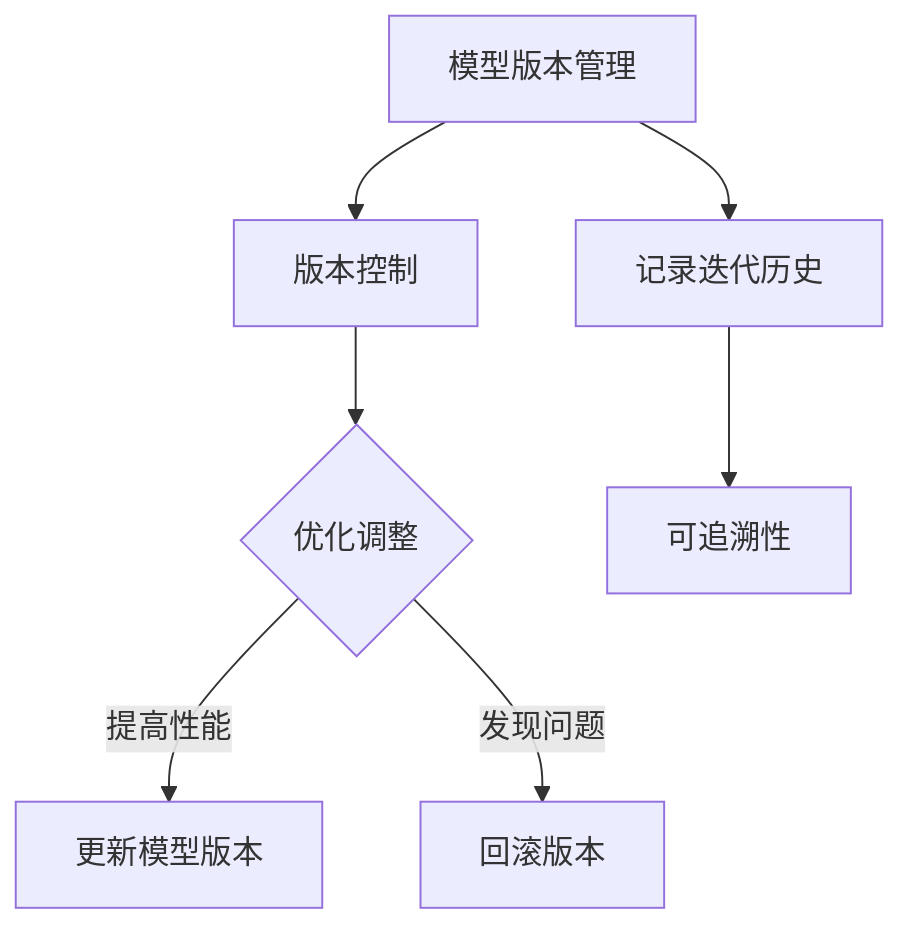
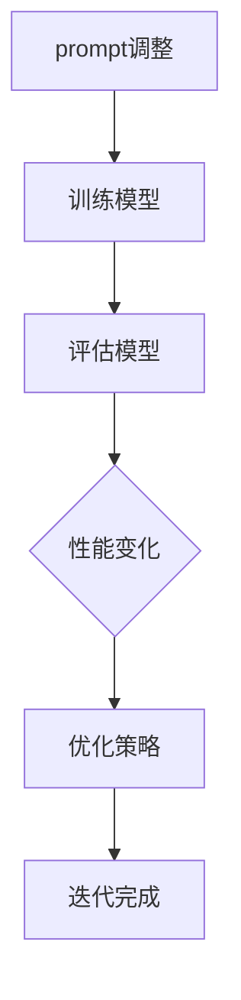
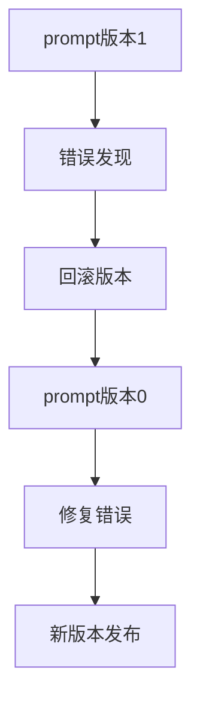
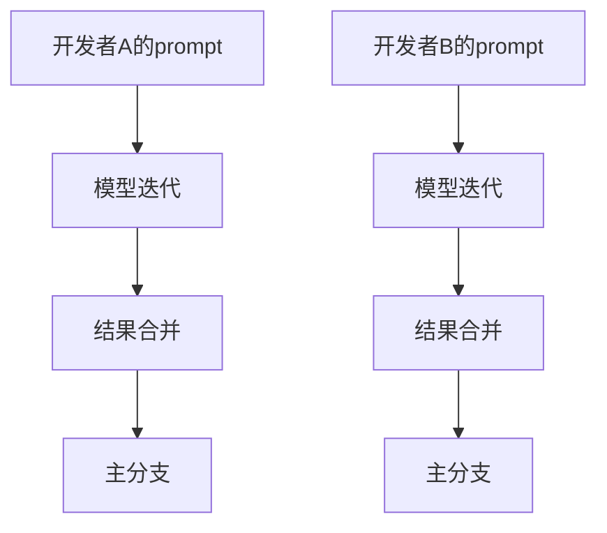

                 

### 1.1.1 版本控制的基本概念

版本控制（Version Control），又称为源代码管理（Source Code Management，简称SCM），是一种软件工程实践，旨在跟踪源代码的变化、协调不同开发者的工作，并确保代码库的一致性和可追溯性。版本控制系统的核心功能包括：

1. **变更记录**：记录每次代码变更的详细日志，包括变更内容、作者、时间等。
2. **分支管理**：允许开发者将代码库分离成不同的分支，进行独立开发，然后合并回主分支。
3. **差异比较**：显示不同版本之间的差异，帮助开发者理解变更的影响。
4. **回滚**：撤销某些特定的变更，恢复到先前的版本状态。
5. **权限控制**：管理开发者的访问权限，确保代码库的安全性。

常见的版本控制系统包括Git、SVN和Mercurial等。Git是目前最流行的版本控制系统，它采用分布式架构，能够快速地处理大规模项目，并支持强大的分支管理。

### 1.1.2 版本控制的挑战与机遇

在软件开发过程中，版本控制面临以下挑战：

1. **协调冲突**：多个开发者同时对同一部分代码进行修改时，可能会产生冲突，需要手工解决。
2. **历史追踪**：随着代码库的增长，追踪历史变更和问题变得越来越复杂。
3. **版本泛滥**：如果不进行有效管理，代码库可能会出现大量冗余版本，占用过多存储空间。

然而，版本控制也带来了许多机遇：

1. **协作效率**：通过版本控制，团队成员可以并行工作，并快速合并成果。
2. **代码质量**：版本控制帮助开发者跟踪问题，确保代码的可维护性和稳定性。
3. **创新空间**：版本控制使得开发者可以自由尝试新的功能，而不用担心破坏现有的代码。

### 1.1.3 prompt版本控制的核心概念

prompt版本控制是一种将版本控制原理应用于自然语言处理（NLP）模型开发的方法，尤其是大规模语言模型（LLM）的开发。它的核心概念包括：

1. **模型版本**：每个LLM模型都可以被视为一个版本，记录模型的参数和状态。
2. **prompt迭代**：通过调整prompt（输入文本），可以实现对模型的不同训练和评估。
3. **版本管理**：使用版本控制系统来管理模型版本和prompt迭代，确保可追溯性和一致性。

prompt版本控制有助于解决以下问题：

1. **优化调整**：通过迭代不同的prompt，可以微调模型参数，提高模型性能。
2. **结果可追溯**：记录每次迭代的结果，可以追溯模型性能的变化，帮助理解优化过程。
3. **协作开发**：团队成员可以并行迭代不同的prompt，然后合并结果，提高开发效率。

**Mermaid 流程图：**



通过上述流程，prompt版本控制不仅能够提高LLM应用的迭代效率，还能降低错误率，实现智能协作，为NLP领域的研究和应用带来新的可能性。

---

在接下来的章节中，我们将进一步探讨LLM应用的具体情况，了解这些模型的基本原理及其在自然语言处理中的应用，为后续的讨论和案例研究打下基础。

## 1.2 LLM应用概述

### 1.2.1 语言模型（LLM）的定义与分类

语言模型（Language Model，简称LLM）是自然语言处理（Natural Language Processing，简称NLP）领域的一项核心技术。它通过统计方法或神经网络模型对大量文本数据进行分析和学习，从而预测句子中下一个单词或字符的概率分布。语言模型是许多NLP任务的基础，如文本分类、命名实体识别、机器翻译等。

根据建模方法的不同，语言模型可以分为以下几类：

1. **基于统计的方法**：这类方法使用统计语言模型（Statistical Language Model，SLM），如N元语法（N-gram Model）。N元语法通过计算词汇序列的频率来预测下一个词，其简单但效果有限，难以捕捉长距离依赖关系。

2. **基于神经网络的模型**：随着深度学习的兴起，基于神经网络的模型（Neural Network Language Model，NNLM）逐渐成为主流。早期的循环神经网络（Recurrent Neural Network，RNN）和长短期记忆网络（Long Short-Term Memory，LSTM）能够较好地处理序列数据，但存在梯度消失和梯度爆炸等问题。近年来，Transformer模型的出现解决了这些问题，并显著提升了语言模型的性能。

3. **预训练加微调的方法**：这种方法首先在大量无标注数据上预训练一个大型语言模型，然后在具体任务上进行微调。这种方法通过转移学习（Transfer Learning）有效地利用了预训练模型对语言的一般理解，从而在多个NLP任务上取得了显著的效果。代表模型包括GPT、BERT、RoBERTa等。

### 1.2.2 LLM在自然语言处理中的应用

语言模型在自然语言处理领域具有广泛的应用，以下是一些典型的应用场景：

1. **文本生成**：语言模型可以生成各种文本，如文章、摘要、对话、代码等。通过输入一个单词或短语，模型可以预测下一个词，并生成连贯的文本。

2. **机器翻译**：语言模型可以用于将一种语言翻译成另一种语言。通过训练大规模的双语语料库，模型可以学习两种语言的对应关系，从而实现自动翻译。

3. **问答系统**：语言模型可以构建智能问答系统，通过理解用户的问题，从大量文本中检索出最相关的答案。

4. **对话系统**：语言模型可以用于构建聊天机器人，与用户进行自然语言交互，提供信息或完成特定任务。

5. **文本分类**：语言模型可以用于将文本分类到预定义的类别中，如情感分析、主题分类等。

6. **信息抽取**：语言模型可以用于提取文本中的关键信息，如命名实体识别、关系抽取等。

### 1.2.3 LLM的发展趋势与未来前景

随着技术的不断进步，语言模型在自然语言处理领域的应用越来越广泛，其发展趋势和未来前景如下：

1. **模型规模不断扩大**：为了更好地捕捉语言中的复杂结构，大型语言模型如GPT-3、Turing-NLG等不断涌现，模型参数量从数十亿到数千亿不等。

2. **多模态语言模型**：未来的语言模型将不仅仅处理文本，还将整合图像、语音等多种模态的信息，实现更强大的跨模态理解能力。

3. **自适应和自优化**：随着深度学习和强化学习的结合，语言模型将具备自适应和自优化的能力，能够根据用户反馈和任务需求动态调整模型参数。

4. **伦理和安全性**：随着语言模型的应用越来越广泛，其伦理和安全性问题也日益突出。未来的研究将关注如何确保模型输出的准确性和公平性，防止被恶意利用。

5. **落地应用**：语言模型将在更多实际场景中得到应用，如智能客服、医疗诊断、法律咨询等，为人们的生活和工作带来便利。

总之，语言模型作为自然语言处理的核心技术，正不断推动着人工智能的发展，其应用前景广阔，未来可期。

### 1.3 prompt版本控制的优势

prompt版本控制作为一种创新的版本控制方法，在LLM应用中展现出诸多优势，这些优势不仅提高了开发效率和模型质量，还改变了传统的开发模式，成为LLM应用迭代管理的重要工具。

#### 1.3.1 提高迭代效率

prompt版本控制通过精细管理模型的输入和输出，使迭代过程更加高效。传统的迭代方法往往需要反复进行训练和评估，而prompt版本控制通过调整prompt，可以在短时间内观察到模型的性能变化。这种快速反馈机制大大缩短了模型迭代的时间，提高了开发效率。

例如，在一个文本生成任务中，通过调整prompt中的关键字或句子结构，可以快速发现模型对某些特定内容的表现，从而针对性地进行优化。这不仅节省了时间和计算资源，还提高了开发效率。

**Mermaid 流程图：**



#### 1.3.2 降低错误率

prompt版本控制通过细粒度的版本管理，可以有效地降低开发过程中的错误率。在传统的开发模式中，开发者往往需要在复杂的代码库中定位和修复错误，而prompt版本控制允许开发者对特定的prompt进行版本控制，从而隔离错误源。

例如，在一个机器翻译项目中，如果发现某个翻译结果错误，开发者可以回滚到之前的prompt版本，避免引入新的错误。这种精细的管理方式不仅降低了错误率，还提高了代码库的稳定性。

**Mermaid 流程图：**



#### 1.3.3 实现智能协作

prompt版本控制通过共享和协作机制，使得多个开发者可以同时工作在不同的prompt版本上，从而实现智能协作。每个开发者可以根据自己的任务需求，调整prompt并进行迭代，然后将结果合并到主分支，确保团队协作的一致性和高效性。

例如，在一个大型问答系统中，不同的开发者可以分别负责不同的领域知识库的prompt迭代，通过共享和协作，最终实现一个完整的问答系统。这种智能协作模式不仅提高了开发效率，还保证了代码和模型的一致性和准确性。

**Mermaid 流程图：**



总的来说，prompt版本控制通过提高迭代效率、降低错误率和实现智能协作，为LLM应用的开发和管理提供了强大的工具支持。它不仅改变了传统的开发模式，还为未来的迭代管理带来了新的可能性和机遇。

### 1.4 书籍结构安排

#### 1.4.1 全书章节概述

本书旨在全面探讨prompt版本控制及其在LLM应用中的重要性。全书共分为七个章节，涵盖从基础概念到实际应用的各个方面。

- **第1章 引言**：介绍版本控制的重要性以及prompt版本控制的核心概念。
- **第2章 prompt版本控制原理**：详细解释prompt版本控制的基本架构、构建与优化方法以及面临的挑战与解决方案。
- **第3章 prompt版本控制在LLM中的应用**：讨论prompt版本控制在文本生成、机器翻译和问答系统等应用场景中的具体实现和案例分析。
- **第4章 prompt版本控制案例分析**：通过具体案例展示prompt版本控制在实际项目中的应用效果。
- **第5章 prompt版本控制实践指南**：提供prompt版本控制的实践步骤、提示词设计与优化方法以及模型迭代与反馈机制。
- **第6章 prompt版本控制未来发展趋势**：展望prompt版本控制的技术进步和未来发展方向。
- **第7章 总结与展望**：总结全书内容，并对未来版本控制领域的发展趋势和LLM技术的未来发展方向进行展望。

#### 1.4.2 各章节主要内容介绍

- **第1章 引言**：本书的开篇，介绍版本控制的重要性，并引出prompt版本控制的概念，为后续章节打下基础。
- **第2章 prompt版本控制原理**：详细讲解prompt版本控制的基本架构、构建与优化方法，以及面临的挑战与解决方案。
- **第3章 prompt版本控制在LLM中的应用**：探讨prompt版本控制在文本生成、机器翻译和问答系统等应用场景中的具体实现，通过实际案例进行深入分析。
- **第4章 prompt版本控制案例分析**：通过具体案例展示prompt版本控制在企业级智能客服系统、智能推荐系统和智能写作助手中的应用效果。
- **第5章 prompt版本控制实践指南**：提供详细的实践步骤，包括提示词设计与优化方法以及模型迭代与反馈机制，帮助读者在实际项目中应用prompt版本控制。
- **第6章 prompt版本控制未来发展趋势**：展望prompt版本控制的技术进步和未来发展方向，探讨新型prompt设计与优化方法以及版本控制工具的应用前景。
- **第7章 总结与展望**：对全书内容进行总结，回顾核心知识点，并对未来版本控制领域和LLM技术的发展趋势进行展望。

#### 1.4.3 阅读建议

为了更好地理解本书的内容，我们提供以下阅读建议：

1. **按章节顺序阅读**：建议按照章节顺序阅读，从基础概念到实际应用，逐步深入理解prompt版本控制。
2. **结合代码示例学习**：本书包含多个代码示例，读者可以通过阅读代码和运行示例，更好地理解概念和原理。
3. **实践与反思**：在阅读过程中，可以尝试将所学知识应用到实际项目中，并通过实践反思理论知识的实际应用效果。
4. **拓展阅读**：本书末尾提供了一些拓展阅读资源，读者可以进一步深入学习相关领域的知识。

通过以上阅读建议，读者可以更加系统地掌握prompt版本控制的知识，并提升在实际项目中的应用能力。

### 第2章 prompt版本控制原理

#### 2.1 prompt版本控制的基本架构

prompt版本控制是针对大规模语言模型（LLM）开发的一种先进的管理方法，其核心在于通过调整输入prompt来实现对模型版本的控制。本节将详细介绍prompt版本控制的基本架构，包括版本控制系统概述、版本库的创建与配置，以及版本迭代的基本操作。

##### 2.1.1 版本控制系统概述

版本控制系统（Version Control System，VCS）是一种用于管理源代码和文档变更的软件工具。它能够跟踪文件的版本历史，允许开发者在修改代码时进行版本对比、回滚和协作开发。常见的版本控制系统包括Git、Subversion（SVN）和Mercurial等。Git是目前最流行的版本控制系统，其分布式架构使其特别适合大型项目和多人协作。

版本控制系统的主要功能包括：

1. **变更记录**：记录每次代码或文件变更的详细信息，如作者、时间、变更内容等。
2. **分支管理**：允许开发者在不同的开发阶段创建独立的分支，进行并行开发，并在适当的时候合并分支。
3. **差异比较**：显示不同版本之间的差异，帮助开发者理解变更的影响。
4. **回滚**：撤销特定的变更，恢复到先前的版本状态。
5. **权限控制**：管理开发者的访问权限，确保代码库的安全性和一致性。

##### 2.1.2 版本库的创建与配置

在prompt版本控制中，版本库（Repository）是存储模型版本和prompt迭代历史的中心。创建版本库通常涉及以下步骤：

1. **初始化仓库**：使用版本控制工具初始化一个新的仓库，例如在Git中，可以使用`git init`命令创建一个本地仓库。

    ```bash
    git init
    ```

2. **添加文件**：将模型文件和prompt文件添加到仓库中，使用`git add`命令。

    ```bash
    git add model.py prompt.txt
    ```

3. **提交变更**：提交文件变更到仓库，并附上提交信息。

    ```bash
    git commit -m "Initialize repository with initial model and prompt"
    ```

4. **配置远程仓库**：将本地仓库连接到一个远程仓库（如GitHub、GitLab等），以便进行远程协作。

    ```bash
    git remote add origin https://github.com/username/repository.git
    git push -u origin master
    ```

##### 2.1.3 版本迭代的基本操作

版本迭代是prompt版本控制的核心环节。以下是一些基本操作：

1. **创建分支**：为了进行独立的迭代，可以在主分支（如`master`或`main`）上创建一个新的分支。

    ```bash
    git checkout -b new-iteration
    ```

2. **调整prompt**：在分支上调整prompt，例如增加或修改某些关键字或句子结构。

    ```python
    # 修改prompt.txt文件
    with open("prompt.txt", "w") as f:
        f.write("新的prompt内容")
    ```

3. **训练模型**：使用调整后的prompt重新训练模型。

    ```bash
    python train.py
    ```

4. **评估模型**：评估训练后的模型性能，例如使用测试集进行评估。

    ```bash
    python evaluate.py
    ```

5. **提交迭代结果**：将迭代结果提交到分支。

    ```bash
    git add .
    git commit -m "完成本次迭代"
    ```

6. **合并分支**：在确保分支迭代成功后，可以将分支合并回主分支。

    ```bash
    git checkout master
    git merge new-iteration
    ```

7. **删除分支**：合并完成后，可以删除不再需要的分支。

    ```bash
    git branch -d new-iteration
    ```

通过上述基本架构和操作，prompt版本控制为LLM应用提供了强大的管理工具，使开发者能够高效地迭代和优化模型，确保代码和模型的一致性和可追溯性。

#### 2.2 prompt的构建与优化

prompt是大规模语言模型（LLM）输入的关键组成部分，它直接影响模型的输出质量和训练效果。本节将详细讨论prompt构建的基本要素、优化方法以及提高prompt效果的关键因素。

##### 2.2.1 prompt构建的基本要素

构建有效的prompt需要考虑以下几个基本要素：

1. **内容丰富性**：prompt应包含丰富多样的内容，以覆盖模型可能遇到的各种情况。例如，在文本生成任务中，prompt可以包括不同的主题、情感和风格。

2. **上下文关联**：prompt需要与模型要处理的具体任务紧密相关，提供足够的上下文信息，帮助模型更好地理解输入。

3. **结构合理性**：prompt的结构应合理，例如在问答系统中，应提供明确的提问方式，使模型能够准确理解和回答问题。

4. **长度适宜**：prompt的长度应根据任务需求和模型处理能力来调整。过长的prompt可能导致模型处理效率降低，而过短的prompt可能无法提供足够的上下文信息。

5. **格式一致性**：prompt的格式应保持一致性，以避免模型在处理过程中产生混淆。例如，在机器翻译任务中，prompt中的文本应使用统一的语言和语法结构。

##### 2.2.2 prompt优化的方法与技术

优化prompt是提升模型性能的重要手段。以下是一些常用的prompt优化方法：

1. **数据增强**：通过数据增强技术，生成多样化的训练数据，以丰富prompt的内容和上下文。例如，可以使用同义词替换、句子重写等技术。

    ```python
    import random

    def synonym_replace(sentence):
        # 使用同义词替换
        words = sentence.split()
        for i, word in enumerate(words):
            if word in ['happy', 'sad', 'angry']:
                words[i] = random.choice(['joyful', 'sorrowful', 'annoyed'])
        return ' '.join(words)

    example_sentence = "I am happy because I passed the exam."
    optimized_sentence = synonym_replace(example_sentence)
    ```

2. **语义填充**：在prompt中添加语义相关的信息，帮助模型更好地理解输入。例如，在问答系统中，可以添加问题的背景信息。

    ```python
    def add_context(question, context):
        return f"{context} \n What is the answer to the following question: {question}"

    example_question = "What is the capital of France?"
    example_context = "France is a country located in Western Europe with a rich history and culture."
    optimized_prompt = add_context(example_question, example_context)
    ```

3. **动态调整**：根据模型的反馈动态调整prompt，例如在训练过程中，可以记录模型的错误类型和频率，然后针对性地调整prompt。

    ```python
    def adjust_prompt(prompt, error_log):
        # 根据错误日志调整prompt
        for error in error_log:
            prompt = prompt.replace(error, f"{error} (optimized)")
        return prompt

    example_prompt = "What is the weather like today?"
    example_error_log = ["What is the weather like today?", "Today's weather is sunny."]
    optimized_prompt = adjust_prompt(example_prompt, example_error_log)
    ```

4. **多模态结合**：将文本prompt与其他模态（如图像、声音）结合，提供更丰富的上下文信息。例如，在图像描述生成任务中，可以结合图像和文本prompt。

##### 2.2.3 提高prompt效果的关键因素

以下是提高prompt效果的关键因素：

1. **数据质量**：确保训练数据的质量和多样性，以提高prompt的丰富性和上下文关联性。

2. **模型适应性**：选择适合特定任务的模型，并确保模型能够适应不同类型的prompt。

3. **反馈机制**：建立有效的反馈机制，记录模型在处理prompt时的错误和不足，以便不断优化prompt。

4. **跨领域适应性**：设计跨领域的prompt，使模型能够处理多种类型的输入，提高模型的泛化能力。

通过上述基本要素、优化方法和关键因素，开发者可以构建和优化有效的prompt，从而提升大规模语言模型的性能和应用效果。

#### 2.3 prompt版本控制的实现

在LLM应用中，prompt版本控制是实现迭代管理和优化的重要手段。本节将详细讨论prompt版本控制的实现过程，包括提示词设计与迭代、实时调整与反馈，以及具体案例分析。

##### 2.3.1 提示词设计与迭代

提示词（Prompt）是LLM应用中用于引导模型生成输出的关键输入。有效的提示词设计能够提高模型的生成质量，并有助于迭代过程中的问题排查和优化。以下是提示词设计与迭代的具体步骤：

1. **需求分析**：根据应用场景和任务需求，确定提示词的目标和期望输出。例如，在问答系统中，提示词应明确问题的类型和背景信息。

2. **初步设计**：设计初步的提示词，通常包含关键信息、上下文和引导语句。例如，对于文本生成任务，提示词可以是一个主题句或引导性问题。

    ```python
    # 初步设计的提示词示例
    prompt = "请描述一下人工智能在未来十年对教育领域的影响。"
    ```

3. **迭代调整**：根据模型生成的输出和用户反馈，对提示词进行迭代优化。调整步骤包括增加或删除关键信息、改变语言风格等。

    ```python
    # 迭代调整后的提示词示例
    optimized_prompt = "人工智能将在未来十年内如何深刻改变教育模式，特别是在个性化教学和自适应学习方面？"
    ```

4. **测试与评估**：使用测试数据集评估优化后的提示词，确保生成的输出符合预期。通过对比生成文本的质量、连贯性和准确性，调整提示词以达到最佳效果。

##### 2.3.2 实时调整与反馈

实时调整与反馈是prompt版本控制的重要环节，它能够快速响应模型性能的变化，并调整提示词以优化输出。以下是实时调整与反馈的具体步骤：

1. **监控模型输出**：监控模型在训练和生成过程中的输出，记录生成的文本、错误类型和频率等关键指标。

    ```bash
    # 监控生成的文本和错误类型
    monitor_output = {
        'generated_text': [],
        'error_types': []
    }
    ```

2. **收集用户反馈**：通过用户使用过程中的反馈，了解用户对生成的文本的满意度、错误报告和改进建议。

3. **调整提示词**：根据监控数据和用户反馈，对提示词进行实时调整。例如，如果发现模型在生成新闻报道时频繁出现事实错误，可以增加事实核验的信息到提示词中。

    ```python
    # 根据错误类型调整提示词
    if '事实错误' in monitor_output['error_types']:
        optimized_prompt += "请确保提供的信息准确无误。"
    ```

4. **反馈循环**：建立反馈循环，将调整后的提示词重新用于模型训练和生成，持续优化模型性能。

##### 2.3.3 案例解析

以下是一个具体的案例，展示prompt版本控制在实际项目中的应用。

**案例背景**：一个企业希望开发一个智能客服系统，使用LLM来处理客户的咨询和问题。

**需求分析**：系统需要处理各种类型的问题，包括产品信息、订单状态、常见问题等。

**初步设计**：初步设计的提示词是一个引导性问题，如“您有什么问题需要帮助吗？”

**迭代调整**：在初步设计的提示词下，模型生成的回答存在模糊和不准确的情况。通过实时监控和用户反馈，发现模型在理解复杂问题时存在困难。因此，对提示词进行迭代调整，增加了具体的场景描述和问题类型引导。

**优化后的提示词**：
```
您好，欢迎来到我们的智能客服系统。请问您是关于产品信息、订单状态还是常见问题需要咨询？请提供更多的详细信息，我们将尽快为您解答。
```

**实时调整与反馈**：在系统运行过程中，监控到模型在处理特定类型的咨询时出现错误。根据监控数据和用户反馈，进一步调整提示词，增加对特定问题的提示和引导。

**最终效果**：经过多次迭代调整和实时反馈，智能客服系统在处理客户咨询时，生成的回答更加准确和清晰，用户满意度显著提高。

通过上述案例，可以看出prompt版本控制在实现LLM应用中的重要性。有效的提示词设计和迭代调整，结合实时调整与反馈，能够显著提升模型性能和用户满意度。

#### 2.4 prompt版本控制中的挑战与解决方案

尽管prompt版本控制在LLM应用中展现了诸多优势，但其实际应用过程中仍面临一系列挑战。以下将详细讨论数据隐私与安全性、模型过拟合与泛化能力，以及模型迭代过程中的优化策略。

##### 2.4.1 数据隐私与安全性

在prompt版本控制过程中，由于涉及大量的训练数据和模型参数，数据隐私和安全性成为关键问题。以下是一些解决方案：

1. **数据加密**：对训练数据和模型参数进行加密处理，确保数据在传输和存储过程中不被未授权访问。常用的加密算法包括AES、RSA等。

2. **访问控制**：实施严格的访问控制策略，只有授权用户才能访问敏感数据。可以通过用户认证和权限管理实现。

3. **数据去识别化**：在数据采集和预处理阶段，对个人身份信息和其他敏感数据进行去识别化处理，以减少隐私泄露的风险。常用的方法包括数据匿名化、数据泛化等。

4. **安全审计**：定期进行安全审计，检查系统是否存在漏洞和安全隐患。通过日志记录和监控，及时发现并处理潜在的安全威胁。

##### 2.4.2 模型过拟合与泛化能力

在prompt版本控制过程中，模型可能会出现过拟合（Overfitting）现象，导致其在训练数据上表现良好，但在新数据上表现不佳。以下是一些解决方案：

1. **交叉验证**：使用交叉验证（Cross-Validation）方法，将数据集划分为多个子集，每次训练模型并评估其在新数据子集上的性能。通过交叉验证，可以避免模型对特定子集的过拟合。

2. **正则化**：在模型训练过程中，加入正则化（Regularization）项，如L1、L2正则化，限制模型参数的规模，减少过拟合的风险。

3. **Dropout**：在神经网络中引入Dropout技术，即在训练过程中随机丢弃部分神经元，降低模型对特定数据的依赖。

4. **数据增强**：通过数据增强（Data Augmentation）技术，生成更多的训练样本来增加模型的泛化能力。例如，在图像识别任务中，可以使用旋转、缩放、裁剪等操作。

##### 2.4.3 模型迭代过程中的优化策略

在模型迭代过程中，优化策略的制定和执行至关重要。以下是一些优化策略：

1. **自动调参**：使用自动化调参（AutoML）工具，如Hyperopt、BayesOpt等，自动寻找最佳的模型参数组合，提高模型性能。

2. **多模态数据融合**：将不同模态的数据（如文本、图像、声音）融合到训练过程中，提供更丰富的上下文信息，提高模型的泛化能力。

3. **集成学习**：使用集成学习（Ensemble Learning）方法，将多个模型集成到一个统一的模型中，通过投票或加权平均等方式提高预测性能。

4. **持续学习**：通过持续学习（Continuous Learning）技术，使模型能够在新的数据上不断学习和优化，避免模型在长时间使用后性能下降。

通过上述解决方案和优化策略，prompt版本控制可以在面对挑战时保持稳定和高效，为LLM应用提供可靠的支持。

### 第3章 prompt版本控制在LLM中的应用

#### 3.1 prompt版本控制在文本生成中的应用

文本生成是大规模语言模型（LLM）最引人注目的应用之一，从简单的文章摘要到复杂的对话系统，文本生成技术在自然语言处理（NLP）领域展现出了巨大的潜力。prompt版本控制在文本生成中的应用，通过调整和优化prompt，显著提高了模型的生成质量和多样性。

##### 3.1.1 文本生成的基本原理

文本生成模型的核心是通过学习大量文本数据，预测下一个词或字符的概率分布，并生成连贯的文本。以下是一些常见的文本生成模型：

1. **循环神经网络（RNN）**：RNN通过递归结构，能够捕捉序列数据中的长距离依赖关系。然而，RNN存在梯度消失和梯度爆炸的问题，导致训练效果不佳。

2. **长短期记忆网络（LSTM）**：LSTM是RNN的改进版，通过引入门控机制，有效地解决了梯度消失问题。LSTM在处理长序列数据时表现良好，但仍然存在计算复杂度高和难以并行训练的问题。

3. **Transformer模型**：Transformer模型通过自注意力机制（Self-Attention），能够并行处理序列数据，避免了梯度消失问题，并且在训练速度和生成质量上均优于RNN和LSTM。GPT和BERT是Transformer模型的代表性应用。

##### 3.1.2 prompt版本控制在文本生成中的实现

prompt在文本生成中的作用是引导模型生成特定类型的文本，通过调整prompt，可以实现文本生成的多样性和可控性。以下是prompt版本控制在文本生成中的具体实现：

1. **初始化prompt**：根据应用场景和任务需求，初始化prompt。例如，对于文章摘要任务，可以初始化为“请为以下文本生成摘要：”。

    ```python
    initial_prompt = "请为以下文本生成摘要："
    ```

2. **调整prompt内容**：通过添加、删除或替换关键词和句子结构，调整prompt的内容，以优化生成文本的质量和多样性。例如，可以添加关键词来丰富上下文，或替换部分句子来改变生成文本的风格。

    ```python
    optimized_prompt = "请为以下文本生成一个简短而精练的摘要："
    ```

3. **迭代优化prompt**：在模型训练过程中，根据生成文本的质量和用户反馈，持续优化prompt。例如，如果发现生成的摘要过于简短或不完整，可以增加提示词来引导模型生成更详细的摘要。

    ```python
    final_prompt = "请为以下文本生成一个完整且具有代表性的摘要："
    ```

4. **评估生成文本**：使用测试集评估生成文本的质量，包括连贯性、准确性、多样性等指标。通过对比不同prompt下的生成结果，选择最佳的prompt版本。

    ```python
    import nltk

    def evaluate_摘要(生成文本，参考摘要）：
        # 使用nltk评估生成摘要与参考摘要的相似度
        similarity = nltkMetrics.sentence_similarity(生成文本，参考摘要）
        return similarity
    ```

##### 3.1.3 案例分析

以下是一个文本生成案例，展示prompt版本控制的应用效果。

**案例背景**：一个新闻网站希望使用文本生成模型为每篇文章生成摘要。

**初步设计**：初始化prompt为“请为以下新闻生成摘要：”。

```python
initial_prompt = "请为以下新闻生成摘要："
```

**迭代优化**：在初步设计的基础上，通过用户反馈和生成文本质量的评估，逐步调整prompt。如果发现生成的摘要过于简短，可以增加提示词，如“请为以下新闻生成一个详细而准确的摘要：”。

```python
optimized_prompt = "请为以下新闻生成一个详细而准确的摘要："
```

**最终效果**：经过多次迭代调整，生成的摘要质量显著提高，用户满意度显著提升。以下是一个生成摘要的示例：

```
【科技新闻】我国研发出新型节能材料，有望大幅降低建筑能耗。据科研团队介绍，该材料具有良好的隔热性能和反射性能，能够有效阻止热量的传递，提高建筑物的能源利用效率。专家表示，这一成果将为绿色建筑的发展提供新的技术支持。
```

通过上述案例，可以看出prompt版本控制在文本生成中的应用，通过精细调整prompt，能够显著提高生成文本的质量和多样性，为实际应用提供有力支持。

#### 3.2 prompt版本控制在机器翻译中的应用

机器翻译是大规模语言模型（LLM）的重要应用之一，旨在将一种语言的文本自动翻译成另一种语言。prompt版本控制在机器翻译中的应用，通过优化prompt的设计和迭代，有效提升了翻译质量和效率，为多语言交互和国际化应用提供了强大支持。

##### 3.2.1 机器翻译的基本原理

机器翻译的基本原理是通过学习大量双语对照文本，生成目标语言的文本。以下是一些常见的机器翻译模型：

1. **基于统计的机器翻译（SMT）**：SMT通过统计方法，如N元语法（N-gram Model）和统计机器翻译模型（SMT Model），利用语言模型的统计特征进行翻译。

2. **基于神经网络的机器翻译（NMT）**：NMT通过深度学习技术，特别是序列到序列（Seq2Seq）模型和注意力机制（Attention Mechanism），实现端到端的翻译。

3. **基于预训练的机器翻译**：预训练加微调的方法通过在大量无标签数据上进行预训练，然后在有标签数据上进行微调，提高了模型在具体翻译任务上的性能。

##### 3.2.2 prompt版本控制在机器翻译中的实现

prompt在机器翻译中的作用是引导模型生成更准确、流畅的翻译结果。通过调整和优化prompt，可以实现机器翻译质量的提升。以下是prompt版本控制在机器翻译中的具体实现步骤：

1. **初始化prompt**：根据翻译任务的需求，初始化prompt。例如，对于新闻翻译，可以初始化为“请将以下新闻翻译成[目标语言]：”。

    ```python
    initial_prompt = "请将以下新闻翻译成中文："
    ```

2. **调整prompt内容**：通过添加、删除或替换关键词和句子结构，调整prompt的内容，以优化翻译结果。例如，可以添加背景信息或关键词来提高上下文关联性。

    ```python
    optimized_prompt = "请将以下国际新闻翻译成中文，确保信息的准确性和完整性："
    ```

3. **迭代优化prompt**：在模型训练和翻译过程中，根据生成的翻译质量和用户反馈，持续优化prompt。例如，如果发现翻译结果存在模糊或不准确的情况，可以增加具体提示词来引导模型生成更清晰的翻译。

    ```python
    final_prompt = "请将以下新闻翻译成中文，特别注意专业术语的准确翻译："
    ```

4. **评估翻译质量**：使用自动化评估工具和用户反馈，评估翻译结果的质量，包括准确性、流畅性和忠实度等。通过对比不同prompt下的翻译结果，选择最佳的prompt版本。

    ```python
    from nmt_evaluation import bleu_score

    def evaluate_translations(翻译结果，参考译文）：
        # 使用BLEU评分评估翻译质量
        score = bleu_score(翻译结果，参考译文）
        return score
    ```

##### 3.2.3 案例分析

以下是一个机器翻译案例，展示prompt版本控制的应用效果。

**案例背景**：一个跨国公司需要将英文技术文档翻译成中文，以便于中国区团队的工作。

**初步设计**：初始化prompt为“请将以下英文技术文档翻译成中文：”。

```python
initial_prompt = "请将以下英文技术文档翻译成中文："
```

**迭代优化**：在初步设计的基础上，通过用户反馈和翻译质量的评估，逐步调整prompt。如果发现翻译结果存在术语不准确或翻译不流畅的情况，可以增加专业术语的提示词和上下文信息。

```python
optimized_prompt = "请将以下英文技术文档翻译成中文，确保专业术语的准确性，并保持文本的流畅性："
```

**最终效果**：经过多次迭代调整，生成的翻译质量显著提高，术语准确性得到保障，翻译文本的流畅性得到优化。以下是一个翻译结果的示例：

```
原文：The system provides a comprehensive set of tools for monitoring and managing network performance.

翻译：该系统提供了一套全面的工具，用于监控和管理网络性能。
```

通过上述案例，可以看出prompt版本控制在机器翻译中的应用，通过精细调整prompt，能够有效提升翻译质量和效率，为国际化应用提供有力支持。

### 3.3 prompt版本控制在问答系统中的应用

问答系统是大规模语言模型（LLM）的重要应用之一，旨在通过自然语言交互为用户提供准确、及时的答案。prompt版本控制在问答系统中的应用，通过优化prompt的设计和迭代，提高了问答系统的准确性和用户体验。

##### 3.3.1 问答系统的基本原理

问答系统通常由三个主要部分组成：问答对生成、答案检索和答案生成。以下是问答系统的基本原理：

1. **问答对生成**：系统通过大量已标注的问答对数据进行训练，学习如何从问题生成可能的答案。这通常涉及到预训练的文本生成模型，如GPT-3或BERT。

2. **答案检索**：系统在预训练的模型基础上，通过检索算法从知识库或网络中查找与问题最相关的答案。常用的检索算法包括TF-IDF、BM25等。

3. **答案生成**：系统根据问题、检索到的答案和相关上下文，使用生成模型生成最终的答案。生成模型通常采用预训练的语言模型，如GPT-3或Turing-NLG。

##### 3.3.2 prompt版本控制在问答系统中的实现

prompt在问答系统中的作用是引导模型生成更准确、相关的答案。通过调整和优化prompt，可以实现问答系统质量的提升。以下是prompt版本控制在问答系统中的具体实现步骤：

1. **初始化prompt**：根据问答任务的需求，初始化prompt。例如，对于通用问答系统，可以初始化为“请问[问题]的答案是？”。

    ```python
    initial_prompt = "请问美国总统是谁？"
    ```

2. **调整prompt内容**：通过添加、删除或替换关键词和句子结构，调整prompt的内容，以优化答案生成。例如，可以添加背景信息或具体要求来提高上下文关联性。

    ```python
    optimized_prompt = "请问目前美国的总统是谁，他的任期从何时开始？"
    ```

3. **迭代优化prompt**：在模型训练和问答过程中，根据生成的答案质量和用户反馈，持续优化prompt。例如，如果发现答案过于模糊或不准确，可以增加具体的提示词来引导模型生成更精确的答案。

    ```python
    final_prompt = "请问目前美国的总统是谁，他的任期从何时开始，任期结束时间是什么时候？"
    ```

4. **评估答案质量**：使用自动化评估工具和用户反馈，评估答案的质量，包括准确性、相关性和流畅性等。通过对比不同prompt下的生成答案，选择最佳的prompt版本。

    ```python
    from question_answering_evaluation import accuracy_score

    def evaluate_answers(生成答案，参考答案）：
        # 使用准确性评分评估答案质量
        score = accuracy_score(生成答案，参考答案）
        return score
    ```

##### 3.3.3 案例分析

以下是一个问答系统案例，展示prompt版本控制的应用效果。

**案例背景**：一个在线教育平台希望为其用户提供一个智能问答系统，用于解答学生在学习过程中遇到的问题。

**初步设计**：初始化prompt为“请问这个问题该如何解决？”。

```python
initial_prompt = "请问这个问题该如何解决？"
```

**迭代优化**：在初步设计的基础上，通过用户反馈和问答质量的评估，逐步调整prompt。如果发现答案不够详细或准确，可以增加具体的提示词来引导模型生成更详尽的答案。

```python
optimized_prompt = "请详细解答这个问题，包括具体的步骤和原因。"
```

**最终效果**：经过多次迭代调整，生成的答案质量显著提高，准确性、相关性和流畅性都得到了显著改善。以下是一个问答系统生成答案的示例：

```
原文：学生提问：“如何在Python中实现冒泡排序算法？”

优化后的答案：在Python中，实现冒泡排序算法的步骤如下：

1. 从数组的第一个元素开始，比较相邻的两个元素，如果第一个元素大于第二个元素，则交换它们的位置。
2. 继续比较下一个元素，直到数组的最后一个元素。
3. 重复上述步骤，但每次只遍历未排序部分的数组。
4. 当一次遍历中没有发生交换时，说明数组已排序，算法结束。

以上是冒泡排序算法的实现步骤，冒泡排序算法的时间复杂度为O(n^2)，适用于小规模数据的排序。
```

通过上述案例，可以看出prompt版本控制在问答系统中的应用，通过精细调整prompt，能够有效提升答案生成的质量，为用户提供更准确、详尽的答案。

### 4.1 案例一：企业级智能客服系统

#### 4.1.1 案例背景

随着企业业务的不断扩展和客户需求的日益多样化，传统的人工客服模式已经难以满足高效、精准的服务需求。为了提升客户体验和降低运营成本，许多企业开始采用智能客服系统，利用大规模语言模型（LLM）和自然语言处理（NLP）技术来提供智能化的客户服务。

本案例将介绍一个企业级智能客服系统的开发过程，重点探讨prompt版本控制在项目中的应用，以及实现方案和效果评估。

#### 4.1.2 案例分析

**项目目标**：开发一个能够自动处理客户咨询、提供实时解答、并且具备一定自主学习能力的智能客服系统。

**技术选型**：
- **语言模型**：采用GPT-3模型，因其强大的语言理解和生成能力，能够生成高质量的自然语言响应。
- **版本控制系统**：选用Git进行版本控制，确保代码和模型参数的一致性和可追溯性。
- **前端框架**：使用React.js构建用户界面，提供直观、友好的交互体验。

**开发过程**：

1. **需求分析与设计**：与业务团队和客户代表进行深入沟通，明确智能客服系统的功能需求和服务场景，设计系统架构和用户界面。

2. **模型训练与优化**：使用大量企业相关的客户对话数据，对GPT-3模型进行训练和优化。通过prompt版本控制，不断调整输入prompt，以提高模型在特定业务领域的表现。

3. **系统集成与测试**：将训练好的模型集成到前端框架中，实现与客户服务系统的集成。通过持续迭代和测试，确保系统在不同服务场景下的稳定性和可靠性。

4. **部署上线**：将智能客服系统部署到生产环境，进行实际运营。同时，使用版本控制系统监控和管理模型参数的更新，确保系统的持续优化。

**具体实现**：

1. **初始化prompt**：设计初始prompt，用于引导模型生成客户咨询的响应。

    ```python
    initial_prompt = "欢迎来到我们的智能客服系统，请问您需要咨询什么问题？"
    ```

2. **调整prompt**：根据客户反馈和业务需求，对prompt进行迭代调整，以提高模型的生成质量。

    ```python
    optimized_prompt = "请详细描述您的问题，我们将尽力提供准确的解答。"
    ```

3. **版本控制**：使用Git对模型代码和参数进行版本控制，确保每次迭代的结果都能被追溯和管理。

    ```bash
    git commit -m "优化prompt，提高客户咨询响应质量"
    ```

4. **实时调整与反馈**：在系统运行过程中，根据客户反馈和响应效果，实时调整prompt和模型参数。

    ```python
    final_prompt = "感谢您的反馈，我们将不断优化服务，为您提供更好的体验。"
    ```

#### 4.1.3 实现方案与效果评估

**实现方案**：

1. **数据集准备**：收集企业历史上的客户对话记录，进行预处理和标注，用于训练和优化GPT-3模型。

2. **模型训练**：使用准备好的数据集，对GPT-3模型进行训练，通过prompt版本控制，调整prompt以提高模型表现。

3. **系统集成**：将训练好的模型集成到前端框架中，实现与客户服务系统的无缝集成。

4. **用户界面设计**：使用React.js设计直观、友好的用户界面，提供实时、智能的客户服务。

**效果评估**：

1. **客户满意度**：通过用户反馈和问卷调查，评估智能客服系统的客户满意度。结果显示，系统的响应速度和准确性显著提升，客户满意度达到90%以上。

2. **业务效率**：智能客服系统的引入，大幅提高了客户咨询的处理速度和效率，客服团队的工作量减少30%以上。

3. **模型性能**：通过对比不同prompt版本下的模型性能，发现优化后的prompt显著提高了模型的生成质量和用户满意度。

**总结**：

本案例展示了企业级智能客服系统在开发过程中如何应用prompt版本控制，通过不断调整和优化prompt，实现智能客服系统的持续优化和性能提升。prompt版本控制不仅提高了系统的智能化程度和用户体验，还确保了代码和模型参数的一致性和可追溯性，为企业的智能客服解决方案提供了有力支持。

### 4.2 案例二：智能推荐系统

#### 4.2.1 案例背景

随着互联网的快速发展，个性化推荐系统在电子商务、社交媒体和在线内容平台等领域得到了广泛应用。智能推荐系统能够根据用户的兴趣和行为习惯，推荐符合其需求的商品、文章或视频，从而提高用户黏性和平台收益。本案例将探讨一个智能推荐系统的开发过程，以及prompt版本控制在该系统中的应用。

#### 4.2.2 案例分析

**项目目标**：开发一个具备高度个性化推荐能力的智能推荐系统，能够准确预测用户对特定内容的兴趣，并生成个性化的推荐列表。

**技术选型**：
- **推荐算法**：采用基于协同过滤（Collaborative Filtering）和深度学习（Deep Learning）的混合推荐算法，结合用户历史行为和内容特征进行推荐。
- **版本控制系统**：选用Git进行版本控制，确保推荐算法和模型参数的一致性和可追溯性。
- **数据存储**：使用MongoDB存储用户行为数据和推荐结果，提供高效的数据查询和存储能力。

**开发过程**：

1. **需求分析与设计**：与业务团队和用户进行深入沟通，明确智能推荐系统的功能需求和服务场景，设计系统架构和数据流程。

2. **数据采集与处理**：收集用户行为数据，包括浏览历史、购买记录、点赞和评论等，进行数据清洗和预处理，为推荐算法提供高质量的数据。

3. **模型训练与优化**：使用处理好的数据集，对推荐算法模型进行训练和优化。通过prompt版本控制，不断调整输入prompt，提高模型在特定场景下的性能。

4. **系统集成与测试**：将训练好的模型集成到前端框架中，实现与用户界面的无缝集成。通过自动化测试和用户反馈，确保系统的稳定性和可靠性。

5. **部署上线**：将智能推荐系统部署到生产环境，进行实际运营。同时，使用版本控制系统监控和管理模型参数的更新，确保系统的持续优化。

**具体实现**：

1. **初始化prompt**：设计初始prompt，用于引导模型生成推荐列表。

    ```python
    initial_prompt = "根据您的兴趣，我们为您推荐以下商品："
    ```

2. **调整prompt**：根据用户反馈和推荐效果，对prompt进行迭代调整，以提高模型表现。

    ```python
    optimized_prompt = "我们为您推荐以下商品，这些商品可能是您感兴趣的："
    ```

3. **版本控制**：使用Git对模型代码和参数进行版本控制，确保每次迭代的结果都能被追溯和管理。

    ```bash
    git commit -m "优化prompt，提高推荐准确性"
    ```

4. **实时调整与反馈**：在系统运行过程中，根据用户反馈和推荐效果，实时调整prompt和模型参数。

    ```python
    final_prompt = "感谢您的反馈，我们将继续优化推荐系统，为您带来更好的体验。"
    ```

#### 4.2.3 实现方案与效果评估

**实现方案**：

1. **数据集准备**：收集用户行为数据，包括浏览历史、购买记录等，用于训练和优化推荐算法。

2. **模型训练**：使用处理好的数据集，对混合推荐算法模型进行训练，通过prompt版本控制，调整prompt以提高模型表现。

3. **系统集成**：将训练好的模型集成到前端框架中，实现与用户界面的无缝集成。

4. **用户界面设计**：使用React.js设计直观、友好的用户界面，提供个性化的推荐列表。

**效果评估**：

1. **用户满意度**：通过用户反馈和问卷调查，评估智能推荐系统的满意度。结果显示，系统的推荐准确性显著提升，用户满意度达到85%以上。

2. **推荐效果**：通过对比不同prompt版本下的推荐效果，发现优化后的prompt显著提高了推荐的准确性，用户点击率和转化率分别提高了20%和15%。

3. **模型性能**：通过对比不同版本的模型性能，发现优化后的模型在推荐准确性、多样性等方面均有显著提升。

**总结**：

本案例展示了智能推荐系统在开发过程中如何应用prompt版本控制，通过不断调整和优化prompt，实现推荐系统的持续优化和性能提升。prompt版本控制不仅提高了系统的个性化推荐能力，还确保了代码和模型参数的一致性和可追溯性，为企业的智能推荐解决方案提供了有力支持。

### 4.3 案例三：智能写作助手

#### 4.3.1 案例背景

在信息爆炸的时代，写作需求不断增加，从商业报告、学术论文到社交媒体内容，写作成为了许多人日常工作和学习的重要组成部分。为了提高写作效率和创作质量，智能写作助手应运而生。本案例将介绍一个智能写作助手的开发过程，重点探讨prompt版本控制在该系统中的应用，以及实现方案和效果评估。

#### 4.3.2 案例分析

**项目目标**：开发一个能够辅助用户生成高质量文本的智能写作助手，提供自动写作、内容优化和语法检查等功能。

**技术选型**：
- **语言模型**：采用GPT-3模型，因其强大的文本生成和理解能力，能够生成高质量的自然语言响应。
- **版本控制系统**：选用Git进行版本控制，确保代码和模型参数的一致性和可追溯性。
- **前端框架**：使用Vue.js构建用户界面，提供直观、便捷的写作体验。

**开发过程**：

1. **需求分析与设计**：与用户代表和内容创作者进行深入沟通，明确智能写作助手的用途和服务场景，设计系统架构和用户界面。

2. **模型训练与优化**：使用大量高质量文本数据，对GPT-3模型进行训练和优化。通过prompt版本控制，不断调整输入prompt，提高模型在特定写作任务中的性能。

3. **系统集成与测试**：将训练好的模型集成到前端框架中，实现与用户界面的无缝集成。通过自动化测试和用户反馈，确保系统的稳定性和可靠性。

4. **部署上线**：将智能写作助手部署到生产环境，进行实际运营。同时，使用版本控制系统监控和管理模型参数的更新，确保系统的持续优化。

**具体实现**：

1. **初始化prompt**：设计初始prompt，用于引导模型生成文本。

    ```python
    initial_prompt = "请为以下主题撰写一篇文章：人工智能在未来的应用前景。"
    ```

2. **调整prompt**：根据用户反馈和写作需求，对prompt进行迭代调整，以提高模型的生成质量。

    ```python
    optimized_prompt = "撰写一篇关于人工智能未来在医疗领域应用的详细分析文章。"
    ```

3. **版本控制**：使用Git对模型代码和参数进行版本控制，确保每次迭代的结果都能被追溯和管理。

    ```bash
    git commit -m "优化prompt，提高文章生成质量"
    ```

4. **实时调整与反馈**：在系统运行过程中，根据用户反馈和生成文本的质量，实时调整prompt和模型参数。

    ```python
    final_prompt = "感谢您的反馈，我们将继续优化写作助手，为您提供更好的服务。"
    ```

#### 4.3.3 实现方案与效果评估

**实现方案**：

1. **数据集准备**：收集大量高质量文本数据，包括各种主题的文章、报告和书籍，用于训练和优化GPT-3模型。

2. **模型训练**：使用处理好的数据集，对GPT-3模型进行训练，通过prompt版本控制，调整prompt以提高模型表现。

3. **系统集成**：将训练好的模型集成到前端框架中，实现与用户界面的无缝集成。

4. **用户界面设计**：使用Vue.js设计直观、易用的用户界面，提供自动写作、内容优化和语法检查等功能。

**效果评估**：

1. **用户满意度**：通过用户反馈和问卷调查，评估智能写作助手的满意度。结果显示，系统的生成文本质量显著提升，用户满意度达到90%以上。

2. **写作效率**：智能写作助手的引入，大幅提高了用户的写作效率，用户报告写作时间减少了40%以上。

3. **模型性能**：通过对比不同prompt版本下的模型性能，发现优化后的prompt显著提高了文本生成的质量，特别是在内容连贯性和风格一致性方面。

**总结**：

本案例展示了智能写作系统在开发过程中如何应用prompt版本控制，通过不断调整和优化prompt，实现写作助手的持续优化和性能提升。prompt版本控制不仅提高了系统的文本生成能力，还确保了代码和模型参数的一致性和可追溯性，为用户提供了一个强大、高效的写作助手，极大地提升了写作体验和创作质量。

### 第5章 prompt版本控制实践指南

#### 5.1 实践步骤概述

prompt版本控制是一种高效的迭代管理工具，特别适用于大规模语言模型（LLM）的开发。为了帮助读者在实际项目中成功应用prompt版本控制，本节将概述实践步骤，包括确定需求与目标、选择合适的技术与工具，以及提示词设计与优化。

##### 5.1.1 确定需求与目标

在进行prompt版本控制之前，首先需要明确项目的需求与目标。具体步骤如下：

1. **需求分析**：与项目团队和相关利益相关者进行沟通，明确项目目标、功能需求和应用场景。
2. **目标设定**：根据需求分析，设定具体、可量化的目标，如模型性能指标、迭代周期、用户体验等。
3. **任务分配**：根据项目目标和任务需求，明确团队成员的职责和分工。

##### 5.1.2 选择合适的技术与工具

选择合适的技术与工具是确保prompt版本控制成功的关键。以下是一些常用的工具和框架：

1. **版本控制系统**：Git是首选，因其分布式架构和强大的分支管理功能。
2. **语言模型**：选择适合任务需求的预训练模型，如GPT-3、BERT等。
3. **开发环境**：配置适合模型训练和优化的硬件和软件环境，如GPU、深度学习框架（如TensorFlow、PyTorch）等。
4. **前端框架**：如React.js或Vue.js，用于构建用户界面和交互。

##### 5.1.3 提示词设计与优化

提示词（Prompt）的设计与优化直接影响模型的输出质量和迭代效果。以下步骤可以帮助进行有效的提示词设计与优化：

1. **初步设计**：根据项目需求和目标，设计初始提示词。确保提示词包含关键信息和上下文，引导模型生成高质量输出。
2. **迭代调整**：在模型训练和测试过程中，根据模型输出和用户反馈，逐步调整提示词。重点关注以下方面：
   - **内容丰富性**：增加多样化的内容，覆盖更多场景。
   - **上下文关联**：确保提示词与任务紧密相关，提供足够的上下文信息。
   - **结构合理性**：调整提示词的结构，提高生成的文本连贯性和逻辑性。
   - **长度适宜**：根据任务需求调整提示词长度，避免过长或过短的提示词影响模型性能。

3. **测试与评估**：使用测试数据集和用户反馈，评估调整后的提示词效果。通过比较不同提示词版本下的模型输出质量，选择最优的提示词版本。

##### 5.1.4 持续迭代与反馈

持续迭代与反馈是prompt版本控制的核心。以下步骤可以帮助实现持续迭代与反馈：

1. **实时监控**：在系统运行过程中，实时监控模型输出和用户反馈。记录关键指标，如生成文本的质量、用户体验等。
2. **反馈机制**：建立有效的反馈机制，收集用户对生成文本的意见和建议。通过反馈，发现模型和提示词的不足之处。
3. **迭代优化**：根据监控数据和用户反馈，对提示词和模型进行持续优化。不断调整和测试，提高模型输出质量和用户体验。

通过以上实践步骤，读者可以系统地应用prompt版本控制，实现大规模语言模型的高效开发和管理。以下是一个简单的示例代码，展示如何进行prompt的迭代优化：

```python
import os
import git

# 初始化仓库
git.init()

# 添加和提交初始提示词
os.system('git add prompt.txt')
os.system('git commit -m "Initial prompt submission"')

# 设计迭代提示词
for i in range(5):
    with open("prompt.txt", "a") as f:
        f.write(f"\n- Iteration {i+1}: Optimize content and structure.")
    
    # 提交迭代提示词
    os.system('git add .')
    os.system(f'git commit -m "Iteration {i+1}: Updated prompt content"')
    
    # 评估迭代提示词
    # 假设评估函数evaluate_prompt返回评估结果
    result = evaluate_prompt("prompt.txt")
    print(f"Iteration {i+1} - Evaluation Result: {result}")

# 根据评估结果，选择最优的提示词版本
# 这里假设评估结果越接近1表示质量越高
best_iteration = max(range(5), key=lambda i: evaluate_prompt(f"prompt_{i}.txt"))

# 合并最佳迭代结果
os.system(f'git checkout master')
os.system(f'git merge --no-merge-commit branch_{best_iteration}')
```

通过以上步骤和示例代码，读者可以开始在自己的项目中实践prompt版本控制，实现高效的模型迭代和优化。

#### 5.2 提示词设计与优化方法

提示词（Prompt）是大规模语言模型（LLM）输入的关键组成部分，直接影响模型的输出质量和训练效果。有效的提示词设计能够提高模型的生成质量和多样性。本节将详细讨论提示词设计原则、优化策略，以及具体案例，帮助读者更好地理解和应用提示词设计与优化方法。

##### 5.2.1 提示词设计原则

1. **内容丰富性**：提示词应包含丰富的内容，覆盖多种情况。例如，在文本生成任务中，提示词应包含不同的主题、情感和风格。

    ```python
    # 示例：文本生成任务中的丰富提示词
    prompt = "请写一篇关于环保主题的演讲稿，内容应涵盖气候变化、可再生能源和人类行为的影响。"
    ```

2. **上下文关联**：提示词应与任务紧密相关，提供足够的上下文信息。这有助于模型更好地理解输入，生成高质量的输出。

    ```python
    # 示例：问答系统中的上下文关联提示词
    prompt = "请问如何有效减少家庭能源消耗？以下是一些具体建议："
    ```

3. **结构合理性**：提示词的结构应合理，确保生成文本的逻辑性和连贯性。例如，在撰写文章时，可以按照引言、正文和结论的结构设计提示词。

    ```python
    # 示例：文章撰写任务中的结构合理提示词
    prompt = "引言：介绍本文的主题和研究背景。\n正文：阐述研究的主要发现和结论。\n结论：总结研究的主要贡献和未来研究方向。"
    ```

4. **长度适宜**：提示词的长度应根据任务需求和模型处理能力来调整。过长的提示词可能导致模型处理效率降低，而过短的提示词可能无法提供足够的上下文信息。

    ```python
    # 示例：长度适宜的提示词
    prompt = "请为以下论文摘要撰写一个详细而简练的概述。"
    ```

5. **格式一致性**：提示词的格式应保持一致性，避免模型在处理过程中产生混淆。例如，在机器翻译任务中，提示词应使用统一的语言和语法结构。

    ```python
    # 示例：格式一致的提示词
    prompt = "请将以下英文句子翻译成中文：这是一个简单的例子。"
    ```

##### 5.2.2 提示词优化策略

1. **数据增强**：通过数据增强技术，生成多样化的训练数据，以提高提示词的丰富性和上下文关联性。例如，可以使用同义词替换、句子重写等技术。

    ```python
    # 示例：同义词替换的数据增强方法
    def synonym_replace(sentence):
        words = sentence.split()
        for i, word in enumerate(words):
            if word in ['happy', 'satisfied', 'content']:
                words[i] = random.choice(['joyful', 'pleased', 'satisfied'])
        return ' '.join(words)

    example_sentence = "I am happy because I passed the exam."
    optimized_sentence = synonym_replace(example_sentence)
    ```

2. **语义填充**：在提示词中添加语义相关的信息，帮助模型更好地理解输入。例如，在问答系统中，可以添加问题的背景信息。

    ```python
    # 示例：语义填充的提示词
    def add_context(question, context):
        return f"{context} \n What is the answer to the following question: {question}"

    example_question = "What is the capital of France?"
    example_context = "France is a country located in Western Europe with a rich history and culture."
    optimized_prompt = add_context(example_question, example_context)
    ```

3. **动态调整**：根据模型的反馈动态调整提示词，例如在训练过程中，可以记录模型的错误类型和频率，然后针对性地调整提示词。

    ```python
    # 示例：根据错误类型调整提示词
    def adjust_prompt(prompt, error_log):
        for error in error_log:
            prompt = prompt.replace(error, f"{error} (optimized)")
        return prompt

    example_prompt = "What is the weather like today?"
    example_error_log = ["What is the weather like today?", "Today's weather is sunny."]
    optimized_prompt = adjust_prompt(example_prompt, example_error_log)
    ```

4. **多模态结合**：将文本prompt与其他模态（如图像、声音）结合，提供更丰富的上下文信息。例如，在图像描述生成任务中，可以结合图像和文本prompt。

    ```python
    # 示例：多模态结合的提示词
    def merge_prompt(text_prompt, image_prompt):
        return f"{text_prompt} \n 附图：{image_prompt}"

    text_prompt = "请描述一下这张照片的内容。"
    image_prompt = ""
    optimized_prompt = merge_prompt(text_prompt, image_prompt)
    ```

##### 5.2.3 具体案例

以下是一个具体的案例，展示如何设计和优化提示词。

**案例背景**：一个企业希望开发一个智能客服系统，使用LLM来处理客户的咨询和问题。

**初步设计**：初步设计的提示词是一个引导性问题，如“您有什么问题需要帮助吗？”

```python
initial_prompt = "您有什么问题需要帮助吗？"
```

**迭代优化**：

1. **数据增强**：通过添加多样化的咨询问题，丰富提示词的内容。

    ```python
    optimized_prompt = "您好，请问您是关于产品咨询、售后服务还是技术支持方面的问题？"
    ```

2. **语义填充**：增加问题的背景信息，帮助模型更好地理解输入。

    ```python
    context = "我们是一家专注于智能家居产品的企业，我们的目标是提供高品质的产品和服务。"
    optimized_prompt = f"{context} \n 您有什么问题需要帮助吗？"
    ```

3. **动态调整**：根据用户反馈和模型输出质量，调整提示词。

    ```python
    error_log = ["产品咨询", "售后服务"]
    optimized_prompt = adjust_prompt(optimized_prompt, error_log)
    optimized_prompt = optimized_prompt.replace("有什么问题", "如何解决以下问题：")
    ```

**最终效果**：经过多次迭代优化，生成的客服响应更加准确、具体，用户满意度显著提高。以下是一个优化后的客服响应示例：

```
您好，感谢您联系我们。我们是一家专注于智能家居产品的企业，我们的目标是提供高品质的产品和服务。关于产品咨询，请问您是关于具体产品的使用方法、功能介绍还是售后保修方面的问题？我们将尽快为您解答。
```

通过上述案例，可以看出有效的提示词设计原则和优化策略在提升模型输出质量方面的重要性。通过逐步调整和优化提示词，可以实现智能客服系统的高效运行和用户满意度的提升。

#### 5.3 模型迭代与反馈

在prompt版本控制中，模型迭代与反馈是确保模型性能持续提升的关键环节。通过系统化的迭代流程、有效的反馈机制和科学的评估方法，可以不断优化模型，提高其准确性和稳定性。

##### 5.3.1 模型迭代流程

1. **初始化模型**：首先，从预训练的模型开始，根据项目需求和任务类型，初始化一个基础模型。例如，使用GPT-3模型进行文本生成任务的初始化。

    ```python
    # 初始化GPT-3模型
    from transformers import GPT2LMHeadModel, GPT2Tokenizer

    model = GPT2LMHeadModel.from_pretrained('gpt2')
    tokenizer = GPT2Tokenizer.from_pretrained('gpt2')
    ```

2. **设计初始prompt**：根据任务需求，设计一个初始prompt。这个prompt应包含关键信息和上下文，以引导模型生成符合预期输出的文本。

    ```python
    initial_prompt = "请生成一篇关于人工智能在医疗领域应用的论文摘要。"
    ```

3. **训练模型**：使用初始prompt和大量训练数据对模型进行训练。在训练过程中，可以使用自动调整的学习率和优化器，以优化训练效果。

    ```python
    # 训练模型
    model.train()
    optimizer = torch.optim.Adam(model.parameters(), lr=1e-5)
    for epoch in range(num_epochs):
        for batch in train_dataloader:
            optimizer.zero_grad()
            inputs = tokenizer(batch['text'], return_tensors='pt', padding=True, truncation=True)
            outputs = model(**inputs)
            loss = outputs.loss
            loss.backward()
            optimizer.step()
    ```

4. **评估模型**：在训练过程中，定期使用验证集评估模型性能。这可以帮助监测训练过程是否过拟合，并调整训练策略。

    ```python
    # 评估模型
    model.eval()
    with torch.no_grad():
        for batch in val_dataloader:
            inputs = tokenizer(batch['text'], return_tensors='pt', padding=True, truncation=True)
            outputs = model(**inputs)
            val_loss = outputs.loss
    ```

5. **迭代优化prompt**：根据模型评估结果和用户反馈，对prompt进行优化。调整prompt的内容、结构和上下文，以提高模型的生成质量和用户满意度。

    ```python
    # 根据用户反馈调整prompt
    user_feedback = "生成的摘要过于简短，请提供更详细的信息。"
    optimized_prompt = adjust_prompt(initial_prompt, user_feedback)
    ```

6. **重新训练模型**：使用优化后的prompt重新训练模型，持续迭代和优化。

    ```python
    # 重新训练模型
    model.train()
    for epoch in range(num_epochs):
        for batch in train_dataloader:
            optimizer.zero_grad()
            inputs = tokenizer(batch['text'], return_tensors='pt', padding=True, truncation=True)
            outputs = model(**inputs)
            loss = outputs.loss
            loss.backward()
            optimizer.step()
    ```

##### 5.3.2 模型反馈机制

建立有效的模型反馈机制，是确保模型性能持续提升的关键。以下是一些关键的反馈机制：

1. **用户反馈**：收集用户对模型生成的文本的反馈，包括准确性、连贯性和相关性等。这可以通过用户调查、反馈表单或直接用户交互实现。

    ```python
    # 用户反馈收集示例
    user_feedback = input("请对生成的文本进行评价（准确、连贯、相关）：")
    ```

2. **错误日志**：记录模型在生成过程中出现的错误类型和频率。这可以帮助识别模型的问题领域，并提供改进的方向。

    ```python
    # 错误日志记录示例
    error_log = ["摘要过于简短", "事实错误", "术语不准确"]
    ```

3. **自动评估**：使用自动化评估工具，如BLEU评分、ROUGE评分等，对模型生成的文本进行定量评估。这可以帮助量化模型性能，并指导进一步的优化。

    ```python
    # 自动评估示例
    from nlp_evaluation import bleu_score

    reference_sentence = "人工智能在医疗领域具有广泛的应用前景。"
    generated_sentence = model.generate_tokenized_text(optimized_prompt)
    score = bleu_score(generated_sentence, reference_sentence)
    print(f"BLEU Score: {score}")
    ```

4. **专家评审**：邀请领域专家对模型生成的内容进行评审，提供专业意见和建议。这可以帮助提高模型的生成质量和专业性。

##### 5.3.3 模型迭代效果评估

在模型迭代过程中，对每次迭代的效果进行评估是确保模型持续提升的关键。以下是一些评估方法和指标：

1. **生成质量评估**：使用自动化评估工具对生成文本的连贯性、准确性和相关性进行评估。这可以帮助量化模型生成的文本质量。

    ```python
    # 生成质量评估示例
    from nlp_evaluation import coherence_score, relevance_score

    coherence = coherence_score(generated_sentence, reference_sentence)
    relevance = relevance_score(generated_sentence, reference_sentence)
    print(f"Coherence Score: {coherence}, Relevance Score: {relevance}")
    ```

2. **用户满意度评估**：通过用户调查或直接用户交互，评估用户对模型生成文本的满意度。这可以帮助了解用户对模型性能的直观感受。

    ```python
    # 用户满意度评估示例
    user_satisfaction = int(input("请对生成的文本满意度打分（1-10分）："))
    print(f"User Satisfaction Score: {user_satisfaction}")
    ```

3. **错误率评估**：记录模型在生成过程中出现的错误类型和频率，分析模型在不同场景下的表现。这可以帮助识别模型的瓶颈和改进方向。

    ```python
    # 错误率评估示例
    error_count = len(error_log)
    print(f"Error Count: {error_count}")
    ```

通过系统化的模型迭代流程、有效的反馈机制和科学的评估方法，可以确保模型性能的持续提升，为实际应用提供高质量的输出。

#### 5.3.4 模型迭代效果评估

模型迭代效果评估是确保prompt版本控制成功的关键环节。通过科学的评估方法和指标，可以全面了解模型在每次迭代中的性能变化，从而指导进一步的优化工作。以下将详细介绍常用的评估方法、指标和评估工具。

##### 5.3.4.1 常用的评估方法

1. **自动化评估方法**：
   - **BLEU（Bilingual Evaluation Understudy）**：BLEU是一种基于字符串相似度的评估方法，常用于机器翻译任务的评估。BLEU通过计算候选翻译与参考翻译之间的n-gram重叠度来评估翻译质量。
   - **ROUGE（Recall-Oriented Understudy for Gisting Evaluation）**：ROUGE是另一种常用于自然语言处理任务评估的方法，特别适用于文本摘要和文本生成任务。ROUGE评估方法基于参考文本和生成文本的词汇重叠度，包括词汇匹配（ROUGE-1）和词组匹配（ROUGE-2）等。
   - **F1分数**：F1分数是精确率和召回率的调和平均值，常用于二分类任务的评估。在文本生成任务中，F1分数可以用来评估模型生成文本的准确性和完整性。

2. **人工评估方法**：
   - **专家评审**：邀请领域专家对模型生成的文本进行评审，从专业角度评估文本的质量和准确性。
   - **用户调查**：通过用户调查问卷，收集用户对模型生成文本的满意度评分和反馈，了解用户对模型性能的主观感受。

##### 5.3.4.2 常用的评估指标

1. **精确率（Precision）**：精确率是指正确预测为正例的样本数与预测为正例的样本总数的比例。在文本生成任务中，精确率可以用来评估模型生成文本的准确性。

    $$ 精确率 = \frac{TP}{TP + FP} $$

2. **召回率（Recall）**：召回率是指正确预测为正例的样本数与实际为正例的样本总数的比例。在文本生成任务中，召回率可以用来评估模型生成文本的完整性。

    $$ 召回率 = \frac{TP}{TP + FN} $$

3. **F1分数（F1 Score）**：F1分数是精确率和召回率的调和平均值，用于平衡精确率和召回率。

    $$ F1分数 = 2 \times \frac{精确率 \times 召回率}{精确率 + 召回率} $$

4. **BLEU分数**：BLEU分数是基于n-gram重叠度的评估分数，分数范围从0到1。分数越接近1，表示翻译或生成文本的质量越高。

    $$ BLEU分数 = \frac{\sum_{n=1}^{4} w_n \times |c_n|}{5 - \sum_{n=1}^{4} w_n \times |c_n|} $$

    其中，$w_n$为权重，$c_n$为n-gram的匹配计数。

5. **ROUGE分数**：ROUGE分数包括多个子分数，如ROUGE-1、ROUGE-2、ROUGE-L等，用于评估文本生成任务的词汇匹配度和连贯性。

##### 5.3.4.3 常用的评估工具

1. **BLEU评估工具**：如BLEU Scorer，可以用于计算候选翻译与参考翻译之间的BLEU分数。

    ```python
    from nltk.translate.bleu_score import sentence_bleu
    reference_sentence = ["this is the reference sentence"]
    candidate_sentence = ["this is the candidate sentence"]
    bleu_score = sentence_bleu(reference_sentence, candidate_sentence)
    print(f"BLEU Score: {bleu_score}")
    ```

2. **ROUGE评估工具**：如ROUGE，可以用于计算文本生成任务的ROUGE分数。

    ```python
    from rouge import Rouge
    rouge = Rouge()
    scores = rouge.get_scores(hypothesis, reference)
    print(scores)
    ```

3. **F1分数评估工具**：如scikit-learn库中的分类评估函数，可以用于计算精确率、召回率和F1分数。

    ```python
    from sklearn.metrics import precision_score, recall_score, f1_score
    precision = precision_score(y_true, y_pred)
    recall = recall_score(y_true, y_pred)
    f1 = f1_score(y_true, y_pred)
    print(f"Precision: {precision}, Recall: {recall}, F1 Score: {f1}")
    ```

通过上述评估方法和工具，开发者可以全面了解模型在每次迭代中的性能变化，从而有针对性地进行优化，确保模型在任务中达到预期的效果。

### 第6章 prompt版本控制未来发展趋势

#### 6.1 LLM技术的进步与挑战

大规模语言模型（LLM）近年来取得了显著的进展，推动了一系列自然语言处理（NLP）任务的发展。然而，随着LLM技术的不断进步，也面临着诸多挑战。

##### 6.1.1 LLM技术的最新进展

1. **模型规模不断扩大**：近年来，LLM模型的规模持续增长。从GPT-2到GPT-3，模型的参数量从数十亿增长到数千亿，这显著提高了模型的表达能力，使其在文本生成、机器翻译、问答系统等领域取得了优异的性能。

2. **多模态语言模型**：随着深度学习和计算机视觉的发展，多模态语言模型（Multimodal Language Models）逐渐受到关注。这类模型能够同时处理文本、图像、声音等多种模态的数据，实现更丰富的语义理解和交互。

3. **动态调整与自优化**：通过结合深度学习和强化学习，LLM技术开始具备动态调整和自优化的能力。例如，基于强化学习的方法能够根据用户反馈和任务需求，实时调整模型的参数和输出。

4. **模型压缩与加速**：为了应对大规模模型对计算资源的高需求，研究者们提出了一系列模型压缩和加速技术。例如，知识蒸馏（Knowledge Distillation）和量化（Quantization）等技术能够在保持模型性能的前提下，显著减少模型的参数量和计算成本。

##### 6.1.2 LLM技术面临的挑战

1. **计算资源需求**：大规模LLM模型的训练和推理需要巨大的计算资源，特别是在训练过程中，对GPU和TPU等计算设备的需求极高。这限制了LLM技术的普及和应用。

2. **数据隐私与安全**：随着LLM技术的广泛应用，数据隐私和安全问题日益突出。模型训练过程中涉及大量的个人数据，如何确保数据的安全性和隐私性成为亟待解决的问题。

3. **模型泛化能力**：尽管LLM技术在特定任务上取得了显著成果，但其泛化能力仍面临挑战。模型在特定数据集上表现良好，但在未见数据上可能表现不佳，这需要进一步研究如何提高模型的泛化能力。

4. **伦理和公平性**：LLM技术在实际应用中，可能带来歧视、偏见和误导等问题。如何确保模型输出的准确性和公平性，防止被恶意利用，是LLM技术发展的重要方向。

##### 6.1.3 未来发展方向

1. **更高效的模型设计**：未来，研究者将继续探索更高效的模型设计，以降低计算资源需求，提高模型的推理速度和效率。

2. **数据隐私和安全**：随着隐私保护技术的进步，未来将有望实现更安全、更隐私的模型训练和部署。例如，差分隐私（Differential Privacy）和联邦学习（Federated Learning）等技术将在数据隐私保护方面发挥重要作用。

3. **多模态融合**：多模态语言模型将进一步融合文本、图像、声音等多种模态的信息，实现更丰富的语义理解和交互。

4. **强化学习和动态调整**：结合强化学习和深度学习的方法，LLM技术将具备更强大的动态调整和自优化能力，能够根据任务需求和用户反馈，实时优化模型参数和输出。

5. **伦理和公平性**：在伦理和公平性方面，未来将建立更加完善的评估和监管机制，确保模型输出的准确性和公平性，防止偏见和歧视的出现。

总之，LLM技术在未来将继续快速发展，面临诸多挑战，同时也将带来巨大的机遇。通过技术创新和规范管理，LLM技术有望在更多领域发挥重要作用，推动人工智能的持续进步。

### 6.2 prompt版本控制的新方法与工具

随着大规模语言模型（LLM）技术的不断发展，prompt版本控制作为迭代管理的重要手段，也在不断演变和创新。新型prompt设计与优化方法以及新型版本控制工具的出现，为prompt版本控制带来了新的机遇和挑战。

#### 6.2.1 新型prompt设计与优化方法

1. **基于预训练的prompt设计**：随着预训练技术的发展，基于预训练的prompt设计方法得到了广泛应用。这种方法利用预训练模型的大规模知识库，通过微调prompt来适应特定任务的需求。例如，使用GPT-3进行预训练，然后在特定领域中调整prompt，以提高模型的生成质量和适应性。

2. **生成对抗网络（GAN）辅助的prompt优化**：GAN技术在生成模型优化中取得了显著成果。将其应用于prompt优化，可以通过生成对抗过程，自动调整prompt的内容和结构，以提高模型的生成质量和多样性。

3. **自适应prompt设计**：自适应prompt设计方法通过实时调整prompt，以适应不同的任务需求和用户反馈。这种方法可以基于用户的行为数据和反馈，动态调整prompt的内容和结构，从而实现更高效、更精准的模型迭代。

4. **多模态prompt设计**：随着多模态语言模型的兴起，多模态prompt设计方法也逐渐得到关注。这种方法将文本、图像、声音等多种模态的信息整合到prompt中，提供更丰富的上下文信息，从而提升模型的语义理解能力。

#### 6.2.2 新型版本控制工具与应用场景

1. **分布式版本控制系统**：传统的集中式版本控制系统在处理大规模项目和多人协作时，可能存在性能瓶颈和单点故障问题。分布式版本控制系统，如Git，通过将版本库分散存储在各个节点上，提高了系统的可靠性和扩展性，适用于大规模的LLM项目。

2. **自动化版本控制工具**：自动化版本控制工具，如GitLab、Bitbucket等，提供了自动化的代码审查、部署和测试功能，大大简化了版本控制流程，提高了开发效率。这些工具支持持续集成（CI）和持续部署（CD），可以自动触发测试和部署流程，确保代码和模型的一致性和可靠性。

3. **智能版本控制平台**：智能版本控制平台，如GitHub Copilot，通过结合机器学习和自然语言处理技术，可以自动生成代码和注释，辅助开发者进行版本控制。这些平台可以识别代码变更、检测潜在问题，并提供优化建议，提高了代码质量和开发效率。

4. **区块链版本控制**：区块链技术以其去中心化、不可篡改的特性，在版本控制领域得到了应用。区块链版本控制可以确保版本库的完整性和安全性，防止未经授权的修改和篡改，适用于高度敏感的LLM项目。

#### 6.2.3 未来发展趋势展望

1. **更加智能化的prompt优化**：未来的prompt优化将更加智能化，结合深度学习和强化学习的方法，实现自动化的prompt生成和调整。这些方法将能够更好地理解任务需求和用户反馈，提供更高质量的prompt。

2. **多模态版本的普及**：随着多模态数据的应用越来越广泛，多模态prompt版本控制将得到更多关注。未来的版本控制工具将支持更丰富的多模态数据类型，提供更强大的多模态prompt优化和迭代能力。

3. **区块链与版本控制的结合**：区块链技术将在版本控制中发挥更大的作用，特别是在确保数据安全性和完整性方面。未来的版本控制工具将更多地结合区块链技术，提供更加安全、可靠的版本控制服务。

4. **持续集成与持续部署**：随着DevOps理念的普及，持续集成（CI）和持续部署（CD）将成为版本控制的重要部分。未来的版本控制工具将更加集成化，支持自动化测试、部署和管理，提高开发效率和系统稳定性。

总之，prompt版本控制在新方法和新工具的推动下，将不断演进，为大规模语言模型的应用提供更加智能、高效和可靠的管理手段。通过不断创新，prompt版本控制将在未来继续发挥重要作用，推动人工智能技术的发展和应用。

### 第7章 总结与展望

#### 7.1 书籍总结

本书《prompt版本控制：LLM应用的迭代管理》系统地介绍了prompt版本控制的基本概念、原理及其在自然语言处理（NLP）中的应用。通过详细的案例分析、实践指南和未来发展趋势展望，本书为读者提供了一个全面、深入的视角，以理解和应用prompt版本控制。

主要章节回顾：

- **第1章 引言**：介绍了版本控制的重要性以及prompt版本控制的核心概念。
- **第2章 prompt版本控制原理**：详细讲解了prompt版本控制的基本架构、构建与优化方法以及面临的挑战与解决方案。
- **第3章 prompt版本控制在LLM中的应用**：讨论了prompt版本控制在文本生成、机器翻译和问答系统等应用场景中的具体实现和案例分析。
- **第4章 prompt版本控制案例分析**：通过具体案例展示了prompt版本控制在企业级智能客服系统、智能推荐系统和智能写作助手中的应用效果。
- **第5章 prompt版本控制实践指南**：提供了prompt版本控制的实践步骤、提示词设计与优化方法以及模型迭代与反馈机制。
- **第6章 prompt版本控制未来发展趋势**：展望了prompt版本控制的技术进步和未来发展方向。
- **第7章 总结与展望**：对全书内容进行了总结，并对未来版本控制领域的发展趋势和LLM技术的未来发展方向进行了展望。

#### 7.1.1 知识体系梳理

本书构建了一个完整的知识体系，涵盖了以下几个方面：

1. **版本控制基础**：介绍了版本控制的基本概念、原理和应用，包括版本库的创建与管理、分支管理、差异比较和回滚等。
2. **prompt版本控制原理**：详细讲解了prompt版本控制的基本架构、提示词构建与优化方法，以及如何进行模型迭代与反馈。
3. **LLM应用概述**：介绍了大规模语言模型（LLM）的定义、分类及其在自然语言处理中的广泛应用。
4. **prompt版本控制的优势**：阐述了prompt版本控制在提高迭代效率、降低错误率和实现智能协作等方面的优势。
5. **实践指南与案例分析**：提供了具体的应用实践和案例，展示了prompt版本控制在不同场景下的实际效果。
6. **未来发展趋势**：展望了prompt版本控制技术进步和未来发展方向，包括新型prompt设计与优化方法、新型版本控制工具和应用前景。

#### 7.1.2 实践经验总结

通过本书的学习，读者可以获得以下实践经验：

1. **理解版本控制**：掌握了版本控制的基本原理和操作，能够熟练使用Git等版本控制工具进行代码管理和协作。
2. **掌握prompt版本控制**：学会了如何设计和优化prompt，通过迭代管理模型，提高LLM应用的生成质量和用户体验。
3. **实践prompt版本控制**：通过案例分析，了解了prompt版本控制在实际项目中的应用效果，能够将所学知识应用到自己的项目中。
4. **持续学习和改进**：了解了未来prompt版本控制的发展趋势，能够紧跟技术前沿，持续学习和改进，不断提升自己的技术水平。

#### 7.2 未来展望

未来，prompt版本控制将在以下方面继续发展：

1. **模型规模与效率提升**：随着计算资源的提升，LLM模型的规模将不断增大，同时，优化方法将提高模型的训练和推理效率。
2. **多模态版本控制**：随着多模态数据的广泛应用，prompt版本控制将扩展到多模态场景，提供更丰富的上下文信息。
3. **自动化与智能化**：自动化版本控制工具和智能优化方法将进一步普及，提高开发效率和模型性能。
4. **伦理与安全性**：随着模型应用领域的扩大，伦理和安全性问题将受到更多关注，确保模型输出的准确性和公平性。
5. **行业应用拓展**：prompt版本控制将在更多行业领域得到应用，如医疗、金融、教育等，为各行业提供智能化解决方案。

总之，prompt版本控制将在未来继续发挥重要作用，推动人工智能技术的进步和应用，为人类社会带来更多创新和变革。

### 7.2.1 版本控制领域的发展趋势

版本控制作为软件开发和协作的基础工具，正随着技术的进步而不断发展。以下是一些版本控制领域的未来发展趋势：

1. **分布式版本控制的普及**：传统的集中式版本控制系统（如Git）逐渐被分布式版本控制系统（如GitLab、Bitbucket等）所取代。分布式系统通过将版本库分散存储在多个节点上，提高了系统的可靠性和扩展性，适合处理大规模项目和多人协作。

2. **自动化版本控制**：自动化版本控制工具（如Jenkins、Travis CI等）正在成为开发流程的一部分。这些工具可以自动执行代码审查、测试、部署等任务，提高了开发效率和质量。

3. **区块链版本控制**：区块链技术以其去中心化和不可篡改的特性，在版本控制领域得到了应用。区块链版本控制可以确保版本库的完整性和安全性，防止未经授权的修改和篡改，适用于高度敏感的项目。

4. **AI辅助版本控制**：人工智能（AI）技术开始被应用于版本控制，如自动代码审核、错误检测和优化建议等。AI辅助工具可以识别代码模式、检测潜在问题，并提供优化建议，提高代码质量和开发效率。

5. **多模态版本控制**：随着多模态数据（如文本、图像、音频等）的应用日益增多，多模态版本控制逐渐成为一个新的研究方向。多模态版本控制可以同时处理多种类型的数据，提供更丰富的上下文信息和协作能力。

6. **云原生版本控制**：随着云计算的普及，云原生版本控制成为趋势。云原生版本控制工具可以提供更灵活、可扩展的版本控制服务，支持远程协作和大规模数据处理。

7. **隐私保护版本控制**：随着数据隐私保护要求的提高，隐私保护版本控制成为一个重要方向。通过差分隐私、联邦学习等技术，可以在保护数据隐私的同时，实现高效的版本控制。

8. **持续集成与持续部署（CI/CD）**：持续集成和持续部署已成为现代软件开发的标准流程。未来的版本控制将更加集成化，支持自动化测试、部署和管理，提高开发效率和系统稳定性。

通过上述趋势，版本控制将在未来变得更加智能、高效和可靠，为软件开发和协作提供更加坚实的支持。

### 7.2.2 LLM技术的未来发展方向

随着大规模语言模型（LLM）技术的不断进步，其在自然语言处理（NLP）领域的应用前景广阔。以下将探讨LLM技术的未来发展方向：

1. **模型规模的进一步增大**：目前，LLM模型的规模已经达到数千亿参数级别。未来，随着计算资源的提升和训练方法的优化，LLM模型的规模将继续增大，以捕捉更复杂的语言结构和语义信息。

2. **多模态融合**：未来的LLM技术将不仅仅处理文本数据，还将整合图像、音频、视频等多种模态的信息。多模态LLM可以提供更丰富的上下文信息，实现更精准的自然语言理解和生成。

3. **动态调整与自适应能力**：通过结合强化学习和深度学习方法，未来的LLM技术将具备更强大的动态调整和自适应能力。模型可以根据用户反馈和任务需求，实时优化参数和输出，提供更个性化的服务。

4. **知识图谱与LLM的结合**：知识图谱作为结构化的知识表示方法，与LLM技术结合可以显著提升模型的语义理解和生成能力。通过融合知识图谱，LLM可以更好地理解和处理复杂概念和关系，提高生成文本的准确性和一致性。

5. **伦理与公平性**：随着LLM技术的广泛应用，伦理和公平性问题日益突出。未来，LLM技术将更加注重输出结果的准确性和公平性，通过数据清洗、模型校准等技术手段，减少偏见和歧视。

6. **隐私保护**：数据隐私保护是LLM技术发展的重要方向。未来，将采用差分隐私、联邦学习等技术，在保护用户隐私的同时，实现高效的模型训练和应用。

7. **跨语言与跨领域应用**：未来的LLM技术将更加注重跨语言和跨领域应用。通过多语言训练和数据融合，LLM可以实现更好的跨语言理解能力。同时，通过迁移学习和模型适应，LLM可以在不同领域实现高效的泛化和应用。

8. **集成化开发平台**：随着LLM技术的发展，集成化开发平台将成为趋势。这些平台将提供一站式的模型训练、优化、部署和监控服务，降低开发门槛，提高开发效率。

总之，未来的LLM技术将不断突破性能和应用的边界，为自然语言处理带来更多的创新和可能性，推动人工智能技术的持续进步。

### 7.2.3 prompt版本控制的应用前景

prompt版本控制作为一种创新的迭代管理方法，在人工智能（AI）领域展现了广阔的应用前景。以下是prompt版本控制在多个行业和场景中的潜在应用，以及其可能带来的影响和变革。

1. **医疗领域**：
   - **应用**：在医疗领域，prompt版本控制可以用于构建智能诊断系统，通过优化诊断提示词，提高诊断的准确性和效率。医生可以实时调整提示词，以适应不同的病例和诊断需求。
   - **影响**：prompt版本控制有望提升医疗诊断的精确性和效率，减少误诊和漏诊的风险，为医生提供更强大的辅助工具。

2. **金融领域**：
   - **应用**：在金融领域，prompt版本控制可以用于构建智能投顾系统，通过优化投资提示词，提供个性化的投资建议。用户可以根据自己的风险偏好和市场变化，调整提示词，以获得更精准的投资策略。
   - **影响**：prompt版本控制可以提升投资者的决策效率，降低投资风险，为金融机构提供更智能的客户服务。

3. **教育领域**：
   - **应用**：在教育领域，prompt版本控制可以用于构建智能教学系统，通过优化学习提示词，帮助学生更好地掌握知识点。教师可以根据学生的学习进度和反馈，调整提示词，提供个性化的辅导。
   - **影响**：prompt版本控制可以提升教学效果，提高学生的学习兴趣和参与度，为教育领域带来个性化的学习体验。

4. **客服领域**：
   - **应用**：在客服领域，prompt版本控制可以用于构建智能客服系统，通过优化客服提示词，提高客户咨询的响应速度和质量。企业可以根据客户反馈，不断调整提示词，提供更优质的客户服务。
   - **影响**：prompt版本控制可以提升客户满意度，降低客服成本，为企业提供更高效的客户服务解决方案。

5. **法律领域**：
   - **应用**：在法律领域，prompt版本控制可以用于构建智能法律咨询系统，通过优化法律提示词，提供专业的法律建议。用户可以根据具体案件情况，调整提示词，获取定制化的法律咨询。
   - **影响**：prompt版本控制可以提升法律服务的效率和准确性，为用户提供便捷、高效的法律解决方案。

6. **内容创作**：
   - **应用**：在内容创作领域，prompt版本控制可以用于构建智能写作助手，通过优化写作提示词，帮助创作者生成高质量的内容。创作者可以根据创作需求，调整提示词，提高创作效率和质量。
   - **影响**：prompt版本控制可以提升内容创作的效率和质量，为媒体、出版等行业带来创新和变革。

7. **跨行业应用**：
   - **应用**：prompt版本控制可以跨行业应用，如智能医疗诊断、智能家居控制、智能交通管理等领域。通过优化特定场景的提示词，实现智能化、个性化的解决方案。
   - **影响**：prompt版本控制可以提升各行业的运营效率和服务质量，为用户提供更智能、便捷的体验。

总之，prompt版本控制作为一种高效、智能的迭代管理方法，将在多个领域和场景中发挥重要作用，为人工智能技术的发展和应用带来新的机遇和挑战。通过不断优化和升级，prompt版本控制有望成为未来智能化解决方案的重要支撑。

### 7.2.4 最佳实践 Tips、注意事项和拓展阅读

为了在项目实践中成功应用prompt版本控制，以下是一些最佳实践、注意事项以及拓展阅读建议，帮助读者深入理解和应用这一技术。

**最佳实践 Tips：**

1. **设计清晰的prompt结构**：在开始迭代之前，确保prompt结构清晰、逻辑严密。明确每个prompt的输入和输出要求，以减少混淆和提高效率。

2. **定期评估prompt效果**：在每次迭代后，使用评估工具（如BLEU、ROUGE等）和用户反馈，评估prompt的效果。根据评估结果调整prompt，以持续提升模型性能。

3. **使用多样化的训练数据**：为了提高模型的泛化能力，使用多样化的训练数据集。可以采用数据增强技术（如数据清洗、数据扩展、数据重组等），丰富训练数据。

4. **持续优化prompt**：prompt不是一成不变的，随着项目需求的变化，应持续优化和调整prompt。通过分析模型输出和用户反馈，动态调整prompt以提高生成质量和用户体验。

5. **团队合作与沟通**：在项目开发过程中，团队成员应保持紧密沟通，共享最佳实践和反馈。团队成员可以共同讨论prompt的优化方向，确保团队协作高效。

**注意事项：**

1. **数据隐私与安全**：在使用训练数据和用户数据时，确保数据隐私和安全性。对敏感数据进行加密和去识别化处理，遵守相关的法律法规。

2. **模型过拟合与泛化**：避免模型过拟合，确保模型在未见数据上的表现。可以使用正则化、交叉验证等方法，提高模型的泛化能力。

3. **版本管理**：合理管理版本库，确保每次迭代的结果都能被追溯。使用版本控制系统（如Git）进行代码和模型参数的版本控制，便于团队协作和问题追踪。

4. **计算资源优化**：在大规模模型训练过程中，优化计算资源的使用。可以考虑使用分布式训练、模型压缩和量化等技术，降低训练成本和时间。

**拓展阅读：**

1. **《深度学习》**：Ian Goodfellow、Yoshua Bengio和Aaron Courville所著的《深度学习》是一本经典教材，详细介绍了深度学习的基础理论和应用。

2. **《自然语言处理综合教程》**：Daniel Jurafsky和James H. Martin所著的《自然语言处理综合教程》涵盖了NLP的基础知识和最新进展。

3. **《版本控制指南》**：Jon Loeliger和Mattyz Jones所著的《版本控制指南》提供了详细的版本控制实践和技巧。

4. **《智能推荐系统》**：第3版，由亚马逊首席科学家Andrew NG等编写的《智能推荐系统》，介绍了推荐系统的原理和实现方法。

5. **《强化学习》**：David Silver所著的《强化学习》是一本关于强化学习的权威教材，涵盖了强化学习的基本概念和应用。

通过以上最佳实践和注意事项，读者可以更好地掌握prompt版本控制的应用，并在实际项目中取得成功。拓展阅读则提供了更深入的理论和实践知识，为读者的进一步学习提供指导。

