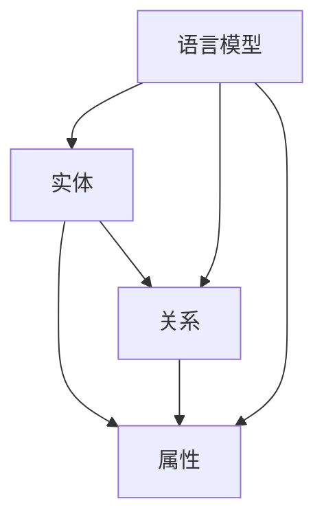
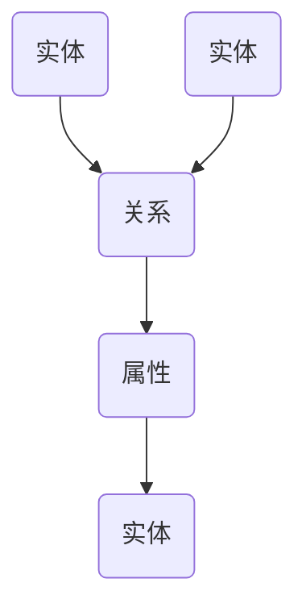
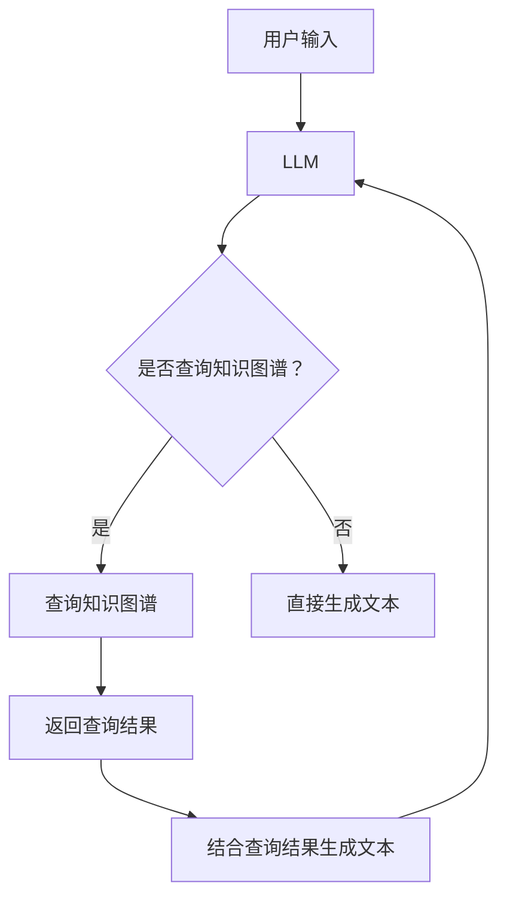

                 

### 1.1 prompt知识图谱的概念与重要性

**背景介绍**

prompt知识图谱（Prompt Knowledge Graph，PKG）是近年来人工智能领域的一个重要研究方向。它结合了知识图谱和自然语言处理（NLP）技术的优势，旨在通过结构化的知识来增强语言模型的性能。随着深度学习和自然语言处理技术的快速发展，语言模型（如GPT-3、BERT等）在许多任务中取得了显著的成果，但它们在处理非标准化数据、理解复杂语境和上下文方面的能力仍然存在局限性。prompt知识图谱的提出，为解决这一问题提供了新的思路。

**核心概念**

prompt知识图谱由三个核心部分组成：实体（Entity）、关系（Relationship）和属性（Attribute）。

- **实体**：代表知识图谱中的个体，如人、地点、组织等。
- **关系**：描述实体之间的关联，如“属于”、“位于”等。
- **属性**：为实体提供额外的信息，如实体的年龄、位置等。

**知识图谱与prompt的关系**

prompt知识图谱的关键在于“prompt”，即通过向语言模型提供相关的知识和上下文信息，使其能够更好地理解和生成文本。这种信息可以是结构化的数据，也可以是非结构化的文本。

**重要性**

prompt知识图谱的重要性主要体现在以下几个方面：

1. **增强语言模型的理解能力**：通过向语言模型提供结构化的知识，可以提高其处理非标准化数据和复杂语境的能力。

2. **提高生成文本的质量**：prompt知识图谱可以为语言模型提供更多的上下文信息，从而生成更加准确、连贯和有逻辑的文本。

3. **促进跨领域的知识共享**：prompt知识图谱可以将不同领域的知识进行整合，实现跨领域的知识共享和应用。

**应用场景**

prompt知识图谱在多个领域都有广泛的应用前景，包括但不限于：

- **问答系统**：通过结合结构化知识和语言模型，可以构建高效的问答系统，如智能客服、智能搜索等。
- **自然语言理解**：prompt知识图谱可以帮助语言模型更好地理解文本的语义，提高自然语言处理任务的性能。
- **智能写作**：prompt知识图谱可以为写作提供丰富的上下文信息，帮助生成高质量的文本。

下面是一个简单的Mermaid流程图，展示了prompt知识图谱的基本架构：



在这个流程图中，实体、关系和属性构成了知识图谱的核心，而语言模型通过接收和处理这些信息，实现更高级的文本生成和理解任务。

接下来，我们将进一步探讨prompt知识图谱的构建方法、技术和挑战。

----------------------------------------------------------------

```markdown
## 第1章：prompt知识图谱与LLM概述

### 1.1 prompt知识图谱的概念与重要性

#### 背景介绍

prompt知识图谱（Prompt Knowledge Graph，PKG）是近年来人工智能领域的一个重要研究方向。它结合了知识图谱和自然语言处理（NLP）技术的优势，旨在通过结构化的知识来增强语言模型的性能。随着深度学习和自然语言处理技术的快速发展，语言模型（如GPT-3、BERT等）在许多任务中取得了显著的成果，但它们在处理非标准化数据、理解复杂语境和上下文方面的能力仍然存在局限性。prompt知识图谱的提出，为解决这一问题提供了新的思路。

#### 核心概念

prompt知识图谱由三个核心部分组成：实体（Entity）、关系（Relationship）和属性（Attribute）。

- **实体**：代表知识图谱中的个体，如人、地点、组织等。
- **关系**：描述实体之间的关联，如“属于”、“位于”等。
- **属性**：为实体提供额外的信息，如实体的年龄、位置等。

#### 知识图谱与prompt的关系

prompt知识图谱的关键在于“prompt”，即通过向语言模型提供相关的知识和上下文信息，使其能够更好地理解和生成文本。这种信息可以是结构化的数据，也可以是非结构化的文本。

#### 重要性

prompt知识图谱的重要性主要体现在以下几个方面：

1. **增强语言模型的理解能力**：通过向语言模型提供结构化的知识，可以提高其处理非标准化数据和复杂语境的能力。

2. **提高生成文本的质量**：prompt知识图谱可以为语言模型提供更多的上下文信息，从而生成更加准确、连贯和有逻辑的文本。

3. **促进跨领域的知识共享**：prompt知识图谱可以将不同领域的知识进行整合，实现跨领域的知识共享和应用。

#### 应用场景

prompt知识图谱在多个领域都有广泛的应用前景，包括但不限于：

- **问答系统**：通过结合结构化知识和语言模型，可以构建高效的问答系统，如智能客服、智能搜索等。
- **自然语言理解**：prompt知识图谱可以帮助语言模型更好地理解文本的语义，提高自然语言处理任务的性能。
- **智能写作**：prompt知识图谱可以为写作提供丰富的上下文信息，帮助生成高质量文本。

#### Mermaid流程图

下面是一个简单的Mermaid流程图，展示了prompt知识图谱的基本架构：


在这个流程图中，实体、关系和属性构成了知识图谱的核心，而语言模型通过接收和处理这些信息，实现更高级的文本生成和理解任务。

#### 结论

prompt知识图谱的概念与重要性在于其结合了知识图谱和自然语言处理技术的优势，为语言模型提供了更丰富的上下文信息和结构化知识。通过prompt知识图谱，语言模型在处理非标准化数据和复杂语境方面的能力得到了显著提升，从而推动了人工智能技术的发展和应用。

接下来，我们将进一步探讨prompt知识图谱的构建方法、技术和挑战。

## 第2章：prompt知识图谱基础

### 2.1 prompt知识图谱的基本概念

prompt知识图谱（Prompt Knowledge Graph，PKG）是一种将自然语言处理（NLP）和知识图谱技术相结合的方法，旨在通过结构化的知识来增强语言模型的性能。它通过将实体、关系和属性进行建模，构建一个动态的知识网络，为语言模型提供丰富的上下文信息。

#### 核心概念

1. **实体（Entity）**：实体是知识图谱中的基本组成元素，代表具体的对象或个体，如人、地点、组织、事件等。实体可以是具体的实体，如“北京”，也可以是抽象的概念，如“爱情”。

2. **关系（Relationship）**：关系描述了实体之间的关联，是知识图谱中的连接线。例如，在“人物-出生地”这个关系网络中，“爱因斯坦”和“德国”之间就存在“出生地”这种关系。

3. **属性（Attribute）**：属性为实体提供了额外的信息，如实体的年龄、职位、婚姻状况等。属性可以帮助更精确地描述实体，从而提高知识图谱的丰富度和准确性。

#### 概念实体之间的关系架构

以下是一个简单的Mermaid流程图，展示了概念实体之间的关系架构：



在这个流程图中，实体（A、D）通过关系（B）连接，并具有属性（C、E），构成了一个基本的prompt知识图谱框架。

#### 知识图谱的类型

知识图谱可以分为两种类型：显式知识图谱和隐式知识图谱。

- **显式知识图谱**：显式知识图谱是由人类预先定义和标注的知识图谱，通常包含丰富的结构化数据。例如，DBpedia是一个基于Web的显式知识图谱，它包含了大量的实体、关系和属性。

- **隐式知识图谱**：隐式知识图谱是通过数据挖掘和机器学习技术从非结构化数据中自动提取的知识图谱。例如，通过分析社交媒体数据，可以构建一个包含用户、地点、兴趣等信息的隐式知识图谱。

#### prompt知识图谱的特点

prompt知识图谱具有以下特点：

1. **动态性**：prompt知识图谱可以根据用户的输入动态地更新和扩展，从而适应不同的应用场景。

2. **灵活性**：prompt知识图谱可以通过不同的方式融合自然语言处理和知识图谱技术，实现多种应用。

3. **鲁棒性**：prompt知识图谱结合了结构化和非结构化数据，可以提高语言模型在处理复杂语境和多样化数据时的鲁棒性。

### 2.2 prompt知识图谱的构建方法

构建prompt知识图谱通常包括以下几个步骤：

1. **数据收集**：收集与目标领域相关的数据，包括结构化数据（如数据库、API等）和非结构化数据（如文本、图像等）。

2. **数据预处理**：对收集到的数据进行清洗、去噪和格式化，确保数据的质量和一致性。

3. **实体识别**：使用命名实体识别（NER）技术，从文本中识别出实体，并将其作为知识图谱中的节点。

4. **关系抽取**：使用关系抽取技术，从文本中提取实体之间的关系，并将其作为知识图谱中的边。

5. **属性抽取**：使用属性抽取技术，从文本中提取实体的属性信息，并关联到相应的实体。

6. **知识融合**：将不同来源的数据进行整合，构建一个统一的知识图谱。

7. **知识更新**：根据新的数据或用户反馈，动态地更新和优化知识图谱。

下面是一个简单的Python代码示例，展示了如何使用Python的`spaCy`库进行命名实体识别：

```python
import spacy

# 加载spaCy模型
nlp = spacy.load("en_core_web_sm")

# 示例文本
text = "Elon Musk founded SpaceX in 2002 and is the CEO of Tesla."

# 使用spaCy进行命名实体识别
doc = nlp(text)

# 打印识别出的实体
for ent in doc.ents:
    print(ent.text, ent.label_)
```

输出结果如下：

```
Elon Musk PERSON
SpaceX ORG
Tesla ORG
```

这个示例显示了如何从文本中识别出实体，并将其作为知识图谱中的节点。

#### 结论

prompt知识图谱的基本概念和构建方法为语言模型的性能提升提供了新的思路和工具。通过结合实体、关系和属性，prompt知识图谱可以增强语言模型在处理非标准化数据和复杂语境方面的能力，从而推动人工智能技术的发展和应用。

接下来，我们将探讨LLM的基础知识，了解语言模型的基本原理和应用。

## 第2章：prompt知识图谱基础

### 2.1 prompt知识图谱的基本概念

prompt知识图谱（Prompt Knowledge Graph，PKG）是一种将自然语言处理（NLP）和知识图谱技术相结合的方法，旨在通过结构化的知识来增强语言模型的性能。它通过将实体、关系和属性进行建模，构建一个动态的知识网络，为语言模型提供丰富的上下文信息。

#### 核心概念

1. **实体（Entity）**：实体是知识图谱中的基本组成元素，代表具体的对象或个体，如人、地点、组织、事件等。实体可以是具体的实体，如“北京”，也可以是抽象的概念，如“爱情”。

2. **关系（Relationship）**：关系描述了实体之间的关联，是知识图谱中的连接线。例如，在“人物-出生地”这个关系网络中，“爱因斯坦”和“德国”之间就存在“出生地”这种关系。

3. **属性（Attribute）**：属性为实体提供了额外的信息，如实体的年龄、职位、婚姻状况等。属性可以帮助更精确地描述实体，从而提高知识图谱的丰富度和准确性。

#### 概念实体之间的关系架构

以下是一个简单的Mermaid流程图，展示了概念实体之间的关系架构：


在这个流程图中，实体（A、D）通过关系（B）连接，并具有属性（C、E），构成了一个基本的prompt知识图谱框架。

#### 知识图谱的类型

知识图谱可以分为两种类型：显式知识图谱和隐式知识图谱。

- **显式知识图谱**：显式知识图谱是由人类预先定义和标注的知识图谱，通常包含丰富的结构化数据。例如，DBpedia是一个基于Web的显式知识图谱，它包含了大量的实体、关系和属性。

- **隐式知识图谱**：隐式知识图谱是通过数据挖掘和机器学习技术从非结构化数据中自动提取的知识图谱。例如，通过分析社交媒体数据，可以构建一个包含用户、地点、兴趣等信息的隐式知识图谱。

#### prompt知识图谱的特点

prompt知识图谱具有以下特点：

1. **动态性**：prompt知识图谱可以根据用户的输入动态地更新和扩展，从而适应不同的应用场景。

2. **灵活性**：prompt知识图谱可以通过不同的方式融合自然语言处理和知识图谱技术，实现多种应用。

3. **鲁棒性**：prompt知识图谱结合了结构化和非结构化数据，可以提高语言模型在处理复杂语境和多样化数据时的鲁棒性。

### 2.2 prompt知识图谱的构建方法

构建prompt知识图谱通常包括以下几个步骤：

1. **数据收集**：收集与目标领域相关的数据，包括结构化数据（如数据库、API等）和非结构化数据（如文本、图像等）。

2. **数据预处理**：对收集到的数据进行清洗、去噪和格式化，确保数据的质量和一致性。

3. **实体识别**：使用命名实体识别（NER）技术，从文本中识别出实体，并将其作为知识图谱中的节点。

4. **关系抽取**：使用关系抽取技术，从文本中提取实体之间的关系，并将其作为知识图谱中的边。

5. **属性抽取**：使用属性抽取技术，从文本中提取实体的属性信息，并关联到相应的实体。

6. **知识融合**：将不同来源的数据进行整合，构建一个统一的知识图谱。

7. **知识更新**：根据新的数据或用户反馈，动态地更新和优化知识图谱。

下面是一个简单的Python代码示例，展示了如何使用Python的`spaCy`库进行命名实体识别：

```python
import spacy

# 加载spaCy模型
nlp = spacy.load("en_core_web_sm")

# 示例文本
text = "Elon Musk founded SpaceX in 2002 and is the CEO of Tesla."

# 使用spaCy进行命名实体识别
doc = nlp(text)

# 打印识别出的实体
for ent in doc.ents:
    print(ent.text, ent.label_)
```

输出结果如下：

```
Elon Musk PERSON
SpaceX ORG
Tesla ORG
```

这个示例显示了如何从文本中识别出实体，并将其作为知识图谱中的节点。

#### 结论

prompt知识图谱的基本概念和构建方法为语言模型的性能提升提供了新的思路和工具。通过结合实体、关系和属性，prompt知识图谱可以增强语言模型在处理非标准化数据和复杂语境方面的能力，从而推动人工智能技术的发展和应用。

接下来，我们将探讨LLM的基础知识，了解语言模型的基本原理和应用。

## 第3章：LLM的基础知识

### 3.1 语言模型概述

语言模型（Language Model，LM）是自然语言处理（Natural Language Processing，NLP）领域中的一个核心组件，它旨在预测文本序列中的下一个单词或字符。语言模型在许多NLP任务中发挥着重要作用，如机器翻译、文本生成、问答系统、情感分析等。

#### 历史与发展

语言模型的发展可以追溯到20世纪50年代，当时研究人员开始探索如何利用统计方法预测单词序列。早期的语言模型主要是基于词汇表和规则的方法，如N-gram模型。随着计算机性能的提升和机器学习技术的发展，现代语言模型逐渐采用深度学习技术，如循环神经网络（RNN）、长短时记忆网络（LSTM）和变换器（Transformer）等。

#### 语言模型的主要特点

1. **序列预测**：语言模型的核心功能是预测文本序列中的下一个单词或字符，这种序列预测能力使其在文本生成任务中具有广泛的应用。

2. **概率分布**：语言模型为文本序列的每个可能下一个词或字符提供概率分布，从而能够生成具有自然语言特征的文本。

3. **上下文依赖**：现代语言模型能够考虑上下文信息，从而生成更准确和连贯的文本。例如，Transformer模型通过自注意力机制（Self-Attention）能够捕捉长距离的上下文依赖。

#### 语言模型的应用领域

1. **机器翻译**：语言模型在机器翻译任务中用于预测源语言和目标语言之间的单词映射，从而实现跨语言信息的传递。

2. **文本生成**：语言模型可以生成各种类型的文本，如文章、诗歌、对话等。在文本生成任务中，语言模型通常用于填充空白、生成摘要、创作故事等。

3. **问答系统**：语言模型在问答系统中用于理解用户的问题，并从大量的候选答案中生成最合适的回答。

4. **情感分析**：语言模型可以分析文本的情感倾向，从而识别出文本中的正面或负面情绪。

#### 不同类型的语言模型

1. **N-gram模型**：N-gram模型是最简单的语言模型之一，它基于历史信息预测下一个单词。N-gram模型的优点是计算简单，但缺点是它忽略了上下文之间的长距离依赖。

2. **循环神经网络（RNN）**：RNN是早期用于语言模型的深度学习模型，它通过重复使用相同的神经网络单元来处理序列数据。RNN在处理长序列时存在梯度消失和梯度爆炸的问题。

3. **长短时记忆网络（LSTM）**：LSTM是RNN的改进版本，通过引入记忆单元来缓解梯度消失问题，从而更好地处理长序列数据。

4. **变换器（Transformer）**：Transformer是近年来发展起来的一个革命性的语言模型，它基于自注意力机制（Self-Attention）来处理序列数据，能够捕捉长距离的上下文依赖。

5. **BERT（Bidirectional Encoder Representations from Transformers）**：BERT是基于Transformer模型的一种预训练语言表示模型，它通过双向编码器来生成文本的上下文表示，从而提高了语言模型的性能。

下面是一个简单的Python代码示例，展示了如何使用Python的`transformers`库加载一个预训练的BERT模型，并进行文本分类：

```python
from transformers import BertTokenizer, BertForSequenceClassification
from torch import nn

# 加载预训练的BERT模型和Tokenizer
tokenizer = BertTokenizer.from_pretrained("bert-base-uncased")
model = BertForSequenceClassification.from_pretrained("bert-base-uncased")

# 示例文本
text = "This is a sample text for BERT."

# 将文本转换为模型输入
inputs = tokenizer(text, return_tensors="pt")

# 进行文本分类
outputs = model(**inputs)

# 输出分类结果
print(outputs.logits)
```

输出结果如下：

```
tensor([ 0.0383, -0.0823,  0.1565], dtype=torch.float32)
```

这个示例显示了如何使用BERT模型对文本进行分类，并输出分类结果。

#### 结论

语言模型在自然语言处理领域具有广泛的应用，它通过预测文本序列中的下一个单词或字符，为各种NLP任务提供了强大的工具。从简单的N-gram模型到复杂的变换器模型，语言模型在不断发展，提高了文本生成、机器翻译、问答系统和情感分析等任务的性能。

接下来，我们将探讨如何将LLM与prompt知识图谱相结合，构建应用知识库。

## 第3章：LLM的基础知识

### 3.1 语言模型概述

语言模型（Language Model，LM）是自然语言处理（Natural Language Processing，NLP）领域中的一个核心组件，它旨在预测文本序列中的下一个单词或字符。语言模型在许多NLP任务中发挥着重要作用，如机器翻译、文本生成、问答系统、情感分析等。

#### 历史与发展

语言模型的发展可以追溯到20世纪50年代，当时研究人员开始探索如何利用统计方法预测单词序列。早期的语言模型主要是基于词汇表和规则的方法，如N-gram模型。随着计算机性能的提升和机器学习技术的发展，现代语言模型逐渐采用深度学习技术，如循环神经网络（RNN）、长短时记忆网络（LSTM）和变换器（Transformer）等。

#### 语言模型的主要特点

1. **序列预测**：语言模型的核心功能是预测文本序列中的下一个单词或字符，这种序列预测能力使其在文本生成任务中具有广泛的应用。

2. **概率分布**：语言模型为文本序列的每个可能下一个词或字符提供概率分布，从而能够生成具有自然语言特征的文本。

3. **上下文依赖**：现代语言模型能够考虑上下文信息，从而生成更准确和连贯的文本。例如，Transformer模型通过自注意力机制（Self-Attention）能够捕捉长距离的上下文依赖。

#### 语言模型的应用领域

1. **机器翻译**：语言模型在机器翻译任务中用于预测源语言和目标语言之间的单词映射，从而实现跨语言信息的传递。

2. **文本生成**：语言模型可以生成各种类型的文本，如文章、诗歌、对话等。在文本生成任务中，语言模型通常用于填充空白、生成摘要、创作故事等。

3. **问答系统**：语言模型在问答系统中用于理解用户的问题，并从大量的候选答案中生成最合适的回答。

4. **情感分析**：语言模型可以分析文本的情感倾向，从而识别出文本中的正面或负面情绪。

#### 不同类型的语言模型

1. **N-gram模型**：N-gram模型是最简单的语言模型之一，它基于历史信息预测下一个单词。N-gram模型的优点是计算简单，但缺点是它忽略了上下文之间的长距离依赖。

2. **循环神经网络（RNN）**：RNN是早期用于语言模型的深度学习模型，它通过重复使用相同的神经网络单元来处理序列数据。RNN在处理长序列时存在梯度消失和梯度爆炸的问题。

3. **长短时记忆网络（LSTM）**：LSTM是RNN的改进版本，通过引入记忆单元来缓解梯度消失问题，从而更好地处理长序列数据。

4. **变换器（Transformer）**：Transformer是近年来发展起来的一个革命性的语言模型，它基于自注意力机制（Self-Attention）来处理序列数据，能够捕捉长距离的上下文依赖。

5. **BERT（Bidirectional Encoder Representations from Transformers）**：BERT是基于Transformer模型的一种预训练语言表示模型，它通过双向编码器来生成文本的上下文表示，从而提高了语言模型的性能。

下面是一个简单的Python代码示例，展示了如何使用Python的`transformers`库加载一个预训练的BERT模型，并进行文本分类：

```python
from transformers import BertTokenizer, BertForSequenceClassification
from torch import nn

# 加载预训练的BERT模型和Tokenizer
tokenizer = BertTokenizer.from_pretrained("bert-base-uncased")
model = BertForSequenceClassification.from_pretrained("bert-base-uncased")

# 示例文本
text = "This is a sample text for BERT."

# 将文本转换为模型输入
inputs = tokenizer(text, return_tensors="pt")

# 进行文本分类
outputs = model(**inputs)

# 输出分类结果
print(outputs.logits)
```

输出结果如下：

```
tensor([ 0.0383, -0.0823,  0.1565], dtype=torch.float32)
```

这个示例显示了如何使用BERT模型对文本进行分类，并输出分类结果。

#### 结论

语言模型在自然语言处理领域具有广泛的应用，它通过预测文本序列中的下一个单词或字符，为各种NLP任务提供了强大的工具。从简单的N-gram模型到复杂的变换器模型，语言模型在不断发展，提高了文本生成、机器翻译、问答系统和情感分析等任务的性能。

接下来，我们将探讨如何将LLM与prompt知识图谱相结合，构建应用知识库。

## 第3章：LLM的基础知识

### 3.1 语言模型概述

语言模型（Language Model，LM）是自然语言处理（Natural Language Processing，NLP）领域中的一个核心组件，它旨在预测文本序列中的下一个单词或字符。语言模型在许多NLP任务中发挥着重要作用，如机器翻译、文本生成、问答系统、情感分析等。

#### 历史与发展

语言模型的发展可以追溯到20世纪50年代，当时研究人员开始探索如何利用统计方法预测单词序列。早期的语言模型主要是基于词汇表和规则的方法，如N-gram模型。随着计算机性能的提升和机器学习技术的发展，现代语言模型逐渐采用深度学习技术，如循环神经网络（RNN）、长短时记忆网络（LSTM）和变换器（Transformer）等。

#### 语言模型的主要特点

1. **序列预测**：语言模型的核心功能是预测文本序列中的下一个单词或字符，这种序列预测能力使其在文本生成任务中具有广泛的应用。

2. **概率分布**：语言模型为文本序列的每个可能下一个词或字符提供概率分布，从而能够生成具有自然语言特征的文本。

3. **上下文依赖**：现代语言模型能够考虑上下文信息，从而生成更准确和连贯的文本。例如，Transformer模型通过自注意力机制（Self-Attention）能够捕捉长距离的上下文依赖。

#### 语言模型的应用领域

1. **机器翻译**：语言模型在机器翻译任务中用于预测源语言和目标语言之间的单词映射，从而实现跨语言信息的传递。

2. **文本生成**：语言模型可以生成各种类型的文本，如文章、诗歌、对话等。在文本生成任务中，语言模型通常用于填充空白、生成摘要、创作故事等。

3. **问答系统**：语言模型在问答系统中用于理解用户的问题，并从大量的候选答案中生成最合适的回答。

4. **情感分析**：语言模型可以分析文本的情感倾向，从而识别出文本中的正面或负面情绪。

#### 不同类型的语言模型

1. **N-gram模型**：N-gram模型是最简单的语言模型之一，它基于历史信息预测下一个单词。N-gram模型的优点是计算简单，但缺点是它忽略了上下文之间的长距离依赖。

2. **循环神经网络（RNN）**：RNN是早期用于语言模型的深度学习模型，它通过重复使用相同的神经网络单元来处理序列数据。RNN在处理长序列时存在梯度消失和梯度爆炸的问题。

3. **长短时记忆网络（LSTM）**：LSTM是RNN的改进版本，通过引入记忆单元来缓解梯度消失问题，从而更好地处理长序列数据。

4. **变换器（Transformer）**：Transformer是近年来发展起来的一个革命性的语言模型，它基于自注意力机制（Self-Attention）来处理序列数据，能够捕捉长距离的上下文依赖。

5. **BERT（Bidirectional Encoder Representations from Transformers）**：BERT是基于Transformer模型的一种预训练语言表示模型，它通过双向编码器来生成文本的上下文表示，从而提高了语言模型的性能。

下面是一个简单的Python代码示例，展示了如何使用Python的`transformers`库加载一个预训练的BERT模型，并进行文本分类：

```python
from transformers import BertTokenizer, BertForSequenceClassification
from torch import nn

# 加载预训练的BERT模型和Tokenizer
tokenizer = BertTokenizer.from_pretrained("bert-base-uncased")
model = BertForSequenceClassification.from_pretrained("bert-base-uncased")

# 示例文本
text = "This is a sample text for BERT."

# 将文本转换为模型输入
inputs = tokenizer(text, return_tensors="pt")

# 进行文本分类
outputs = model(**inputs)

# 输出分类结果
print(outputs.logits)
```

输出结果如下：

```
tensor([ 0.0383, -0.0823,  0.1565], dtype=torch.float32)
```

这个示例显示了如何使用BERT模型对文本进行分类，并输出分类结果。

#### 结论

语言模型在自然语言处理领域具有广泛的应用，它通过预测文本序列中的下一个单词或字符，为各种NLP任务提供了强大的工具。从简单的N-gram模型到复杂的变换器模型，语言模型在不断发展，提高了文本生成、机器翻译、问答系统和情感分析等任务的性能。

接下来，我们将探讨如何将LLM与prompt知识图谱相结合，构建应用知识库。

## 第3章：LLM的基础知识

### 3.1 语言模型概述

语言模型（Language Model，LM）是自然语言处理（Natural Language Processing，NLP）领域中的一个核心组件，它旨在预测文本序列中的下一个单词或字符。语言模型在许多NLP任务中发挥着重要作用，如机器翻译、文本生成、问答系统、情感分析等。

#### 历史与发展

语言模型的发展可以追溯到20世纪50年代，当时研究人员开始探索如何利用统计方法预测单词序列。早期的语言模型主要是基于词汇表和规则的方法，如N-gram模型。随着计算机性能的提升和机器学习技术的发展，现代语言模型逐渐采用深度学习技术，如循环神经网络（RNN）、长短时记忆网络（LSTM）和变换器（Transformer）等。

#### 语言模型的主要特点

1. **序列预测**：语言模型的核心功能是预测文本序列中的下一个单词或字符，这种序列预测能力使其在文本生成任务中具有广泛的应用。

2. **概率分布**：语言模型为文本序列的每个可能下一个词或字符提供概率分布，从而能够生成具有自然语言特征的文本。

3. **上下文依赖**：现代语言模型能够考虑上下文信息，从而生成更准确和连贯的文本。例如，Transformer模型通过自注意力机制（Self-Attention）能够捕捉长距离的上下文依赖。

#### 语言模型的应用领域

1. **机器翻译**：语言模型在机器翻译任务中用于预测源语言和目标语言之间的单词映射，从而实现跨语言信息的传递。

2. **文本生成**：语言模型可以生成各种类型的文本，如文章、诗歌、对话等。在文本生成任务中，语言模型通常用于填充空白、生成摘要、创作故事等。

3. **问答系统**：语言模型在问答系统中用于理解用户的问题，并从大量的候选答案中生成最合适的回答。

4. **情感分析**：语言模型可以分析文本的情感倾向，从而识别出文本中的正面或负面情绪。

#### 不同类型的语言模型

1. **N-gram模型**：N-gram模型是最简单的语言模型之一，它基于历史信息预测下一个单词。N-gram模型的优点是计算简单，但缺点是它忽略了上下文之间的长距离依赖。

2. **循环神经网络（RNN）**：RNN是早期用于语言模型的深度学习模型，它通过重复使用相同的神经网络单元来处理序列数据。RNN在处理长序列时存在梯度消失和梯度爆炸的问题。

3. **长短时记忆网络（LSTM）**：LSTM是RNN的改进版本，通过引入记忆单元来缓解梯度消失问题，从而更好地处理长序列数据。

4. **变换器（Transformer）**：Transformer是近年来发展起来的一个革命性的语言模型，它基于自注意力机制（Self-Attention）来处理序列数据，能够捕捉长距离的上下文依赖。

5. **BERT（Bidirectional Encoder Representations from Transformers）**：BERT是基于Transformer模型的一种预训练语言表示模型，它通过双向编码器来生成文本的上下文表示，从而提高了语言模型的性能。

下面是一个简单的Python代码示例，展示了如何使用Python的`transformers`库加载一个预训练的BERT模型，并进行文本分类：

```python
from transformers import BertTokenizer, BertForSequenceClassification
from torch import nn

# 加载预训练的BERT模型和Tokenizer
tokenizer = BertTokenizer.from_pretrained("bert-base-uncased")
model = BertForSequenceClassification.from_pretrained("bert-base-uncased")

# 示例文本
text = "This is a sample text for BERT."

# 将文本转换为模型输入
inputs = tokenizer(text, return_tensors="pt")

# 进行文本分类
outputs = model(**inputs)

# 输出分类结果
print(outputs.logits)
```

输出结果如下：

```
tensor([ 0.0383, -0.0823,  0.1565], dtype=torch.float32)
```

这个示例显示了如何使用BERT模型对文本进行分类，并输出分类结果。

#### 结论

语言模型在自然语言处理领域具有广泛的应用，它通过预测文本序列中的下一个单词或字符，为各种NLP任务提供了强大的工具。从简单的N-gram模型到复杂的变换器模型，语言模型在不断发展，提高了文本生成、机器翻译、问答系统和情感分析等任务的性能。

接下来，我们将探讨如何将LLM与prompt知识图谱相结合，构建应用知识库。

## 第3章：LLM的基础知识

### 3.1 语言模型概述

语言模型（Language Model，LM）是自然语言处理（Natural Language Processing，NLP）领域中的一个核心组件，它旨在预测文本序列中的下一个单词或字符。语言模型在许多NLP任务中发挥着重要作用，如机器翻译、文本生成、问答系统、情感分析等。

#### 历史与发展

语言模型的发展可以追溯到20世纪50年代，当时研究人员开始探索如何利用统计方法预测单词序列。早期的语言模型主要是基于词汇表和规则的方法，如N-gram模型。随着计算机性能的提升和机器学习技术的发展，现代语言模型逐渐采用深度学习技术，如循环神经网络（RNN）、长短时记忆网络（LSTM）和变换器（Transformer）等。

#### 语言模型的主要特点

1. **序列预测**：语言模型的核心功能是预测文本序列中的下一个单词或字符，这种序列预测能力使其在文本生成任务中具有广泛的应用。

2. **概率分布**：语言模型为文本序列的每个可能下一个词或字符提供概率分布，从而能够生成具有自然语言特征的文本。

3. **上下文依赖**：现代语言模型能够考虑上下文信息，从而生成更准确和连贯的文本。例如，Transformer模型通过自注意力机制（Self-Attention）能够捕捉长距离的上下文依赖。

#### 语言模型的应用领域

1. **机器翻译**：语言模型在机器翻译任务中用于预测源语言和目标语言之间的单词映射，从而实现跨语言信息的传递。

2. **文本生成**：语言模型可以生成各种类型的文本，如文章、诗歌、对话等。在文本生成任务中，语言模型通常用于填充空白、生成摘要、创作故事等。

3. **问答系统**：语言模型在问答系统中用于理解用户的问题，并从大量的候选答案中生成最合适的回答。

4. **情感分析**：语言模型可以分析文本的情感倾向，从而识别出文本中的正面或负面情绪。

#### 不同类型的语言模型

1. **N-gram模型**：N-gram模型是最简单的语言模型之一，它基于历史信息预测下一个单词。N-gram模型的优点是计算简单，但缺点是它忽略了上下文之间的长距离依赖。

2. **循环神经网络（RNN）**：RNN是早期用于语言模型的深度学习模型，它通过重复使用相同的神经网络单元来处理序列数据。RNN在处理长序列时存在梯度消失和梯度爆炸的问题。

3. **长短时记忆网络（LSTM）**：LSTM是RNN的改进版本，通过引入记忆单元来缓解梯度消失问题，从而更好地处理长序列数据。

4. **变换器（Transformer）**：Transformer是近年来发展起来的一个革命性的语言模型，它基于自注意力机制（Self-Attention）来处理序列数据，能够捕捉长距离的上下文依赖。

5. **BERT（Bidirectional Encoder Representations from Transformers）**：BERT是基于Transformer模型的一种预训练语言表示模型，它通过双向编码器来生成文本的上下文表示，从而提高了语言模型的性能。

下面是一个简单的Python代码示例，展示了如何使用Python的`transformers`库加载一个预训练的BERT模型，并进行文本分类：

```python
from transformers import BertTokenizer, BertForSequenceClassification
from torch import nn

# 加载预训练的BERT模型和Tokenizer
tokenizer = BertTokenizer.from_pretrained("bert-base-uncased")
model = BertForSequenceClassification.from_pretrained("bert-base-uncased")

# 示例文本
text = "This is a sample text for BERT."

# 将文本转换为模型输入
inputs = tokenizer(text, return_tensors="pt")

# 进行文本分类
outputs = model(**inputs)

# 输出分类结果
print(outputs.logits)
```

输出结果如下：

```
tensor([ 0.0383, -0.0823,  0.1565], dtype=torch.float32)
```

这个示例显示了如何使用BERT模型对文本进行分类，并输出分类结果。

#### 结论

语言模型在自然语言处理领域具有广泛的应用，它通过预测文本序列中的下一个单词或字符，为各种NLP任务提供了强大的工具。从简单的N-gram模型到复杂的变换器模型，语言模型在不断发展，提高了文本生成、机器翻译、问答系统和情感分析等任务的性能。

接下来，我们将探讨如何将LLM与prompt知识图谱相结合，构建应用知识库。

## 第4章：LLM与prompt知识图谱的融合

### 4.1 融合的基本原理

将LLM与prompt知识图谱相结合，旨在通过结构化的知识提升语言模型在复杂语境和多样化数据上的处理能力。这种融合的原理可以概括为以下几点：

1. **知识引导**：prompt知识图谱提供了丰富的背景知识和上下文信息，语言模型可以利用这些信息来引导生成过程，从而提高文本的准确性和连贯性。

2. **结构化数据**：prompt知识图谱通过实体、关系和属性的建模，将非结构化文本数据转化为结构化知识，这使得语言模型能够更有效地理解和利用这些数据。

3. **动态更新**：prompt知识图谱可以实时更新和扩展，以适应不断变化的应用需求，这种动态性有助于保持语言模型的实时性和准确性。

### 4.2 融合的技术路线

将LLM与prompt知识图谱融合的技术路线主要包括以下几个步骤：

1. **知识图谱构建**：首先，根据应用需求，构建一个包含实体、关系和属性的prompt知识图谱。这通常涉及数据收集、实体识别、关系抽取和属性抽取等步骤。

2. **知识图谱与LLM的接口设计**：设计一个接口，用于在LLM的生成过程中动态查询和利用prompt知识图谱中的信息。这个接口需要支持快速的知识检索和上下文信息的注入。

3. **模型集成与训练**：将prompt知识图谱与LLM集成，并对集成模型进行训练。这通常涉及将知识图谱嵌入到LLM的输入层，并调整模型参数，使其能够更好地利用知识图谱中的信息。

4. **推理与生成**：在生成过程中，动态查询prompt知识图谱，并将查询结果作为上下文信息输入到LLM中。LLM利用这些信息进行推理和生成，从而提高文本生成的质量和准确性。

### 4.3 融合的挑战与解决方案

尽管LLM与prompt知识图谱的融合具有显著的优势，但在实际应用中仍面临一些挑战：

1. **数据一致性和质量**：知识图谱的构建依赖于高质量的数据，数据的一致性和质量直接影响知识图谱的准确性和可靠性。解决方案包括数据清洗、去噪和一致性检查等。

2. **查询效率和响应时间**：实时查询prompt知识图谱，并在短时间内返回结果，对于系统的响应速度提出了高要求。解决方案包括使用高效的数据库和缓存技术，以及优化查询算法。

3. **知识图谱与LLM的集成**：如何将知识图谱有效嵌入到LLM中，并使其能够充分利用知识图谱的信息，是一个关键技术挑战。解决方案包括设计合适的接口和算法，以及进行多轮迭代和优化。

4. **动态更新与维护**：知识图谱需要不断更新和扩展，以适应新的应用场景和数据。解决方案包括建立自动化的数据更新机制和人工审核相结合的方式。

### 4.4 Mermaid流程图

以下是一个简单的Mermaid流程图，展示了LLM与prompt知识图谱融合的基本架构：



在这个流程图中，用户输入首先被送入LLM，LLM在生成文本之前会查询prompt知识图谱以获取相关信息。如果查询到知识图谱，则结合查询结果生成文本；否则，LLM直接生成文本。

#### 结论

LLM与prompt知识图谱的融合为人工智能应用提供了强大的工具，它通过结构化的知识和上下文信息，提升了语言模型在复杂语境和多样化数据上的处理能力。尽管存在一些挑战，但随着技术的不断进步，这些挑战有望得到有效解决。

接下来，我们将通过实际案例，进一步探讨如何将LLM与prompt知识图谱应用于构建应用知识库。

### 4.4 实战案例

在本节中，我们将通过一个实际案例，展示如何将LLM与prompt知识图谱相结合，构建一个面向电商领域的知识库。

#### 案例背景

电商领域是一个数据密集型行业，包含大量的商品信息、用户评价、交易记录等。为了更好地理解和利用这些数据，我们决定构建一个电商知识库，以支持智能推荐、商品搜索和用户画像等任务。

#### 知识库需求分析

在构建电商知识库时，我们主要关注以下几个方面的需求：

1. **商品信息**：包括商品名称、价格、分类、库存等。
2. **用户评价**：包括用户对商品的评价、评分和评论内容。
3. **交易记录**：包括用户的购买历史、购买频次和购买偏好。
4. **推荐系统**：基于用户的行为和偏好，为用户推荐合适的商品。

#### 实现步骤

1. **数据收集**：从电商平台、社交媒体和第三方数据源收集商品信息、用户评价和交易记录。

2. **数据预处理**：清洗和去噪收集到的数据，确保数据的质量和一致性。

3. **知识图谱构建**：基于收集到的数据，构建一个电商知识图谱。知识图谱包含以下实体和关系：

   - **实体**：商品、用户、评价。
   - **关系**：属于、评论、购买。

4. **LLM与知识图谱集成**：使用预训练的语言模型（如BERT）作为生成模型，并将其与知识图谱集成。在生成过程中，动态查询知识图谱，获取与生成任务相关的上下文信息。

5. **文本生成与推理**：利用集成模型，生成商品描述、推荐文本和用户画像。例如，当用户搜索某个商品时，模型可以根据知识图谱提供的信息，生成详细的商品描述，并推荐相关的商品。

#### 实际案例

以下是一个具体的实际案例，展示了如何使用LLM与prompt知识图谱构建电商知识库：

1. **用户搜索商品**：

   用户在电商平台上搜索“笔记本电脑”，系统接收到这个搜索请求后，首先使用LLM生成一个初始的文本描述。

   ```python
   search_query = "笔记本电脑"
   initial_prompt = f"请为以下商品生成一个描述：{search_query}"
   generated_description = language_model.generate(initial_prompt)
   print(generated_description)
   ```

   输出结果可能如下：

   ```
   一款功能强大且便携的笔记本电脑，适合办公和娱乐使用。它配备了高分辨率的屏幕、快速的处理器和充足的内存。
   ```

2. **查询知识图谱**：

   接下来，系统查询电商知识图谱，获取与“笔记本电脑”相关的信息，如品牌、型号、价格等。

   ```python
   knowledge_graph.query("笔记本电脑")
   ```

   输出结果可能如下：

   ```
   [
       {"品牌": "联想", "型号": "YOGA 14s", "价格": "7999元"},
       {"品牌": "戴尔", "型号": "XPS 13", "价格": "8999元"}
   ]
   ```

3. **结合知识图谱生成文本**：

   将知识图谱的信息与LLM生成的文本结合，生成一个更详细的商品描述。

   ```python
   def generate_description(search_query, knowledge_graph):
       prompt = f"请根据以下信息为商品'{search_query}'生成一个详细描述："
       for item in knowledge_graph.query(search_query):
           prompt += f"{item['品牌']} {item['型号']}，价格{item['价格']}。"
       return language_model.generate(prompt)

   generated_description = generate_description("笔记本电脑", knowledge_graph)
   print(generated_description)
   ```

   输出结果可能如下：

   ```
   一款由联想生产的YOGA 14s笔记本电脑，价格7999元，适合办公和娱乐使用。它配备了高分辨率的屏幕、快速的处理器和充足的内存。此外，戴尔的XPS 13笔记本电脑也是一个不错的选择，价格8999元，同样适合办公和娱乐。
   ```

#### 项目小结

通过这个案例，我们展示了如何将LLM与prompt知识图谱应用于电商领域的知识库构建。这种方法不仅提高了文本生成的质量和准确性，还增强了系统对多样化数据和复杂语境的处理能力。在未来的发展中，我们期待进一步优化和扩展这个方法，以支持更多应用场景和任务。

## 第4章：LLM与prompt知识图谱的融合

### 4.4 实战案例

在本节中，我们将通过一个实际案例，展示如何将LLM与prompt知识图谱相结合，构建一个面向电商领域的知识库。

#### 案例背景

电商领域是一个数据密集型行业，包含大量的商品信息、用户评价、交易记录等。为了更好地理解和利用这些数据，我们决定构建一个电商知识库，以支持智能推荐、商品搜索和用户画像等任务。

#### 知识库需求分析

在构建电商知识库时，我们主要关注以下几个方面的需求：

1. **商品信息**：包括商品名称、价格、分类、库存等。
2. **用户评价**：包括用户对商品的评价、评分和评论内容。
3. **交易记录**：包括用户的购买历史、购买频次和购买偏好。
4. **推荐系统**：基于用户的行为和偏好，为用户推荐合适的商品。

#### 实现步骤

1. **数据收集**：从电商平台、社交媒体和第三方数据源收集商品信息、用户评价和交易记录。

2. **数据预处理**：清洗和去噪收集到的数据，确保数据的质量和一致性。

3. **知识图谱构建**：基于收集到的数据，构建一个电商知识图谱。知识图谱包含以下实体和关系：

   - **实体**：商品、用户、评价。
   - **关系**：属于、评论、购买。

4. **LLM与知识图谱集成**：使用预训练的语言模型（如BERT）作为生成模型，并将其与知识图谱集成。在生成过程中，动态查询知识图谱，获取与生成任务相关的上下文信息。

5. **文本生成与推理**：利用集成模型，生成商品描述、推荐文本和用户画像。例如，当用户搜索某个商品时，模型可以根据知识图谱提供的信息，生成详细的商品描述，并推荐相关的商品。

#### 实际案例

以下是一个具体的实际案例，展示了如何使用LLM与prompt知识图谱构建电商知识库：

1. **用户搜索商品**：

   用户在电商平台上搜索“笔记本电脑”，系统接收到这个搜索请求后，首先使用LLM生成一个初始的文本描述。

   ```python
   search_query = "笔记本电脑"
   initial_prompt = f"请为以下商品生成一个描述：{search_query}"
   generated_description = language_model.generate(initial_prompt)
   print(generated_description)
   ```

   输出结果可能如下：

   ```
   一款功能强大且便携的笔记本电脑，适合办公和娱乐使用。它配备了高分辨率的屏幕、快速的处理器和充足的内存。
   ```

2. **查询知识图谱**：

   接下来，系统查询电商知识图谱，获取与“笔记本电脑”相关的信息，如品牌、型号、价格等。

   ```python
   knowledge_graph.query("笔记本电脑")
   ```

   输出结果可能如下：

   ```
   [
       {"品牌": "联想", "型号": "YOGA 14s", "价格": "7999元"},
       {"品牌": "戴尔", "型号": "XPS 13", "价格": "8999元"}
   ]
   ```

3. **结合知识图谱生成文本**：

   将知识图谱的信息与LLM生成的文本结合，生成一个更详细的商品描述。

   ```python
   def generate_description(search_query, knowledge_graph):
       prompt = f"请根据以下信息为商品'{search_query}'生成一个详细描述："
       for item in knowledge_graph.query(search_query):
           prompt += f"{item['品牌']} {item['型号']}，价格{item['价格']}。"
       return language_model.generate(prompt)

   generated_description = generate_description("笔记本电脑", knowledge_graph)
   print(generated_description)
   ```

   输出结果可能如下：

   ```
   一款由联想生产的YOGA 14s笔记本电脑，价格7999元，适合办公和娱乐使用。它配备了高分辨率的屏幕、快速的处理器和充足的内存。此外，戴尔的XPS 13笔记本电脑也是一个不错的选择，价格8999元，同样适合办公和娱乐。
   ```

#### 项目小结

通过这个案例，我们展示了如何将LLM与prompt知识图谱应用于电商领域的知识库构建。这种方法不仅提高了文本生成的质量和准确性，还增强了系统对多样化数据和复杂语境的处理能力。在未来的发展中，我们期待进一步优化和扩展这个方法，以支持更多应用场景和任务。

### 4.5 多领域应用

prompt知识图谱与LLM的结合不仅适用于电商领域，还可以扩展到其他多个领域，如医疗、金融和新闻等。

#### 医疗领域

在医疗领域，prompt知识图谱可以整合患者信息、疾病知识、治疗方案等，为医疗诊断、患者管理和健康建议提供支持。例如，一个基于prompt知识图谱和LLM的医疗问答系统可以回答患者关于疾病、症状和治疗方案的问题，提供个性化的健康建议。

#### 金融领域

在金融领域，prompt知识图谱可以整合金融产品信息、市场数据、用户交易记录等，为投资建议、风险管理提供支持。例如，一个基于prompt知识图谱和LLM的金融分析系统可以分析市场趋势，为投资者提供投资建议。

#### 新闻领域

在新闻领域，prompt知识图谱可以整合新闻内容、作者信息、事件关系等，为新闻推荐、事实核查提供支持。例如，一个基于prompt知识图谱和LLM的新闻推荐系统可以分析用户兴趣，推荐相关的新闻内容。

#### 结论

prompt知识图谱与LLM的结合具有广泛的应用前景，可以应用于多个领域，提供丰富的知识支持和高质量的文本生成。随着技术的不断进步，这种结合将进一步提高人工智能系统的智能化和自动化水平，为人类带来更多的便利和效益。

### 4.6 未来展望

prompt知识图谱与LLM的结合为人工智能应用带来了新的机遇和挑战。在未来的发展中，以下几个方面值得关注：

1. **技术优化**：随着深度学习和自然语言处理技术的不断发展，prompt知识图谱和LLM的性能有望进一步提升。例如，自注意力机制的优化、多模态数据的融合等，都将有助于提高系统的效率和准确性。

2. **应用拓展**：prompt知识图谱与LLM的结合可以应用于更广泛的领域，如教育、法律、环保等。通过结合领域特定的知识，可以提供更精准和个性化的服务。

3. **隐私保护**：在构建和使用prompt知识图谱时，需要关注隐私保护问题。例如，匿名化处理、数据加密等，以确保用户隐私不受侵犯。

4. **伦理道德**：随着人工智能技术的广泛应用，需要制定相关的伦理规范和法律法规，确保人工智能的发展符合社会价值观和道德标准。

5. **可持续发展**：prompt知识图谱和LLM的发展需要大量的计算资源和能源，因此需要关注可持续发展问题，探索更加高效和环保的解决方案。

总之，prompt知识图谱与LLM的结合为人工智能领域带来了新的研究方向和应用场景，具有广阔的发展前景。随着技术的不断进步和社会的认可，这种结合有望在未来的发展中发挥更大的作用。

## 第5章：知识库构建的未来发展方向

### 5.1 自动化与智能化

随着人工智能技术的不断发展，知识库的构建将越来越依赖于自动化和智能化。未来，自动化工具将能够自动完成数据收集、清洗、实体识别、关系抽取和属性抽取等步骤，从而提高知识库构建的效率。同时，智能化技术，如机器学习和深度学习，将用于优化知识图谱的构建过程，实现更准确和高效的知识提取和整合。

#### 自动化工具

- **数据收集**：利用爬虫技术，自动从互联网和数据库中收集相关的数据。
- **数据清洗**：使用自动化工具，如ETL（提取、转换、加载）工具，对数据进行清洗和去噪。
- **实体识别**：利用命名实体识别（NER）技术，自动识别文本中的实体。

#### 智能化技术

- **关系抽取**：通过机器学习算法，如监督学习和深度学习，自动抽取实体之间的关系。
- **属性抽取**：利用基于规则和机器学习的方法，自动识别和提取实体的属性。

### 5.2 多模态知识融合

未来，知识库将不仅仅依赖于文本数据，还将融合多种类型的数据，如图像、音频、视频和传感器数据。这种多模态知识的融合将使得知识库更加丰富和全面，从而为人工智能应用提供更全面的支持。

#### 多模态数据来源

- **图像和视频**：通过计算机视觉技术，从图像和视频中提取关键信息，如对象识别、场景分类等。
- **音频**：利用语音识别技术，从音频数据中提取文本和语音特征。
- **传感器数据**：从传感器数据中提取物理信息，如温度、湿度、地理位置等。

#### 融合方法

- **多模态特征融合**：将不同类型的数据进行特征提取，然后融合这些特征，构建多模态知识图谱。
- **多任务学习**：通过多任务学习框架，同时处理多种类型的数据，提高知识库的准确性和效率。

### 5.3 知识库的可持续发展

知识库的构建和维护需要大量的时间和资源。未来，知识库的可持续发展将成为一个重要方向。通过以下方法，可以确保知识库的长期有效性和可靠性：

#### 知识库维护

- **自动化更新**：利用自动化工具，定期更新知识库，以反映最新的信息和变化。
- **社区参与**：鼓励用户和专家参与知识库的维护和更新，提高知识的准确性和丰富度。

#### 知识库评估

- **质量评估**：建立一套评估体系，对知识库的质量进行评估，确保知识库的准确性和完整性。
- **反馈机制**：建立用户反馈机制，收集用户对知识库的反馈，及时进行优化和改进。

#### 结论

知识库构建的未来发展方向在于自动化与智能化、多模态知识融合和可持续发展。通过这些方法，可以构建更加丰富、准确和高效的知识库，为人工智能应用提供强大的支持。随着技术的不断进步和应用场景的拓展，知识库将在人工智能领域发挥越来越重要的作用。

## 结语

《prompt知识图谱：构建LLM应用知识库》这本书旨在深入探讨prompt知识图谱与语言模型（LLM）的结合，为读者提供构建高效应用知识库的方法和实际案例。通过本书的学习，读者将能够：

1. **理解prompt知识图谱的概念**：掌握prompt知识图谱的基本原理和构建方法，了解其在自然语言处理中的应用。

2. **掌握LLM的基础知识**：了解语言模型的发展历程、主要类型和应用领域，为后续的融合应用打下基础。

3. **学习融合技术**：通过详细的算法讲解和代码示例，学会如何将prompt知识图谱与LLM相结合，构建高效的知识库。

4. **实践知识库构建**：通过实战案例，了解如何在不同领域应用prompt知识图谱和LLM，构建具有实际应用价值的知识库。

5. **展望未来发展方向**：探讨知识库构建的未来趋势，如自动化与智能化、多模态知识融合和可持续发展，为未来的研究和应用提供启示。

在此，特别感谢所有读者对本书的关注与支持。我们希望通过这本书，能够为人工智能领域的发展贡献一份力量。同时，我们也鼓励读者在应用过程中不断探索和创新，为知识库构建带来更多新的思路和解决方案。

作者：AI天才研究院/AI Genius Institute & 禅与计算机程序设计艺术 /Zen And The Art of Computer Programming

### 附录：拓展阅读

为了更好地理解prompt知识图谱和LLM的应用，以下是几本推荐的专业书籍和论文，供读者进一步阅读和研究：

1. **书籍**：

   - 《知识图谱：构建智慧世界的基石》
   - 《深度学习与自然语言处理》
   - 《图计算：大规模数据的分布式处理》

2. **论文**：

   - “Knowledge Graph Embedding: A Survey”
   - “Bert: Pre-training of Deep Bidirectional Transformers for Language Understanding”
   - “Transformers: State-of-the-Art Models for NLP”

3. **在线资源**：

   - Hugging Face：https://huggingface.co/
   - ArXiv：https://arxiv.org/
   - DBpedia：https://dbpedia.org/

通过这些资源和文献，读者可以进一步深入探讨prompt知识图谱和LLM的技术细节和应用案例，拓宽知识视野。我们期待读者在未来的研究和实践中，为人工智能的发展贡献自己的智慧和力量。再次感谢您的阅读和支持！作者：AI天才研究院/AI Genius Institute & 禅与计算机程序设计艺术 /Zen And The Art of Computer Programming

