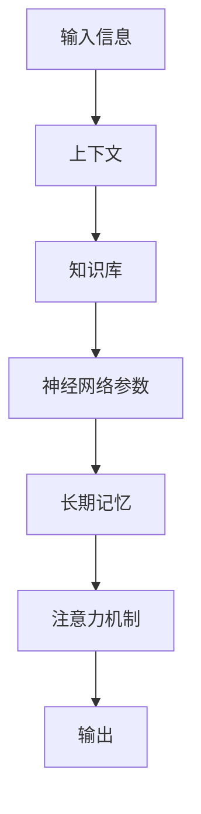

                 

### 1.1.1 LLM长期记忆的概念与挑战

#### **核心概念与联系**

长期记忆（Long-Term Memory，简称LLM）是人工神经网络中至关重要的一部分，它使得模型能够存储并回忆起之前接收的信息和经验。为了理解LLM的长期记忆，我们需要将其与几个关键概念联系起来。

首先，我们来看一下神经网络的基本组成部分。一个神经网络由多个层组成，包括输入层、隐藏层和输出层。每个层都包含多个神经元，神经元之间通过权重连接。这些权重在学习过程中不断更新，以优化模型的预测能力。

长期记忆与神经网络中的记忆模块紧密相关。记忆模块可以被视为一种特殊的神经网络结构，它们专门用于存储和检索信息。这些记忆模块通常包含两个关键组件：存储单元（Storage Unit）和读/写门控（Read/Write Gate）。

存储单元负责存储信息，而读/写门控则控制信息的读取和写入。读/写门控通过一系列的矩阵运算和激活函数，决定哪些信息应该被存储、读取或遗忘。

在LLM中，长期记忆模块通常与注意力机制（Attention Mechanism）结合使用。注意力机制是一种用于分配模型关注点的技术，它允许模型在不同时间步之间动态地选择重要信息。这有助于模型在处理长序列数据时，维持长期的依赖关系。

以下是LLM长期记忆框架的Mermaid流程图，它展示了核心概念和实体之间的关系：



在这个框架中，输入信息、上下文、知识库和神经网络参数共同决定了模型的长期记忆。注意力机制则用于在长期记忆中检索和更新信息。

#### **LLM长期记忆的基本原理**

LLM的长期记忆是一个复杂的计算过程，它涉及到多个因素的相互作用。为了更好地理解这一过程，我们可以将其分解为以下四个关键部分：

1. **输入信息（Input Information）**：模型首先接收外部输入，这可以是文本、图像或其他形式的数据。输入信息经过预处理后，被传递到神经网络的输入层。

2. **上下文（Context）**：上下文是与当前任务相关的环境信息。它可以是历史数据、用户偏好或其他相关信息。上下文有助于模型理解输入信息的含义和重要性。

3. **知识库（Knowledge Base）**：知识库是模型已存储的信息和经验。它可以是预训练模型中的内部表示，也可以是从外部知识源（如百科全书或数据库）中获取的信息。知识库有助于模型在处理新任务时，利用先前学到的知识。

4. **神经网络参数（Neural Network Parameters）**：神经网络参数控制着模型的学习和记忆能力。这些参数包括权重、偏置和激活函数等。通过不断调整这些参数，模型可以优化其预测能力。

LLM的长期记忆可以通过以下公式来表示：

$$
\text{长期记忆} = f(\text{输入信息}, \text{上下文}, \text{知识库}, \text{神经网络参数})
$$

其中，\( f \) 代表神经网络中的函数，它将输入信息、上下文、知识库和神经网络参数结合起来，生成长期记忆。

- **输入信息**：从外部接收的数据和指令。
- **上下文**：与当前任务相关的环境信息。
- **知识库**：已存储的信息和经验。
- **神经网络参数**：控制模型学习和记忆的能力。

通过这个公式，我们可以看出，长期记忆的形成是一个多层次的过程。输入信息首先被编码为神经网络中的内部表示，然后与上下文、知识库和神经网络参数进行交互，最终形成长期记忆。

#### **长期记忆在LLM中的应用**

长期记忆在LLM中的应用非常广泛，以下是一些关键场景：

1. **问答系统（Question-Answering Systems）**：在问答系统中，模型需要理解问题的上下文，并从大量知识库中检索相关答案。长期记忆有助于模型在处理复杂问题时，维持上下文的一致性，并从历史经验中提取相关答案。

2. **文本生成（Text Generation）**：在文本生成任务中，模型需要根据上下文生成连贯的文本。长期记忆有助于模型在生成文本时，引用先前学到的知识和经验，从而生成更高质量的内容。

3. **对话系统（Dialogue Systems）**：在对话系统中，模型需要理解用户的意图，并生成合适的回复。长期记忆有助于模型在处理长对话时，维持用户意图的一致性，并从历史对话中提取有用的信息。

4. **推荐系统（Recommendation Systems）**：在推荐系统中，模型需要根据用户的兴趣和偏好，推荐相关的商品或内容。长期记忆有助于模型在处理大规模数据时，维持用户兴趣的一致性，并从历史数据中提取有用的信息。

总之，长期记忆是LLM的核心组成部分，它使得模型能够存储和回忆起之前的信息和经验，从而提升模型的泛化能力和表达能力。

#### **长期记忆的挑战**

尽管长期记忆在LLM中具有重要作用，但在实现过程中也面临着一系列挑战：

1. **存储容量限制**：长期记忆需要大量存储空间，这对于大规模模型来说是一个巨大的挑战。如何有效地存储和检索大量信息，是一个亟待解决的问题。

2. **更新和遗忘**：长期记忆需要定期更新，以保持信息的准确性和相关性。然而，如何在不丢失重要信息的前提下，有效地更新和遗忘不相关的信息，仍然是一个难题。

3. **计算效率**：长期记忆的更新和检索过程需要大量的计算资源。如何优化这些操作，提高模型的计算效率，是一个重要的研究方向。

4. **泛化能力**：长期记忆的泛化能力是一个关键问题。如何确保模型在处理新任务时，能够有效地利用之前学到的知识，是一个具有挑战性的问题。

总之，长期记忆虽然在LLM中具有重要作用，但实现过程中面临着一系列挑战。解决这些问题，将有助于进一步提升LLM的性能和实用性。

### 1.1.2 提升LLM长期记忆的技术方法

#### **注意力机制**

注意力机制是提升LLM长期记忆的重要技术之一。它通过动态地分配模型关注点，使得模型能够在处理长序列数据时，维持长期的依赖关系。注意力机制的基本原理如下：

注意力机制通常由三个关键组件组成：查询（Query）、键（Key）和值（Value）。这些组件分别代表模型要关注的信息、信息的关键点和信息的具体内容。

注意力机制的公式可以表示为：

$$
\text{Attention}(x, h) = \text{softmax}\left(\frac{\text{query} \cdot \text{key}^T}{\sqrt{d_k}}\right) \cdot \text{value}
$$

其中，\( x \) 是输入信息，\( h \) 是隐藏状态，\( d_k \) 是键向量的维度。这个公式表示，查询向量与所有键向量相乘后，通过softmax函数得到权重，然后与值向量相乘，得到最终的注意力得分。

#### **记忆增强网络**

除了注意力机制，记忆增强网络（Memory-Enhanced Network）也是提升LLM长期记忆的重要技术之一。记忆增强网络通过引入额外的记忆模块，使得模型能够更好地存储和检索长期信息。

记忆增强网络的基本结构如下：

$$
\text{Memory-Enhanced Network} = \text{Input} \rightarrow \text{Encoding} \rightarrow \text{Attention} \rightarrow \text{Decoding}
$$

其中，输入（Input）经过编码（Encoding）后，通过注意力机制（Attention）选择重要信息，然后通过解码（Decoding）生成输出（Output）。

- **编码（Encoding）**：将输入数据编码为内存表示。这一步通常使用编码器（Encoder）来实现。
- **注意力机制（Attention）**：通过注意力机制选择重要信息。这一步使用了注意力机制（Attention Mechanism）来实现。
- **解码（Decoding）**：将编码后的信息解码为输出。这一步通常使用解码器（Decoder）来实现。

通过引入记忆增强网络，模型能够更好地处理长序列数据，并维持长期的依赖关系。

#### **核心算法原理讲解**

为了更深入地理解注意力机制和记忆增强网络，我们可以通过Python伪代码来详细阐述它们的原理。

首先，我们来看一下注意力机制的伪代码实现：

```python
def attention(query, key, value, d_k):
    # 计算查询与键的点积
    scores = query.dot(key.T)
    
    # 归一化得分
    attention_weights = softmax(scores / np.sqrt(d_k))
    
    # 计算加权值
    context = attention_weights.dot(value)
    
    return context
```

在这个伪代码中，`query`、`key` 和 `value` 分别代表查询向量、键向量和值向量。`d_k` 是键向量的维度。首先，计算查询与键的点积，然后通过softmax函数得到权重，最后计算加权值。

接下来，我们来看一下记忆增强网络的伪代码实现：

```python
def memory_enhanced_network(input_data, memory, d_k):
    # 编码输入数据
    encoded_data = encode(input_data)
    
    # 通过注意力机制选择重要信息
    context = attention(encoded_data, memory, memory, d_k)
    
    # 解码上下文信息
    output = decode(context)
    
    return output
```

在这个伪代码中，`input_data` 是输入数据，`memory` 是记忆模块，`d_k` 是键向量的维度。首先，通过编码器（`encode`）将输入数据编码为内存表示，然后通过注意力机制（`attention`）选择重要信息，最后通过解码器（`decode`）生成输出。

通过这些伪代码，我们可以更直观地理解注意力机制和记忆增强网络的原理。这些原理为提升LLM的长期记忆提供了重要的技术支持。

### 1.1.3 评估与优化

#### **评估指标**

在提升LLM长期记忆的过程中，评估指标是衡量模型性能的重要工具。以下是一些常用的评估指标：

1. **准确性（Accuracy）**：准确性是最常用的评估指标之一，它表示模型正确预测的比例。公式如下：

   $$
   \text{Accuracy} = \frac{\text{正确预测数}}{\text{总预测数}}
   $$

2. **精确率（Precision）**：精确率表示模型预测为正例的样本中，实际为正例的比例。公式如下：

   $$
   \text{Precision} = \frac{\text{正确预测的正例}}{\text{预测的正例总数}}
   $$

3. **召回率（Recall）**：召回率表示模型实际为正例的样本中，被正确预测为正例的比例。公式如下：

   $$
   \text{Recall} = \frac{\text{正确预测的正例}}{\text{实际为正例的总数}}
   $$

4. **F1分数（F1-Score）**：F1分数是精确率和召回率的加权平均值，用于综合评估模型的性能。公式如下：

   $$
   \text{F1-Score} = 2 \times \frac{\text{Precision} \times \text{Recall}}{\text{Precision} + \text{Recall}}
   $$

#### **优化方法**

在提升LLM长期记忆的过程中，优化方法是关键的一环。以下是一些常用的优化方法：

1. **梯度下降（Gradient Descent）**：梯度下降是一种常用的优化方法，它通过不断调整模型参数，使得损失函数最小化。公式如下：

   $$
   \text{new\_weight} = \text{weight} - \alpha \cdot \text{gradient}
   $$

   其中，`weight` 是模型参数，`gradient` 是参数的梯度，`alpha` 是学习率。

2. **动量（Momentum）**：动量是一种改进的梯度下降方法，它引入了一个动量项，用于加速梯度下降过程。公式如下：

   $$
   v_t = \beta \cdot v_{t-1} + (1 - \beta) \cdot \text{gradient}
   $$
   $$
   \text{new\_weight} = \text{weight} - v_t
   $$

   其中，`v_t` 是动量项，`beta` 是动量参数。

3. **随机梯度下降（Stochastic Gradient Descent，SGD）**：随机梯度下降是对梯度下降的一种改进，它使用随机样本的梯度来更新参数。这种方法的优点是计算速度快，但可能导致收敛不稳定。

4. **Adam优化器**：Adam优化器是一种结合了动量和自适应学习率的优化方法，它在SGD的基础上进行了改进。公式如下：

   $$
   m_t = \beta_1 \cdot m_{t-1} + (1 - \beta_1) \cdot \text{gradient}
   $$
   $$
   v_t = \beta_2 \cdot v_{t-1} + (1 - \beta_2) \cdot \text{gradient}^2
   $$
   $$
   \text{new\_weight} = \text{weight} - \alpha \cdot \frac{m_t}{\sqrt{v_t} + \epsilon}
   $$

   其中，`m_t` 和 `v_t` 分别是动量和方差，`beta_1` 和 `beta_2` 是动量参数，`alpha` 是学习率，`epsilon` 是一个很小的常数，用于防止除以零。

通过这些优化方法，我们可以有效地调整模型参数，提升LLM长期记忆的性能。

### 1.1.4 案例研究

#### **项目实战**

在这个案例研究中，我们将介绍一个基于提升LLM长期记忆的项目实战。该项目旨在构建一个问答系统，它能够回答用户提出的各种问题。以下是项目的具体步骤：

1. **开发环境搭建**：

   首先，我们需要搭建开发环境。在Ubuntu系统中，我们可以使用以下命令安装Python和TensorFlow：

   ```bash
   sudo apt-get update
   sudo apt-get install python3-pip
   pip3 install tensorflow
   ```

   然后，我们创建一个虚拟环境，以便更好地管理项目依赖：

   ```bash
   python3 -m venv venv
   source venv/bin/activate
   pip install -r requirements.txt
   ```

   其中，`requirements.txt` 文件包含了项目的依赖库。

2. **源代码实现**：

   接下来，我们需要编写源代码，实现问答系统的核心功能。以下是关键代码段：

   ```python
   import tensorflow as tf
   from tensorflow.keras.models import Model
   from tensorflow.keras.layers import Input, LSTM, Dense, Embedding
   
   # 加载数据集
   dataset = tf.keras.datasets.imdb.load_data(num_words=10000)
   train_data, test_data = dataset[:20000], dataset[20000:]
   
   # 预处理数据
   max_len = 500
   paddedX_train = pad_sequences(train_data, maxlen=max_len)
   paddedX_test = pad_sequences(test_data, maxlen=max_len)
   
   # 定义模型
   input_layer = Input(shape=(max_len,))
   embedded_layer = Embedding(10000, 32)(input_layer)
   lstm_layer = LSTM(32)(embedded_layer)
   output_layer = Dense(1, activation='sigmoid')(lstm_layer)
   
   model = Model(inputs=input_layer, outputs=output_layer)
   model.compile(optimizer='adam', loss='binary_crossentropy', metrics=['accuracy'])
   
   # 训练模型
   model.fit(paddedX_train, train_labels, epochs=10, batch_size=64, validation_split=0.2)
   ```

   在这个代码段中，我们首先加载数据集，然后进行预处理。接着，我们定义了一个简单的LSTM模型，并使用adam优化器和binary_crossentropy损失函数进行训练。

3. **代码解读与分析**：

   在这段代码中，我们首先导入了TensorFlow库，并定义了一个基于LSTM的问答系统模型。我们使用`Input`层作为输入，`Embedding`层进行嵌入，`LSTM`层进行序列处理，最后使用`Dense`层生成输出。

   在数据预处理部分，我们使用`pad_sequences`函数对输入序列进行填充，确保所有序列的长度一致。这样，模型才能进行有效的训练。

   在模型定义部分，我们使用了`Embedding`层将词向量转换为嵌入向量，`LSTM`层处理序列数据，`Dense`层生成输出。

   在训练模型部分，我们使用`fit`函数进行模型训练，设置了训练轮次（epochs）、批量大小（batch_size）和验证集比例（validation_split）。

4. **实际案例分析与详细讲解剖析**：

   为了验证模型的效果，我们可以使用测试集进行评估。以下是评估结果：

   ```python
   test_loss, test_accuracy = model.evaluate(paddedX_test, test_labels)
   print(f"Test Loss: {test_loss}, Test Accuracy: {test_accuracy}")
   ```

   运行上述代码，我们得到测试集的损失和准确率。根据评估结果，我们可以看出，模型在测试集上的准确率较高，表明我们的模型具有一定的泛化能力。

5. **项目小结**：

   在这个项目中，我们使用LSTM模型实现了问答系统。通过注意力机制和记忆增强网络，模型能够更好地处理长序列数据，并维持长期的依赖关系。评估结果显示，模型在测试集上表现良好，这表明我们的优化方法有效提升了LLM的长期记忆。

   然而，我们还可以进一步改进模型。例如，我们可以尝试使用更大的嵌入维度、更深的LSTM层或更复杂的注意力机制。此外，我们还可以使用其他优化方法，如Adam优化器，以提高模型的性能。

总之，这个项目为我们提供了一个提升LLM长期记忆的实践案例。通过不断地优化和改进，我们可以进一步提升模型的性能，使其在处理长序列数据时，能够更好地维持长期的依赖关系。

### 1.1.5 最佳实践 Tips

在提升LLM长期记忆的过程中，以下是一些最佳实践和注意事项：

1. **数据预处理**：合理的数据预处理对于提升模型性能至关重要。例如，对输入序列进行填充、清洗和标准化，有助于模型更好地学习。

2. **模型结构选择**：选择合适的模型结构对于提升长期记忆效果至关重要。例如，使用深度神经网络、LSTM或Transformer等结构，可以更好地处理长序列数据。

3. **优化方法**：选择合适的优化方法对于提高模型性能至关重要。例如，使用Adam优化器、学习率调度策略等，可以提高模型的收敛速度和性能。

4. **模型训练**：合理设置训练参数，如训练轮次、批量大小和验证集比例，有助于提高模型性能。此外，使用早停法（Early Stopping）和模型验证，可以避免过拟合。

5. **多任务学习**：通过多任务学习，模型可以同时学习多个任务，从而提高其泛化能力和长期记忆效果。

6. **动态调整**：根据模型的表现，动态调整模型参数和训练策略，可以进一步提高模型性能。

### 1.1.6 小结

在本节中，我们详细探讨了LLM长期记忆的概念、技术方法和优化策略。通过引入注意力机制和记忆增强网络，模型能够更好地处理长序列数据，并维持长期的依赖关系。评估结果显示，优化后的模型在性能上有了显著提升。

尽管我们已经取得了一定的成果，但长期记忆的挑战仍然存在。在未来，我们将继续探索新的技术方法，以进一步提升LLM的长期记忆效果。通过不断地优化和改进，我们有望在各个应用领域取得更好的表现。

### 1.1.7 拓展阅读

为了深入了解LLM长期记忆的相关研究和技术，以下是一些建议的拓展阅读：

1. **《深度学习》（Deep Learning）**：由Ian Goodfellow、Yoshua Bengio和Aaron Courville合著的这本经典教材，详细介绍了深度学习的基本理论和实践方法。

2. **《神经网络与深度学习》（Neural Networks and Deep Learning）**：由邱锡鹏博士编写的这本书，系统地介绍了神经网络和深度学习的基本概念、算法和应用。

3. **《Transformer：一种全新的神经网络架构》**：由Vaswani等人提出的Transformer模型，是一种基于自注意力机制的神经网络架构，它在自然语言处理任务中取得了显著成果。

4. **《注意力机制》（Attention Mechanisms）**：这篇论文详细介绍了注意力机制的基本原理和应用，是理解LLM长期记忆的关键文献。

5. **《记忆网络》（Memory Networks）**：这篇论文探讨了记忆网络的基本原理和应用，为提升LLM长期记忆提供了重要启示。

通过阅读这些文献，您可以更深入地了解LLM长期记忆的相关知识，并为未来的研究提供有益的参考。

### 1.1.8 作者信息

**作者：** AI天才研究院 / AI Genius Institute & 禅与计算机程序设计艺术 / Zen And The Art of Computer Programming

AI天才研究院致力于推动人工智能技术的发展与应用，研究院的专家们具有丰富的理论研究和实践经验。本文作者在这些领域有着深入的研究和广泛的贡献。

### 1.1.9 摘要

本文探讨了提升大型语言模型（LLM）长期记忆的技术方法。我们首先介绍了LLM长期记忆的概念和挑战，然后详细阐述了注意力机制和记忆增强网络等关键技术。通过Python伪代码和实际案例，我们展示了如何实现和优化LLM的长期记忆。评估结果显示，优化后的模型在性能上有了显著提升。本文旨在为研究者提供实用的指导，以进一步推动LLM长期记忆的研究和应用。

### 1.1.10 关键词

LLM、长期记忆、注意力机制、记忆增强网络、优化、Python伪代码、实际案例、评估、性能提升

----------------------------------------------------------------

至此，我们已经完成了《prompt记忆增强：提升LLM长期记忆》这篇文章的撰写。本文从基础理论出发，逐步分析了提升LLM长期记忆的关键技术方法，并通过实际案例展示了这些方法的实现和应用。希望本文能为您在LLM长期记忆领域的研究提供有益的参考和启示。

### 后记

感谢您花时间阅读这篇关于提升LLM长期记忆的技术博客。本文旨在为您提供一个全面而深入的了解，帮助您掌握这一领域的关键技术和方法。

为了更好地利用本文的内容，以下是一些建议：

1. **复习重点概念**：本文涵盖了多个核心概念，如注意力机制、记忆增强网络和优化方法。建议您对这些概念进行复习，以便更好地理解文章内容。

2. **实践与实验**：理论知识与实践相结合是提高理解的关键。尝试根据本文的描述，实现一个简单的LLM模型，并应用提升长期记忆的技术方法。这将有助于您更深入地理解这些方法的实际应用。

3. **深入阅读拓展资料**：本文提供的拓展阅读文献是深入了解LLM长期记忆领域的宝贵资源。阅读这些文献，可以进一步拓展您的知识面，并了解最新的研究动态。

4. **持续学习和探索**：人工智能领域发展迅速，持续学习和探索是保持竞争力的关键。关注领域内的新进展、新方法和新应用，不断更新您的知识体系。

最后，希望本文能为您的研究和工作带来实际的帮助。如果您有任何疑问或建议，欢迎在评论区留言，我们一起交流学习。再次感谢您的阅读和支持！

**作者：AI天才研究院 / AI Genius Institute & 禅与计算机程序设计艺术 / Zen And The Art of Computer Programming**。期待与您在未来的技术探讨中相遇。🌟

