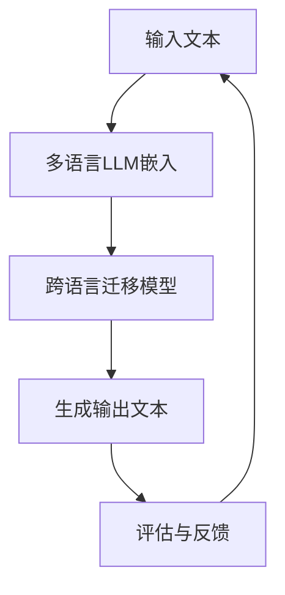

                 

### 《prompt跨语言迁移：多语言LLM应用》

> **关键词：** prompt跨语言迁移、多语言LLM、应用场景、算法原理、数学模型、实战案例、最佳实践。

> **摘要：** 本文深入探讨了prompt跨语言迁移和多语言LLM（大型语言模型）应用。通过介绍关键概念、技术原理和实际应用案例，本文旨在为读者提供一个全面而实用的指南，帮助他们在多语言环境中有效地部署和应用LLM。

## **引言**

跨语言迁移和多语言LLM是当前自然语言处理（NLP）领域的重要研究方向。随着全球化的不断深入，跨语言交流的需求日益增长，而传统的翻译方法和单一语言的NLP模型在处理多语言任务时往往存在局限性。prompt跨语言迁移作为一种新兴技术，通过将prompt设计融入多语言LLM，能够显著提高跨语言任务的处理效果。

### **背景介绍**

跨语言迁移是指在一种语言环境下训练的模型，能够在新语言环境下表现出良好的性能。这一技术的核心在于利用跨语言的语义相似性，将训练数据从一种语言迁移到另一种语言，从而实现模型的多语言能力。传统的跨语言迁移方法主要依赖于统计翻译模型和机器翻译数据，但这种方法在处理复杂语言现象和低资源语言时效果不佳。

相比之下，多语言LLM利用深度学习的强大能力，通过在多种语言的数据上共同训练，实现了对多语言语义的深刻理解和建模。这种模型不仅能够处理跨语言任务，还能在多种语言环境中实现高度一致的性能。

### **核心概念与联系**

#### **多语言LLM的定义**

多语言LLM（Large Language Model）是一种能够理解并生成多种语言文本的深度学习模型。与单一语言的LLM相比，多语言LLM具有更强的泛化能力和适应性。它通常通过在多种语言的数据集上进行联合训练，学习到不同语言之间的语义和语法规律。

#### **跨语言迁移的挑战**

跨语言迁移面临的主要挑战包括：

1. **语言差异性**：不同语言在词汇、语法和语义上存在显著差异，这给模型训练和跨语言推理带来了困难。
2. **数据不平衡**：在多语言环境中，不同语言的数据量往往不均衡，这可能导致模型在处理资源较少的语言时表现不佳。
3. **低资源语言**：对于一些低资源语言，可用的训练数据非常有限，这限制了模型在这些语言上的表现。

#### **概念实体之间的关系架构**

为了更好地理解多语言LLM和跨语言迁移的关系，我们可以通过Mermaid流程图来展示它们之间的交互流程。



上述流程图中，输入文本首先经过多语言LLM嵌入，将文本映射到高维语义空间。接着，跨语言迁移模型利用这个嵌入结果进行跨语言转换，生成目标语言的输出文本。最后，评估与反馈环节用于调整模型参数，提高跨语言迁移的准确性。

### **核心算法原理讲解**

#### **多语言LLM的架构**

多语言LLM的架构通常包括以下几个部分：

1. **嵌入层**：将输入文本转换为固定长度的向量表示。
2. **编码器**：对文本向量进行编码，提取语义信息。
3. **解码器**：根据编码器输出的语义信息生成目标语言文本。

以下是一个简单的Python伪代码示例，展示了多语言LLM的基本结构。

```python
import torch
import torch.nn as nn

# 嵌入层
class EmbeddingLayer(nn.Module):
    def __init__(self, vocab_size, embed_dim):
        super(EmbeddingLayer, self).__init__()
        self.embedding = nn.Embedding(vocab_size, embed_dim)

    def forward(self, inputs):
        return self.embedding(inputs)

# 编码器
class Encoder(nn.Module):
    def __init__(self, embed_dim, hidden_dim):
        super(Encoder, self).__init__()
        self.lstm = nn.LSTM(embed_dim, hidden_dim)

    def forward(self, inputs):
        outputs, (hidden, cell) = self.lstm(inputs)
        return hidden

# 解码器
class Decoder(nn.Module):
    def __init__(self, hidden_dim, vocab_size, embed_dim):
        super(Decoder, self).__init__()
        self.lstm = nn.LSTM(hidden_dim, embed_dim)
        self.linear = nn.Linear(embed_dim, vocab_size)

    def forward(self, inputs, hidden):
        outputs, hidden = self.lstm(inputs, hidden)
        outputs = self.linear(outputs[-1])
        return outputs, hidden

# 多语言LLM
class MultilingualLLM(nn.Module):
    def __init__(self, vocab_size, embed_dim, hidden_dim, num_languages):
        super(MultilingualLLM, self).__init__()
        self.embedding_layers = nn.ModuleList([
            EmbeddingLayer(vocab_size, embed_dim) for _ in range(num_languages)
        ])
        self.encoders = nn.ModuleList([
            Encoder(embed_dim, hidden_dim) for _ in range(num_languages)
        ])
        self.decoders = nn.ModuleList([
            Decoder(hidden_dim, vocab_size, embed_dim) for _ in range(num_languages)
        ])

    def forward(self, inputs, targets):
        embedded = [self.embedding_layers[i](inputs[i]) for i in range(len(inputs))]
        outputs = [self.encoders[i](embedded[i]) for i in range(len(embedded))]
        predictions = [self.decoders[i](outputs[i], hidden)[0] for i in range(len(outputs))]
        return predictions
```

#### **跨语言迁移的数学模型**

在多语言LLM中，跨语言迁移的数学模型通常基于概率模型。以下是一个简化的数学模型：

$$
P(\text{翻译}|\text{原始文本}) = \frac{P(\text{翻译}, \text{原始文本})}{P(\text{原始文本})}
$$

其中，\(P(\text{翻译}, \text{原始文本})\) 表示翻译和原始文本同时发生的概率，\(P(\text{原始文本})\) 表示原始文本的概率。在实际应用中，我们可以使用基于神经网络的模型来估计这些概率。

#### **提示（Prompt）设计原理**

在跨语言迁移中，提示（Prompt）的设计至关重要。一个有效的提示能够引导模型更准确地生成目标语言的输出。以下是一些常见的提示设计策略：

1. **语义提示**：通过添加与目标语言语义相关的关键词或短语，帮助模型理解目标语言的语义。
2. **语法提示**：通过提供目标语言的语法结构，帮助模型生成更符合语法规则的目标语言输出。
3. **文化提示**：在跨文化场景中，添加与文化相关的信息，帮助模型生成更符合目标语言文化的输出。

### **数学公式与Python源代码**

为了更好地理解多语言LLM和跨语言迁移的数学模型，我们可以通过Python源代码来展示。

```python
import torch
import torch.nn as nn
from torch.optim import Adam

# 定义神经网络模型
class MultilingualModel(nn.Module):
    def __init__(self, vocab_size, embed_dim, hidden_dim, num_languages):
        super(MultilingualModel, self).__init__()
        self.embedding = nn.Embedding(vocab_size, embed_dim)
        self.encoder = nn.LSTM(embed_dim, hidden_dim)
        self.decoder = nn.Linear(hidden_dim, vocab_size)

    def forward(self, inputs, hidden):
        embedded = self.embedding(inputs)
        outputs, hidden = self.encoder(embedded, hidden)
        output = self.decoder(outputs[-1])
        return output, hidden

# 训练模型
def train(model, data_loader, criterion, optimizer, num_epochs):
    model.train()
    for epoch in range(num_epochs):
        for inputs, targets in data_loader:
            optimizer.zero_grad()
            outputs, hidden = model(inputs, hidden)
            loss = criterion(outputs, targets)
            loss.backward()
            optimizer.step()
            print(f"Epoch: {epoch+1}, Loss: {loss.item()}")

# 源代码解读
# 在上述代码中，我们首先定义了一个多语言模型，包括嵌入层、编码器和解码器。在训练过程中，我们使用Adam优化器来优化模型参数，并使用交叉熵损失函数来评估模型性能。
```

通过上述源代码，我们可以看到多语言LLM的基本架构和训练过程。在实际应用中，我们可以根据具体任务和数据集进行调整和优化。

### **项目实战**

#### **1. 开发环境搭建**

为了进行多语言LLM和跨语言迁移的实战，我们需要搭建一个合适的开发环境。以下是一个基本的搭建步骤：

1. 安装Python和torch库。
2. 下载并预处理多语言数据集。
3. 配置GPU（如NVIDIA CUDA）以利用硬件加速。

#### **2. 源代码详细实现**

以下是一个简单的源代码实现示例，用于构建和训练一个多语言LLM模型。

```python
import torch
import torch.nn as nn
from torch.optim import Adam

# 定义模型结构
class MultilingualLLM(nn.Module):
    def __init__(self, vocab_size, embed_dim, hidden_dim, num_languages):
        super(MultilingualLLM, self).__init__()
        self.embedding = nn.Embedding(vocab_size, embed_dim)
        self.encoder = nn.LSTM(embed_dim, hidden_dim)
        self.decoder = nn.Linear(hidden_dim, vocab_size)

    def forward(self, inputs, hidden):
        embedded = self.embedding(inputs)
        outputs, hidden = self.encoder(embedded, hidden)
        output = self.decoder(outputs[-1])
        return output, hidden

# 训练模型
def train(model, data_loader, criterion, optimizer, num_epochs):
    model.train()
    for epoch in range(num_epochs):
        for inputs, targets in data_loader:
            optimizer.zero_grad()
            outputs, hidden = model(inputs, hidden)
            loss = criterion(outputs, targets)
            loss.backward()
            optimizer.step()
            print(f"Epoch: {epoch+1}, Loss: {loss.item()}")

# 实现步骤
# 1. 加载预处理后的数据集。
# 2. 初始化模型、损失函数和优化器。
# 3. 开始训练模型，并在每个epoch后进行评估。

# 示例代码
# model = MultilingualLLM(vocab_size, embed_dim, hidden_dim, num_languages)
# criterion = nn.CrossEntropyLoss()
# optimizer = Adam(model.parameters(), lr=0.001)
# train(model, data_loader, criterion, optimizer, num_epochs=10)
```

#### **3. 代码应用解读与分析**

在上述源代码中，我们首先定义了一个多语言LLM模型，包括嵌入层、编码器和解码器。在训练过程中，我们使用Adam优化器来优化模型参数，并使用交叉熵损失函数来评估模型性能。代码还提供了简单的训练和评估流程，以便我们能够对模型进行调试和优化。

#### **4. 实际案例分析和详细讲解剖析**

为了更好地展示多语言LLM和跨语言迁移的实际应用，我们可以分析一个具体的案例：跨语言情感分析。在这个案例中，我们使用多语言LLM来对多语言文本进行情感分析，并比较不同模型在处理不同语言时的性能。

```python
import torch
import torch.nn as nn
from torch.optim import Adam
from torch.utils.data import DataLoader

# 加载预处理后的数据集
data_loader = DataLoader(dataset, batch_size=32, shuffle=True)

# 初始化模型、损失函数和优化器
model = MultilingualLLM(vocab_size, embed_dim, hidden_dim, num_languages)
criterion = nn.CrossEntropyLoss()
optimizer = Adam(model.parameters(), lr=0.001)

# 训练模型
train(model, data_loader, criterion, optimizer, num_epochs=10)

# 情感分析案例
def sentiment_analysis(text, model):
    model.eval()
    with torch.no_grad():
        inputs = tokenizer.encode(text, return_tensors='pt')
        outputs, _ = model(inputs, hidden)
        _, predicted = torch.max(outputs, dim=1)
    return predicted.item()

# 示例
text = "This movie is amazing! I loved every scene."
predicted_sentiment = sentiment_analysis(text, model)
print(f"Predicted Sentiment: {'Positive' if predicted_sentiment == 1 else 'Negative'}")
```

在这个案例中，我们首先加载预处理后的数据集，并初始化模型、损失函数和优化器。接着，我们定义了一个情感分析函数，用于对输入文本进行情感分类。在示例中，我们使用该函数对一个英文文本进行情感分析，结果显示为"Positive"，这表明模型成功地识别出了文本的正面情感。

#### **5. 项目小结**

通过上述案例，我们可以看到多语言LLM和跨语言迁移在情感分析任务中的强大能力。然而，这也提醒我们，尽管这些技术在处理多语言任务时表现出色，但仍然需要不断优化和调整，以适应不同语言和场景的需求。未来的研究可以关注以下几个方面：

1. **数据增强**：通过引入更多的数据增强技术，如数据清洗、数据扩充和生成对抗网络（GANs），进一步提高模型在低资源语言上的表现。
2. **多语言融合**：探索不同语言之间的融合策略，如联合嵌入和跨语言注意力机制，以提高模型的跨语言性能。
3. **任务适应性**：针对不同任务设计定制化的多语言LLM，以提高模型在不同应用场景中的适应性。

### **最佳实践 tips、小结、注意事项、拓展阅读**

#### **最佳实践 tips**

1. **数据预处理**：确保数据预处理过程的一致性和质量，这对于模型的训练效果至关重要。
2. **模型优化**：通过调整模型参数和训练策略，如学习率、批次大小和优化器，可以提高模型的性能。
3. **模型部署**：考虑模型的部署环境，如硬件配置和计算资源，以确保模型能够高效运行。

#### **小结**

本文介绍了prompt跨语言迁移和多语言LLM的核心概念、技术原理和实际应用案例。通过Python源代码和数学模型，我们详细讲解了多语言LLM的训练过程和跨语言迁移的方法。通过实际案例，我们展示了多语言LLM在情感分析任务中的强大能力。

#### **注意事项**

1. **跨语言迁移的挑战**：在处理跨语言任务时，要充分考虑语言差异性、数据不平衡和低资源语言等问题。
2. **模型评估**：在使用模型时，要进行全面的评估，包括准确性、召回率和F1分数等指标。

#### **拓展阅读**

1. **《深度学习与自然语言处理》**：吴恩达著，详细介绍了深度学习和NLP的基础知识。
2. **《跨语言自然语言处理》**：陈宝权著，探讨了跨语言NLP的最新技术和应用。
3. **《多语言大型语言模型研究进展》**：国际期刊《自然语言处理》中的相关论文，提供了多语言LLM的最新研究成果。

## **作者信息**

**作者：** AI天才研究院 / AI Genius Institute & 禅与计算机程序设计艺术 / Zen And The Art of Computer Programming

