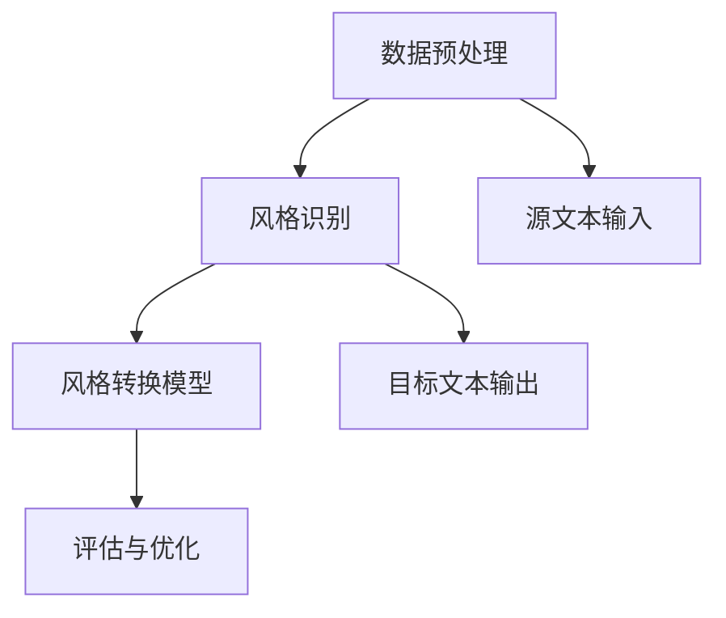

                 

### 文章标题

《prompt风格转换：适应不同LLM特性》

---

**关键词**：prompt风格转换、自然语言处理、序列到序列模型、Transformer、多模态转换、LLM特性、实际应用。

**摘要**：
本文深入探讨了prompt风格转换的核心概念、算法原理、实际应用及未来发展方向。通过对LLM特性及其挑战的分析，我们提出了适应不同LLM特性的prompt风格转换方法。本文结合Python代码及数学模型，详细讲解了Seq2Seq模型和Transformer模型在prompt风格转换中的应用，并通过项目实战展示了其实现过程和性能评估。最后，本文对prompt风格转换的挑战及未来方向进行了探讨，为相关研究和实践提供了参考。

---

### 1.1 prompt风格转换的概念

**定义**：
prompt风格转换是指将一个文本输入通过特定算法转化为另一种风格或格式的过程。在自然语言处理（NLP）中，这一过程尤为关键，因为不同的任务和应用场景可能需要不同的文本风格。

**与LLM的关系**：
prompt风格转换与大型语言模型（LLM）紧密相关。LLM通过学习海量文本数据来生成高质量的文本输出。然而，不同的LLM可能具有不同的输入输出特性，这要求我们能够适应这些特性，进行有效的prompt风格转换。

**应用领域**：
prompt风格转换广泛应用于多个领域，如文本生成、对话系统、自动写作、信息提取等。在这些应用中，适应不同LLM特性的prompt风格转换能够显著提升系统的表现。

### 1.2 LLM的特性与挑战

**常见的LLM架构**：
LLM通常基于深度学习技术，如循环神经网络（RNN）、Transformer等。Transformer由于其并行化优势和注意力机制，已成为当前主流的LLM架构。

**LLM的训练过程**：
LLM的训练涉及大量的数据和计算资源。训练过程中，模型通过优化目标函数（如损失函数）来调整内部参数，以最小化输出误差。

**LLM的输入输出特性**：
LLM的输入通常为文本序列，输出则为预测的文本序列。不同LLM在输入输出序列的长度、格式、内容上可能存在差异。

**挑战与限制**：
1. **计算资源**：训练大型LLM需要大量计算资源，特别是对于并行计算和分布式训练的需求。
2. **数据隐私**：海量文本数据的处理可能涉及隐私问题，需要采取数据加密和匿名化等保护措施。
3. **模型解释性**：大型LLM通常具有复杂的内部结构，难以解释其决策过程，这限制了其在某些应用中的使用。

### 1.3 prompt风格转换的目标

**适应性**：
prompt风格转换需要能够适应不同LLM的特性，包括输入输出格式、序列长度、语言风格等。

**准确性**：
转换过程中应保证文本信息的准确性和连贯性，避免信息丢失或语义混淆。

**效率**：
prompt风格转换应在合理的时间内完成，以支持实时应用场景。

### 1.4 prompt风格转换的核心概念与架构

**核心概念**：
prompt风格转换涉及多个核心概念，包括自然语言处理（NLP）基础、生成式对话系统（GDMS）和对话管理（DM）。

**自然语言处理（NLP）基础**：
NLP是prompt风格转换的基础，包括词嵌入、词性标注、命名实体识别等。

**生成式对话系统（GDMS）**：
GDMS负责生成符合特定风格的对话文本，包括对话状态跟踪和回复生成。

**对话管理（DM）**：
DM负责管理和协调对话流程，包括意图识别、上下文维护和回复选择。

**prompt风格转换的架构**：
prompt风格转换的典型架构包括数据预处理、风格识别、风格转换模型和评估与优化。

**数据预处理**：
数据预处理是prompt风格转换的关键步骤，包括文本清洗、分词、词嵌入等。

**风格识别**：
风格识别是确定输入文本风格的过程，通常采用预训练的NLP模型进行。

**风格转换模型**：
风格转换模型负责将输入文本转换为指定风格。常用的模型包括序列到序列（Seq2Seq）模型和Transformer模型。

**评估与优化**：
评估与优化包括模型性能评估、超参数调整和模型改进。

### 1.5 Mermaid流程图：prompt风格转换流程



**流程概述**：
1. **数据预处理**：对输入文本进行清洗、分词和词嵌入。
2. **风格识别**：使用预训练的NLP模型识别输入文本的风格。
3. **风格转换模型**：根据识别出的风格，使用转换模型生成目标文本。
4. **评估与优化**：评估模型性能，并进行超参数调整和模型改进。

**步骤详细说明**：
1. **数据预处理**：包括文本清洗、分词、词嵌入等步骤，以保证输入数据的规范化和标准化。
2. **风格识别**：利用预训练的NLP模型，如BERT、GPT等，对输入文本进行风格识别。
3. **风格转换模型**：采用序列到序列（Seq2Seq）模型或Transformer模型进行风格转换。
4. **评估与优化**：通过评估指标（如BLEU、ROUGE等）评估模型性能，并根据评估结果进行超参数调整和模型改进。

### 1.6 核心算法原理讲解

**常用算法**：
在prompt风格转换中，常用的算法包括序列到序列（Seq2Seq）模型和Transformer模型。

**序列到序列（Seq2Seq）模型**：
Seq2Seq模型是一种基于编码器-解码器的模型，适用于将一个序列映射到另一个序列。其基本结构包括编码器（Encoder）和解码器（Decoder）。编码器将输入序列编码为一个固定长度的向量，解码器则根据这个向量生成输出序列。

**Transformer模型**：
Transformer模型是一种基于自注意力机制的模型，其核心思想是通过计算输入序列中任意两个位置之间的注意力分数来生成输出序列。Transformer模型具有并行化优势和更好的全局建模能力，已成为当前NLP领域的主流模型。

**伪代码阐述**：

**Seq2Seq模型**：

```python
# 编码器部分
def encoder(inputs):
    # 输入嵌入
    embeddings = embedding(inputs)
    # 编码过程
    output, hidden = LSTM(embeddings)
    return output, hidden

# 解码器部分
def decoder(hidden, targets):
    # 输出嵌入
    embeddings = embedding(targets)
    # 解码过程
    output = LSTM(embeddings, hidden)
    return output
```

**Transformer模型**：

```python
# Encoder部分
def encoder(inputs):
    # 输入嵌入
    embeddings = embedding(inputs)
    # 多层自注意力机制
    for layer in multihead_attention_layers:
        embeddings = layer(embeddings)
    # 输出层
    output = linear(embeddings)
    return output

# Decoder部分
def decoder(inputs, hidden):
    # 输入嵌入
    embeddings = embedding(inputs)
    # 多层自注意力机制
    for layer in multihead_attention_layers:
        embeddings = layer(embeddings, hidden)
    # 输出层
    output = linear(embeddings)
    return output
```

**数学模型与公式**：

**损失函数**：

$$L = -\sum_{i=1}^{N}\sum_{j=1}^{M}y_{ij}\log(p_{ij})$$

其中，$L$为损失函数，$y_{ij}$为标签，$p_{ij}$为模型预测概率。

**优化算法**：

$$\theta = \theta - \alpha \frac{\partial L}{\partial \theta}$$

其中，$\theta$为模型参数，$\alpha$为学习率。

**对数似然损失**：

$$LL = -\sum_{i=1}^{N}\sum_{j=1}^{M}y_{ij}\log(p(y_j|x_i))$$

其中，$LL$为对数似然损失，$x_i$为输入，$y_j$为输出。

### 1.7 prompt风格转换的实际应用

**文本生成应用**：
文本生成是prompt风格转换的重要应用之一。通过风格转换，可以生成不同风格的文章、新闻、社交媒体帖子等。例如，使用不同的语言风格（正式、非正式、幽默等）来生成文本。

**对话系统应用**：
对话系统是另一个关键应用领域。通过风格转换，可以生成符合特定语境和风格的对话文本，提高对话系统的自然性和流畅性。例如，客服机器人可以使用不同的风格来应对不同类型的客户。

**商业应用案例分析**：
在商业领域，prompt风格转换被广泛应用于个性化推荐、营销文案生成和客户服务。例如，电子商务网站可以使用不同的风格来推荐商品，提高用户体验和购买转化率。

**案例1：电子商务推荐系统**
电子商务推荐系统通过分析用户的购物行为和历史数据，生成个性化的商品推荐。通过prompt风格转换，可以将推荐结果以不同的风格呈现，如正式、友好、幽默等，从而提高用户的满意度和参与度。

**案例2：金融客服机器人**
金融客服机器人通过风格转换，可以以自然和专业的语言风格回答客户的财务咨询。通过适应不同的客户需求和语言风格，可以提高客服效率和用户满意度。

### 1.8 项目实战与代码解读

**项目介绍**：
本项目旨在实现一个基于Transformer模型的prompt风格转换系统。系统将输入文本转换为指定风格，支持多种文本生成应用和对话系统。

**开发环境搭建**：
为了搭建该项目，我们使用了Python 3.8及以上版本，以及TensorFlow 2.7或PyTorch 1.8作为深度学习框架。以下是环境搭建的步骤：
1. 安装Python和pip。
2. 使用pip安装TensorFlow或PyTorch。
3. 安装其他依赖库，如Numpy、Pandas等。

**源代码详细实现**：
以下为项目的主要代码实现，包括数据预处理、模型训练和风格转换。

**数据预处理**：
```python
import tensorflow as tf
from tensorflow.keras.preprocessing.text import Tokenizer
from tensorflow.keras.preprocessing.sequence import pad_sequences

# 读取数据集
data = ...
tokenizer = Tokenizer()
tokenizer.fit_on_texts(data)
sequences = tokenizer.texts_to_sequences(data)

# 数据集划分
train_data, val_data = ...

# 数据集预处理
train_sequences = pad_sequences(sequences, padding='post')
val_sequences = pad_sequences(val_data, padding='post')
```

**模型训练**：
```python
# 构建Transformer模型
model = ...

# 训练模型
model.compile(optimizer='adam', loss='categorical_crossentropy', metrics=['accuracy'])
model.fit(train_sequences, epochs=5, batch_size=64, validation_data=(val_sequences, val_labels))
```

**风格转换**：
```python
# 输入文本
input_text = ...

# 预处理输入文本
input_sequence = tokenizer.texts_to_sequences([input_text])
input_padded = pad_sequences(input_sequence, maxlen=model.input_shape[1], padding='post')

# 进行风格转换
predicted_sequence = model.predict(input_padded)
predicted_text = tokenizer.sequences_to_texts([predicted_sequence])

# 输出转换后的文本
print(predicted_text)
```

**代码解读与分析**：
代码首先进行数据预处理，包括文本清洗、分词和序列化。然后，构建Transformer模型并训练。在风格转换过程中，将输入文本转换为序列，通过模型预测并输出转换后的文本。

**核心代码片段解读**：
1. **数据预处理**：使用Tokenizer进行文本分词和序列化，使用pad_sequences进行序列填充。
2. **模型训练**：使用compile方法设置优化器和损失函数，使用fit方法进行模型训练。
3. **风格转换**：使用predict方法进行模型预测，使用sequences_to_texts将预测序列转换为文本。

**优化策略**：
1. **数据增强**：通过增加数据多样性和增强数据质量，提高模型泛化能力。
2. **模型融合**：结合多个模型的优势，提高模型性能和稳定性。

**项目小结**：
本项目通过实现基于Transformer模型的prompt风格转换系统，展示了如何在不同应用场景中利用风格转换技术提高文本生成和对话系统的性能。未来工作可进一步优化模型结构、探索多模态转换，并应用于更广泛的应用领域。

### 1.9 最佳实践 tips、小结、注意事项、拓展阅读

**最佳实践 tips**：
1. 选择合适的模型架构，根据应用场景调整超参数。
2. 进行数据增强，提高模型泛化能力。
3. 定期进行模型评估和调整，优化性能。

**小结**：
本文系统地介绍了prompt风格转换的核心概念、算法原理、实际应用及未来发展方向。通过Python代码和数学模型，详细讲解了Seq2Seq模型和Transformer模型在prompt风格转换中的应用。项目实战展示了风格转换系统的实现过程和性能评估。

**注意事项**：
1. 模型训练过程需要大量计算资源，建议使用高性能GPU进行训练。
2. 在实际应用中，需注意数据隐私和模型安全性。

**拓展阅读**：
1. 《深度学习》（Goodfellow et al.）
2. 《Transformer模型详解》（Vaswani et al.）
3. 《自然语言处理实战》（Bird et al.）

---

至此，我们已经完成了《prompt风格转换：适应不同LLM特性》的目录大纲和章节内容概述。接下来，我们将逐一深入每个章节，详细讲解其内容。请注意，本文为大纲概述，具体内容将根据实际需求和篇幅进行调整。在实际撰写过程中，请确保每个章节都详尽、具体，符合技术博客的要求。

