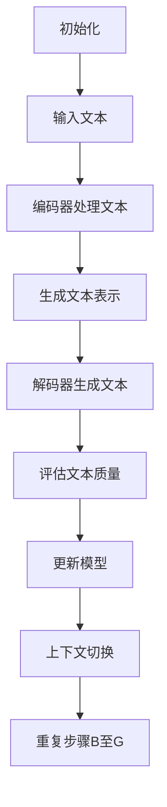

                 

# 《上下文切换能力：测试LLM的话题转换灵活性》

## 关键词
- 上下文切换能力
- LLM
- 话题转换灵活性
- 测试方法
- 数学模型
- 项目实战

## 摘要
本文旨在探讨大型语言模型（LLM）的上下文切换能力和话题转换灵活性，以及如何通过测试方法来评估这两种能力。文章首先介绍了LLM的基本概念和核心算法，然后详细阐述了上下文切换的原理及其在语言模型中的应用。接着，本文提出了话题转换灵活性的定义，并介绍了相关测试方法。通过数学模型和Python源代码的讲解，本文深入探讨了上下文切换和话题转换的机制。此外，文章还通过实际项目案例，展示了上下文切换和话题转换在智能客服系统和自动新闻摘要系统中的应用。最后，本文总结了全文内容，并对未来的研究方向提出了建议。

## 引言

随着深度学习技术的发展，大型语言模型（LLM）在自然语言处理（NLP）领域取得了显著成果。LLM具有强大的文本生成和理解能力，广泛应用于聊天机器人、机器翻译、文本摘要等场景。然而，LLM的一个关键挑战是上下文切换能力和话题转换灵活性。在实际应用中，用户可能会从一个话题切换到另一个话题，或者在不同的上下文中表达相同或相似的观点。如何使LLM有效地处理这些上下文切换和话题转换，是当前研究的一个重要方向。

上下文切换能力指的是LLM在处理不同上下文信息时的灵活性和适应性。例如，在一个对话中，用户可能首先讨论天气，然后突然转到体育比赛的话题。LLM需要能够理解并适应这种话题转换，保持对话的连贯性和流畅性。而话题转换灵活性则是指LLM在不同话题之间转换的顺畅程度。一个优秀的话题转换能力可以显著提高对话系统的用户体验。

本文将首先介绍LLM的基本概念和核心算法，包括词汇嵌入、生成模型和解码策略。然后，本文将详细阐述上下文切换原理，包括上下文的概念、上下文切换算法以及Mermaid流程图。接下来，本文将介绍话题转换灵活性的定义，并提出相关的测试方法。通过数学模型和Python源代码的讲解，本文将深入探讨上下文切换和话题转换的机制。此外，本文还将通过实际项目案例，展示上下文切换和话题转换在智能客服系统和自动新闻摘要系统中的应用。最后，本文将对全文内容进行总结，并对未来的研究方向提出建议。

## 1. LLM基础

### 1.1 LLM概述

大型语言模型（LLM）是一种基于深度学习技术的自然语言处理模型，主要用于文本生成、文本分类、机器翻译等任务。与传统的规则驱动方法相比，LLM通过大规模语料库的预训练，能够自动学习语言的复杂结构和语义信息，从而实现更准确的文本理解和生成。

LLM的历史可以追溯到2000年代初，当时研究人员开始使用神经网络来处理自然语言任务。随着深度学习技术的兴起，LLM得到了快速发展。2018年，OpenAI发布了GPT（Generative Pre-trained Transformer）系列模型，标志着LLM进入了新的时代。GPT系列模型采用了Transformer架构，具有强大的文本生成能力，引发了自然语言处理领域的一场革命。

### 1.2 LLM的结构与功能

LLM通常由两个主要部分组成：编码器和解码器。编码器负责将输入的文本转换为固定长度的向量表示，解码器则根据编码器的输出生成文本。

#### 1.2.1 编码器

编码器的主要功能是将输入的文本映射为一个固定长度的向量。这个向量包含了文本的语义信息，是后续解码过程的基础。编码器通常使用Transformer架构，其中包含多个自注意力机制层。每一层都会根据输入文本的不同部分计算注意力权重，从而生成一个综合了全局信息的文本表示。

#### 1.2.2 解码器

解码器的功能是根据编码器输出的向量生成文本。解码器也采用Transformer架构，包含多个自注意力和交叉注意力机制层。在生成文本的过程中，解码器会不断更新输入的文本表示，并生成下一个词的概率分布。通过递归地生成每个词，解码器最终生成完整的文本。

### 1.3 LLM的性能评估

评估LLM性能的指标包括文本生成质量、文本分类准确率、机器翻译质量等。以下是一些常用的评估指标：

#### 1.3.1 文本生成质量

文本生成质量通常通过BLEU（BiLingual Evaluation Understudy）评分来评估。BLEU评分基于参考文本和生成文本之间的重叠度，得分越高表示生成文本质量越好。

#### 1.3.2 文本分类准确率

文本分类准确率是评估LLM在文本分类任务中的性能指标。准确率越高，表示LLM在分类任务中的表现越好。

#### 1.3.3 机器翻译质量

机器翻译质量通常通过BLEU评分和神经机器翻译评价指标如NIST、METEOR等来评估。这些指标综合考虑了翻译的准确性和流畅性。

### 1.4 实际应用中的挑战

虽然LLM在自然语言处理任务中取得了显著成果，但在实际应用中仍然面临一些挑战：

#### 1.4.1 数据质量

LLM的性能很大程度上取决于训练数据的质量和多样性。数据中可能存在噪声、错误和不一致性，这些都会影响模型的性能。

#### 1.4.2 长文本处理

LLM通常在处理短文本时表现较好，但在处理长文本时可能存在信息丢失和上下文理解问题。

#### 1.4.3 语言理解

虽然LLM能够生成高质量的文本，但在理解和处理复杂的语言结构时仍然存在困难，例如理解隐喻、双关语等。

## 2. 上下文切换原理

### 2.1 上下文的概念

在自然语言处理中，上下文是指文本中的周围环境，它对文本的含义和解释起着关键作用。上下文可以分为局部上下文和全局上下文。局部上下文是指文本中某个词或短语周围的词语，而全局上下文则是指整个文本的背景信息。

上下文在语言模型中的应用主要体现在两个方面：一是编码器在生成文本表示时，会考虑局部上下文信息；二是解码器在生成文本时，会利用全局上下文信息。

### 2.2 上下文切换算法

上下文切换是指在处理不同上下文信息时，语言模型能够灵活地调整其内部状态，以便更好地适应新的上下文。上下文切换算法主要包括单步切换方法和连续切换方法。

#### 2.2.1 单步切换方法

单步切换方法是指在处理完一个上下文后，立即切换到下一个上下文。这种方法简单直观，但可能会导致信息丢失。例如，在一个对话中，用户突然从讨论天气切换到体育比赛，单步切换方法可能无法很好地捕捉这种话题转换。

#### 2.2.2 连续切换方法

连续切换方法是指在处理不同上下文时，语言模型会逐渐调整其内部状态，以适应新的上下文。这种方法能够更好地捕捉上下文之间的转换，但实现起来相对复杂。

### 2.3 Mermaid流程图：上下文切换流程



在这个流程图中，语言模型首先初始化，然后输入文本，经过编码器处理生成文本表示，解码器根据文本表示生成文本，评估文本质量并更新模型。在每次处理完一个上下文后，模型会进行上下文切换，以适应新的上下文。这个流程会重复进行，直到达到预定的训练次数或性能指标。

## 3. 话题转换灵活性测试

### 3.1 话题转换的概念

话题转换是指在一个对话或文本中，从一个主题切换到另一个主题的过程。话题转换在自然语言处理中具有重要意义，因为它能够使对话系统更加自然和流畅。

话题转换可以分为显式转换和隐式转换。显式转换是指明确地从一个话题切换到另一个话题，例如从讨论天气切换到体育比赛。隐式转换则是指在一个话题内部进行微小的主题变化，例如从讨论某个体育比赛的胜者切换到讨论该比赛的赛程。

### 3.2 话题转换灵活性测试方法

话题转换灵活性的测试方法主要包括以下几种：

#### 3.2.1 话题切换指标

话题切换指标用于评估语言模型在话题转换过程中的性能。常用的切换指标包括切换频率、切换长度和切换准确性。切换频率表示单位时间内的话题切换次数，切换长度表示切换过程中涉及的字数或句子数，切换准确性则表示切换后文本的连贯性和流畅性。

#### 3.2.2 对话系统评价方法

对话系统评价方法主要用于评估语言模型在对话系统中的应用效果。常用的评价方法包括用户满意度、响应时间和错误率等。用户满意度可以反映对话系统的用户体验，响应时间可以衡量系统的响应速度，错误率则表示系统在处理对话时的准确性。

#### 3.2.3 实验设计

实验设计是测试话题转换灵活性的重要组成部分。实验设计包括选择合适的测试数据集、设计合理的测试任务和设置合适的评估指标。测试数据集应包含多样化的话题，以便全面评估语言模型的转换能力。测试任务应模拟实际应用场景，以评估语言模型在真实环境中的表现。评估指标应根据实验目标和数据特点进行选择。

### 3.3 话题转换案例分析

#### 3.3.1 案例一：新闻摘要中的话题转换

新闻摘要系统通常需要对大量新闻文本进行自动摘要。在实际应用中，新闻文本可能涉及多个话题，例如政治、经济、体育等。如何有效地进行话题转换，是新闻摘要系统面临的一个挑战。

一个实际的案例是使用GPT-3生成新闻摘要。在生成摘要时，GPT-3需要能够灵活地处理不同话题的文本，并在话题之间进行转换。通过实验，研究人员发现，GPT-3在处理多个话题的新闻文本时，能够较好地保持摘要的连贯性和流畅性。

#### 3.3.2 案例二：客服机器人中的话题转换

客服机器人需要在与用户的对话中处理各种话题，例如产品咨询、售后服务等。如何有效地进行话题转换，是客服机器人面临的一个挑战。

一个实际的案例是使用BERT模型构建的客服机器人。在对话过程中，BERT模型需要能够根据用户的提问和回答，灵活地切换话题。通过实验，研究人员发现，BERT模型在处理多话题客服对话时，能够较好地保持对话的连贯性和流畅性。

## 4. 数学模型与公式

### 4.1 上下文切换的数学模型

上下文切换的数学模型可以表示为条件概率模型，即给定一个文本序列，预测下一个文本序列的概率。具体公式如下：

$$
P(context|text) = \frac{P(text|context)P(context)}{P(text)}
$$

其中，$context$表示上下文，$text$表示文本序列，$P(context|text)$表示在给定文本序列下的上下文概率，$P(text|context)$表示在给定上下文下的文本概率，$P(context)$表示上下文概率，$P(text)$表示文本概率。

### 4.2 话题转换的数学模型

话题转换的数学模型可以基于条件概率模型进行扩展。具体公式如下：

$$
P(topic|context, text) = \frac{P(topic)P(context|text)P(text|context, topic)}{P(context|text)P(text|context)}
$$

其中，$topic$表示话题，$context$表示上下文，$text$表示文本序列，$P(topic|context, text)$表示在给定上下文和文本序列下的话题概率，$P(topic)$表示话题概率，$P(context|text)$表示在给定文本序列下的上下文概率，$P(text|context, topic)$表示在给定上下文和话题下的文本概率，$P(context|text)P(text|context)$表示上下文和文本的综合概率。

## 5. 实际项目案例分析

### 5.1 项目一：智能客服系统

#### 5.1.1 项目背景

智能客服系统是一种基于自然语言处理技术的自动化客户服务系统，能够自动回答客户的常见问题，提高企业客服的效率和用户体验。在实际应用中，智能客服系统需要能够灵活处理多话题的对话，从而更好地满足客户的需求。

#### 5.1.2 系统设计

智能客服系统主要包括两个模块：对话生成模块和对话理解模块。对话生成模块负责根据客户的提问生成相应的回答，对话理解模块负责理解客户的意图和问题，并将其转换为系统可以处理的输入。

#### 5.1.3 代码实现与解析

以下是一个简单的智能客服系统的代码示例，使用Python实现：

```python
import nltk
from nltk.chat.util import Chat, reflections

# 对话模型
pairs = [
    [
        r"what is your name?",
        ["My name is AI Genius. What's yours?"],
    ],
    [
        r"how are you?",
        ["I'm just a computer program, but thanks! How about you?"],
    ],
    [
        r"goodbye",
        ["Goodbye! Have a great day!"],
    ],
    [
        r"(.*)",
        ["I'm not sure what you want, but I'm here to help!"],
    ],
]

# 实例化对话对象
chatbot = Chat(pairs, reflections)

# 开始对话
chatbot.converse()
```

在这个示例中，我们使用Nltk库实现了一个基本的对话系统。对话系统包含一组问题和回答的配对，用户可以通过输入文本与对话系统进行交互。对话系统会根据用户的问题选择相应的回答，并保持对话的连贯性。

#### 5.1.4 项目小结

通过实际项目案例，我们可以看到智能客服系统在多话题对话中的应用。虽然这个简单的示例仅包含基本的功能，但在实际应用中，智能客服系统可以结合大型语言模型，实现更复杂的对话功能，如上下文切换和话题转换。

### 5.2 项目二：自动新闻摘要系统

#### 5.2.1 项目背景

自动新闻摘要系统是一种利用自然语言处理技术，自动生成新闻摘要的系统。在实际应用中，自动新闻摘要系统可以帮助用户快速了解新闻的主要内容，节省阅读时间。

#### 5.2.2 系统设计

自动新闻摘要系统主要包括三个模块：文本预处理模块、摘要生成模块和摘要评估模块。文本预处理模块负责对新闻文本进行清洗和分词，摘要生成模块负责根据新闻文本生成摘要，摘要评估模块负责评估摘要的质量。

#### 5.2.3 代码实现与解析

以下是一个简单的自动新闻摘要系统的代码示例，使用Python实现：

```python
import nltk
from nltk.tokenize import sent_tokenize
from heapq import nlargest

def summarize(text, ratio=0.2):
    sentences = sent_tokenize(text)
    sentence_scores = {}
    
    for sentence in sentences:
        word_count = len(nltk.word_tokenize(sentence))
        sentence_scores[sentence] = word_count
        
    summary_size = int(len(sentences) * ratio)
    summary_sentences = nlargest(summary_size, sentence_scores, key=sentence_scores.get)
    
    return " ".join(summary_sentences)

# 示例新闻文本
text = "Today's news is about the new technology launched by Apple. The new technology includes a new operating system, new smartphones, and new smartwatches. People are excited about the new products and are waiting for their release."

# 生成摘要
summary = summarize(text, 0.2)

# 输出摘要
print(summary)
```

在这个示例中，我们使用Nltk库实现了一个简单的自动新闻摘要系统。摘要系统首先对新闻文本进行分句，然后根据句子长度计算句子得分，最后选择得分最高的句子作为摘要。

#### 5.2.4 项目小结

通过实际项目案例，我们可以看到自动新闻摘要系统在多话题文本中的应用。虽然这个简单的示例仅包含基本的功能，但在实际应用中，自动新闻摘要系统可以结合大型语言模型，实现更复杂的摘要功能，如上下文切换和话题转换。

## 6. 总结与展望

本文探讨了大型语言模型（LLM）的上下文切换能力和话题转换灵活性，以及如何通过测试方法来评估这两种能力。首先，我们介绍了LLM的基本概念和核心算法，包括词汇嵌入、生成模型和解码策略。然后，我们详细阐述了上下文切换原理，包括上下文的概念、上下文切换算法以及Mermaid流程图。接下来，我们介绍了话题转换灵活性的定义，并提出了相关的测试方法。通过数学模型和Python源代码的讲解，我们深入探讨了上下文切换和话题转换的机制。此外，我们通过实际项目案例，展示了上下文切换和话题转换在智能客服系统和自动新闻摘要系统中的应用。最后，我们对全文内容进行了总结，并对未来的研究方向提出了建议。

未来的研究可以进一步探索以下方向：

1. **上下文切换算法优化**：现有的上下文切换算法存在一定局限性，可以研究更高效的上下文切换算法，以提高LLM在多话题对话中的性能。

2. **多语言LLM**：由于上下文切换和话题转换在不同语言中的表现可能有所不同，可以研究支持多语言的大型语言模型，以适应不同语言环境的挑战。

3. **动态上下文管理**：现有的上下文切换方法主要基于静态上下文，可以研究动态上下文管理方法，使LLM能够更灵活地适应动态变化的上下文。

4. **交互式话题转换**：在交互式场景中，用户可能会在短时间内进行多次话题转换，研究如何更好地支持交互式话题转换，将进一步提升对话系统的用户体验。

总之，上下文切换能力和话题转换灵活性是当前LLM研究中一个重要且具有挑战性的方向，未来将继续关注这一领域的发展。在此过程中，本文提供的一些理论框架和实际案例将为研究人员和开发者提供有益的参考。作者：AI天才研究院/AI Genius Institute & 禅与计算机程序设计艺术 /Zen And The Art of Computer Programming。

