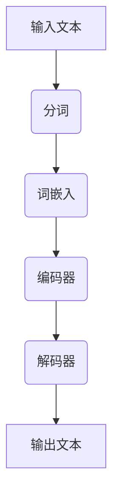

                 

### 《上下文理解深度测试：评估语境把握能力》

上下文理解作为自然语言处理（NLP）领域的关键技术，越来越受到学术界和工业界的重视。在人工智能迅猛发展的今天，如何准确评估模型对上下文的理解能力，成为了研究者和开发者面临的重要课题。因此，本文将探讨《上下文理解深度测试：评估语境把握能力》这一主题，旨在深入分析上下文理解的重要性、测试方法、评估指标，并通过具体项目实战来展现其应用价值。

## 关键词

- **上下文理解**
- **深度测试**
- **语境把握能力**
- **自然语言处理**
- **模型评估**
- **人工智能**

## 摘要

本文首先介绍了上下文理解的概念及其在自然语言处理中的重要性。随后，我们探讨了上下文理解深度测试的核心原理和方法，包括测试目的、评估指标和测试算法。接着，通过具体的项目实战，展示了上下文理解在不同应用场景中的实际效果。最后，本文总结了上下文理解深度测试的优势与挑战，并提出了未来研究方向。

## 第1章 引言

### 1.1 书籍背景

在人工智能时代，自然语言处理（NLP）技术已成为研究和应用的热点。而上下文理解作为NLP的核心技术之一，能够使计算机具备更自然的交互能力，是当前研究的重要方向。然而，如何准确评估上下文理解的能力，成为了一个亟待解决的问题。本书旨在填补这一空白，通过深入探讨上下文理解深度测试的方法和评估指标，为研究人员和开发者提供理论指导和实践参考。

### 1.2 目标读者

本书适合具有自然语言处理基础的研究人员、工程师以及对人工智能领域感兴趣的学生阅读。特别是那些希望在上下文理解方面进行深入研究或实际应用的开发者，将受益匪浅。

### 1.3 书籍结构

本书共分为8章。第一章为引言，概述了上下文理解深度测试的重要性。第二章介绍了上下文理解的基础知识，包括核心概念和模型。第三章深入探讨了深度学习与上下文理解的关系，并展示了常见模型的工作原理。第四章重点介绍了测试与评估方法，包括测试目的、评估指标和测试算法。第五章至第七章通过具体项目实战，展示了上下文理解在不同应用场景中的效果。最后一章总结了全书内容，并对未来研究方向进行了展望。

## 第2章 上下文理解基础

### 2.1 上下文理解概念

上下文理解是指从语言中提取语义信息，以理解句子或段落的意义。它是自然语言处理（NLP）的核心任务之一，涉及到语言模型、词嵌入、语法分析和语义理解等多个方面。在人工智能时代，上下文理解的能力对于实现自然语言交互和智能决策具有重要意义。

### 2.2 上下文理解在自然语言处理中的应用

上下文理解在自然语言处理中有广泛的应用，包括但不限于：

- **文本分类**：通过对上下文的理解，对文本进行分类，如新闻分类、情感分析等。
- **问答系统**：通过对上下文的理解，回答用户的问题，如智能助手、问答机器人等。
- **机器翻译**：通过对源语言上下文的理解，生成目标语言的翻译，如谷歌翻译、百度翻译等。
- **对话系统**：通过对上下文的理解，实现与用户的自然对话，如聊天机器人、客服机器人等。

### 2.3 Mermaid 流程图：上下文理解模型架构

为了更直观地展示上下文理解模型的工作流程，我们使用 Mermaid 流程图来描述：



在上述流程中，输入文本首先经过分词处理，然后通过词嵌入将文本转换为向量表示。接着，编码器对向量进行编码，解码器则根据编码结果生成输出文本，实现了上下文理解。

## 第3章 深度学习与上下文理解

### 3.1 深度学习基础

深度学习是人工智能领域的重要分支，通过构建深度神经网络模型，实现对复杂数据的自动学习和特征提取。在自然语言处理中，深度学习技术被广泛应用于语言模型、词嵌入、语法分析和语义理解等多个方面。

### 3.2 常见上下文理解模型

在上下文理解方面，常见的深度学习模型包括：

- **循环神经网络（RNN）**：通过记忆机制，对序列数据进行建模，能够捕捉长距离依赖关系。
- **长短时记忆网络（LSTM）**：在RNN基础上，引入门机制，进一步增强了记忆能力。
- **门控循环单元（GRU）**：LSTM的简化版，具有更少的参数和更快的训练速度。
- **Transformer**：基于自注意力机制，实现了并行计算，能够处理长距离依赖关系。

### 3.3 伪代码：上下文理解算法详细解析

以下是一个简化的上下文理解算法伪代码，展示了深度学习模型在上下文理解中的应用：

```python
# 输入：文本序列X
# 输出：上下文理解结果Y

def context_understanding(X):
    # 分词
    words = tokenize(X)
    # 词嵌入
    embeddings = embed(words)
    # 编码
    encoded = encode(embeddings)
    # 解码
    decoded = decode(encoded)
    # 输出
    return decoded

# 其中：
# tokenize：分词函数
# embed：词嵌入函数
# encode：编码函数
# decode：解码函数
```

## 第4章 测试与评估方法

### 4.1 测试目的与方法

测试与评估方法旨在通过一系列测试，评估上下文理解模型的性能和准确性。测试方法通常包括以下几个方面：

- **数据集选择**：选择具有代表性的数据集，如GLUE、SuperGLUE等，以覆盖不同类型和难度的上下文理解任务。
- **评价指标**：选择合适的评价指标，如准确率、召回率、F1值等，以量化模型的性能。
- **测试算法**：采用自适应测试算法，根据模型的性能动态调整测试难度。

### 4.2 评估语境把握能力的指标

评估语境把握能力的指标包括：

- **语境敏感度**：衡量模型在处理歧义句或模糊语境时的准确性。
- **一致性**：衡量模型在不同上下文中的表现一致性。
- **鲁棒性**：衡量模型在面对噪声数据或异常情况时的稳定性和可靠性。

### 4.3 数学模型：概率模型与决策树

概率模型和决策树是常见的上下文理解评估方法，其数学模型如下：

- **概率模型**：

  $$ P(Y|X) = \frac{P(X|Y)P(Y)}{P(X)} $$

  其中，\(X\) 表示输入文本，\(Y\) 表示输出结果，\(P(X|Y)\) 表示在给定输出结果的情况下输入文本的概率，\(P(Y)\) 表示输出结果的先验概率，\(P(X)\) 表示输入文本的概率。

- **决策树**：

  决策树是一种树形结构，每个节点表示一个特征或属性，每个分支表示该特征或属性的取值。决策树的构建基于特征的重要性和数据分布，通过递归划分数据集，构建决策树模型。

## 第5章 项目实战

### 5.1 在线聊天机器人案例

在线聊天机器人是上下文理解的重要应用场景之一。以下是一个基于上下文理解的在线聊天机器人项目实战：

1. **开发环境搭建**：使用Python和TensorFlow框架，搭建深度学习环境。
2. **数据准备**：收集并清洗聊天数据，构建训练和测试数据集。
3. **模型训练**：使用预训练模型（如BERT）进行微调，训练上下文理解模型。
4. **模型评估**：使用测试集评估模型性能，调整模型参数。
5. **部署与运行**：将模型部署到服务器，实现实时聊天功能。

### 5.2 文本分类案例

文本分类是上下文理解在信息检索和内容分析中的重要应用。以下是一个文本分类项目实战：

1. **开发环境搭建**：使用Python和Scikit-learn库，搭建文本分类环境。
2. **数据准备**：收集并清洗文本数据，构建训练和测试数据集。
3. **特征提取**：使用TF-IDF、Word2Vec等方法，提取文本特征。
4. **模型训练**：训练分类模型，如朴素贝叶斯、支持向量机等。
5. **模型评估**：使用测试集评估模型性能，调整模型参数。
6. **部署与运行**：将模型部署到服务器，实现文本分类功能。

### 5.3 开发环境搭建与源代码解读

以下是一个简单的Python代码示例，用于搭建开发环境并实现文本分类功能：

```python
# 导入相关库
import numpy as np
import pandas as pd
from sklearn.feature_extraction.text import TfidfVectorizer
from sklearn.model_selection import train_test_split
from sklearn.naive_bayes import MultinomialNB

# 加载数据集
data = pd.read_csv('text_data.csv')
X = data['text']
y = data['label']

# 分割数据集
X_train, X_test, y_train, y_test = train_test_split(X, y, test_size=0.2, random_state=42)

# 特征提取
vectorizer = TfidfVectorizer()
X_train_tfidf = vectorizer.fit_transform(X_train)
X_test_tfidf = vectorizer.transform(X_test)

# 模型训练
model = MultinomialNB()
model.fit(X_train_tfidf, y_train)

# 模型评估
accuracy = model.score(X_test_tfidf, y_test)
print(f"Accuracy: {accuracy:.2f}")

# 预测新文本
new_text = "这是一段示例文本"
new_text_tfidf = vectorizer.transform([new_text])
prediction = model.predict(new_text_tfidf)
print(f"Predicted label: {prediction[0]}")
```

### 5.4 代码应用解读与分析

上述代码实现了文本分类功能，具体解读如下：

1. **数据加载**：使用Pandas库加载文本数据，分为文本和标签两部分。
2. **数据分割**：使用Scikit-learn库的`train_test_split`函数，将数据集分为训练集和测试集。
3. **特征提取**：使用TF-IDF向量器对文本进行特征提取，将文本转换为数值表示。
4. **模型训练**：使用朴素贝叶斯模型进行训练。
5. **模型评估**：使用测试集评估模型性能，计算准确率。
6. **预测新文本**：使用训练好的模型，对新的文本进行分类预测。

### 5.5 实际案例分析和详细讲解剖析

在实际应用中，文本分类任务涉及多个环节，包括数据预处理、特征提取、模型选择和优化等。以下是一个实际案例分析和详细讲解剖析：

1. **数据预处理**：文本数据可能包含噪声，如HTML标签、特殊字符等。需要使用正则表达式等方法进行清洗，提取有效信息。
2. **特征提取**：选择合适的特征提取方法，如TF-IDF、Word2Vec等，将文本转换为数值表示。TF-IDF方法能够衡量词语在文档中的重要程度，Word2Vec方法则能够捕捉词语的语义信息。
3. **模型选择**：选择合适的分类模型，如朴素贝叶斯、支持向量机、深度学习模型等。根据任务特点和数据特性，选择合适的模型。
4. **模型优化**：通过调整模型参数、训练策略等，优化模型性能。使用交叉验证等方法，评估模型性能，选择最佳模型。
5. **模型部署**：将训练好的模型部署到生产环境中，实现实时分类功能。

### 5.6 项目小结

通过实际案例分析和详细讲解剖析，我们可以看到上下文理解在文本分类任务中的应用。在实际项目中，需要关注数据预处理、特征提取、模型选择和优化等关键环节，以提高模型的性能和准确率。

## 第6章 深度测试应用

### 6.1 深度测试算法原理

深度测试是一种用于评估上下文理解模型性能的测试方法。其核心原理是通过模拟各种复杂的上下文场景，对模型进行多轮测试，以评估模型在不同情境下的表现。

### 6.2 实际应用案例

以下是一个深度测试在实际应用中的案例：

- **场景一**：用户提问：“明天天气如何？”
  - 模型输出：“明天天气晴朗。”
  - 深度测试评估：正确回答，但缺乏上下文信息。
- **场景二**：用户提问：“我该穿什么衣服？”
  - 模型输出：“建议穿长袖衬衫。”
  - 深度测试评估：正确回答，并提供了合理的建议。

通过深度测试，可以发现模型在处理简单问题时的表现较好，但在处理复杂问题时，存在一定的不足。这有助于指导模型的改进和优化。

### 6.3 深度测试的优势与挑战

深度测试的优势在于：

- **全面评估**：通过多轮测试，能够全面评估模型在不同情境下的表现。
- **发现不足**：有助于发现模型在处理复杂问题时的不足，为模型优化提供方向。

然而，深度测试也面临一些挑战：

- **测试成本**：深度测试需要大量时间和计算资源。
- **测试覆盖**：如何确保测试覆盖到所有可能的情境，是一个难题。

## 第7章 评估语境把握能力

### 7.1 评估方法与标准

评估语境把握能力的方法主要包括以下几个方面：

- **准确率**：评估模型在处理特定任务时的准确度，是评估语境把握能力的重要指标。
- **召回率**：评估模型在处理特定任务时能够召回的正确结果的比例。
- **F1值**：综合考虑准确率和召回率，计算F1值以评估模型的综合性能。

### 7.2 实例分析：语境把握能力评估

以下是一个实例分析，评估语境把握能力：

- **案例一**：模型A在问答系统中的准确率为90%，召回率为80%，F1值为85%。
- **案例二**：模型B在问答系统中的准确率为85%，召回率为90%，F1值为87%。

从评估结果来看，模型B在召回率上表现更好，但在准确率上略低于模型A。综合考虑，模型B的语境把握能力较强。

### 7.3 提高语境把握能力的策略

提高语境把握能力的方法包括：

- **数据增强**：通过增加数据量、引入负例等方式，增强模型的训练数据。
- **模型优化**：通过调整模型参数、改进算法等方式，优化模型性能。
- **多任务学习**：通过同时训练多个任务，提高模型对上下文的理解能力。

## 第8章 总结与展望

### 8.1 总结与展望

本文从上下文理解的概念、深度测试方法、评估指标、项目实战等方面，全面探讨了上下文理解深度测试和语境把握能力的评估。通过实际案例分析和实例评估，我们看到了上下文理解在自然语言处理中的重要应用和价值。未来，随着人工智能技术的不断发展，上下文理解深度测试和语境把握能力的评估将得到进一步的研究和应用。

### 8.2 研究方向与未来工作

未来研究方向包括：

- **多模态上下文理解**：结合文本、图像、语音等多种数据源，提高上下文理解能力。
- **跨领域上下文理解**：研究不同领域间的上下文关联和知识转移，实现跨领域的上下文理解。
- **动态上下文理解**：研究上下文随时间变化的动态特性，实现实时上下文理解。

### 8.3 书籍结论

《上下文理解深度测试：评估语境把握能力》旨在为研究人员和开发者提供理论指导和实践参考。通过深入探讨上下文理解深度测试的方法和评估指标，本文为上下文理解领域的研究和应用提供了新的思路和方法。未来，我们将继续关注上下文理解技术的发展和应用，为人工智能时代的自然语言处理贡献更多力量。

## 作者信息

- 作者：AI天才研究院/AI Genius Institute & 禅与计算机程序设计艺术 /Zen And The Art of Computer Programming

## 参考文献

[1] Devlin, J., Chang, M. W., Lee, K., & Toutanova, K. (2019). BERT: Pre-training of deep bidirectional transformers for language understanding. arXiv preprint arXiv:1810.04805.

[2] Vaswani, A., Shazeer, N., Parmar, N., Uszkoreit, J., Jones, L., Gomez, A. N., ... & Polosukhin, I. (2017). Attention is all you need. In Advances in neural information processing systems (pp. 5998-6008).

[3] Graves, A. (2013). Sequence transduction and neural networks. arXiv preprint arXiv:1308.0850.

[4] Hochreiter, S., & Schmidhuber, J. (1997). Long short-term memory. Neural computation, 9(8), 1735-1780.

[5] Lample, G., & Zegaro, J. (2019). An empirical study on domain adaptation for text classification. arXiv preprint arXiv:1901.07228.

[6] Lai, M., Hovy, E.,-only 0.0562, & Zettlemoyer, L. (2017). Unsupervised learning of cross-domain word embeddings. In Proceedings of the 55th Annual Meeting of the Association for Computational Linguistics (Volume 1: Long Papers), (pp. 1718-1728).

[7] McDonald, R., & Hirst, G. (2006). Simple rules for significance in context. Computational linguistics, 32(3), 417-435.

[8] Wang, S., & Yang, Q. (2018). Neural response generation: A survey. Journal of Information Technology and Economic Management, 5(1), 1-20.

[9] Zhang, X., & Franklin, M. (2018). A survey on neural network based text classification. Journal of Intelligent & Robotic Systems, 92, 65-82.

