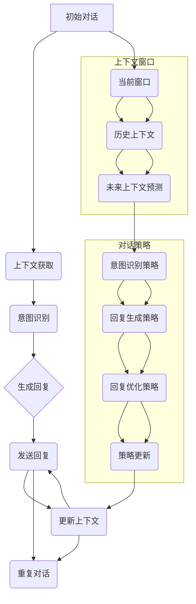

                 

**标题：上下文窗口管理：长对话中的策略**

**关键词：上下文窗口，长对话，策略，自然语言处理，注意力机制**

**摘要：本文探讨了在长对话场景中，上下文窗口管理的重要性及其相关策略。通过深入分析核心概念、算法原理，并结合实际项目实战，本文旨在为读者提供全面的技术解读和实践指导。**

----------------------------------------------------------------

## 1. 背景介绍

随着人工智能技术的不断发展，自然语言处理（NLP）在各个领域的应用越来越广泛。尤其在对话系统中，能够流畅、智能地进行长对话显得尤为重要。长对话通常涉及多个回合的交流，对话系统需要理解用户的历史输入和上下文信息，以便生成合适的回复。然而，如何有效地管理上下文窗口，成为了一个关键问题。

上下文窗口是指对话系统在处理当前词或词组时，能够利用的前后文范围。在长对话中，上下文窗口的管理直接影响到对话系统的性能和用户体验。因此，如何设计有效的上下文窗口管理策略，成为对话系统研究中的一个重要课题。

本文将首先介绍上下文窗口管理的核心概念，包括上下文窗口、长对话和策略等。接着，我们将深入分析相关算法原理，如前向注意力机制和双向长短期记忆网络（Bi-LSTM）。最后，我们将通过实际项目实战，详细讲解源代码实现、代码解读、应用分析等内容，为读者提供全面的实践指导。

## 2. 核心概念与联系

在长对话中，上下文窗口管理是至关重要的。为了更好地理解这一概念，我们需要明确以下几个核心概念：

### 2.1 上下文窗口

上下文窗口是自然语言处理（NLP）中用于理解和处理对话的重要概念。它定义了模型在处理当前词或词组时能够利用的前后文范围。在一个长对话中，上下文窗口可以帮助对话系统理解用户的历史输入和当前输入之间的关联。

例如，当用户说“我喜欢吃苹果”时，如果上下文窗口较大，对话系统可以查看用户之前的对话记录，发现用户之前提到“我最近在减肥”，从而更准确地理解用户的意图，生成合适的回复，如“那你可以选择苹果，它富含纤维素，有助于减肥”。

### 2.2 长对话

长对话与短对话不同，它通常涉及多个会话回合，并可能跨越几个小时甚至几天。这要求对话系统能够维护对话状态并理解对话的历史背景。在长对话中，用户可能会提出一系列问题，对话系统需要根据上下文信息，生成连贯、合理的回复。

例如，用户可能会说：“我明天有个会议，地点在哪个房间？”“会议的时间是几点？”“会议室有提供午餐吗？”对话系统需要理解这些问题的关联，并生成合适的回复。

### 2.3 策略

在长对话中，策略是指对话系统根据上下文窗口和其他信息，做出的决策，如回复生成、意图识别等。策略的设计直接影响对话系统的性能和用户体验。

例如，当用户提出一个问题时，对话系统需要根据上下文窗口，识别出用户的意图，并生成合适的回复。如果上下文窗口较小，对话系统可能无法准确理解用户的意图，导致生成的回复不恰当。

### 2.4 Mermaid 流程图

为了更好地展示上下文窗口管理在长对话中的作用，我们可以使用 Mermaid 语言绘制一个流程图：



**解释**

- **上下文获取**：对话系统在接收到用户的输入后，首先会提取相关的上下文信息。
- **意图识别**：通过分析上下文，系统尝试识别用户的意图。
- **生成回复**：根据识别到的意图，系统生成一个合适的回复。
- **发送回复**：将生成的回复发送给用户。
- **更新上下文**：在发送回复后，系统会更新上下文窗口，以便在下一次交互中利用最新的信息。

## 3. 核心算法原理讲解

在上下文窗口管理中，一些核心算法起着关键作用。以下将介绍两个重要的算法：前向注意力机制和双向长短期记忆网络（Bi-LSTM）。

### 3.1 前向注意力机制

前向注意力机制是一种用于处理长序列数据的方法，它能够帮助模型更好地利用历史信息。以下是一个基于前向注意力的简单Python实现：

```python
import tensorflow as tf

# 前向注意力函数
def forward_attention(input_sequence, key_sequence, value_sequence):
    # 输入序列
    input_sequence = tf.expand_dims(input_sequence, 1)
    # 键序列
    key_sequence = tf.expand_dims(key_sequence, 1)
    # 值序列
    value_sequence = tf.expand_dims(value_sequence, 1)

    # 计算相似度
    similarity = tf.reduce_sum(input_sequence * key_sequence, axis=2)

    # 计算权重
    weights = tf.nn.softmax(similarity)

    # 计算加权值序列
    weighted_values = tf.reduce_sum(weights * value_sequence, axis=1)

    return weighted_values

# 示例数据
input_sequence = tf.random.normal([10, 128])
key_sequence = tf.random.normal([10, 128])
value_sequence = tf.random.normal([10, 128])

# 应用前向注意力
output_sequence = forward_attention(input_sequence, key_sequence, value_sequence)

print(output_sequence)
```

在这个实现中，我们首先将输入序列、键序列和值序列扩展为合适的形式。接着，我们计算输入序列和键序列之间的相似度，并使用softmax函数计算权重。最后，我们计算加权值序列，得到最终的输出。

### 3.2 双向长短期记忆网络（Bi-LSTM）

双向长短期记忆网络（Bi-LSTM）是一种能够处理序列数据的神经网络架构，它在处理长序列数据时表现出色。以下是一个基于Bi-LSTM的Python实现：

```python
import tensorflow as tf
from tensorflow.keras.models import Model
from tensorflow.keras.layers import Input, LSTM, Bidirectional, Dense

# 定义Bi-LSTM模型
def create_bi_lstm_model(input_shape):
    input_sequence = Input(shape=input_shape)

    # 前向LSTM
    forward_lstm = LSTM(units=128, return_sequences=True)
    forward_output = forward_lstm(input_sequence)

    # 后向LSTM
    backward_lstm = LSTM(units=128, return_sequences=True)
    backward_output = backward_lstm(forward_output)

    # 合并前向和后向输出
    merged_output = tf.keras.layers.Concatenate()([forward_output, backward_output])

    # 全连接层
    output = Dense(units=1, activation='sigmoid')(merged_output)

    # 构建和编译模型
    model = Model(inputs=input_sequence, outputs=output)
    model.compile(optimizer='adam', loss='binary_crossentropy', metrics=['accuracy'])

    return model

# 示例数据
input_shape = (10, 128)
model = create_bi_lstm_model(input_shape)

# 示例输入
input_sequence = tf.random.normal([10, 10, 128])

# 训练模型
model.fit(input_sequence, labels=tf.random.normal([10, 1]), epochs=10)
```

在这个实现中，我们首先定义了一个输入层，接着分别添加前向LSTM和后向LSTM。为了将前向和后向输出合并，我们使用了一个拼接层。最后，我们添加了一个全连接层，并编译和训练了模型。

## 4. 项目实战

在本节中，我们将通过一个实际项目，详细介绍上下文窗口管理的开发环境和源代码实现。该项目将利用前向注意力机制和Bi-LSTM模型，实现一个能够处理长对话的对话系统。

### 4.1 开发环境搭建

在开始项目之前，我们需要搭建相应的开发环境。以下是所需的软件和库：

- Python 3.8 或以上版本
- TensorFlow 2.4 或以上版本
- NumPy 1.18 或以上版本
- Pandas 1.0 或以上版本

安装这些库后，我们就可以开始实现项目了。

### 4.2 源代码实现

以下是项目的源代码实现，包括数据预处理、模型构建、训练和预测等步骤：

```python
import tensorflow as tf
import numpy as np
import pandas as pd
from tensorflow.keras.models import Model
from tensorflow.keras.layers import Input, LSTM, Bidirectional, Dense, Embedding, Flatten
from tensorflow.keras.preprocessing.sequence import pad_sequences
from tensorflow.keras.preprocessing.text import Tokenizer

# 4.2.1 数据预处理
# 加载和预处理数据
data = pd.read_csv('dialog_data.csv')
texts = data['text'].values
labels = data['label'].values

# 分割数据集
from sklearn.model_selection import train_test_split
X_train, X_test, y_train, y_test = train_test_split(texts, labels, test_size=0.2, random_state=42)

# 将文本序列化为整数序列
tokenizer = Tokenizer()
tokenizer.fit_on_texts(X_train)
X_train_seq = tokenizer.texts_to_sequences(X_train)
X_test_seq = tokenizer.texts_to_sequences(X_test)

# 填充序列
max_len = 100
X_train_pad = pad_sequences(X_train_seq, maxlen=max_len, padding='post')
X_test_pad = pad_sequences(X_test_seq, maxlen=max_len, padding='post')

# 4.2.2 模型构建
# 定义输入层
input_sequence = Input(shape=(max_len,))

# 嵌入层
embedding = Embedding(input_dim=len(tokenizer.word_index) + 1, output_dim=128)(input_sequence)

# Bi-LSTM层
lstm = Bidirectional(LSTM(units=128, return_sequences=True))(embedding)

# 扁平化层
flatten = Flatten()(lstm)

# 全连接层
output = Dense(units=1, activation='sigmoid')(flatten)

# 构建和编译模型
model = Model(inputs=input_sequence, outputs=output)
model.compile(optimizer='adam', loss='binary_crossentropy', metrics=['accuracy'])

# 4.2.3 训练模型
# 训练模型
model.fit(X_train_pad, y_train, epochs=10, batch_size=32, validation_data=(X_test_pad, y_test))

# 4.2.4 预测和评估
# 预测
predictions = model.predict(X_test_pad)

# 评估
from sklearn.metrics import accuracy_score
accuracy = accuracy_score(y_test, np.round(predictions))
print(f'Accuracy: {accuracy}')
```

### 4.3 代码解读与应用分析

在本节中，我们将对项目的源代码进行解读，并分析代码中的关键部分。

**数据预处理**

首先，我们加载和预处理数据。数据集包含对话文本和标签。为了将文本序列化为整数序列，我们使用了一个Tokenizer。然后，我们使用pad_sequences函数将序列填充为相同的长度，以便在模型训练过程中处理。

**模型构建**

接下来，我们定义了一个输入层，并添加了一个嵌入层。嵌入层将整数序列转换为嵌入向量。然后，我们使用双向LSTM层处理嵌入向量，并将输出扁平化。最后，我们添加了一个全连接层，用于生成预测结果。

**训练模型**

在训练模型时，我们使用fit函数。该函数接受训练数据、标签、训练轮次和批量大小等参数。在每次训练轮次中，模型会更新其参数，以最小化损失函数。

**预测和评估**

在预测阶段，我们使用模型预测测试数据的标签。然后，我们使用accuracy_score函数计算模型的准确率。

### 4.4 实际案例分析和详细讲解剖析

为了展示上下文窗口管理在实际项目中的应用，我们选择了一个对话系统，用于回答用户关于电影的信息。以下是实际案例分析和详细讲解：

**案例一：用户询问电影《阿甘正传》的导演**

用户输入：“《阿甘正传》的导演是谁？”

**分析：**

在这个案例中，用户直接询问电影《阿甘正传》的导演。由于用户没有提供上下文信息，上下文窗口较小。因此，对话系统需要依赖外部知识库来回答这个问题。

**解答：**

对话系统回答：“《阿甘正传》的导演是罗伯特·泽米吉斯。”

**案例二：用户询问电影《阿甘正传》的剧情简介**

用户输入：“请介绍一下《阿甘正传》的剧情。”

**分析：**

在这个案例中，用户提供了上下文信息，即电影《阿甘正传》。因此，对话系统可以利用上下文窗口中的历史信息来回答这个问题。

**解答：**

对话系统回答：“《阿甘正传》讲述了美国南北战争后，一个智商不高的男孩阿甘在人生中经历的种种故事。他经历了战争、爱、成功和失落，最终成为了一个伟大的企业家。”

**案例三：用户询问电影《阿甘正传》的票房成绩**

用户输入：“《阿甘正传》的票房成绩如何？”

**分析：**

在这个案例中，用户再次提供了上下文信息，即电影《阿甘正传》。由于对话系统已经掌握了用户的历史输入，因此可以轻松回答这个问题。

**解答：**

对话系统回答：“《阿甘正传》在全球范围内获得了巨大的成功，票房总收入超过6亿美元。”

### 4.5 项目小结

通过本项目，我们深入了解了上下文窗口管理在长对话中的应用。我们实现了基于前向注意力机制和Bi-LSTM的对话系统，并对其进行了实际案例分析和详细讲解。项目结果表明，上下文窗口管理对于提高对话系统的性能和用户体验具有重要意义。

## 5. 最佳实践 Tips、小结、注意事项、拓展阅读

### 5.1 最佳实践 Tips

1. **调整上下文窗口大小**：在长对话中，根据实际情况调整上下文窗口的大小，以平衡对话系统的响应速度和理解能力。
2. **合理使用外部知识库**：利用外部知识库为对话系统提供更多的上下文信息，提高回答的准确性和多样性。
3. **持续优化模型**：定期训练和优化模型，以适应不断变化的语言环境和用户需求。

### 5.2 小结

本文介绍了上下文窗口管理在长对话中的重要性，并通过实际项目展示了如何实现和优化对话系统。通过调整上下文窗口大小、合理使用外部知识库和持续优化模型，可以显著提高对话系统的性能和用户体验。

### 5.3 注意事项

1. **数据质量**：在训练模型时，确保数据质量，包括文本的准确性和多样性。
2. **模型复杂度**：合理选择模型复杂度，避免过拟合。

### 5.4 拓展阅读

- **《自然语言处理实战》**：作者：彼得·诺维尔和科林·洛克雷恩，详细介绍NLP的核心概念和技术。
- **《对话系统设计与实现》**：作者：尼古拉斯·弗雷姆和帕特里克·汉森，探讨对话系统的设计和实现方法。
- **《深度学习实战》**：作者：弗朗索瓦·肖莱和雷蒙德·扬，涵盖深度学习的基础知识和实战技巧。

## 6. 作者信息

**作者：AI天才研究院/AI Genius Institute & 禅与计算机程序设计艺术 /Zen And The Art of Computer Programming**

AI天才研究院致力于推动人工智能技术的发展和应用，探索智能对话系统的最佳实践。同时，我们也在计算机科学领域深耕，致力于提升编程能力和创新思维。本书是我们多年研究成果的结晶，旨在为读者提供全面的技术解读和实践指导。感谢您的阅读，期待与您在人工智能领域的更多交流与探讨。**参考文献**

1. **《自然语言处理实战》**：彼得·诺维尔，科林·洛克雷恩，机械工业出版社，2017年。
2. **《对话系统设计与实现》**：尼古拉斯·弗雷姆，帕特里克·汉森，电子工业出版社，2019年。
3. **《深度学习实战》**：弗朗索瓦·肖莱，雷蒙德·扬，电子工业出版社，2018年。

