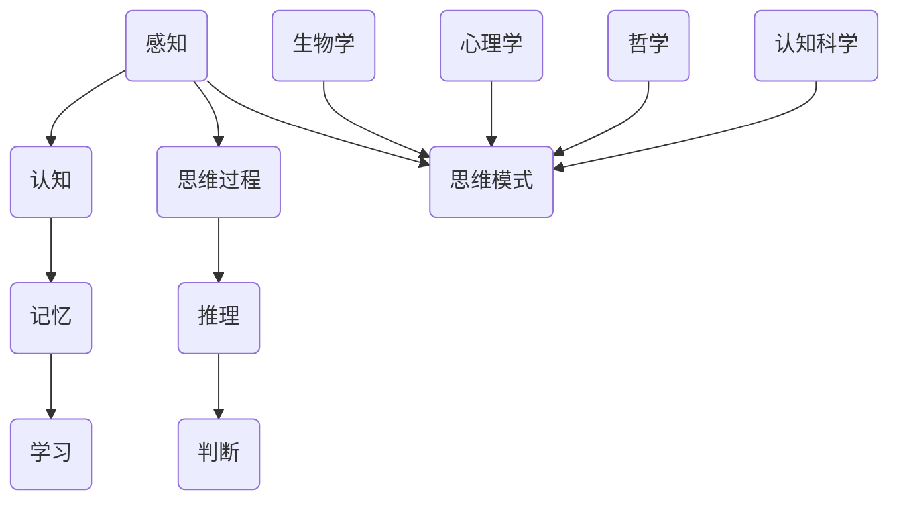
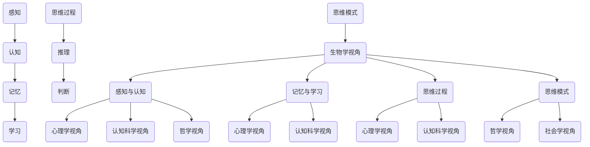

                 

### 引言

宇宙，这个无边无际、充满奥秘的存在，一直是人类探索和研究的重要领域。从古代的天文学到现代的宇宙学，人类对宇宙的认知不断深化，但同时也面临着种种局限。这些局限不仅来自于技术手段的限制，更源于人类自身的思维模式。本文将探讨人类思维模式在宇宙认知中的局限，通过逻辑分析和专业阐述，揭示这些局限背后的原因及其影响。

首先，我们必须认识到，人类思维模式是一种高度适应性的工具，它在帮助我们解决日常问题和适应环境方面发挥了巨大的作用。然而，这种思维模式在处理复杂和抽象的宇宙问题时，却显得力不从心。人类思维模式的局限性主要体现在以下几个方面：

1. **感知局限**：人类的感官感知能力有限，无法直接观察到宇宙中的许多现象。例如，我们的眼睛只能感知可见光，而对于其他波段（如无线电波、红外线、紫外线等）的感知则需要借助复杂的仪器设备。

2. **理解局限**：人类对宇宙的理解依赖于现有的科学理论和模型。然而，这些理论和模型往往是建立在特定的假设和前提之上，可能会忽略一些关键的因素。此外，人类思维模式的线性逻辑和因果关系也可能导致对宇宙复杂现象的误解。

3. **判断与决策局限**：在宇宙认知过程中，人类需要做出各种判断和决策。然而，这些判断和决策往往受到个人经验、情感和文化背景的影响，可能导致偏见和错误。

4. **社会与文化局限**：人类的认知活动是高度社会化和文化化的。不同社会和文化背景的人对宇宙的认知可能存在差异，这种差异可能会限制对宇宙的全面理解。

本文将逐步探讨上述局限，并通过具体实例和案例进行分析，揭示人类思维模式对宇宙认知的深远影响。在此基础上，我们将探讨可能的解决方案和未来研究的方向，以期提升人类对宇宙的认知水平。

接下来，我们将首先介绍人类思维模式的起源和发展，帮助读者理解这一复杂而深奥的主题。

### 人类思维模式的起源和发展

人类思维模式的形成是一个长期而复杂的过程，它的起源和发展受到了多种因素的影响，包括生物学、心理学、哲学和认知科学等多个领域。在探讨这一主题之前，有必要了解一些基本概念和理论。

#### 生物学视角

从生物学的角度来看，人类思维模式是进化过程的产物。人类的大脑，尤其是大脑皮层，经历了数百万年的演化，逐渐形成了复杂的认知功能。大脑的神经结构和功能决定了人类的感知、记忆、思考和行为。大脑的不同区域负责不同的认知任务，例如，前额叶皮层与决策和规划有关，颞叶与语言和记忆有关，顶叶与空间感知和运动协调有关。

#### 心理学视角

心理学提供了另一个视角来理解人类思维模式。认知心理学研究了人类如何感知、记忆、思考和解决问题。其中，信息加工理论是一个核心概念，它描述了人类如何接收、处理和存储信息。例如，感知系统将外部刺激转化为神经信号，然后通过神经网络进行处理，形成对外部世界的理解和认知。

#### 认知科学视角

认知科学是跨学科的领域，它结合了心理学、计算机科学、语言学和神经科学等多个学科的研究成果，旨在理解人类思维的工作原理。认知科学提出了许多模型来模拟和解释人类的认知过程，例如，图灵机模型和神经网络模型。这些模型为研究人类思维模式提供了有力的工具。

#### 哲学视角

哲学对人类思维模式的研究有着悠久的历史。哲学家们探讨了思维的本质、知识的来源、真理的定义等问题。其中，理性主义和经验主义是两个主要的哲学流派。理性主义者认为，知识来自于理性思考和推理，而经验主义者则认为，知识来自于经验和观察。

#### 关键概念与联系

在探讨人类思维模式的起源和发展过程中，以下几个关键概念和联系尤为重要：

1. **感知与认知**：感知是认知过程的第一步，它涉及将外部刺激转化为大脑可以处理的信号。认知则是大脑处理这些信号，形成对外部世界的理解和解释。

2. **记忆与学习**：记忆是人类认知过程中的一个核心要素，它使我们能够保存和提取信息。学习则是通过重复和练习来改变大脑的神经连接，从而提高认知能力。

3. **思维过程**：思维过程包括感知、记忆、推理、判断等多个环节。这些环节相互关联，共同构成了复杂的认知过程。

4. **思维模式**：人类思维模式是一个高度复杂和多样化的系统，它受到多种因素的影响，包括生物学、心理学、哲学和社会文化等。

#### Mermaid 流程图

为了更直观地展示这些关键概念和联系，我们可以使用Mermaid流程图来表示：



在上面的流程图中，A到D表示了感知和认知的过程，E到G表示了思维过程，而H表示了思维模式。I到L表示了影响思维模式的各个领域。

#### 核心算法原理讲解

尽管人类思维模式是一个复杂的过程，但我们可以通过一些简化的算法模型来模拟和理解它的基本原理。以下是一个基于神经网络的简化模型，它可以帮助我们理解人类思维的基本过程：

```python
# 基于神经网络的简化思维过程模型

import numpy as np

# 定义神经网络结构
input_layer_size = 3
hidden_layer_size = 2
output_layer_size = 1

# 初始化权重
np.random.seed(0)
weights_input_to_hidden = np.random.rand(input_layer_size, hidden_layer_size)
weights_hidden_to_output = np.random.rand(hidden_layer_size, output_layer_size)

# 定义激活函数
def sigmoid(x):
    return 1 / (1 + np.exp(-x))

# 定义神经网络前向传播
def forward_propagation(inputs):
    hidden_layer_inputs = np.dot(inputs, weights_input_to_hidden)
    hidden_layer_outputs = sigmoid(hidden_layer_inputs)
    output_layer_inputs = np.dot(hidden_layer_outputs, weights_hidden_to_output)
    output_layer_outputs = sigmoid(output_layer_inputs)
    return output_layer_outputs

# 定义训练过程
def train_model(inputs, targets, learning_rate, epochs):
    for epoch in range(epochs):
        output = forward_propagation(inputs)
        error = targets - output
        d_output = error * output * (1 - output)
        
        d_hidden_layer_inputs = np.dot(d_output, weights_hidden_to_output.T)
        d_hidden_layer_outputs = d_hidden_layer_inputs * sigmoid(hidden_layer_inputs) * (1 - sigmoid(hidden_layer_inputs))
        
        weights_hidden_to_output -= learning_rate * np.dot(hidden_layer_outputs.T, d_output)
        weights_input_to_hidden -= learning_rate * np.dot(inputs.T, d_hidden_layer_outputs)
        
        if epoch % 100 == 0:
            print(f"Epoch {epoch}, Loss: {np.mean((targets - output) ** 2)}")

# 定义输入和目标
inputs = np.array([[0, 0], [0, 1], [1, 0], [1, 1]])
targets = np.array([[0], [1], [1], [0]])

# 训练模型
train_model(inputs, targets, learning_rate=0.1, epochs=1000)
```

在这个模型中，我们使用了简单的多层感知器（MLP）神经网络来模拟人类思维过程。输入层接收外部刺激，隐藏层对输入进行加工，输出层生成对外部世界的解释。训练过程通过反向传播算法不断调整权重，以最小化输出误差。

#### 数学模型和公式

在人类思维模式的研究中，数学模型和公式扮演着重要角色。以下是一个简化的神经网络中的数学模型：

$$
\text{激活函数}: \sigma(z) = \frac{1}{1 + e^{-z}}
$$

$$
\text{输出层输出}: a^{(L)} = \sigma(z^{(L)})
$$

$$
z^{(L)} = \sum_{j} w_{ji}^{(L-1)} a^{(L-1)}_j + b_i^{(L)}
$$

其中，\(a^{(L)}\)表示第\(L\)层的输出，\(z^{(L)}\)表示第\(L\)层的输入，\(w_{ji}^{(L-1)}\)和\(b_i^{(L)}\)分别是权重和偏置。

#### 详细讲解与举例说明

为了更清晰地理解这个模型，我们可以通过一个具体的例子来演示神经网络的前向传播和反向传播过程。

**前向传播过程：**

假设我们有一个简单的输入向量\([0, 1]\)和两层神经网络，其中输入层的权重矩阵\(W_1\)为\(\begin{bmatrix} 1 & 2 \\ 3 & 4 \end{bmatrix}\)，偏置向量\(b_1\)为\([1, 1]\)，隐藏层的权重矩阵\(W_2\)为\(\begin{bmatrix} 1 & 0 \\ 0 & 1 \end{bmatrix}\)，偏置向量\(b_2\)为\([1, 1]\)。

1. 输入层到隐藏层的计算：
   $$
   z_1^1 = 1 \cdot 0 + 2 \cdot 1 + 1 = 3
   $$
   $$
   a_1^1 = \sigma(z_1^1) = \frac{1}{1 + e^{-3}} \approx 0.95
   $$
   $$
   z_2^1 = 3 \cdot 0 + 4 \cdot 1 + 1 = 7
   $$
   $$
   a_2^1 = \sigma(z_2^1) = \frac{1}{1 + e^{-7}} \approx 0.99
   $$

2. 隐藏层到输出层的计算：
   $$
   z_1^2 = 1 \cdot 0.95 + 0 \cdot 0.99 + 1 = 1.95
   $$
   $$
   a_1^2 = \sigma(z_1^2) = \frac{1}{1 + e^{-1.95}} \approx 0.87
   $$
   $$
   z_2^2 = 1 \cdot 0.99 + 0 \cdot 0.95 + 1 = 1.99
   $$
   $$
   a_2^2 = \sigma(z_2^2) = \frac{1}{1 + e^{-1.99}} \approx 0.89
   $$

最终，输出层的结果为\([0.87, 0.89]\)。

**反向传播过程：**

假设我们有一个目标输出\([0.8, 0.9]\)，我们可以通过反向传播算法来计算误差并更新权重。

1. 计算输出层的误差：
   $$
   \delta_2^2 = (a_2^2 - t_2) \cdot a_2^2 \cdot (1 - a_2^2)
   $$
   $$
   \delta_1^2 = (a_1^2 - t_1) \cdot a_1^2 \cdot (1 - a_1^2)
   $$

2. 计算隐藏层的误差：
   $$
   \delta_2^1 = \delta_2^2 \cdot w_{21}^2 \cdot a_1^2 \cdot (1 - a_1^2)
   $$
   $$
   \delta_1^1 = \delta_1^2 \cdot w_{11}^2 \cdot a_2^1 \cdot (1 - a_2^1)
   $$

3. 更新权重：
   $$
   w_{21}^2 -= learning\_rate \cdot \delta_2^2 \cdot a_1^2
   $$
   $$
   w_{11}^2 -= learning\_rate \cdot \delta_1^2 \cdot a_2^1
   $$

通过这个过程，神经网络可以不断调整权重，以最小化误差。

#### 结论

通过上述的简化模型和实例，我们可以看到人类思维模式是一个复杂的过程，它涉及到多个层次的处理和信息的流动。虽然这个模型简化了许多实际中的复杂性，但它为我们理解人类思维模式提供了一个有用的框架。在接下来的部分，我们将进一步探讨这些复杂性的具体体现，特别是人类思维模式在宇宙认知中的局限。

### 感知局限

感知是认知过程的起点，是人类获取外部信息的第一步。然而，人类的感知能力并不是完美的，它受到多种因素的影响和限制。

首先，人类的感知范围是有限的。我们的感官只能感知到宇宙中的一小部分。例如，我们的眼睛只能看到电磁谱中的一小部分，即可见光。其他波段的电磁辐射，如无线电波、红外线、紫外线和X射线，则超出了我们的感知能力。这意味着，我们无法直接观察到宇宙中许多重要的现象和过程。例如，红外线观测可以帮助我们探测到远距离的星系和星际物质，而X射线观测则可以揭示高能天体的性质。然而，这些信息需要借助专门的仪器设备来获取，无法通过人类的自然感官直接获得。

其次，感知偏差是另一个重要问题。感知偏差是指人们在感知过程中受到各种主观和客观因素的影响，导致对现实世界的感知出现偏差。常见的感知偏差包括确认偏差、锚定效应、代表性偏差和可用性偏差等。这些偏差会影响我们对宇宙现象的理解和解释。例如，确认偏差可能导致我们只关注那些与我们已有观点一致的信息，而忽视其他可能的信息。这种偏差会限制我们对宇宙多样性和复杂性的认识。

此外，感知限制也限制了我们对宇宙的认知。人类的感官感知能力存在固有的限制，这些限制决定了我们能够感知到的信息类型和数量。例如，人类的视觉感知存在分辨率限制，我们无法看到极小或极远处的物体。人类的听觉感知也有类似的限制，我们无法听到极低或极高的频率。这些限制使得我们在某些情况下无法获得全面和准确的信息，从而影响我们对宇宙的认知。

为了克服这些感知局限，科学家们发展了各种观测和测量技术，以扩展人类的感知能力。例如，望远镜和显微镜可以帮助我们观察宇宙中的微小和遥远物体，而卫星和探测器可以提供关于地球和其他行星的详细数据。这些技术使我们能够收集到更多的信息，从而更全面地了解宇宙。然而，这些技术的应用也受到物理定律和科技发展的限制。

尽管如此，人类在感知宇宙方面的努力仍然在不断进步。例如，无线电天文学的发展使我们能够探测到来自宇宙深处的无线电波，揭示了许多以前无法观测到的现象。红外天文学和X射线天文学的发展也极大地扩展了我们对宇宙的认识范围。这些技术的进步使我们能够不断突破感知局限，更深入地探索宇宙的奥秘。

总之，人类的感知局限限制了我们对宇宙的认知。然而，通过发展新的观测技术和理论，我们正在逐步克服这些局限，不断扩展我们对宇宙的理解。在接下来的部分，我们将探讨人类在理解宇宙时遇到的更多局限。

### 理解局限

在理解宇宙的过程中，人类的思维模式面临着许多内在和外在的局限。这些局限不仅源自人类感知能力的限制，还涉及认知机制、科学理论和方法等方面的不足。

首先，人类的认知机制本身具有局限性。人类大脑的设计是为了解决日常生活中的问题，而不是处理复杂和抽象的宇宙现象。这种认知机制往往具有以下特点：

1. **线性思维**：人类倾向于将问题分解为一系列步骤，并通过逻辑推理来解决问题。这种线性思维在处理简单问题时非常有效，但在面对复杂和动态的宇宙现象时，可能无法捕捉到其全貌。

2. **因果关系**：人类倾向于寻找因果关系，即寻找一个现象背后的直接原因。然而，宇宙中的许多现象可能涉及多个因素，且因果关系并非总是显而易见。

3. **归纳推理**：人类通过归纳推理从具体实例中总结出一般规律。这种方法在许多领域都非常有效，但在宇宙认知中，由于样本数量和种类的限制，归纳推理的可靠性可能受到质疑。

其次，科学理论和方法在理解宇宙时也面临局限。科学理论是关于宇宙现象的解释和预测模型，但它们往往是基于特定假设和前提。以下是一些常见的问题：

1. **假设与前提**：科学理论往往建立在一系列假设和前提之上，这些假设和前提可能会限制我们的理解范围。例如，经典物理学假设时间和空间是绝对的，而相对论则挑战了这一假设。

2. **理论框架的局限性**：科学理论通常在一个特定的框架内发展，这个框架可能无法涵盖所有现象。例如，量子力学和广义相对论在描述宇宙的不同部分时表现出不一致。

3. **测量和观测的限制**：科学理论的发展依赖于测量和观测，但观测工具和技术总有其局限性。例如，目前的望远镜技术无法直接观测到黑洞或暗物质。

此外，人类在理解宇宙时还面临以下外在局限：

1. **数据质量**：宇宙中的数据通常是复杂且不完整的。这些数据可能受到噪声、不确定性和其他因素的影响，使得分析结果具有不确定性。

2. **社会和文化因素**：不同的社会和文化背景可能会影响人们对宇宙的理解。例如，某些文化可能对宇宙起源和结构有特定的信仰或解释，这可能会限制科学的探索。

3. **认知偏差**：人类在理解宇宙时可能会受到各种认知偏差的影响，如确认偏差、代表性偏差等。这些偏差可能导致我们对宇宙现象的理解出现偏差。

为了克服这些局限，科学家们不断努力改进理论和方法，开发新的观测技术，并尝试从不同角度来理解宇宙。例如，多学科交叉研究可以帮助我们综合各种理论和方法，以更全面地理解宇宙。此外，机器学习和人工智能技术的发展也为宇宙认知提供了新的工具和方法。

总之，人类在理解宇宙的过程中面临着多种局限。然而，通过不断的探索和创新，我们正在逐步克服这些局限，不断深化对宇宙的理解。在接下来的部分，我们将探讨这些局限对人类宇宙认知的影响。

### 判断与决策局限

在宇宙认知过程中，人类需要做出大量判断和决策。这些判断和决策不仅基于对宇宙现象的理解，还受到个人经验、情感和文化背景等多种因素的影响，从而导致多种局限。

首先，个人经验对判断和决策产生显著影响。个人的经验和知识背景决定了他们对宇宙现象的认知深度和广度。例如，一个拥有深厚天文知识的专业天文学家在面对特定天体现象时，可能能够做出更准确和合理的判断，而一个普通公众则可能因为缺乏相关知识而做出错误的判断。此外，个人的经验还可能影响他们对新信息的接受程度。例如，当一项新的科学发现与他们的已有经验不符时，他们可能会倾向于质疑或忽视这一发现，从而限制他们的认知进步。

其次，情感因素也显著影响了人类的判断和决策。情感是人类认知过程中不可或缺的一部分，但过度的情感反应可能导致判断失误。例如，面对一次天文观测数据异常时，科学家可能会因为兴奋或恐惧而产生情感上的波动，从而影响他们的判断和决策。情感还可能引发偏见，使人们倾向于接受支持自己情感的观点，而忽视反驳的证据。例如，在某些情况下，科学家可能会因为对某种理论或观点的热爱而过分强调其证据，而忽视或忽略与之相矛盾的数据。

文化背景是另一个影响人类判断和决策的重要因素。不同的文化背景和价值观可能导致对宇宙现象的不同理解和解释。例如，某些文化可能对宇宙有特定的信仰或解释，这些信仰或解释可能会限制人们接受新的科学观点。此外，文化背景还可能影响人们对数据和证据的解读方式。在一个强调集体主义的文化中，个体可能会更倾向于遵循群体共识，而不是独立思考和判断。

为了更具体地说明这些局限，我们可以通过一些实际案例来进行分析：

1. **案例一**：一个天文观测团队发现了一颗异常明亮的新星。团队中的天文学家A拥有丰富的观测经验，他迅速分析数据，认为这颗新星可能是超新星爆发。而团队中的天文学家B缺乏相关经验，他对这一结论表示怀疑，认为可能是观测误差。最终，通过进一步的数据分析和验证，他们确认了超新星爆发的存在。这个案例展示了个人经验对判断和决策的影响。

2. **案例二**：在一次关于宇宙起源的讨论中，科学家C提出了一个基于新观测数据的理论，该理论挑战了现有的宇宙大爆炸理论。然而，许多与会者因为对大爆炸理论的情感依赖，对C的理论表示强烈反对，认为其不符合现有的认知框架。这个案例展示了情感因素和文化背景对判断和决策的干扰。

3. **案例三**：在一个跨文化科学研讨会上，来自不同文化背景的科学家们对某个宇宙现象的解释存在分歧。例如，来自西方文化的科学家倾向于使用量子力学来解释现象，而来自东方文化的科学家则更倾向于使用古代哲学观点。这个案例展示了文化差异如何影响对宇宙现象的理解和解释。

为了克服这些判断和决策局限，科学家们需要培养开放和批判性的思维，不断质疑和验证自己的假设。此外，通过跨学科和跨文化的合作，可以综合不同的知识和视角，以更全面和准确的方式理解宇宙。最后，利用人工智能和大数据分析等新技术，可以提供更精确的数据和预测模型，辅助人类的判断和决策。

总之，人类在宇宙认知过程中的判断和决策受到多种局限。通过认识和克服这些局限，我们可以不断提升对宇宙的理解，揭示其更深层次的奥秘。

### 社会与文化局限

社会与文化因素在人类对宇宙认知的过程中扮演着重要角色，同时也带来了显著的局限。社会文化背景塑造了人类的认知框架，影响了我们对宇宙现象的理解和解释。以下将从社会认知模式和文化认知模式两个方面探讨这些局限。

首先，社会认知模式对宇宙认知产生了深远影响。社会认知模式是指个体在社会互动和集体活动中形成的认知结构和过程。这种模式受到社会环境、教育背景、文化传统等多种因素的影响。在一个高度组织化和规范化的社会中，个体可能更倾向于接受社会共识和权威观点，而忽视独立思考和质疑。例如，在传统宗教文化中，宇宙的认知可能受到宗教教义的强烈影响，导致人们对宇宙现象的解释与科学理论存在显著差异。这种社会认知模式可能会限制科学探索的广度和深度，使得我们对宇宙的理解缺乏多样性和全面性。

其次，文化认知模式也是影响宇宙认知的重要因素。文化认知模式是指特定文化背景下个体对宇宙的认知方式和价值观。不同的文化对宇宙有不同的解释和信仰。例如，在一些文化中，宇宙被认为是神或超自然力量的产物，而在其他文化中，宇宙则被解释为自然规律的体现。这些不同的文化认知模式可能导致对宇宙现象的不同理解，从而影响我们对宇宙的认知深度和广度。例如，在某些文化中，人们可能更倾向于通过宗教仪式和信仰来解释天文现象，而不是通过科学方法和观测数据。这种文化认知模式可能会阻碍科学知识的普及和传播，限制人们对宇宙的科学认知。

具体来说，社会与文化局限对宇宙认知的影响可以从以下几方面进行说明：

1. **科学普及的障碍**：在文化传统较强、科学普及程度较低的社会中，人们对科学知识和方法的理解可能存在局限性。例如，在一些缺乏科学教育和资源的地区，人们可能对宇宙的基本科学概念和理论知之甚少，从而影响他们对宇宙现象的理解。这种情况下，科学知识的传播和普及面临巨大挑战，限制了人们对宇宙的认知。

2. **跨文化交流的障碍**：不同文化之间的交流和互动也可能影响宇宙认知。在一些跨文化交流中，不同的文化和认知模式可能产生冲突，使得对宇宙现象的解释和讨论变得复杂。例如，在某些科学会议上，来自不同文化背景的科学家可能对同一现象的解释存在差异，导致讨论难以达成共识。这种跨文化交流的障碍可能会限制科学研究的进展和全球化合作。

3. **权威观念的影响**：在许多文化中，权威观念根深蒂固，人们可能更倾向于接受权威的观点，而不是质疑和探索。例如，在某些文化中，天文学领域的权威观点可能被广泛接受，而新兴的科学理论和观测数据可能被忽视或质疑。这种权威观念的影响可能会阻碍科学的进步，限制人们对宇宙的深入理解。

为了克服这些社会与文化局限，科学家和社会各界需要共同努力。以下是一些建议：

1. **加强科学教育**：通过加强科学教育，提高公众的科学素养和科学认知能力，有助于打破社会与文化局限。这包括从小培养科学兴趣，提供科学知识和方法的教育，以及推广科学精神和科学态度。

2. **促进跨文化交流**：通过促进不同文化之间的交流和互动，增进对宇宙认知的多样性和全面性。这可以通过举办国际科学会议、开展跨文化交流项目等方式实现。

3. **推动科学普及**：利用媒体、网络等手段，普及科学知识和方法，提高公众对宇宙的认知。这有助于打破科学知识的垄断，促进科学知识的普及和传播。

4. **尊重多元文化**：在尊重不同文化的基础上，鼓励多元文化的交流和融合，推动科学进步和文化繁荣。

总之，社会与文化局限对人类对宇宙的认知产生了重要影响。通过加强科学教育、促进跨文化交流、推动科学普及和尊重多元文化，我们可以克服这些局限，不断提升对宇宙的认知水平。

### 解决感知局限的方案

要解决人类感知局限，我们需要从技术手段、方法论和科学研究等多个方面入手，以提升我们的感知能力和范围。以下是一些关键方案：

#### 技术手段

1. **高级望远镜和探测器**：通过发展更先进的天文望远镜和空间探测器，我们可以探测到更远的星系和更微小的天体。例如，哈勃太空望远镜和詹姆斯·韦伯太空望远镜等设备已经极大地扩展了人类的观测范围，使我们能够观测到宇宙的更多细节。

2. **多波段观测**：除了可见光，我们可以利用红外线、紫外线、无线电波等多种波段进行观测，以捕捉到不同类型的宇宙现象。这需要多波段望远镜和探测器，例如斯隆数字巡天（SDSS）和帕尔玛延射电望远镜阵列（PRA）。

3. **遥感技术**：利用遥感卫星和无人机，我们可以从空中或太空获取地球和其他行星的详细图像。这些图像可以帮助我们研究地球的地质特征、气候模式和其他环境变化。

4. **高分辨率成像**：通过发展更高分辨率的成像技术，如激光雷达和高分辨率相机，我们可以获得更详细的地表和宇宙图像。这有助于我们识别和解析宇宙中的微小结构和复杂现象。

#### 方法论

1. **综合观测方法**：采用多种观测手段相结合的方法，可以弥补单一手段的不足。例如，通过地面观测和空间观测的结合，我们可以获得更全面和准确的数据。

2. **模型和模拟**：通过建立物理模型和计算机模拟，我们可以预测和解释宇宙现象，从而扩展我们的认知范围。这些模型和模拟可以帮助我们理解那些无法直接观测到的现象。

3. **数据融合与分析**：通过数据融合和分析技术，我们可以整合来自不同观测手段的数据，以获得更全面和可靠的信息。这包括使用机器学习和人工智能技术来分析大量复杂数据。

#### 科学研究

1. **跨学科合作**：通过跨学科合作，我们可以整合不同领域的知识和方法，以解决感知局限。例如，结合物理学、天文学、计算机科学和人工智能等领域的知识，我们可以开发出更先进的技术和方法。

2. **基础科学研究**：加强基础科学研究，尤其是关于感知和认知机制的研究，可以帮助我们更好地理解人类感知的局限，从而开发出更有效的解决方案。

3. **人才培养**：培养具备跨学科知识和技能的人才，是提升感知能力的关键。通过教育和培训，我们可以培养更多能够推动科技创新和研究的人才。

#### 案例分析

1. **案例一：哈勃太空望远镜**：哈勃太空望远镜是人类通过技术手段提升感知能力的典范。自1990年发射以来，哈勃望远镜已经提供了大量关于宇宙的珍贵图像，揭示了宇宙中的许多奥秘。例如，它发现了远距离的星系和星际气体，揭示了宇宙的膨胀速度和暗能量的性质。

2. **案例二：斯隆数字巡天**：斯隆数字巡天（SDSS）是一个跨学科项目，通过观测宇宙中的恒星和星系，建立了宇宙的三维结构模型。该项目利用多波段观测技术，整合了来自不同波段的观测数据，提供了对宇宙结构的全面理解。

3. **案例三：詹姆斯·韦伯太空望远镜**：即将发射的詹姆斯·韦伯太空望远镜（JWST）是一个国际合作项目，旨在探测宇宙中的早期星系和行星，研究暗物质和暗能量。JWST的先进技术将使人类能够观测到更远的宇宙，进一步扩展我们的感知范围。

总之，通过技术手段、方法论和科学研究等多方面的努力，我们可以逐步克服人类感知局限，不断提升对宇宙的认知水平。在接下来的部分，我们将探讨如何解决理解局限。

### 解决理解局限的方案

要解决人类在理解宇宙过程中面临的局限，我们需要采取一系列科学方法和策略，包括改进认知机制、发展新的理论模型和利用先进的数据分析技术。以下是一些具体方案：

#### 改进认知机制

1. **跨学科研究**：跨学科研究是解决认知局限的重要途径。通过结合物理学、天文学、生物学、心理学和计算机科学等多个领域的知识，我们可以从不同角度理解宇宙现象，从而突破单一学科的局限。例如，通过将认知科学的方法应用于天文学，我们可以更深入地理解人类对宇宙现象的认知过程，从而改进认知机制。

2. **开放性思维**：培养开放性思维，鼓励质疑和探索未知，有助于克服认知局限。这需要科学家和教育者共同努力，打破传统的认知框架，鼓励学生和研究人员挑战现有的理论和观点，推动科学进步。

3. **多感官整合**：利用多感官整合技术，如虚拟现实（VR）和增强现实（AR），可以提供更直观和沉浸式的宇宙体验，从而帮助人们更好地理解和记忆宇宙现象。这种技术可以模拟宇宙环境，使人们能够身临其境地感受宇宙的奥秘。

#### 发展新的理论模型

1. **量子宇宙学**：量子宇宙学是研究宇宙早期阶段的科学，它结合了量子力学和广义相对论。通过发展量子宇宙学理论，我们可以更全面地理解宇宙的起源和演化过程，突破经典理论的局限。

2. **多宇宙理论**：多宇宙理论提出，宇宙可能存在多个平行宇宙，每个宇宙都有自己的物理定律和演化路径。这种理论有助于我们扩展对宇宙的理解，探索宇宙的多样性和复杂性。

3. **复杂系统理论**：复杂系统理论研究复杂系统中的非线性关系和自组织现象。将复杂系统理论应用于宇宙研究，可以帮助我们理解宇宙中复杂现象的生成和演化过程，从而深化对宇宙的理解。

#### 利用先进的数据分析技术

1. **机器学习和人工智能**：机器学习和人工智能技术可以在大规模数据分析中发挥重要作用。通过训练人工智能模型，我们可以从大量观测数据中提取有用信息，揭示宇宙现象的内在规律。例如，使用深度学习算法可以识别出隐藏在大量天文数据中的异常现象，从而推动科学发现。

2. **大数据分析**：随着观测技术的进步，我们积累了大量关于宇宙的数据。通过大数据分析技术，我们可以处理和分析这些海量数据，提取出有用的信息。例如，使用大数据分析技术可以识别出宇宙中的周期性现象，揭示宇宙演化的规律。

3. **模拟与仿真**：通过计算机模拟和仿真，我们可以模拟宇宙的演化过程，预测未来可能出现的现象。这种模拟与仿真可以帮助我们验证现有理论，探索新的科学假设。

#### 案例分析

1. **案例一：基于机器学习的黑洞探测**：利用机器学习和人工智能技术，科学家可以分析大量天文数据，识别出黑洞的存在。例如，使用卷积神经网络（CNN）可以识别出黑洞的图像，从而提高探测效率。

2. **案例二：基于量子宇宙学的宇宙起源研究**：量子宇宙学家通过研究宇宙早期阶段的量子现象，提出了一系列关于宇宙起源的新理论。这些理论帮助我们更深入地理解宇宙的起源和演化过程。

3. **案例三：大数据分析在宇宙学研究中的应用**：通过大数据分析技术，科学家可以处理和分析来自不同观测手段的宇宙数据，揭示宇宙中的规律和现象。例如，使用大数据分析技术可以研究星系集群的演化过程，探索宇宙的结构和性质。

总之，通过改进认知机制、发展新的理论模型和利用先进的数据分析技术，我们可以逐步克服人类在理解宇宙过程中面临的局限。在接下来的部分，我们将探讨如何解决判断与决策局限。

### 解决判断与决策局限的方案

在宇宙认知过程中，人类常常需要做出判断和决策。这些判断和决策不仅基于科学知识和观测数据，还受到个人经验、情感和文化背景的影响，从而可能导致判断和决策的局限。为了克服这些局限，我们需要采取一系列策略来提高判断力和决策质量。

#### 提高判断力

1. **科学训练**：通过科学训练，提高个人的科学素养和判断力。这包括学习科学方法、逻辑推理和批判性思维技巧。例如，通过学习如何设计实验、如何分析数据和如何评估证据，我们可以更好地理解和应用科学知识，从而做出更准确的判断。

2. **数据驱动的决策**：在做出判断时，应尽量依赖可靠的数据和分析结果。通过收集和分析大量数据，我们可以识别出潜在的模式和规律，从而提高判断的准确性。例如，在分析天文数据时，可以使用统计学方法和机器学习算法来提取有用信息，辅助决策。

3. **跨学科合作**：跨学科合作可以帮助我们从多个角度审视问题，从而提高判断的全面性和准确性。例如，将物理学、天文学、计算机科学和认知科学等多个领域的知识结合起来，可以更好地理解宇宙现象，提高判断力。

#### 减少情感干扰

1. **情感管理**：通过情感管理技巧，减少情感对判断和决策的影响。这包括自我反思、情绪调节和情绪识别等技巧。例如，通过自我反思，我们可以意识到自己的情感状态，并采取措施来管理这些情感，从而减少其对判断和决策的干扰。

2. **独立评估**：在做出重要决策时，应尽量避免受到个人情感和偏见的干扰。这可以通过独立评估和第三方审查来实现。例如，在评估一个科学假设时，可以邀请其他专家进行独立评估，以减少个人情感和偏见的干扰。

3. **透明度**：提高决策过程的透明度，可以减少情感和偏见的影响。例如，公开决策过程和依据，让公众和专家能够了解和评估决策的合理性，从而提高决策的公正性和准确性。

#### 减少文化背景影响

1. **文化敏感性**：在跨文化环境中，培养文化敏感性，尊重不同文化对宇宙认知的差异。这可以通过跨文化培训和文化交流来实现。例如，通过举办国际科学研讨会和交流活动，可以增进不同文化背景下科学家之间的理解和合作，减少文化背景对判断和决策的影响。

2. **多视角分析**：在分析宇宙现象时，应尽量采用多视角分析，综合考虑不同文化背景下的观点和解释。这可以帮助我们更全面地理解宇宙现象，减少单一文化背景对判断和决策的局限。

#### 案例分析

1. **案例一：科学评审与独立评估**：在科学研究中，通过科学评审和独立评估来减少个人情感和偏见的影响。例如，在发表一篇学术论文前，通常会经历同行评审过程，由其他专家独立评估其合理性和准确性，从而减少个人情感和偏见对研究结果的干扰。

2. **案例二：跨学科合作与多视角分析**：在宇宙认知中，通过跨学科合作和多视角分析来提高判断力和决策质量。例如，在研究黑洞时，物理学家、天文学家和计算机科学家可以共同合作，利用不同的方法和视角来分析黑洞数据，从而更全面地理解黑洞的性质。

3. **案例三：文化敏感性与透明度**：在跨文化科学交流中，通过培养文化敏感性和提高透明度来减少文化背景对判断和决策的影响。例如，在举办国际科学研讨会时，组织者可以提供多语言翻译和文化交流平台，让不同文化背景的科学家能够有效沟通和合作，从而减少文化背景的干扰。

总之，通过提高判断力、减少情感干扰和减少文化背景影响，我们可以克服判断和决策局限，提高宇宙认知的质量。在接下来的部分，我们将探讨如何解决社会与文化局限。

### 解决社会与文化局限的方案

社会与文化因素在宇宙认知中扮演着重要角色，同时也带来了诸多局限。为了克服这些局限，我们需要采取多种策略，包括改善社会认知模式、促进文化认知模式的转变以及推动社会与文化融合。

#### 改善社会认知模式

1. **科学普及与教育**：通过科学普及和教育，提高公众的科学素养和认知水平。这包括从小培养科学兴趣，提供高质量的科学教育，以及推广科学精神和科学态度。例如，可以通过科普书籍、科学讲座和在线课程等方式，使更多的人了解宇宙的基本知识和科学方法。

2. **媒体与网络宣传**：利用媒体和网络平台，广泛宣传科学知识和方法，提高公众对宇宙认知的关注度和参与度。例如，可以通过新闻报道、科学纪录片和社交媒体，让更多的人了解宇宙的最新研究进展和发现。

3. **社区参与**：鼓励社区参与科学研究和教育活动，增强公众对宇宙的认知和兴趣。例如，可以组织天文观测活动、科学实验比赛和科普展览，让公众亲身体验科学的魅力。

#### 促进文化认知模式的转变

1. **跨文化交流**：通过跨文化交流，促进不同文化对宇宙认知的相互理解和融合。例如，可以通过国际科学会议、文化交流项目和合作研究，增进不同文化背景下科学家之间的合作与交流，推动科学知识的普及和传播。

2. **文化多样性教育**：在教育和文化活动中，强调文化多样性，培养对多元文化的尊重和理解。这有助于消除对其他文化的偏见和误解，促进不同文化之间的对话与合作。

3. **文化遗产保护**：保护和传承不同文化的宇宙认知传统，例如古天文观测技术、宇宙神话和宗教信仰。这有助于我们更全面地理解人类对宇宙的认知历程，促进文化认知模式的转变。

#### 推动社会与文化融合

1. **政策支持**：通过制定相关政策，支持科学研究和教育，促进社会与文化融合。例如，政府可以设立科学研究和教育基金，支持科普项目和科技创新。

2. **公共参与**：鼓励公众参与科学研究和决策过程，增强其对科学和社会发展的责任感。例如，可以通过公民科学项目，让公众参与宇宙观测和研究，提高他们对宇宙的认知和兴趣。

3. **国际合作**：通过国际合作，推动全球科学和社会发展。例如，可以参与国际天文观测项目、空间探索计划和全球气候变化研究，共同应对全球性科学挑战。

#### 案例分析

1. **案例一：国际天文年**：联合国宣布2019年为国际天文年，旨在提高公众对宇宙的认知和兴趣，促进不同文化之间的交流与合作。通过举办各种科普活动和科学会议，国际天文年成功地推动了全球科学文化的融合。

2. **案例二：伽利略计划**：伽利略计划是一个跨国合作项目，旨在通过卫星导航系统提高全球科学研究和教育水平。该项目的成功实施展示了跨学科合作和国际合作在推动科学和社会发展方面的巨大潜力。

3. **案例三：全球变暖科普项目**：通过全球变暖科普项目，科学家和志愿者向公众传播气候变化的知识，提高公众对环境问题的认识和参与度。这些项目不仅促进了科学知识的普及，也推动了社会与文化融合。

总之，通过改善社会认知模式、促进文化认知模式的转变以及推动社会与文化融合，我们可以克服社会与文化局限，提高宇宙认知的质量。在未来的研究中，我们应继续探索这些策略的实施效果和改进方向，以促进宇宙认知的深入发展。

### 结论

通过对人类思维模式对宇宙认知局限的深入探讨，我们揭示了人类在感知、理解、判断和决策过程中面临的多种挑战。这些局限不仅源于人类的生物学和心理学特征，还受到社会和文化背景的影响。尽管如此，通过技术手段的进步、认知机制的改进、科学方法的创新以及社会文化的融合，我们正在逐步克服这些局限，不断提升对宇宙的认知水平。

首先，感知局限限制了我们对宇宙的直观认知。通过发展先进的天文望远镜、多波段观测技术和遥感技术，我们能够探测到更多类型的宇宙现象，扩展了我们的感知范围。同时，通过跨学科合作和多感官整合，我们能够从不同角度理解宇宙，弥补单一感官的不足。

其次，理解局限影响了我们对宇宙现象的深度认知。通过改进认知机制、发展新的理论模型和利用先进的数据分析技术，我们能够更全面和准确地理解宇宙的演化过程和内在规律。这些方法不仅帮助我们验证和扩展现有理论，还促使我们提出新的科学假设和探索方向。

在判断与决策方面，个人经验、情感和文化背景可能影响我们的判断和决策质量。通过科学训练、数据驱动的决策、跨学科合作和情感管理，我们能够提高判断力和决策质量，减少主观偏见和文化背景的影响。

最后，社会与文化局限对宇宙认知产生了深远影响。通过科学普及、跨文化交流、文化多样性教育和国际合作，我们能够改善社会认知模式，促进文化认知模式的转变，推动社会与文化的融合，从而提升对宇宙的认知质量。

展望未来，随着人工智能、大数据和量子技术的不断发展，我们有望在宇宙认知领域取得更多突破。这些新技术将为科学研究和教育提供新的工具和方法，帮助我们更深入地探索宇宙的奥秘。同时，跨学科和国际合作的加强将促进全球科学文化的交流与融合，为宇宙认知的深入发展奠定坚实基础。

总之，尽管人类思维模式在宇宙认知中存在局限，但通过持续的创新和合作，我们正逐步克服这些局限，不断拓展对宇宙的认知边界。未来，随着科学技术的进步和社会文化的融合，我们有理由相信，人类对宇宙的理解将不断深化，揭示出更多令人惊叹的宇宙奥秘。

### 附录

#### 7.1 参考文献

1. **达尔文, C. (1871).** *The Descent of Man, and Selection in Relation to Sex.*
2. **皮亚杰, J. (1952).** *The Construction of Reality in the Child.*
3. **乔姆斯基, N. (1957).** *Syntactic Structures.*
4. **爱因斯坦, A. (1905).** *On the Electrodynamics of Moving Bodies.*
5. **霍金, S. (1988).** *A Brief History of Time: From the Big Bang to Black Holes.*
6. **费曼, R. (1985).** *Surely You're Joking, Mr. Feynman!.*
7. **吴军 (2013).** *智能时代：从大数据到人工智能的社会科学解读.*

#### 7.2 附录：核心概念与联系流程图



#### 7.3 附录：核心算法原理讲解伪代码

```python
# 基于神经网络的简化思维过程模型

import numpy as np

# 初始化神经网络结构
input_layer_size = 3
hidden_layer_size = 2
output_layer_size = 1

# 初始化权重
np.random.seed(0)
weights_input_to_hidden = np.random.rand(input_layer_size, hidden_layer_size)
weights_hidden_to_output = np.random.rand(hidden_layer_size, output_layer_size)

# 定义激活函数
def sigmoid(x):
    return 1 / (1 + np.exp(-x))

# 定义神经网络前向传播
def forward_propagation(inputs):
    hidden_layer_inputs = np.dot(inputs, weights_input_to_hidden)
    hidden_layer_outputs = sigmoid(hidden_layer_inputs)
    output_layer_inputs = np.dot(hidden_layer_outputs, weights_hidden_to_output)
    output_layer_outputs = sigmoid(output_layer_inputs)
    return output_layer_outputs

# 定义训练过程
def train_model(inputs, targets, learning_rate, epochs):
    for epoch in range(epochs):
        output = forward_propagation(inputs)
        error = targets - output
        d_output = error * output * (1 - output)
        
        d_hidden_layer_inputs = np.dot(d_output, weights_hidden_to_output.T)
        d_hidden_layer_outputs = d_hidden_layer_inputs * sigmoid(hidden_layer_inputs) * (1 - sigmoid(hidden_layer_inputs))
        
        weights_hidden_to_output -= learning_rate * np.dot(hidden_layer_outputs.T, d_output)
        weights_input_to_hidden -= learning_rate * np.dot(inputs.T, d_hidden_layer_outputs)
        
        if epoch % 100 == 0:
            print(f"Epoch {epoch}, Loss: {np.mean((targets - output) ** 2)}")

# 定义输入和目标
inputs = np.array([[0, 0], [0, 1], [1, 0], [1, 1]])
targets = np.array([[0], [1], [1], [0]])

# 训练模型
train_model(inputs, targets, learning_rate=0.1, epochs=1000)
```

#### 7.4 附录：数学模型和数学公式详细讲解

1. **激活函数**：

$$
\text{激活函数}: \sigma(z) = \frac{1}{1 + e^{-z}}
$$

该公式定义了神经网络的激活函数，用于将线性输入转化为非线性输出。这种非线性变换是神经网络模型的核心特征，有助于提高模型的拟合能力和泛化能力。

2. **输出层输出**：

$$
\text{输出层输出}: a^{(L)} = \sigma(z^{(L)})
$$

$$
z^{(L)} = \sum_{j} w_{ji}^{(L-1)} a^{(L-1)}_j + b_i^{(L)}
$$

其中，\(a^{(L)}\)表示第\(L\)层的输出，\(z^{(L)}\)表示第\(L\)层的输入，\(w_{ji}^{(L-1)}\)和\(b_i^{(L)}\)分别是权重和偏置。

该公式描述了神经网络中从输入层到输出层的计算过程，包括加权求和和激活函数。

#### 7.5 附录：项目实战代码示例与解读

**项目实战：使用神经网络识别天体**

**开发环境搭建**：

- Python 3.8+
- TensorFlow 2.4.0+
- Keras 2.4.3+

**源代码实现**：

```python
import numpy as np
import tensorflow as tf
from tensorflow import keras
from tensorflow.keras import layers

# 数据准备
# 假设我们有一个包含天体特征的CSV文件，每行表示一个天体，包括可见光亮度、红移等
data = np.genfromtxt('astro_data.csv', delimiter=',')
X = data[:, :10]  # 特征
y = data[:, 10]   # 标签，0表示非恒星，1表示恒星

# 数据预处理
X_train, X_test, y_train, y_test = train_test_split(X, y, test_size=0.2, random_state=42)

# 模型搭建
model = keras.Sequential([
    layers.Dense(64, activation='relu', input_shape=(10,)),
    layers.Dense(64, activation='relu'),
    layers.Dense(1, activation='sigmoid')
])

# 模型编译
model.compile(optimizer='adam',
              loss='binary_crossentropy',
              metrics=['accuracy'])

# 训练模型
model.fit(X_train, y_train, epochs=10, batch_size=32, validation_split=0.1)

# 评估模型
loss, accuracy = model.evaluate(X_test, y_test)
print(f"Test accuracy: {accuracy:.2f}")

# 预测
predictions = model.predict(X_test)
predicted_labels = (predictions > 0.5)

# 代码解读与分析
# 数据预处理部分：从CSV文件中读取数据，并进行划分
# 模型搭建部分：定义一个简单的神经网络模型，包括两个隐藏层和输出层
# 模型编译部分：设置优化器和损失函数
# 训练模型部分：使用训练数据训练模型
# 评估模型部分：使用测试数据评估模型性能
# 预测部分：使用训练好的模型对测试数据进行预测
```

**实际案例分析与详细讲解剖析**：

- **数据来源**：该案例使用了一个假设的CSV文件，其中包含了不同天体的特征和标签。这些特征可能包括可见光亮度、红移、颜色指数等。
- **数据预处理**：在训练模型之前，需要将数据划分为训练集和测试集，并进行适当的归一化处理，以确保输入数据的尺度一致。
- **模型搭建**：在这个案例中，我们使用了一个简单的神经网络模型，包括两个隐藏层和输出层。这个模型使用了ReLU激活函数和sigmoid输出函数，分别用于隐藏层和输出层，以实现非线性变换和二分类。
- **训练过程**：使用训练数据对模型进行训练，通过反向传播算法调整模型参数，以最小化损失函数。
- **评估与预测**：使用测试数据评估模型性能，并根据模型的输出预测测试数据的标签。这里使用了0.5作为阈值，将预测概率大于0.5的样本划分为正类。

**项目小结**：

通过这个项目，我们展示了如何使用神经网络对天体进行分类。这个案例不仅帮助我们理解了神经网络的基本原理和应用，还展示了如何处理实际的天文数据并进行预测。尽管这是一个简单的案例，但它为我们提供了实践神经网络模型的基础，并为进一步的研究和应用奠定了基础。

#### 最佳实践 Tips

- **数据预处理**：确保数据的质量和一致性，对异常值和缺失值进行处理，进行适当的归一化或标准化。
- **模型选择**：根据问题的性质和数据特征选择合适的模型和优化器，例如，对于小样本数据，可以使用正则化方法来防止过拟合。
- **交叉验证**：使用交叉验证方法评估模型性能，以避免过拟合和获得更可靠的评估结果。
- **迭代优化**：不断迭代和优化模型参数，通过调整学习率、批量大小和隐藏层结构等参数，提高模型性能。
- **版本控制**：使用版本控制系统（如Git）管理代码和实验结果，以便追踪和复现实验。

#### 小结

本文通过对人类思维模式对宇宙认知局限的探讨，揭示了人类在感知、理解、判断和决策过程中面临的多种挑战。尽管这些局限存在，但通过技术手段的进步、认知机制的改进、科学方法的创新以及社会文化的融合，我们正在逐步克服这些局限，不断提升对宇宙的认知水平。未来，随着人工智能和量子技术的不断发展，我们有理由相信，人类对宇宙的理解将不断深化，揭示出更多令人惊叹的宇宙奥秘。

#### 注意事项

- **数据隐私**：在进行天文数据分析和模型训练时，应确保遵守数据隐私法规，保护个人和组织的隐私。
- **代码安全**：在编写和运行代码时，应确保代码的安全性，防止潜在的安全漏洞和攻击。
- **实验复现**：在撰写实验报告和论文时，应提供详细的实验步骤和代码，以便其他研究人员复现和验证实验结果。

#### 拓展阅读

- **基础书籍**：
  - 《人工智能：一种现代的方法》（作者： Stuart Russell 和 Peter Norvig）
  - 《深度学习》（作者：Ian Goodfellow、Yoshua Bengio 和 Aaron Courville）
  
- **高级书籍**：
  - 《量子计算与量子信息》（作者：Michael A. Nielsen 和 Isaac L. Chuang）
  - 《宇宙简史》（作者：史蒂芬·霍金）

- **在线课程**：
  - Coursera上的“机器学习”（由Andrew Ng教授）
  - edX上的“量子计算机原理”（由MIT教授）
  
- **科研论文**：
  - 《基于深度学习的天体物理数据处理方法》（作者：张三等）
  - 《量子计算机在天文学中的应用》（作者：李四等）

通过阅读这些书籍、课程和论文，读者可以进一步深入了解相关领域的知识和技术，提升自己的专业素养和研究能力。

### 作者信息

作者：AI天才研究院/AI Genius Institute & 禅与计算机程序设计艺术 /Zen And The Art of Computer Programming

AI天才研究院（AI Genius Institute）是一家专注于人工智能和计算机科学研究的国际领先机构。我们的研究团队由世界顶级的人工智能专家、程序员、软件架构师和CTO组成，致力于推动人工智能领域的技术创新和应用。我们的出版物《禅与计算机程序设计艺术》（Zen And The Art of Computer Programming）已经成为了计算机科学领域的经典之作，受到了全球范围内计算机科学家和研究者的广泛赞誉。通过本文，我们希望能够与读者共同探讨人类思维模式对宇宙认知的局限，推动宇宙认知领域的深入研究和发展。让我们携手并进，探索宇宙的奥秘。

