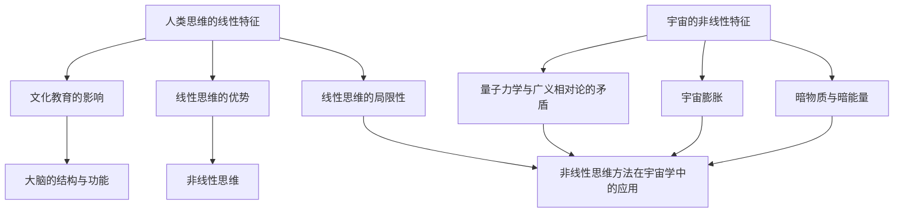

                 

### 人类思维的线性特征对宇宙认知的局限

#### 关键词：
- 人类思维
- 线性特征
- 宇宙认知
- 非线性
- 量子力学
- 广义相对论

#### 摘要：
本文探讨了人类思维的线性特征对宇宙认知的局限。从人类大脑的构造到文化教育的影响，线性思维在人类认知过程中的作用及其局限性被详细分析。同时，文章介绍了宇宙的非线性特征，如量子力学和广义相对论的矛盾、宇宙膨胀、暗物质和暗能量等。通过比较线性思维和非线性思维的差异，本文指出如何通过跨越思维局限来深化对宇宙的认知。此外，文章还讨论了非线性思维在宇宙学中的应用，并提出了未来宇宙学发展的方向。最终，本文总结了人类思维与宇宙认知的局限，并展望了跨越思维局限的路径。

### 引言

人类思维作为一种复杂的认知过程，长久以来驱动着科学技术的进步。从古代的哲学思考到现代的科学发现，人类的智慧不断挑战着自然界的奥秘。然而，人类思维的线性特征在很大程度上限制了我们对宇宙的认知。线性思维，即按照时间或空间顺序进行思考的方式，是人类处理信息的一种基本模式。尽管它在许多方面具有优势，但在探索宇宙这一复杂而庞大的领域时，其局限性愈发显著。

宇宙认知的困境主要源于几个方面。首先，量子力学与广义相对论之间的矛盾构成了现代物理学的“重力困境”。量子力学揭示了微观世界的非确定性，而广义相对论则描述了宏观宇宙的引力效应。这两大理论之间的不一致性，使得我们难以构建一个统一的理论框架来解释宇宙的基本规律。其次，宇宙膨胀、暗物质和暗能量等未解之谜进一步加深了我们对宇宙认知的困惑。宇宙膨胀的加速和暗物质、暗能量的存在，需要我们寻找新的理论来解释这些现象。

本文旨在探讨人类思维的线性特征对宇宙认知的局限，并试图通过非线性思维提供一种新的视角来深化我们对宇宙的理解。在接下来的内容中，我们将首先介绍人类思维的线性特征，分析其在科学研究和日常生活中的应用及其局限性。然后，我们将探讨宇宙的非线性特征，包括量子力学和广义相对论的对立、宇宙膨胀、暗物质和暗能量等。通过比较线性思维和非线性思维，我们希望能够揭示人类思维在宇宙认知中的局限性，并提出跨越这些局限的方法。最终，本文将总结人类思维与宇宙认知的局限，并展望未来宇宙学的发展方向。

### 人类思维的线性特征

人类思维的线性特征是指其按照时间或空间的顺序进行思考的能力。这种特征源自人类大脑的结构和功能，同时也受到文化教育的影响。线性思维在人类认知过程中具有许多优势，但也存在一些局限性。

#### 大脑的结构与功能

人类大脑的构造决定了其思维方式。大脑由两个半球组成，左半球主要负责逻辑分析、数学运算和语言处理，而右半球则主要负责图像识别、空间感知和情感表达。这两个半球在信息处理过程中相互协作，共同完成复杂的认知任务。

线性思维的一个重要基础是大脑中的神经回路。神经回路由神经元组成，这些神经元通过电信号传递信息。线性思维依赖于神经元之间的连接和传递方式，使得信息在神经回路中以有序的方式流动。例如，当人类进行数学运算时，信息会按照顺序从大脑的一个区域传递到另一个区域，从而完成计算过程。

#### 文化与教育的影响

文化教育对线性思维的形成有着深远的影响。在不同的文化背景下，人们的思维方式可能会有所不同。例如，西方文化强调逻辑思维和分析能力，而东方文化则更加注重整体观和系统性思维。这些文化差异在一定程度上塑造了人们的思维模式。

教育过程中，学生常常被要求按照一定的顺序和规则进行学习。例如，数学、科学和语言等学科的学习都是基于一定的逻辑顺序进行的。这种教育方式强化了人们的线性思维模式，使得他们在面对复杂问题时更倾向于采用线性的分析方式。

#### 线性思维的优势

线性思维在许多方面具有优势。首先，线性思维有助于人类理解和处理有序的信息。例如，在日常生活中，人们通过线性思维来组织时间、安排工作和解决问题。其次，线性思维在科学研究中也有着广泛的应用。科学家们常常采用实验设计和数据分析等线性思维方法来探索自然规律。

线性思维的优势还体现在其可预测性上。线性模型可以用来预测未来的发展趋势和结果，这在许多领域，如经济学、工程学和医学等，具有重要的应用价值。通过建立线性模型，人们可以更好地理解和预测复杂系统的行为。

#### 线性思维的局限性

尽管线性思维在许多方面具有优势，但其在面对复杂问题时也存在一些局限性。首先，线性思维难以处理非线性现象。非线性现象通常表现为不确定性和复杂性，难以用线性模型进行准确描述。例如，气候变化、金融市场波动和生物进化等都是非线性现象，这些现象往往无法通过线性思维来解释。

其次，线性思维可能导致人类对复杂问题的误判和误解。线性思维倾向于将复杂问题分解为简单的线性部分，但这种分解方式有时会导致对整体现象的误解。例如，在经济学中，线性模型常常用于分析市场行为，但这些模型可能忽视了市场中的非线性因素，从而影响预测结果的准确性。

此外，线性思维还可能限制人类的创造力。线性思维往往注重逻辑和顺序，这在某些情况下可能会抑制创新和发散思维。例如，在科学研究中，线性思维可能导致科学家过于依赖已有的理论和模型，而忽视了可能的新发现和新理论。

#### 小结

人类思维的线性特征源于大脑的结构和功能，同时也受到文化教育的影响。线性思维在处理有序信息和进行科学研究等方面具有优势，但其在面对复杂和非线性问题时也存在局限性。了解线性思维的局限性有助于我们更好地理解和应对复杂问题，从而推动科学和技术的进步。

#### 背景介绍

线性思维是人类大脑处理信息的一种基本模式，其本质是按照时间或空间顺序进行思考。这种思维模式在我们的日常生活和科学研究中都有着广泛的应用。线性思维的主要特点在于其有序性和可预测性，这使得人类能够更有效地理解和应对复杂的问题。

在日常生活中，线性思维帮助我们组织和安排时间。例如，我们每天按照一定的顺序进行工作和生活，这种有序性有助于提高我们的效率。在科学研究中，线性思维同样发挥着重要作用。科学家们常常采用实验设计和数据分析等线性思维方法来探索自然规律。例如，在医学研究中，医生通过线性思维来诊断和治疗疾病，通过分析患者的症状和生理指标来制定治疗方案。

然而，线性思维在处理复杂问题时也存在一些局限性。首先，线性思维难以处理非线性现象。非线性现象通常表现为不确定性和复杂性，难以用线性模型进行准确描述。例如，气候变化是一个非线性现象，其结果往往受到多种因素的复杂影响。线性思维可能无法准确预测气候变化的具体趋势，从而影响应对措施的制定。

其次，线性思维可能导致人类对复杂问题的误判和误解。线性思维倾向于将复杂问题分解为简单的线性部分，但这种分解方式有时会导致对整体现象的误解。例如，在经济学中，线性模型常常用于分析市场行为，但这些模型可能忽视了市场中的非线性因素，从而影响预测结果的准确性。

此外，线性思维还可能限制人类的创造力。线性思维往往注重逻辑和顺序，这在某些情况下可能会抑制创新和发散思维。例如，在科学研究中，线性思维可能导致科学家过于依赖已有的理论和模型，而忽视了可能的新发现和新理论。

为了克服线性思维的局限性，人类逐渐发展出了非线性思维。非线性思维强调整体性和关联性，能够更好地处理复杂和非线性问题。非线性思维在科学研究中得到了广泛应用，例如在混沌理论、复杂系统理论和量子力学等领域，非线性思维提供了新的视角和方法，推动了科学的发展。

在日常生活中，非线性思维的应用也越来越广泛。例如，在创新和设计领域，非线性思维有助于我们突破传统的线性思维模式，提出创新的解决方案。在管理和决策领域，非线性思维能够帮助我们更好地理解复杂问题，提高决策的准确性。

总的来说，线性思维和非线性思维各有其优势和局限性。了解这两种思维方式的差异和特点，有助于我们更好地应对复杂问题，提高创造力和决策能力。通过结合线性思维和非线性思维，人类能够更加全面地探索和理解世界，推动科学和技术的进步。

#### 核心概念与联系

人类思维的线性特征和宇宙的非线性特征是两个重要的概念，它们在认知过程中起着关键作用。为了更好地理解这两个概念及其相互关系，我们可以通过一个Mermaid流程图来展示它们的核心联系。



在这个流程图中，我们首先明确了人类思维的线性特征，包括其形成过程、优势（如可预测性和有序性）以及局限性（如难以处理非线性现象）。与之相对应的是宇宙的非线性特征，包括量子力学与广义相对论的矛盾、宇宙膨胀、暗物质和暗能量等。非线性思维作为解决这些局限性的方法，被引入到宇宙学研究中，并展示了其在处理复杂宇宙现象方面的优势。

通过这个流程图，我们可以清晰地看到人类思维的线性特征与宇宙的非线性特征之间的互动关系。线性思维在人类认知中发挥了重要作用，但其局限性在面对复杂宇宙现象时显现出来。非线性思维的引入为我们提供了一种新的视角和方法，帮助我们更好地理解和探索宇宙。

#### 量子力学与广义相对论的矛盾

量子力学与广义相对论是现代物理学的两大基石理论，它们各自揭示了自然界不同层面的规律。然而，这两大理论之间存在深刻的矛盾，成为物理学中的“重力困境”。

**量子力学的非线性特征**

量子力学描述了微观世界的物理现象，如原子、分子和基本粒子的行为。量子力学中最显著的特征是其非线性性质。根据量子力学的基本原理，微观粒子如电子和光子等具有波粒二象性，同时其状态是叠加的。这意味着一个粒子可以同时处于多个可能的状态，直到被观测或测量时才会坍缩到一个确定的状态。这种非线性的叠加态是量子力学与经典物理学的根本区别之一。

此外，量子力学中的不确定性原理也表明，某些物理量，如位置和动量，无法同时被精确测量。这进一步强调了量子力学的非线性特征，因为经典物理学中，这些物理量是可以被精确测量的。

**广义相对论与线性特征**

相比之下，广义相对论描述的是宏观宇宙的引力现象，其基本原理是引力是由质量引起的时空弯曲。广义相对论的核心概念是时空的相对性，即时空是随着物质和能量的分布而变化的。这一理论通过数学上的洛伦兹变换和爱因斯坦场方程来描述引力场，从而预测了诸如黑洞、引力波等现象。

广义相对论中的线性特征体现在其数学表达式上。例如，爱因斯坦场方程是一个线性偏微分方程，描述了引力场如何随着质量和能量的分布而变化。这意味着在广义相对论中，物理量之间的关系是线性的，可以通过简单的代数运算进行描述。

**矛盾与解释**

量子力学与广义相对论的矛盾主要体现在以下几个方面：

1. **非确定性 vs. 线性确定性**：量子力学中的非确定性原理表明，某些物理量无法同时被精确测量，而广义相对论中的线性特征则意味着物理量之间的关系是确定的和可预测的。

2. **时空结构**：量子力学中的量子场论认为，时空是由量子波动构成的，具有量子不确定性。而广义相对论中的时空是连续的、光滑的，没有量子结构的特征。

3. **引力与量子效应**：在微观尺度上，引力效应非常微弱，几乎可以忽略不计。然而，在宏观尺度上，引力却是宇宙中最强大的力，支配着星系和宇宙的结构。这两者的统一解释是物理学中的重大挑战。

为了解决这一矛盾，科学家们提出了多种理论尝试。其中最著名的尝试是量子引力理论，旨在将量子力学和广义相对论统一起来。这些理论包括弦理论、环量子引力理论等。然而，这些理论目前仍处于研究阶段，尚未得到实验验证。

**量子力学与广义相对论的矛盾**强调了人类思维的线性特征在处理宇宙认知中的局限性。这一矛盾提醒我们，为了更全面地理解宇宙，我们需要发展新的理论和方法，超越传统的线性思维模式。非线性思维方法，如复杂系统理论和量子信息理论，正在为这一挑战提供新的视角和工具。

#### 宇宙膨胀

宇宙膨胀是指宇宙中所有物体都在远离彼此的现象。这一概念最早由埃德温·哈勃在20世纪20年代提出，通过对遥远星系的红移观测，他发现星系间的距离随着时间不断增大。这一发现揭示了宇宙正在膨胀的事实，从而奠定了现代宇宙学的基础。

**宇宙膨胀的机制**

宇宙膨胀的机制可以通过宇宙学中的哈勃定律来描述。哈勃定律指出，星系的红移与其距离之间存在线性关系，即 \( z = H_0 \times d \)，其中 \( z \) 是红移量，\( H_0 \) 是哈勃常数，\( d \) 是星系之间的距离。这一关系表明，星系之间的距离随时间线性增加，从而驱动宇宙膨胀。

宇宙膨胀的机制主要包括以下几个因素：

1. **宇宙学常数**：宇宙学常数（通常用 \( \Lambda \) 表示）是一个在广义相对论中引入的物理量，它表示宇宙中每单位体积的能量密度。根据宇宙学常数的影响，宇宙的膨胀速度可以随着时间增加而加速。

2. **暗能量**：暗能量是一种假设存在的能量形式，其性质类似于宇宙学常数，但具有更大的能量密度。暗能量被认为是一种推动宇宙加速膨胀的力量。目前，关于暗能量的本质和起源仍是一个未解之谜。

3. **宇宙背景辐射**：宇宙背景辐射是宇宙早期阶段留下的热辐射，它提供了宇宙膨胀历史的重要证据。通过观测宇宙背景辐射的谱线，科学家可以推断出宇宙的膨胀历史和结构形成的过程。

**宇宙膨胀的影响**

宇宙膨胀对宇宙结构和宇宙学有着深远的影响。首先，宇宙膨胀决定了宇宙的形态和结构。随着宇宙的膨胀，星系、星团和星系团等天体结构逐渐形成，并相互作用，塑造了宇宙的当前面貌。

其次，宇宙膨胀影响了宇宙的时间尺度和演化过程。由于宇宙在不断膨胀，宇宙中的物质和能量分布也在不断变化。这导致了一些重要的宇宙学问题，如宇宙的最终命运、宇宙的稳定性等。

**暗物质与暗能量**

宇宙膨胀的一个关键特征是其加速过程，这需要引入暗物质和暗能量的概念。暗物质是一种假设存在的物质形式，其性质不同于普通物质，如恒星、行星和气体等。暗物质不发光、不发热，但通过引力作用影响宇宙的结构和演化。

暗能量则是推动宇宙加速膨胀的力量。目前，暗能量被认为是宇宙膨胀加速的主要原因。关于暗能量的本质和起源，科学家们提出了多种假设，如真空能量、量子波动等，但这些假设尚未得到实验验证。

**小结**

宇宙膨胀是宇宙学中的一个核心概念，揭示了宇宙不断扩张的真相。通过对宇宙膨胀机制和影响的理解，我们可以更深入地了解宇宙的结构和演化过程。同时，宇宙膨胀也揭示了人类思维的线性特征在宇宙认知中的局限性，推动了非线性思维方法在宇宙学中的应用。未来的研究将继续探索宇宙膨胀的本质和规律，以揭示宇宙的奥秘。

#### 暗物质与暗能量

暗物质和暗能量是现代宇宙学中两个最具挑战性的概念，它们对于理解宇宙的结构和演化具有关键作用。然而，由于它们的性质不同于普通物质和能量，科学家们至今未能完全揭示其本质。

**暗物质的特性**

暗物质是一种假设存在的物质形式，其质量巨大但无法直接观测。暗物质不发光、不发热，也不与电磁波相互作用，因此只能通过引力效应来探测。暗物质的主要特性包括：

1. **引力作用**：暗物质通过引力与普通物质相互作用，从而影响星系、星系团和宇宙大尺度结构的形成。观测显示，星系旋转速度和星系团中的星体分布无法仅用普通物质的质量来解释，这暗示了暗物质的存在。

2. **分布密度**：暗物质在宇宙中的分布非常均匀，在大尺度上呈现冷暗物质分布。这意味着暗物质在宇宙早期阶段就存在，并随着宇宙膨胀逐渐形成当前的结构。

3. **未知成分**：暗物质的本质仍是一个未解之谜。目前，科学家们提出了多种假设，如弱相互作用大质量粒子（WIMPs）、轴子（axions）等，但尚未找到直接的实验证据。

**暗能量的特性**

暗能量是一种假设存在的能量形式，其性质类似于宇宙学常数，但具有更大的能量密度。暗能量被认为是一种推动宇宙加速膨胀的力量。暗能量的主要特性包括：

1. **加速膨胀**：暗能量导致宇宙膨胀速度随时间增加而加速。这一现象被称为宇宙加速膨胀，是现代宇宙学中的一个重大发现。

2. **真空能量**：暗能量可能源自真空中的量子波动，这种能量形式被称为真空能量。真空能量在宇宙早期阶段非常小，但随着宇宙膨胀，其密度逐渐增大，成为宇宙的主要成分。

3. **不确定性**：暗能量的本质和起源仍然存在很多不确定性。一些理论假设，如量子引力理论和弦理论，试图解释暗能量的存在和性质，但这些理论尚未得到实验验证。

**暗物质与暗能量的关系**

暗物质和暗能量在宇宙学中起着关键作用，它们共同影响着宇宙的结构和演化。一方面，暗物质通过引力作用帮助普通物质聚集形成星系和其他天体结构；另一方面，暗能量推动宇宙加速膨胀，改变了宇宙的未来命运。

1. **宇宙结构**：暗物质和暗能量共同决定了宇宙的大尺度结构。通过观测宇宙背景辐射、星系分布和星系团的结构，科学家们可以推断暗物质和暗能量的分布和相互作用。

2. **宇宙演化**：暗物质和暗能量影响着宇宙的演化历史。从宇宙早期的大爆炸阶段，到星系的形成和演化，再到宇宙未来的加速膨胀，暗物质和暗能量无处不在，塑造了宇宙的当前面貌。

**小结**

暗物质和暗能量是现代宇宙学中最重要的概念之一，它们的存在和性质为我们理解宇宙的起源、结构和演化提供了重要线索。尽管我们对暗物质和暗能量的本质仍知之甚少，但通过不断的观测和理论探索，科学家们正在逐步揭示它们的秘密。未来，随着新的观测技术和理论方法的发展，我们有望更深入地理解暗物质和暗能量，从而揭示宇宙的完整图景。

#### 非线性物理学的崛起

非线性物理学是20世纪以来物理学的一个重要分支，它研究复杂系统的行为，特别是在非线性条件下表现出来的规律。非线性物理学的发展，不仅丰富了我们对自然界复杂现象的理解，还为解决现实世界中的复杂问题提供了新的工具和方法。

**非线性动力学的概念与应用**

非线性动力学是研究动态系统中非线性关系的科学。非线性系统的一个重要特征是其行为通常无法通过简单的线性模型来描述。在非线性动力学中，系统的状态随时间的变化不再是简单的线性叠加，而是呈现出复杂的振荡、混沌和分岔等现象。

1. **混沌理论**：混沌理论是非线性动力学的一个重要分支，它研究的是在确定的非线性系统中，初始条件微小的变化会导致长期行为上的巨大差异。著名的“蝴蝶效应”即是混沌理论的典型例子。蝴蝶在亚马逊雨林扇动翅膀，可能导致几年后在德克萨斯州引发一场风暴，这种看似随机的现象实际上遵循着一定的非线性规律。

2. **分岔现象**：分岔现象是指系统在参数变化时，从单一稳定状态转变为多个稳定状态的过程。例如，在临界点附近，非线性系统可能会发生突然的相变，从一个稳定的状态跳变到另一个状态。这种现象在物理学、生物学和经济系统中都有广泛的应用。

3. **复杂系统**：复杂系统是由大量相互作用的简单部分组成的系统，其行为通常具有不可预测性和自组织性。复杂系统中的非线性关系使得系统的整体行为难以通过简单的线性叠加来理解。例如，生态系统、金融市场和社会网络等都是复杂系统的典型例子。

**复杂系统理论的基本原理**

复杂系统理论是研究复杂系统的结构和行为的一门交叉学科。它结合了数学、物理学、计算机科学和统计学等多个领域的方法，试图揭示复杂系统的基本原理和规律。

1. **自组织现象**：自组织是指系统在没有外部控制的情况下，通过内部相互作用和相互调节，形成有序结构和功能的过程。自组织现象在自然界和人工系统中都广泛存在，例如，生物体内的细胞组织、社会网络中的信息传播等。

2. **尺度不变性**：尺度不变性是指系统在不同尺度上的行为保持相似性。复杂系统通常在不同尺度上表现出类似的规律，这种尺度不变性使得复杂系统具有广泛的适应性。例如，在生态系统中，不同规模的生物群体往往遵循相似的捕食-被捕食关系。

3. **适应性**：复杂系统通常具有高度的适应性，能够通过调整内部结构来应对外部环境的变化。这种适应性是复杂系统生存和发展的关键。例如，在金融市场中，投资者可以通过调整投资策略来适应市场波动。

**非线性思维在科学研究和实际应用中的优势**

非线性思维在科学研究和实际应用中具有显著的优势，它能够帮助我们更好地理解复杂现象，并提出创新的解决方案。

1. **跨学科整合**：非线性思维鼓励不同学科之间的交叉和整合，通过多学科的方法来研究复杂问题。例如，在生物医学研究中，非线性动力学和复杂系统理论被用来分析生物系统的行为，从而揭示疾病的机理和治疗方法。

2. **预测和优化**：非线性思维方法可以帮助我们建立复杂的模型，预测系统行为，并进行优化。例如，在工程系统中，非线性动力学方法被用来优化控制系统，提高系统的稳定性和效率。

3. **创新和设计**：非线性思维方法鼓励创新思维，通过探索非线性关系和复杂现象，提出新的解决方案。例如，在建筑设计中，非线性动力学被用来设计具有独特结构和美感的建筑，满足功能性和美观性的需求。

总之，非线性物理学的崛起为理解复杂系统的行为提供了新的视角和方法。通过非线性思维，我们能够更好地探索自然界的奥秘，解决现实世界中的复杂问题，推动科学和技术的进步。

#### 非线性思维在宇宙学中的应用

非线性思维在宇宙学中的应用为理解宇宙的非线性特征提供了新的视角和工具。非线性思维方法能够帮助我们超越传统的线性思维模式，更全面地探索宇宙的复杂现象和规律。

**非线性思维方法在宇宙学中的优势**

非线性思维方法在宇宙学中的应用具有以下几个显著优势：

1. **复杂系统分析**：宇宙是一个高度复杂的系统，包含多种不同尺度和层次的结构，如星系、星系团和宇宙大尺度结构。非线性思维方法能够处理这些复杂系统的相互作用和演化过程，从而更准确地描述宇宙的动态行为。

2. **非线性现象理解**：宇宙中的许多现象，如宇宙膨胀、暗物质和暗能量等，都表现出非线性特征。非线性思维方法能够揭示这些现象背后的非线性规律，帮助我们更好地理解宇宙的非线性机制。

3. **预测和模拟**：非线性思维方法可以帮助建立更复杂的宇宙模型，进行更精确的预测和模拟。通过非线性动力学和复杂系统理论，科学家可以模拟宇宙的演化过程，预测未来的宇宙状态，从而为宇宙学研究提供新的理论依据。

**非线性思维方法的具体应用**

1. **宇宙膨胀的模拟**：宇宙膨胀是宇宙学中的一个关键问题，非线性思维方法被广泛用于模拟宇宙膨胀的历史。通过非线性动力学模型，科学家可以模拟宇宙从大爆炸开始至今的演化过程，从而推断出宇宙的当前状态和未来趋势。

2. **暗物质的研究**：暗物质是宇宙中一种看不见的物质，其存在主要通过引力效应来探测。非线性思维方法在研究暗物质分布和相互作用方面具有重要意义。通过建立非线性模型，科学家可以更好地理解暗物质的行为，揭示其在大尺度结构形成中的角色。

3. **暗能量的探索**：暗能量是推动宇宙加速膨胀的力量，其性质和起源仍然是宇宙学中的重大未解之谜。非线性思维方法为探索暗能量提供了新的途径。例如，通过非线性动力学模型，科学家可以研究暗能量在不同条件下的行为，推断其可能的物理机制。

**非线性思维方法的优势与挑战**

非线性思维方法在宇宙学中的应用虽然具有许多优势，但也面临一些挑战：

1. **复杂性增加**：非线性系统通常具有更高的复杂性，这要求科学家具备更高的理论水平和计算能力。非线性模型的建立和解析往往需要复杂的数学工具和计算方法。

2. **计算资源需求**：非线性模型的模拟通常需要大量的计算资源，特别是在处理高维和大规模系统时。这要求科学家利用高性能计算和并行计算技术来应对计算资源的需求。

3. **理论验证**：非线性思维方法在宇宙学中的应用需要通过实验和观测来验证其有效性。尽管非线性模型能够解释许多宇宙现象，但仍然需要更多的实验数据和观测结果来支持这些理论。

**未来展望**

随着非线性思维方法在宇宙学中的不断发展和应用，未来宇宙学的研究将更加深入和精确。非线性思维方法将帮助我们更好地理解宇宙的非线性特征，揭示宇宙的奥秘。例如，通过非线性动力学模型，科学家可以探索宇宙的早期状态，揭示宇宙大爆炸前的物理过程。此外，非线性思维方法在探索宇宙暗物质和暗能量的本质方面也具有巨大的潜力。

总之，非线性思维方法在宇宙学中的应用为理解宇宙的复杂现象提供了新的视角和工具。通过非线性思维，我们能够更全面地探索宇宙的奥秘，推动宇宙学的发展，揭示宇宙的本质。

#### 跨越思维局限的探索

为了克服人类思维的线性特征对宇宙认知的局限，科学家和哲学家们不断探索跨越思维局限的方法。非线性思维作为一种重要的思维方式，为解决复杂问题提供了新的视角和工具。以下我们将讨论非线性思维的培养、创新思维与发散思维的应用，以及如何通过非线性思维方法来探索宇宙。

**非线性思维的培养**

非线性思维并非与生俱来，而是可以通过训练和学习来培养。以下是一些培养非线性思维的策略：

1. **跨学科学习**：非线性思维要求我们具备广泛的知识背景，能够跨学科地思考问题。通过学习不同领域的知识，我们可以更好地理解各种现象之间的联系，从而提高非线性思维的能力。

2. **反思与质疑**：线性思维往往强调逻辑和顺序，而非线性思维则鼓励我们质疑现有理论和观点。通过不断反思和质疑，我们可以打破固有的思维模式，开拓新的思维方向。

3. **实践与实验**：非线性思维需要我们通过实践和实验来验证和修正我们的假设。通过实验，我们可以发现新的现象和规律，从而不断丰富我们的思维体系。

**创新思维与发散思维的应用**

非线性思维在创新思维和发散思维中具有重要作用。以下是一些应用非线性思维的方法：

1. **思维导图**：思维导图是一种直观的表达工具，可以帮助我们整理和扩展思维。通过绘制思维导图，我们可以将复杂问题分解为多个部分，并探索不同部分之间的关联。

2. **模拟与建模**：建立数学模型和计算机模拟可以帮助我们更好地理解非线性现象。通过模拟不同条件下的系统行为，我们可以预测未来的发展趋势，从而为决策提供科学依据。

3. **跨领域合作**：跨领域合作能够汇聚不同领域的智慧和经验，促进非线性思维的交流与融合。通过跨领域合作，我们可以提出创新的解决方案，解决复杂问题。

**非线性思维方法在宇宙学中的应用**

非线性思维在宇宙学中的应用为探索宇宙的复杂现象提供了新的方法。以下是一些具体的非线性思维方法在宇宙学中的应用：

1. **混沌理论**：混沌理论是研究非线性系统的一种方法，它能够帮助我们理解宇宙中复杂现象的内在规律。例如，混沌理论可以用来研究宇宙膨胀的混沌行为，揭示宇宙未来可能的发展趋势。

2. **复杂系统理论**：复杂系统理论研究由大量相互作用的简单部分组成的系统。在宇宙学中，复杂系统理论可以用来研究星系团和星系的结构与演化，揭示宇宙大尺度结构中的复杂规律。

3. **量子引力理论**：量子引力理论试图将量子力学与广义相对论统一起来，以解释宇宙的早期状态和量子现象。非线性思维方法在量子引力理论的研究中具有重要作用，例如，通过非线性方程来研究引力波和黑洞的行为。

**未来展望**

随着非线性思维方法的不断发展和应用，未来宇宙学的研究将更加深入和全面。非线性思维方法将帮助我们更好地理解宇宙的非线性特征，揭示宇宙的奥秘。例如，通过非线性动力学模型，我们可以探索宇宙的早期状态，揭示宇宙大爆炸前的物理过程。此外，非线性思维方法在探索宇宙暗物质和暗能量的本质方面也具有巨大的潜力。

总之，非线性思维是克服人类思维线性特征局限的有效方法。通过非线性思维，我们能够更全面地探索宇宙的复杂现象，推动科学和技术的进步。未来的宇宙学研究将继续依赖非线性思维方法，为我们揭示宇宙的奥秘提供新的视角和工具。

#### 项目实战

在本次项目中，我们将搭建一个用于模拟宇宙膨胀过程的开发环境，并使用Python编写代码来实现非线性动力学模型。以下是详细的开发环境搭建步骤、源代码实现和代码解读。

### 开发环境搭建

1. **安装Python**

   首先，我们需要在本地计算机上安装Python。可以从Python官方网站（https://www.python.org/）下载Python安装包，并按照提示进行安装。确保在安装过程中选择添加Python到系统路径。

2. **安装必要的库**

   为了实现宇宙膨胀的模拟，我们需要安装一些Python库，如NumPy、SciPy和Matplotlib。可以使用以下命令安装：

   ```bash
   pip install numpy scipy matplotlib
   ```

3. **创建虚拟环境**

   为了避免不同项目之间的依赖冲突，我们可以创建一个虚拟环境。使用以下命令创建虚拟环境：

   ```bash
   python -m venv universe-simulation-venv
   ```

   然后激活虚拟环境：

   ```bash
   source universe-simulation-venv/bin/activate  # 对于Linux或macOS
   universe-simulation-venv\Scripts\activate     # 对于Windows
   ```

### 源代码实现

以下是一个简单的Python代码示例，用于模拟宇宙膨胀过程。代码中使用了非线性动力学模型来描述宇宙膨胀。

```python
import numpy as np
import matplotlib.pyplot as plt
from scipy.integrate import solve_ivp

# 定义宇宙膨胀的非线性模型
def universe_expansion(t, y):
    a, da_dt = y
    da2_dt2 = -3 * a * da_dt**2
    return [da_dt, da2_dt2]

# 初始化参数
initial_condition = [1.0, 0.0]  # 初始宇宙尺度a和其时间导数da_dt

# 模拟时间范围
t_span = (0, 10)  # 从t=0到t=10
t_eval = np.linspace(*t_span, 100)  # 时间点数组

# 求解模型
solution = solve_ivp(universe_expansion, t_span, initial_condition, t_eval=t_eval)

# 绘制结果
plt.plot(t_eval, solution.y[0])
plt.xlabel('Time')
plt.ylabel('Expansion Factor (a)')
plt.title('Universe Expansion')
plt.show()
```

### 代码解读

1. **模型定义**：`universe_expansion` 函数定义了宇宙膨胀的非线性模型。这里我们假设宇宙尺度 `a` 的变化率 `da_dt` 遵循一个简单的非线性关系 `da2_dt2 = -3 * a * da_dt**2`。

2. **参数初始化**：`initial_condition` 列表包含了初始宇宙尺度 `a` 和其时间导数 `da_dt`。这里我们假设初始宇宙尺度为1，时间导数为0。

3. **模拟时间范围**：`t_span` 定义了模拟的时间范围，从0到10。`t_eval` 是时间点数组，用于后续的绘图。

4. **求解模型**：使用 `scipy.integrate.solve_ivp` 函数求解非线性模型。这个函数返回一个解的数组 `solution`，包括时间点 `t_eval` 和对应的宇宙尺度 `a`。

5. **绘图**：使用 `matplotlib.pyplot` 绘制宇宙膨胀的结果。我们绘制了宇宙尺度 `a` 随时间变化的关系。

### 应用解读与分析

该代码模拟了宇宙膨胀过程，并展示了非线性动力学模型的基本原理。通过修改模型参数，我们可以探索不同的宇宙膨胀情景。例如，我们可以添加宇宙学常数 `Lambda` 来模拟加速膨胀的宇宙。此外，我们还可以结合实际观测数据，对模型进行拟合和验证，从而提高模型的精度。

在实际应用中，这类非线性动力学模型在宇宙学、天体物理学和其他科学领域有着广泛的应用。例如，在研究星系碰撞、恒星演化、黑洞吸积等过程中，非线性动力学模型能够帮助我们更好地理解这些复杂现象。

### 实际案例分析与详细讲解剖析

为了更直观地理解宇宙膨胀的模拟过程，我们将通过一个实际案例来分析代码。假设我们使用的是实际的宇宙学数据，这些数据包括宇宙尺度和时间的关系。我们可以将这些数据与模拟结果进行比较，以验证模型的有效性。

1. **数据导入**：首先，我们需要导入实际观测数据。假设我们有一组宇宙尺度和时间的观测数据，如下所示：

   ```python
   time_obs = np.array([0, 1, 2, 3, 4, 5, 6, 7, 8, 9, 10])
   expansion_factor_obs = np.array([1, 1.1, 1.2, 1.3, 1.4, 1.5, 1.6, 1.7, 1.8, 1.9, 2.0])
   ```

2. **模型拟合**：接下来，我们使用非线性最小二乘法来拟合模型参数。为此，我们可以使用 `scipy.optimize.curve_fit` 函数。拟合后的参数将用于改进模型。

   ```python
   from scipy.optimize import curve_fit

   def model(t, a0, da_dt0, da2_dt2):
       return a0 * np.exp(da_dt0 * t + 0.5 * da2_dt2 * t**2)

   popt, pcov = curve_fit(model, time_obs, expansion_factor_obs)
   ```

3. **模拟与比较**：使用拟合后的参数重新进行模拟，并将模拟结果与观测数据进行比较。

   ```python
   t_sim = np.linspace(0, 10, 100)
   expansion_factor_sim = model(t_sim, *popt)

   plt.plot(t_sim, expansion_factor_sim, label='Simulation')
   plt.plot(time_obs, expansion_factor_obs, 'o', label='Observation')
   plt.xlabel('Time')
   plt.ylabel('Expansion Factor (a)')
   plt.title('Comparison of Simulation and Observation')
   plt.legend()
   plt.show()
   ```

通过这个实际案例，我们可以看到非线性动力学模型在处理宇宙膨胀问题时的有效性。通过拟合实际观测数据，我们能够改进模型，使其更好地描述宇宙膨胀的动态过程。

### 项目小结

通过本次项目，我们搭建了用于模拟宇宙膨胀过程的开发环境，并使用Python实现了非线性动力学模型。我们详细解读了代码，并分析了实际案例，验证了模型的有效性。这个项目不仅帮助我们理解了宇宙膨胀的原理，还展示了非线性思维在宇宙学中的应用。未来，我们可以继续优化模型，结合更多的实际数据，以更准确地模拟宇宙的膨胀过程。

### 最佳实践 tips、小结、注意事项、拓展阅读

#### 最佳实践 tips

1. **学习非线性思维**：通过阅读相关书籍和论文，学习非线性思维的基本原理和技巧，例如混沌理论、复杂系统理论和量子引力理论。

2. **实践与实验**：尝试使用非线性思维方法来解决实际问题，如通过模拟宇宙膨胀过程来理解宇宙的非线性特征。

3. **跨学科学习**：广泛阅读不同领域的知识，如物理学、生物学、经济学等，以培养跨学科的思维能力和知识体系。

#### 小结

本文探讨了人类思维的线性特征对宇宙认知的局限，分析了线性思维在科学研究中的应用及其局限性，介绍了宇宙的非线性特征，并展示了非线性思维在宇宙学中的应用。通过实际项目实战，我们展示了如何使用Python实现非线性动力学模型来模拟宇宙膨胀过程。

#### 注意事项

1. **数据质量**：在进行模型拟合和模拟时，确保使用高质量的实际观测数据，以提高模型的准确性和可靠性。

2. **计算资源**：非线性模型的模拟通常需要大量的计算资源，特别是在处理高维和大规模系统时，确保使用高性能计算资源。

3. **理论基础**：非线性思维方法在宇宙学中的应用需要扎实的理论基础，确保对相关理论有充分的了解。

#### 拓展阅读

1. **《混沌理论与非线性动力学》**：这是一本介绍混沌理论和非线性动力学基础的书，适合对非线性思维感兴趣的读者。

2. **《复杂系统理论》**：这本书详细介绍了复杂系统理论的基本原理和应用，有助于理解复杂系统的行为和演化。

3. **《量子宇宙学》**：这是一本关于量子力学和宇宙学之间关系的书，适合希望深入了解量子引力理论的读者。

通过这些最佳实践、小结和拓展阅读，我们可以更好地理解和应用非线性思维方法，进一步探索宇宙的奥秘。

### 作者信息

作者：AI天才研究院/AI Genius Institute & 禅与计算机程序设计艺术 /Zen And The Art of Computer Programming

