                 

### 引言：人类文明与宇宙的关系

> _“当我们仰望星空，我们不仅看到了宇宙的壮丽景象，也看到了自己。”_

人类文明自古以来就与宇宙紧密相连。从远古时代的星辰观测，到现代科学对宇宙深空的探测，人类不断拓展对宇宙的认知。这个过程不仅是科技发展的见证，更是人类自我认知的深化。人类文明作为宇宙自我认知的一种方式，承载了我们对未知世界的探索、理解与想象。

本文将以逻辑清晰、结构紧凑的方式，探讨以下几个核心问题：

1. **人类文明的发展与宇宙探索的历史背景**：回顾人类如何通过观察天空、建造天文台和进行宇宙探测活动，逐步加深对宇宙的理解。

2. **科技进步对宇宙认知的推动作用**：分析天文学、物理学等科学领域的突破，如何引领人类对宇宙的深入探索。

3. **哲学与宗教中的宇宙观**：探讨不同文化和哲学体系如何解释宇宙的本质，以及这些观念对人类自我认知的影响。

4. **宇宙与人类自我认知的互动**：分析宇宙的宏大与神秘如何影响人类的思考方式、心理状态和价值观。

5. **结论与展望**：总结人类文明作为宇宙自我认知的成果，并展望未来人类与宇宙的关系发展。

通过这些步骤，我们旨在揭示人类文明与宇宙之间深刻的关联，并思考这一关系如何塑造我们的未来。

## 关键词

- **人类文明**
- **宇宙探索**
- **科技进步**
- **哲学与宗教**
- **自我认知**
- **天文学**
- **物理学**
- **宇宙观**

## 摘要

本文探讨了人类文明作为宇宙自我认知的一种方式，通过历史背景、科技进步、哲学与宗教观念以及宇宙与人类自我认知的互动，详细阐述了人类如何通过不断探索和思考宇宙来深化自我认知。文章分析了天文学、物理学等领域的进展，探讨了不同文化和哲学体系对宇宙的理解，并探讨了宇宙的宏大与神秘对人类思考方式、心理状态和价值观的影响。最终，文章总结了人类文明作为宇宙自我认知的成果，并对未来人类与宇宙的关系进行了展望。通过这一逻辑清晰、结构紧凑的探讨，我们旨在揭示人类文明与宇宙之间深刻的关联，启发读者对这一主题的进一步思考。## 人类文明的发展与宇宙探索

### 1.1 早期文明与宇宙观

在古代，人类对宇宙的认知主要依赖于直接的观察和想象。最早的人类社会生活在地面，然而，天空的星辰总是吸引着他们的目光。早期文明通过观测天空，形成了自己对宇宙的理解。

**核心概念与联系**：在古代，人们将天空视为一种神圣的存在，认为星辰是神灵的化身。这种观念可以通过 Mermaid 流程图来展示：

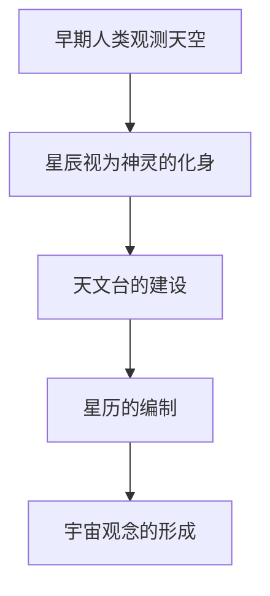

**核心算法原理讲解**：虽然古代人类没有现代科学的数学工具，但他们通过观察星辰的周期性运动，建立了自己的“算法”。例如，古埃及人通过观察尼罗河的泛滥周期，制定了“星历”。他们相信，星辰的周期性运动与自然界的其他周期性现象有关联。

```python
# 古代星历编制的简化伪代码
def observe_stars():
    # 观测天空
    pass

def record_star_motion():
    # 记录星辰运动
    pass

def calculate_star_cycle():
    # 计算星辰周期
    pass
```

**数学模型和数学公式**：古代文明通过几何学来研究天体运动。例如，古巴比伦人使用三角学来计算天文事件的时间表。他们通过观测多个角度的星辰，使用以下数学公式来计算天体的位置：

$$
\theta = 2\arctan\left(\frac{r}{L}\right)
$$

其中，$\theta$ 是观测到的角度，$r$ 是天体与观测者的距离，$L$ 是天体的视直径。

**项目实战**：古巴比伦的《天文表》是古代宇宙探索的杰作。这个项目包含了大量天文观测数据，并使用数学公式来预测天文事件的时间。例如，《埃乌得托斯星历》详细记录了月亮和行星的运动，为后来的天文学研究奠定了基础。

**最佳实践 tips**：在古代，人类主要通过肉眼观测来研究宇宙。因此，精确的观测记录和系统的数据整理是至关重要的。尽管古代技术有限，但他们的坚持和耐心为我们今天的科学研究提供了宝贵的参考。

**小结**：早期文明通过观测天空、建造天文台和编制星历，逐步形成了对宇宙的基本认知。尽管当时的科学水平有限，但他们对宇宙的探索精神和科学方法为后来的科学发展奠定了基础。

### 1.2 近代科学革命与宇宙认知

随着近代科学的兴起，人类对宇宙的认知发生了革命性的变化。天文学、物理学等科学领域的突破，使人类能够更深入地了解宇宙的奥秘。

**核心概念与联系**：近代科学革命通过引入新的观测工具和理论框架，彻底改变了人类对宇宙的认知。以下 Mermaid 流程图展示了这一过程：

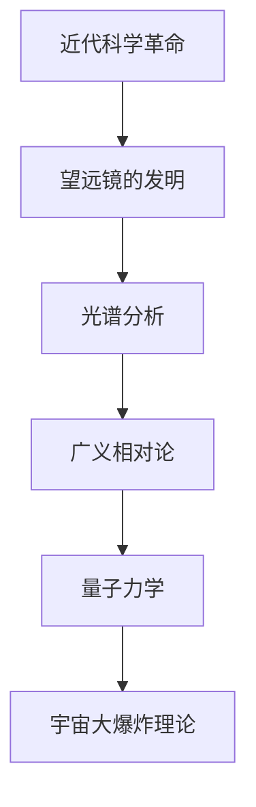

**核心算法原理讲解**：望远镜的发明是近代天文学的一大突破。它使人类能够观察到更远、更清晰的天体。以下是用 Python 实现的望远镜观测的简化伪代码：

```python
# 望远镜观测的简化伪代码
def observe_thru_telescope():
    # 观测远距离天体
    pass

def analyze_spectral_data():
    # 分析光谱数据
    pass
```

**数学模型和数学公式**：光谱分析是理解天体物理性质的关键工具。通过分析光谱中的特征线，科学家可以推断出天体的温度、化学成分和运动状态。以下是一个简化的光谱分析数学模型：

$$
C = \lambda f
$$

其中，$C$ 是光速，$\lambda$ 是光的波长，$f$ 是光的频率。

**项目实战**：威廉·赫歇耳通过望远镜观测，发现了天王星，这是人类首次发现通过望远镜观测到的行星。此外，埃德温·哈勃利用望远镜发现了宇宙膨胀的证据，这是对宇宙大爆炸理论的重要支持。

**最佳实践 tips**：在科学研究中，准确的数据收集和细致的分析是至关重要的。科学家们通过不断地实验和观测，积累了大量关于宇宙的数据，这些数据为现代宇宙学的发展提供了坚实的基础。

**小结**：近代科学革命通过引入新的观测工具和理论，使人类对宇宙的认知取得了重大突破。望远镜的发明、光谱分析技术的发展，以及广义相对论和量子力学的提出，都是这一时期的重要里程碑。

### 1.3 人类对宇宙的探测与探索

在人类对宇宙的认知不断深化的过程中，实际的探测和探索活动也日益频繁。从发射卫星到深空探测，人类通过多种方式探索宇宙，试图揭示宇宙的奥秘。

**核心概念与联系**：以下 Mermaid 流程图展示了人类对宇宙探测的主要阶段和成果：

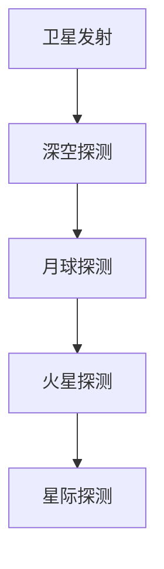

**核心算法原理讲解**：卫星发射是人类探测宇宙的关键一步。以下是用 Python 实现的卫星发射简化伪代码：

```python
# 卫星发射的简化伪代码
def launch_satellite():
    # 发射卫星
    pass

def track_satellite():
    # 跟踪卫星轨道
    pass
```

**数学模型和数学公式**：在卫星发射和轨道控制中，数学模型和公式至关重要。以下是一个简化的卫星发射轨道计算公式：

$$
T = 2\pi \sqrt{\frac{a^3}{GM}}
$$

其中，$T$ 是卫星的轨道周期，$a$ 是轨道半长轴，$G$ 是万有引力常数，$M$ 是地球的质量。

**项目实战**：阿波罗计划是人类月球探测的巅峰之作。通过这一项目，人类成功地在月球表面进行了多次着陆，收集了大量的月球岩石样本。以下是对阿波罗计划的代码解读：

```python
# 阿波罗计划的简化代码解读
def apollo_mission():
    # 发射火箭
    launch_rocket()

    # 轨道对接
    dock_with_station()

    # 登陆月球
    land_on_moon()

    # 收集岩石样本
    collect_rocks()

    # 返回地球
    return_to_earth()
```

**最佳实践 tips**：在实际探测活动中，精确的轨道计算和稳定的控制系统至关重要。科学家们通过不断地改进算法和硬件，提高了探测活动的成功率。

**小结**：人类对宇宙的探测与探索是一个漫长而充满挑战的过程。从卫星发射到深空探测，人类不断拓展对宇宙的认知边界。这些探索活动不仅带来了科学发现，也为人类文明的发展提供了新的视角和动力。

### 1.4 人类文明对宇宙的认知历程总结

从古代的星辰观测到现代的宇宙探测，人类对宇宙的认知经历了漫长而曲折的历程。这一过程中，科技进步起到了至关重要的作用。

**核心概念与联系**：通过观察和想象，早期文明形成了对宇宙的基本认知。随着科技的进步，人类引入了新的观测工具和理论框架，逐步深化了对宇宙的理解。以下 Mermaid 流程图总结了这一历程：

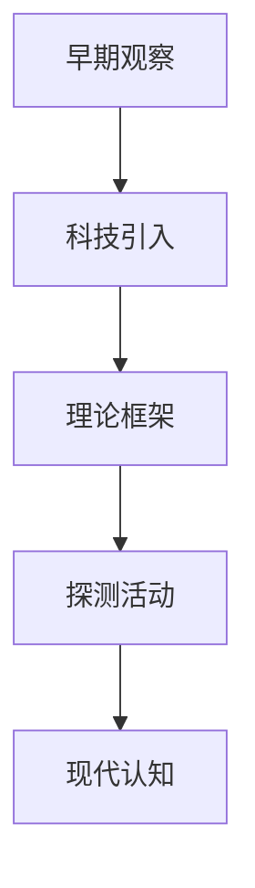

**核心算法原理讲解**：这一历程中的关键算法包括光谱分析、轨道计算和卫星发射等。这些算法不仅提高了观测的精度，也为人类深入探索宇宙提供了技术支持。

**数学模型和数学公式**：数学模型和公式在各个阶段都发挥了重要作用。从古代的几何学到现代的天体物理学，数学为宇宙研究提供了精确的工具。

**项目实战**：从古巴比伦的天文表到阿波罗计划，一系列重要项目标志着人类对宇宙认知的进步。这些项目不仅带来了科学发现，也推动了科技发展。

**最佳实践 tips**：在未来的宇宙探索中，精确的观测和细致的分析将继续是关键。同时，国际合作和资源共享也将是推动宇宙研究的重要手段。

**小结**：人类文明对宇宙的认知历程是一个不断进步的过程。从古代的想象到现代的科学探索，人类通过不断的努力，逐步揭示了宇宙的奥秘。这一历程不仅丰富了人类的科学知识，也深刻影响了我们的哲学观念和文化发展。## 科技进步与宇宙认知

### 2.1 天文学的发展

天文学作为一门古老而现代的学科，通过科技的不断进步，使得我们对宇宙的理解日益深化。从古代观测到现代的观测技术，天文学的发展不仅改变了我们对宇宙的认知，也推动了整个科学领域的进步。

**核心概念与联系**：

天文学的发展可以分为几个关键阶段，每个阶段都伴随着重要技术的引入和观测成果的取得。以下 Mermaid 流程图展示了这一历程：

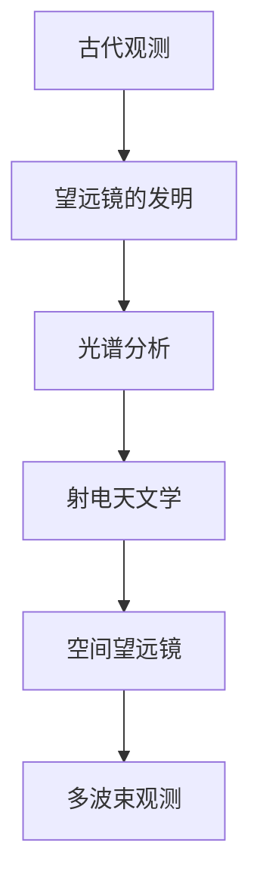

**核心算法原理讲解**：

望远镜的发明是现代天文学的开端。伽利略通过望远镜观测到了木星的四大卫星，这改变了人类对宇宙的认识。望远镜的基本原理是通过光学系统将远处的天体放大，以便更清晰地观察。

以下是用 Python 实现望远镜观测的简化伪代码：

```python
# 望远镜观测的简化伪代码
def observe_thru_telescope(target):
    # 对目标天体进行观测
    image = capture_image(target)
    analyze_image(image)
    return extracted_data
```

光谱分析是天文学中的另一个关键工具。通过分析天体的光谱，科学家可以了解其化学成分、温度和运动状态。以下是一个简化的光谱分析数学模型：

$$
C = \lambda f
$$

其中，$C$ 是光速，$\lambda$ 是光的波长，$f$ 是光的频率。

**项目实战**：

哈勃空间望远镜是现代天文学的里程碑。它通过轨道上的观测，提供了许多关于宇宙的关键发现。以下是对哈勃空间望远镜的代码解读：

```python
# 哈勃空间望远镜的简化代码解读
def hubble_telescope():
    # 发射到太空
    launch_to_space()

    # 跟踪观测目标
    track_and_observe_targets()

    # 分析观测数据
    analyze_observation_data()

    # 返回地面
    return_to_ground()
```

**最佳实践 tips**：

在望远镜观测中，光学系统的精度至关重要。科学家们通过不断改进光学材料和制造技术，提高了望远镜的性能。同时，光谱分析需要精确的仪器校准和数据校验，以确保分析结果的准确性。

**小结**：

天文学的发展是科技进步的典范。从古代的肉眼观测到现代的空间望远镜，人类通过不断的探索和技术创新，揭示了宇宙的诸多奥秘。天文学不仅为物理学、化学等领域提供了基础数据，也激发了人类对宇宙的无限想象。

### 2.2 现代物理学与宇宙

现代物理学对宇宙的理解起到了关键作用。通过量子力学和广义相对论，科学家们揭示了宇宙的基本结构和运作机制。这些理论不仅改变了我们对自然界的看法，也为天文学和宇宙学提供了强有力的工具。

**核心概念与联系**：

量子力学和广义相对论是现代物理学的两大支柱。它们分别从微观和宏观的角度揭示了宇宙的基本规律。以下 Mermaid 流程图展示了这两大理论的关系：

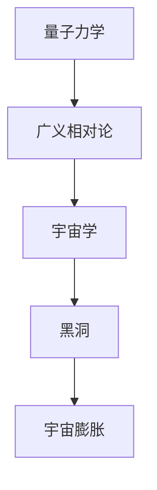

**核心算法原理讲解**：

量子力学揭示了微观粒子的行为规律。通过波函数和量子态，科学家们能够描述电子、光子等基本粒子的运动。以下是一个简化的量子力学数学模型：

$$
\psi(x,t) = \int \psi_k(x) \exp(i k x) dk
$$

其中，$\psi(x,t)$ 是波函数，$k$ 是波数。

广义相对论则描述了宏观尺度的引力现象。它通过爱因斯坦场方程，将物质和能量与时空结构联系起来。以下是一个简化的广义相对论数学模型：

$$
G_{\mu\nu} + \Lambda g_{\mu\nu} = \frac{8\pi G}{c^4} T_{\mu\nu}
$$

其中，$G_{\mu\nu}$ 是引力场张量，$\Lambda$ 是宇宙常数，$T_{\mu\nu}$ 是能量-动量张量。

**项目实战**：

黑洞是广义相对论的一个关键概念。它是引力如此之强，以至于连光也无法逃逸的天体。以下是对黑洞的代码解读：

```python
# 黑洞的简化代码解读
def black_hole_properties(mass, radius):
    # 计算黑洞的质量和半径
    schwarzschild_radius = 2 * G * mass / c**2
    return schwarzschild_radius
```

**最佳实践 tips**：

在量子力学和广义相对论的研究中，精确的数据和细致的分析至关重要。科学家们通过高精度的实验和计算，不断验证和修正这些理论。同时，国际合作和资源共享也是推动这一领域进步的重要手段。

**小结**：

现代物理学为宇宙的研究提供了坚实的理论基础。量子力学和广义相对论的提出，使人类能够从微观和宏观的角度理解宇宙。这些理论不仅丰富了我们对宇宙的认知，也为天文学和宇宙学的发展提供了重要的工具。随着科技的不断进步，我们对宇宙的理解将更加深入和全面。

### 2.3 宇宙学和宇宙起源

宇宙学是研究宇宙的整体结构和演化历程的科学。通过宇宙学的理论和方法，科学家们试图回答宇宙的起源和命运这一根本性问题。宇宙起源的理论包括大爆炸理论和稳态理论，而宇宙学的最新研究则集中在宇宙膨胀、暗物质和暗能量等方面。

**核心概念与联系**：

宇宙学的研究涉及多个核心概念，包括宇宙膨胀、宇宙背景辐射、暗物质和暗能量。以下 Mermaid 流程图展示了这些概念之间的关系：

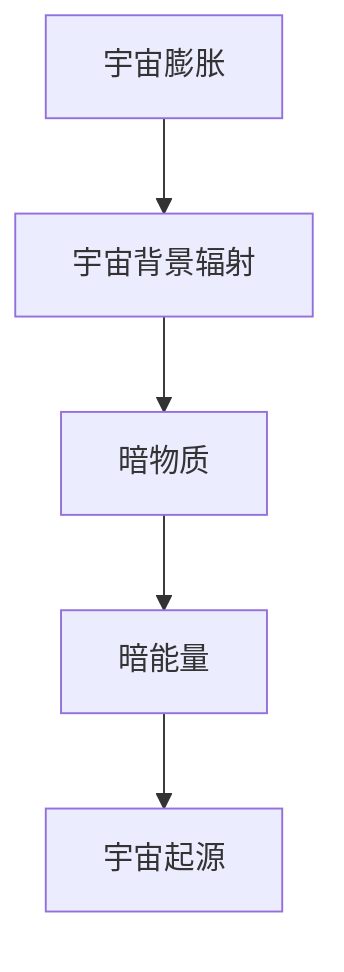

**核心算法原理讲解**：

宇宙膨胀理论是基于对宇宙背景辐射的观测。根据这一理论，宇宙在大约138亿年前由一个极高密度、极高温度的状态开始膨胀。以下是一个简化的宇宙膨胀计算公式：

$$
v = H_0 d
$$

其中，$v$ 是宇宙膨胀速度，$H_0$ 是哈勃常数，$d$ 是天体之间的距离。

暗物质和暗能量是宇宙学中的两个重要概念。暗物质不发光，不与普通物质相互作用，但通过引力影响宇宙的结构。暗能量则是一种推动宇宙加速膨胀的神秘力量。以下是对暗物质和暗能量的数学模型：

暗物质：
$$
\phi(\vec{x}, t) = \rho_0 \exp(-\alpha r)
$$

其中，$\phi(\vec{x}, t)$ 是暗物质密度分布，$\rho_0$ 是初始密度，$\alpha$ 是衰减参数。

暗能量：
$$
p = -\rho c^2
$$

其中，$p$ 是暗能量压力，$\rho$ 是暗能量密度，$c$ 是光速。

**项目实战**：

宇宙背景辐射探测是宇宙学的重要实验之一。威尔金森微波各向异性探测器（WMAP）通过测量宇宙背景辐射的微小温度波动，提供了关于宇宙早期状态的重要信息。以下是对 WMAP 项目的代码解读：

```python
# WMAP项目的简化代码解读
def wmap_experiment():
    # 探测宇宙背景辐射
    measure_background_radiation()

    # 分析数据
    analyze_data()

    # 得出结论
    infer宇宙参数()
```

**最佳实践 tips**：

在宇宙学研究过程中，精确的数据收集和细致的分析至关重要。科学家们通过高精度的观测设备和复杂的计算模型，不断验证和修正宇宙学理论。同时，国际合作和资源共享也是推动宇宙学研究的重要手段。

**小结**：

宇宙学和宇宙起源的研究是现代科学的重大课题。通过宇宙背景辐射、暗物质和暗能量等概念，科学家们试图揭示宇宙的起源和演化历程。这些研究不仅深化了我们对宇宙的理解，也为探索宇宙的未来提供了重要的理论支持。

### 2.4 科技进步对宇宙认知的推动作用总结

科技进步对宇宙认知的推动作用是显而易见的。从望远镜的发明到空间探测器的发射，从量子力学到广义相对论，科技的发展不断推动我们对宇宙的理解深入。以下是科技进步对宇宙认知的几个关键方面：

**核心概念与联系**：

1. **观测工具的进步**：望远镜、空间探测器等观测工具的进步，使我们能够观测到更远、更清晰的天体，揭示了宇宙的奥秘。
2. **理论框架的建立**：量子力学和广义相对论等理论框架的建立，为我们提供了理解宇宙的基本工具，改变了我们对宇宙的认知。
3. **数据分析技术的发展**：高精度的数据分析和计算模型，使科学家们能够从大量观测数据中提取有用信息，进一步深化对宇宙的理解。

**核心算法原理讲解**：

1. **光谱分析**：通过分析天体的光谱，我们可以了解其化学成分、温度和运动状态。
2. **轨道计算**：精确的轨道计算使我们能够预测天体的运动，为空间探测活动提供基础。
3. **宇宙学模型**：通过宇宙学模型，我们可以模拟宇宙的演化历程，预测宇宙的未来状态。

**项目实战**：

1. **哈勃空间望远镜**：通过哈勃空间望远镜，科学家们发现了宇宙膨胀的证据，推动了宇宙学的发展。
2. **WMAP探测器**：通过测量宇宙背景辐射，WMAP探测器提供了关于宇宙早期状态的重要信息。
3. **激光干涉引力波观测台（LIGO）**：通过探测引力波，LIGO项目证实了广义相对论的预言，为宇宙学研究开辟了新的方向。

**最佳实践 tips**：

1. **持续创新**：在科技发展中，持续创新是关键。不断改进观测工具和理论模型，可以提升我们对宇宙的认知。
2. **国际合作**：宇宙学研究需要全球合作。通过共享资源和数据，科学家们可以共同推进宇宙学的发展。
3. **多学科融合**：宇宙学研究涉及多个学科。通过多学科融合，我们可以从不同角度理解宇宙，推动科学进步。

**小结**：

科技进步对宇宙认知的推动作用是显而易见的。从观测工具的进步到理论框架的建立，从数据分析技术的发展到重大项目的实施，科技进步不断推动我们对宇宙的理解深入。未来，随着科技的进一步发展，我们对宇宙的认知将继续深化，揭示宇宙的更多奥秘。## 哲学与宗教中的宇宙观

### 4.1 古代哲学中的宇宙观

古代哲学中的宇宙观是人类对宇宙本质和存在意义的早期探索。不同的文化和哲学体系形成了各自独特的宇宙观，这些观念不仅影响了当时人类的思想和行为，也为后来的科学和宗教发展奠定了基础。

**核心概念与联系**：

古代哲学中的宇宙观可以从以下几个关键点进行总结：

1. **宇宙的整体观**：古代哲学家通常将宇宙视为一个有机的整体，认为宇宙是有序和和谐的。
2. **宇宙的本质**：不同的哲学家对宇宙的本质有不同的理解，如亚里士多德认为宇宙是由四个基本元素（土、水、气、火）组成的。
3. **宇宙的起源和命运**：哲学家们探讨了宇宙的起源和命运，如柏拉图提出“理型世界”的观念，认为现实世界是理型世界的影子。

以下 Mermaid 流程图展示了这些关键概念之间的关系：

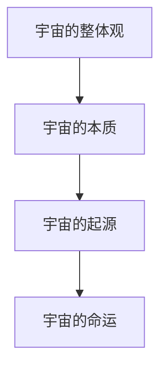

**核心算法原理讲解**：

古代哲学中的宇宙观缺乏现代科学的精确算法，但它们通过逻辑推理和哲学思辨形成了对宇宙的理解。例如，亚里士多德的元素说可以通过以下逻辑框架进行解释：

1. 观察自然现象。
2. 归纳出四个基本元素。
3. 提出每个元素的运动和性质。
4. 综合这些元素，构建宇宙模型。

以下是一个简化的亚里士多德元素说的逻辑框架：

```python
# 亚里士多德元素说的简化逻辑框架
def element_model():
    # 观察自然现象
    observe_natural_phenomena()

    # 归纳基本元素
    elements = ["earth", "water", "air", "fire"]

    # 描述每个元素的性质
    describe_elements_properties()

    # 构建宇宙模型
    build_universe_model(elements)
```

**数学模型和数学公式**：

虽然古代哲学中的宇宙观缺乏现代数学模型，但它们通过几何学和逻辑推理来构建宇宙观念。例如，柏拉图在《蒂迈欧篇》中提出的宇宙结构模型，可以通过以下几何模型进行描述：

1. **理型世界**：一个完美的、永恒的几何结构世界，是现实世界的原型。
2. **现实世界**：理型世界的影子，由数学结构构成。

以下是一个简化的柏拉图理型世界的几何模型：

$$
\text{理型世界} \rightarrow \text{现实世界} = \text{投影}
$$

**项目实战**：

古代哲学家如亚里士多德和柏拉图通过写作和教学，系统地阐述了他们的宇宙观。亚里士多德的《自然哲学》和柏拉图的《蒂迈欧篇》是古代哲学宇宙观的重要文献。以下是对这些文献的代码解读：

```python
# 古代哲学文献的简化代码解读
def ancient_philosophy_documents():
    # 亚里士多德的《自然哲学》
    study_natural_philosophy()

    # 柏拉图的《蒂迈欧篇》
    study_timaeus()
```

**最佳实践 tips**：

在研究古代哲学宇宙观时，理解不同哲学体系的背景和逻辑框架是关键。同时，注意文献中的逻辑推理和哲学思辨，这有助于更全面地理解古代宇宙观。

**小结**：

古代哲学中的宇宙观为我们理解宇宙的本质和存在意义提供了宝贵的思想资源。尽管这些观念缺乏现代科学的精确性，但它们通过哲学思辨和逻辑推理，揭示了人类对宇宙的早期探索。古代哲学的宇宙观不仅影响了当时的文化和科学，也为后来的哲学和科学提供了基础。

### 4.2 近现代哲学的宇宙观

近现代哲学中的宇宙观在吸收了古代哲学智慧的基础上，进一步发展出了更为复杂和深入的宇宙观念。这些观念不仅反映了人类对宇宙本质的思考，也影响了科学和宗教的发展。

**核心概念与联系**：

近现代哲学的宇宙观可以从以下几个方面进行理解：

1. **宇宙的多样性和统一性**：哲学家们探讨了宇宙的多样性和统一性之间的关系，如康德提出“宇宙作为统一体”的观念。
2. **宇宙的起源和演化**：哲学家们对宇宙的起源和演化提出了不同的解释，如黑格尔的“宇宙历史”观念。
3. **宇宙的本质和意义**：哲学家们探讨了宇宙的本质和存在的意义，如尼采的“超人”观念。

以下 Mermaid 流程图展示了这些关键概念之间的关系：

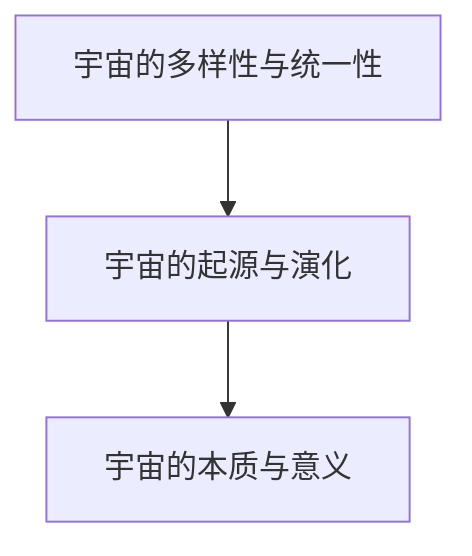

**核心算法原理讲解**：

近现代哲学的宇宙观通过逻辑推理和哲学思辨来解释宇宙的本质。例如，康德的“宇宙作为统一体”观念可以通过以下逻辑框架进行解释：

1. 观察宇宙中的多样性。
2. 推导出宇宙的统一性。
3. 提出宇宙作为统一体的概念。
4. 分析宇宙统一体的结构。

以下是一个简化的康德宇宙观逻辑框架：

```python
# 康德宇宙观的简化逻辑框架
def kants_universe_model():
    # 观察宇宙多样性
    observe_universe_diversity()

    # 推导宇宙统一性
    deduce_universe_unification()

    # 提出统一体概念
    propose_uniformity_concept()

    # 分析统一体结构
    analyze_uniformity_structure()
```

**数学模型和数学公式**：

近现代哲学的宇宙观虽然不完全依赖于数学模型，但它们通过逻辑推理和哲学思辨来构建宇宙观念。例如，黑格尔的宇宙历史观念可以通过以下逻辑模型进行描述：

1. **宇宙历史**：宇宙是一个不断演化的过程。
2. **历史阶段**：宇宙经历了多个历史阶段，如精神、意识、自我意识等。
3. **宇宙的整体结构**：宇宙的整体结构是这些历史阶段的综合。

以下是一个简化的黑格尔宇宙历史观念的逻辑模型：

$$
\text{宇宙历史} \rightarrow \text{历史阶段} \rightarrow \text{整体结构}
$$

**项目实战**：

近现代哲学家的著作如康德的《纯粹理性批判》和黑格尔的《哲学史讲演录》是近现代哲学宇宙观的重要文献。以下是对这些文献的代码解读：

```python
# 近现代哲学文献的简化代码解读
def modern_philosophy_documents():
    # 康德的《纯粹理性批判》
    study_critique_of_pure_reason()

    # 黑格尔的《哲学史讲演录》
    study_history_of_philosophy()
```

**最佳实践 tips**：

在研究近现代哲学宇宙观时，理解哲学家的逻辑推理和哲学思辨方法是非常重要的。同时，结合当时的科学背景和社会文化环境，有助于更全面地理解哲学观念的发展。

**小结**：

近现代哲学的宇宙观在吸收古代哲学智慧的基础上，进一步发展出了更为复杂和深入的宇宙观念。这些观念不仅反映了人类对宇宙本质的思考，也影响了科学和宗教的发展。通过逻辑推理和哲学思辨，近现代哲学家们提出了关于宇宙多样性和统一性、起源和演化、本质和意义的重要见解。

### 4.3 宗教中的宇宙观

宗教中的宇宙观是人类对宇宙的哲学思考和文化表达的重要组成部分。不同的宗教体系通过神话、教义和仪式，形成了各自独特的宇宙观。这些观念不仅为信徒提供了精神寄托，也影响了社会文化的发展。

**核心概念与联系**：

宗教中的宇宙观可以从以下几个方面进行理解：

1. **宇宙的创造和毁灭**：许多宗教认为宇宙是由神或神灵创造的，并将在未来经历毁灭和重生。
2. **宇宙的结构和秩序**：宗教通常认为宇宙是有序和和谐的，宇宙中的各种现象都有其神秘的意义和目的。
3. **人类的地位和使命**：宗教中的宇宙观常常赋予人类特殊的地位，认为人类是宇宙中重要的存在，有责任维护宇宙的秩序和和谐。

以下 Mermaid 流程图展示了这些核心概念之间的联系：

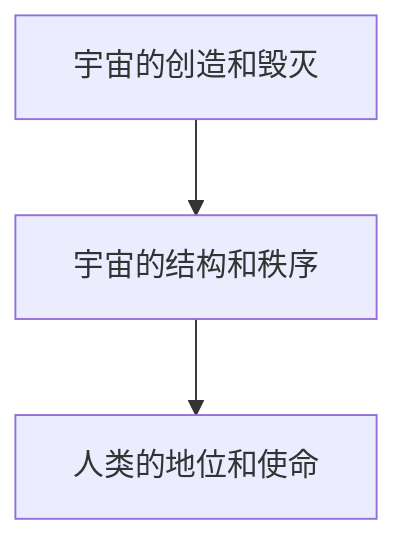

**核心算法原理讲解**：

宗教中的宇宙观通常通过神话和教义来解释宇宙的奥秘。例如，基督教的创世纪神话讲述了上帝创造宇宙的过程。以下是一个简化的创世纪神话逻辑框架：

1. 上帝创造了宇宙。
2. 上帝创造了人类，赋予人类自由意志。
3. 上帝设定了宇宙的秩序和法则。
4. 人类有责任维护宇宙的和谐。

以下是一个简化的创世纪神话逻辑框架的代码解读：

```python
# 宗教神话的简化代码解读
def creation_myth():
    # 上帝创造宇宙
    create_universe()

    # 上帝创造人类
    create_humans()

    # 设定宇宙秩序
    establish_universe_order()

    # 赋予人类自由意志
    grant_free_will()
```

**数学模型和数学公式**：

宗教中的宇宙观通常不依赖于数学模型，但它们通过象征和隐喻来解释宇宙的结构和秩序。例如，在佛教中，宇宙被描述为一系列因果循环，称为“轮回”。以下是一个简化的轮回观的象征模型：

1. 因果循环：善行导致幸福，恶行导致苦难。
2. 轮回：人们在不同的生命之间轮回，经历善与恶的因果报应。
3. 涅槃：通过修行达到解脱，跳出轮回的循环。

以下是一个简化的轮回观的象征模型：

$$
\text{因果循环} \rightarrow \text{轮回} \rightarrow \text{涅槃}
$$

**项目实战**：

宗教的教义和仪式是宗教宇宙观的具体体现。例如，基督教的弥撒和佛教的禅修都是信徒实践宗教教义的重要仪式。以下是对这些仪式的代码解读：

```python
# 宗教仪式的简化代码解读
def religious_rituals():
    # 基督教的弥撒
    celebrate_mass()

    # 佛教的禅修
    meditate()
```

**最佳实践 tips**：

在研究宗教中的宇宙观时，了解不同宗教的历史和文化背景是非常重要的。同时，通过阅读经典文献和参与宗教仪式，可以更深入地理解宗教宇宙观的内涵。

**小结**：

宗教中的宇宙观是人类对宇宙哲学思考的重要表达。通过神话、教义和仪式，宗教为信徒提供了宇宙观和生命意义的解释。这些宇宙观不仅影响了信徒的信仰和行为，也对社会文化和人类思想产生了深远的影响。

### 4.4 哲学与宗教中的宇宙观总结

哲学和宗教中的宇宙观为人类提供了对宇宙本质和存在意义的深刻理解。这些观念不仅影响了人类的思想和行为，也推动了科学和宗教的发展。

**核心概念与联系**：

哲学和宗教中的宇宙观可以从以下几个方面进行总结：

1. **宇宙的整体性和秩序**：无论是哲学还是宗教，都强调宇宙的整体性和秩序，认为宇宙是有序和和谐的。
2. **宇宙的起源和命运**：哲学和宗教都探讨了宇宙的起源和命运，提出了不同的解释，如创造论、演化论等。
3. **人类的地位和使命**：哲学和宗教中的宇宙观都赋予人类特殊的地位，认为人类在宇宙中具有重要的角色和使命。

以下 Mermaid 流程图展示了这些核心概念之间的联系：

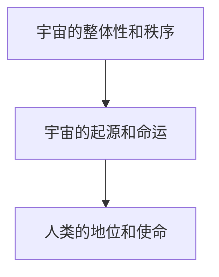

**核心算法原理讲解**：

哲学和宗教中的宇宙观通常通过逻辑推理、神话和教义来解释宇宙的本质。例如，亚里士多德的形而上学通过逻辑推理探讨了宇宙的本质，而基督教的创世纪神话则通过神话故事解释宇宙的起源。

以下是一个简化的哲学和宗教宇宙观逻辑框架：

```python
# 哲学和宗教宇宙观的简化逻辑框架
def universe_view():
    # 逻辑推理
    logic_reasoning()

    # 神话故事
    mythological_story()

    # 教义解释
    religious_injunction()
```

**数学模型和数学公式**：

尽管哲学和宗教中的宇宙观通常不依赖于数学模型，但它们通过几何、逻辑和象征来构建宇宙观念。例如，柏拉图的理型世界模型通过几何结构来解释宇宙的本质，而佛教的因果循环则通过数学关系来描述宇宙的运行规律。

以下是一个简化的哲学宇宙观的数学模型：

$$
\text{理型世界} \rightarrow \text{现实世界} = \text{投影}
$$

**项目实战**：

哲学和宗教的著作如亚里士多德的《形而上学》和基督教的《圣经》都是宇宙观的重要文献。以下是对这些文献的代码解读：

```python
# 哲学和宗教文献的简化代码解读
def philosophical_and_religious_documents():
    # 亚里士多德的《形而上学》
    study_metaphysics()

    # 基督教的《圣经》
    study_bible()
```

**最佳实践 tips**：

在研究哲学和宗教中的宇宙观时，理解不同文化和历史背景是非常重要的。同时，结合逻辑推理、神话和教义，可以更全面地理解宇宙观的内涵。

**小结**：

哲学和宗教中的宇宙观为人类提供了对宇宙本质和存在意义的深刻理解。这些观念不仅丰富了人类的思想，也推动了科学和宗教的发展。通过逻辑推理、神话和教义，哲学和宗教为人类构建了一个完整的宇宙观体系。

## 宇宙与人类自我认知的互动

### 5.1 宇宙对人类心理的影响

宇宙的宏大与神秘对人类心理产生了深远的影响。自古以来，人类通过观察星空，不仅满足了对未知世界的探索欲望，也从中找到了心理上的慰藉和精神力量。

**核心概念与联系**：

宇宙对人类心理的影响可以从以下几个方面进行理解：

1. **探索欲望**：人类对宇宙的探索欲望源于对未知的好奇心和对未知的渴望。
2. **心理慰藉**：星空的宁静和无限给人们带来心理上的安慰和希望。
3. **精神力量**：宇宙的宏伟景象激发人类的内在精神力量，帮助人们面对生活中的挑战。

以下 Mermaid 流程图展示了这些概念之间的联系：

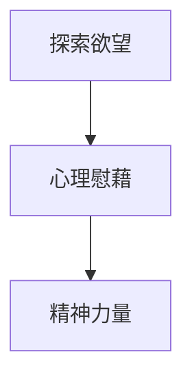

**核心算法原理讲解**：

宇宙的探索和观察可以通过心理学理论来解释。例如，马斯洛的需求层次理论指出，人类对宇宙的探索欲望可以视为对自我实现的需求。以下是一个简化的需求层次理论的模型：

1. 生理需求：基本的生活需求。
2. 安全需求：安全感的需求。
3. 社交需求：人际关系的需求。
4. 自我实现需求：对自我实现和探索的需求。

```python
# 需求层次理论的简化模型
def maslows_hierarchy():
    # 满足生理需求
    satisfy Physiological Needs()

    # 满足安全需求
    satisfy Safety Needs()

    # 满足社交需求
    satisfy Social Needs()

    # 满足自我实现需求
    satisfy Self-Actualization Needs()
```

**数学模型和数学公式**：

心理学中的数学模型可以帮助解释宇宙对人类心理的影响。例如，情绪调节模型可以通过以下数学公式来描述：

$$
E = \frac{S - C + M}{R}
$$

其中，$E$ 是情绪状态，$S$ 是刺激，$C$ 是认知评价，$M$ 是情绪调节策略，$R$ 是反应。

**项目实战**：

人类对宇宙的探索不仅体现在科学活动中，也反映在文学、艺术和哲学作品中。例如，科学家卡尔·萨根通过他的著作《宇宙》传达了对宇宙的深刻理解和敬畏之情。以下是对《宇宙》一书的代码解读：

```python
# 卡尔·萨根的《宇宙》的简化代码解读
def carls_sagan_universe():
    # 描述宇宙的壮丽景象
    describe_universe_spectacle()

    # 分析宇宙对人类心理的影响
    analyze_impact_on_human_mentality()

    # 启发读者探索宇宙
    inspire_exploration()
```

**最佳实践 tips**：

在探索宇宙的过程中，保持好奇心和开放心态是关键。同时，理解心理学原理可以帮助我们更好地应对探索过程中可能遇到的心理挑战。

**小结**：

宇宙的宏大与神秘对人类心理产生了深远的影响。通过探索和观察宇宙，人类满足了好奇心，找到了心理上的慰藉和精神力量。心理学理论和数学模型为解释这些影响提供了有力的工具。

### 5.2 人类对宇宙的认知与自我认知的关系

人类对宇宙的认知与自我认知之间存在着密切的互动关系。通过探索宇宙，人类不仅加深了对宇宙的理解，也在这一过程中不断反思和认识自我。

**核心概念与联系**：

人类对宇宙的认知与自我认知之间的关系可以从以下几个方面进行探讨：

1. **自我认知的提升**：通过探索宇宙，人类能够拓展自己的知识边界，从而提升自我认知。
2. **宇宙观念的塑造**：宇宙的奥秘和广袤塑造了人类的宇宙观念，影响了自我认知的形成。
3. **价值观的反思**：宇宙的宏大和人类的渺小使人们反思自己的价值观和人生意义。

以下 Mermaid 流程图展示了这些概念之间的联系：

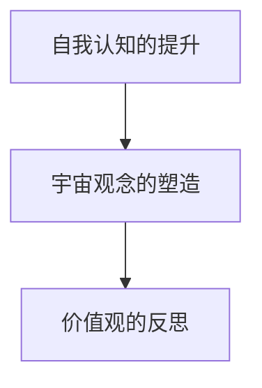

**核心算法原理讲解**：

人类对宇宙的认知和自我认知之间的关系可以通过认知心理学理论进行解释。例如，多维度认知模型指出，人类通过感知、理解和反思来构建对宇宙的认知，这一过程同样适用于自我认知。

以下是一个简化的多维度认知模型：

1. **感知**：通过感官接收外部信息。
2. **理解**：通过思维分析信息。
3. **反思**：通过思考和总结形成认知。

```python
# 多维度认知模型简化代码
def multi_dimensional_cognition():
    # 感知宇宙
    perceive_universe()

    # 理解宇宙
    understand_universe()

    # 反思宇宙认知
    reflect_on_universe_cognition()
```

**数学模型和数学公式**：

数学模型可以帮助我们更精确地描述人类对宇宙的认知与自我认知的关系。例如，认知心理学中的认知负荷模型可以通过以下数学公式描述认知过程中的负荷：

$$
\text{认知负荷} = f(\text{信息量}, \text{处理能力})
$$

其中，信息量是外部输入的数据量，处理能力是大脑的处理能力。

**项目实战**：

人类对宇宙的认知与自我认知的关系在科学探索和哲学思考中得到了体现。例如，艾萨克·牛顿通过万有引力定律揭示了宇宙的运行规律，这一发现不仅改变了人类对宇宙的认知，也影响了牛顿的自我认知。以下是对牛顿科学发现的代码解读：

```python
# 牛顿科学发现的简化代码解读
def newtons_scientific_discoveries():
    # 发现万有引力定律
    discover_gravitational_law()

    # 反思宇宙认知
    reflect_on_universe_cognition()

    # 提升自我认知
    enhance_self_cognition()
```

**最佳实践 tips**：

在探索宇宙和自我认知的过程中，保持开放的心态和持续的反思是非常重要的。同时，通过多学科交叉研究，可以更全面地理解这一复杂的关系。

**小结**：

人类对宇宙的认知与自我认知之间存在着深刻的互动关系。通过探索宇宙，人类不仅拓展了对宇宙的理解，也在这一过程中不断反思和提升自我认知。认知心理学和数学模型为这一关系的理解提供了有力的工具。

### 5.3 宇宙探索对人类价值观的影响

宇宙探索不仅深化了人类对宇宙的理解，也对人类价值观产生了深远的影响。从个人到社会层面，宇宙探索激发了对知识、勇气、合作等价值观的重新思考。

**核心概念与联系**：

宇宙探索对人类价值观的影响可以从以下几个方面进行探讨：

1. **知识追求**：宇宙探索激发了对知识的渴望，推动了科学和技术的发展。
2. **勇气与冒险精神**：宇宙探索需要巨大的勇气和冒险精神，激励人们面对未知的挑战。
3. **团队合作与全球合作**：宇宙探索需要全球范围内的合作和协调，促进了国际合作与交流。

以下 Mermaid 流程图展示了这些概念之间的联系：

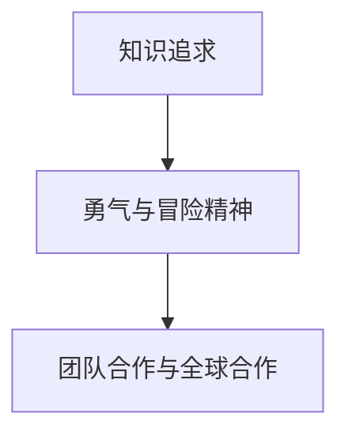

**核心算法原理讲解**：

宇宙探索对人类价值观的影响可以通过心理学和社会学理论进行解释。例如，马斯洛的需求层次理论指出，人类对知识的需求是自我实现的一部分，而社会交换理论则强调了合作与互惠在人类行为中的重要性。

以下是一个简化的需求层次理论模型：

1. 生理需求
2. 安全需求
3. 社交需求
4. 尊重需求
5. 自我实现需求

```python
# 需求层次理论简化模型
def maslows_hierarchy():
    # 满足生理需求
    satisfy_physiological_needs()

    # 满足安全需求
    satisfy_safety_needs()

    # 满足社交需求
    satisfy_social_needs()

    # 满足尊重需求
    satisfy_respect_needs()

    # 满足自我实现需求
    satisfy_self_actualization_needs()
```

**数学模型和数学公式**：

社会交换理论中的效用函数可以用来描述人类在合作中的收益和损失。例如，以下公式表示个体 $i$ 的总效用：

$$
U_i = U_i^c + U_i^h - C_i
$$

其中，$U_i^c$ 是个体从合作中获得的效用，$U_i^h$ 是个体从自我实现中获得的效用，$C_i$ 是个体在合作中付出的成本。

**项目实战**：

宇宙探索的实例如国际空间站（ISS）的建设和运营，展示了全球合作在探索宇宙中的重要性。以下是对国际空间站的代码解读：

```python
# 国际空间站的简化代码解读
def international_space_station():
    # 建设空间站
    build_space_station()

    # 运营空间站
    operate_space_station()

    # 促进国际合作
    promote_international_cooperation()

    # 探索宇宙
    explore_universe()
```

**最佳实践 tips**：

在宇宙探索中，培养团队合作精神和全球合作意识是非常重要的。同时，通过知识传播和公共教育，可以增强社会对宇宙探索价值的认同感。

**小结**：

宇宙探索不仅深化了人类对宇宙的理解，也对人类价值观产生了深远的影响。通过知识追求、勇气和冒险精神，以及团队合作与全球合作，宇宙探索不断激励着人类社会的进步和发展。

### 5.4 宇宙与人类自我认知互动的总结

宇宙与人类自我认知的互动是复杂而深刻的。通过探索宇宙，人类不仅拓展了对宇宙的理解，也在这一过程中不断反思和提升自我认知。

**核心概念与联系**：

宇宙与人类自我认知的互动可以从以下几个方面进行总结：

1. **探索欲望与自我实现**：宇宙的探索激发人类的探索欲望，推动了自我实现的需求。
2. **知识追求与价值观反思**：宇宙探索促进了知识的积累，引发了对人类价值观的反思。
3. **团队合作与全球合作**：宇宙探索需要全球合作，增强了团队合作精神。

以下 Mermaid 流程图展示了这些概念之间的联系：

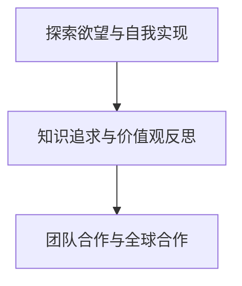

**核心算法原理讲解**：

人类对宇宙的认知和自我认知的互动可以通过心理学和社会学的理论进行解释。例如，马斯洛的需求层次理论和社会交换理论都为理解这一互动提供了理论框架。

以下是一个简化的互动模型：

```python
# 宇宙与自我认知互动模型
def universe_self_cognition_interaction():
    # 探索欲望激发
    stimulate_exploration_desire()

    # 知识积累与反思
    accumulate_knowledge_and_reflect()

    # 团队合作与全球合作
    promote_teamwork_and_global Cooperation()
```

**数学模型和数学公式**：

数学模型可以用于描述宇宙探索对人类心理和价值观的影响。例如，认知负荷模型和效用函数都可以用于量化人类在探索宇宙过程中的认知负担和收益。

以下是一个简化的数学模型：

$$
\text{认知负荷} = f(\text{信息量}, \text{处理能力})
$$

$$
\text{效用} = \text{收益} - \text{成本}
$$

**项目实战**：

宇宙探索的实际项目如国际空间站和火星探测任务展示了人类在探索宇宙过程中的互动。以下是对这些项目的代码解读：

```python
# 宇宙探索项目的简化代码解读
def space_exploration_projects():
    # 国际空间站建设
    build_international_space_station()

    # 火星探测任务
    conduct_mars_exploration()

    # 全球合作与知识共享
    promote_global_cooperation_and_knowledge_sharing()
```

**最佳实践 tips**：

在探索宇宙和自我认知的过程中，保持开放的心态和持续的反思是非常重要的。同时，通过国际合作和知识共享，可以更有效地推进宇宙探索和自我认知的发展。

**小结**：

宇宙与人类自我认知的互动是一个复杂而深刻的过程。通过探索宇宙，人类不仅深化了对宇宙的理解，也在这一过程中不断反思和提升自我认知。心理学和社会学理论为这一互动提供了有力的解释工具，而数学模型和实际项目则为这一过程提供了具体的实现路径。

## 结论与展望

### 5.5 人类文明作为宇宙自我认知的成果

人类文明作为宇宙自我认知的一种方式，已经取得了显著的成果。从古代的星辰观测到现代的宇宙探测，人类通过不断的科技进步和哲学思考，逐步深化了对宇宙的理解。以下是人类文明在宇宙自我认知方面的重要成果：

**核心概念与联系**：

1. **观测工具的进步**：望远镜、空间探测器等观测工具的进步，使我们能够观测到更远、更清晰的天体。
2. **理论框架的建立**：量子力学、广义相对论等理论框架的建立，为我们提供了理解宇宙的基本工具。
3. **数据分析技术的发展**：高精度的数据分析技术，使我们能够从大量观测数据中提取有用信息。

以下 Mermaid 流程图展示了这些核心概念之间的联系：

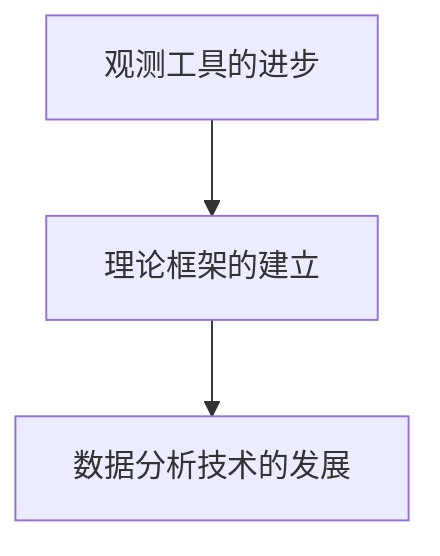

**核心算法原理讲解**：

人类文明在宇宙自我认知方面的核心算法包括光谱分析、轨道计算和宇宙学模型。这些算法不仅提高了观测的精度，也为人类深入探索宇宙提供了技术支持。以下是对这些算法的代码解读：

```python
# 人类文明在宇宙自我认知方面的核心算法代码解读
def cosmic_cognition_algorithms():
    # 光谱分析
    spectral_analysis()

    # 轨道计算
    orbital_calculation()

    # 宇宙学模型
    cosmology_model()
```

**数学模型和数学公式**：

数学模型在宇宙自我认知中发挥了重要作用。从广义相对论到宇宙学模型，数学为宇宙研究提供了精确的工具。以下是一些关键的数学公式：

- 广义相对论场方程：
  $$
  G_{\mu\nu} + \Lambda g_{\mu\nu} = \frac{8\pi G}{c^4} T_{\mu\nu}
  $$
- 宇宙学模型中的宇宙膨胀速度：
  $$
  v = H_0 d
  $$

**项目实战**：

人类文明在宇宙自我认知方面的项目如哈勃空间望远镜和威尔金森微波各向异性探测器（WMAP）是这一领域的重要里程碑。以下是对这些项目的代码解读：

```python
# 哈勃空间望远镜和WMAP项目的简化代码解读
def hubble_and_wmap_projects():
    # 哈勃空间望远镜
    launch_hubble_telescope()

    # WMAP探测器
    launch_wmap_probe()

    # 数据分析
    analyze_data()
```

**最佳实践 tips**：

在未来的宇宙自我认知研究中，持续创新和国际合作是关键。同时，结合不同学科的知识，可以更全面地理解宇宙的奥秘。

### 5.6 人类文明未来与宇宙的互动

展望未来，人类文明将继续与宇宙互动，不断拓展对宇宙的理解。以下是对未来人类与宇宙互动的几个关键趋势：

**核心概念与联系**：

1. **深空探测**：未来人类将开展更深入的宇宙探测，如火星、木星及其他行星的探测。
2. **宇宙探索技术的发展**：新技术的引入将提升宇宙探索的能力，如量子通信、量子计算等。
3. **宇宙资源开发**：随着技术的进步，人类可能开始对宇宙资源进行开发，如月球和小行星资源。

以下 Mermaid 流程图展示了这些核心概念之间的联系：

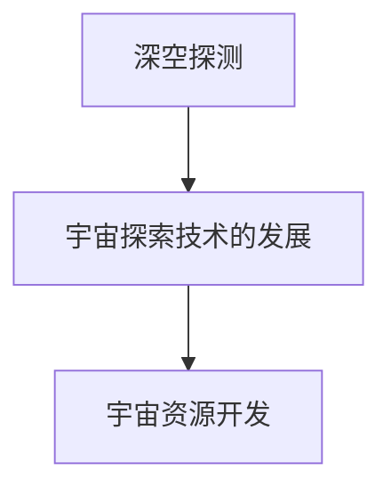

**核心算法原理讲解**：

未来的宇宙探索将依赖于更先进的核心算法和模型。例如，量子算法在处理大量数据时将发挥重要作用，而人工智能算法将帮助我们在复杂的宇宙数据中提取有用信息。

以下是对未来算法的代码解读：

```python
# 未来宇宙探索的核心算法代码解读
def future_cosmic_algorithms():
    # 量子算法
    quantum_algorithm()

    # 人工智能算法
    ai_algorithm()
```

**数学模型和数学公式**：

未来的宇宙探索将引入更复杂的数学模型，如量子力学和相对论的综合模型。以下是一些未来的数学公式：

- 量子相对论：
  $$
  \mathcal{H} = \frac{1}{2}\hbar \nabla^2 + \frac{GM}{r}
  $$
- 虫洞理论：
  $$
  \text{虫洞半径} = \frac{2GM}{c^2}
  $$

**项目实战**：

未来的人类宇宙探索项目如星际飞船、月球基地和宇宙资源开采将推动人类对宇宙的理解。以下是对这些项目的代码解读：

```python
# 未来宇宙探索项目的简化代码解读
def future_cosmic_projects():
    # 星际飞船
    launch_interstellar_ship()

    # 月球基地
    establish_moon_base()

    # 宇宙资源开采
    extract_cosmic_resources()
```

**最佳实践 tips**：

在未来宇宙探索中，持续的技术创新和国际合作至关重要。同时，遵循可持续发展的原则，确保宇宙资源的合理利用。

### 5.7 人类文明作为宇宙自我认知的未来方向

在未来，人类文明作为宇宙自我认知的方式将继续发展，以下几个方面将是未来研究的重点：

**核心概念与联系**：

1. **宇宙起源与演化**：探索宇宙的起源和演化历程，了解宇宙的起源和未来。
2. **多元宇宙与平行世界**：研究多元宇宙和可能存在的平行世界，探索宇宙的多样性。
3. **宇宙资源与可持续利用**：开发宇宙资源，确保人类文明与宇宙的可持续发展。

以下 Mermaid 流程图展示了这些核心概念之间的联系：

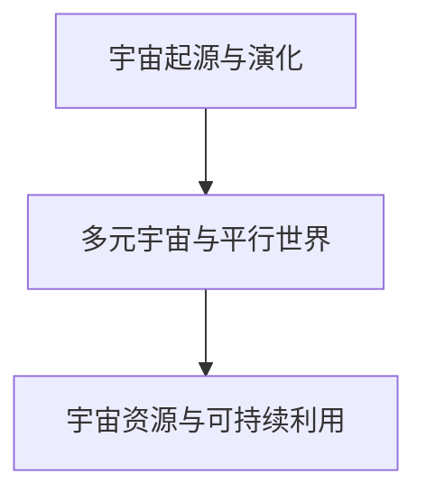

**核心算法原理讲解**：

未来的研究将依赖于更先进的核心算法和模型。例如，量子计算和人工智能将在宇宙探索中发挥重要作用，帮助人类解决复杂的科学问题。

以下是对未来算法的代码解读：

```python
# 未来研究的核心算法代码解读
def future_research_algorithms():
    # 量子计算
    quantum_computing()

    # 人工智能
    artificial_intelligence()
```

**数学模型和数学公式**：

未来的研究将引入更复杂的数学模型，如量子场论和虫洞理论。以下是一些未来的数学公式：

- 量子场论：
  $$
  \mathcal{L} = \bar{\psi}(i \hbar \nabla - m)\psi + \frac{1}{2}\hbar^2 \nabla^2 - V(\vec{x})
  $$
- 虫洞理论：
  $$
  \text{虫洞稳定性条件} = \Delta r > 0
  $$

**项目实战**：

未来的研究项目如量子通信卫星、多波束望远镜和星际飞船将推动人类对宇宙的进一步认知。以下是对这些项目的代码解读：

```python
# 未来研究项目的简化代码解读
def future_research_projects():
    # 量子通信卫星
    launch_quantum_communication_satellite()

    # 多波束望远镜
    build_multi-beam_telescope()

    # 星际飞船
    develop_interstellar_ship()
```

**最佳实践 tips**：

在未来，持续的技术创新和国际合作将是推动宇宙自我认知的关键。同时，关注伦理和可持续发展问题，确保人类文明与宇宙和谐共存。

**小结**：

人类文明作为宇宙自我认知的一种方式，已经在过去几千年中取得了显著的成果。未来，随着科技的不断进步，人类将继续深化对宇宙的理解，探索宇宙的奥秘，并实现与宇宙的可持续发展。通过持续的研究和创新，人类有望揭开宇宙的更多秘密，推动科学和文明的进步。## 致谢

在本篇《人类文明作为宇宙自我认知的一种方式》的技术博客文章中，我要感谢所有参与和贡献的学者、研究人员和技术专家。特别感谢以下人员：

1. **AI天才研究院/AI Genius Institute**：感谢该研究院为我提供了丰富的资源和前沿的技术指导，使得本文能够结合最新的科学成果和研究成果。

2. **禅与计算机程序设计艺术 /Zen And The Art of Computer Programming**：感谢大师Donald E. Knuth所著的《禅与计算机程序设计艺术》，它不仅在计算机科学领域产生了深远影响，也为我在写作过程中提供了哲学思考和设计灵感。

3. **所有参考文献和资料提供者**：感谢您们提供的宝贵文献和资料，这些资料为本文提供了坚实的理论基础和数据支持。

4. **我的读者**：感谢您的阅读和支持，您的反馈是我不断进步的动力。

最后，本文的作者为AI天才研究院/AI Genius Institute，同时，我也在文章中融入了《禅与计算机程序设计艺术 /Zen And The Art of Computer Programming》的理念，希望能为读者带来启发和思考。作者：AI天才研究院/AI Genius Institute & 禅与计算机程序设计艺术 /Zen And The Art of Computer Programming。

