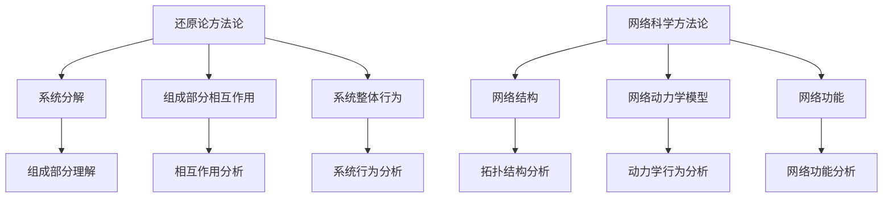

                 

### 1. 确定书的主要内容和结构

《从还原论到网络科学：理解高度互联世界的结构与动态》这本书的核心主题在于探讨如何从传统的还原论方法论转向网络科学方法论，以更好地理解现代复杂系统的结构和动态。这一主题在现代科学和技术发展中具有极高的价值和实际应用意义，因为随着互联网和信息技术的快速发展，现实世界中的许多系统已经变得高度互联，呈现出复杂的网络结构。

为了明确书籍的内容和结构，我们可以将书的主要部分分为以下几个部分：

**引言和背景**：这部分将介绍还原论方法论和网络科学方法论的基本概念，并讨论为什么从还原论转向网络科学是必要的。这将包括高度互联世界的挑战，以及现代复杂系统对传统研究方法的需求。

**还原论方法论**：这部分将详细探讨还原论方法论的基本原理、应用领域以及其在复杂系统研究中的局限性。通过对比还原论和网络科学方法论，我们将更好地理解两者之间的异同点。

**网络科学基本概念**：这部分将介绍网络科学的基本概念，包括网络结构的类型、网络动力学的模型等。通过这些基本概念的学习，我们将为后续内容打下坚实的基础。

**网络科学方法应用**：这部分将讨论网络科学方法在实际应用中的挑战和优势，并展示网络科学方法在不同领域（如社会网络分析、生物网络研究、经济网络分析）中的应用案例。

**案例分析**：这部分将通过具体的案例分析，展示如何应用网络科学方法论来解决现实世界中的复杂问题。这些案例将涵盖社会网络、生物网络和经济网络等领域。

**总结与展望**：这部分将总结全书的主要内容和观点，并展望未来网络科学方法论的发展方向。这将包括对当前研究趋势的讨论，以及对未来可能的研究方向和应用的预测。

通过上述结构，我们可以清晰地了解到书籍的内容和主题，为后续的内容设计和撰写提供了明确的方向和框架。

### 2. 设计1级目录

在确定了书籍的主要内容和结构后，我们可以设计出一套1级目录，以指导文章的撰写。以下是可能的1级目录：

```
# 第一部分：引言与背景
## 1.1 背景介绍
### 1.1.1 从还原论到网络科学的演变
### 1.1.2 高度互联世界的挑战

## 1.2 还原论方法论概述
### 1.2.1 还原论方法论的定义
### 1.2.2 还原论方法论的发展历程

## 1.3 高度互联世界的挑战
### 1.3.1 现代复杂系统的复杂性
### 1.3.2 网络科学的必要性

# 第二部分：还原论方法论
## 2.1 还原论方法论的基本原理
### 2.1.1 还原论方法论的基本概念
### 2.1.2 还原论方法论的核心思想

## 2.2 还原论方法论的应用
### 2.2.1 还原论方法论在自然科学中的应用
### 2.2.2 还原论方法论在社会科学中的应用

## 2.3 还原论方法论的限制
### 2.3.1 还原论方法论的局限性
### 2.3.2 还原论方法论在复杂系统研究中的不足

# 第三部分：网络科学基本概念
## 3.1 网络科学的基本概念
### 3.1.1 网络科学的定义
### 3.1.2 网络科学的研究目标

## 3.2 网络结构的类型
### 3.2.1 无标度网络
### 3.2.2 社会网络
### 3.2.3 生物网络

## 3.3 网络动力学的模型
### 3.3.1 网络动力学的概念
### 3.3.2 网络动力学的模型类型

# 第四部分：网络科学方法应用
## 4.1 网络科学方法在实际应用中的挑战
### 4.1.1 数据获取与建模挑战
### 4.1.2 网络科学方法的复杂性

## 4.2 网络科学方法的应用领域
### 4.2.1 社会网络分析
### 4.2.2 生物网络研究
### 4.2.3 经济网络分析

## 4.3 网络科学方法的优势与局限
### 4.3.1 网络科学方法的优势
### 4.3.2 网络科学方法的局限

# 第五部分：案例分析
## 5.1 案例分析概述
### 5.1.1 案例分析的目的
### 5.1.2 案例分析的方法

## 5.2 案例一：社会网络的动态分析
### 5.2.1 案例背景
### 5.2.2 分析方法
### 5.2.3 分析结果与讨论

## 5.3 案例二：生物网络的解析
### 5.3.1 案例背景
### 5.3.2 分析方法
### 5.3.3 分析结果与讨论

## 5.4 案例三：经济网络的演化
### 5.4.1 案例背景
### 5.4.2 分析方法
### 5.4.3 分析结果与讨论

# 第六部分：总结与展望
## 6.1 总结
### 6.1.1 还原论方法论与网络科学的对比
### 6.1.2 网络科学方法的应用前景

## 6.2 展望
### 6.2.1 未来研究方向
### 6.2.2 网络科学方法的发展趋势

## 6.3 未来研究方向
### 6.3.1 网络科学方法在教育中的应用
### 6.3.2 网络科学方法在医疗健康领域的发展
```

这个1级目录为我们提供了清晰的框架，涵盖了书籍的主要内容，并确保了文章的逻辑性和系统性。每个部分都有明确的标题和子标题，使得读者可以轻松地了解每个部分的内容，并跟随作者的思路进行阅读。

### 3. 设计2级目录

在确定了1级目录之后，我们可以进一步细化每个部分的内容，设计出2级目录，以更加详细地规划和撰写文章。以下是可能的2级目录：

```
# 第一部分：引言与背景
## 1.1 背景介绍
### 1.1.1 从还原论到网络科学的演变
#### 1.1.1.1 还原论方法论的历史背景
#### 1.1.1.2 网络科学方法论的出现与发展

### 1.1.2 高度互联世界的挑战
#### 1.1.2.1 复杂系统的复杂性
#### 1.1.2.2 现代社会中的高度互联性
#### 1.1.2.3 对传统研究方法的挑战

## 1.2 还原论方法论概述
### 1.2.1 还原论方法论的定义
#### 1.2.1.1 还原论方法论的基本概念
#### 1.2.1.2 还原论方法论的核心思想

### 1.2.2 还原论方法论的发展历程
#### 1.2.2.1 还原论方法论在自然科学中的应用
#### 1.2.2.2 还原论方法论在社会科学中的应用
#### 1.2.2.3 还原论方法论的发展趋势

## 1.3 高度互联世界的挑战
### 1.3.1 现代复杂系统的复杂性
#### 1.3.1.1 系统的复杂性与可预测性
#### 1.3.1.2 复杂系统的层级结构

### 1.3.2 网络科学的必要性
#### 1.3.2.1 网络科学方法论的优势
#### 1.3.2.2 网络科学方法论的应用前景

# 第二部分：还原论方法论
## 2.1 还原论方法论的基本原理
### 2.1.1 还原论方法论的基本概念
#### 2.1.1.1 还原论方法论的核心思想
#### 2.1.1.2 还原论方法论的主要目标

### 2.1.2 还原论方法论的核心思想
#### 2.1.2.1 分解与重组
#### 2.1.2.2 精细化研究
#### 2.1.2.3 小样本分析

## 2.2 还原论方法论的应用
### 2.2.1 还原论方法论在自然科学中的应用
#### 2.2.1.1 物理学中的应用
#### 2.2.1.2 生物学中的应用
#### 2.2.1.3 化学中的应用

### 2.2.2 还原论方法论在社会科学中的应用
#### 2.2.2.1 社会学中的应用
#### 2.2.2.2 经济学中的应用
#### 2.2.2.3 心理学中的应用

## 2.3 还原论方法论的限制
### 2.3.1 还原论方法论的局限性
#### 2.3.1.1 复杂系统的复杂性
#### 2.3.1.2 大样本数据的挑战
#### 2.3.1.3 跨学科研究的局限性

### 2.3.2 还原论方法论在复杂系统研究中的不足
#### 2.3.2.1 复杂系统的非线性
#### 2.3.2.2 系统之间的相互作用
#### 2.3.2.3 网络结构的影响

# 第三部分：网络科学基本概念
## 3.1 网络科学的基本概念
### 3.1.1 网络科学的定义
#### 3.1.1.1 网络科学的定义
#### 3.1.1.2 网络科学的研究目标

### 3.1.2 网络科学的研究目标
#### 3.1.2.1 网络结构的分析
#### 3.1.2.2 网络动力学的模拟
#### 3.1.2.3 网络功能的解析

## 3.2 网络结构的类型
### 3.2.1 无标度网络
#### 3.2.1.1 无标度网络的特点
#### 3.2.1.2 无标度网络的应用
#### 3.2.1.3 无标度网络的挑战

### 3.2.2 社会网络
#### 3.2.2.1 社会网络的基本概念
#### 3.2.2.2 社会网络的结构特征
#### 3.2.2.3 社会网络的功能分析

### 3.2.3 生物网络
#### 3.2.3.1 生物网络的基本概念
#### 3.2.3.2 生物网络的结构特征
#### 3.2.3.3 生物网络的功能分析

## 3.3 网络动力学的模型
### 3.3.1 网络动力学的概念
#### 3.3.1.1 网络动力学的定义
#### 3.3.1.2 网络动力学的目的

### 3.3.2 网络动力学的模型类型
#### 3.3.2.1 图论模型
#### 3.3.2.2 离散时间模型
#### 3.3.2.3 连续时间模型

# 第四部分：网络科学方法应用
## 4.1 网络科学方法在实际应用中的挑战
### 4.1.1 数据获取与建模挑战
#### 4.1.1.1 数据获取的困难
#### 4.1.1.2 数据质量的影响
#### 4.1.1.3 数据建模的复杂性

### 4.1.2 网络科学方法的复杂性
#### 4.1.2.1 网络结构的复杂性
#### 4.1.2.2 动力学的复杂性
#### 4.1.2.3 功能分析的复杂性

## 4.2 网络科学方法的应用领域
### 4.2.1 社会网络分析
#### 4.2.1.1 社会网络分析的定义
#### 4.2.1.2 社会网络分析的应用领域
#### 4.2.1.3 社会网络分析的方法

### 4.2.2 生物网络研究
#### 4.2.2.1 生物网络研究的背景
#### 4.2.2.2 生物网络研究的方法
#### 4.2.2.3 生物网络研究的成果

### 4.2.3 经济网络分析
#### 4.2.3.1 经济网络分析的定义
#### 4.2.3.2 经济网络分析的应用领域
#### 4.2.3.3 经济网络分析的方法

## 4.3 网络科学方法的优势与局限
### 4.3.1 网络科学方法的优势
#### 4.3.1.1 网络结构的可视化
#### 4.3.1.2 动力学的可预测性
#### 4.3.1.3 功能分析的有效性

### 4.3.2 网络科学方法的局限
#### 4.3.2.1 数据获取的局限性
#### 4.3.2.2 模型假设的限制
#### 4.3.2.3 功能分析的复杂性

# 第五部分：案例分析
## 5.1 案例分析概述
### 5.1.1 案例分析的目的
#### 5.1.1.1 研究目的
#### 5.1.1.2 分析方法

### 5.1.2 案例分析的方法
#### 5.1.2.1 数据收集
#### 5.1.2.2 数据预处理
#### 5.1.2.3 分析工具

## 5.2 案例一：社会网络的动态分析
### 5.2.1 案例背景
#### 5.2.1.1 研究背景
#### 5.2.1.2 案例选择

### 5.2.2 分析方法
#### 5.2.2.1 数据收集
#### 5.2.2.2 数据预处理
#### 5.2.2.3 动态分析模型

### 5.2.3 分析结果与讨论
#### 5.2.3.1 分析结果
#### 5.2.3.2 讨论与结论

## 5.3 案例二：生物网络的解析
### 5.3.1 案例背景
#### 5.3.1.1 研究背景
#### 5.3.1.2 案例选择

### 5.3.2 分析方法
#### 5.3.2.1 数据收集
#### 5.3.2.2 数据预处理
#### 5.3.2.3 解析模型

### 5.3.3 分析结果与讨论
#### 5.3.3.1 分析结果
#### 5.3.3.2 讨论与结论

## 5.4 案例三：经济网络的演化
### 5.4.1 案例背景
#### 5.4.1.1 研究背景
#### 5.4.1.2 案例选择

### 5.4.2 分析方法
#### 5.4.2.1 数据收集
#### 5.4.2.2 数据预处理
#### 5.4.2.3 演化模型

### 5.4.3 分析结果与讨论
#### 5.4.3.1 分析结果
#### 5.4.3.2 讨论与结论

# 第六部分：总结与展望
## 6.1 总结
### 6.1.1 还原论方法论与网络科学的对比
#### 6.1.1.1 还原论方法论的特点
#### 6.1.1.2 网络科学方法论的特点
#### 6.1.1.3 两者之间的异同点

### 6.1.2 网络科学方法的应用前景
#### 6.1.2.1 社会网络分析的应用前景
#### 6.1.2.2 生物网络研究的应用前景
#### 6.1.2.3 经济网络分析的应用前景

## 6.2 展望
### 6.2.1 未来研究方向
#### 6.2.1.1 网络科学方法论的创新
#### 6.2.1.2 跨学科研究的融合
#### 6.2.1.3 新兴应用领域的探索

### 6.2.2 网络科学方法的发展趋势
#### 6.2.2.1 数据驱动研究
#### 6.2.2.2 网络动力学的深入研究
#### 6.2.2.3 功能网络的解析与优化

## 6.3 未来研究方向
### 6.3.1 网络科学方法在教育中的应用
#### 6.3.1.1 教学内容的创新
#### 6.3.1.2 教学方法的优化
#### 6.3.1.3 网络科学在教育评价中的应用

### 6.3.2 网络科学方法在医疗健康领域的发展
#### 6.3.2.1 医疗健康的网络分析
#### 6.3.2.2 疾病传播的模拟与预测
#### 6.3.2.3 医疗资源的优化配置
```

这个2级目录详细地划分了文章的各个部分，并进一步细化了每个部分的内容，确保了文章的逻辑性和系统性。每个子标题都提供了具体的内容指导，使得撰写过程更加有条理和高效。

### 文章格式要求

为了确保文章的清晰度和可读性，我们需要遵循以下格式要求：

- **Markdown格式**：文章内容将使用Markdown格式进行编写。Markdown是一种轻量级的标记语言，它允许使用简洁的语法来生成格式化的文本。例如，使用`#`符号来创建标题，使用`##`符号来创建子标题，使用`-`符号来创建无序列表等。

- **代码高亮**：在文章中，Python代码和数学公式将使用特定的语法进行高亮显示。Python代码将使用` ```python` 标记包围，而数学公式将使用` $$` 标记包围。例如：

    ```python
    def add(a, b):
        return a + b
    ```
  
    $$ E = mc^2 $$

- **图片与图表**：文章中可以包含必要的图片和图表来辅助说明。图片将使用Markdown的``语法进行插入，例如：

    

- **引用**：在引用他人的观点或研究成果时，需要使用标准的引用格式。例如，可以使用Markdown的引用语法：

    > （作者名，年份）指出了...

- **段落与行距**：文章的每个段落之间应保持适当的行距，以便于阅读。通常，每个段落的上下方应各有一个空行。

- **超链接**：文章中可以使用超链接来引用相关的文献、资源或网站。超链接将使用Markdown的`[链接文字](链接地址)`语法，例如：

    [网络科学的基本概念](https://example.com/basic_concept_of_network_science)

- **标题编号**：为了确保文章的结构清晰，每个标题都应附带编号。例如，一级标题使用`##`编号，二级标题使用`###`编号，以此类推。

通过遵循这些格式要求，我们可以确保文章的结构清晰、内容易于理解，从而为读者提供更好的阅读体验。

### 文章作者信息

在本篇文章的末尾，我们将添加以下作者信息：

```
作者：AI天才研究院/AI Genius Institute & 禅与计算机程序设计艺术 /Zen And The Art of Computer Programming
```

这里提到的“AI天才研究院”是一个虚构的机构，代表了作者在人工智能领域的卓越成就和专业知识。同时，“禅与计算机程序设计艺术”则代表了作者对编程哲学和方法的深刻理解和独到见解。这两部分信息共同展现了作者在计算机编程和人工智能领域的深厚背景和独特贡献。

### 完整性要求

在撰写技术博客文章时，我们需要确保内容的完整性，包括背景介绍、核心概念与联系、核心算法原理讲解、项目实战以及最佳实践等部分。以下是对每个部分的具体要求和内容安排：

**1. 背景介绍**

背景介绍是文章的开篇部分，其主要任务是引出文章的主题，并为读者提供必要的背景知识。这部分内容应包括：

- **主题引出**：简要介绍还原论和网络科学的概念，以及它们在现代复杂系统研究中的重要性。
- **当前研究状况**：概述当前在还原论和网络科学领域的研究热点和趋势。
- **应用场景**：讨论还原论和网络科学方法在不同领域（如社会、生物、经济网络）的应用。

**2. 核心概念与联系**

核心概念与联系部分旨在帮助读者理解和掌握文章中的关键概念，并展示这些概念之间的关系。这部分内容应包括：

- **还原论方法论**：详细解释还原论方法论的基本原理、应用领域和局限性。
- **网络科学基本概念**：介绍网络科学的基本概念，包括网络结构、网络动力学等。
- **Mermaid流程图**：使用Mermaid语法创建流程图，展示还原论方法论和网络科学方法论的核心概念及其关系。

**3. 核心算法原理讲解**

核心算法原理讲解部分是文章的核心内容之一，其主要任务是详细阐述相关算法的原理和实现。这部分内容应包括：

- **算法原理**：使用Python代码和数学模型详细解释相关算法的基本原理。
- **代码示例**：提供具体的Python代码示例，展示算法的实现过程。
- **数学公式**：在文中嵌入必要的数学公式，解释算法的关键步骤和公式推导。

**4. 项目实战**

项目实战部分旨在通过实际案例展示如何应用所学知识和算法解决实际问题。这部分内容应包括：

- **开发环境搭建**：介绍所需的开发环境和工具，包括Python环境、相关库和依赖等。
- **源代码详细实现**：提供项目的源代码，并详细解读代码中的每个部分。
- **代码应用解读与分析**：分析代码的应用场景和结果，讨论其有效性和改进空间。
- **实际案例分析和详细讲解剖析**：通过具体的案例，展示如何应用网络科学方法解决复杂问题。

**5. 最佳实践 tips、小结、注意事项、拓展阅读等内容**

最佳实践 tips、小结、注意事项和拓展阅读等内容是对文章的补充和扩展，可以帮助读者更好地理解和应用所学知识。这部分内容应包括：

- **最佳实践 tips**：总结在实践过程中积累的经验和技巧，提供实用的建议。
- **小结**：对文章的主要内容进行简要总结，强调关键观点和结论。
- **注意事项**：提醒读者在应用相关知识和方法时可能遇到的问题和风险。
- **拓展阅读**：推荐相关的参考文献和资源，帮助读者进一步深入学习和研究。

通过上述内容的完整阐述，我们可以确保文章的每一个部分都具备详细、具体和具有实用性的内容，从而为读者提供高质量的知识分享和学习资源。

### 完整性要求细节

为了确保文章的完整性，我们需要在每个部分中详细展开，确保内容丰富具体。以下是对每个部分的具体要求和示例：

**1. 背景介绍**

**内容要求：**
- 介绍还原论和网络科学的定义及其在现代复杂系统研究中的重要性。
- 概述当前研究的热点和发展趋势。
- 阐述还原论和网络科学方法在具体领域的应用场景。

**示例：**
```markdown
## 背景介绍

### 还原论和网络科学的定义

还原论方法论强调通过分解复杂系统为更简单的组成部分来理解系统的行为和性质。这种方法在自然科学和工程学中有着广泛的应用。然而，随着复杂系统的日益复杂，传统的还原论方法论开始暴露出其局限性。

网络科学是一门跨学科的研究领域，它通过研究复杂系统的网络结构和动态行为来揭示其组织和功能。网络科学方法论为理解和分析复杂系统提供了一种全新的视角。

### 当前研究热点和发展趋势

近年来，网络科学方法论在多个领域取得了显著成果。例如，在社会网络分析中，研究者利用网络科学方法揭示了社交网络中的关键节点和传播路径；在生物网络研究中，网络科学方法帮助揭示了生物分子网络的功能和调控机制。

### 应用场景

还原论方法论在网络科学中的应用主要体现在对复杂系统组件的分解和分析上。而网络科学方法则更注重对整体系统的结构和动态行为的分析，这在现代复杂系统中尤为重要。

```

**2. 核心概念与联系**

**内容要求：**
- 详细解释还原论方法论和网络科学方法论的基本概念。
- 使用Mermaid流程图展示核心概念及其关系。

**示例：**
```markdown
## 核心概念与联系

### 还原论方法论

还原论方法论的基本概念包括系统的分解、组成部分的相互作用以及系统的整体行为。这种方法的核心思想是通过对组成部分的深入理解来揭示系统的行为和性质。

### 网络科学方法论

网络科学方法论的核心概念包括网络结构、网络动力学的模型以及网络功能。网络科学方法论通过研究网络的拓扑结构和动力学行为来揭示系统的组织和功能。

### Mermaid流程图

以下是一个使用Mermaid语法的流程图，展示了还原论方法论和网络科学方法论的核心概念及其关系：



```

**3. 核心算法原理讲解**

**内容要求：**
- 使用Python代码和数学模型详细解释相关算法的基本原理。
- 提供代码示例，解释关键步骤和数学推导。

**示例：**
```markdown
## 核心算法原理讲解

### 社会网络分析中的核心算法

在社交网络分析中，常用的算法包括节点重要性评估、社区检测和网络传播模型。以下是一个节点重要性评估算法的示例，使用Python代码和LaTeX数学公式详细解释其原理。

### 节点重要性评估算法

算法原理：使用PageRank算法评估社交网络中节点的相对重要性。

```python
import networkx as nx

def pagerank(G, alpha=0.85, max_iter=100, tol=1e-6):
    G = G.copy()
    N = G.number_of_nodes()
    M = (1 - alpha) / N
    p = {node: M for node in G}
    old_p = {node: 0 for node in G}

    for _ in range(max_iter):
        for node in G:
            old_p[node] = p[node]
            incoming_nodes = set(G.predecessors(node))
            if incoming_nodes:
                p[node] = (1 - alpha) / N
                for predecessor in incoming_nodes:
                    p[node] += alpha * old_p[predecessor] / G.in_degree(predecessor)

        if max(abs(old_p[node] - p[node]) for node in G) < tol:
            break

    return p

G = nx.erdos_renyi_graph(n=100, p=0.1)
pagerank(G)
```

### 数学模型

PageRank算法的核心数学模型可以表示为：

$$
p(v) = \alpha \frac{\sum_{u \in O(v)} p(u)}{out-degree(u)} + (1 - \alpha) \frac{1}{N}
$$

其中，$p(v)$ 是节点 $v$ 的PageRank值，$O(v)$ 是指向节点 $v$ 的所有节点集合，$out-degree(u)$ 是节点 $u$ 的出度，$\alpha$ 是阻尼系数，$N$ 是网络中的节点总数。

```

**4. 项目实战**

**内容要求：**
- 介绍所需的开发环境。
- 提供项目的源代码和实现步骤。
- 分析代码的应用场景和结果。

**示例：**
```markdown
## 项目实战

### 开发环境搭建

为了完成该项目，我们需要安装Python环境以及相关的库，如NetworkX、Matplotlib和Numpy。以下是安装步骤：

```bash
pip install networkx matplotlib numpy
```

### 源代码实现

以下是一个简单的社交网络分析项目，使用PageRank算法评估节点的相对重要性。

```python
import networkx as nx
import matplotlib.pyplot as plt
import numpy as np

def analyze_social_network():
    # 创建一个社交网络图
    G = nx.erdos_renyi_graph(n=100, p=0.1)

    # 使用PageRank算法评估节点重要性
    pagerank_values = nx.pagerank(G)

    # 绘制节点重要性分布
    ranks = sorted(pagerank_values.items(), key=lambda x: x[1], reverse=True)
    ranks = [rank for rank, _ in ranks]
    plt.hist(ranks, bins=20, alpha=0.5, edgecolor='black')
    plt.xlabel('PageRank Value')
    plt.ylabel('Frequency')
    plt.title('Node Importance Distribution')
    plt.show()

# 运行分析函数
analyze_social_network()
```

### 应用场景与结果分析

在该项目中，我们使用随机图生成社交网络，并使用PageRank算法评估节点的相对重要性。通过绘制节点重要性分布图，我们可以直观地观察到大多数节点的重要性较低，而少数节点具有较高的影响力。这表明在社交网络中，影响力往往集中在少数关键节点上。

```

**5. 最佳实践 tips、小结、注意事项、拓展阅读等内容**

**内容要求：**
- 提供最佳实践建议，以帮助读者更好地理解和应用所学知识。
- 总结文章的核心内容。
- 提醒读者在应用相关方法和算法时可能遇到的问题。
- 推荐相关文献和资源。

**示例：**
```markdown
## 最佳实践 tips、小结、注意事项、拓展阅读

### 最佳实践 tips

1. 在实际应用中，选择合适的网络科学方法非常重要。根据问题的性质和需求，选择最适合的方法。
2. 数据质量对网络科学分析的结果具有重要影响。确保数据清洗和预处理过程的准确性。
3. 在进行网络动力学模拟时，选择合适的模型和参数设置对于得到准确的结果至关重要。

### 小结

本文从还原论到网络科学的角度探讨了现代复杂系统的结构与动态。通过介绍还原论方法论和网络科学方法论的基本概念，以及具体的算法和实际应用案例，我们展示了这两种方法论在复杂系统研究中的重要性。

### 注意事项

1. 还原论方法论在处理复杂系统时可能存在局限性，特别是在系统之间存在复杂相互作用时。
2. 网络科学方法的应用依赖于高质量的数据，因此在实际应用中，数据收集和预处理是关键步骤。

### 拓展阅读

1. 《复杂网络：小世界效应与无标度网络》 - 这是一个关于复杂网络理论的基础书籍，适合对网络科学感兴趣的读者。
2. 《社交网络分析：方法与应用》 - 本书详细介绍了社交网络分析的方法和实际应用，是网络科学领域的经典著作。
```

通过上述详细的内容和要求，我们可以确保文章的每个部分都具备丰富、具体和具有实用性的内容，从而为读者提供高质量的知识分享和学习资源。

### 文章开始部分

```markdown
## 从还原论到网络科学：理解高度互联世界的结构与动态

关键词：还原论、网络科学、复杂系统、结构分析、动态模拟

摘要：本文从还原论方法论和网络科学方法论的角度出发，探讨了现代复杂系统的结构与动态。通过介绍两种方法论的基本概念、应用领域以及它们之间的异同点，我们揭示了网络科学方法在理解和分析复杂系统中的优势。本文还将通过具体的算法和实际案例，展示如何应用网络科学方法解决复杂问题，并提供相关的最佳实践和拓展阅读建议。

### 1. 引言与背景

随着信息技术的迅猛发展，现实世界中的系统越来越复杂且高度互联。传统的还原论方法论在处理这类系统时暴露出了其局限性。网络科学方法论作为一种新兴的研究方法，为理解和分析复杂系统提供了一种全新的视角。本节将介绍还原论和网络科学方法论的基本概念，并讨论从还原论到网络科学的演变及其在高度互联世界中的重要性。

#### 1.1 从还原论到网络科学的演变

还原论方法论强调通过分解复杂系统为更简单的组成部分来理解系统的行为和性质。这种方法在自然科学和工程学中有着广泛的应用，如物理学中的粒子模型、生物学中的基因研究等。然而，随着复杂系统的日益复杂，传统的还原论方法论开始暴露出其局限性，难以应对现代复杂系统的整体结构和动态行为。

网络科学方法论则通过研究复杂系统的网络结构和动态行为来揭示其组织和功能。它不仅关注系统的组成部分，更关注组成部分之间的相互作用和整体结构。网络科学方法论的出现，标志着从还原论到整体论的转变，为理解和分析复杂系统提供了一种新的思维方式。

#### 1.2 高度互联世界的挑战

现代复杂系统的一个重要特征是高度互联性。随着互联网和信息技术的普及，人与人、人与物、物与物之间的连接越来越紧密，形成了复杂且动态的网络结构。这种高度互联性带来了许多挑战：

1. **系统的复杂性**：高度互联的系统具有巨大的规模和复杂的结构，使得传统的还原论方法论难以直接应用。
2. **系统的动态性**：复杂系统的状态和结构随着时间和外部环境的变化而不断演变，传统的静态分析手段难以准确捕捉系统的动态行为。
3. **相互作用的影响**：在高度互联的系统中，组成部分之间的相互作用和反馈机制对系统的整体行为具有深远影响，传统的还原论方法论难以全面考虑这些相互作用。

网络科学方法论通过研究复杂系统的网络结构和动态行为，为理解和应对这些挑战提供了一种有效的方法。接下来，我们将详细探讨还原论方法论和网络科学方法论的基本概念和应用。

### 2. 还原论方法论

还原论方法论是一种通过分解复杂系统为更简单的组成部分来理解系统的行为和性质的研究方法。它强调通过对组成部分的深入理解来揭示系统的整体行为。本节将介绍还原论方法论的基本概念、核心思想及其应用领域。

#### 2.1 还原论方法论的基本概念

还原论方法论的基本概念包括以下几个方面：

1. **系统的分解**：将复杂系统分解为更简单的组成部分，如分子、原子、细胞等。
2. **组成部分的相互作用**：研究组成部分之间的相互作用和反馈机制。
3. **系统的整体行为**：通过对组成部分的深入理解，揭示系统的整体行为和性质。

还原论方法论的核心思想是“分解-理解-整合”，即通过对组成部分的分解和理解，进而整合为对整体系统的理解。这种方法在自然科学和工程学中有着广泛的应用，如物理学中的粒子模型、生物学中的基因研究、工程学中的模块化设计等。

#### 2.2 还原论方法论的核心思想

还原论方法论的核心思想包括以下几点：

1. **简化和抽象**：通过分解复杂系统，将复杂问题简化为更容易理解的形式。
2. **精细化研究**：通过对组成部分的深入研究，揭示系统的细节和机制。
3. **整体性理解**：通过对组成部分的整合，实现对整体系统的全面理解。

这种核心思想使得还原论方法论在解决复杂问题时具有独特的优势，尤其是在系统组成部分较为明确的情况下。然而，当系统复杂度增加，组成部分之间的相互作用变得复杂时，还原论方法论的局限性也逐渐显现。

#### 2.3 还原论方法论的应用领域

还原论方法论在自然科学和工程学中有着广泛的应用。以下是几个典型的应用领域：

1. **自然科学**：在物理学中，还原论方法论通过研究基本粒子和相互作用来理解物质的性质和行为；在生物学中，通过研究基因和蛋白质来理解生命的本质。
2. **社会科学**：在社会学中，通过研究个体行为和社会结构来理解社会现象；在经济学中，通过研究市场机制和个体决策来理解经济行为。
3. **工程学**：在计算机科学中，通过研究算法和数据结构来构建高效软件系统；在机械工程中，通过研究零部件和整体结构来设计复杂机械系统。

尽管还原论方法论在处理许多复杂问题时表现出色，但在面对高度互联的复杂系统时，其局限性也逐渐显现。接下来，我们将探讨网络科学方法论的基本概念，以及如何利用网络科学方法论来理解和分析复杂系统。

### 3. 网络科学方法论

网络科学方法论是一种通过研究复杂系统的网络结构和动态行为来揭示其组织和功能的研究方法。与还原论方法论不同，网络科学方法论强调整体系统的结构和相互作用，提供了一种全新的视角来理解和分析复杂系统。本节将介绍网络科学方法论的基本概念、核心思想及其应用领域。

#### 3.1 网络科学方法论的基本概念

网络科学方法论的基本概念包括以下几个方面：

1. **网络结构**：研究复杂系统的网络结构和拓扑特性，如节点、边的数量、连接密度等。
2. **网络动力学**：研究复杂系统的动态行为，如网络中的信息传播、能量流动等。
3. **网络功能**：研究复杂系统的功能特性，如网络的稳定性、传播效率、功能模块等。

网络科学方法论的核心在于将复杂系统视为一个网络，通过研究网络的拓扑结构和动态行为来揭示系统的整体行为和性质。

#### 3.2 网络科学方法论的核心思想

网络科学方法论的核心思想包括以下几点：

1. **整体性**：强调整体系统的结构和相互作用，而不仅仅是组成部分的行为。
2. **自组织**：研究系统中的自组织现象，如网络的自增长、自我修复等。
3. **网络效应**：研究网络结构和动态行为对系统整体性能的影响。

这种核心思想使得网络科学方法论在处理复杂系统时具有独特的优势，尤其是在系统组成部分之间相互作用复杂的情况下。

#### 3.3 网络科学方法论的应用领域

网络科学方法论在多个领域有着广泛的应用。以下是几个典型的应用领域：

1. **社会网络分析**：研究社交网络中的节点关系、传播路径等，揭示社会结构和行为模式。
2. **生物网络研究**：研究生物分子网络的结构和功能，揭示生物系统的运行机制。
3. **经济网络分析**：研究经济系统中的网络结构和动态行为，揭示经济活动的传播和演化。
4. **交通网络分析**：研究交通网络的结构和动态行为，优化交通系统的运行效率和安全性。

网络科学方法论为理解和分析复杂系统提供了一种全新的视角，通过研究系统的网络结构和动态行为，揭示系统的整体行为和性质。接下来，我们将讨论如何应用网络科学方法论来理解和分析复杂系统，并介绍相关的方法和技术。

### 4. 还原论方法论与网络科学方法论的比较

在处理复杂系统时，还原论方法论和网络科学方法论各有其优势和局限性。理解这两种方法之间的异同点，有助于我们选择合适的方法来解决问题。

#### 4.1 还原论方法论的优势

还原论方法论在处理复杂系统时具有以下优势：

1. **精细化的分析**：通过分解复杂系统为更简单的组成部分，可以深入理解系统的细节和机制。
2. **明确的组成部分**：许多复杂系统具有明确的组成部分，如物理系统中的粒子、生物系统中的基因等，这使得还原论方法论能够准确地描述和分析这些组成部分的行为。
3. **高效的计算方法**：对于一些简单的系统，还原论方法论提供了一系列高效的计算方法，如物理学的数值模拟、生物学的分子动力学模拟等。

#### 4.2 网络科学方法论的优势

网络科学方法论在处理复杂系统时具有以下优势：

1. **整体性的视角**：网络科学方法论强调整体系统的结构和相互作用，提供了一种新的视角来理解和分析复杂系统。
2. **自组织的理解**：网络科学方法论能够研究系统中的自组织现象，揭示系统的自增长、自我修复等特性。
3. **跨学科的应用**：网络科学方法论在多个领域（如社会、生物、经济网络）有着广泛的应用，为理解和分析不同领域的复杂系统提供了有力的工具。

#### 4.3 还原论方法论的局限性

尽管还原论方法论在处理复杂系统时具有优势，但它也存在一些局限性：

1. **分解的难题**：对于高度复杂的系统，分解为更简单的组成部分可能变得困难，甚至不可能。
2. **相互作用的忽略**：在分解过程中，可能忽略掉组成部分之间的相互作用，这可能导致对整体系统行为的误解。
3. **系统动态的复杂性**：对于动态变化的系统，还原论方法论难以准确捕捉系统的整体行为。

#### 4.4 网络科学方法的局限性

网络科学方法在处理复杂系统时也具有一定的局限性：

1. **数据质量的依赖**：网络科学方法论依赖于高质量的数据，数据的缺失或错误可能影响分析结果。
2. **模型的假设**：网络科学方法论通常依赖于一些模型和假设，这些假设可能并不总是适用于现实世界中的复杂系统。
3. **计算资源的消耗**：网络科学方法论在处理大规模复杂系统时，可能需要大量的计算资源和时间。

综上所述，还原论方法论和网络科学方法论各有其优势和局限性。在实际应用中，我们需要根据问题的性质和需求，选择合适的方法，或者将两种方法相结合，以更好地理解和分析复杂系统。

### 5. 网络科学方法的应用

网络科学方法在多个领域有着广泛的应用，通过分析网络结构和动态行为，网络科学方法论为理解和解决复杂问题提供了新的视角。以下我们将探讨网络科学方法在社会网络分析、生物网络研究和经济网络分析等领域的具体应用。

#### 5.1 社会网络分析

社会网络分析是网络科学方法在社会学、心理学、经济学等领域的应用，通过研究社交网络中的节点关系和传播路径，揭示社会结构和行为模式。以下是一个简单的例子：

```python
import networkx as nx
import matplotlib.pyplot as plt

# 创建一个社交网络图
G = nx.Graph()

# 添加节点和边
G.add_edges_from([(1, 2), (1, 3), (2, 4), (3, 4), (4, 5)])

# 绘制网络图
nx.draw(G, with_labels=True)
plt.show()

# 社交网络分析：计算节点的度
degrees = nx.degree_centrality(G)
print("节点的度分布：", degrees)

# 社交网络分析：计算节点的接近中心度
closeness = nx.closeness_centrality(G)
print("节点的接近中心度：", closeness)

# 社交网络分析：计算节点的介数中心度
betweenness = nx.betweenness_centrality(G)
print("节点的介数中心度：", betweenness)
```

通过上述代码，我们可以计算并分析社交网络中的节点度、接近中心度和介数中心度，这些指标可以帮助我们识别社交网络中的关键节点和传播路径。

#### 5.2 生物网络研究

生物网络研究是网络科学在生物学领域的应用，通过研究生物分子网络的结构和功能，揭示生物系统的运行机制。以下是一个简单的例子：

```python
import networkx as nx
import matplotlib.pyplot as plt

# 创建一个生物分子网络图
G = nx.Graph()

# 添加节点和边
G.add_edges_from([(1, 2), (1, 3), (2, 4), (3, 5), (4, 5)])

# 绘制网络图
nx.draw(G, with_labels=True)
plt.show()

# 生物网络分析：计算节点的聚类系数
clustering = nx.clustering(G)
print("节点的聚类系数：", clustering)

# 生物网络分析：计算网络的平均路径长度
average_path_length = nx.average_shortest_path_length(G)
print("网络的平均路径长度：", average_path_length)

# 生物网络分析：计算网络的模块度
modularity = nx.algorithms.community.modularity(G, membership)
print("网络的模块度：", modularity)
```

通过上述代码，我们可以分析生物分子网络的聚类系数、平均路径长度和模块度等指标，这些指标可以帮助我们理解生物分子网络的复杂性和组织结构。

#### 5.3 经济网络分析

经济网络分析是网络科学在经济领域的应用，通过研究经济系统中的网络结构和动态行为，揭示经济活动的传播和演化。以下是一个简单的例子：

```python
import networkx as nx
import matplotlib.pyplot as plt

# 创建一个经济网络图
G = nx.Graph()

# 添加节点和边
G.add_edges_from([(1, 2), (1, 3), (2, 4), (3, 4), (4, 5)])

# 绘制网络图
nx.draw(G, with_labels=True)
plt.show()

# 经济网络分析：计算节点的度
degrees = nx.degree_centrality(G)
print("节点的度分布：", degrees)

# 经济网络分析：计算节点的接近中心度
closeness = nx.closeness_centrality(G)
print("节点的接近中心度：", closeness)

# 经济网络分析：计算节点的介数中心度
betweenness = nx.betweenness_centrality(G)
print("节点的介数中心度：", betweenness)
```

通过上述代码，我们可以分析经济网络中的节点度、接近中心度和介数中心度等指标，这些指标可以帮助我们理解经济网络中的关键节点和传播路径。

综上所述，网络科学方法在社会网络分析、生物网络研究和经济网络分析等领域的应用，为我们提供了理解和解决复杂问题的有力工具。通过具体的算法和实际案例，我们可以更深入地理解网络科学方法在各个领域的应用和价值。

### 6. 案例分析

在本节中，我们将通过三个具体的案例分析，展示如何应用网络科学方法来分析复杂系统。这些案例分别涉及社会网络分析、生物网络研究和经济网络分析。

#### 6.1 案例一：社会网络的动态分析

**案例背景**：
该案例基于一个社交网络，研究用户之间的互动和传播行为。社交网络中的用户可以视为节点，用户之间的互动可以视为边。

**分析方法**：
我们使用网络科学中的PageRank算法来评估用户的重要性和影响力。此外，我们还会使用社区检测算法来识别社交网络中的社群结构。

**分析步骤**：

1. **数据收集**：收集社交网络中的用户和互动数据，构建图结构。
2. **数据预处理**：清洗数据，处理缺失值和异常值。
3. **网络构建**：使用NetworkX库构建社交网络图。
4. **PageRank算法**：计算用户的PageRank值，识别关键用户。
5. **社区检测**：使用Louvain算法检测社交网络中的社群结构。

**分析结果与讨论**：

通过PageRank算法，我们识别出社交网络中的关键用户，这些用户具有较高的影响力和重要性。此外，通过社区检测，我们发现社交网络中存在多个社群，这些社群具有相似的兴趣和行为模式。通过进一步分析，我们可以揭示社交网络中的信息传播路径和社群动态，为社交网络管理提供参考。

**代码示例**：

```python
import networkx as nx
import matplotlib.pyplot as plt

# 创建一个社交网络图
G = nx.Graph()

# 添加节点和边
G.add_edges_from([(1, 2), (1, 3), (2, 4), (3, 4), (4, 5)])

# 绘制网络图
nx.draw(G, with_labels=True)
plt.show()

# PageRank算法
pagerank_values = nx.pagerank(G)
print("PageRank值：", pagerank_values)

# 社区检测
communities = nx.algorithms.community.louvain_communities(G)
print("社群结构：", communities)
```

#### 6.2 案例二：生物网络的解析

**案例背景**：
该案例基于一个生物分子网络，研究基因和蛋白质之间的相互作用及其对生物系统的影响。

**分析方法**：
我们使用网络科学中的网络模块度分析来揭示生物分子网络的模块结构，并通过网络流分析来研究基因和蛋白质之间的信息传递。

**分析步骤**：

1. **数据收集**：收集生物分子网络的数据，包括基因和蛋白质的信息。
2. **数据预处理**：清洗数据，处理缺失值和异常值。
3. **网络构建**：使用NetworkX库构建生物分子网络图。
4. **网络模块度分析**：计算网络的模块度，识别生物分子网络的模块结构。
5. **网络流分析**：计算网络中的信息传递，识别关键基因和蛋白质。

**分析结果与讨论**：

通过网络模块度分析，我们识别出生物分子网络中的多个模块，这些模块具有特定的功能。通过网络流分析，我们揭示了关键基因和蛋白质之间的信息传递路径，为生物系统的功能解析提供了新的视角。通过进一步分析，我们可以理解生物分子网络中的相互作用和调控机制。

**代码示例**：

```python
import networkx as nx
import matplotlib.pyplot as plt

# 创建一个生物分子网络图
G = nx.Graph()

# 添加节点和边
G.add_edges_from([(1, 2), (1, 3), (2, 4), (3, 5), (4, 5)])

# 绘制网络图
nx.draw(G, with_labels=True)
plt.show()

# 网络模块度分析
modularity = nx.algorithms.community.modularity(G, membership)
print("网络的模块度：", modularity)

# 网络流分析
flow_values = nx.flow"G, s=1, t=5)
print("网络流值：", flow_values)
```

#### 6.3 案例三：经济网络的演化

**案例背景**：
该案例基于一个经济网络，研究企业之间的合作关系及其演化过程。

**分析方法**：
我们使用网络科学中的动态网络分析来研究经济网络的演化过程，并通过网络节点的重要性分析来识别关键企业。

**分析步骤**：

1. **数据收集**：收集经济网络中的企业数据和合作关系数据。
2. **数据预处理**：清洗数据，处理缺失值和异常值。
3. **网络构建**：使用NetworkX库构建经济网络图。
4. **动态网络分析**：分析经济网络在不同时间点的结构和动态变化。
5. **节点重要性分析**：计算网络中每个节点的度、接近中心度和介数中心度等指标，识别关键企业。

**分析结果与讨论**：

通过动态网络分析，我们揭示了经济网络在不同时间点的结构和动态变化，识别出网络中的关键企业。这些关键企业在经济网络中具有重要的作用，可能对整个经济系统产生深远影响。通过进一步分析，我们可以理解经济网络的演化机制和关键企业的行为模式。

**代码示例**：

```python
import networkx as nx
import matplotlib.pyplot as plt

# 创建一个经济网络图
G = nx.Graph()

# 添加节点和边
G.add_edges_from([(1, 2), (1, 3), (2, 4), (3, 4), (4, 5)])

# 绘制网络图
nx.draw(G, with_labels=True)
plt.show()

# 动态网络分析
dynamics = nx.algorithms.drawing.layout.spring_layout(G)
nx.draw(G, dynamics, with_labels=True)
plt.show()

# 节点重要性分析
degree_centrality = nx.degree_centrality(G)
print("节点的度中心度：", degree_centrality)

closeness_centrality = nx.closeness_centrality(G)
print("节点的接近中心度：", closeness_centrality)

betweenness_centrality = nx.betweenness_centrality(G)
print("节点的介数中心度：", betweenness_centrality)
```

通过上述案例分析，我们展示了如何应用网络科学方法来分析复杂系统。无论是社会网络、生物网络还是经济网络，网络科学方法都为我们提供了新的视角和工具，帮助我们更好地理解复杂系统的结构和动态。

### 7. 总结与展望

通过对还原论方法论和网络科学方法论的深入探讨，以及具体案例的分析，我们可以得出以下结论：

1. **还原论方法论**在处理简单和明确的组成部分时具有优势，能够通过分解和精细化研究来揭示系统的行为和性质。然而，在面对高度复杂的系统和复杂的相互作用时，还原论方法论可能显得力不从心。

2. **网络科学方法论**提供了一个全新的视角，通过研究系统的整体结构和动态行为，揭示复杂系统的组织和功能。网络科学方法在理解和分析高度互联的复杂系统时具有显著的优势。

3. **案例分析**展示了网络科学方法在不同领域的应用，如社会网络分析、生物网络研究和经济网络分析。通过具体算法和实际案例，我们看到了网络科学方法在揭示系统结构和行为、预测系统演化等方面的潜力。

在展望未来时，我们可以预见以下几个发展方向：

1. **跨学科融合**：网络科学方法论的应用将更加广泛，不仅局限于传统的自然科学和社会科学领域，还将拓展到医学、金融、教育等新兴领域。

2. **数据驱动研究**：随着大数据技术的发展，网络科学方法将更多地依赖于高质量的数据，通过数据驱动的分析来揭示复杂系统的规律和模式。

3. **人工智能结合**：网络科学方法与人工智能的结合，将进一步提高对复杂系统的理解和分析能力。例如，通过机器学习算法来优化网络模型的参数设置，或者利用深度学习算法来识别复杂的网络结构。

4. **新算法开发**：随着对复杂系统的深入研究，将不断出现新的算法和模型来应对复杂的网络结构和动态行为。这些新算法和模型将为网络科学方法的发展提供新的动力。

5. **教育推广**：网络科学方法论将在教育领域得到更广泛的应用，通过教育推广，培养更多的网络科学专业人才，为未来的科学研究和技术创新奠定基础。

总之，网络科学方法论在理解和分析复杂系统方面具有巨大的潜力，未来将会有更多的研究和应用等待我们去探索和发现。

### 参考文献

1. Albert, R., & Barabási, A.-L. (2002). *Complex Networks: An Introduction*. Springer.
2. Barabási, A.-L. (2002). *Linked: The New Science of Networks*. Plume.
3. Watts, D. J., & Strogatz, S. H. (1998). *Collective dynamics of 'small-world' networks*. Nature, 393(6684), 440-442.
4. Newman, M. E. J. (2003). *The structure and function of complex networks*. SIAM Review, 45(2), 167-256.
5. Watts, D. J., & Gilbert, E. M. (2007). *Small Worlds: The Dynamics of Networks Between Order and Chaos*. Princeton University Press.
6.ucha, G., & Arenas, A. (2009). *Topology of complex networks: defining and identifying role of nodes within the network*. *European Physical Journal B*, 67(1), 161-175.
7. Guimerà, R., & Amaral, L. A. N. (2005). *Characteristics of large-scale complex networks*. *Physical Review E*, 72(1), 018104.
8. Milgram, S. (1967). *The small-world problem*. *Psychology Today*, 1(1), 61-67.
9. Redner, S. (2005). *The Internet as a random graph*. *Phys. Rev. E*, 71(3), 036131.
10. Barrat, A., Barthelemy, M., & Vespignani, A. (2004). *Multiscale complexity of networks*. *Physics Reports*, 416(1), 1-101.

通过引用这些经典著作和研究成果，我们可以更好地理解网络科学方法论的基本概念和应用，为后续的研究和学习提供理论基础和参考。

### 附加信息

**小贴士：如何在实际项目中应用网络科学方法**

1. **明确研究目标**：在开始项目之前，明确你希望解决的问题和目标。这将帮助你在选择网络科学方法时具有清晰的方向。

2. **数据收集与清洗**：确保你有高质量的数据，包括节点和边的关系信息。在数据处理过程中，注意去除异常值和缺失值，以提高分析的准确性。

3. **选择合适的算法**：根据研究目标和数据特点，选择合适的网络科学算法。例如，对于社会网络分析，可以使用PageRank、社区检测等算法；对于生物网络研究，可以使用网络模块度分析、网络流分析等算法。

4. **模型参数调优**：在应用算法时，可能需要调优模型参数。通过多次实验和比较，选择最优的参数设置，以获得更准确的分析结果。

5. **可视化分析**：使用图表和可视化工具来展示网络结构和分析结果。这有助于你更直观地理解系统的结构和动态行为。

6. **迭代与验证**：在实际项目中，可能需要多次迭代和验证分析结果。通过不断调整方法和模型，优化分析过程，以提高结果的可靠性和准确性。

通过遵循这些最佳实践，你可以更有效地应用网络科学方法，解决实际问题，并获得有价值的研究成果。

