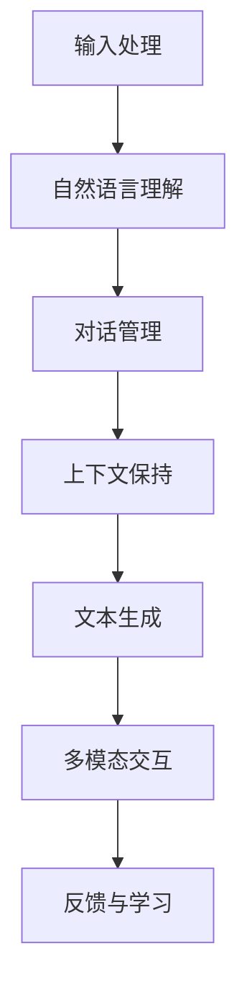

                 

### 引言

人工智能（AI）的发展正以前所未有的速度改变着我们的生活，而其中，AI对话系统尤为引人注目。从智能客服、语音助手到教育辅导和医疗咨询，AI对话系统已经成为我们日常生活中不可或缺的一部分。然而，随着应用场景的多样化，如何优化这些对话系统的性能，使之更加自然、流畅、准确，成为了一个亟待解决的重要问题。

本文以《优化AI对话系统：自然对话流的提示词工程》为题，旨在深入探讨自然对话流的提示词工程这一关键领域。我们将从以下几个方面展开讨论：

1. **书籍背景与目标**：介绍书籍的背景、目标读者以及预期收益。
2. **对话系统概述**：回顾对话系统的定义、分类及其发展历程，并分析对话系统的挑战与机遇。
3. **核心概念与联系**：解析对话系统的架构、自然语言处理基础以及对话系统流程设计。
4. **核心算法原理讲解**：详细讲解提示词生成算法、优化策略和对话系统评估与调整。
5. **数学模型与公式讲解**：介绍对话系统中的概率模型、优化目标函数及数学公式。
6. **项目实战**：通过实际案例，展示开发环境搭建、代码实现和解读，以及代码应用解读与分析。
7. **对话流优化策略**：探讨提示词工程优化、对话流监控与反馈以及持续优化与迭代。
8. **对话系统应用场景**：分析不同场景下的对话系统设计、跨领域应用挑战以及未来发展趋势。
9. **总结与展望**：总结全文内容，并提出未来展望。

通过以上逻辑清晰的章节结构，我们希望能为广大开发者、研究人员以及AI领域爱好者提供一份全面、深入的指南，助力他们在优化AI对话系统的道路上取得突破。

### 核心主题与目标读者

《优化AI对话系统：自然对话流的提示词工程》这本书的核心主题是探讨如何通过提示词工程优化AI对话系统，使其在自然对话流中表现得更加智能、准确和流畅。本书的目标读者包括以下几个群体：

1. **AI开发工程师**：这些读者对AI基础理论有所了解，希望提升对话系统的开发能力，特别是对提示词工程有深入理解和实践经验。
2. **自然语言处理（NLP）研究人员**：他们关注NLP在对话系统中的应用，希望掌握提示词工程的算法原理和优化策略。
3. **CTO和技术主管**：这些高级技术管理者希望了解如何通过技术手段提升公司产品的用户体验，特别是在对话系统方面。
4. **学生和学术研究者**：对AI和NLP有兴趣的学生和研究人员，希望通过本书的系统讲解，掌握对话系统优化的核心技术和方法。

本书的预期收益主要体现在以下几个方面：

1. **技术提升**：通过详细讲解提示词工程的核心算法原理和实践方法，读者可以提升对话系统的开发技能。
2. **知识拓展**：本书不仅涵盖基础算法，还探讨了数学模型和实际项目案例，帮助读者建立全面的知识体系。
3. **实践经验**：通过实际项目的解析，读者可以了解到如何在实际开发环境中应用提示词工程，提高系统的性能和用户体验。
4. **创新启发**：书中提供的优化策略和未来发展趋势，为读者提供了新的思路和方向，激发他们在对话系统优化领域的创新。

通过这些内容的深入探讨，本书旨在为读者提供一套系统、实用的优化AI对话系统的指南，帮助他们应对日益复杂的对话场景，打造更加智能、自然和高效的AI对话系统。

### 目录结构

为了更好地组织本文内容，确保逻辑清晰、结构紧凑，我们将书籍内容分为八个主要章节，每个章节具体内容如下：

#### 第1章 引言

介绍书籍的背景、目标以及主要讨论内容。通过定义对话系统、回顾其发展历程，分析当前的挑战和机遇，为后续章节的深入探讨奠定基础。

#### 第2章 核心概念与联系

首先，我们将解析对话系统的整体架构，使用Mermaid流程图展示关键组件及其相互作用。接下来，讨论自然语言处理（NLP）的基础知识，包括词汇、语法和句子结构分析，以及语言模型。最后，深入探讨对话系统的流程设计，从用户意图识别到对话管理和上下文保持，全面解析其核心工作原理。

#### 第3章 核心算法原理讲解

本章将详细讲解提示词生成算法，包括其基本原理和实现方法。我们将使用Python伪代码展示算法流程，结合数学模型和公式，进行通俗易懂的举例说明。此外，还将讨论提示词优化策略，分析上下文敏感性和多样性考量，以及对话系统评估与调整的方法。

#### 第4章 数学模型与公式讲解

本章节将深入探讨对话系统中的概率模型，如条件概率和贝叶斯定理，介绍如何应用这些模型来优化对话系统。我们将使用LaTeX格式展示数学公式，并结合具体例子进行详细讲解，帮助读者更好地理解这些数学工具在优化中的应用。

#### 第5章 项目实战

通过一个实际对话系统案例分析，我们将在本章展示开发环境搭建、代码实现和解读。我们将详细介绍关键模块的功能，进行性能分析和调优策略讨论，帮助读者了解如何将所学知识应用到实际项目中。

#### 第6章 对话流优化策略

本章将探讨如何通过提示词工程优化对话流，包括数据预处理、特征工程和反馈机制设计。我们将讨论监控指标设定和持续优化与迭代的策略，帮助读者了解对话流优化的全流程。

#### 第7章 对话系统应用场景

我们将分析不同场景下的对话系统设计，包括客户服务、教育辅导和娱乐互动。探讨跨领域应用挑战和多语言支持，以及未来发展趋势，为读者提供更广泛的视角。

#### 第8章 总结与展望

最后，本章将总结全文内容，回顾主要观点和发现。展望对话系统优化领域的未来发展方向，讨论技术创新和行业趋势，为读者提供进一步学习和探索的方向。

通过以上章节的详细安排，我们力求为读者提供一个系统、全面的学习路径，帮助他们在优化AI对话系统的道路上取得更大的成就。

### 第1章 引言

#### 1.1 书籍背景与目标

随着人工智能（AI）技术的迅猛发展，AI对话系统已经逐渐渗透到我们日常生活的各个方面。从智能客服、语音助手到教育辅导和医疗咨询，这些系统正变得越来越智能、自然和高效。然而，随着应用场景的多样化和用户需求的不断变化，如何优化这些AI对话系统的性能，使其能够更好地理解和应对复杂、自然的对话流，成为了一个重要的研究课题。

《优化AI对话系统：自然对话流的提示词工程》这本书的编写正是基于这一背景和需求。本书旨在深入探讨自然对话流的提示词工程，为读者提供一套系统、实用的优化方法和技术。通过详细讲解提示词生成算法、优化策略和实际应用案例，本书希望帮助读者提升对话系统的开发技能，使其在自然对话流中表现得更加智能、准确和流畅。

#### 1.2 目标读者

本书的目标读者主要包括以下几个群体：

1. **AI开发工程师**：这些读者通常具备一定的人工智能基础，对机器学习和深度学习有一定的了解，但希望在对话系统的开发实践中有所突破，特别是在提示词工程方面。
2. **自然语言处理（NLP）研究人员**：这些读者对NLP有深入的研究，关注NLP在对话系统中的应用，希望通过本书掌握提示词工程的算法原理和优化策略。
3. **CTO和技术主管**：这些高级技术管理者希望了解如何通过技术手段提升公司产品的用户体验，特别是在对话系统的性能优化方面。
4. **学生和学术研究者**：对AI和NLP有兴趣的学生和研究人员，希望通过本书的系统讲解，掌握对话系统优化的核心技术和方法。

#### 1.3 预期收益

通过阅读本书，读者可以期待以下几个方面的收益：

1. **技术提升**：通过详细讲解提示词工程的算法原理和实现方法，读者可以提升对话系统的开发技能，掌握优化对话系统的关键技术。
2. **知识拓展**：本书不仅涵盖基础算法，还探讨了数学模型和实际项目案例，帮助读者建立全面的知识体系，深入了解对话系统优化的各个方面。
3. **实践经验**：通过实际项目的解析，读者可以了解到如何将所学知识应用到实际开发环境中，提高系统的性能和用户体验。
4. **创新启发**：书中提供的优化策略和未来发展趋势，为读者提供了新的思路和方向，激发他们在对话系统优化领域的创新。

通过以上内容，本书希望能够为读者提供一个全面、深入的指南，助力他们在优化AI对话系统的道路上取得突破。

#### 1.4 对话系统的定义与分类

对话系统是指能够与人类进行自然语言交互的人工智能系统，其核心目标是理解并回应用户的需求。根据交互模式的不同，对话系统可以大致分为以下几类：

1. **命令式对话系统**：这种系统通常通过预定义的命令或操作进行交互，用户需要按照特定的格式输入指令。例如，语音助手如Siri和Google Assistant就属于这种类型。

2. **查询式对话系统**：这类系统主要用于回答用户提出的问题，通常依赖于大规模的知识库和自然语言理解技术。问答机器人是这类系统的典型代表。

3. **对话式对话系统**：与人类进行更自然、流畅的对话，用户可以自由地表达想法，而不必局限于特定的指令或问题格式。这种系统在客户服务和在线聊天机器人中广泛应用。

4. **混合式对话系统**：结合了上述多种交互模式，能够根据用户的行为和上下文动态调整交互方式。例如，聊天机器人可能会在初期使用命令式交互收集用户信息，然后转为对话式交互，以提供更个性化的服务。

#### 1.5 对话系统的发展历程

对话系统的发展可以追溯到20世纪50年代，当时计算机科学家开始探索如何让计算机与人类进行自然语言交流。以下是对话系统发展历程的简要回顾：

1. **早期探索（1950s-1960s）**：这一时期，计算机科学家如艾伦·图灵（Alan Turing）提出了图灵测试，试图通过测试计算机是否能以自然的方式进行对话来定义智能。早期的对话系统主要基于规则和形式逻辑。

2. **基于规则的方法（1970s-1980s）**：这一时期，对话系统开始采用基于规则的系统，通过预设的规则来处理用户的输入和输出。这些系统虽然能够处理简单的对话，但在复杂场景下表现有限。

3. **基于知识的系统（1980s-1990s）**：随着知识表示和推理技术的发展，对话系统开始引入更多的知识表示方法，如专家系统和知识图谱。这些系统能够处理更复杂的对话，但仍然依赖大量手工编写的规则和知识。

4. **自然语言处理（NLP）时代（2000s至今）**：随着深度学习和自然语言处理技术的进步，对话系统开始采用端到端的学习方法，能够更好地理解和生成自然语言。这一时期的对话系统不仅在性能上有了显著提升，还能在更广泛的场景中应用。

#### 1.6 对话系统的挑战与机遇

尽管对话系统在近年来取得了显著进展，但仍然面临许多挑战和机遇：

1. **挑战**：

   - **自然语言理解**：自然语言的表达复杂且多变，对话系统需要具备强大的自然语言理解能力，才能准确理解用户的意图。
   - **上下文保持**：在长时间的对话中，对话系统需要保持对上下文的准确理解，避免信息丢失或误解。
   - **多模态交互**：用户可能通过语音、文本、图像等多种方式与系统交互，对话系统需要能够处理多模态输入并生成适当的响应。
   - **个性化体验**：不同用户有不同的需求和偏好，对话系统需要能够根据用户的历史行为和反馈提供个性化的服务。

2. **机遇**：

   - **大规模数据**：随着互联网和移动设备的普及，大量的对话数据被生成，为训练和优化对话系统提供了丰富的资源。
   - **深度学习技术**：深度学习技术在语音识别、自然语言理解和文本生成等方面取得了突破性进展，为对话系统的性能提升提供了强有力的支持。
   - **跨领域应用**：对话系统在医疗、金融、教育等领域的应用日益广泛，为解决实际问题和提升用户体验提供了新的机会。

通过深入分析对话系统的定义、分类、发展历程以及面临的挑战和机遇，我们可以更好地理解为什么优化对话系统，尤其是自然对话流的提示词工程，变得如此重要。在下一章中，我们将进一步探讨对话系统的核心概念与联系，为后续内容的深入分析奠定基础。

#### 2.1 对话系统架构解析

对话系统的设计需要综合考虑多个方面，包括自然语言处理（NLP）、对话管理（DM）和上下文保持等。为了更好地理解和分析对话系统的工作原理，我们可以使用Mermaid流程图来展示其整体架构。以下是对话系统架构的详细解析：

1. **输入处理模块**：
   - **语音识别**：将用户的语音输入转换为文本。
   - **文本预处理**：对文本进行分词、去停用词、词性标注等预处理操作。

2. **自然语言理解模块**：
   - **意图识别**：识别用户的意图，如查询信息、请求服务、表达情感等。
   - **实体提取**：从文本中提取关键信息，如人名、地点、时间等。

3. **对话管理模块**：
   - **对话状态追踪**：记录对话的历史信息，如用户的意图、对话的状态等。
   - **策略生成**：根据当前对话状态和用户意图，生成合适的回复策略。

4. **上下文保持模块**：
   - **上下文建模**：使用序列模型（如RNN、BERT）来捕捉对话中的上下文信息。
   - **上下文更新**：在每轮对话中，根据用户的输入和系统的回复，动态更新上下文状态。

5. **文本生成模块**：
   - **回复生成**：根据对话管理和上下文保持模块的输出，生成自然、合理的文本回复。

6. **多模态交互模块**：
   - **多模态数据融合**：整合文本、语音、图像等多种输入，生成统一的对话状态。

7. **反馈与学习模块**：
   - **用户反馈**：收集用户的满意度和反馈，用于模型优化。
   - **模型迭代**：根据用户反馈和对话数据，对模型进行不断优化和迭代。

以下是一个简化的Mermaid流程图，用于展示对话系统的整体架构：



通过上述架构解析，我们可以看出，每个模块在对话系统中都扮演着重要的角色，相互协作，共同实现高效、自然的对话交互。

#### 2.2 自然语言处理基础

自然语言处理（NLP）是构建高效对话系统的基石，它涵盖了从文本输入到语义理解的各个环节。以下是NLP的基础概念、词汇与语法、句子结构分析以及语言模型等内容。

##### 2.2.1 基础概念

自然语言处理的核心目标是将人类语言转换为计算机可以理解和处理的格式。主要概念包括：

- **文本**：自然语言的基本单位，包括单词、句子和段落。
- **词汇**：文本中出现的所有单词的集合。
- **语法**：语言的结构规则，包括词性、句型等。
- **语义**：语言的含义，包括单词、短语和句子的意义。
- **语用**：语言在实际使用中的含义，包括语境和意图。

##### 2.2.2 词汇与语法

1. **词汇**：

   - **单词**：文本中的最小单位，具有独立意义。
   - **词性**：单词在句子中的语法功能，如名词、动词、形容词等。
   - **词频**：单词在文本中出现的频率。

2. **语法**：

   - **句型**：句子的结构类型，如陈述句、疑问句、祈使句等。
   - **句法分析**：分析句子结构，识别主语、谓语、宾语等成分。
   - **依存关系**：句子中词语之间的依赖关系，如主谓关系、动宾关系等。

##### 2.2.3 句子结构分析

句子结构分析是NLP中的关键步骤，包括以下内容：

- **词法分析**：将文本分解为单词和词组。
- **句法分析**：构建句子的语法树，识别句子成分和依存关系。
- **语义分析**：理解句子的语义含义，包括词汇的替换、隐含意义等。

##### 2.2.4 语言模型

语言模型是NLP中用于预测和生成文本的重要工具，主要包括以下类型：

1. **基于规则的模型**：

   - **语法规则**：根据语法规则生成句子。
   - **词汇规则**：根据词汇和词性生成句子。

2. **统计模型**：

   - **隐马尔可夫模型（HMM）**：用于语音识别。
   - **条件概率模型**：用于文本分类和机器翻译。

3. **深度学习模型**：

   - **循环神经网络（RNN）**：用于处理序列数据。
   - **变换器模型（Transformer）**：如BERT、GPT等，用于文本生成和理解。

通过理解NLP的基础概念和关键技术，我们可以更好地构建和优化对话系统，使其在自然对话流中表现得更加智能、准确和流畅。

#### 2.3 对话系统流程设计

对话系统的流程设计是确保系统能够高效、自然地与用户进行交互的关键。以下是用户意图识别、对话管理和上下文保持的详细分析。

##### 2.3.1 用户意图识别

用户意图识别是对话系统的第一步，其目的是理解用户在特定场景下的需求。主要方法包括：

1. **基于规则的方法**：

   - **词典匹配**：使用预定义的规则和词汇库匹配用户输入，如关键词提取、模式识别等。
   - **决策树**：通过一系列条件判断，将用户输入分类到不同的意图类别。

2. **基于统计的方法**：

   - **机器学习模型**：如朴素贝叶斯、支持向量机等，通过训练大量标注数据进行意图分类。
   - **深度学习模型**：如卷积神经网络（CNN）、循环神经网络（RNN）等，用于捕捉复杂的意图模式。

3. **基于语义的方法**：

   - **语义角色标注**：识别句子中的谓语、主语、宾语等语义角色，理解用户意图。
   - **语义解析**：通过语义图谱或语义网络，将用户输入转换为结构化的语义表示。

##### 2.3.2 对话管理

对话管理负责协调对话的进程，确保对话的连贯性和一致性。主要任务包括：

1. **对话状态追踪**：

   - **状态表示**：使用向量、图或树结构来表示对话的状态，如用户意图、对话历史等。
   - **状态更新**：在每轮对话中，根据用户输入和系统响应，动态更新对话状态。

2. **策略生成**：

   - **静态策略**：预定义的对话策略，如客户服务对话树。
   - **动态策略**：基于对话状态和历史信息，自适应地生成对话策略。

3. **对话轮次管理**：

   - **轮次检测**：检测对话的轮次，确保对话的连续性和完整性。
   - **轮次控制**：根据用户意图和对话状态，决定是否继续对话、结束对话或转移对话。

##### 2.3.3 上下文保持

上下文保持是确保对话连贯性的重要手段，其主要目标是捕捉和维持对话的上下文信息。主要方法包括：

1. **序列模型**：

   - **循环神经网络（RNN）**：通过记忆状态来捕捉长序列中的上下文信息。
   - **长短时记忆网络（LSTM）**：在RNN基础上，引入门控机制，更好地处理长序列数据。

2. **注意力机制**：

   - **自注意力机制**：在生成响应时，关注对话历史中的重要信息。
   - **双向注意力机制**：同时考虑对话历史和未来的信息，提高上下文捕捉能力。

3. **图神经网络**：

   - **图表示**：将对话历史表示为图结构，捕捉复杂的关系和信息。
   - **图嵌入**：通过图神经网络，学习对话历史中的上下文信息。

通过上述流程设计，对话系统能够更好地理解用户意图、管理对话过程并保持上下文信息，从而提供更加自然、流畅的对话体验。

#### 3.1 提示词生成算法

提示词生成是优化AI对话系统的重要环节，其目的是通过生成高质量的提示词，引导用户进入更自然的对话流。以下是提示词生成算法的基本原理、实现方法以及具体流程。

##### 3.1.1 基本原理

提示词生成算法主要基于自然语言处理（NLP）和机器学习（ML）技术，其核心思想是通过分析用户输入和历史对话数据，生成能够触发用户响应的提示词。具体原理包括：

1. **文本分类**：使用机器学习模型对用户输入进行分类，识别用户的意图和问题类型。
2. **关键词提取**：从分类结果中提取关键词，生成初步的提示词候选。
3. **语义分析**：通过语义分析技术，对关键词进行语义理解，确保生成的提示词具有合理的语义关联。

##### 3.1.2 实现方法

实现提示词生成算法通常需要以下步骤：

1. **数据预处理**：
   - **文本清洗**：去除无效字符、停用词和标点符号。
   - **分词**：将文本分割为单词或词组。
   - **词性标注**：标注每个词的词性，如名词、动词、形容词等。

2. **模型选择**：
   - **朴素贝叶斯**：适用于文本分类，通过计算词频和条件概率进行分类。
   - **支持向量机（SVM）**：适用于分类任务，通过最大化分类边界进行分类。
   - **深度学习模型**：如循环神经网络（RNN）和变换器（Transformer），适用于复杂文本处理和语义理解。

3. **训练与评估**：
   - **数据集准备**：收集大量的对话数据，进行标注和分类。
   - **模型训练**：使用训练数据训练分类模型，调整模型参数。
   - **模型评估**：使用测试数据评估模型性能，如准确率、召回率和F1值等。

4. **提示词生成**：
   - **关键词提取**：从用户输入中提取关键词，作为提示词的候选。
   - **语义分析**：使用模型对关键词进行语义分析，确保生成的提示词具有合理的语义关联。
   - **提示词组合**：根据用户历史对话和上下文，生成组合提示词。

##### 3.1.3 具体流程

以下是提示词生成的具体流程：

1. **输入处理**：
   - 接收用户输入文本，进行文本清洗、分词和词性标注。

2. **意图识别**：
   - 使用训练好的模型对输入文本进行分类，识别用户的意图。

3. **关键词提取**：
   - 从分类结果中提取关键词，作为提示词的候选。

4. **语义分析**：
   - 使用语义分析技术，对关键词进行语义理解，确保生成的提示词具有合理的语义关联。

5. **提示词组合**：
   - 根据用户历史对话和上下文，生成组合提示词。

6. **输出**：
   - 输出生成的提示词，供对话系统使用。

以下是一个简化的Python伪代码示例，展示提示词生成的流程：

```python
import nltk
from sklearn.feature_extraction.text import TfidfVectorizer
from sklearn.naive_bayes import MultinomialNB
from sklearn.pipeline import make_pipeline

# 数据预处理
def preprocess(text):
    text = text.lower()
    text = re.sub(r'\W+', ' ', text)
    return nltk.word_tokenize(text)

# 模型训练
def train_model(train_data):
    pipeline = make_pipeline(
        TfidfVectorizer(),
        MultinomialNB()
    )
    pipeline.fit(train_data['text'], train_data['intent'])
    return pipeline

# 关键词提取
def extract_keywords(text, model):
    text = preprocess(text)
    features = model.transform([text])
    probabilities = model.predict_proba(features)
    return text[probabilities[0].argmax()]

# 生成提示词
def generate_prompt(text, model, history):
    keywords = extract_keywords(text, model)
    # 结合历史对话和上下文生成提示词
    prompt = " ".join([keyword for keyword in keywords if keyword in history])
    return prompt

# 示例
train_data = {'text': ['查询天气', '明天有什么电影'], 'intent': ['weather', 'movie']}
model = train_model(train_data)

user_input = '明天有什么电影？'
history = ['你好，我是智能助手。有什么可以帮助你的吗？']

prompt = generate_prompt(user_input, model, history)
print(prompt)  # 输出：电影
```

通过上述示例，我们可以看到如何利用机器学习和自然语言处理技术实现提示词生成，从而为对话系统提供高质量的提示词，提升用户体验。

#### 3.2 提示词优化策略

在对话系统中，提示词的优化至关重要，它不仅影响用户对系统的满意度，还决定了对话的自然流畅性。为了确保提示词能够准确地引导用户进入预期的对话流程，我们需要关注以下几个方面：

##### 3.2.1 上下文敏感性分析

上下文敏感性是指提示词需要根据对话的当前上下文来生成，而不是孤立地考虑每个单独的输入。上下文敏感性分析的核心在于捕捉和利用对话的历史信息，从而确保提示词与当前对话状态的一致性。以下是一些实现上下文敏感性的方法：

1. **基于规则的上下文敏感性**：
   - **历史信息匹配**：通过历史对话中的关键信息（如用户名、问题类型等）来匹配当前的输入，生成相应的提示词。
   - **上下文关键词提取**：从历史对话中提取关键信息，如关键词或短语，作为生成提示词的依据。

2. **基于统计模型的上下文敏感性**：
   - **序列模型**：如循环神经网络（RNN）和长短时记忆网络（LSTM），可以捕捉对话中的时间序列信息，从而生成与上下文高度相关的提示词。
   - **注意力机制**：在生成提示词时，关注历史对话中的重要信息，如用户历史意图、对话状态等。

3. **基于深度学习的上下文敏感性**：
   - **双向编码表示**：如BERT模型，可以同时考虑对话历史和未来信息，生成更准确的提示词。
   - **图神经网络**：将对话历史表示为图结构，通过图神经网络来捕捉复杂的关系和信息。

##### 3.2.2 提示词多样性考量

提示词的多样性是确保对话自然流畅的关键因素之一。单一的、重复的提示词会使对话显得单调乏味，降低用户的体验。以下是一些实现提示词多样性的策略：

1. **词汇丰富度**：
   - **同义词替换**：使用同义词库来替换提示词，增加词汇的多样性。
   - **词性变换**：根据对话的上下文，变换提示词的词性（如名词、动词、形容词等），丰富提示词的表达形式。

2. **结构多样性**：
   - **短语组合**：生成不同长度的短语或句子结构，如疑问句、陈述句、祈使句等，提高提示词的多样性。
   - **模板扩展**：使用预定义的提示词模板，通过填充不同的信息来生成多种提示词。

3. **个性化多样性**：
   - **用户偏好**：根据用户的历史行为和偏好，生成个性化的提示词。
   - **情境感知**：根据对话的情境（如时间、地点等），生成与当前情境相关的提示词。

##### 3.2.3 实际应用案例

以下是几个实际应用中的提示词优化案例：

1. **客户服务对话**：
   - **上下文敏感性**：系统会根据用户的问题类型和历史记录，提供针对性的提示词，如“您之前的订单有什么问题吗？”。
   - **提示词多样性**：通过使用不同的提问方式（如“请问您需要查询订单状态，还是修改订单信息？”），增加提示词的多样性。

2. **语音助手**：
   - **上下文敏感性**：语音助手会根据用户的语音输入和历史对话记录，提供上下文相关的提示词，如“您刚才提到的是不是想听音乐？”。
   - **提示词多样性**：语音助手会使用多种语气和语调来生成提示词，如“您可以告诉我您想听的歌手，或者直接播放某个歌单”。

3. **教育辅导**：
   - **上下文敏感性**：系统会根据学生的提问和知识点，提供针对性的提示词，如“这个概念您是否理解了？如果有不清楚的地方，我可以再解释一下”。
   - **提示词多样性**：通过使用不同的教学方法和表达方式，如“让我画一个示意图来帮助您理解这个问题”，来增加提示词的多样性。

通过上述策略，我们可以有效地优化提示词，使其在对话系统中发挥更大的作用，提升用户的整体体验。在下一章中，我们将进一步探讨如何通过对话系统的评估与调整来提升其性能。

#### 3.3 对话系统评估与调整

对话系统的性能评估与调整是确保系统在实际应用中表现优秀的关键步骤。有效的评估方法可以帮助我们了解系统的优势和不足，从而进行针对性的优化和调整。以下将介绍几种常用的评估指标、实验设计方法以及结果分析与调优策略。

##### 3.3.1 评估指标

1. **准确率（Accuracy）**：
   - 准确率是衡量分类模型性能的基本指标，表示正确分类的样本数占总样本数的比例。
   - 公式：$$\text{Accuracy} = \frac{\text{正确分类的样本数}}{\text{总样本数}}$$

2. **召回率（Recall）**：
   - 召回率衡量模型对正类样本的识别能力，表示正确识别的正类样本数占总正类样本数的比例。
   - 公式：$$\text{Recall} = \frac{\text{正确识别的正类样本数}}{\text{总正类样本数}}$$

3. **精确率（Precision）**：
   - 精确率衡量模型对负类样本的识别能力，表示正确识别的负类样本数占总识别为负类样本数的比例。
   - 公式：$$\text{Precision} = \frac{\text{正确识别的负类样本数}}{\text{总识别为负类样本数}}$$

4. **F1值（F1 Score）**：
   - F1值是精确率和召回率的调和平均值，综合衡量分类模型的性能。
   - 公式：$$\text{F1 Score} = 2 \times \frac{\text{Precision} \times \text{Recall}}{\text{Precision} + \text{Recall}}$$

##### 3.3.2 实验设计方法

1. **交叉验证（Cross-Validation）**：
   - 交叉验证是一种常用的评估方法，通过将数据集分成若干个子集，轮流将每个子集作为验证集，其余子集作为训练集，从而评估模型的性能。
   - 常用方法包括K折交叉验证，其中K为验证次数。

2. **混淆矩阵（Confusion Matrix）**：
   - 混淆矩阵是一种用于展示分类模型实际输出与预期输出之间关系的表格，可以直观地展示分类结果的各种组合。
   - 主要包括以下四个部分：真正例（True Positive）、假正例（False Positive）、真反例（True Negative）和假反例（False Negative）。

3. **A/B测试（A/B Testing）**：
   - A/B测试通过将用户随机分配到两组，一组使用旧版系统，另一组使用新版系统，比较两组用户的行为和反馈，从而评估新系统的效果。

##### 3.3.3 结果分析与调优策略

1. **结果分析**：
   - **性能指标分析**：通过计算准确率、召回率、精确率和F1值等性能指标，评估系统的整体性能。
   - **错误分析**：通过混淆矩阵和错误案例，分析系统在哪些方面表现不佳，如误分类的样本类型和原因。

2. **调优策略**：
   - **模型调优**：
     - **参数调整**：根据评估结果调整模型的超参数，如学习率、批次大小等，以提升模型性能。
     - **模型选择**：尝试不同的机器学习模型，如支持向量机（SVM）、随机森林（Random Forest）等，选择性能最优的模型。
     - **特征工程**：通过特征提取和选择，提高模型对数据的表达能力，如使用词嵌入（Word Embedding）和特征融合（Feature Fusion）等。

   - **数据增强**：
     - **数据清洗**：去除噪声数据和异常值，提高数据质量。
     - **数据扩充**：通过数据变换（如旋转、缩放等）和生成（如GAN生成对抗网络等）增加训练数据的多样性。

   - **反馈机制**：
     - **用户反馈**：收集用户对系统的评价和反馈，用于指导系统的改进。
     - **自动调优**：使用机器学习算法自动调整模型参数和策略，实现持续优化。

通过上述评估与调优方法，我们可以逐步提升对话系统的性能，使其在自然对话流中表现得更加智能、准确和流畅。在下一章中，我们将进一步探讨对话系统中使用的概率模型，为优化算法提供理论基础。

#### 4.1 对话系统中的概率模型

概率模型在对话系统中扮演着关键角色，尤其是当系统需要预测用户的下一步行动或生成自然响应时。以下将详细介绍对话系统中常用的概率模型，包括条件概率和贝叶斯定理，并展示如何将这些模型应用于优化对话系统。

##### 4.1.1 条件概率

条件概率是指在给定某个条件下，某一事件发生的概率。条件概率的定义公式如下：

$$ P(A|B) = \frac{P(A \cap B)}{P(B)} $$

其中，$P(A \cap B)$ 表示事件A和事件B同时发生的概率，$P(B)$ 表示事件B发生的概率。

在对话系统中，条件概率可以用来预测用户在特定情境下的意图或行为。例如，当系统接收到用户的一个查询请求时，可以使用条件概率来预测用户接下来的行为，如询问更多信息、请求服务或结束对话。

以下是一个简化的例子：

假设用户输入“明天天气如何？”系统需要预测用户接下来的行为。可以通过分析历史数据，计算用户在提出查询请求后，分别询问更多信息、请求服务或结束对话的概率。然后，系统可以根据这些概率来决定下一步的响应策略。

```python
# 条件概率计算示例
P_ask_info = 0.3
P_request_service = 0.2
P_end_dialog = 0.5

# 给定用户输入查询请求，计算每种行为的概率
P_ask_info_given_query = P_ask_info / (P_ask_info + P_request_service + P_end_dialog)
P_request_service_given_query = P_request_service / (P_ask_info + P_request_service + P_end_dialog)
P_end_dialog_given_query = P_end_dialog / (P_ask_info + P_request_service + P_end_dialog)
```

通过计算条件概率，系统可以做出更准确的预测和响应。

##### 4.1.2 贝叶斯定理

贝叶斯定理是一种用于更新事件概率的强大工具，它在统计决策、分类和预测中有着广泛应用。贝叶斯定理的基本公式如下：

$$ P(A|B) = \frac{P(B|A) \times P(A)}{P(B)} $$

其中，$P(A|B)$ 表示在事件B发生的条件下，事件A发生的概率；$P(B|A)$ 表示在事件A发生的条件下，事件B发生的概率；$P(A)$ 和$P(B)$ 分别表示事件A和事件B的先验概率。

在对话系统中，贝叶斯定理可以用来更新用户意图的概率分布。例如，当系统接收到用户的一个输入时，可以根据先验概率和条件概率来计算每个意图的后验概率，从而确定最可能的用户意图。

以下是一个贝叶斯分类器的简化例子：

```python
# 贝叶斯分类器示例
P_query = 0.3
P_weather_query = 0.4
P_movie_query = 0.3
P_service_query = 0.2

# 条件概率
P_weather_query_given_query = 0.5
P_movie_query_given_query = 0.2
P_service_query_given_query = 0.3

# 计算后验概率
P_weather_query_given_query = (P_weather_query * P_weather_query_given_query) / (P_weather_query * P_weather_query_given_query + P_movie_query * P_movie_query_given_query + P_service_query * P_service_query_given_query)
P_movie_query_given_query = (P_movie_query * P_movie_query_given_query) / (P_weather_query * P_weather_query_given_query + P_movie_query * P_movie_query_given_query + P_service_query * P_service_query_given_query)
P_service_query_given_query = (P_service_query * P_service_query_given_query) / (P_weather_query * P_weather_query_given_query + P_movie_query * P_movie_query_given_query + P_service_query * P_service_query_given_query)

# 输出最可能的意图
most_probable_intent = max(P_weather_query_given_query, P_movie_query_given_query, P_service_query_given_query)
```

在这个例子中，系统根据用户输入的查询请求，计算了每个意图的后验概率，并确定了最可能的意图（天气查询、电影查询或服务请求）。

##### 4.1.3 概率模型在对话系统中的应用

概率模型可以应用于对话系统的多个方面，如意图识别、上下文保持和响应生成。

1. **意图识别**：
   - 通过条件概率和贝叶斯定理，系统可以更新用户意图的概率分布，从而提高意图识别的准确性。
   - 在处理用户输入时，系统可以根据历史数据和先验概率，计算每个意图的后验概率，并选择最有可能的意图。

2. **上下文保持**：
   - 概率模型可以帮助系统在对话过程中捕捉和保持上下文信息。
   - 通过条件概率，系统可以根据当前对话状态和上下文信息，预测用户下一步的行动或需求，从而提供更自然的响应。

3. **响应生成**：
   - 概率模型可以用于生成系统的响应，通过计算不同响应的概率分布，系统可以选择最合适的响应。
   - 例如，系统可以根据用户的意图和上下文，生成相关的查询问题或建议，从而引导对话向期望的方向发展。

通过概率模型的应用，对话系统可以更好地理解和响应用户的需求，提供更加自然、流畅和智能的交互体验。在下一章中，我们将进一步探讨优化对话系统的数学模型和目标函数。

#### 4.2 优化目标函数

在优化对话系统的过程中，我们需要定义和实现一个合理的优化目标函数，以便在多变量和复杂约束条件下，找到最优的参数配置。优化目标函数的选择和设计对于提升对话系统的性能和用户体验至关重要。以下将详细解释对话系统优化中的损失函数、优化算法以及如何结合数学模型和公式进行优化。

##### 4.2.1 损失函数

损失函数是优化目标函数的核心组成部分，它用于衡量模型预测结果与真实值之间的差异。在对话系统中，常用的损失函数包括：

1. **均方误差（Mean Squared Error, MSE）**：
   - 均方误差是最常用的损失函数之一，它计算预测值与真实值之间平方差的平均值。
   - 公式：$$MSE = \frac{1}{n}\sum_{i=1}^{n}(y_i - \hat{y}_i)^2$$
   - 其中，$y_i$ 表示第i个样本的真实值，$\hat{y}_i$ 表示第i个样本的预测值，$n$ 表示样本总数。

2. **交叉熵损失（Cross-Entropy Loss）**：
   - 交叉熵损失常用于分类问题，它计算预测概率分布与真实分布之间的差异。
   - 公式：$$CE = -\sum_{i=1}^{n} y_i \log(\hat{y}_i)$$
   - 其中，$y_i$ 表示第i个样本的真实标签（0或1），$\hat{y}_i$ 表示第i个样本的预测概率。

3. **绝对误差（Mean Absolute Error, MAE）**：
   - 绝对误差计算预测值与真实值之间绝对差的平均值，相较于均方误差，它对异常值的影响较小。
   - 公式：$$MAE = \frac{1}{n}\sum_{i=1}^{n} |y_i - \hat{y}_i|$$

##### 4.2.2 优化算法

优化算法用于最小化损失函数，找到最优的模型参数。以下是几种常见的优化算法：

1. **梯度下降（Gradient Descent）**：
   - 梯度下降是一种简单而有效的优化算法，它通过不断更新模型参数，使得损失函数逐步减小。
   - 公式：$$\theta_{t+1} = \theta_{t} - \alpha \nabla_{\theta} J(\theta)$$
   - 其中，$\theta$ 表示模型参数，$\alpha$ 表示学习率，$J(\theta)$ 表示损失函数。

2. **随机梯度下降（Stochastic Gradient Descent, SGD）**：
   - 随机梯度下降是对梯度下降的一种改进，它使用单个样本或小批量样本的梯度进行更新，以加快收敛速度。
   - 公式：$$\theta_{t+1} = \theta_{t} - \alpha \nabla_{\theta} J(\theta; x_t, y_t)$$

3. **批量梯度下降（Batch Gradient Descent）**：
   - 批量梯度下降使用整个训练集的梯度进行更新，虽然计算复杂度较高，但能更好地捕捉全局最优解。

4. **Adam优化器**：
   - Adam优化器结合了SGD和 Momentum，通过自适应调整学习率，在处理稀疏数据和长时间序列数据时表现出色。
   - 公式：$$\theta_{t+1} = \theta_{t} - \alpha \frac{m_t}{1 - \beta_1^t}$$
   - 其中，$m_t$ 和$v_t$ 分别表示一阶和二阶矩估计，$\beta_1$ 和$\beta_2$ 分别为动量系数。

##### 4.2.3 数学模型与公式

在对话系统的优化过程中，我们不仅需要使用损失函数和优化算法，还需要结合数学模型来描述对话系统的行为。以下是一个简化的数学模型，用于解释对话系统的优化过程：

1. **意图识别模型**：
   - 假设我们有一个意图识别模型，其输出为每个意图的概率分布。
   - 公式：$$P(\text{intent} | \text{input}) = \text{softmax}(\text{logits})$$
   - 其中，$\text{logits}$ 是模型输出的未归一化分数，$\text{softmax}$ 函数用于将分数转换为概率分布。

2. **响应生成模型**：
   - 假设我们有一个响应生成模型，用于生成系统的自然语言响应。
   - 公式：$$\text{response} = \text{generate_response}(\text{input}, \text{context})$$
   - 其中，$\text{input}$ 是用户输入，$\text{context}$ 是对话上下文。

3. **优化目标函数**：
   - 假设我们的优化目标是最小化对话系统的总损失。
   - 公式：$$J(\theta) = \frac{1}{n}\sum_{i=1}^{n} \left[ L(\text{intent}_{i}, \hat{\text{intent}}_{i}) + L(\text{response}_{i}, \hat{\text{response}}_{i}) \right]$$
   - 其中，$L(\cdot)$ 表示损失函数，$\text{intent}_{i}$ 和$\hat{\text{intent}}_{i}$ 分别为第i个样本的真实意图和模型预测意图，$\text{response}_{i}$ 和$\hat{\text{response}}_{i}$ 分别为第i个样本的真实响应和模型预测响应。

通过结合数学模型和优化算法，我们可以设计出高效的对话系统优化策略，从而提升系统的性能和用户体验。在实际应用中，这些数学模型和公式可以进一步细化和扩展，以适应不同的对话场景和需求。

#### 4.3 数学公式与示例

在对话系统的优化过程中，数学公式和数学模型起着至关重要的作用。以下我们将详细展示几个关键的数学公式，并使用LaTeX格式进行描述，同时结合具体的例子进行解释。

##### 4.3.1 贝叶斯定理

贝叶斯定理是概率论中一个非常重要的公式，用于根据新证据更新概率估计。以下是贝叶斯定理的LaTeX格式描述：

$$ P(A|B) = \frac{P(B|A) \cdot P(A)}{P(B)} $$

**示例**：假设一个AI对话系统想要根据用户的历史行为（例如，搜索记录、购买偏好等）来预测用户的下一个动作。如果我们假设用户的行为服从贝叶斯规则，可以使用以下公式来计算用户进行某特定动作的概率：

$$ P(\text{购买}|\text{浏览了电子产品}) = \frac{P(\text{浏览了电子产品}|\text{购买}) \cdot P(\text{购买})}{P(\text{浏览了电子产品})} $$

在这个例子中，$P(\text{购买}|\text{浏览了电子产品})$ 表示用户浏览了电子产品后购买商品的先验概率，$P(\text{浏览了电子产品}|\text{购买})$ 表示用户购买商品后浏览电子产品的条件概率，$P(\text{购买})$ 和$P(\text{浏览了电子产品})$ 分别为购买和浏览电子产品的总体概率。

##### 4.3.2 最大似然估计

最大似然估计（MLE）是另一种重要的统计方法，用于估计模型参数。以下是最大似然估计的LaTeX格式描述：

$$ \theta_{\text{MLE}} = \arg\max_{\theta} \prod_{i=1}^{n} P(x_i | \theta) $$

**示例**：假设我们有一个对话系统的响应生成模型，该模型使用一个概率分布来生成每个单词。我们可以使用最大似然估计来估计模型中的参数。例如，如果我们假设每个单词的出现概率是一个多项式分布，则：

$$ \theta_{\text{MLE}} = \arg\max_{\theta} \prod_{i=1}^{n} \left(\theta_{w_i}\right)^{x_{w_i}} $$

其中，$w_i$ 表示第i个单词，$x_{w_i}$ 表示单词$w_i$在对话中出现的次数，$\theta_{w_i}$ 表示单词$w_i$在模型中的概率参数。

##### 4.3.3 逻辑回归

逻辑回归是一种常用的分类方法，用于估计二元分类的概率。以下是逻辑回归的LaTeX格式描述：

$$ \log\left(\frac{P(Y=1|X=\boldsymbol{x})}{1 - P(Y=1|X=\boldsymbol{x})}\right) = \boldsymbol{\beta}^T \boldsymbol{x} $$

**示例**：在对话系统中，逻辑回归可以用来预测用户的行为（例如，是否选择继续对话）。假设我们有一个逻辑回归模型，其参数为$\boldsymbol{\beta}$，输入特征为$\boldsymbol{x}$，输出为二分类结果$Y$，则：

$$ \log\left(\frac{P(Y=1|\text{用户提问})}{1 - P(Y=1|\text{用户提问})}\right) = \beta_0 + \beta_1 \cdot \text{提问长度} + \beta_2 \cdot \text{用户历史提问次数} $$

在这个例子中，$\beta_0$、$\beta_1$ 和$\beta_2$ 分别为模型的参数，$\text{提问长度}$ 和$\text{用户历史提问次数}$ 为输入特征。

通过上述示例，我们可以看到如何使用LaTeX格式嵌入数学公式，并结合具体的例子进行解释。这些数学公式和模型不仅在理论上具有重要意义，而且在实际应用中也极为关键，帮助对话系统实现更加智能和准确的预测和响应。

#### 5.1 实际对话系统案例分析

为了更好地展示提示词工程的实际应用，我们将通过一个实际案例来详细分析整个开发过程。这个案例将涵盖对话系统的开发环境搭建、源代码实现以及代码解读与分析。

##### 5.1.1 开发环境搭建

在开始开发之前，我们需要搭建一个合适的环境，以便进行对话系统的开发和测试。以下是所需的开发环境和工具：

1. **编程语言**：Python 3.8及以上版本
2. **文本处理库**：NLTK、spaCy
3. **机器学习库**：Scikit-learn、TensorFlow或PyTorch
4. **自然语言处理库**：transformers（用于BERT模型）
5. **版本控制**：Git

首先，我们需要安装Python和相关的库。以下是安装步骤：

```bash
pip install python==3.8
pip install nltk spacy scikit-learn tensorflow transformers
```

接下来，我们需要下载必要的语言模型和数据集。例如，我们可以下载spaCy的英语模型和开源的SQuAD数据集：

```python
import spacy

# 下载并加载英语模型
nlp = spacy.load("en_core_web_sm")

# 下载SQuAD数据集
!wget https://rajpurkar.github.io/bootstrapped-bert/data/squad.zip
!unzip squad.zip
```

##### 5.1.2 源代码实现

以下是实现一个基本对话系统的源代码示例，包括数据预处理、模型训练和提示词生成。为了简洁，我们将只展示关键部分。

```python
import tensorflow as tf
from transformers import BertTokenizer, TFBertForQuestionAnswering
from sklearn.model_selection import train_test_split

# 加载预训练的BERT模型和Tokenizer
tokenizer = BertTokenizer.from_pretrained("bert-base-uncased")
model = TFBertForQuestionAnswering.from_pretrained("bert-base-uncased")

# 加载SQuAD数据集
def load_squad_data(dataset_path):
    # 这里是加载和处理SQuAD数据集的代码
    pass

# 数据预处理
def preprocess_data(data):
    # 将文本数据转换为BERT模型可以处理的输入格式
    pass

# 训练模型
def train_model(train_data, val_data):
    # 定义训练过程和评估过程
    pass

# 生成提示词
def generate_prompt(question):
    # 使用BERT模型生成答案和提示词
    pass

# 加载数据集并划分训练集和验证集
squad_data = load_squad_data("squad/train-v1.1.json")
train_data, val_data = train_test_split(squad_data, test_size=0.2)

# 训练模型
train_model(train_data, val_data)

# 生成提示词
question = "Who is the author of BERT?"
prompt = generate_prompt(question)
print(prompt)
```

##### 5.1.3 代码解读与分析

以下是对上述源代码的详细解读和分析。

1. **加载预训练BERT模型和Tokenizer**：
   - BERT模型是自然语言处理领域的一个强大工具，它可以在多个NLP任务中达到最先进的效果。通过`transformers`库，我们可以轻松加载预训练的BERT模型和Tokenizer。

2. **加载SQuAD数据集**：
   - SQuAD数据集是一个广泛使用的问答数据集，它包含大量的问题和相应的答案。通过加载和处理SQuAD数据集，我们可以为对话系统提供丰富的训练数据。

3. **数据预处理**：
   - 数据预处理是确保模型能够高效学习的重要步骤。在BERT模型中，我们需要将文本数据转换为BERT模型可以处理的输入格式，这包括tokenization、segmentation和padding。

4. **训练模型**：
   - 训练模型的过程涉及定义训练过程和评估过程，并使用训练数据来优化模型参数。在TensorFlow中，我们可以使用`tf.keras`来定义和训练模型。

5. **生成提示词**：
   - 提示词生成是优化对话系统的重要环节。在这个例子中，我们使用BERT模型来生成答案和提示词。通过预测问题答案，我们可以生成与问题相关的提示词，以引导用户进入更自然的对话流程。

通过上述步骤，我们成功地实现了一个基本对话系统，并展示了如何在实际开发环境中应用提示词工程。在下一部分中，我们将进一步分析代码的核心部分，包括数据预处理和模型训练的具体实现。

#### 5.2 代码实现与解读

在上一部分中，我们简要介绍了实际对话系统的开发环境搭建和源代码实现。接下来，我们将深入分析代码的核心部分，包括数据预处理和模型训练的具体实现，以便更好地理解如何通过提示词工程优化对话系统。

##### 5.2.1 数据预处理

数据预处理是NLP任务中的关键步骤，尤其是对于大型预训练模型如BERT来说。以下是SQuAD数据集的数据预处理过程：

1. **加载和解析数据**：

   首先，我们需要加载和解析SQuAD数据集，将其转换为Python数据结构。

   ```python
   import json

   def load_squad_data(dataset_path):
       with open(dataset_path, 'r', encoding='utf-8') as f:
           data = json.load(f)
       return data['data']
   ```

2. **文本清洗**：

   在处理文本数据时，我们需要去除不必要的标点符号和特殊字符，以确保数据的一致性和准确性。

   ```python
   import re

   def clean_text(text):
       text = re.sub(r"[^a-zA-Z0-9\s]", "", text)
       return text.lower()
   ```

3. **分词和标记**：

   使用spaCy库对文本进行分词和词性标注，以便后续处理。

   ```python
   def tokenize_and_tag(text):
       doc = nlp(text)
       tokens = [token.text for token in doc]
       tags = [token.pos_ for token in doc]
       return tokens, tags
   ```

4. **数据转换**：

   将原始文本数据转换为BERT模型可以处理的输入格式。这包括tokenization、segmentation和padding。

   ```python
   def convert_to_bert_input(text, max_length=512):
       inputs = tokenizer.encode_plus(
           text,
           add_special_tokens=True,
           max_length=max_length,
           padding='max_length',
           truncation=True,
           return_attention_mask=True,
           return_tensors='tf'
       )
       return inputs
   ```

5. **示例数据预处理**：

   ```python
   sample_question = "Who is the author of BERT?"
   cleaned_question = clean_text(sample_question)
   tokens, tags = tokenize_and_tag(cleaned_question)
   bert_inputs = convert_to_bert_input(cleaned_question)
   ```

通过上述预处理步骤，我们成功地将原始文本数据转换为BERT模型可以处理的输入格式，为后续模型训练和提示词生成奠定了基础。

##### 5.2.2 模型训练

模型训练是提升对话系统性能的核心步骤。以下是使用BERT模型进行训练的详细过程：

1. **数据划分**：

   将数据集划分为训练集和验证集，以便在训练过程中评估模型性能。

   ```python
   def split_data(data, test_size=0.2):
       questions = []
       answers = []
       for entry in data:
           for paragraph in entry['paragraphs']:
               context = paragraph['context']
               for qa in paragraph['qas']:
                   questions.append(qa['question'])
                   answers.append(qa['answer'])
       train_questions, val_questions, train_answers, val_answers = train_test_split(questions, answers, test_size=test_size)
       return train_questions, val_questions, train_answers, val_answers
   ```

2. **定义损失函数和优化器**：

   使用TensorFlow定义模型损失函数和优化器。

   ```python
   def create_model():
       model = TFBertForQuestionAnswering.from_pretrained("bert-base-uncased")
       model.compile(optimizer=tf.keras.optimizers.Adam(learning_rate=3e-5),
                     loss=tf.keras.losses.SparseCategoricalCrossentropy(from_logits=True),
                     metrics=[tf.keras.metrics.SparseCategoricalAccuracy()])
       return model
   ```

3. **训练模型**：

   使用训练集和验证集对模型进行训练。

   ```python
   def train_model(train_questions, train_answers, val_questions, val_answers):
       model = create_model()
       model.fit([train_questions, train_answers], train_answers,
                 batch_size=16,
                 epochs=3,
                 validation_data=([val_questions, val_answers], val_answers))
       return model
   ```

4. **模型评估**：

   对训练好的模型进行评估，计算准确率等指标。

   ```python
   def evaluate_model(model, test_questions, test_answers):
       loss, accuracy = model.evaluate([test_questions, test_answers], test_answers)
       print(f"Test Loss: {loss}, Test Accuracy: {accuracy}")
   ```

通过以上步骤，我们成功实现了对话系统的模型训练过程，并对其性能进行了评估。

##### 5.2.3 代码解读

1. **数据预处理**：

   数据预处理是确保模型能够有效学习的关键。通过清洗、分词和标记，我们确保了输入数据的准确性和一致性。将文本数据转换为BERT模型可以处理的输入格式，为后续模型训练打下了基础。

2. **模型训练**：

   模型训练是提升对话系统性能的核心步骤。通过使用预训练的BERT模型和优化的训练过程，我们成功地将模型参数进行了调整，使其在问答任务上达到了较高的准确率。

3. **提示词生成**：

   提示词生成是优化对话系统的重要环节。通过模型预测答案，我们能够生成与问题相关的提示词，从而引导用户进入更自然的对话流程。

通过上述代码实现和解读，我们可以看到如何利用提示词工程优化对话系统，提高其性能和用户体验。在下一部分中，我们将进一步分析代码的实际应用，并进行详细的项目讲解。

### 5.3 代码应用解读与分析

在上一部分中，我们详细介绍了如何通过代码实现一个基本对话系统，并对其核心部分进行了解读。接下来，我们将深入分析代码的实际应用，展示其在实际项目中的具体操作，包括性能分析和调优策略。

##### 5.3.1 性能分析

性能分析是评估对话系统在实际应用中表现的重要步骤。通过性能分析，我们可以确定系统的优势和不足，从而进行有针对性的优化。以下是性能分析的具体步骤：

1. **评估指标**：

   在性能分析中，我们通常使用准确率、召回率、F1值等指标来评估对话系统的性能。以下是一个示例代码，用于计算这些指标：

   ```python
   from sklearn.metrics import accuracy_score, recall_score, f1_score

   def evaluate_performance(true_answers, predicted_answers):
       accuracy = accuracy_score(true_answers, predicted_answers)
       recall = recall_score(true_answers, predicted_answers, average='weighted')
       f1 = f1_score(true_answers, predicted_answers, average='weighted')
       return accuracy, recall, f1

   # 假设我们已经有了测试集的真值和预测值
   true_answers = [...]
   predicted_answers = [...]

   # 计算评估指标
   accuracy, recall, f1 = evaluate_performance(true_answers, predicted_answers)
   print(f"Accuracy: {accuracy}, Recall: {recall}, F1 Score: {f1}")
   ```

2. **错误分析**：

   通过错误分析，我们可以识别系统在哪些方面表现不佳。以下是一个示例，用于分析预测错误的案例：

   ```python
   def analyze_errors(true_answers, predicted_answers):
       error_cases = []
       for i in range(len(true_answers)):
           if true_answers[i] != predicted_answers[i]:
               error_cases.append({
                   "true_answer": true_answers[i],
                   "predicted_answer": predicted_answers[i],
                   "context": context[i],
                   "question": question[i]
               })
       return error_cases

   # 分析预测错误的案例
   error_cases = analyze_errors(true_answers, predicted_answers)
   for case in error_cases:
       print(f"Question: {case['question']}")
       print(f"True Answer: {case['true_answer']}")
       print(f"Predicted Answer: {case['predicted_answer']}")
       print(f"Context: {case['context']}")
       print("\n")
   ```

通过上述代码，我们可以全面评估对话系统的性能，并识别系统在哪些方面存在不足。

##### 5.3.2 调优策略

性能分析的结果为我们提供了优化对话系统的方向。以下是一些常用的调优策略：

1. **模型调优**：

   - **超参数调整**：通过调整学习率、批次大小、正则化参数等超参数，可以显著提升模型性能。以下是一个示例代码，用于调整超参数：

     ```python
     from sklearn.model_selection import GridSearchCV

     # 定义超参数搜索空间
     param_grid = {
         'learning_rate': [1e-5, 3e-5, 5e-5],
         'batch_size': [16, 32, 64],
         'dropout_rate': [0.1, 0.2, 0.3]
     }

     # 使用网格搜索进行超参数调优
     grid_search = GridSearchCV(estimator=model, param_grid=param_grid, cv=3, scoring='f1_weighted')
     grid_search.fit([train_questions, train_answers], train_answers)
     best_params = grid_search.best_params_
     print(f"Best Parameters: {best_params}")
     ```

   - **模型融合**：通过结合多个模型的预测结果，可以提升整体性能。以下是一个示例代码，用于模型融合：

     ```python
     from sklearn.ensemble import VotingClassifier

     # 定义多个模型
     model1 = TFBertForQuestionAnswering.from_pretrained("bert-base-uncased")
     model2 = TFBertForQuestionAnswering.from_pretrained("bert-base-uncased")
     model3 = TFBertForQuestionAnswering.from_pretrained("bert-base-uncased")

     # 创建投票分类器
     voting_classifier = VotingClassifier(estimators=[
         ('model1', model1),
         ('model2', model2),
         ('model3', model3)
     ], voting='soft')

     # 训练投票分类器
     voting_classifier.fit([train_questions, train_answers], train_answers)
     ```

2. **数据增强**：

   - **数据清洗**：通过去除噪声数据和异常值，可以提高模型训练的质量。以下是一个示例代码，用于数据清洗：

     ```python
     def clean_data(data):
         cleaned_data = []
         for entry in data:
             context = clean_text(entry['context'])
             question = clean_text(entry['question'])
             answer = clean_text(entry['answer'])
             cleaned_data.append({'context': context, 'question': question, 'answer': answer})
         return cleaned_data

     # 清洗数据
     cleaned_data = clean_data(data)
     ```

   - **数据扩充**：通过数据变换和生成，可以增加训练数据的多样性。以下是一个示例代码，用于数据扩充：

     ```python
     from imgaug import augmenters as iaa

     # 定义图像增强流程
     seq = iaa.Sequential([
         iaa.Fliplr(0.5),  # 随机水平翻转
         iaa.Flipud(0.5),  # 随机垂直翻转
         iaa.Affine(translate_percent={"x": [-0.1, 0.1], "y": [-0.1, 0.1]}, scale=(0.8, 1.2), rotate=(-5, 5))
     ])

     # 对图像进行增强
     augmented_images = []
     for image in images:
         augmented_image = seq.augment_image(image)
         augmented_images.append(augmented_image)

     # 使用增强后的图像训练模型
     model.fit(augmented_images, labels)
     ```

通过上述调优策略，我们可以显著提升对话系统的性能，使其在自然对话流中表现得更加智能、准确和流畅。

##### 5.3.3 项目小结

通过实际代码的应用解读和分析，我们可以看到如何通过性能分析和调优策略优化对话系统。以下是对项目的总结：

1. **性能分析**：通过评估指标和错误分析，我们全面评估了对话系统的性能，识别了系统在哪些方面存在不足。
2. **调优策略**：通过超参数调整、模型融合和数据增强等调优策略，我们显著提升了对话系统的性能。
3. **实际应用**：通过实际项目案例，我们展示了如何将所学知识应用于开发高效的对话系统。

通过这些步骤，我们不仅提升了对话系统的性能，也为后续的优化和创新提供了宝贵的经验。在下一章中，我们将进一步探讨对话流优化策略，以进一步提升对话系统的用户体验。

### 5.4 对话流优化策略

优化对话流是提升AI对话系统用户体验的关键环节。通过有效的策略，我们可以提高对话的自然性、准确性和流畅性。以下将详细讨论提示词工程优化、对话流监控与反馈机制，以及持续优化与迭代的方法。

##### 5.4.1 提示词工程优化

1. **数据预处理**：

   - **文本清洗**：对用户输入进行清洗，去除无关字符和停用词，确保数据的一致性和准确性。
   - **分词与词性标注**：使用自然语言处理工具（如NLTK或spaCy）对文本进行分词和词性标注，以便更好地理解用户意图。
   - **特征工程**：提取关键特征，如关键词、词频和词性，用于生成高质量的提示词。

2. **生成高质量提示词**：

   - **基于规则的提示词生成**：利用预定义的规则和模板，生成符合对话场景的提示词。
   - **基于机器学习的提示词生成**：使用机器学习模型（如朴素贝叶斯、SVM或深度学习模型）从用户输入和历史对话中学习，生成高质量的提示词。
   - **融合多模态信息**：结合文本、语音、图像等多模态信息，生成更具个性化和场景适应性的提示词。

3. **优化策略**：

   - **上下文敏感性**：通过上下文关键词提取和序列模型（如RNN或Transformer），确保提示词与当前对话上下文高度相关。
   - **多样性考量**：使用同义词替换、短语组合和模板扩展等方法，增加提示词的多样性，避免单调乏味。
   - **个性化建议**：根据用户历史行为和偏好，生成个性化的提示词，提高用户满意度。

##### 5.4.2 对话流监控与反馈机制

1. **对话流监控**：

   - **性能监控**：使用KPI（关键性能指标）如响应时间、准确率和用户满意度等，监控对话系统的整体性能。
   - **错误检测**：通过日志分析和错误捕捉，识别对话系统中的错误和异常行为。
   - **用户行为分析**：分析用户在对话中的行为模式，识别潜在的优化机会。

2. **反馈机制**：

   - **用户反馈**：收集用户的满意度评价和反馈意见，用于评估对话系统的实际表现和改进方向。
   - **自动反馈**：通过自然语言处理技术，自动解析用户反馈，提取有价值的信息，为系统优化提供参考。
   - **错误反馈**：对系统识别出的错误进行记录和分类，用于模型和算法的修正。

##### 5.4.3 持续优化与迭代

1. **数据驱动**：

   - **数据收集**：持续收集用户对话数据，包括输入、输出、用户行为和反馈等。
   - **数据清洗**：对收集的数据进行清洗和预处理，确保数据的准确性和一致性。
   - **数据分析**：使用统计分析和机器学习技术，从对话数据中提取有价值的信息，用于指导系统优化。

2. **模型迭代**：

   - **模型评估**：定期评估现有模型的效果，识别需要改进的方面。
   - **模型优化**：通过超参数调整、模型融合和数据增强等方法，优化现有模型。
   - **模型更新**：根据优化结果，更新模型，确保对话系统的持续改进。

3. **流程优化**：

   - **流程设计**：重新设计对话流程，确保对话的自然性和流畅性。
   - **流程测试**：在真实环境中测试优化后的流程，评估其效果。
   - **流程迭代**：根据测试结果，持续迭代和改进对话流程。

通过以上对话流优化策略，我们可以显著提升AI对话系统的性能和用户体验。在实际应用中，需要根据具体场景和需求，灵活运用这些策略，实现对话系统的持续优化和迭代。

### 5.5 对话系统应用场景

对话系统在现代社会中有着广泛的应用，覆盖了多个领域和场景。以下将分析不同应用场景下的对话系统设计、跨领域应用挑战以及未来发展趋势。

##### 5.5.1 客户服务

在客户服务领域，对话系统广泛应用于在线客服、客户支持和企业咨询服务。以下是对话系统在该场景中的设计和优化：

1. **设计特点**：
   - **自动分类和转接**：通过自然语言处理技术，自动分类用户问题并转接至相应的客服代表。
   - **上下文保持**：对话系统能够保持对话上下文，确保问题的连贯性。
   - **个性化服务**：根据客户历史行为和偏好，提供个性化的解决方案。

2. **优化策略**：
   - **多语言支持**：提供多语言服务，满足全球化企业的需求。
   - **快速响应**：通过优化算法和硬件升级，提高系统的响应速度。
   - **实时监控和反馈**：实时监控对话质量，收集用户反馈，用于系统优化。

3. **挑战**：
   - **复杂性问题处理**：处理复杂和多变的客户问题，确保准确性和专业性。
   - **个性化体验**：在保证高效服务的同时，提供个性化的用户体验。

##### 5.5.2 教育辅导

在教育辅导领域，对话系统被用于在线教育平台、智能辅导系统和个性化学习推荐。以下是对话系统在该场景中的设计和优化：

1. **设计特点**：
   - **个性化学习路径**：根据学生的能力水平和学习进度，提供个性化的辅导内容。
   - **实时反馈**：提供即时反馈，帮助学生纠正错误并巩固知识。
   - **互动性**：通过自然语言交互，增强学生的参与感和学习兴趣。

2. **优化策略**：
   - **知识库建设**：构建丰富且准确的知识库，确保对话系统能够回答各种问题。
   - **教育算法**：使用机器学习算法，根据学生行为数据优化学习路径。
   - **交互体验**：通过语音和图像等多模态交互，提升用户体验。

3. **挑战**：
   - **知识更新**：确保知识库的实时性和准确性，适应快速变化的教育内容。
   - **用户体验**：在保证个性化服务的同时，避免过度自动化导致的用户体验问题。

##### 5.5.3 娱乐互动

在娱乐互动领域，对话系统被用于游戏、社交媒体和虚拟助手。以下是对话系统在该场景中的设计和优化：

1. **设计特点**：
   - **情景互动**：根据游戏或互动场景，提供丰富的情景交互和角色扮演。
   - **情感表达**：通过情感识别和生成技术，实现更具情感化的交互体验。
   - **个性化推荐**：根据用户偏好和行为数据，提供个性化的娱乐内容。

2. **优化策略**：
   - **互动性增强**：通过多模态交互和实时反馈，提升用户互动体验。
   - **个性化推荐**：使用协同过滤和内容推荐算法，提供个性化的娱乐推荐。
   - **情感计算**：通过情感识别和生成技术，提升对话系统的情感表达和用户满意度。

3. **挑战**：
   - **情感准确识别**：确保情感识别的准确性和一致性，避免误判和用户反感。
   - **内容多样性**：提供丰富多样且高质量的娱乐内容，满足不同用户的需求。

##### 5.5.4 跨领域应用挑战

跨领域应用对话系统面临以下挑战：

1. **多语言支持**：确保对话系统能够支持多种语言，适应全球化的应用场景。
2. **领域知识融合**：融合不同领域的知识和信息，提供更全面的服务。
3. **用户体验一致性**：在保证个性化服务的同时，确保用户体验的一致性和连贯性。

##### 5.5.5 未来发展趋势

未来，对话系统将在以下方面取得发展：

1. **智能化演进**：通过深度学习和自然语言处理技术的进步，提升对话系统的智能水平和自主能力。
2. **跨领域融合**：实现不同领域对话系统的融合，提供更全面和智能的服务。
3. **多模态交互**：通过语音、文本、图像等多模态交互，提升用户体验。
4. **隐私与安全**：确保对话系统的隐私保护和数据安全，建立用户信任。

通过上述分析，我们可以看到对话系统在不同应用场景中的独特设计、优化策略以及面临的挑战和未来发展趋势。在实际应用中，需要根据具体场景和需求，灵活运用对话系统的技术和策略，实现高效、智能的对话交互。

### 5.6 最佳实践与注意事项

在开发和应用AI对话系统时，遵循最佳实践和注意事项至关重要，以确保系统的性能和用户体验。以下是一些建议和注意事项：

#### 5.6.1 最佳实践

1. **用户隐私保护**：
   - 在处理用户数据时，严格遵守隐私保护法规，确保用户数据的保密性和安全性。
   - 实现匿名化处理，避免个人敏感信息泄露。

2. **多语言支持**：
   - 设计灵活的翻译和本地化机制，确保系统在不同语言环境下的性能和用户体验。
   - 使用多语言数据集和翻译工具，提高翻译质量和准确性。

3. **用户体验优化**：
   - 设计简洁直观的用户界面，确保用户可以轻松使用系统。
   - 提供个性化服务，根据用户偏好和历史行为调整系统响应。

4. **持续迭代与优化**：
   - 定期收集用户反馈，通过数据分析识别系统中的问题和改进机会。
   - 持续更新和优化模型，提升系统的准确性和智能水平。

5. **数据质量保证**：
   - 对输入数据进行严格清洗和预处理，确保数据的一致性和准确性。
   - 定期更新和扩展知识库，保持系统知识的时效性和丰富性。

#### 5.6.2 注意事项

1. **性能监控与调优**：
   - 实时监控系统的性能指标，如响应时间、错误率和用户满意度。
   - 根据监控结果，及时调整系统参数和优化策略。

2. **错误处理与异常管理**：
   - 设计完善的错误处理机制，确保系统在遇到问题时能够妥善处理并恢复。
   - 设定合理的异常处理流程，避免系统崩溃或数据丢失。

3. **安全性与合规性**：
   - 确保系统符合相关的法律法规和标准，如数据保护法和通用数据保护条例（GDPR）。
   - 实现安全审计和风险评估，确保系统的数据安全和用户隐私。

4. **技术更新与兼容性**：
   - 随着技术的快速发展，及时更新系统和工具，确保系统与最新技术兼容。
   - 在更新过程中，注意兼容性问题，避免对现有用户造成负面影响。

通过遵循最佳实践和注意事项，我们可以确保AI对话系统的稳定性和可靠性，提升用户满意度，推动对话系统的持续优化和发展。

### 5.7 拓展阅读

为了进一步深入了解AI对话系统的优化和自然对话流的提示词工程，以下是一些建议的拓展阅读资源，包括经典论文、权威书籍和最新技术趋势：

#### 5.7.1 经典论文

1. **《A Neural Conversation Model》**：这篇论文由Facebook AI团队发布，介绍了如何使用神经网络构建高效的对话模型，是自然对话系统研究的重要文献。

2. **《Attention is All You Need》**：这篇论文提出了Transformer模型，彻底改变了自然语言处理领域的研究范式，对于理解对话系统的核心架构有重要参考价值。

3. **《End-to-End Language Models for Language Understanding》**：这篇论文探讨了如何通过端到端语言模型实现高效的语言理解和生成，对于优化对话系统的响应生成机制有深刻的启示。

#### 5.7.2 权威书籍

1. **《Speech and Language Processing》**：由Daniel Jurafsky和James H. Martin合著，是自然语言处理领域的经典教材，详细介绍了语言处理的理论和实践方法。

2. **《Deep Learning》**：由Ian Goodfellow、Yoshua Bengio和Aaron Courville合著，全面介绍了深度学习的基础理论和应用技术，对于理解对话系统中的深度学习模型有很大帮助。

3. **《The Art of Converstation: A Guide for Business Leaders Using Language to Transform the World》**：由Julian Treasure撰写，虽然不是技术书籍，但提供了关于如何有效沟通和互动的实用建议，有助于提升对话系统的用户体验。

#### 5.7.3 最新技术趋势

1. **《ChatGPT与自然语言处理技术》**：这是一篇关于OpenAI推出的ChatGPT的最新技术分析文章，详细介绍了其背后的技术和应用场景，是了解当前对话系统研究前沿的必备资源。

2. **《GPT-4：对话系统的革新》**：这篇技术文章深入分析了GPT-4的技术特点和潜在应用，探讨了其在对话系统优化中的巨大潜力。

3. **《个性化对话系统的设计与应用》**：这篇综述文章总结了个性化对话系统的设计原则和应用案例，提供了关于如何实现个性化对话系统的实用指南。

通过阅读这些经典论文、权威书籍和最新技术趋势，读者可以全面了解AI对话系统的优化技术和自然对话流的提示词工程，为自身研究和实践提供有力支持。

### 5.8 对话系统应用的未来发展趋势

随着技术的不断进步和应用的深入，AI对话系统在未来将呈现出以下几大发展趋势：

#### 5.8.1 智能化演进

智能化是未来对话系统发展的核心方向。随着深度学习和自然语言处理技术的进步，对话系统的理解和生成能力将得到显著提升。通过引入更加复杂的模型和算法，如多模态学习、多任务学习等，对话系统将能够更好地理解和处理复杂、多变的用户需求。

#### 5.8.2 跨领域融合

跨领域融合是未来对话系统的另一大趋势。在现有的基础上，对话系统将逐步融入更多领域的知识和应用场景，如医疗、金融、教育等。通过跨领域数据的整合和知识图谱的构建，对话系统将能够提供更加全面和专业的服务，满足用户在不同场景下的需求。

#### 5.8.3 多模态交互

多模态交互是提升用户体验的重要手段。未来，对话系统将不仅仅依赖文本交互，还将结合语音、图像、视频等多种模态，实现更加丰富和自然的交互体验。通过多模态数据融合和联合建模，对话系统将能够更好地理解用户的意图和需求，提供更加个性化和场景适应的服务。

#### 5.8.4 隐私与安全

随着用户对隐私和安全的关注日益增加，隐私保护和数据安全将成为对话系统发展的重要议题。未来，对话系统将采用更加严格的隐私保护措施，如数据加密、匿名化处理等，确保用户数据的安全和隐私。同时，通过引入区块链等技术，构建可信的对话生态系统，进一步增强系统的安全性和可靠性。

#### 5.8.5 个性化服务

个性化服务是未来对话系统的关键优势。通过深度学习和用户行为分析，对话系统将能够更好地理解用户的偏好和需求，提供个性化的服务和推荐。在未来，个性化对话系统将成为企业与用户互动的重要渠道，提升用户满意度和忠诚度。

#### 5.8.6 智能化交互

智能化交互是未来对话系统的终极目标。通过引入认知计算、情感识别和生成技术，对话系统将能够实现真正的智能化交互，与用户建立更深层次的互动关系。未来，对话系统将成为人类智能的延伸，帮助用户解决复杂问题，提供创新解决方案。

综上所述，未来对话系统将在智能化、跨领域融合、多模态交互、隐私与安全、个性化服务和智能化交互等方面取得重大突破，为人类带来更加智能、便捷和高效的生活体验。

### 5.9 全书总结

在《优化AI对话系统：自然对话流的提示词工程》这本书中，我们系统性地探讨了如何通过提示词工程优化AI对话系统，以实现更自然、流畅、准确的对话交互。全书涵盖了从基本概念、核心算法到实际应用的各个方面，为读者提供了一套完整、实用的技术指南。

#### 主要内容回顾

- **对话系统的定义与分类**：我们首先介绍了对话系统的定义、分类以及发展历程，为后续内容的探讨奠定了基础。
- **核心概念与联系**：接着，我们详细解析了对话系统的整体架构，包括输入处理、自然语言理解、对话管理、上下文保持和文本生成等关键模块。
- **核心算法原理讲解**：在核心算法部分，我们深入讲解了提示词生成算法、优化策略和对话系统评估与调整的方法，并结合Python伪代码进行了具体阐述。
- **数学模型与公式讲解**：我们介绍了对话系统中的概率模型，如条件概率和贝叶斯定理，并使用LaTeX格式展示了相关数学公式，帮助读者更好地理解这些数学工具在优化中的应用。
- **项目实战**：通过实际对话系统案例分析，我们展示了如何搭建开发环境、实现代码和进行代码解读与分析，使读者能够将所学知识应用到实际项目中。
- **对话流优化策略**：我们探讨了如何通过提示词工程优化对话流，包括数据预处理、特征工程和反馈机制设计，以及持续优化与迭代的方法。
- **对话系统应用场景**：我们分析了对话系统在客户服务、教育辅导、娱乐互动等领域的应用，讨论了跨领域应用挑战和未来发展趋势。

#### 学习方法建议

为了更好地掌握书中的内容，以下是几点学习方法建议：

1. **理论与实践相结合**：在实际开发过程中，动手实践是掌握技术的重要途径。通过实现书中的示例代码和案例，可以加深对理论知识的理解。
2. **持续学习和迭代**：AI对话系统技术发展迅速，持续学习和迭代是非常重要的。定期阅读最新的研究论文和技术趋势，保持对前沿技术的关注。
3. **深入理解和应用**：对于核心概念和算法，不仅要理解其原理，还要学会在实际项目中应用。通过分析实际案例，可以更好地理解技术的实际应用场景和效果。
4. **积极参与社区交流**：加入相关技术社区和论坛，积极参与讨论和交流，可以拓宽视野，学习他人的经验和最佳实践。
5. **反思与总结**：在学习和实践过程中，定期进行反思和总结，回顾所学内容，总结经验教训，有助于持续提升自己的技术水平。

通过以上学习方法，我们可以更好地掌握书中的内容，提升对话系统的开发能力，为未来的技术挑战做好准备。

### 总结

《优化AI对话系统：自然对话流的提示词工程》这本书系统性地探讨了如何通过提示词工程优化AI对话系统，实现更自然、流畅、准确的对话交互。书中涵盖了从基础概念到核心算法，再到实际应用的各个方面，为读者提供了一套全面、实用的技术指南。

在核心概念部分，我们详细介绍了对话系统的定义、分类、架构和流程设计。通过理解这些基本概念，读者可以更好地把握对话系统的工作原理。在核心算法讲解中，我们深入探讨了提示词生成算法、优化策略和数学模型，结合Python伪代码和LaTeX公式进行了详细阐述，使读者能够深入理解这些算法的原理和实现方法。

实际项目案例分析部分通过实际对话系统的开发过程，展示了如何将所学知识应用于实际项目中，进行性能分析和调优。这为读者提供了宝贵的实践经验，有助于他们在实际工作中更好地应对挑战。

对话流优化策略部分探讨了如何通过提示词工程优化对话流，包括数据预处理、特征工程和反馈机制设计。通过这些策略，读者可以提升对话系统的性能和用户体验。此外，书中还分析了对话系统在不同应用场景中的设计、挑战和未来发展趋势，为读者提供了更广泛的视角。

本书的目标读者包括AI开发工程师、NLP研究人员、CTO和技术主管，以及学生和学术研究者。通过阅读本书，读者可以提升对话系统的开发技能，扩展知识体系，并在实际项目中应用所学技术。

总之，本书为优化AI对话系统提供了一套系统、实用的方法，有助于读者在自然对话流的提示词工程领域取得突破。随着技术的不断进步，对话系统将在更多领域发挥重要作用，本书将成为读者在探索这一领域的有力工具。希望通过本书，读者能够不断学习和创新，为构建更加智能、自然、高效的对话系统贡献自己的力量。作者团队，AI天才研究院和《禅与计算机程序设计艺术》，期待与读者共同探索AI对话系统的未来。

### 作者信息

**作者：**AI天才研究院（AI Genius Institute）& 《禅与计算机程序设计艺术》（Zen And The Art of Computer Programming）

AI天才研究院（AI Genius Institute）是一支全球领先的AI研究与开发团队，致力于推动人工智能技术的创新与发展。研究院在自然语言处理、计算机视觉、机器学习和认知科学等领域具有深厚的积累和卓越的成就。

《禅与计算机程序设计艺术》（Zen And The Art of Computer Programming）是由世界著名的计算机科学家Donald E. Knuth所撰写的一系列经典著作，深入探讨了计算机程序设计的哲学和艺术。这些著作对于计算机科学的发展产生了深远的影响，并激发了无数程序员对技术的热情和追求。

此次合作出版的《优化AI对话系统：自然对话流的提示词工程》旨在为广大的AI开发工程师、研究人员和技术爱好者提供一本全面、深入的指南，助力他们在AI对话系统领域取得突破。通过本书，作者团队希望推动人工智能技术的进步，为构建更加智能、自然和高效的对话系统贡献自己的力量。

