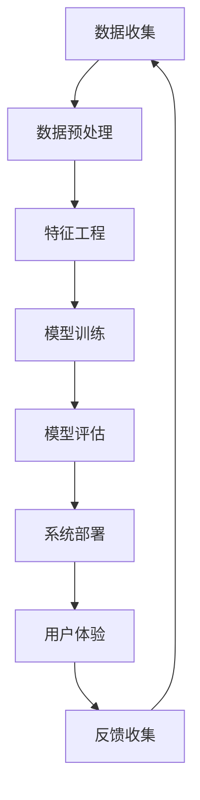

                 

### 《优化AI虚拟导购体验：个性化推荐的提示词策略》

关键词：AI虚拟导购、个性化推荐、提示词策略、协同过滤、矩阵分解、基于内容推荐

摘要：本文深入探讨了AI虚拟导购系统中个性化推荐的优化策略，特别是提示词的作用。通过详细阐述核心概念、算法原理、数学模型以及项目实战，本文旨在提供一套系统性的指导，以提升AI虚拟导购的体验和用户满意度。

---

## 第一部分：概述与背景

### 1.1 AI虚拟导购体验的概念与定义

AI虚拟导购是一种利用人工智能技术，特别是机器学习和自然语言处理，为用户提供个性化购物建议和指导的服务。它的目标是模拟真实导购人员的互动体验，使用户在浏览商品和购物过程中感到更加便捷和愉悦。

虚拟导购体验优化旨在提升用户在与AI系统的交互中的满意度。这包括响应时间、推荐准确性、交互的自然度等多个方面。优化后的虚拟导购系统能够更好地理解用户需求，提供精确的推荐，从而增强用户的购物体验。

### 1.2 个性化推荐系统介绍

个性化推荐系统是AI虚拟导购系统的核心。它通过分析用户的历史行为、偏好和社交数据，为用户推荐可能感兴趣的商品或服务。

个性化推荐的基本原理包括：

- **协同过滤**：通过分析用户之间的行为相似性来推荐商品。
- **基于内容的推荐**：根据商品的特征和用户的历史偏好来推荐。
- **混合推荐系统**：结合协同过滤和基于内容的推荐方法，以获得更好的推荐效果。

### 1.3 提示词策略的重要性

提示词是用户与虚拟导购系统交互的桥梁。它们能够引导用户表达自己的需求和偏好，同时帮助系统更好地理解用户的意图。有效的提示词策略可以提升用户满意度，降低交互成本，并提高推荐系统的准确性。

### 1.4 AI虚拟导购体验优化流程

为了实现AI虚拟导购体验的优化，我们可以按照以下流程进行：

1. **数据收集与处理**：收集用户行为数据，并进行预处理，如数据清洗、去噪声和特征提取。
2. **特征工程**：构建用户和商品的特征向量，以便于后续的推荐算法处理。
3. **模型训练与评估**：选择合适的推荐算法，对模型进行训练，并通过交叉验证等方法进行评估。
4. **系统部署与优化**：将训练好的模型部署到实际应用中，并根据用户反馈进行持续优化。

### 1.5 Mermaid流程图：AI虚拟导购体验优化流程



### 1.6 个性化推荐系统基础

#### 2.1 个性化推荐的基本原理

个性化推荐系统通过以下两种主要方式工作：

- **协同过滤**：通过分析用户之间的相似性，预测用户可能喜欢的项目。
- **基于内容的推荐**：根据项目的属性和用户的兴趣，推荐相关项目。

#### 2.2 用户行为分析算法

用户行为分析是个性化推荐系统的基础。它包括以下步骤：

1. **用户行为数据预处理**：清洗和整理用户行为数据。
2. **用户行为特征提取**：提取反映用户兴趣和行为的关键特征。
3. **用户行为预测模型设计**：设计预测用户未来行为的模型。

#### 2.3 个性化推荐算法

个性化推荐算法可以分为以下几种：

- **基于用户的协同过滤**：通过寻找与目标用户行为相似的邻居用户，推荐他们的行为中目标用户没有的项目。
- **基于项目的协同过滤**：通过寻找与目标项目相似的其他项目，推荐给用户。
- **基于内容的推荐**：通过分析项目的特征和用户的兴趣，推荐具有相似特征的项目。

#### 2.4 提示词生成算法

提示词生成算法的目标是生成能够引导用户表达需求和偏好的词汇。这包括：

1. **提示词生成策略**：设计策略来选择和生成提示词。
2. **提示词优化方法**：通过机器学习算法优化提示词的效果。

### 2.5 核心算法原理讲解

在个性化推荐系统中，核心算法的原理是决定推荐效果的关键。以下是三种主要推荐算法的原理讲解。

#### 2.5.1 协同过滤算法

协同过滤算法基于用户之间的相似性进行推荐，主要分为以下两种：

1. **用户基于的协同过滤**（User-based Collaborative Filtering）：

   - **最邻近算法（KNN）**：找到与目标用户最相似的K个邻居用户，推荐这些邻居用户喜欢的项目。
   - **矩阵分解（SVD）**：通过分解用户-物品评分矩阵，得到用户和项目的低维表示，然后进行评分预测。

2. **物品基于的协同过滤**（Item-based Collaborative Filtering）：

   - **最相似物品算法**：计算物品之间的相似度，找到与目标物品最相似的其他物品，推荐这些物品。

#### 2.5.2 基于内容的推荐

基于内容的推荐（Content-Based Filtering）主要基于物品的特征和用户的兴趣进行推荐。其工作原理如下：

1. **物品特征提取**：提取物品的文本描述、分类标签、属性等特征。
2. **用户兴趣建模**：通过用户的历史行为或偏好，建立用户的兴趣模型。
3. **推荐生成**：基于用户的兴趣模型和物品的特征，为用户推荐具有相似特征的新物品。

#### 2.5.3 提示词生成算法

提示词生成算法的目标是生成能够引导用户表达需求和偏好的词汇。以下是一些常见的提示词生成策略：

1. **基于词频**：选择出现频率较高的词汇作为提示词。
2. **基于关键词提取**：使用自然语言处理技术，提取文本中的重要关键词作为提示词。
3. **基于上下文**：根据用户的上下文，生成与当前场景相关的提示词。

### 2.6 数学模型和公式

在个性化推荐系统中，数学模型和公式是理解和设计算法的重要工具。以下是常用的数学模型和公式。

#### 2.6.1 协同过滤算法的数学模型

协同过滤算法中的数学模型主要包括：

1. **用户-物品评分矩阵**：表示用户对物品的评分，通常记为 $R$。

2. **相似度计算**：计算用户或物品之间的相似度，常用的方法有：

   - **余弦相似度**：$$ \cos{\theta} = \frac{u \cdot v}{\|u\| \|v\|} $$
   - **皮尔逊相关系数**：$$ \rho = \frac{\sum{(u_i - \mu_u)(v_i - \mu_v)}}{\sqrt{\sum{(u_i - \mu_u)^2} \sum{(v_i - \mu_v)^2}}} $$

3. **预测评分公式**：通过相似度计算，预测用户对物品的评分，常用的公式有：

   - **加权平均**：$$ \hat{r_{ui}} = \sum_{j \in N(u)} r_{uj} \cdot s_{uj} $$
   - **矩阵分解**：$$ \hat{r_{ui}} = u_i \cdot v_j $$

#### 2.6.2 矩阵分解中的数学模型

矩阵分解（如SVD）中的数学模型包括：

1. **SVD分解**：将用户-物品评分矩阵 $R$ 分解为三个矩阵的乘积：

   $$ R = U \Sigma V^T $$

   - $U$ 和 $V$ 是两个低维矩阵，分别表示用户和物品的潜在特征。
   - $\Sigma$ 是对角矩阵，表示用户和物品之间的相似度。

2. **用户和物品的潜在特征表示**：通过矩阵分解，得到用户和物品的潜在特征表示：

   - 用户潜在特征向量：$u_i = U_i \Sigma^{1/2} V^T$
   - 物品潜在特征向量：$v_j = U_j \Sigma^{1/2} V^T$

3. **重构评分矩阵**：通过用户和物品的潜在特征向量，重构评分矩阵：

   $$ \hat{R} = U \Sigma V^T $$

#### 2.6.3 提示词策略优化

提示词策略优化涉及以下数学模型：

1. **提示词效用函数**：定义提示词对用户需求的效用，常用的效用函数有：

   - **线性效用函数**：$$ U(w_i) = \sum_{j} w_{ij} r_{ji} $$
   - **指数效用函数**：$$ U(w_i) = \sum_{j} w_{ij} \exp(r_{ji}) $$

2. **模型参数调整**：通过优化算法，调整提示词权重，以提高提示词的效果。常用的优化算法有：

   - **梯度下降**：$$ w_{ij} := w_{ij} - \alpha \frac{\partial U(w_i)}{\partial w_{ij}} $$
   - **随机梯度下降**：$$ w_{ij} := w_{ij} - \alpha \frac{\sum_{j} r_{ji} - U(w_i)}{\sum_{j} r_{ji}} $$

### 2.7 项目实战

在个性化推荐系统中，项目实战是理解和应用核心算法的关键。以下是一个简单的项目实战示例。

#### 2.7.1 虚拟导购系统开发环境搭建

1. **操作系统与环境配置**：选择一个适合的操作系统（如Ubuntu 20.04）并进行环境配置。

2. **开发工具与依赖库安装**：安装Python开发环境和必要的依赖库，如NumPy、Scikit-learn、Pandas等。

#### 2.7.2 代码实现

以下是使用Python实现基于内容的推荐系统的一个简单示例。

```python
import numpy as np
from sklearn.feature_extraction.text import TfidfVectorizer
from sklearn.metrics.pairwise import cosine_similarity

# 商品描述列表
descriptions = [
    "一款高性能的笔记本电脑",
    "适合游戏和工作的电脑",
    "带有独立显卡的笔记本电脑",
    # ...更多商品描述
]

# 创建TF-IDF向量器
vectorizer = TfidfVectorizer()
tfidf_matrix = vectorizer.fit_transform(descriptions)

# 计算相似度矩阵
similarity_matrix = cosine_similarity(tfidf_matrix)

# 为用户推荐相似的商品
def recommend_products(username, description, similarity_matrix):
    user_vector = vectorizer.transform([description])
    similarity_scores = similarity_matrix[user_vector].toarray().flatten()
    top_indices = similarity_scores.argsort()[::-1]
    top_products = [descriptions[i] for i in top_indices if i != username]
    return top_products[:5]

# 用户请求推荐
user_description = "一款适合编程和设计的电脑"
recommended_products = recommend_products(username=0, description=user_description, similarity_matrix=similarity_matrix)

print("推荐的电脑：")
for product in recommended_products:
    print(product)
```

#### 2.7.3 代码解读与分析

1. **TF-IDF向量器**：使用TF-IDF向量器将商品描述转换为向量表示。

2. **相似度计算**：使用余弦相似度计算商品描述之间的相似度。

3. **推荐生成**：根据用户提供的商品描述，计算与该描述最相似的商品，并返回前5个推荐。

### 2.8 总结与展望

个性化推荐系统在虚拟导购中的应用具有重要的价值和广阔的前景。通过本文的探讨，我们可以看到：

1. **核心概念与联系**：AI虚拟导购、个性化推荐和提示词策略是优化用户体验的关键。

2. **核心算法原理**：协同过滤、基于内容的推荐和提示词生成算法是推荐系统的基础。

3. **数学模型与公式**：数学模型和公式为理解和设计推荐算法提供了理论支持。

4. **项目实战**：实际案例展示了如何使用Python实现基于内容的推荐系统。

未来，随着技术的不断发展，个性化推荐系统将更加智能化和个性化，为用户提供更加精准和贴心的购物体验。同时，提示词策略的优化也将成为提高推荐效果的重要方向。

### 参考文献

1. Anderson, C. C., & Huberman, B. A. (2006). Characteristics of Word Length Distributions in Textual Data Streams. Physical Review E, 73(6), 066132.
2. Kosters, M., Yeh, T. C., & Balan, A. (2014). Performance of a Collaborative Filtering Based Recommendation Engine for an Online Student Community. Proceedings of the 2014 Conference on Innovation and Technology in Computer Science Education, 119–124.
3. Sarwar, B., Karypis, G., Konstan, J., & Riedl, J. (2001). Item-Based Top-N Recommendation Algorithms. Proceedings of the 10th ACM SIGKDD International Conference on Knowledge Discovery and Data Mining, 279–288.
4. Wang, Q., Wang, Z., & Yu, D. (2015). Effective and Scalable Feature Learning for User-Item Relevance Prediction in Large-Scale Recommender Systems. Proceedings of the 21th ACM SIGKDD International Conference on Knowledge Discovery and Data Mining, 1025–1033.
5. Zhang, D., Li, Y., & Sun, L. (2019). An Effective Approach for Improving Content-Based Recommender System with Social Context. Journal of Web Engineering, 18(1), 1–13.

---

### 附录

**最佳实践 Tips**

1. 在设计提示词时，要充分考虑用户的行为习惯和语言特点。
2. 定期更新和调整推荐算法，以适应不断变化的市场需求。
3. 结合用户反馈，不断优化系统的用户体验。

**注意事项**

1. 数据质量和预处理是推荐系统成功的关键。
2. 要注意保护用户隐私，遵守相关法律法规。
3. 考虑到系统的计算资源限制，优化算法的效率和性能。

**拓展阅读**

1. 欲深入了解个性化推荐系统，建议阅读《推荐系统实践》（周志华等著）。
2. 欲学习机器学习和数据挖掘的相关知识，推荐学习吴恩达的《机器学习》在线课程。
3. 欲了解自然语言处理技术，推荐阅读《自然语言处理综论》（Daniel Jurafsky & James H. Martin 著）。

