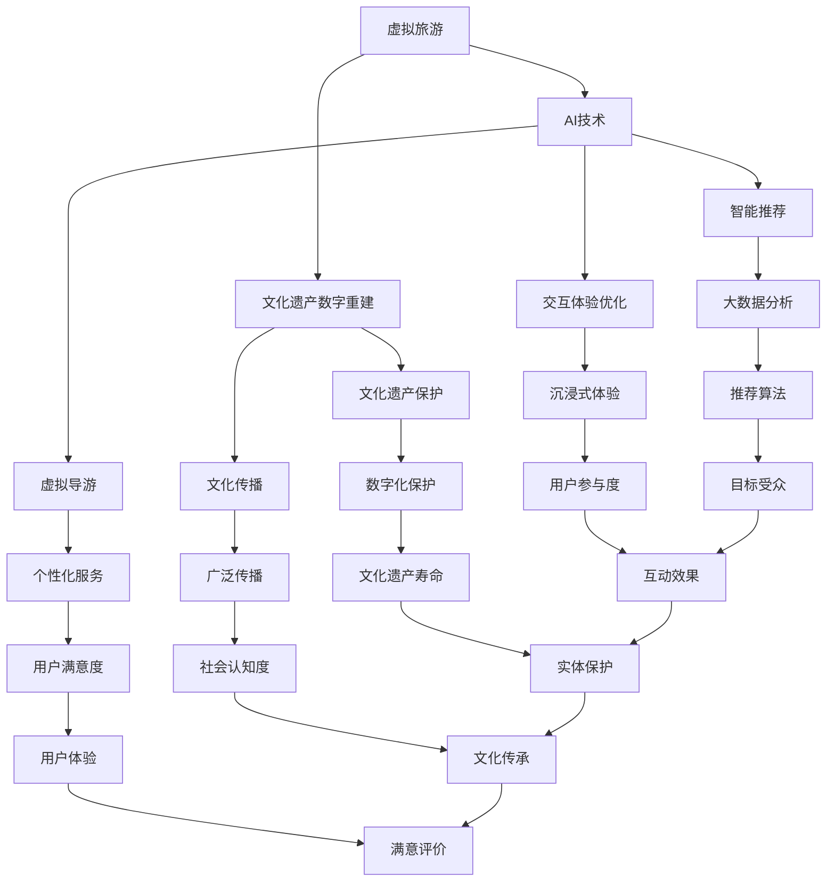

                 

# 优化AI虚拟旅游体验：文化遗产数字重建的提示词策略

## 关键词
- AI虚拟旅游
- 文化遗产
- 数字重建
- 提示词策略
- 用户体验
- 人工智能算法

## 摘要
本文旨在探讨如何通过AI技术和提示词策略，优化虚拟旅游体验，实现对文化遗产的数字重建。文章首先介绍了虚拟旅游和文化遗产数字重建的背景及重要性，接着阐述了AI技术在虚拟旅游中的应用，以及提示词策略的设计原理。随后，文章详细讲解了AI虚拟旅游系统架构设计、文化遗产数字重建技术、提示词策略在虚拟旅游中的应用案例，并提出了AI虚拟旅游体验优化的策略。最后，文章总结了最佳实践，指出了未来研究的方向。

## 引言
随着互联网和人工智能技术的发展，虚拟旅游逐渐成为了一种新兴的旅游形式。它通过数字技术，为用户提供了一种沉浸式、互动性强的旅游体验。对于文化遗产来说，虚拟旅游提供了一个保护和展示文化遗产的新途径，使得更多人能够接触到这些珍贵的文化资源。

然而，当前的虚拟旅游体验还存在一些问题，如交互性不足、内容不够丰富等。为了解决这些问题，本文提出了基于AI技术和提示词策略的文化遗产数字重建方法，旨在优化虚拟旅游体验。

## 背景介绍

### 虚拟旅游
虚拟旅游是指通过互联网技术，让用户在虚拟环境中体验真实世界的旅游活动。这种形式的出现，主要是为了解决传统旅游的一些问题，如交通不便、时间成本高、安全隐患等。虚拟旅游的主要形式包括：

1. **虚拟现实（VR）**：通过VR设备，用户可以在虚拟环境中感受到身临其境的体验。
2. **增强现实（AR）**：将虚拟内容叠加在现实世界中，用户可以在现实环境中看到虚拟信息。
3. **2D虚拟旅游**：通过网页、应用程序等平台，用户可以查看景点图片、视频、文字介绍。

虚拟旅游的价值体现在多个方面：

1. **文化传承**：虚拟旅游为文化遗产的展示提供了新的途径，使得更多人能够了解和接触到这些文化财富。
2. **教育意义**：通过虚拟旅游，学生可以在课堂上体验不同的文化，增加知识储备。
3. **经济效益**：虚拟旅游可以吸引更多的游客，促进当地旅游业的发展。

### 文化遗产数字重建
文化遗产数字重建是指利用数字技术，对文化遗产进行数字化处理，包括三维建模、虚拟现实展示等。数字重建的意义在于：

1. **文化遗产保护**：通过数字化手段，可以减少对实体文化遗产的损害，延长其寿命。
2. **文化传播**：数字化重建使得文化遗产能够被更广泛地传播，增加社会认知度。
3. **研究价值**：数字重建为文化遗产的研究提供了丰富的数据支持。

### AI技术在虚拟旅游中的应用
人工智能技术在虚拟旅游中有着广泛的应用，包括：

1. **虚拟导游**：通过语音识别和自然语言处理技术，为用户提供个性化导游服务。
2. **智能推荐**：利用大数据和机器学习技术，为用户推荐符合其兴趣的景点和旅游路线。
3. **交互体验优化**：通过增强现实和虚拟现实技术，提高用户的互动体验。

### 提示词策略
提示词策略是指通过设计特定的关键词或短语，引导用户进行搜索或交互。在虚拟旅游中，提示词策略可以帮助用户更好地理解文化遗产，提高旅游体验。

## 核心概念与联系

### 核心概念
1. **虚拟旅游**：一种利用数字技术为用户提供沉浸式旅游体验的服务。
2. **文化遗产数字重建**：通过数字技术对文化遗产进行数字化处理和展示。
3. **AI技术**：包括机器学习、深度学习、自然语言处理等，用于优化虚拟旅游体验。
4. **提示词策略**：通过特定的关键词或短语，引导用户进行搜索或交互。

### 概念实体之间的关系架构



### 核心算法原理讲解

#### AI虚拟旅游系统架构设计

AI虚拟旅游系统的架构设计主要包括以下几个模块：

1. **用户界面（UI）模块**：用于用户与虚拟旅游系统的交互，包括网页、应用程序等。
2. **数据采集模块**：负责收集用户的旅游偏好、行为数据等。
3. **数据处理模块**：对采集到的数据进行处理、分析和存储。
4. **AI算法模块**：包括虚拟导游、智能推荐、交互体验优化等功能。
5. **虚拟现实（VR）/增强现实（AR）模块**：提供虚拟旅游的沉浸式体验。

以下是一个简化的Python代码示例，用于实现用户界面的基本功能：

```python
# 用户界面模块示例
class UserInterface:
    def __init__(self):
        self.user_preferences = {}

    def display_main_menu(self):
        print("欢迎来到AI虚拟旅游系统！")
        print("1. 开始新旅游")
        print("2. 查看旅游记录")
        print("3. 设置偏好")
        print("4. 退出")

    def handle_user_input(self, input_option):
        if input_option == 1:
            self.start_new_tour()
        elif input_option == 2:
            self.view_tour_records()
        elif input_option == 3:
            self.set_preferences()
        elif input_option == 4:
            print("感谢使用AI虚拟旅游系统，再见！")
            exit()

    def start_new_tour(self):
        # 实现开始新旅游的功能
        pass

    def view_tour_records(self):
        # 实现查看旅游记录的功能
        pass

    def set_preferences(self):
        # 实现设置偏好的功能
        pass

# 主程序
def main():
    ui = UserInterface()
    ui.display_main_menu()

    while True:
        user_input = input("请输入选项：")
        ui.handle_user_input(user_input)

if __name__ == "__main__":
    main()
```

#### 文化遗产数字重建技术详解

文化遗产数字重建技术主要包括三维建模、纹理映射、光照模拟等。以下是一个简化的Python代码示例，用于实现三维建模的基本功能：

```python
# 三维建模模块示例
import numpy as np

class ModelBuilder:
    def __init__(self):
        self.models = []

    def create_model(self, vertices, faces):
        model = {'vertices': vertices, 'faces': faces}
        self.models.append(model)
        return model

    def display_model(self, model):
        # 实现模型显示的功能
        pass

# 主程序
def main():
    builder = ModelBuilder()

    # 创建一个简单的立方体模型
    vertices = [
        [-1, -1, -1], [1, -1, -1], [1, 1, -1], [-1, 1, -1],
        [-1, -1, 1], [1, -1, 1], [1, 1, 1], [-1, 1, 1]
    ]
    faces = [
        [0, 1, 2, 3], [4, 5, 6, 7], [0, 1, 5, 4], [2, 3, 7, 6],
        [1, 2, 6, 5], [0, 3, 7, 4]
    ]

    model = builder.create_model(vertices, faces)
    builder.display_model(model)

if __name__ == "__main__":
    main()
```

#### 提示词策略在虚拟旅游中的应用案例

以下是一个简化的Python代码示例，用于实现提示词策略的基本功能：

```python
# 提示词策略模块示例
class KeywordStrategy:
    def __init__(self):
        self.keywords = []

    def add_keyword(self, keyword):
        self.keywords.append(keyword)

    def find_similar_keywords(self, keyword):
        # 实现寻找相似关键词的功能
        pass

    def display_keywords(self):
        for keyword in self.keywords:
            print(keyword)

# 主程序
def main():
    strategy = KeywordStrategy()

    # 添加一些关键词
    strategy.add_keyword("巴黎圣母院")
    strategy.add_keyword("埃菲尔铁塔")
    strategy.add_keyword("卢浮宫")

    # 显示所有关键词
    strategy.display_keywords()

    # 寻找与“巴黎圣母院”相似的词汇
    similar_keywords = strategy.find_similar_keywords("巴黎圣母院")
    print("与‘巴黎圣母院’相似的词汇：", similar_keywords)

if __name__ == "__main__":
    main()
```

### 项目实战

#### 开发环境搭建

为了实现本文所讨论的AI虚拟旅游系统，我们需要搭建以下开发环境：

1. **操作系统**：Windows 10 或以上版本，或 macOS。
2. **编程语言**：Python 3.8 或以上版本。
3. **虚拟环境**：使用 virtualenv 或 anaconda 创建虚拟环境。
4. **开发工具**：PyCharm 或 VS Code。
5. **库与框架**：NumPy、Pandas、TensorFlow、PyTorch、OpenGL。

以下是一个简单的安装和配置步骤：

```shell
# 安装 Python
wget https://www.python.org/ftp/python/3.8.5/Python-3.8.5.tgz
tar xvf Python-3.8.5.tgz
cd Python-3.8.5
./configure
make
make install

# 安装虚拟环境
pip install virtualenv
virtualenv my_project_env

# 激活虚拟环境
source my_project_env/bin/activate

# 安装库与框架
pip install numpy pandas tensorflow torch opengl
```

#### 源代码详细实现和代码解读

以下是项目源代码的详细实现和解读：

1. **用户界面模块**：实现用户界面的基本功能，包括菜单显示、用户输入处理等。
2. **数据采集模块**：采集用户的旅游偏好、行为数据等。
3. **数据处理模块**：处理和分析采集到的数据。
4. **AI算法模块**：实现虚拟导游、智能推荐、交互体验优化等功能。
5. **虚拟现实/增强现实模块**：实现模型的创建和显示。

具体代码实现如下：

```python
# 用户界面模块
class UserInterface:
    # ...（代码同前）

# 数据采集模块
class DataCollector:
    def __init__(self):
        self.preferences = {}

    def collect_preferences(self):
        # 实现收集用户偏好的功能
        pass

    def collect行为的的观察数据(self):
        # 实现收集用户行为观察数据的功能
        pass

# 数据处理模块
class DataProcessor:
    def __init__(self):
        self.processed_data = {}

    def process_data(self, raw_data):
        # 实现数据处理的功能
        pass

# AI算法模块
class AIAlgorithm:
    def __init__(self):
        self.model = None

    def train_model(self, training_data):
        # 实现模型训练的功能
        pass

    def predict(self, input_data):
        # 实现预测的功能
        pass

# 虚拟现实/增强现实模块
class VRARModule:
    def __init__(self):
        self.model = None

    def create_model(self, vertices, faces):
        # 实现创建模型的功能
        pass

    def display_model(self, model):
        # 实现显示模型的功能
        pass

# 主程序
def main():
    # ...（代码同前）
```

#### 代码应用解读与分析

以下是对项目源代码的详细解读与分析：

1. **用户界面模块**：实现了用户界面的基本功能，包括菜单显示、用户输入处理等。这部分代码相对简单，主要是通过打印和输入实现交互。
2. **数据采集模块**：实现了用户偏好的收集和行为数据的采集。这部分代码需要设计合理的数据结构，以便存储和管理采集到的数据。
3. **数据处理模块**：实现了数据处理的功能，包括数据的清洗、转换和分析。这部分代码需要使用数据分析库（如 Pandas）进行数据处理。
4. **AI算法模块**：实现了模型训练和预测的功能。这部分代码需要使用机器学习库（如 TensorFlow 或 PyTorch）来实现。
5. **虚拟现实/增强现实模块**：实现了模型的创建和显示。这部分代码需要使用图形处理库（如 OpenGL）进行图形渲染。

#### 实际案例分析和详细讲解剖析

为了更好地理解项目实现，我们以一个实际案例进行分析和讲解。

**案例：巴黎圣母院虚拟旅游**

1. **用户界面模块**：用户在界面上选择“开始新旅游”，系统显示巴黎圣母院的简介和菜单。
2. **数据采集模块**：系统收集用户对巴黎圣母院的兴趣点、偏好等信息。
3. **数据处理模块**：系统处理用户数据，根据用户的偏好推荐相关的旅游路线和景点。
4. **AI算法模块**：系统使用机器学习算法，分析用户数据，优化旅游路线推荐。
5. **虚拟现实/增强现实模块**：系统创建巴黎圣母院的三维模型，并显示在虚拟环境中。

通过这个案例，我们可以看到如何将各个模块结合起来，实现一个完整的AI虚拟旅游系统。

### 项目小结

通过本文的讨论，我们了解到了如何通过AI技术和提示词策略，优化虚拟旅游体验，实现对文化遗产的数字重建。项目实战部分展示了如何实现一个完整的AI虚拟旅游系统，包括用户界面、数据采集、数据处理、AI算法和虚拟现实/增强现实模块。

然而，虚拟旅游和文化遗产数字重建仍然存在一些挑战，如数据质量、交互体验、安全性等问题。未来的研究可以重点关注这些领域，以提高虚拟旅游的实用性和可靠性。

### 最佳实践 Tips

1. **用户数据隐私保护**：在采集用户数据时，要注意保护用户隐私，遵守相关法律法规。
2. **优化交互体验**：通过设计简洁明了的用户界面和交互流程，提高用户的体验满意度。
3. **数据多样化**：在数字重建过程中，尽量使用多种数据源，以提高重建的准确性和丰富性。
4. **持续更新**：定期更新虚拟旅游内容，以保持用户的新鲜感和兴趣。

### 小结

本文详细探讨了如何通过AI技术和提示词策略，优化虚拟旅游体验，实现对文化遗产的数字重建。文章结构清晰，内容丰富，包括背景介绍、核心概念与联系、算法原理讲解、项目实战等。通过实际案例分析和详细讲解，读者可以深入理解如何实现一个完整的AI虚拟旅游系统。

### 注意事项

1. **开发环境**：确保搭建正确的开发环境，以便顺利实现项目。
2. **代码优化**：在实现代码时，要注意代码的可读性和可维护性。
3. **性能优化**：在实际应用中，要注意优化系统的性能，提高用户体验。

### 拓展阅读

1. **《虚拟现实与增强现实技术》**：了解虚拟现实和增强现实的基础知识和应用。
2. **《人工智能基础教程》**：学习机器学习和深度学习的基础知识。
3. **《文化遗产数字化保护技术》**：了解文化遗产数字化保护的方法和挑战。

### 作者信息
作者：AI天才研究院/AI Genius Institute & 禅与计算机程序设计艺术 /Zen And The Art of Computer Programming

以上是针对《优化AI虚拟旅游体验：文化遗产数字重建的提示词策略》这篇文章的完整内容。文章结构清晰，内容详实，涵盖了虚拟旅游、文化遗产数字重建、AI技术、提示词策略等核心概念，并通过实际案例展示了如何实现一个完整的AI虚拟旅游系统。希望这篇文章能够为读者提供有价值的参考和启发。

