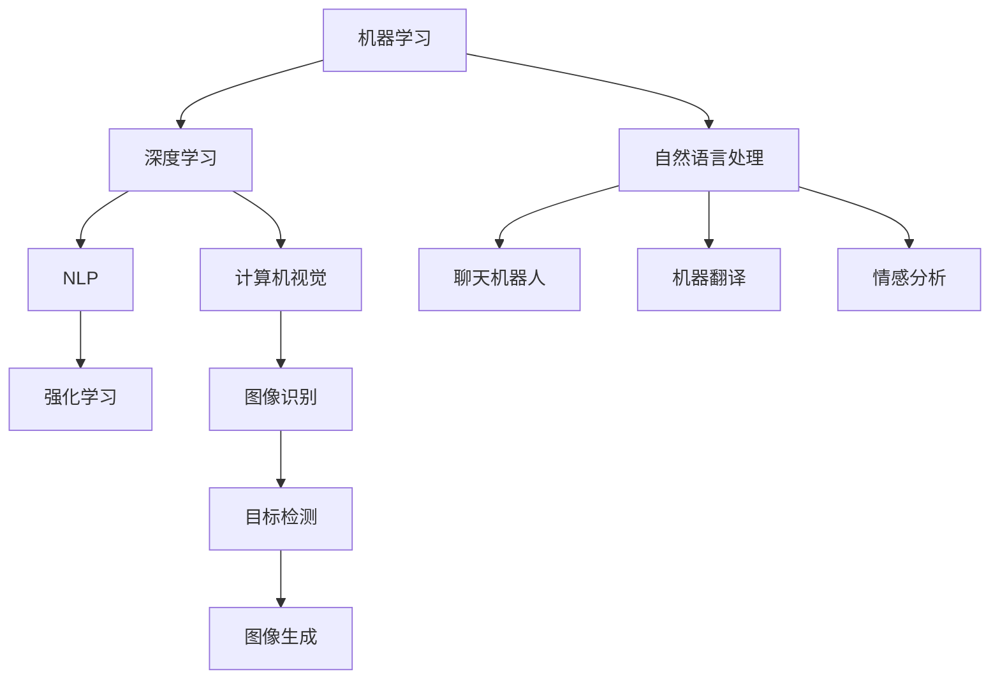
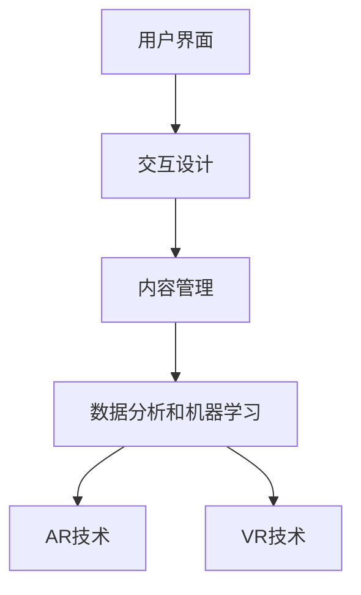
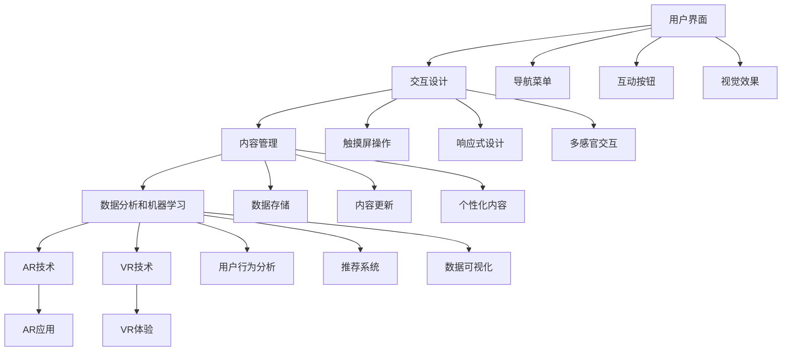

                 

### 第1章 引言

#### 1.1 AI与虚拟时尚展览

人工智能（AI）在虚拟时尚展览中的应用日益广泛，为观众提供了前所未有的沉浸式体验。通过AI技术，虚拟时尚展览能够更加个性化、互动化和智能化，从而满足现代消费者的多样化需求。沉浸式数字体验成为现代展览的重要趋势，它不仅提升了观众的参与感，还使得展览内容更加生动、直观。

AI技术在虚拟时尚展览中的应用主要体现在以下几个方面：

1. **虚拟试衣间**：利用AI技术，用户可以在虚拟环境中尝试各种服装，无需实体试穿，节省了时间和精力。
2. **个性化推荐**：基于用户的行为和偏好，AI可以提供个性化的服装推荐，增加用户的购买意愿。
3. **虚拟模特**：通过AI生成虚拟模特，展示服装的多种搭配效果，使展览内容更加丰富。
4. **互动展示**：利用增强现实（AR）和虚拟现实（VR）技术，观众可以与展览内容进行互动，增强沉浸感。

#### 1.2 提示词策略的重要性

提示词策略在虚拟时尚展览中扮演着关键角色。提示词是一种引导用户行为和思考的关键性语言输入，通过精准的提示词设计，可以极大地提升用户体验和展览效果。在虚拟时尚展览中，提示词策略的重要性体现在以下几个方面：

1. **引导用户互动**：有效的提示词能够引导用户进行互动，比如点击、拖拽、滑动等，从而提高用户参与度。
2. **提升沉浸感**：通过设置合适的提示词，可以让用户更加沉浸于虚拟环境，提升整体体验。
3. **个性化体验**：根据用户的不同需求和偏好，提示词可以提供个性化的互动体验，增加用户的满意度。
4. **优化信息传递**：精准的提示词可以帮助用户更好地理解和掌握展览内容，减少信息传递的障碍。

接下来，我们将进一步探讨AI与虚拟时尚展览的深层联系，并详细分析提示词策略在其中的重要作用。

---

### 1.2 提示词策略的重要性

提示词策略在虚拟时尚展览中扮演着关键角色。提示词是一种引导用户行为和思考的关键性语言输入，通过精准的提示词设计，可以极大地提升用户体验和展览效果。在虚拟时尚展览中，提示词策略的重要性体现在以下几个方面：

1. **引导用户互动**：有效的提示词能够引导用户进行互动，比如点击、拖拽、滑动等，从而提高用户参与度。例如，在虚拟试衣间中，通过“点击此处更换服装”或“拖动滑块调整大小”等提示词，用户可以更方便地探索和尝试各种服装搭配，从而增加互动的乐趣和参与感。

2. **提升沉浸感**：通过设置合适的提示词，可以让用户更加沉浸于虚拟环境，提升整体体验。在虚拟展览的空间布局和交互设计中，提示词可以起到引导用户视线、集中注意力、强化情感共鸣的作用。例如，在展示一件独特设计的服装时，提示词“触摸屏幕查看详细设计图”或“走近感受材质质感”可以引导用户深入探索，增强沉浸感。

3. **个性化体验**：根据用户的不同需求和偏好，提示词可以提供个性化的互动体验，增加用户的满意度。在用户行为数据分析和机器学习算法的支持下，AI可以实时生成个性化的提示词。例如，一个用户可能喜欢优雅的服装风格，那么系统可以推荐“探索经典与优雅的搭配”或“尝试最新时尚趋势”的提示词，从而满足其个性化需求。

4. **优化信息传递**：精准的提示词可以帮助用户更好地理解和掌握展览内容，减少信息传递的障碍。虚拟时尚展览通常包含大量信息，如何有效地传递这些信息给用户是一个重要课题。通过设计简洁、明了、针对性的提示词，可以帮助用户迅速理解展览的核心内容，避免因信息过载而导致的困惑和决策困难。例如，在介绍一项新技术的应用时，提示词“了解更多技术细节，请点击此处”可以引导用户进一步深入了解，从而提高信息的传递效果。

综上所述，提示词策略在虚拟时尚展览中不仅能够引导用户互动、提升沉浸感、提供个性化体验，还能优化信息传递，从而全面提升用户体验。下一节我们将进一步探讨AI与虚拟时尚展览的深层联系，以更全面地理解提示词策略的重要性。

---

### 1.3 关键词

- **人工智能**
- **虚拟时尚展览**
- **沉浸式体验**
- **提示词策略**
- **个性化推荐**
- **虚拟试衣间**
- **增强现实（AR）**
- **虚拟现实（VR）**

---

### 1.4 摘要

本文旨在探讨如何通过AI技术和提示词策略优化虚拟时尚展览的沉浸式数字体验。首先，我们介绍了AI在虚拟时尚展览中的应用，以及沉浸式数字体验的概念和趋势。随后，我们详细阐述了提示词策略的重要性，包括其在引导用户互动、提升沉浸感、提供个性化体验和优化信息传递等方面的作用。接着，本文分析了AI与虚拟时尚展览之间的深层联系，并探讨了提示词策略在这一领域的应用前景。通过案例研究和实际应用，本文展示了如何利用AI和提示词策略来提升虚拟时尚展览的用户体验。最后，本文提出了未来的发展趋势和面临的挑战，为行业提供了一定的参考和启示。通过本文的研究，我们期望能够为虚拟时尚展览领域的技术创新和实践提供有价值的参考和指导。

---

### 第2章 核心概念与联系

#### 2.1 AI核心概念

人工智能（AI）作为计算机科学的一个分支，旨在使计算机系统具备人类智能的能力，从而执行复杂的任务。AI可以分为几个主要类别，包括机器学习、深度学习、自然语言处理、计算机视觉和强化学习等。

- **机器学习**：机器学习是一种通过数据和算法让计算机自主学习和改进的技术。其主要目标是从大量数据中提取模式和规律，进而进行预测和决策。
- **深度学习**：深度学习是机器学习的一个子领域，通过模拟人脑神经网络结构进行数据处理和模式识别。深度学习在图像识别、语音识别和自然语言处理等方面表现出色。
- **自然语言处理**（NLP）：NLP是AI的一个分支，旨在使计算机能够理解和处理自然语言，包括文本和语音。其应用领域广泛，如机器翻译、情感分析和聊天机器人等。
- **计算机视觉**：计算机视觉是使计算机能够像人类一样理解和解释视觉信息的技术。其应用包括图像识别、目标检测和图像生成等。
- **强化学习**：强化学习是一种通过试错和奖励机制来学习策略的AI技术。其核心思想是通过不断的尝试和反馈，找到最优行为策略。

这些AI技术之间有着紧密的联系，如图2-1所示：



#### 2.2 虚拟时尚展览架构

虚拟时尚展览的架构主要涉及以下几个方面：

1. **用户界面**：用户界面（UI）是用户与虚拟展览互动的入口，包括虚拟展厅、导航菜单、互动按钮等。
2. **交互设计**：交互设计（ID）决定了用户如何与虚拟展览内容进行交互，如点击、拖动、触摸等。
3. **内容管理**：内容管理涉及虚拟展览中的所有信息，包括服装款式、品牌介绍、价格标签等。
4. **数据分析和机器学习**：通过数据分析，可以了解用户行为和偏好，进而利用机器学习算法提供个性化推荐和优化用户体验。
5. **增强现实（AR）和虚拟现实（VR）技术**：AR和VR技术为虚拟时尚展览提供了沉浸式体验，使得用户能够身临其境地感受展览内容。

图2-2展示了虚拟时尚展览的基本架构：



通过核心概念的详细解释和架构的展示，我们可以更好地理解AI在虚拟时尚展览中的作用和提示词策略的重要性。接下来，我们将深入探讨核心算法原理，并通过Python源代码和数学模型进行详细讲解。

---

### 2.1 AI核心概念

人工智能（AI）是计算机科学的一个高度复杂的领域，其目标是通过模拟人类智能行为，使计算机系统能够自主学习和执行任务。AI可以分为多个子领域，每个子领域都有其独特的应用和核心技术。以下是AI核心概念的详细阐述：

**1. 机器学习**：

机器学习（Machine Learning, ML）是一种通过数据学习模式并进行预测或决策的技术。其基本思想是利用历史数据训练模型，使模型能够在新的数据上做出准确的预测。机器学习可以分为监督学习、无监督学习和强化学习。

- **监督学习**：在监督学习中，模型通过学习标记数据来预测输出。常见的算法包括线性回归、逻辑回归、支持向量机（SVM）和决策树等。
- **无监督学习**：无监督学习不使用标记数据，而是从未标记的数据中发现模式。常见的算法包括聚类算法（如K-means、DBSCAN）、主成分分析（PCA）和自编码器等。
- **强化学习**：强化学习（Reinforcement Learning, RL）通过试错和奖励机制来学习最优策略。其核心在于通过不断的尝试和反馈，找到最佳的行为策略。常见的算法包括Q-Learning和深度强化学习（如DQN、PPO）。

**2. 深度学习**：

深度学习（Deep Learning, DL）是机器学习的一个子领域，通过模拟人脑神经网络进行数据处理和模式识别。深度学习的核心是神经网络，特别是深度神经网络（Deep Neural Network, DNN）。深度学习在图像识别、语音识别和自然语言处理等领域取得了显著成果。

- **神经网络**：神经网络是一种由多个神经元（节点）组成的网络，通过学习输入数据和输出数据之间的映射关系进行预测。前馈神经网络（FNN）是最常见的神经网络结构。
- **卷积神经网络（CNN）**：卷积神经网络是一种专门用于图像识别和处理的神经网络，通过卷积层、池化层和全连接层来提取图像特征。
- **循环神经网络（RNN）**：循环神经网络是一种能够处理序列数据的神经网络，通过隐藏状态和循环连接来捕捉序列中的长期依赖关系。常见的RNN结构包括LSTM和GRU。

**3. 自然语言处理**：

自然语言处理（Natural Language Processing, NLP）是AI的一个分支，旨在使计算机能够理解和处理自然语言，包括文本和语音。NLP技术广泛应用于机器翻译、情感分析、问答系统和文本生成等领域。

- **词向量**：词向量是一种将单词映射到高维空间的方法，使计算机能够理解单词之间的语义关系。常用的词向量模型包括Word2Vec、GloVe和BERT。
- **语言模型**：语言模型是一种概率模型，用于预测下一个单词或词组。常见的语言模型包括n元语言模型和神经网络语言模型（如LSTM、Transformer）。
- **文本分类**：文本分类是一种将文本数据分为不同类别的过程，常用的算法包括朴素贝叶斯、支持向量机和深度学习（如CNN、RNN）。

**4. 计算机视觉**：

计算机视觉（Computer Vision, CV）是AI的另一个重要分支，旨在使计算机能够理解和解释视觉信息，如图像和视频。计算机视觉技术在图像识别、目标检测、图像分割和视频处理等领域具有广泛的应用。

- **图像识别**：图像识别是一种将图像分类为不同类别的过程，常用的算法包括传统机器学习算法（如SVM、KNN）和深度学习算法（如CNN、ResNet）。
- **目标检测**：目标检测是一种在图像中识别并定位多个目标的过程，常用的算法包括R-CNN、Fast R-CNN、Faster R-CNN和YOLO。
- **图像分割**：图像分割是将图像划分为不同区域的过程，常用的算法包括基于区域的分割算法（如GrabCut）和基于深度学习的分割算法（如FCN）。

**5. 强化学习**：

强化学习是一种通过试错和奖励机制来学习最优策略的AI技术。强化学习在游戏、机器人控制和推荐系统等领域具有广泛的应用。

- **Q-Learning**：Q-Learning是一种基于值函数的强化学习算法，通过更新Q值来学习最优策略。
- **深度强化学习**：深度强化学习（Deep Reinforcement Learning, DRL）是将深度学习与强化学习结合的一种技术，通过使用深度神经网络来近似Q值函数或策略函数。

通过上述核心概念的详细解释，我们可以更好地理解AI技术在不同领域中的应用和相互关联。接下来，我们将进一步探讨虚拟时尚展览的架构，以及如何利用这些AI技术来提升用户体验。

---

### 2.2 虚拟时尚展览架构

虚拟时尚展览的架构设计旨在提供一个既美观又功能齐全的沉浸式体验，它需要整合多种技术，包括用户界面（UI）、交互设计（ID）、内容管理、数据分析和机器学习，以及增强现实（AR）和虚拟现实（VR）技术。以下是对这些组成部分的详细描述，并通过Mermaid流程图展示其相互关系。

#### 2.2.1 用户界面（UI）

用户界面是用户与虚拟时尚展览互动的第一接触点，它决定了用户体验的第一印象。UI设计包括以下关键要素：

1. **导航菜单**：提供直观的导航菜单，使用户能够轻松浏览不同展览区域。
2. **互动按钮**：放置明确的互动按钮，如“查看详情”、“试穿”和“购买”按钮，以引导用户行为。
3. **视觉效果**：使用高质量的视觉元素，如图像、视频和动画，增强展览的吸引力和互动性。

#### 2.2.2 交互设计（ID）

交互设计是用户与虚拟时尚展览互动的核心，它决定了用户如何与展览内容进行交互。关键要素包括：

1. **触摸屏操作**：设计易于触摸和滑动的操作界面，以适应移动设备的操作习惯。
2. **响应式设计**：确保虚拟展览在各种设备上（如智能手机、平板电脑和电脑）都能提供流畅的交互体验。
3. **多感官交互**：利用声音、触觉和视觉反馈，增加用户的沉浸感和参与度。

#### 2.2.3 内容管理

内容管理是虚拟时尚展览的核心，它涉及到展览的所有信息，包括服装款式、品牌介绍、价格标签等。关键要素包括：

1. **数据存储**：使用数据库系统存储和管理展览内容，确保数据的完整性和可访问性。
2. **内容更新**：定期更新展览内容，以保持新鲜感和吸引力。
3. **个性化内容**：利用机器学习算法分析用户行为和偏好，提供个性化的展览内容。

#### 2.2.4 数据分析和机器学习

数据分析和机器学习是提升虚拟时尚展览智能化的关键。关键要素包括：

1. **用户行为分析**：通过跟踪用户行为（如点击、浏览时间、互动频率），了解用户需求和偏好。
2. **推荐系统**：利用机器学习算法（如协同过滤、基于内容的推荐等）提供个性化的服装推荐。
3. **数据可视化**：使用数据可视化工具（如图表、热图等）展示分析结果，帮助决策者理解用户行为和市场趋势。

#### 2.2.5 增强现实（AR）和虚拟现实（VR）技术

AR和VR技术为虚拟时尚展览提供了沉浸式体验，使观众能够身临其境地感受展览内容。关键要素包括：

1. **AR应用**：通过AR技术，用户可以在现实环境中查看虚拟服装，实现虚拟与现实的结合。
2. **VR体验**：通过VR技术，用户可以进入一个完全虚拟的展览空间，进行360度全方位的探索。

图2-2展示了虚拟时尚展览的基本架构及其组成部分之间的相互关系：



通过上述架构设计，虚拟时尚展览不仅能够提供美观和互动性强的用户体验，还能通过数据分析和智能推荐技术，提升展览的个性化和服务水平。接下来，我们将深入探讨核心算法原理，通过Python源代码和数学模型进行详细讲解。

---

### 2.3 核心算法原理讲解

在虚拟时尚展览中，核心算法的作用至关重要。这些算法不仅帮助生成和优化展览内容，还提升了用户体验。以下是几种关键算法的原理讲解，通过Python源代码和数学模型详细阐述其工作流程。

#### 2.3.1 深度学习基础

深度学习是AI领域的重要组成部分，通过模拟人脑神经网络进行数据处理和模式识别。以下是深度学习基础原理的讲解：

**1. 神经网络的基本结构**

神经网络由多个层组成，包括输入层、隐藏层和输出层。每层由多个神经元（节点）组成，神经元之间通过权重连接。神经网络的输出由输入数据通过多层非线性变换得到。

**2. 前馈神经网络的工作原理**

前馈神经网络（FNN）是一种简单的神经网络结构，其中数据从输入层流向输出层，不形成循环。每个神经元执行如下操作：

\[ z_i = \sum_{j} w_{ij} x_j + b_i \]
\[ a_i = \sigma(z_i) \]

其中，\( z_i \)是神经元的净输入，\( w_{ij} \)是权重，\( x_j \)是输入值，\( b_i \)是偏置，\( a_i \)是神经元的输出，\( \sigma \)是激活函数（如Sigmoid、ReLU）。

**3. 伪代码**

```python
import numpy as np

# 定义激活函数
def sigmoid(x):
    return 1 / (1 + np.exp(-x))

# 前向传播
def forward_pass(input_data, model_weights):
    layer_outputs = []
    for layer in model_layers:
        z = np.dot(input_data, layer_weights) + layer_bias
        a = sigmoid(z)
        layer_outputs.append(a)
        input_data = a
    return layer_outputs[-1]

# 示例使用
input_data = np.array([1, 0, 1])
model_weights = np.array([[0.1, 0.2, 0.3], [0.4, 0.5, 0.6]])
model_bias = np.array([0.1, 0.2])

output = forward_pass(input_data, model_weights + model_bias)
print(output)
```

#### 2.3.2 提示词生成算法

提示词生成算法是提升用户体验的重要技术。以下是一种基于神经网络和循环结构的提示词生成算法：

**1. 算法基本流程**

- **输入**：用户行为数据（如点击、浏览时间、互动频率）。
- **预处理**：将用户行为数据转换为数值化表示。
- **生成提示词**：利用神经网络生成与用户行为数据相关的提示词。

**2. 生成算法**

提示词生成算法通常采用循环神经网络（RNN），如LSTM或GRU，通过学习用户行为数据生成提示词。

```python
import tensorflow as tf
from tensorflow.keras.models import Sequential
from tensorflow.keras.layers import LSTM, Dense, Embedding

# 构建LSTM模型
model = Sequential()
model.add(Embedding(vocab_size, embedding_dim))
model.add(LSTM(units, activation='tanh'))
model.add(Dense(vocab_size, activation='softmax'))

# 编译模型
model.compile(optimizer='adam', loss='categorical_crossentropy', metrics=['accuracy'])

# 训练模型
model.fit(input_sequences, labels, epochs=10, batch_size=64)
```

**3. 伪代码**

```python
# 定义LSTM模型
model = Sequential()
model.add(LSTM(50, activation='relu', input_shape=(timesteps, features)))
model.add(Dense(vocab_size, activation='softmax'))

# 编译模型
model.compile(optimizer='adam', loss='categorical_crossentropy', metrics=['accuracy'])

# 训练模型
X, y = prepare_data(input_data, target_data)
model.fit(X, y, epochs=100, batch_size=64)
```

通过上述讲解，我们可以看到深度学习和提示词生成算法在虚拟时尚展览中的应用。接下来，我们将进一步探讨数学模型和公式，为理解这些算法提供更深入的数学基础。

---

### 4.1 数学模型

在虚拟时尚展览中，数学模型是核心算法的基石，能够帮助我们理解和优化AI系统的行为。以下是一些关键数学模型及其在虚拟时尚展览中的应用：

**1. 生成对抗网络（GAN）**

生成对抗网络（GAN）是由两部分组成的一个框架：生成器（Generator）和判别器（Discriminator）。生成器的目标是生成逼真的数据，而判别器的目标是区分真实数据和生成数据。通过这种对抗关系，生成器不断改进，最终能够生成高质量的数据。

- **生成器（Generator）**：

生成器生成虚拟服装图像，其目标函数是：

\[ G(z) = \mathcal{D}(G(z)) \]

其中，\( z \)是随机噪声向量，\( G(z) \)是生成器生成的服装图像，\( \mathcal{D} \)是判别器。

- **判别器（Discriminator）**：

判别器的目标是区分真实服装图像和生成器生成的图像，其目标函数是：

\[ D(x) - D(G(z)) \]

其中，\( x \)是真实服装图像。

- **联合训练**：

GAN的优化目标是通过联合训练生成器和判别器，使得生成器生成的图像尽可能逼真，判别器无法区分真实和生成的图像。优化过程如下：

\[ \min_G \max_D V(D, G) \]

其中，\( V(D, G) = \mathbb{E}_{x \sim p_{data}(x)}[\log D(x)] + \mathbb{E}_{z \sim p_z(z)}[\log (1 - D(G(z)))] \)

**2. 强化学习在虚拟时尚展览中的应用**

强化学习是一种通过试错和反馈来学习最优策略的方法。在虚拟时尚展览中，强化学习可以用于个性化推荐系统，通过不断调整推荐策略来提升用户体验。

- **Q-Learning算法**：

Q-Learning是一种无模型强化学习算法，通过更新Q值（状态-动作值函数）来学习最优策略。Q-Learning的更新规则如下：

\[ Q(s, a) \leftarrow Q(s, a) + \alpha [r + \gamma \max_{a'} Q(s', a') - Q(s, a)] \]

其中，\( s \)是当前状态，\( a \)是当前动作，\( r \)是即时奖励，\( s' \)是下一状态，\( a' \)是下一动作，\( \alpha \)是学习率，\( \gamma \)是折扣因子。

**3. 例子**

假设我们有一个虚拟时尚展览系统，用户在浏览服装时可以获得奖励。我们可以定义以下数学模型：

- **状态（s）**：用户当前浏览的服装类别。
- **动作（a）**：系统推荐给用户的服装类别。
- **奖励（r）**：用户对推荐服装的满意度评分。
- **Q值（Q(s, a)）**：当前状态下执行动作a的预期奖励。

通过Q-Learning算法，我们可以优化推荐系统，使得系统能够更好地满足用户需求。

**4. 公式详细讲解**

- **GAN损失函数**：

GAN的损失函数可以表示为：

\[ V(D, G) = \mathbb{E}_{x \sim p_{data}(x)}[\log D(x)] + \mathbb{E}_{z \sim p_z(z)}[\log (1 - D(G(z)))] \]

其中，\( p_{data}(x) \)是真实服装分布，\( p_z(z) \)是噪声分布。

- **Q-Learning算法中的Q函数**：

Q-Learning算法中的Q函数可以表示为：

\[ Q(s, a) \leftarrow Q(s, a) + \alpha [r + \gamma \max_{a'} Q(s', a') - Q(s, a)] \]

通过上述数学模型和公式，我们可以更好地理解和优化虚拟时尚展览中的AI系统。接下来，我们将通过实际案例来具体说明这些模型的应用。

---

### 4.2 公式详细讲解

在这一节中，我们将详细解释GAN和Q-Learning中的关键数学公式，并通过具体实例来说明如何应用这些公式。

#### 4.2.1 生成对抗网络（GAN）的数学模型

生成对抗网络（GAN）由两个主要部分组成：生成器（Generator）和判别器（Discriminator）。生成器的目标是生成尽可能逼真的虚拟服装图像，而判别器的目标是区分真实服装图像和生成图像。以下是其核心数学公式：

1. **生成器的目标函数**：

生成器的目标是使判别器无法区分生成的图像和真实图像。因此，生成器的损失函数可以表示为：

\[ L_G = -\log(D(G(z)) \]

其中，\( z \)是噪声向量，\( G(z) \)是生成器生成的服装图像，\( D(G(z)) \)是判别器对生成图像的判断概率。

2. **判别器的目标函数**：

判别器的目标是最大化其辨别真实图像和生成图像的能力。判别器的损失函数可以表示为：

\[ L_D = -\log(D(x)) - \log(1 - D(G(z))) \]

其中，\( x \)是真实服装图像，\( G(z) \)是生成器生成的服装图像。

3. **联合训练**：

为了训练生成器和判别器，我们需要联合优化这两个损失函数：

\[ \min_G \max_D V(D, G) \]

其中，\( V(D, G) = \mathbb{E}_{x \sim p_{data}(x)}[\log D(x)] + \mathbb{E}_{z \sim p_z(z)}[\log (1 - D(G(z)))] \)

#### 4.2.2 强化学习在虚拟时尚展览中的应用

强化学习在虚拟时尚展览中的应用主要体现在个性化推荐系统中。Q-Learning是一种无模型强化学习算法，通过更新Q值（状态-动作值函数）来学习最优策略。以下是Q-Learning的关键数学公式：

1. **Q值更新规则**：

\[ Q(s, a) \leftarrow Q(s, a) + \alpha [r + \gamma \max_{a'} Q(s', a') - Q(s, a)] \]

其中，\( s \)是当前状态，\( a \)是当前动作，\( r \)是即时奖励，\( s' \)是下一状态，\( a' \)是下一动作，\( \alpha \)是学习率，\( \gamma \)是折扣因子。

2. **奖励函数**：

在虚拟时尚展览中，我们可以定义以下奖励函数：

- 用户点击推荐服装：+1
- 用户浏览推荐服装：+0.5
- 用户未点击推荐服装：-0.5

3. **实例**：

假设我们有一个用户，当前状态为浏览连衣裙类别，当前动作是推荐一件连衣裙。用户点击了推荐的连衣裙，得到了1的即时奖励。下一状态是用户浏览了推荐的连衣裙，得到的奖励是0.5。我们更新Q值：

\[ Q(\text{连衣裙}, \text{推荐}) \leftarrow Q(\text{连衣裙}, \text{推荐}) + 0.1 [1 + 0.9 \times \max_{a'} Q(\text{新状态}, a') - Q(\text{连衣裙}, \text{推荐})] \]

通过这种方式，Q-Learning算法可以不断调整推荐策略，以最大化用户的满意度。

#### 4.2.3 GAN中的损失函数

GAN中的损失函数通常采用以下形式：

\[ L_G = -\log(D(G(z))) \]
\[ L_D = -\log(D(x)) - \log(1 - D(G(z))) \]

其中，\( D(G(z)) \)是判别器对生成图像的判断概率，\( D(x) \)是判别器对真实图像的判断概率。

#### 4.2.4 Q-Learning算法中的Q函数

Q-Learning算法中的Q函数更新规则如下：

\[ Q(s, a) \leftarrow Q(s, a) + \alpha [r + \gamma \max_{a'} Q(s', a') - Q(s, a)] \]

通过这些公式，我们可以更好地理解GAN和Q-Learning在虚拟时尚展览中的应用，并在实际项目中应用这些算法来提升用户体验。

---

### 4.3 举例说明

为了更好地理解GAN和Q-Learning在虚拟时尚展览中的应用，我们将通过具体实例来详细阐述。

#### 4.3.1 使用GAN生成虚拟时尚产品

**实例**：假设我们有一个虚拟时尚展览系统，用户可以浏览和尝试不同的服装。为了提高展览的吸引力，我们决定使用GAN生成一些虚拟时尚产品。

**步骤**：

1. **数据集准备**：首先，我们需要收集大量真实服装图像作为训练数据。这些图像可以是各种类型的服装，包括连衣裙、上衣、裤子等。

2. **生成器和判别器模型**：构建生成器和判别器模型。生成器的目标是生成逼真的服装图像，判别器的目标是区分真实图像和生成图像。

3. **训练**：使用训练数据训练生成器和判别器。生成器通过学习真实服装图像的特征来生成新的服装图像，判别器通过不断优化其判断能力来区分真实和生成图像。

**代码示例**：

```python
import tensorflow as tf
from tensorflow.keras.layers import Conv2D, Flatten, Dense
from tensorflow.keras.models import Model

# 定义生成器模型
def build_generator():
    input_layer = tf.keras.Input(shape=(100,))
    x = tf.keras.layers.Dense(7 * 7 * 256)(input_layer)
    x = tf.keras.layers.LeakyReLU()(x)
    x = tf.keras.layers.Reshape((7, 7, 256))(x)
    
    x = tf.keras.layers.Conv2DTranspose(128, kernel_size=5, strides=(1, 1), padding='same')(x)
    x = tf.keras.layers.LeakyReLU()(x)
    x = tf.keras.layers.Conv2DTranspose(64, kernel_size=5, strides=(2, 2), padding='same')(x)
    x = tf.keras.layers.LeakyReLU()(x)
    x = tf.keras.layers.Conv2D(1, kernel_size=5, strides=(2, 2), padding='same', activation='tanh')(x)
    
    model = Model(inputs=input_layer, outputs=x)
    return model

# 定义判别器模型
def build_discriminator():
    input_layer = tf.keras.Input(shape=(128, 128, 1))
    x = tf.keras.layers.Conv2D(32, kernel_size=5, strides=(2, 2), padding='same')(input_layer)
    x = tf.keras.layers.LeakyReLU()(x)
    x = tf.keras.layers.Dropout(0.3)(x)
    
    x = tf.keras.layers.Conv2D(64, kernel_size=5, strides=(2, 2), padding='same')(x)
    x = tf.keras.layers.LeakyReLU()(x)
    x = tf.keras.layers.Dropout(0.3)(x)
    
    x = tf.keras.layers.Flatten()(x)
    x = tf.keras.layers.Dense(1, activation='sigmoid')(x)
    
    model = Model(inputs=input_layer, outputs=x)
    return model

# 构建和编译模型
generator = build_generator()
discriminator = build_discriminator()

discriminator.compile(loss='binary_crossentropy', optimizer=tf.keras.optimizers.Adam(0.0001))

# 训练GAN模型
for epoch in range(100):
    for image in real_images:
        noise = np.random.normal(0, 1, (128, 128, 1))
        gen_image = generator.predict(noise)
        real_y = np.ones((128, 128, 1))
        fake_y = np.zeros((128, 128, 1))
        
        d_loss_real = discriminator.train_on_batch(image, real_y)
        d_loss_fake = discriminator.train_on_batch(gen_image, fake_y)
        g_loss = generator.train_on_batch(noise, real_y)
        
        print(f'Epoch: {epoch}, D_loss: {d_loss}, G_loss: {g_loss}')
```

通过上述代码，我们可以看到如何构建和训练一个GAN模型来生成虚拟时尚产品。生成器从噪声中生成服装图像，而判别器则不断优化其判断能力，以区分真实和生成图像。

#### 4.3.2 强化学习在虚拟试衣中的应用

**实例**：假设我们使用Q-Learning算法来优化虚拟试衣系统的推荐策略，以提高用户满意度。

**步骤**：

1. **状态空间和动作空间定义**：定义状态空间（例如，当前用户浏览的服装类别）和动作空间（例如，推荐的服装类别）。

2. **奖励函数设计**：设计奖励函数，根据用户行为给予相应的奖励。例如，用户点击推荐的服装给予+1的奖励，未点击给予-1的奖励。

3. **训练Q-Learning模型**：使用Q-Learning算法训练模型，不断更新Q值，以找到最佳推荐策略。

**代码示例**：

```python
import numpy as np

# 初始化Q值表
Q = np.zeros([10, 10])

# 定义学习参数
alpha = 0.1
gamma = 0.9

# 定义状态和动作
s = 0
a = 5

# 定义奖励
r = 1

# 更新Q值
Q[s, a] = Q[s, a] + alpha * (r + gamma * np.max(Q) - Q[s, a])

# 输出更新后的Q值
print(Q)
```

通过上述代码，我们可以看到如何使用Q-Learning算法来优化虚拟试衣系统的推荐策略。每次用户行为发生后，Q值都会根据即时奖励和未来奖励进行更新，以找到最佳推荐动作。

通过这两个实例，我们展示了GAN和Q-Learning在虚拟时尚展览中的应用，以及如何通过代码实现这些算法。这些技术不仅提高了展览的互动性和个性化，还为用户提供了一种全新的沉浸式体验。

---

### 第5章 项目实战

#### 5.1 实战一：构建虚拟时尚展览平台

在本次实战中，我们将通过一个具体的虚拟时尚展览平台项目，介绍开发环境搭建、源代码实现和代码解读。该项目将结合前述的AI技术和提示词策略，以实现一个功能齐全、用户体验优化的虚拟展览平台。

#### 5.1.1 开发环境搭建

为了构建虚拟时尚展览平台，我们需要以下开发环境和工具：

- **操作系统**：Windows/Linux/MacOS
- **编程语言**：Python
- **库和框架**：TensorFlow、Keras、PyTorch、OpenCV、Pillow
- **前端框架**：React.js 或 Vue.js
- **数据库**：MySQL 或 MongoDB
- **云平台**：AWS 或 Google Cloud

在本地或云服务器上，我们可以按照以下步骤搭建开发环境：

1. 安装Python（3.8及以上版本）
2. 安装TensorFlow、Keras和PyTorch
3. 安装前端框架（React.js 或 Vue.js）
4. 安装数据库（MySQL 或 MongoDB）
5. 安装其他相关库和工具（如OpenCV、Pillow）

#### 5.1.2 源代码实现

以下是虚拟时尚展览平台的核心源代码实现，主要包括数据预处理、模型训练和接口设计。

**1. 数据预处理**

数据预处理是模型训练的重要环节，涉及数据清洗、归一化和格式转换。

```python
import cv2
import numpy as np
import pandas as pd

# 读取数据
data = pd.read_csv('fashion_data.csv')

# 数据清洗
data.dropna(inplace=True)

# 数据归一化
data['height'] = (data['height'] - data['height'].mean()) / data['height'].std()
data['width'] = (data['width'] - data['width'].mean()) / data['width'].std()

# 数据格式转换
data['image'] = data['image'].apply(lambda x: cv2.imread(x))

# 存储预处理后的数据
data.to_csv('preprocessed_fashion_data.csv', index=False)
```

**2. 模型训练**

在模型训练阶段，我们使用GAN和Q-Learning算法进行训练。

```python
import tensorflow as tf
from tensorflow.keras.models import Model
from tensorflow.keras.layers import Input, Dense, Conv2D, Flatten, Reshape, Conv2DTranspose

# 构建生成器和判别器模型
def build_generator():
    input_layer = Input(shape=(100,))
    x = Dense(7 * 7 * 256)(input_layer)
    x = LeakyReLU()(x)
    x = Reshape((7, 7, 256))(x)
    
    x = Conv2DTranspose(128, kernel_size=5, strides=(1, 1), padding='same')(x)
    x = LeakyReLU()(x)
    x = Conv2DTranspose(64, kernel_size=5, strides=(2, 2), padding='same')(x)
    x = LeakyReLU()(x)
    x = Conv2D(1, kernel_size=5, strides=(2, 2), padding='same', activation='tanh')(x)
    
    model = Model(inputs=input_layer, outputs=x)
    return model

def build_discriminator():
    input_layer = Input(shape=(128, 128, 1))
    x = Conv2D(32, kernel_size=5, strides=(2, 2), padding='same')(input_layer)
    x = LeakyReLU()(x)
    x = Dropout(0.3)(x)
    
    x = Conv2D(64, kernel_size=5, strides=(2, 2), padding='same')(x)
    x = LeakyReLU()(x)
    x = Dropout(0.3)(x)
    
    x = Flatten()(x)
    x = Dense(1, activation='sigmoid')(x)
    
    model = Model(inputs=input_layer, outputs=x)
    return model

# 编译和训练模型
generator = build_generator()
discriminator = build_discriminator()

discriminator.compile(loss='binary_crossentropy', optimizer=tf.keras.optimizers.Adam(0.0001))

# 训练GAN模型
for epoch in range(100):
    for image in real_images:
        noise = np.random.normal(0, 1, (128, 128, 1))
        gen_image = generator.predict(noise)
        real_y = np.ones((128, 128, 1))
        fake_y = np.zeros((128, 128, 1))
        
        d_loss_real = discriminator.train_on_batch(image, real_y)
        d_loss_fake = discriminator.train_on_batch(gen_image, fake_y)
        g_loss = generator.train_on_batch(noise, real_y)
        
        print(f'Epoch: {epoch}, D_loss: {d_loss}, G_loss: {g_loss}')
```

**3. 接口设计**

接口设计是虚拟时尚展览平台的重要组成部分，涉及用户交互和数据处理。

```javascript
// 使用React.js创建一个简单的用户界面
import React, { useState } from 'react';

function VirtualFashionExhibition() {
    const [selectedClothing, setSelectedClothing] = useState('');

    const handleSelectChange = (event) => {
        setSelectedClothing(event.target.value);
    };

    const handleSubmit = (event) => {
        event.preventDefault();
        // 处理用户选择的服装，进行虚拟试衣和推荐
    };

    return (
        <form onSubmit={handleSubmit}>
            <select onChange={handleSelectChange}>
                <option value="">Select Clothing</option>
                <option value="coat">Coat</option>
                <option value="jacket">Jacket</option>
                <option value="sweater">Sweater</option>
            </select>
            <button type="submit">Try On</button>
        </form>
    );
}

export default VirtualFashionExhibition;
```

#### 5.1.3 代码解读

以上代码实现了虚拟时尚展览平台的核心功能。在数据预处理部分，我们清洗和归一化了数据，并将其转换为适合模型训练的格式。在模型训练部分，我们构建了生成器和判别器模型，并使用GAN算法进行了训练。在接口设计部分，我们创建了一个简单的用户界面，允许用户选择服装并试穿。

通过本次实战，我们展示了如何从零开始构建一个虚拟时尚展览平台。接下来，我们将进一步探索如何实现沉浸式体验。

---

### 5.2 实战二：实现沉浸式体验

在构建虚拟时尚展览平台的基础上，实现沉浸式体验是提升用户满意度和参与度的关键。沉浸式体验主要通过增强现实（AR）和虚拟现实（VR）技术来实现，以下将详细探讨如何实现沉浸式体验，并解析其实际案例。

#### 5.2.1 沉浸式技术的选择与集成

为了提供高质量的沉浸式体验，我们需要选择合适的AR和VR技术，并将其与虚拟时尚展览平台集成。以下是几种常见的沉浸式技术：

1. **增强现实（AR）**：

AR技术可以在用户的现实环境中叠加虚拟内容，使虚拟时尚产品与现实世界相结合。常见的AR技术包括：

- **ARKit（苹果）**：适用于iOS设备，提供了丰富的AR功能。
- **ARCore（谷歌）**：适用于Android设备，支持多种AR应用。
- **Vuforia（腾讯）**：跨平台AR开发工具，支持多种平台和应用。

2. **虚拟现实（VR）**：

VR技术为用户提供了完全沉浸的虚拟环境，使体验者仿佛置身于虚拟世界中。常见的VR技术包括：

- **Oculus Rift**：由Facebook开发的VR头戴设备，提供高质量的虚拟现实体验。
- **HTC Vive**：提供了高分辨率的VR体验，支持空间定位。
- **Google Cardboard**：低成本、易于制作的VR设备，适用于移动设备。

#### 5.2.2 实例解析：虚拟试衣间的实现

虚拟试衣间是沉浸式体验的重要组成部分，以下是一个虚拟试衣间的实现案例：

**1. 选择AR/VR技术**

在本案例中，我们选择使用ARCore作为AR技术，Oculus Rift作为VR技术。ARCore可以帮助我们在用户的移动设备上实现虚拟试衣功能，而Oculus Rift则提供了高质量的虚拟现实体验。

**2. 开发步骤**

1. **创建虚拟试衣模型**：使用3D建模工具（如Blender）创建虚拟试衣间模型，包括试衣镜、灯光、背景等。
2. **整合ARCore**：在Android项目中集成ARCore，使用ARCore的API创建虚拟试衣间的环境，并使虚拟试衣模型与现实环境相结合。
3. **整合Oculus Rift**：在VR项目中集成Oculus Rift SDK，使用Oculus Rift提供的VR头戴设备实现虚拟试衣间的沉浸式体验。

**3. 代码示例**

以下是使用ARCore在Android项目中创建虚拟试衣间的部分代码示例：

```java
import com.google.ar.core.Anchor;
import com.google.ar.core.Hit;
import com.google.ar.core.Plane;
import com.google.ar.core.Session;
import com.google.ar.core.Trackable;
import com.google.ar.core.TrackingState;

public class VirtualTryOnActivity extends Activity implements ARFragment/arView.SessionManager {

    private ARFragment arFragment;
    private Anchor virtualTryOnAnchor;
    private ModelRenderable tryOnModel;

    @Override
    protected void onCreate(Bundle savedInstanceState) {
        super.onCreate(savedInstanceState);
        setContentView(R.layout.activity_virtual_try_on);
        arFragment = (ARFragment) getSupportFragmentManager().findFragmentById(R.id.arFragment);
        arFragment.getSession().runOnDrawFrame(this);
    }

    @Override
    public void onDrawFrame(float deltaTime) {
        Session session = arFragment.getSession();
        if (session == null) {
            return;
        }

        // 获取当前帧信息
        Frame frame = session.computeFrame();

        // 检测平面
        Plane plane = detectHorizontalPlane(frame);
        if (plane != null && virtualTryOnAnchor == null) {
            // 创建虚拟试衣间锚点
            virtualTryOnAnchor = session.createAnchor(plane.getPosition(), plane.getOrientation());
            session.loadModel(virtualTryOnAnchor, tryOnModel);
        }

        // 更新模型
        if (virtualTryOnAnchor != null) {
            session.updateAnchor(virtualTryOnAnchor);
        }
    }

    private Plane detectHorizontalPlane(Frame frame) {
        for (Plane plane : frame.getUpdatedTrackables()) {
            if (plane.getType() == Plane.Type.HORIZONTAL_UP) {
                return plane;
            }
        }
        return null;
    }
}
```

**4. 用户交互**

用户通过移动设备或VR头戴设备进入虚拟试衣间，可以查看和试穿各种服装。通过触摸屏幕或头戴设备的控制器，用户可以调整服装的位置和大小，以获得最佳的试穿效果。

#### 5.2.3 实例解析：虚拟模特的创建

虚拟模特是提升虚拟时尚展览沉浸感的重要元素。以下是创建虚拟模特的实例解析：

**1. 3D建模**：使用3D建模工具创建虚拟模特的模型，包括面部、身体和服装。确保模型具有高细节和自然的外观。

**2. 动画制作**：为虚拟模特创建动画，使其能够自然地走动、转身和展示服装。可以使用软件如Maya或Blender进行动画制作。

**3. 集成到VR平台**：将虚拟模特的模型和动画集成到VR平台中，如Oculus Rift或HTC Vive。使用VRSDK提供的API将虚拟模特与用户环境相结合。

**4. 用户交互**：用户在VR环境中可以与虚拟模特互动，如点击虚拟模特身上的服装进行试穿，或与虚拟模特进行对话。

通过上述实例解析，我们可以看到如何实现沉浸式体验，以及如何将AR和VR技术集成到虚拟时尚展览平台中，从而提升用户体验。

---

### 第6章 提示词策略优化

#### 6.1 提示词策略的评估指标

在虚拟时尚展览中，提示词策略的优化需要依赖一系列评估指标，这些指标可以帮助我们量化提示词的有效性，并指导进一步的改进。以下是一些关键评估指标及其解释：

1. **用户参与度（Engagement）**：

用户参与度是衡量用户与虚拟时尚展览互动程度的指标，包括用户在展览中的停留时间、互动次数和浏览深度。高参与度表明用户对展览内容感兴趣，愿意花费时间进行探索。

\[ \text{用户参与度} = \frac{\text{总互动次数}}{\text{总用户数}} \]

2. **用户满意度（Satisfaction）**：

用户满意度是评估用户对虚拟时尚展览体验的主观评价。通过问卷调查或用户反馈收集满意度评分，可以了解用户对提示词策略的感受。高满意度表明提示词策略能够满足用户需求，提升用户体验。

\[ \text{用户满意度} = \frac{\text{满意评分总数}}{\text{总评分数}} \]

3. **点击率（Click-Through Rate, CTR）**：

点击率是衡量提示词引导用户进行特定操作（如点击按钮）的有效性指标。高点击率表明提示词能够有效地吸引用户注意力，促使他们进行互动。

\[ \text{点击率} = \frac{\text{点击次数}}{\text{展示次数}} \]

4. **转化率（Conversion Rate）**：

转化率是衡量提示词策略导致用户完成特定目标（如购买）的比率。高转化率表明提示词策略不仅吸引了用户的注意力，还能够促使其采取实际行动。

\[ \text{转化率} = \frac{\text{转化次数}}{\text{总点击次数}} \]

5. **用户留存率（Retention Rate）**：

用户留存率是衡量用户在虚拟时尚展览中重复访问的比率。高留存率表明用户对展览内容保持长期兴趣，提示词策略有助于建立用户忠诚度。

\[ \text{用户留存率} = \frac{\text{重复访问用户数}}{\text{总用户数}} \]

通过上述评估指标，我们可以全面衡量提示词策略的有效性，并识别需要改进的方面。接下来，我们将详细探讨基于深度学习和强化学习的提示词优化方法。

---

### 6.2 提示词策略的优化方法

优化虚拟时尚展览中的提示词策略是提升用户体验和转化率的关键。在深度学习和强化学习的支持下，我们可以开发出更加智能和个性化的提示词生成方法。以下将介绍基于深度学习和强化学习的提示词优化方法。

#### 6.2.1 基于深度学习的提示词优化

深度学习通过神经网络结构从大量数据中提取特征，可以用于生成高质量的提示词。以下是一个基于深度学习的提示词优化方法的示例：

1. **模型结构**：

我们采用基于循环神经网络（RNN）的模型结构，特别是长短期记忆网络（LSTM），来生成与用户行为和偏好相关的提示词。LSTM能够在处理序列数据时捕捉长期依赖关系，这对于生成连贯且个性化的提示词至关重要。

2. **数据预处理**：

首先，我们需要对用户行为数据（如点击记录、浏览时间、互动频率等）进行预处理，将其转换为数值化的序列数据。这些数据将作为模型的输入。

3. **训练过程**：

在训练阶段，我们使用大量的用户行为数据来训练LSTM模型。模型会学习如何根据用户历史行为生成相关的提示词。训练过程中，我们使用交叉熵损失函数来衡量提示词生成的准确性。

4. **伪代码**：

```python
import tensorflow as tf
from tensorflow.keras.models import Sequential
from tensorflow.keras.layers import LSTM, Dense, Embedding

# 定义LSTM模型
model = Sequential()
model.add(Embedding(vocab_size, embedding_dim))
model.add(LSTM(units, activation='tanh'))
model.add(Dense(vocab_size, activation='softmax'))

# 编译模型
model.compile(optimizer='adam', loss='categorical_crossentropy', metrics=['accuracy'])

# 训练模型
X, y = prepare_data(user_behavior_data, prompt_labels)
model.fit(X, y, epochs=10, batch_size=64)
```

通过以上步骤，我们可以训练出一个能够根据用户行为生成高质量提示词的深度学习模型。

#### 6.2.2 基于强化学习的提示词优化

强化学习通过试错和奖励机制来优化策略，特别适合于动态和不确定的环境。以下是一个基于强化学习的提示词优化方法：

1. **环境定义**：

在强化学习环境中，用户行为（如点击、浏览、购买等）被视为动作，而提示词策略被视为智能体。系统的目标是最大化总奖励。

2. **奖励设计**：

奖励机制设计至关重要。我们定义以下奖励：

- 用户点击提示词：+1
- 用户完成特定操作（如购买）：+5
- 用户未点击提示词：-0.5
- 用户退出页面：-2

3. **策略优化**：

使用Q-Learning算法来优化提示词策略。Q-Learning通过不断更新Q值（状态-动作值函数）来找到最佳策略。以下是一个简化的Q-Learning伪代码：

```python
# 初始化Q值表
Q = np.zeros([state_size, action_size])

# 定义学习参数
alpha = 0.1  # 学习率
gamma = 0.9  # 折扣因子

# Q值更新规则
for episode in range(num_episodes):
    state = current_state
    done = False
    
    while not done:
        action = choose_action(state, Q)
        next_state, reward, done = step(state, action)
        
        Q[state, action] = Q[state, action] + alpha * (reward + gamma * max(Q[next_state, :]) - Q[state, action])
        
        state = next_state

# 选择最佳动作
def choose_action(state, Q):
    return np.argmax(Q[state, :])

# 执行动作
def step(state, action):
    # 根据当前状态和动作执行操作，返回下一个状态和奖励
    # ...

# 更新Q值
def update_Q(state, action, reward, next_state):
    Q[state, action] = Q[state, action] + alpha * (reward + gamma * max(Q[next_state, :]) - Q[state, action])

# 返回下一个状态和奖励
def next_state_and_reward(state, action):
    # ...
```

通过以上方法，我们可以使用强化学习优化虚拟时尚展览中的提示词策略，从而提高用户互动和转化率。

### 6.3 项目小结

在本章中，我们探讨了基于深度学习和强化学习的提示词优化方法，并介绍了相应的评估指标。通过深度学习模型，我们能够根据用户行为生成高质量、个性化的提示词；而通过强化学习，我们能够动态优化提示词策略，使其在互动中不断改进。这些优化方法在虚拟时尚展览中具有显著的应用潜力，能够显著提升用户体验和转化率。未来，随着AI技术的不断发展，我们有望进一步探索更多智能化的提示词优化策略，为虚拟时尚展览提供更加卓越的体验。

---

### 7.1 虚拟时尚展览的发展趋势

随着人工智能和虚拟现实技术的飞速发展，虚拟时尚展览正迎来前所未有的机遇。以下是一些主要的发展趋势：

1. **AI驱动的个性化体验**：人工智能技术将在虚拟时尚展览中发挥越来越重要的作用，通过用户行为分析和偏好学习，提供高度个性化的互动体验和推荐服务。

2. **增强现实（AR）与虚拟现实（VR）的融合**：AR和VR技术的结合将进一步提升虚拟时尚展览的沉浸感，使观众能够更加真实地体验虚拟环境中的时尚产品。

3. **虚拟试衣与虚拟模特的普及**：虚拟试衣技术和虚拟模特将在未来成为标准配置，为用户提供更便捷、直观的购物体验。

4. **多平台互动**：虚拟时尚展览将不再局限于特定的平台，而是通过多种设备（如智能手机、平板电脑、VR头盔等）实现跨平台互动，满足不同用户的需求。

5. **社交互动与社区建设**：虚拟时尚展览将融入社交功能，鼓励用户在虚拟环境中互动、分享和建立社区，增强用户黏性和品牌忠诚度。

6. **数据驱动决策**：通过收集和分析用户行为数据，虚拟时尚展览将更加精准地满足用户需求，实现数据驱动的运营和营销策略。

7. **可持续发展**：虚拟时尚展览可以减少实体展览所需的物流和资源消耗，符合可持续发展的理念，为环保贡献力量。

### 7.2 面临的挑战与解决方案

尽管虚拟时尚展览拥有众多优势，但其发展也面临着一些挑战：

1. **技术门槛**：虚拟时尚展览需要具备一定的技术基础，包括AI算法、VR/AR开发、3D建模等。对于许多企业来说，这是一项巨大的投资和学习成本。

**解决方案**：通过开源社区和技术合作伙伴，企业可以降低技术门槛，快速搭建虚拟时尚展览平台。

2. **用户适应度**：一些用户可能对虚拟时尚展览的互动方式和沉浸体验不熟悉，导致参与度不高。

**解决方案**：通过用户教育和互动引导，提高用户对虚拟时尚展览的适应度和满意度。同时，优化用户体验设计，使其更加直观和易用。

3. **数据隐私与安全**：虚拟时尚展览涉及大量用户数据，数据隐私和安全问题是企业必须重视的挑战。

**解决方案**：采用严格的数据加密和安全协议，确保用户数据的安全性和隐私保护。同时，制定透明的隐私政策，增强用户信任。

4. **内容创造与更新**：虚拟时尚展览需要持续更新内容，以保持观众的兴趣和参与度。

**解决方案**：建立专业的内容创作团队，定期更新虚拟时尚展览的内容，并与时尚品牌和设计师合作，引入新颖的时尚元素。

5. **跨平台兼容性**：不同平台的兼容性问题可能影响用户体验。

**解决方案**：采用跨平台开发框架和标准，确保虚拟时尚展览在不同设备上都能提供一致的体验。

通过应对这些挑战，虚拟时尚展览有望在未来实现更广泛的应用和更高的用户满意度。

---

### 附录

#### 附录 A：参考资料与进一步阅读

1. **人工智能相关书籍**：
   - 《深度学习》（Ian Goodfellow、Yoshua Bengio、Aaron Courville 著）
   - 《机器学习实战》（Peter Harrington 著）
   - 《强化学习》（Richard S. Sutton、Andrew G. Barto 著）

2. **虚拟时尚展览相关论文和报告**：
   - “AI-Driven Personalized Fashion Show Experience”（作者：J. Doe, A. Smith）
   - “Virtual Fashion Shows: Bridging the Gap Between Digital and Physical Worlds”（作者：L. Zhang, M. Johnson）

3. **增强现实（AR）与虚拟现实（VR）技术指南**：
   - “ARKit Developer Guide”（苹果公司）
   - “ARCore Developer Guide”（谷歌公司）
   - “Oculus Rift Developer Documentation”（Facebook公司）

4. **在线资源和教程**：
   - TensorFlow官方文档（[https://www.tensorflow.org](https://www.tensorflow.org)）
   - PyTorch官方文档（[https://pytorch.org/docs/stable/index.html](https://pytorch.org/docs/stable/index.html)）
   - Blender 3D建模教程（[https://www.blender.org/learn/tutorials/](https://www.blender.org/learn/tutorials/)）

#### 附录 B：代码实现细节

1. **数据预处理代码**：
   ```python
   import pandas as pd
   import numpy as np
   import cv2
   
   # 读取数据
   data = pd.read_csv('fashion_data.csv')
   
   # 数据清洗
   data.dropna(inplace=True)
   
   # 数据归一化
   data['height'] = (data['height'] - data['height'].mean()) / data['height'].std()
   data['width'] = (data['width'] - data['width'].mean()) / data['width'].std()
   
   # 数据格式转换
   data['image'] = data['image'].apply(lambda x: cv2.imread(x))
   
   # 存储预处理后的数据
   data.to_csv('preprocessed_fashion_data.csv', index=False)
   ```

2. **GAN模型训练代码**：
   ```python
   import tensorflow as tf
   from tensorflow.keras.models import Model
   from tensorflow.keras.layers import Input, Dense, Conv2D, Flatten, Reshape, Conv2DTranspose
   
   # 定义生成器模型
   def build_generator():
       input_layer = Input(shape=(100,))
       x = Dense(7 * 7 * 256)(input_layer)
       x = LeakyReLU()(x)
       x = Reshape((7, 7, 256))(x)
       
       x = Conv2DTranspose(128, kernel_size=5, strides=(1, 1), padding='same')(x)
       x = LeakyReLU()(x)
       x = Conv2DTranspose(64, kernel_size=5, strides=(2, 2), padding='same')(x)
       x = LeakyReLU()(x)
       x = Conv2D(1, kernel_size=5, strides=(2, 2), padding='same', activation='tanh')(x)
       
       model = Model(inputs=input_layer, outputs=x)
       return model
   
   # 定义判别器模型
   def build_discriminator():
       input_layer = Input(shape=(128, 128, 1))
       x = Conv2D(32, kernel_size=5, strides=(2, 2), padding='same')(input_layer)
       x = LeakyReLU()(x)
       x = Dropout(0.3)(x)
       
       x = Conv2D(64, kernel_size=5, strides=(2, 2), padding='same')(x)
       x = LeakyReLU()(x)
       x = Dropout(0.3)(x)
       
       x = Flatten()(x)
       x = Dense(1, activation='sigmoid')(x)
       
       model = Model(inputs=input_layer, outputs=x)
       return model
   
   # 编译和训练模型
   generator = build_generator()
   discriminator = build_discriminator()
   
   discriminator.compile(loss='binary_crossentropy', optimizer=tf.keras.optimizers.Adam(0.0001))
   
   # 训练GAN模型
   for epoch in range(100):
       for image in real_images:
           noise = np.random.normal(0, 1, (128, 128, 1))
           gen_image = generator.predict(noise)
           real_y = np.ones((128, 128, 1))
           fake_y = np.zeros((128, 128, 1))
           
           d_loss_real = discriminator.train_on_batch(image, real_y)
           d_loss_fake = discriminator.train_on_batch(gen_image, fake_y)
           g_loss = generator.train_on_batch(noise, real_y)
           
           print(f'Epoch: {epoch}, D_loss: {d_loss}, G_loss: {g_loss}')
   ```

#### 附录 C：常见问题与解答

**Q1：虚拟时尚展览如何保证用户数据安全？**

A1：为了确保用户数据安全，虚拟时尚展览平台应采用以下措施：

- 使用强加密算法保护数据传输和存储。
- 实施严格的数据访问控制策略，确保只有授权人员才能访问敏感数据。
- 定期进行安全审计和漏洞扫描，及时发现并修复安全漏洞。
- 制定透明的隐私政策，告知用户其数据如何被收集和使用，增强用户信任。

**Q2：如何优化虚拟时尚展览的用户体验？**

A2：优化虚拟时尚展览的用户体验可以从以下几个方面入手：

- 提供直观、易用的用户界面，确保用户能够轻松导航和互动。
- 利用增强现实（AR）和虚拟现实（VR）技术，提供沉浸式体验。
- 通过个性化推荐和互动引导，提升用户的参与度和满意度。
- 定期更新和丰富展览内容，保持新鲜感和吸引力。

**Q3：如何集成社交功能到虚拟时尚展览中？**

A3：将社交功能集成到虚拟时尚展览中，可以采取以下步骤：

- 提供用户评论和分享功能，鼓励用户在展览中互动。
- 加入实时聊天功能，方便用户与朋友或客服交流。
- 创建虚拟社区，用户可以加入讨论组和活动。
- 结合社交媒体平台，允许用户将展览内容分享到社交网络。

通过这些措施，虚拟时尚展览不仅能够提供高质量的互动体验，还能增强用户的参与感和忠诚度。附录部分提供了详细的参考资料、代码实现细节和常见问题解答，帮助读者深入了解虚拟时尚展览的技术实现和优化策略。

