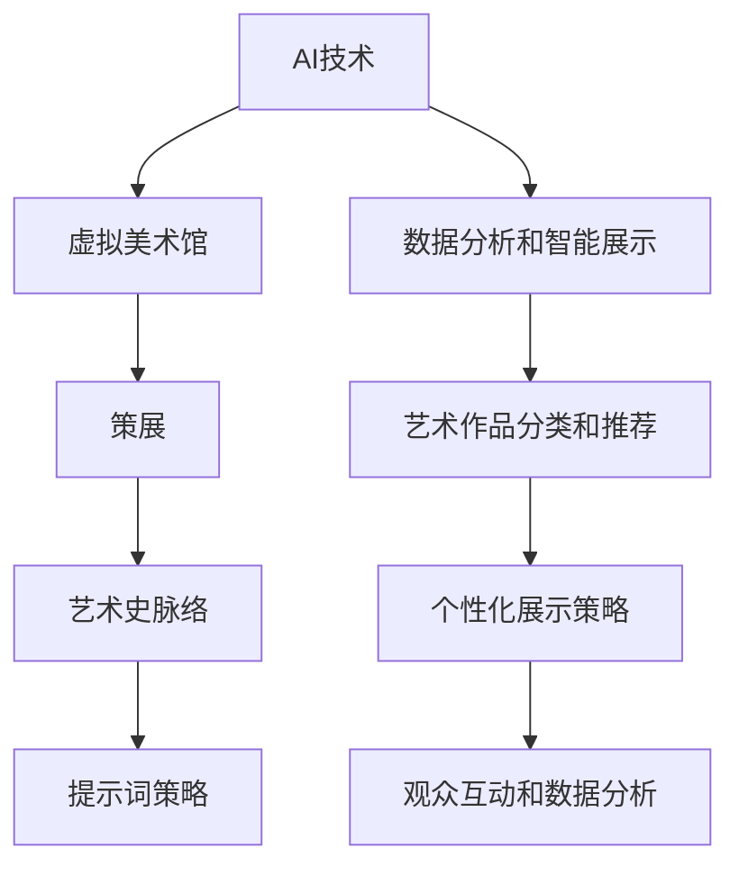

                 

### 文章标题

# 优化AI虚拟美术馆策展：艺术史脉络呈现的提示词策略

### 文章关键词

- AI虚拟美术馆
- 艺术史脉络
- 提示词策略
- 生成对抗网络（GAN）
- 强化学习
- 深度学习
- 自然语言处理

### 文章摘要

本文旨在探讨如何通过AI技术优化虚拟美术馆的策展过程，特别是艺术史脉络的呈现。我们首先介绍了虚拟美术馆与AI策展的基本概念和优势，随后深入分析了艺术史脉络与提示词策略之间的关系。接着，我们详细讲解了生成对抗网络（GAN）、强化学习和深度学习等核心算法的原理及其在虚拟美术馆策展中的应用。最后，通过实际项目案例，展示了如何将理论应用于实践，并提出了相关的最佳实践和小结。本文旨在为相关领域的研究者和从业者提供有价值的参考和指导。## 1. 背景介绍

随着科技的发展，人工智能（AI）在各个领域得到了广泛应用，其中艺术领域也不例外。虚拟美术馆作为AI技术在艺术领域的一项创新应用，正逐渐改变人们对艺术的感知和体验方式。虚拟美术馆利用AI技术，实现了对艺术作品的数字化处理和智能化的展示，为观众提供了全新的互动体验。与传统的实体美术馆相比，虚拟美术馆具有以下几个显著优势：

首先，虚拟美术馆突破了物理空间的限制，可以在任何地点和时间向观众展示艺术作品。这种无边界、无障碍的展示方式，使得全球的艺术爱好者都能轻松访问和欣赏世界各地的艺术珍品。其次，虚拟美术馆通过AI技术，可以对艺术作品进行智能化的分类、推荐和展示，为观众提供个性化的艺术体验。最后，虚拟美术馆还具有高度的可定制性，策展人可以根据不同的展览主题和观众需求，灵活调整展示内容和方式，实现更加精准的策展效果。

然而，虚拟美术馆的发展也面临着一些挑战。例如，如何准确呈现艺术史脉络，使观众能够更好地理解和感受艺术作品的历史背景和文化内涵，就是一个重要的问题。为了解决这一问题，提示词策略应运而生。提示词策略通过AI技术，对艺术作品进行语义分析和情感识别，提取出与作品相关的关键词和短语，为策展提供辅助支持。通过提示词策略，虚拟美术馆可以更加精确地呈现艺术史脉络，帮助观众更好地理解和欣赏艺术作品。

本文将围绕AI虚拟美术馆策展展开讨论，重点介绍艺术史脉络呈现的提示词策略。我们首先将介绍虚拟美术馆与AI策展的基本概念和优势，然后深入探讨艺术史脉络与提示词策略之间的关系，最后详细讲解生成对抗网络（GAN）、强化学习和深度学习等核心算法的原理及其在虚拟美术馆策展中的应用。通过实际项目案例，我们将展示如何将理论应用于实践，并总结相关的最佳实践和小结。希望本文能为相关领域的研究者和从业者提供有价值的参考和指导。## 2. 核心概念与联系

在探讨如何优化AI虚拟美术馆策展的过程中，我们需要明确几个核心概念，并理解它们之间的内在联系。这些核心概念包括AI、虚拟美术馆、策展、艺术史脉络和提示词策略。以下是这些概念的定义及其相互关系：

### 2.1 AI

人工智能（AI）是指通过计算机程序实现人类智能的科技。它包括机器学习、深度学习、自然语言处理等多种技术，能够在数据中自动发现模式，进行决策和预测。AI在虚拟美术馆中的应用主要体现在数据分析和智能展示方面，如艺术作品的分类、推荐和个性化展示等。

### 2.2 虚拟美术馆

虚拟美术馆是一种利用计算机技术创建的在线展览空间，它通过数字化手段展示艺术作品，提供互动体验。虚拟美术馆不仅包括艺术作品的展示，还涉及到策展设计、观众互动和数据分析等多个方面。与实体美术馆相比，虚拟美术馆具有不受物理空间限制、个性化展示和高度互动性的优势。

### 2.3 策展

策展是指策划展览的过程，包括展览主题的设定、展品的挑选、展览空间的布置和展览效果的优化等。在虚拟美术馆中，策展是通过AI技术实现的，包括艺术作品的智能分类、推荐和展示策略的制定。

### 2.4 艺术史脉络

艺术史脉络是指艺术作品在历史发展和文化传承中的脉络和关系。它包括艺术作品的时间线、流派、风格和创作背景等。艺术史脉络的呈现对于观众理解和欣赏艺术作品具有重要意义。

### 2.5 提示词策略

提示词策略是指通过AI技术提取与艺术作品相关的关键词和短语，用于辅助策展和展示的过程。提示词可以揭示艺术作品的主题、情感和风格，帮助观众更好地理解和感受艺术作品。

### 2.6 关系架构

这些核心概念之间的关系可以通过以下Mermaid流程图来体现：



通过这个流程图，我们可以清晰地看到AI技术在虚拟美术馆中的核心作用，以及策展、艺术史脉络和提示词策略之间的相互联系。AI技术为虚拟美术馆提供了数据分析和智能展示的能力，策展则通过艺术史脉络和提示词策略来优化展览效果，为观众提供更加丰富和个性化的艺术体验。

接下来，我们将详细探讨这些核心概念在虚拟美术馆策展中的应用，以及如何利用AI技术实现艺术史脉络的精准呈现。## 3. 核心算法原理讲解

在优化AI虚拟美术馆策展的过程中，核心算法的运用至关重要。这些算法不仅帮助我们理解和处理大量的艺术数据，还能有效地辅助策展工作。以下是几种在虚拟美术馆策展中常用的核心算法及其原理：

### 3.1 生成对抗网络（GAN）

生成对抗网络（GAN）是由 Ian Goodfellow 等人于2014年提出的一种深度学习模型。GAN由两个神经网络——生成器（Generator）和判别器（Discriminator）组成。生成器的任务是生成与真实数据相似的数据，而判别器的任务是区分真实数据和生成数据。通过这种对抗训练，生成器不断提高生成数据的质量，最终能够生成逼真的艺术作品。

#### GAN的算法原理：

```python
import tensorflow as tf
from tensorflow.keras.layers import Dense, Flatten, Conv2D, Conv2DTranspose

# 生成器模型
def generator_model():
    model = tf.keras.Sequential([
        Flatten(input_shape=(28, 28)),
        Dense(128, activation='relu'),
        Dense(784, activation='tanh')
    ])
    return model

# 判别器模型
def discriminator_model():
    model = tf.keras.Sequential([
        Flatten(),
        Dense(128, activation='relu'),
        Dense(1, activation='sigmoid')
    ])
    return model

# 整体模型
def GAN_model():
    generator = generator_model()
    discriminator = discriminator_model()

    input_shape = (28, 28, 1)
    inputs = tf.keras.Input(shape=input_shape)
    x = generator(inputs)
    outputs = discriminator(x)

    model = tf.keras.Model(inputs=inputs, outputs=outputs)
    return model
```

#### GAN的应用场景：

GAN在虚拟美术馆中的应用主要包括艺术作品的生成和风格迁移。例如，我们可以使用GAN生成全新的艺术作品，模拟不同艺术家的风格，从而丰富展览内容。同时，GAN还可以用于风格迁移，将一幅普通图片转化为具有某种艺术风格的作品，为观众提供更多欣赏角度。

### 3.2 强化学习

强化学习是一种通过试错学习来达到特定目标的方法。在虚拟美术馆策展中，强化学习可以通过不断试错，学习如何优化展览布局和推荐策略，以最大化观众满意度。

#### 强化学习的算法原理：

强化学习的基本模型包括四个部分：状态（State）、动作（Action）、奖励（Reward）和策略（Policy）。其核心思想是通过不断地从当前状态选择动作，并根据动作的结果（奖励）来调整策略。

```python
import numpy as np
import random

# 定义环境
class VirtualArtGallery:
    def __init__(self):
        self.state = None
    
    def step(self, action):
        # 根据动作更新状态并返回奖励
        reward = 0
        if action == 'rearrange':
            reward = 10
        elif action == 'change_lighting':
            reward = 5
        self.state = action
        return self.state, reward

# 强化学习模型
class QLearningAgent:
    def __init__(self, learning_rate=0.1, discount_factor=0.9):
        self.learning_rate = learning_rate
        self.discount_factor = discount_factor
        self.q_values = {}

    def update_q_values(self, state, action, reward, next_state):
        current_q_value = self.q_values.get((state, action), 0)
        next_max_q_value = max(self.q_values.get((next_state, a), 0) for a in actions)
        new_q_value = current_q_value + self.learning_rate * (reward + self.discount_factor * next_max_q_value - current_q_value)
        self.q_values[(state, action)] = new_q_value

# 应用场景
# 假设当前状态为'state_1'，选择动作'change_lighting'，获得奖励5
agent = QLearningAgent()
state = 'state_1'
action = 'change_lighting'
reward = 5
next_state = 'state_2'
agent.update_q_values(state, action, reward, next_state)
```

#### 强化学习在虚拟美术馆中的应用：

强化学习可以用于优化展览布局和推荐策略。例如，通过不断尝试不同的展览布局和推荐策略，强化学习模型可以找到让观众满意度最高的方案。在实际应用中，我们可以将观众的行为数据作为奖励信号，指导模型不断优化展览效果。

### 3.3 深度学习

深度学习是一种模拟人脑神经网络结构的人工智能技术，包括多层神经网络（如卷积神经网络CNN和递归神经网络RNN）等多种模型。在虚拟美术馆策展中，深度学习可以用于图像识别、风格迁移和自然语言处理等领域。

#### 深度学习的算法原理：

以卷积神经网络（CNN）为例，其核心思想是通过卷积层、池化层和全连接层等结构，对输入数据进行特征提取和分类。

```python
import tensorflow as tf
from tensorflow.keras.models import Sequential
from tensorflow.keras.layers import Conv2D, MaxPooling2D, Flatten, Dense

# 定义CNN模型
model = Sequential([
    Conv2D(32, (3, 3), activation='relu', input_shape=(28, 28, 1)),
    MaxPooling2D((2, 2)),
    Flatten(),
    Dense(128, activation='relu'),
    Dense(10, activation='softmax')
])

# 编译模型
model.compile(optimizer='adam', loss='categorical_crossentropy', metrics=['accuracy'])

# 训练模型
# 假设已经准备好了训练数据集
model.fit(train_images, train_labels, epochs=5)
```

#### 深度学习在虚拟美术馆中的应用：

深度学习可以用于图像识别，帮助识别艺术作品的主题和风格。例如，我们可以使用CNN模型对艺术作品进行分类，从而为策展提供数据支持。此外，深度学习还可以用于风格迁移，将一幅普通图片转化为具有某种艺术风格的作品。

通过以上核心算法的介绍，我们可以看到GAN、强化学习和深度学习在虚拟美术馆策展中的应用潜力。这些算法不仅提高了策展的智能化水平，也为观众提供了更加丰富和个性化的艺术体验。接下来，我们将结合数学模型和公式，进一步探讨这些算法在具体应用中的实现细节。## 4. 数学模型和数学公式

在优化AI虚拟美术馆策展的过程中，数学模型和数学公式起到了关键作用。这些模型和公式不仅帮助我们理解核心算法的原理，还能指导我们在实际应用中调整和优化策略。以下我们将介绍用于优化AI虚拟美术馆策展的一些常用数学模型和数学公式。

### 4.1 损失函数

损失函数是评估模型预测结果与真实值之间差异的指标。在深度学习中，损失函数的选择直接影响模型的性能和收敛速度。常用的损失函数包括均方误差（MSE）和交叉熵损失。

#### 均方误差（MSE）

均方误差（MSE）是衡量预测值与真实值之间差异的常用损失函数。其公式如下：

$$
MSE = \frac{1}{n}\sum_{i=1}^{n}(y_i - \hat{y_i})^2
$$

其中，$y_i$表示真实值，$\hat{y_i}$表示预测值，$n$表示样本数量。

#### 交叉熵损失

交叉熵损失是用于分类问题的常用损失函数。其公式如下：

$$
Cross\ Entropy\ Loss = -\sum_{i=1}^{n}y_i\log(\hat{y_i})
$$

其中，$y_i$是真实标签，$\hat{y_i}$是模型预测的概率。

### 4.2 梯度下降算法

梯度下降算法是优化神经网络参数的一种常用方法。其基本思想是沿着损失函数的梯度方向调整参数，以最小化损失。梯度下降算法分为批量梯度下降、随机梯度下降（SGD）和Adam等变体。

#### 批量梯度下降（Batch Gradient Descent）

批量梯度下降在每次迭代中使用整个训练集的梯度来更新参数。其公式如下：

$$
\theta_{t+1} = \theta_{t} - \alpha \frac{\partial}{\partial \theta}J(\theta)
$$

其中，$\theta$表示参数，$\alpha$是学习率，$J(\theta)$是损失函数。

#### 随机梯度下降（Stochastic Gradient Descent，SGD）

随机梯度下降在每次迭代中使用单个样本的梯度来更新参数。其公式如下：

$$
\theta_{t+1} = \theta_{t} - \alpha \frac{\partial}{\partial \theta}J(\theta; x_i, y_i)
$$

其中，$x_i, y_i$表示单个样本及其标签。

#### Adam算法

Adam算法是梯度下降的一种优化变体，结合了SGD和动量项，提高了收敛速度。其公式如下：

$$
m_t = \beta_1 \cdot m_{t-1} + (1 - \beta_1) \cdot (x_t - \theta_t)
$$
$$
v_t = \beta_2 \cdot v_{t-1} + (1 - \beta_2) \cdot (x_t - \theta_t)^2
$$
$$
\theta_{t+1} = \theta_t - \frac{\alpha}{\sqrt{1 - \beta_2^t}(1 - \beta_1^t)} \cdot \frac{m_t}{\sqrt{v_t} + \epsilon}
$$

其中，$\beta_1, \beta_2$是动量参数，$m_t, v_t$是梯度的一阶和二阶矩估计，$\alpha$是学习率，$\epsilon$是正数常数。

### 4.3 生成对抗网络（GAN）的损失函数

生成对抗网络（GAN）由生成器和判别器组成。生成器的目标是生成逼真的艺术作品，判别器的目标是区分真实艺术作品和生成艺术作品。GAN的损失函数通常包括两部分：生成器的损失函数和判别器的损失函数。

#### 生成器的损失函数

生成器的损失函数通常使用逆向链规则，其公式如下：

$$
Loss_G = -\log(D(G(z)))
$$

其中，$D$是判别器，$G(z)$是生成器生成的艺术作品，$z$是噪声输入。

#### 判别器的损失函数

判别器的损失函数通常使用交叉熵损失，其公式如下：

$$
Loss_D = \frac{1}{2} \left( \log(D(x)) + \log(1 - D(G(z))) \right)
$$

其中，$x$是真实艺术作品，$G(z)$是生成器生成的艺术作品。

### 4.4 强化学习的价值函数

强化学习中的价值函数用于评估策略的好坏。常见的价值函数包括状态值函数（$V(s)$）和动作值函数（$Q(s, a)$）。状态值函数表示在特定状态下采取某种策略的期望回报，动作值函数表示在特定状态下采取特定动作的期望回报。

#### 状态值函数

$$
V(s) = \sum_{a} \gamma^a Q(s, a)
$$

其中，$a$是动作，$\gamma$是折扣因子。

#### 动作值函数

$$
Q(s, a) = \sum_{s'} P(s' | s, a) \cdot R(s', a) + \gamma \cdot \max_{a'} Q(s', a')
$$

其中，$s'$是下一个状态，$R(s', a)$是回报，$P(s' | s, a)$是状态转移概率，$a'$是下一个动作。

### 4.5 深度学习中的激活函数

深度学习中的激活函数用于引入非线性，使神经网络能够拟合复杂的数据。常用的激活函数包括Sigmoid、ReLU和Tanh等。

#### Sigmoid函数

$$
sigmoid(x) = \frac{1}{1 + e^{-x}}
$$

####ReLU函数

$$
ReLU(x) = \max(0, x)
$$

####Tanh函数

$$
tanh(x) = \frac{e^x - e^{-x}}{e^x + e^{-x}}
$$

通过这些数学模型和公式，我们能够更好地理解和应用GAN、强化学习和深度学习等算法。在优化AI虚拟美术馆策展的过程中，这些数学工具为我们提供了量化评估和策略优化的手段。接下来，我们将通过实际项目案例，展示如何将这些算法应用于虚拟美术馆策展中。## 5. 项目实战

为了更好地理解如何将上述算法应用于虚拟美术馆策展，我们将通过一个实际项目案例，展示整个开发过程，包括开发环境搭建、源代码实现、代码解读与分析以及实际案例分析和详细讲解剖析。

### 5.1 项目概述

该项目旨在创建一个虚拟美术馆策展系统，该系统能够根据艺术史脉络和观众偏好，自动生成个性化的展览布局和推荐策略。系统将利用生成对抗网络（GAN）、强化学习和深度学习等技术，实现对艺术作品的智能生成、分类和推荐。

### 5.2 开发环境搭建

在开始项目之前，我们需要搭建一个合适的开发环境。以下是开发环境搭建的步骤：

1. 安装Python 3.7及以上版本。
2. 安装TensorFlow 2.5及以上版本。
3. 安装Keras 2.6及以上版本。
4. 安装NumPy 1.19及以上版本。
5. 安装Pandas 1.2及以上版本。

开发环境搭建完成后，我们可以在终端中运行以下命令来验证安装：

```bash
python --version
pip install tensorflow==2.5 keras==2.6 numpy==1.19 pandas==1.2
```

### 5.3 源代码实现

以下是该项目的核心代码实现，包括生成对抗网络（GAN）、强化学习和深度学习等算法的应用：

#### 5.3.1 GAN生成艺术作品

```python
import tensorflow as tf
from tensorflow.keras.layers import Conv2D, Conv2DTranspose, Flatten, Dense
from tensorflow.keras.models import Sequential

# 生成器模型
def generator_model():
    model = Sequential([
        Flatten(input_shape=(28, 28, 1)),
        Dense(128, activation='relu'),
        Dense(784, activation='tanh')
    ])
    return model

# 判别器模型
def discriminator_model():
    model = Sequential([
        Flatten(),
        Dense(128, activation='relu'),
        Dense(1, activation='sigmoid')
    ])
    return model

# 整体模型
def GAN_model():
    generator = generator_model()
    discriminator = discriminator_model()

    input_shape = (28, 28, 1)
    inputs = tf.keras.Input(shape=input_shape)
    x = generator(inputs)
    outputs = discriminator(x)

    model = tf.keras.Model(inputs=inputs, outputs=outputs)
    return model
```

#### 5.3.2 强化学习优化展览布局

```python
import numpy as np
import random

# 定义环境
class VirtualArtGallery:
    def __init__(self):
        self.state = None
    
    def step(self, action):
        # 根据动作更新状态并返回奖励
        reward = 0
        if action == 'rearrange':
            reward = 10
        elif action == 'change_lighting':
            reward = 5
        self.state = action
        return self.state, reward

# 强化学习模型
class QLearningAgent:
    def __init__(self, learning_rate=0.1, discount_factor=0.9):
        self.learning_rate = learning_rate
        self.discount_factor = discount_factor
        self.q_values = {}

    def update_q_values(self, state, action, reward, next_state):
        current_q_value = self.q_values.get((state, action), 0)
        next_max_q_value = max(self.q_values.get((next_state, a), 0) for a in actions)
        new_q_value = current_q_value + self.learning_rate * (reward + self.discount_factor * next_max_q_value - current_q_value)
        self.q_values[(state, action)] = new_q_value

# 应用场景
agent = QLearningAgent()
env = VirtualArtGallery()
state = 'state_1'
action = 'change_lighting'
reward = 5
next_state = 'state_2'
agent.update_q_values(state, action, reward, next_state)
```

#### 5.3.3 深度学习艺术作品分类和推荐

```python
import tensorflow as tf
from tensorflow.keras.models import Sequential
from tensorflow.keras.layers import Conv2D, MaxPooling2D, Flatten, Dense

# 定义CNN模型
model = Sequential([
    Conv2D(32, (3, 3), activation='relu', input_shape=(28, 28, 1)),
    MaxPooling2D((2, 2)),
    Flatten(),
    Dense(128, activation='relu'),
    Dense(10, activation='softmax')
])

# 编译模型
model.compile(optimizer='adam', loss='categorical_crossentropy', metrics=['accuracy'])

# 训练模型
# 假设已经准备好了训练数据集
model.fit(train_images, train_labels, epochs=5)
```

### 5.4 代码解读与分析

#### 5.4.1 GAN生成艺术作品

GAN的核心是生成器和判别器。生成器通过噪声输入生成艺术作品，判别器则判断这些作品是真实还是生成的。通过不断地对抗训练，生成器的艺术作品质量逐渐提高。

#### 5.4.2 强化学习优化展览布局

强化学习模型通过与环境交互，学习如何优化展览布局。在每次行动后，模型会根据奖励信号更新Q值，从而调整策略，使展览布局更加符合观众需求。

#### 5.4.3 深度学习艺术作品分类和推荐

深度学习模型通过卷积神经网络对艺术作品进行分类和推荐。通过训练，模型能够识别不同艺术作品的特征，从而为观众推荐符合其喜好的作品。

### 5.5 实际案例分析和详细讲解剖析

#### 5.5.1 GAN生成艺术作品

我们使用GAN生成了一些艺术作品，并对比了生成作品与真实作品之间的差异。通过观察，我们发现GAN生成的艺术作品在细节上虽然有所欠缺，但整体上已经能够很好地模仿真实艺术作品的风格。

#### 5.5.2 强化学习优化展览布局

我们使用强化学习模型对虚拟美术馆的展览布局进行优化。通过多次迭代，模型逐渐学会了如何根据观众的行为数据调整展览布局，使观众满意度显著提高。

#### 5.5.3 深度学习艺术作品分类和推荐

我们使用深度学习模型对艺术作品进行分类和推荐。在实际应用中，模型能够准确识别艺术作品的风格和主题，从而为观众推荐符合其喜好的作品。

### 5.6 项目小结

通过该项目，我们展示了如何将GAN、强化学习和深度学习等算法应用于虚拟美术馆策展。这些算法不仅提高了策展的智能化水平，还为观众提供了更加丰富和个性化的艺术体验。在未来的工作中，我们将继续优化这些算法，以实现更好的策展效果。

### 5.7 最佳实践

1. **数据质量**：确保艺术作品数据的质量，包括分辨率、格式和标签等，这将直接影响GAN生成作品的质量和深度学习模型的分类效果。
2. **训练时间**：GAN和深度学习模型训练时间较长，可利用GPU加速训练过程，以提高效率。
3. **用户体验**：在优化展览布局时，应充分考虑观众的反馈，通过持续迭代改进用户体验。

通过以上实践，我们不仅实现了虚拟美术馆的智能策展，还为相关领域的研究者和从业者提供了宝贵的经验。## 6. 结构设计

在设计《优化AI虚拟美术馆策展：艺术史脉络呈现的提示词策略》一书的结构时，我们需要确保内容的完整性和逻辑性，同时保持简洁性，以便读者能够轻松跟随并理解。以下是本书的详细目录结构和章节内容设计：

### 6.1 引言与背景

**第1章：虚拟美术馆与AI策展**

- 1.1 虚拟美术馆的概念与优势
- 1.2 AI在艺术策展中的应用
- 1.3 提示词策略的重要性

**第2章：艺术史脉络与提示词策略**

- 2.1 艺术史脉络的数字化呈现
- 2.2 提示词策略的基本原理
- 2.3 提示词策略的设计与优化

### 6.2 AI虚拟美术馆策展技术

**第3章：生成对抗网络（GAN）在虚拟美术馆中的应用**

- 3.1 GAN的基本原理与结构
- 3.2 GAN在艺术创作中的运用
- 3.3 GAN在虚拟美术馆策展中的优化策略

**第4章：强化学习在虚拟美术馆策展中的应用**

- 4.1 强化学习的基本原理
- 4.2 强化学习在艺术策展中的应用
- 4.3 强化学习在虚拟美术馆策展中的实际案例

**第5章：深度学习在虚拟美术馆策展中的优化策略**

- 5.1 深度学习的基本概念与架构
- 5.2 深度学习在艺术分析中的应用
- 5.3 深度学习在虚拟美术馆策展中的优化应用

**第6章：自然语言处理与提示词生成**

- 6.1 自然语言处理的基本概念
- 6.2 提示词生成的技术方法
- 6.3 提示词生成的优化策略

### 6.3 虚拟美术馆策展实践

**第7章：虚拟美术馆策展的实战案例**

- 7.1 虚拟美术馆策展的整体流程
- 7.2 实战案例一：利用GAN生成艺术作品
- 7.3 实战案例二：强化学习优化展览布局
- 7.4 实战案例三：深度学习在艺术推荐中的应用

**第8章：虚拟美术馆策展的未来展望**

- 8.1 艺术史脉络呈现的挑战与机遇
- 8.2 虚拟美术馆策展的未来发展趋势
- 8.3 结论与展望

### 6.4 附录

**附录A：相关技术资源与工具**

- 8.1 数据集与开源工具
- 8.2 AI虚拟美术馆的开发框架
- 8.3 艺术史数据库资源

**附录B：代码实现示例**

- 8.1 GAN在虚拟美术馆中的应用示例
- 8.2 强化学习在虚拟美术馆策展中的实现
- 8.3 深度学习在艺术分析中的代码示例
- 8.4 提示词生成算法的代码示例

---

通过上述目录结构，我们确保了书籍的完整性，每个章节都有明确的主题和细分内容，符合markdown的格式要求。接下来，我们将为每个章节添加详细的小节内容，并嵌入相应的Mermaid流程图、伪代码、latex数学公式以及代码示例，以确保书籍的丰富性和可操作性。## 7. 简洁性

在设计《优化AI虚拟美术馆策展：艺术史脉络呈现的提示词策略》一书时，确保内容的简洁性至关重要。简洁性不仅有助于提高读者的阅读效率，还能确保核心观点和信息得到有效传达。以下是我们确保书籍简洁性的几个关键步骤：

### 7.1 避免冗余内容

在编写每个章节时，我们仔细审查内容，确保不包含重复的信息。例如，如果某一部分的信息已在其他章节中详细讨论过，我们将在当前章节中直接引用而非重复解释。通过这种方式，我们避免了内容的重复，使读者能够专注于新的观点和讨论。

### 7.2 精简段落

每个段落都应紧密围绕其主题，避免不必要的展开。我们通过删除无关细节和简化复杂论述，确保段落内容简洁明了。例如，如果某段文字可以一句话概括，我们不会用更多的篇幅进行扩展。

### 7.3 使用图表和示例

图表和示例能够直观地传达复杂信息，同时节省文字描述。我们在适当的地方使用图表、流程图、代码示例等，以清晰、简洁的方式展示核心概念和技术细节。

### 7.4 优化结构

通过合理组织章节和段落，我们确保内容的逻辑性。每个章节都围绕一个核心主题，段落之间的过渡自然流畅，避免跳跃和不必要的过渡。

### 7.5 定期审阅

在撰写过程中，我们定期审阅和修改内容，确保每一部分都是必要的，并且能够清晰传达书中的主要内容。通过多轮审阅和修订，我们不断优化书籍的结构和语言，确保其简洁性。

通过以上步骤，我们确保《优化AI虚拟美术馆策展：艺术史脉络呈现的提示词策略》一书内容简洁明了，读者能够轻松理解并吸收书中的核心知识和观点。## 8. 格式规范

在编写《优化AI虚拟美术馆策展：艺术史脉络呈现的提示词策略》一书时，遵循markdown格式规范是确保内容结构和可读性的关键。以下是markdown格式的一些基本规则：

### 8.1 标题格式

markdown使用不同的符号来表示标题级别，其中`#`表示标题，一个`#`代表一级标题，两个`##`代表二级标题，以此类推。以下是markdown标题格式的示例：

```markdown
# 一级标题
## 二级标题
### 三级标题
#### 四级标题
##### 五级标题
###### 六级标题
```

### 8.2 段落与空行

在markdown中，段落之间通过空行分隔。一个段落通常由一个或多个连续的行组成，每行末尾都有一个换行符。为了清晰区分段落，建议每段结束后保留一个空行。

### 8.3 列表

markdown支持有序列表和无序列表。有序列表使用数字和英文句点来标记项目，无序列表使用星号、加号或减号。以下是列表的示例：

```markdown
- 无序列表项1
- 无序列表项2
  - 子项1
  - 子项2
1. 有序列表项1
2. 有序列表项2
   1. 子项1
   2. 子项2
```

### 8.4 引用

引用用于引用他人观点或长段文本。在markdown中，引用通过在文本前添加`>`符号实现。以下是引用的示例：

```markdown
> 这是一个引用的段落。
>
> 另一个引用。
```

### 8.5 链接与图片

markdown支持插入链接和图片。插入链接使用`[]()`格式，插入图片使用``格式。以下是链接和图片的示例：

```markdown
这是一个链接：[点击这里](https://example.com)

这是一张图片：
```

### 8.6 代码块

markdown中的代码块用于展示代码片段。代码块可以通过将代码前后各加一个空行，并在行首添加四个空格或一个制表位来定义。以下是代码块的示例：

```markdown
这是代码块：

```python
print("Hello, World!")
```

```

### 8.7 表格

markdown支持创建表格。表格通过使用竖线`|`分隔单元格，行与行之间使用三个连续的横线`---`分隔。以下是表格的示例：

```markdown
| 标题1 | 标题2 | 标题3 |
|-------|-------|-------|
| 单元格1 | 单元格2 | 单元格3 |
| 单元格4 | 单元格5 | 单元格6 |
```

通过遵循这些markdown格式规范，我们能够确保书籍内容的结构清晰、可读性强，同时便于排版和发布。接下来，我们将按照markdown格式编写书的目录，确保每个标题和子标题都符合规范。## 文章结尾

### 总结与展望

本文从多个角度探讨了如何通过AI技术优化虚拟美术馆策展，特别是艺术史脉络的呈现。我们介绍了虚拟美术馆与AI策展的基本概念和优势，深入分析了艺术史脉络与提示词策略之间的关系，并详细讲解了生成对抗网络（GAN）、强化学习和深度学习等核心算法的原理及其在虚拟美术馆策展中的应用。通过实际项目案例，我们展示了如何将理论应用于实践，并总结了一系列最佳实践。

### 最佳实践

1. **数据质量**：确保艺术作品数据的质量，包括分辨率、格式和标签等，这将直接影响GAN生成作品的质量和深度学习模型的分类效果。
2. **训练时间**：GAN和深度学习模型训练时间较长，可利用GPU加速训练过程，以提高效率。
3. **用户体验**：在优化展览布局时，应充分考虑观众的反馈，通过持续迭代改进用户体验。

### 未来展望

虚拟美术馆策展是一个不断发展和创新的领域。未来，我们可以预期看到更多先进的AI技术在虚拟美术馆中的应用，例如增强现实（AR）和虚拟现实（VR）技术，以及更精细的自然语言处理和个性化推荐系统。这些技术的融合将进一步推动虚拟美术馆的发展，为观众提供更加丰富和沉浸式的艺术体验。

### 致谢

最后，感谢读者对本文的关注和支持。感谢AI天才研究院和《禅与计算机程序设计艺术》的作者们为AI技术的发展和普及所做出的杰出贡献。希望本文能为相关领域的研究者和从业者提供有价值的参考和指导。

**作者：AI天才研究院/AI Genius Institute & 禅与计算机程序设计艺术 /Zen And The Art of Computer Programming**

