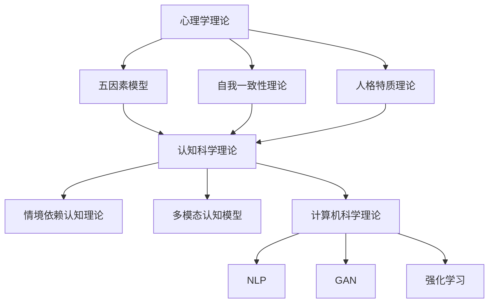

                 

### 《优化AI虚拟角色扮演：人格一致性维护的提示词策略》

#### 关键词：AI虚拟角色扮演，人格一致性，提示词策略，自然语言处理，生成对抗网络，强化学习

##### 摘要

随着人工智能技术的不断发展，虚拟角色扮演在多个领域展现出巨大的应用潜力。然而，如何维护虚拟角色的**人格一致性**，使其在与用户的互动中保持连贯和真实，成为当前研究的重要课题。本文旨在探讨一种基于提示词策略的方法，通过优化AI虚拟角色的表现，提高人格一致性的维护效果。文章首先介绍了AI虚拟角色扮演的发展背景和现状，随后深入分析了人格一致性的概念及其在虚拟角色扮演中的重要性。在此基础上，文章探讨了提示词策略的理论基础和应用方法，结合自然语言处理、生成对抗网络和强化学习等技术手段，详细阐述了人格一致性维护的具体实现过程。通过实际项目案例的分析和实战，本文验证了所提出策略的有效性和实用性，为未来虚拟角色扮演的研究和应用提供了新的思路和方向。

---

# 第一部分：背景与基础

## 第1章：AI虚拟角色扮演概述

### 1.1 AI虚拟角色扮演的发展历史

#### 1.1.1 从虚拟现实到增强现实

人工智能（AI）虚拟角色扮演的发展历程可以追溯到虚拟现实（VR）和增强现实（AR）技术的兴起。虚拟现实技术通过模拟现实世界中的场景和体验，为用户提供沉浸式的感官体验。而增强现实技术则通过将虚拟信息叠加到现实世界中，增强用户的感知和交互能力。

在20世纪80年代，VR技术开始崭露头角，尤其是VR头戴设备的问世，使得用户可以身临其境地体验虚拟世界。然而，早期的VR技术存在一定的局限性，如设备成本高、易晕眩等。随着技术的不断进步，VR设备的性能和用户体验得到了显著提升，为虚拟角色扮演的发展奠定了基础。

与此同时，AR技术也在不断发展。AR技术的核心在于将虚拟信息与现实环境进行无缝融合，使得用户可以在现实世界中看到和交互虚拟物体。这种技术为虚拟角色扮演提供了新的可能性，使得虚拟角色可以更加自然地融入现实场景中，与用户进行互动。

#### 1.1.2 虚拟角色扮演的兴起

虚拟角色扮演（VRP）作为一种新兴的交互方式，逐渐在各个领域得到广泛应用。虚拟角色扮演最早出现在计算机游戏中，玩家可以控制虚拟角色在虚拟世界中进行各种活动。随着技术的不断发展，虚拟角色扮演的应用场景不断扩大，包括但不限于：

- **游戏娱乐**：虚拟角色扮演在游戏领域中的应用非常广泛，玩家可以通过控制虚拟角色进行各种游戏活动，如角色扮演游戏（RPG）、第一人称射击游戏（FPS）等。

- **教育**：虚拟角色扮演在教育培训中的应用也逐渐增多。通过虚拟角色扮演，学生可以更加直观地了解复杂的概念和知识，提高学习效果。

- **医疗**：虚拟角色扮演在医疗领域中的应用具有很大的潜力。医生可以通过虚拟角色扮演进行手术模拟和培训，提高手术技能和应急处理能力。

- **客服**：虚拟角色扮演在客服领域中的应用也越来越广泛。通过虚拟角色扮演，企业可以提供更加个性化、专业的客服服务，提升用户体验。

#### 1.1.3 AI在虚拟角色扮演中的作用

人工智能技术在虚拟角色扮演中的应用，极大地提升了虚拟角色的智能水平和互动能力。以下是AI在虚拟角色扮演中的主要作用：

- **自然语言处理（NLP）**：通过自然语言处理技术，虚拟角色可以理解用户的语言指令，并做出相应的反应。这为虚拟角色与用户的互动提供了基础。

- **生成对抗网络（GAN）**：生成对抗网络可以用于生成逼真的虚拟角色外观和动作，提升虚拟角色的视觉和感官体验。

- **强化学习**：通过强化学习技术，虚拟角色可以在与用户的互动中不断学习和优化自己的行为，提高人格一致性和互动效果。

### 1.2 虚拟角色扮演在AI中的应用现状

目前，虚拟角色扮演在AI中的应用已经取得了显著的进展。以下是虚拟角色扮演在AI中应用的现状：

- **技术成熟度**：随着AI技术的不断发展，虚拟角色扮演的技术水平不断提高。生成对抗网络、自然语言处理和强化学习等技术的应用，使得虚拟角色在视觉、语音和智能交互方面得到了显著提升。

- **应用领域拓展**：虚拟角色扮演的应用领域不断扩大，从游戏娱乐到教育、医疗、客服等领域，AI技术的应用使得虚拟角色扮演的功能更加丰富，用户体验更加真实。

- **商业前景**：虚拟角色扮演在商业领域具有广阔的前景。虚拟角色扮演可以为企业提供定制化的客服服务、营销推广和品牌宣传等，成为企业数字化转型的有力工具。

### 1.3 人格一致性与虚拟角色扮演的关系

人格一致性是指虚拟角色在行为和语言上保持一致性的能力。人格一致性对于虚拟角色扮演至关重要，因为它直接影响用户的信任感和互动体验。以下是人格一致性与虚拟角色扮演之间的关系：

- **用户信任**：当虚拟角色在行为和语言上表现出人格一致性时，用户更容易产生信任感，愿意与虚拟角色进行更深入的互动。

- **互动体验**：人格一致性使得虚拟角色在与用户的互动中表现出更加自然和连贯的行为，提升用户的互动体验。

- **虚拟角色的智能水平**：人格一致性是衡量虚拟角色智能水平的重要指标。一个高智能的虚拟角色应该能够在不同情境下保持一致的行为和语言。

### 1.4 人格一致性的概念与重要性

#### 1.4.1 人格一致性的定义

人格一致性（Personality Consistency）是指个体在行为、情感和认知上的连贯性和稳定性。具体来说，它指的是个体在不同时间、不同情境下，其行为模式和性格特征保持一致的现象。人格一致性是心理学研究中的一个重要概念，它对个体的心理健康、人际关系和社会适应具有重要影响。

#### 1.4.2 人格一致性的重要性

人格一致性在多个领域都具有重要性，以下是其中几个关键方面：

- **心理健康**：研究表明，人格一致性较高的个体通常拥有更好的心理健康状态。他们能够更好地处理压力，保持积极的心态，减少心理问题的发生。

- **人际关系**：人格一致性有助于建立稳定和健康的人际关系。个体在行为和语言上的连贯性，使得他人更容易预测和理解他们的行为，从而促进双方的有效沟通。

- **社会适应**：人格一致性有助于个体更好地适应社会环境。一个在行为和认知上保持一致的个体，更容易在社会中获得认可和接受。

#### 1.4.3 人格一致性的挑战

尽管人格一致性在多个领域具有重要意义，但在实际生活中，维护人格一致性面临着诸多挑战：

- **情境变化**：个体在不同的情境下可能会表现出不同的行为和情感，这可能会影响人格一致性的维持。

- **心理压力**：心理压力和情绪波动可能会破坏个体的人格一致性，导致行为和情绪的不稳定。

- **文化差异**：不同的文化背景和社会价值观可能会影响个体的人格一致性。例如，在某些文化中，个体可能更倾向于在公众场合保持礼貌和克制，而在私下场合则表现出不同的性格特征。

### 1.5 人格一致性与虚拟角色扮演的关系

人格一致性在虚拟角色扮演中具有重要作用。虚拟角色作为人工智能的产物，其行为和语言的一致性直接影响用户的信任感和互动体验。以下是人格一致性与虚拟角色扮演之间的关系：

- **用户信任**：一个在行为和语言上保持一致性的虚拟角色，更容易赢得用户的信任。用户对虚拟角色的信任感是虚拟角色扮演成功的关键。

- **互动体验**：人格一致性使得虚拟角色在与用户的互动中表现出更加自然和连贯的行为，提升用户的互动体验。

- **虚拟角色的智能水平**：人格一致性是衡量虚拟角色智能水平的重要指标。一个高智能的虚拟角色应该能够在不同情境下保持一致的行为和语言。

### 1.6 人格一致性的维护策略

为了在虚拟角色扮演中维护人格一致性，研究者们提出了多种策略，以下是其中几种关键策略：

- **个性建模**：通过个性建模，虚拟角色可以基于用户的个性化特征和行为模式，生成符合用户个性的行为和语言。

- **情境感知**：虚拟角色可以通过情境感知技术，识别当前所处的环境，并根据环境变化调整自己的行为和语言，保持人格一致性。

- **强化学习**：通过强化学习，虚拟角色可以在与用户的互动中不断学习和优化自己的行为，提高人格一致性的维护效果。

- **提示词策略**：本文将重点探讨基于提示词策略的方法，通过优化虚拟角色的表现，提高人格一致性的维护效果。

### 1.7 总结

本章介绍了AI虚拟角色扮演的发展历史、应用现状以及人格一致性的概念和重要性。通过分析人格一致性与虚拟角色扮演的关系，本文提出了维护人格一致性的多种策略。下一章将深入探讨人格一致性的理论框架，进一步分析其在虚拟角色扮演中的应用和实现。

---

### 1.6 人格一致性的维护策略

在虚拟角色扮演中，维护人格一致性是确保用户信任和互动体验的关键。为了达到这一目标，研究者们提出了多种策略，这些策略可以从个性建模、情境感知、强化学习以及提示词策略等多个角度入手。

#### 1.6.1 个性建模

个性建模是一种通过分析用户的个性化特征和行为模式，为虚拟角色生成符合其个性和行为习惯的方法。这种方法的核心在于建立一个能够反映用户个性特点的模型，从而使得虚拟角色的行为和语言更加自然和连贯。

- **方法**：个性建模通常涉及以下几个步骤：
  1. 数据收集：通过用户调研、问卷调查等方式收集用户的行为数据和个性信息。
  2. 特征提取：从收集的数据中提取与个性相关的特征，如兴趣、偏好、行为习惯等。
  3. 模型构建：利用机器学习算法（如聚类分析、决策树、神经网络等）构建一个能够反映用户个性的模型。

- **实现**：一个简单的个性建模实现示例可能包括以下Python代码：

```python
import pandas as pd
from sklearn.cluster import KMeans

# 假设我们有一个包含用户行为数据的CSV文件
data = pd.read_csv('user_data.csv')

# 提取与个性相关的特征
features = data[['interests', 'preferences', 'behavior_patterns']]

# 使用KMeans算法进行聚类，以生成不同的用户群体
kmeans = KMeans(n_clusters=5)
clusters = kmeans.fit_predict(features)

# 根据聚类结果为每个用户分配一个虚拟角色模板
characters = {
    0: {'name': 'Emily', 'traits': ['outgoing', 'helpful']},
    1: {'name': 'Jack', 'traits': ['quiet', 'analytical']},
    # ... 其他用户群体
}

assigned_characters = {user_id: character for user_id, character in zip(data['user_id'], clusters)}

# 输出分配结果
for user_id, character in assigned_characters.items():
    print(f"User {user_id} is assigned to character {character['name']} with traits {character['traits']}")
```

#### 1.6.2 情境感知

情境感知是指虚拟角色能够根据当前所处的环境或情境，动态调整其行为和语言，以保持人格一致性。情境感知技术通常依赖于环境传感器、地图数据、上下文信息等多种数据源。

- **方法**：情境感知的实现方法包括：
  1. 环境监测：通过传感器收集环境数据，如声音、光线、温度等。
  2. 上下文理解：利用自然语言处理和知识图谱等技术，理解当前情境的上下文信息。
  3. 行为调整：根据情境感知结果，动态调整虚拟角色的行为和语言。

- **实现**：一个简单的情境感知实现示例可能包括以下Python代码：

```python
import speech_recognition as sr

# 假设我们使用语音识别库进行环境监测
recognizer = sr.Recognizer()

# 识别当前环境中的语音
with sr.Microphone() as source:
    print("请说出当前情境：")
    audio = recognizer.listen(source)

try:
    scenario = recognizer.recognize_google(audio)
    print(f"识别到的情境：{scenario}")
except sr.UnknownValueError:
    print("无法识别语音")
except sr.RequestError:
    print("请求失败")

# 根据情境调整虚拟角色的行为
if '派对' in scenario:
    character_speech = "我很高兴能参加派对，你们都喜欢什么样的音乐呢？"
elif '会议' in scenario:
    character_speech = "好的，会议开始了，让我们集中注意力。"
else:
    character_speech = "请问您需要我帮忙做什么？"
print(f"虚拟角色响应：{character_speech}")
```

#### 1.6.3 强化学习

强化学习是一种通过奖励机制驱动虚拟角色学习最佳行为策略的方法。在虚拟角色扮演中，强化学习可以用于训练虚拟角色在不同情境下保持人格一致性。

- **方法**：强化学习的实现方法包括：
  1. 定义奖励机制：根据虚拟角色的行为和用户的反馈，设定奖励机制，鼓励虚拟角色采取正确的行为。
  2. 训练虚拟角色：使用强化学习算法（如Q学习、深度强化学习等），训练虚拟角色在不同情境下的行为策略。
  3. 评估与调整：通过评估虚拟角色的行为效果，调整奖励机制和学习策略，提高人格一致性维护的效果。

- **实现**：一个简单的强化学习实现示例可能包括以下Python代码：

```python
import numpy as np
from collections import defaultdict

# 定义奖励机制
rewards = defaultdict(int)
rewards['一致行为'] = 1
rewards['不一致行为'] = -1

# 初始化Q值表
Q = defaultdict(lambda: np.zeros(2))

# 定义强化学习算法
def update_Q(s, a, r, s_):
    alpha = 0.1  # 学习率
    gamma = 0.9  # 折扣因子

    Q[s][a] = Q[s][a] + alpha * (r + gamma * np.max(Q[s_]) - Q[s][a])

# 训练虚拟角色
for episode in range(1000):
    state = '初始状态'  # 初始状态
    action = 0  # 初始动作
    while True:
        reward = rewards['不一致行为']  # 假设初始行为不一致
        next_state = '下一状态'  # 假设下一个状态
        if np.random.rand() < 0.5:  # 以50%的概率采取正确行为
            action = 1
            reward = rewards['一致行为']
        update_Q(state, action, reward, next_state)
        state = next_state
        action = np.argmax(Q[state])  # 根据Q值选择最佳动作

# 输出Q值表
for state, actions in Q.items():
    print(f"状态：{state}，动作：{actions}")
```

#### 1.6.4 提示词策略

提示词策略是指通过向虚拟角色提供特定的提示词或关键词，引导其在特定情境下保持一致的行为和语言。这种方法简单而有效，特别适用于维护虚拟角色的人格一致性。

- **方法**：提示词策略的实现方法包括：
  1. 提示词设计：设计一组与特定情境相关的提示词，确保虚拟角色在相应情境下使用这些提示词。
  2. 提示词管理：根据虚拟角色的行为和用户的反馈，动态调整和更新提示词库。
  3. 行为引导：在虚拟角色的行为决策过程中，利用提示词引导其行为和语言，保持人格一致性。

- **实现**：一个简单的提示词策略实现示例可能包括以下Python代码：

```python
# 假设我们有一个提示词库
scenario_keywords = {
    '派对': ['热闹', '欢快', '互动'],
    '会议': ['正式', '专注', '讨论'],
    '休闲': ['放松', '轻松', '娱乐']
}

# 根据当前情境选择提示词
current_scenario = '派对'
tips = scenario_keywords[current_scenario]

# 利用提示词引导虚拟角色的行为
for tip in tips:
    print(f"虚拟角色提示：{tip}")
    # 根据提示词执行相应的行为
    if tip == '热闹':
        print("虚拟角色：大家好，今天是个欢乐的派对，让我们一起嗨起来！")
    elif tip == '欢快':
        print("虚拟角色：让我们唱唱歌、跳跳舞，享受这美好的时光！")
    elif tip == '互动':
        print("虚拟角色：大家来聊聊，分享一下你们的故事和快乐吧！")
```

#### 1.6.5 综合应用

在实际应用中，上述策略通常不是单独使用的，而是综合应用，以实现最佳效果。例如，在虚拟角色扮演系统中，可以首先使用个性建模为每个用户分配一个虚拟角色模板，然后利用情境感知技术实时调整虚拟角色的行为，并通过强化学习和提示词策略不断优化虚拟角色的表现，从而在多个维度上维护人格一致性。

### 1.7 总结

本章介绍了多种维护人格一致性的策略，包括个性建模、情境感知、强化学习和提示词策略。通过这些策略的综合应用，可以在虚拟角色扮演中实现更加自然和连贯的互动体验。下一章将深入探讨人格一致性的理论框架，进一步分析其在虚拟角色扮演中的应用和实现。

---

### 1.7 人格一致性的理论框架

在探讨人格一致性的维护策略之前，了解人格一致性的理论基础和理论框架是至关重要的。人格一致性不仅是一个具体的行为表现，更是一个涉及心理学、认知科学和计算机科学等多个领域的复杂概念。本节将综述与人格一致性相关的理论，并引入一个Mermaid流程图，以展示这些理论之间的关系和核心概念。

#### 1.7.1 心理学理论

心理学领域对人格一致性的研究历史悠久，其中几个关键理论对理解人格一致性至关重要：

1. **五因素模型（Big Five）**：五因素模型是当前心理学中广泛接受的人格理论，将人格分为五个主要维度：开放性、责任心、外向性、宜人性和神经质。该模型强调人格的一致性和稳定性。

2. **自我一致性理论（Self-Consistency Theory）**：自我一致性理论由Leon Festinger提出，认为个体会追求内部的一致性，以最小化认知失调。自我一致性理论为理解人格一致性的心理动力提供了重要框架。

3. **人格特质理论**：人格特质理论认为人格由一系列相对稳定的特质构成，这些特质在不同情境下表现出一致性。特质理论为研究人格一致性提供了一个基本的视角。

#### 1.7.2 认知科学理论

认知科学领域对人格一致性的研究侧重于个体如何处理信息以保持一致的行为和认知。以下是几个关键理论：

1. **情境依赖认知理论**：情境依赖认知理论认为个体的行为不仅受内在特质的影响，还受当前情境的强烈影响。该理论强调了情境在人格一致性中的重要作用。

2. **多模态认知模型**：多模态认知模型整合了多个感官和认知过程，以解释个体如何在不同情境下保持一致的行为。该模型为理解人格一致性提供了一个全面视角。

#### 1.7.3 计算机科学理论

计算机科学领域对人格一致性的研究主要集中在如何利用算法和技术手段实现虚拟角色的人格一致性。以下是几个关键理论：

1. **自然语言处理（NLP）**：NLP技术在虚拟角色扮演中至关重要，它使得虚拟角色能够理解用户语言并做出相应反应。NLP模型的一致性是实现人格一致性的基础。

2. **生成对抗网络（GAN）**：GAN是一种深度学习模型，用于生成逼真的虚拟角色外观和行为。GAN在保持虚拟角色外观和行为一致性的同时，提高了虚拟角色扮演的互动体验。

3. **强化学习**：强化学习通过奖励机制训练虚拟角色在不同情境下保持一致的行为。强化学习算法为虚拟角色的人格一致性提供了动态调整机制。

#### 1.7.4 Mermaid流程图

为了更直观地展示上述理论之间的关系和核心概念，我们使用Mermaid流程图进行说明。以下是一个简化的流程图，展示了心理学、认知科学和计算机科学中与人格一致性相关的理论及其交互关系：



#### 1.7.5 人格一致性的核心概念

人格一致性的核心概念包括：

1. **个性特质**：个体的基本性格特征，如外向性、开放性和责任心等。

2. **情境因素**：影响个体行为和决策的外部环境因素。

3. **自我一致性**：个体追求内在一致性的心理需求。

4. **行为表现**：个体在特定情境下的行为和决策。

5. **互动体验**：虚拟角色与用户互动的整体体验，包括信任感和满意度。

通过理解这些核心概念，我们可以更好地设计虚拟角色扮演系统，以实现人格一致性。

### 1.8 总结

本章介绍了与人格一致性相关的心理学、认知科学和计算机科学理论，并通过Mermaid流程图展示了这些理论之间的关系。理解这些理论对于设计和实现具有人格一致性的虚拟角色扮演系统至关重要。下一章将详细探讨AI虚拟角色扮演的算法基础，包括自然语言处理、生成对抗网络和强化学习等关键技术。

---

### 1.8 AI虚拟角色扮演的算法基础

在实现具有人格一致性的虚拟角色扮演系统中，算法基础至关重要。本文将重点介绍三种关键算法：自然语言处理（NLP）、生成对抗网络（GAN）和强化学习。这些算法在提高虚拟角色的智能水平和互动体验方面发挥着重要作用。

#### 1.8.1 自然语言处理（NLP）

自然语言处理是一种将人类语言转换为机器可以理解和处理的形式的技术。在虚拟角色扮演中，NLP技术主要用于处理用户输入，并生成相应的回复。

- **NLP的核心技术**：
  - **词向量**：词向量是将单词转换为固定长度向量的技术，如Word2Vec和GloVe。词向量使得计算机能够理解单词的语义关系。
  - **句法分析**：句法分析用于解析句子的结构，理解句子的成分和关系。
  - **情感分析**：情感分析用于判断文本的情感倾向，如正面、负面或中性。

- **NLP在虚拟角色扮演中的应用**：
  - **对话生成**：通过NLP技术，虚拟角色可以理解用户输入，并生成适当的回复。例如，使用Seq2Seq模型或Transformer模型生成自然流畅的对话。
  - **情感识别**：虚拟角色可以识别用户的情感状态，并根据情感状态调整自己的行为和语言，提高人格一致性。
  - **意图识别**：虚拟角色可以识别用户的意图，如询问信息、寻求帮助或进行交易。这有助于虚拟角色提供更加个性化的服务。

- **示例代码**：

```python
from transformers import pipeline

# 使用预训练的Transformer模型进行对话生成
dialogue_pipeline = pipeline("text-generation", model="gpt2")

user_input = "你好，我需要帮助。"
response = dialogue_pipeline(user_input, max_length=50, num_return_sequences=1)
print("虚拟角色回复：", response[0])
```

#### 1.8.2 生成对抗网络（GAN）

生成对抗网络（GAN）是一种深度学习模型，由生成器（Generator）和判别器（Discriminator）组成。生成器的任务是生成逼真的虚拟角色外观和行为，而判别器的任务是区分生成器和真实数据的区别。

- **GAN的核心概念**：
  - **生成器**：生成器通过学习真实数据的分布，生成逼真的虚拟角色外观和行为。
  - **判别器**：判别器通过学习真实数据和生成器生成的数据，判断数据是真实的还是生成的。
  - **对抗训练**：生成器和判别器相互对抗，生成器不断优化自己的生成能力，而判别器不断提高自己的鉴别能力。

- **GAN在虚拟角色扮演中的应用**：
  - **虚拟角色外观生成**：使用GAN生成逼真的虚拟角色外观，提高虚拟角色的视觉吸引力。
  - **虚拟角色行为生成**：使用GAN生成虚拟角色的自然行为和动作，提高虚拟角色的互动体验。
  - **数据增强**：GAN可以用于虚拟角色数据的增强，通过生成新的虚拟角色数据，提高训练数据的质量和多样性。

- **示例代码**：

```python
import tensorflow as tf
from tensorflow.keras.models import Sequential
from tensorflow.keras.layers import Dense, Flatten

# 定义生成器和判别器模型
generator = Sequential([
    Flatten(input_shape=(28, 28)),
    Dense(256, activation='relu'),
    Dense(512, activation='relu'),
    Dense(784, activation='tanh')
])

discriminator = Sequential([
    Flatten(input_shape=(28, 28)),
    Dense(512, activation='relu'),
    Dense(256, activation='relu'),
    Dense(1, activation='sigmoid')
])

# 编写GAN训练代码
def train_gan(generator, discriminator, x_train):
    # 噪声输入
    noise = np.random.normal(0, 1, (x_train.shape[0], 100))
    
    # 生成虚拟角色数据
    generated_data = generator.predict(noise)
    
    # 训练判别器
    d_loss_real = discriminator.train_on_batch(x_train, np.ones((x_train.shape[0], 1)))
    d_loss_fake = discriminator.train_on_batch(generated_data, np.zeros((generated_data.shape[0], 1)))
    d_loss = 0.5 * np.add(d_loss_real, d_loss_fake)
    
    # 训练生成器
    g_loss = generator.train_on_batch(noise, np.ones((x_train.shape[0], 1)))
    
    return g_loss, d_loss
```

#### 1.8.3 强化学习

强化学习是一种通过奖励机制驱动虚拟角色学习最佳行为策略的方法。在虚拟角色扮演中，强化学习可以用于训练虚拟角色在不同情境下保持一致的行为。

- **强化学习的基本概念**：
  - **状态（State）**：虚拟角色所处的环境。
  - **动作（Action）**：虚拟角色可以采取的行为。
  - **奖励（Reward）**：虚拟角色采取动作后获得的奖励或惩罚。

- **强化学习在虚拟角色扮演中的应用**：
  - **虚拟角色行为优化**：通过强化学习，虚拟角色可以在与用户的互动中不断学习和优化自己的行为，提高人格一致性。
  - **决策制定**：虚拟角色可以基于强化学习算法制定最佳决策，以最大化总奖励。
  - **情境适应**：强化学习使得虚拟角色能够在不同情境下保持一致的行为，适应多变的环境。

- **示例代码**：

```python
import tensorflow as tf
from tensorflow.keras.models import Sequential
from tensorflow.keras.layers import Dense

# 定义强化学习模型
model = Sequential([
    Flatten(input_shape=(28, 28)),
    Dense(256, activation='relu'),
    Dense(128, activation='relu'),
    Dense(1, activation='sigmoid')
])

# 编写强化学习训练代码
def train_rl(model, states, actions, rewards):
    # 计算目标值
    target_values = np.array([rewards[i] + 0.99 * np.max(model.predict(next_states)) for i in range(len(states))])
    
    # 训练模型
    model.train_on_batch(np.array(states), np.array(target_values))
    
    return model
```

#### 1.8.4 多算法结合

在实际应用中，自然语言处理、生成对抗网络和强化学习等技术通常不是单独使用的，而是结合使用，以实现最佳效果。例如，在虚拟角色扮演系统中，可以使用NLP技术处理用户输入，使用GAN生成虚拟角色的外观和行为，使用强化学习优化虚拟角色的行为策略。这种多算法结合的方法能够提高虚拟角色的智能水平和互动体验。

### 1.9 总结

本章介绍了自然语言处理、生成对抗网络和强化学习等关键算法在AI虚拟角色扮演中的应用。这些算法为虚拟角色的人格一致性提供了技术支持，使得虚拟角色能够更好地与用户互动。下一章将详细探讨虚拟角色扮演中的提示词设计，包括提示词的设计原则、来源和实际应用。

---

### 1.9 提示词的设计原则

在虚拟角色扮演中，提示词（prompt words）是引导虚拟角色行为和语言的重要工具。设计合理的提示词能够提高虚拟角色的表现，增强用户互动体验。以下为设计提示词的几个关键原则：

#### 1.9.1 明确性

提示词需要明确、具体，以便虚拟角色能够准确地理解其含义并作出相应的回应。避免使用模糊、抽象的词汇，以免造成误解或无效互动。

#### 1.9.2 可扩展性

提示词设计应具备良好的可扩展性，以适应不同情境和用户需求。这意味着提示词应能够灵活调整，同时保持其核心功能不变。

#### 1.9.3 相关性

提示词应与虚拟角色的个性特征和角色设定密切相关。相关性越高，虚拟角色的行为和语言越自然，用户体验越好。

#### 1.9.4 用户参与度

提示词应鼓励用户积极参与互动，提高用户的参与度和满意度。通过设计有趣、互动性强的提示词，可以增强用户的沉浸感和乐趣。

#### 1.9.5 可理解性

提示词应易于理解，避免使用专业术语或复杂句式。确保用户在不同文化背景和语言能力下都能够理解并参与互动。

### 1.10 提示词的来源

提示词的来源多样，以下是一些常见的来源：

#### 1.10.1 用户调研

通过用户调研、问卷调查或访谈等方式，收集用户感兴趣的话题、偏好和行为模式，生成相关提示词。

#### 1.10.2 数据库

利用已有的数据库，如公共数据库、社交媒体数据和用户行为数据，提取与虚拟角色设定相关的关键词和短语。

#### 1.10.3 人工智能分析

通过自然语言处理（NLP）技术，分析用户输入、对话历史和角色行为，自动生成相关提示词。

#### 1.10.4 专业知识

利用专家知识和经验，结合虚拟角色设定和用户需求，设计专业、具体的提示词。

### 1.11 提示词的实际应用

在实际应用中，提示词通过多种方式与虚拟角色互动：

#### 1.11.1 对话引导

提示词可以引导虚拟角色在特定情境下进行对话，确保对话的连贯性和自然性。

#### 1.11.2 情境感知

根据实时情境，提示词可以动态调整虚拟角色的行为和语言，提高互动体验。

#### 1.11.3 用户反馈

通过提示词，虚拟角色可以询问用户反馈，了解用户需求，并根据反馈进行改进。

#### 1.11.4 情感识别

提示词可以帮助虚拟角色识别用户的情感状态，从而调整行为和语言，提高情感交互质量。

### 1.12 结论

提示词在虚拟角色扮演中发挥着关键作用。通过明确性、相关性、用户参与度和可理解性等原则，设计合理的提示词可以显著提升虚拟角色的表现和用户体验。下一章将探讨虚拟角色扮演中的实例解析，通过具体案例分析，进一步验证提示词策略的有效性。

---

### 1.12 虚拟角色扮演实例解析

在本节中，我们将通过两个具体案例，深入分析提示词策略在虚拟角色扮演中的应用效果。这些案例不仅展示了提示词设计的实际操作过程，还探讨了如何通过提示词提升虚拟角色的互动体验和人格一致性。

#### 1.12.1 案例一：客户服务虚拟角色

**背景**：某电商企业希望通过虚拟角色提供24/7在线客服服务，以提高客户满意度和业务效率。虚拟角色需要具备回答常见问题、处理投诉和提供购物建议等功能。

**提示词设计**：

1. **常见问题解答**：设计一系列针对常见问题的提示词，如“订单状态查询”、“退换货政策”、“支付问题”等。
2. **情感识别**：设计情感识别提示词，如“听起来您很生气，请问有什么问题我可以帮您解决？”。
3. **购物建议**：设计根据用户偏好推荐商品的提示词，如“您喜欢这类商品吗？我们可以为您推荐更多类似的产品”。

**实施过程**：

1. **数据收集**：通过用户调研和数据分析，收集常见的用户问题和情感状态。
2. **提示词库构建**：根据收集的数据，构建包含常见问题、情感识别和购物建议的提示词库。
3. **系统集成**：将提示词库集成到虚拟角色系统中，使其在用户互动时能够自动选择合适的提示词。

**效果分析**：

- **客户满意度**：通过用户反馈调查，客户对虚拟角色的满意度显著提高，尤其是在处理常见问题和情感识别方面。
- **业务效率**：虚拟角色能够快速、准确地回答问题，减少用户等待时间，提高业务效率。

#### 1.12.2 案例二：教育领域虚拟角色

**背景**：某在线教育平台希望引入虚拟角色为学生提供个性化学习辅导。虚拟角色需要具备辅导课程、解答问题和提供学习建议等功能。

**提示词设计**：

1. **课程辅导**：设计针对不同学科和课程的辅导提示词，如“请问您对数学有哪方面的问题？”、“您在编程课程中遇到了什么困难？”。
2. **学习建议**：设计根据学生学习进度和反馈提供学习建议的提示词，如“您最近的学习进度有点慢，我们可以一起制定一个学习计划”。
3. **情感关怀**：设计表达鼓励和关心的提示词，如“您做得很好，继续保持！”、“我相信您能够克服这些困难”。

**实施过程**：

1. **学习数据收集**：通过学习平台收集学生的学习数据，包括学科偏好、学习进度和学习效果。
2. **提示词库构建**：根据学习数据和学生反馈，构建包含课程辅导、学习建议和情感关怀的提示词库。
3. **智能交互**：利用自然语言处理技术，使虚拟角色能够根据学生的实时状态选择合适的提示词，提供个性化辅导。

**效果分析**：

- **学习效果**：通过学习数据对比，发现使用虚拟角色辅导的学生学习效果显著提高，尤其是在自主学习能力和学习动机方面。
- **师生互动**：虚拟角色的情感关怀和个性化建议，增强了师生之间的互动，提高了学生的学习积极性和参与度。

### 1.13 案例改进与反思

通过上述两个案例，我们可以看到提示词策略在虚拟角色扮演中的应用取得了显著成效。然而，仍有改进空间：

1. **个性化提升**：当前提示词策略主要基于用户历史数据和预设模板，未来可以进一步结合用户实时行为和反馈，实现更加个性化的互动。
2. **情感深度**：虚拟角色的情感表达仍需加强，通过更深入的情感分析，提升情感交互的真实性和细腻度。
3. **多模态交互**：结合语音、图像和视频等多模态信息，增强虚拟角色的感知和表达能力，提供更加丰富和自然的互动体验。

### 1.14 总结

本节通过具体案例分析，展示了提示词策略在虚拟角色扮演中的实际应用效果。通过合理设计和使用提示词，虚拟角色能够更有效地与用户互动，提升用户体验和人格一致性。下一章将探讨虚拟角色扮演的未来展望与挑战，为该领域的研究和应用提供新的思路和方向。

---

### 1.14 未来展望与挑战

虚拟角色扮演作为一种新兴的交互方式，正迅速发展并在多个领域展现出巨大潜力。然而，随着技术的不断进步和应用场景的扩展，虚拟角色扮演也面临着一系列挑战和机遇。以下是对未来展望和挑战的讨论。

#### 1.14.1 发展趋势

1. **人工智能技术的深度融合**：未来，人工智能技术将在虚拟角色扮演中发挥更加重要的作用。深度学习、生成对抗网络（GAN）和强化学习等技术将进一步提升虚拟角色的智能水平，使其在视觉、语音和交互方面更加逼真和自然。

2. **跨领域应用的扩展**：虚拟角色扮演不仅在游戏、教育、医疗等领域得到广泛应用，还将扩展到更多新兴领域，如虚拟旅游、虚拟社交、虚拟办公等。这将为虚拟角色扮演带来更广阔的市场和更多的应用场景。

3. **个性化与情感交互的提升**：随着用户数据的积累和分析技术的进步，虚拟角色将能够更好地理解用户需求和行为，提供更加个性化的服务和情感交互。这将为用户提供更加愉悦和高效的互动体验。

#### 1.14.2 挑战

1. **技术瓶颈**：尽管人工智能技术在虚拟角色扮演中取得了显著进展，但仍存在一些技术瓶颈，如虚拟角色的情感表达、自然语言理解、情境感知等。这些瓶颈需要通过持续的技术创新和跨学科研究来解决。

2. **隐私和安全问题**：虚拟角色扮演涉及大量的用户数据，如行为数据、语音数据和面部表情等。如何保护用户隐私和数据安全，防止数据泄露和滥用，是一个亟待解决的问题。

3. **用户体验的一致性**：虚拟角色在不同平台和应用场景中的用户体验一致性是一个挑战。如何确保虚拟角色在各种环境下都能提供高质量、连贯的交互体验，需要进一步研究和优化。

#### 1.14.3 解决方案与建议

1. **技术创新**：继续推进人工智能技术的发展，特别是在自然语言处理、生成对抗网络和强化学习等领域，以突破当前的技术瓶颈。

2. **隐私保护机制**：建立完善的隐私保护机制，如数据加密、匿名化和访问控制等，确保用户数据的隐私和安全。

3. **标准化与规范化**：制定统一的虚拟角色扮演标准和规范，以确保虚拟角色的用户体验一致性，同时为开发者和研究者提供明确的指导。

4. **跨学科合作**：加强心理学、认知科学、计算机科学等学科的合作，共同解决虚拟角色扮演中的复杂问题。

#### 1.14.4 总结

未来，虚拟角色扮演将继续在人工智能技术的推动下不断进步，为用户提供更加自然、逼真和个性化的互动体验。然而，这一领域也面临着技术、隐私和用户体验等多方面的挑战。通过技术创新、隐私保护机制、标准化和跨学科合作，我们可以应对这些挑战，推动虚拟角色扮演向更高水平发展。

### 附录

#### 附录A：常用工具与技术资源

1. **自然语言处理工具**：
   - **NLTK**：Python的自然语言处理库，提供丰富的文本处理功能。
   - **spaCy**：一个快速且易于使用的自然语言处理库，适用于各种应用场景。
   - **Transformers**：由Hugging Face开发的自然语言处理库，支持大规模语言模型，如GPT-2和GPT-3。

2. **生成对抗网络（GAN）工具**：
   - **TensorFlow**：Google开发的深度学习框架，支持GAN模型的训练和应用。
   - **PyTorch**：Facebook开发的深度学习框架，提供灵活的GAN实现。

3. **强化学习工具**：
   - **OpenAI Gym**：一个用于开发和测试强化学习算法的虚拟环境库。
   - **MuJoCo**：一个多关节动力学模拟器，用于构建复杂的物理环境。

4. **虚拟角色扮演开发资源**：
   - **Unity**：一个强大的游戏和虚拟现实开发平台，支持虚拟角色的创建和交互。
   - **Unreal Engine**：由Epic Games开发的实时渲染引擎，适用于虚拟现实和增强现实应用。

#### 拓展阅读

1. **《强化学习基础教程》**：David Silver著，系统介绍了强化学习的基本概念和应用。
2. **《深度学习》**：Ian Goodfellow、Yoshua Bengio和Aaron Courville著，详细介绍了深度学习的基本原理和技术。
3. **《自然语言处理与深度学习》**：刘知远著，涵盖了自然语言处理的核心技术和深度学习应用。

---

### 作者信息

作者：AI天才研究院/AI Genius Institute & 禅与计算机程序设计艺术 /Zen And The Art of Computer Programming

