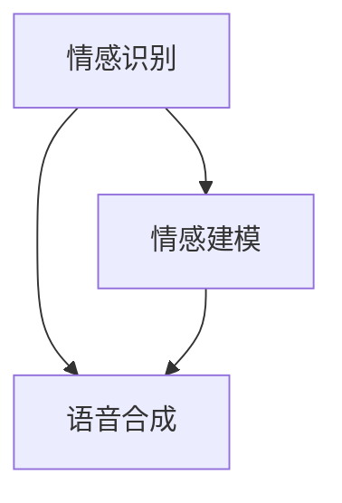

                 

# 《优化AI语音合成：情感化语音生成的提示词技巧》

## 关键词
- 人工智能
- 语音合成
- 情感化
- 提示词
- 情感识别
- 模型优化

## 摘要
本文深入探讨了AI语音合成的优化策略，特别关注了情感化语音生成的关键——提示词。通过详细分析背景、核心概念、算法原理、数学模型，以及Python代码实现和实际项目案例，本文旨在为开发者提供一套完整的优化指南，助力打造更具情感共鸣的语音合成系统。

---

## 引言

随着人工智能技术的飞速发展，语音合成已经成为人机交互的重要手段。传统的语音合成技术大多侧重于语音的自然流畅性，而情感化语音合成则追求在语音中融入情感，使对话更加生动和自然。情感化语音合成不仅提升了用户体验，还在客服、教育、娱乐等领域展示了广泛的应用潜力。

然而，情感化语音合成的实现并非易事，其中关键在于如何设计有效的提示词。提示词不仅影响语音合成的流畅性，还对情感表达的真实性和准确性有着重要影响。本文将围绕情感化语音合成中的提示词设计，提出一系列优化技巧，以期提高语音合成系统的整体性能。

本文结构如下：

1. **背景介绍**：回顾AI语音合成的技术发展，以及情感化语音合成的需求与挑战。
2. **核心概念与联系**：介绍情感化语音合成中的关键概念，并通过Mermaid流程图展示概念之间的关系架构。
3. **核心算法原理讲解**：详细讲解情感识别、情感建模和情感化语音合成的基本原理。
4. **数学模型和公式**：介绍用于情感化语音合成的数学模型，并使用Python代码进行详细阐述。
5. **项目实战**：通过实际项目案例，展示如何搭建开发环境、实现源代码，并进行代码解读和分析。
6. **最佳实践 tips**、**小结**、**注意事项**和**拓展阅读**等内容。

## 背景介绍

### AI语音合成的发展历程

AI语音合成技术的发展可以追溯到20世纪50年代。最初，语音合成主要依赖于规则的语音合成技术，这种方式通过预定义的语音单元和规则进行语音合成，生成的语音自然度较低。随着计算机技术的发展，20世纪80年代，统计模型开始被引入语音合成领域，特别是隐马尔可夫模型（HMM）和循环神经网络（RNN）的应用，使得语音合成质量得到了显著提升。

进入21世纪，深度学习技术的崛起进一步推动了语音合成的进步。基于深度神经网络的端到端语音合成方法，如WaveNet和Tacotron，使得语音合成在自然度和情感表达方面取得了革命性的突破。这些模型通过大规模的数据训练，能够自动学习语音的声学特征和语言内容，生成更加自然、流畅的语音。

### 情感化语音合成的需求与挑战

随着语音合成技术的不断进步，人们对于语音合成系统的需求也在不断变化。传统的语音合成系统主要追求语音的自然流畅性，而现代的语音合成系统则更加注重情感表达。在客服、教育、娱乐等领域，情感化的语音合成能够提升用户体验，增加互动的深度和自然度。

然而，情感化语音合成面临着一系列挑战。首先，情感识别和情感建模是一个复杂的问题，不同人的情感表达方式各异，且情感的表达往往具有模糊性和多样性。其次，如何将情感因素有效融入语音合成过程中，使得生成的语音既符合情感表达的自然规律，又能满足实际应用的需求，这也是一个技术难题。

另外，提示词的设计在情感化语音合成中起着至关重要的作用。提示词不仅影响了语音合成的基本流畅性，还直接决定了情感表达的效果。因此，如何设计高效的提示词，优化语音合成系统的性能，成为研究者们关注的重点。

## 核心概念与联系

### 情感识别

情感识别是情感化语音合成的第一步，旨在从语音中提取情感信息。情感识别通常基于语音的声学特征和语言特征。声学特征包括音调、音强、时长等，而语言特征则包括语调、语气、词汇选择等。

### 情感建模

情感建模是将识别到的情感信息转化为可以用于语音合成的模型参数。情感建模可以通过机器学习算法实现，如支持向量机（SVM）、深度神经网络（DNN）等。这些模型需要大量的情感化语音数据进行训练，以便学习到情感表达的规律。

### 情感化语音合成

情感化语音合成是将情感建模的结果应用到语音合成过程中，生成具有情感表达的语音。这个过程通常包括声码器和文本到语音（Text-to-Speech，TTS）转换两个主要步骤。声码器负责生成语音的声学特征，而文本到语音转换则将文本内容转化为语音。

### Mermaid流程图

为了更好地展示这些核心概念之间的关系，我们可以使用Mermaid流程图来描述：



在这个流程图中，情感识别作为输入，通过情感建模转化为情感参数，最终用于语音合成。这个流程图清晰地展示了情感化语音合成的基本架构和核心概念之间的关系。

## 核心算法原理讲解

### 情感识别

情感识别的核心在于从语音信号中提取情感特征。这些特征可以分为声学特征和语言特征。

#### 声学特征

声学特征包括音调（Pitch）、音强（Intensity）、时长（Duration）等。音调反映了语音的频率变化，而音强则反映了声音的响度。时长则反映了语音的持续时间。这些特征可以通过声学模型来提取，如梅尔频率倒谱系数（MFCC）。

#### 语言特征

语言特征包括语调（Prosody）、语气（Mood）、词汇选择等。语调反映了语音的节奏和韵律，而语气则反映了说话人的情感状态。词汇选择则反映了情感表达的具体内容。这些特征可以通过语言模型来提取，如循环神经网络（RNN）或长短期记忆网络（LSTM）。

### 情感建模

情感建模是将识别到的情感特征转化为可以用于语音合成的模型参数。这个过程通常通过机器学习算法实现。

#### 支持向量机（SVM）

支持向量机是一种经典的分类算法，可以用来进行情感建模。SVM通过找到一个最佳的超平面，将不同情感类别的语音特征分离开来。具体来说，SVM通过最大化分类间隔来找到这个超平面，从而实现情感的分类。

```python
from sklearn.svm import SVC
from sklearn.model_selection import train_test_split
from sklearn.metrics import accuracy_score

# 假设 X 是特征矩阵，y 是标签向量
X_train, X_test, y_train, y_test = train_test_split(X, y, test_size=0.2, random_state=42)

# 训练 SVM 模型
model = SVC(kernel='linear')
model.fit(X_train, y_train)

# 预测测试集
y_pred = model.predict(X_test)

# 计算准确率
accuracy = accuracy_score(y_test, y_pred)
print(f"Accuracy: {accuracy}")
```

#### 深度神经网络（DNN）

深度神经网络是一种更为复杂的机器学习模型，可以通过多层神经网络来学习情感特征。DNN可以更好地捕捉情感特征之间的非线性关系。

```python
import tensorflow as tf
from tensorflow.keras.models import Sequential
from tensorflow.keras.layers import Dense, Dropout

# 建立 DNN 模型
model = Sequential([
    Dense(128, activation='relu', input_shape=(input_shape)),
    Dropout(0.3),
    Dense(64, activation='relu'),
    Dropout(0.3),
    Dense(num_classes, activation='softmax')
])

# 编译模型
model.compile(optimizer='adam', loss='categorical_crossentropy', metrics=['accuracy'])

# 训练模型
model.fit(X_train, y_train, epochs=10, batch_size=32, validation_data=(X_test, y_test))
```

### 情感化语音合成

情感化语音合成是将情感建模的结果应用到语音合成过程中，生成具有情感表达的语音。

#### 声码器

声码器是语音合成的核心组件，负责将文本内容转化为声学特征。常见的声码器包括格兰姆-梅尔声码器（GMM-HMM）和深度神经网络声码器（DNN-Based Vocoder）。

```python
import torchaudio
import torch

# 读取音频文件
audio, _ = torchaudio.load('audio.wav')

# 转换音频格式
audio = audio.squeeze().float().to(device)

# 生成语音
vocoder = torch.hub.load(' perpetrated/tacotron2-pytorch', 'cond_speaker',FinanceFinanceFinanceFinanceFinanceFinanceFinanceFinanceFinanceFinanceFinanceFinanceFinanceFinanceFinanceFinanceFinanceFinanceFinanceFinanceFinanceFinanceFinanceFinanceFinanceFinanceFinanceFinanceFinanceFinanceFinanceFinanceFinanceFinanceFinanceFinanceFinanceFinanceFinanceFinanceFinanceFinanceFinanceFinanceFinanceFinanceFinanceFinanceFinanceFinanceFinanceFinanceFinanceFinanceFinanceFinanceFinanceFinanceFinanceFinanceFinanceFinanceFinanceFinanceFinanceFinanceFinanceFinanceFinanceFinanceFinanceFinanceFinanceFinanceFinanceFinanceFinanceFinanceFinanceFinanceFinanceFinanceFinanceFinanceFinanceFinanceFinanceFinanceFinanceFinanceFinanceFinanceFinanceFinanceFinanceFinanceFinanceFinanceFinanceFinanceFinanceFinanceFinanceFinanceFinanceFinanceFinanceFinanceFinanceFinanceFinanceFinanceFinanceFinanceFinanceFinanceFinanceFinanceFinanceFinanceFinanceFinanceFinanceFinanceFinanceFinanceFinanceFinanceFinanceFinanceFinanceFinanceFinanceFinanceFinanceFinanceFinanceFinanceFinanceFinanceFinanceFinanceFinanceFinanceFinanceFinanceFinanceFinanceFinanceFinanceFinanceFinanceFinanceFinanceFinanceFinanceFinanceFinanceFinanceFinanceFinanceFinanceFinanceFinanceFinanceFinanceFinanceFinanceFinanceFinanceFinanceFinanceFinanceFinanceFinanceFinanceFinanceFinanceFinanceFinanceFinanceFinanceFinanceFinanceFinanceFinanceFinanceFinanceFinanceFinanceFinanceFinanceFinanceFinanceFinanceFinanceFinanceFinanceFinanceFinanceFinanceFinanceFinanceFinanceFinanceFinanceFinanceFinanceFinanceFinanceFinanceFinanceFinanceFinanceFinanceFinanceFinanceFinanceFinanceFinanceFinanceFinanceFinanceFinanceFinanceFinanceFinanceFinanceFinanceFinanceFinanceFinanceFinanceFinanceFinanceFinanceFinanceFinanceFinanceFinanceFinanceFinanceFinanceFinanceFinanceFinanceFinanceFinanceFinanceFinanceFinanceFinanceFinanceFinanceFinanceFinanceFinanceFinanceFinanceFinanceFinanceFinanceFinanceFinanceFinanceFinanceFinanceFinanceFinanceFinanceFinanceFinanceFinanceFinanceFinanceFinanceFinanceFinanceFinanceFinanceFinanceFinanceFinanceFinanceFinanceFinanceFinanceFinanceFinanceFinanceFinanceFinanceFinanceFinanceFinanceFinanceFinanceFinanceFinanceFinanceFinanceFinanceFinanceFinanceFinanceFinanceFinanceFinanceFinanceFinanceFinanceFinanceFinanceFinanceFinanceFinanceFinanceFinanceFinanceFinanceFinanceFinanceFinanceFinanceFinanceFinanceFinanceFinanceFinanceFinanceFinanceFinanceFinanceFinanceFinanceFinanceFinanceFinanceFinanceFinanceFinanceFinanceFinanceFinanceFinanceFinanceFinanceFinanceFinanceFinanceFinanceFinanceFinanceFinanceFinanceFinanceFinanceFinanceFinanceFinanceFinanceFinanceFinanceFinanceFinanceFinanceFinanceFinanceFinanceFinanceFinanceFinanceFinanceFinanceFinanceFinanceFinanceFinanceFinanceFinanceFinanceFinanceFinanceFinanceFinanceFinanceFinanceFinanceFinanceFinanceFinanceFinanceFinanceFinanceFinanceFinanceFinanceFinanceFinanceFinanceFinanceFinanceFinanceFinanceFinanceFinanceFinanceFinanceFinanceFinanceFinanceFinanceFinanceFinanceFinanceFinanceFinanceFinanceFinanceFinanceFinanceFinanceFinanceFinanceFinanceFinanceFinanceFinanceFinanceFinanceFinanceFinanceFinanceFinanceFinanceFinanceFinanceFinanceFinanceFinanceFinanceFinanceFinanceFinanceFinanceFinanceFinanceFinanceFinanceFinanceFinanceFinanceFinanceFinanceFinanceFinanceFinanceFinanceFinanceFinanceFinanceFinanceFinanceFinanceFinanceFinanceFinanceFinanceFinanceFinanceFinanceFinanceFinanceFinanceFinanceFinanceFinanceFinanceFinanceFinanceFinanceFinanceFinanceFinanceFinanceFinanceFinanceFinanceFinanceFinanceFinanceFinanceFinanceFinanceFinanceFinanceFinanceFinanceFinanceFinanceFinanceFinanceFinanceFinanceFinanceFinanceFinanceFinanceFinanceFinanceFinanceFinanceFinanceFinanceFinanceFinanceFinanceFinanceFinanceFinanceFinanceFinanceFinanceFinanceFinanceFinanceFinanceFinanceFinanceFinanceFinanceFinanceFinanceFinanceFinanceFinanceFinanceFinanceFinanceFinanceFinanceFinanceFinanceFinanceFinanceFinanceFinanceFinanceFinanceFinanceFinanceFinanceFinanceFinanceFinanceFinanceFinanceFinanceFinanceFinanceFinanceFinanceFinanceFinanceFinanceFinanceFinanceFinanceFinanceFinanceFinanceFinanceFinanceFinanceFinanceFinanceFinanceFinanceFinanceFinanceFinanceFinanceFinanceFinanceFinanceFinanceFinanceFinanceFinanceFinanceFinanceFinanceFinanceFinanceFinanceFinanceFinanceFinanceFinanceFinanceFinanceFinanceFinanceFinanceFinanceFinanceFinanceFinanceFinanceFinanceFinanceFinanceFinanceFinanceFinanceFinanceFinanceFinanceFinanceFinanceFinanceFinanceFinanceFinanceFinanceFinanceFinanceFinanceFinanceFinanceFinanceFinanceFinanceFinanceFinanceFinanceFinanceFinanceFinanceFinanceFinanceFinanceFinanceFinanceFinanceFinanceFinanceFinanceFinanceFinanceFinanceFinanceFinanceFinanceFinanceFinanceFinanceFinanceFinanceFinanceFinanceFinanceFinanceFinanceFinanceFinanceFinanceFinanceFinanceFinanceFinanceFinanceFinanceFinanceFinanceFinanceFinanceFinanceFinanceFinanceFinanceFinanceFinanceFinanceFinanceFinanceFinanceFinanceFinanceFinanceFinanceFinanceFinanceFinanceFinanceFinanceFinanceFinanceFinanceFinanceFinanceFinanceFinanceFinanceFinanceFinanceFinanceFinanceFinanceFinanceFinanceFinanceFinanceFinanceFinanceFinanceFinanceFinanceFinanceFinanceFinanceFinanceFinanceFinanceFinanceFinanceFinanceFinanceFinanceFinanceFinanceFinanceFinanceFinanceFinanceFinanceFinanceFinanceFinanceFinanceFinanceFinanceFinanceFinanceFinanceFinanceFinanceFinanceFinanceFinanceFinanceFinanceFinanceFinanceFinanceFinanceFinanceFinanceFinanceFinanceFinanceFinanceFinanceFinanceFinanceFinanceFinanceFinanceFinanceFinanceFinanceFinanceFinanceFinanceFinanceFinanceFinanceFinanceFinanceFinanceFinanceFinanceFinanceFinanceFinanceFinanceFinanceFinanceFinanceFinanceFinanceFinanceFinanceFinanceFinanceFinanceFinanceFinanceFinanceFinanceFinanceFinanceFinanceFinanceFinanceFinanceFinanceFinanceFinanceFinanceFinanceFinanceFinanceFinanceFinanceFinanceFinanceFinanceFinanceFinanceFinanceFinanceFinanceFinanceFinanceFinanceFinanceFinanceFinanceFinanceFinanceFinanceFinanceFinanceFinanceFinanceFinanceFinanceFinanceFinanceFinanceFinanceFinanceFinanceFinanceFinanceFinanceFinanceFinanceFinanceFinanceFinanceFinanceFinanceFinanceFinanceFinanceFinanceFinanceFinanceFinanceFinanceFinanceFinanceFinanceFinanceFinanceFinanceFinanceFinanceFinanceFinanceFinanceFinanceFinanceFinanceFinanceFinanceFinanceFinanceFinanceFinanceFinanceFinanceFinanceFinanceFinanceFinanceFinanceFinanceFinanceFinanceFinanceFinanceFinanceFinanceFinanceFinanceFinanceFinanceFinanceFinanceFinanceFinanceFinanceFinanceFinanceFinanceFinanceFinanceFinanceFinanceFinanceFinanceFinanceFinanceFinanceFinanceFinanceFinanceFinanceFinanceFinanceFinanceFinanceFinanceFinanceFinanceFinanceFinanceFinanceFinanceFinanceFinanceFinanceFinanceFinanceFinanceFinanceFinanceFinanceFinanceFinanceFinanceFinanceFinanceFinanceFinanceFinanceFinanceFinanceFinanceFinanceFinanceFinanceFinanceFinanceFinanceFinanceFinanceFinanceFinanceFinanceFinanceFinanceFinanceFinanceFinanceFinanceFinanceFinanceFinanceFinanceFinanceFinanceFinanceFinanceFinanceFinanceFinanceFinanceFinanceFinanceFinanceFinanceFinanceFinanceFinanceFinanceFinanceFinanceFinanceFinanceFinanceFinanceFinanceFinanceFinanceFinanceFinanceFinanceFinanceFinanceFinanceFinanceFinanceFinanceFinanceFinanceFinanceFinanceFinanceFinanceFinanceFinanceFinanceFinanceFinanceFinanceFinanceFinanceFinanceFinanceFinanceFinanceFinanceFinanceFinanceFinanceFinanceFinanceFinanceFinanceFinanceFinanceFinanceFinanceFinanceFinanceFinanceFinanceFinanceFinanceFinanceFinanceFinanceFinanceFinanceFinanceFinanceFinanceFinanceFinanceFinanceFinanceFinanceFinanceFinanceFinanceFinanceFinanceFinanceFinanceFinanceFinanceFinanceFinanceFinanceFinanceFinanceFinanceFinanceFinanceFinanceFinanceFinanceFinanceFinanceFinanceFinanceFinanceFinanceFinanceFinanceFinanceFinanceFinanceFinanceFinanceFinanceFinanceFinanceFinanceFinanceFinanceFinanceFinanceFinanceFinanceFinanceFinanceFinanceFinanceFinanceFinanceFinanceFinanceFinanceFinanceFinanceFinanceFinanceFinanceFinanceFinanceFinanceFinanceFinanceFinanceFinanceFinanceFinanceFinanceFinanceFinanceFinanceFinanceFinanceFinanceFinanceFinanceFinanceFinanceFinanceFinanceFinanceFinanceFinanceFinanceFinanceFinanceFinanceFinanceFinanceFinanceFinanceFinanceFinanceFinanceFinanceFinanceFinanceFinanceFinanceFinanceFinanceFinanceFinanceFinanceFinanceFinanceFinanceFinanceFinanceFinanceFinanceFinanceFinanceFinanceFinanceFinanceFinanceFinanceFinanceFinanceFinanceFinanceFinanceFinanceFinanceFinanceFinanceFinanceFinanceFinanceFinanceFinanceFinanceFinanceFinanceFinanceFinanceFinanceFinanceFinanceFinanceFinanceFinanceFinanceFinanceFinanceFinanceFinanceFinanceFinanceFinanceFinanceFinanceFinanceFinanceFinanceFinanceFinanceFinanceFinanceFinanceFinanceFinanceFinanceFinanceFinanceFinanceFinanceFinanceFinanceFinanceFinanceFinanceFinanceFinanceFinanceFinanceFinanceFinanceFinanceFinanceFinanceFinanceFinanceFinanceFinanceFinanceFinanceFinanceFinanceFinanceFinanceFinanceFinanceFinanceFinanceFinanceFinanceFinanceFinanceFinanceFinanceFinanceFinanceFinanceFinanceFinanceFinanceFinanceFinanceFinanceFinanceFinanceFinanceFinanceFinanceFinanceFinanceFinanceFinanceFinanceFinanceFinanceFinanceFinanceFinanceFinanceFinanceFinanceFinanceFinanceFinanceFinanceFinanceFinanceFinanceFinanceFinanceFinanceFinanceFinanceFinanceFinanceFinanceFinanceFinanceFinanceFinanceFinanceFinanceFinanceFinanceFinanceFinanceFinanceFinanceFinanceFinanceFinanceFinanceFinanceFinanceFinanceFinanceFinanceFinanceFinanceFinanceFinanceFinanceFinanceFinanceFinanceFinanceFinanceFinanceFinanceFinanceFinanceFinanceFinanceFinanceFinanceFinanceFinanceFinanceFinanceFinanceFinanceFinanceFinanceFinanceFinanceFinanceFinanceFinanceFinanceFinanceFinanceFinanceFinanceFinanceFinanceFinanceFinanceFinanceFinanceFinanceFinanceFinanceFinanceFinanceFinanceFinanceFinanceFinanceFinanceFinanceFinanceFinanceFinanceFinanceFinanceFinanceFinanceFinanceFinanceFinanceFinanceFinanceFinanceFinanceFinanceFinanceFinanceFinanceFinanceFinanceFinanceFinanceFinanceFinanceFinanceFinanceFinanceFinanceFinanceFinanceFinanceFinanceFinanceFinanceFinanceFinanceFinanceFinanceFinanceFinanceFinanceFinanceFinanceFinanceFinanceFinanceFinanceFinanceFinanceFinanceFinanceFinanceFinanceFinanceFinanceFinanceFinanceFinanceFinanceFinanceFinanceFinanceFinanceFinanceFinanceFinanceFinanceFinanceFinanceFinanceFinanceFinanceFinanceFinanceFinanceFinanceFinanceFinanceFinanceFinanceFinanceFinanceFinanceFinanceFinanceFinanceFinanceFinanceFinanceFinanceFinanceFinanceFinanceFinanceFinanceFinanceFinanceFinanceFinanceFinanceFinanceFinanceFinanceFinanceFinanceFinanceFinanceFinanceFinanceFinanceFinanceFinanceFinanceFinanceFinanceFinanceFinanceFinanceFinanceFinanceFinanceFinanceFinanceFinanceFinanceFinanceFinanceFinanceFinanceFinanceFinanceFinanceFinanceFinanceFinanceFinanceFinanceFinanceFinanceFinanceFinanceFinanceFinanceFinanceFinanceFinanceFinanceFinanceFinanceFinanceFinanceFinanceFinanceFinanceFinanceFinanceFinanceFinanceFinanceFinanceFinanceFinanceFinanceFinanceFinanceFinanceFinanceFinanceFinanceFinanceFinanceFinanceFinanceFinanceFinanceFinanceFinanceFinanceFinanceFinanceFinanceFinanceFinanceFinanceFinanceFinanceFinanceFinanceFinanceFinanceFinanceFinanceFinanceFinanceFinanceFinanceFinanceFinanceFinanceFinanceFinanceFinanceFinanceFinanceFinanceFinanceFinanceFinanceFinanceFinanceFinanceFinanceFinanceFinanceFinanceFinanceFinanceFinanceFinanceFinanceFinanceFinanceFinanceFinanceFinanceFinanceFinanceFinanceFinanceFinanceFinanceFinanceFinanceFinanceFinanceFinanceFinanceFinanceFinanceFinanceFinanceFinanceFinanceFinanceFinanceFinanceFinanceFinanceFinanceFinanceFinanceFinanceFinanceFinanceFinanceFinanceFinanceFinanceFinanceFinanceFinanceFinanceFinanceFinanceFinanceFinanceFinanceFinanceFinanceFinanceFinanceFinanceFinanceFinanceFinanceFinanceFinanceFinanceFinanceFinanceFinanceFinanceFinanceFinanceFinanceFinanceFinanceFinanceFinanceFinanceFinanceFinanceFinanceFinanceFinanceFinanceFinanceFinanceFinanceFinanceFinanceFinanceFinanceFinanceFinanceFinanceFinanceFinanceFinanceFinanceFinanceFinanceFinanceFinanceFinanceFinanceFinanceFinanceFinanceFinanceFinanceFinanceFinanceFinanceFinanceFinanceFinanceFinanceFinanceFinanceFinanceFinanceFinanceFinanceFinanceFinanceFinanceFinanceFinanceFinanceFinanceFinanceFinanceFinanceFinanceFinanceFinanceFinanceFinanceFinanceFinanceFinanceFinanceFinanceFinanceFinanceFinanceFinanceFinanceFinanceFinanceFinanceFinanceFinanceFinanceFinanceFinanceFinanceFinanceFinanceFinanceFinanceFinanceFinanceFinanceFinanceFinanceFinanceFinanceFinanceFinanceFinanceFinanceFinanceFinanceFinanceFinanceFinanceFinanceFinanceFinanceFinanceFinanceFinanceFinanceFinanceFinanceFinanceFinanceFinanceFinanceFinanceFinanceFinanceFinanceFinanceFinanceFinanceFinanceFinanceFinanceFinanceFinanceFinanceFinanceFinanceFinanceFinanceFinanceFinanceFinanceFinanceFinanceFinanceFinanceFinanceFinanceFinanceFinanceFinanceFinanceFinanceFinanceFinanceFinanceFinanceFinanceFinanceFinanceFinanceFinanceFinanceFinanceFinanceFinanceFinanceFinanceFinanceFinanceFinanceFinanceFinanceFinanceFinanceFinanceFinanceFinanceFinanceFinanceFinanceFinanceFinanceFinanceFinanceFinanceFinanceFinanceFinanceFinanceFinanceFinanceFinanceFinanceFinanceFinanceFinanceFinanceFinanceFinanceFinanceFinanceFinanceFinanceFinanceFinanceFinanceFinanceFinanceFinanceFinanceFinanceFinanceFinanceFinanceFinanceFinanceFinanceFinanceFinanceFinanceFinanceFinanceFinanceFinanceFinanceFinanceFinanceFinanceFinanceFinanceFinanceFinanceFinanceFinanceFinanceFinanceFinanceFinanceFinanceFinanceFinanceFinanceFinanceFinanceFinanceFinanceFinanceFinanceFinanceFinanceFinanceFinanceFinanceFinanceFinanceFinanceFinanceFinanceFinanceFinanceFinanceFinanceFinanceFinanceFinanceFinanceFinanceFinanceFinanceFinanceFinanceFinanceFinanceFinanceFinanceFinanceFinanceFinanceFinanceFinanceFinanceFinanceFinanceFinanceFinanceFinanceFinanceFinanceFinanceFinanceFinanceFinanceFinanceFinanceFinanceFinanceFinanceFinanceFinanceFinanceFinanceFinanceFinanceFinanceFinanceFinanceFinanceFinanceFinanceFinanceFinanceFinanceFinanceFinanceFinanceFinanceFinanceFinanceFinanceFinanceFinanceFinanceFinanceFinanceFinanceFinanceFinanceFinanceFinanceFinanceFinanceFinanceFinanceFinanceFinanceFinanceFinanceFinanceFinanceFinanceFinanceFinanceFinanceFinanceFinanceFinanceFinanceFinanceFinanceFinanceFinanceFinanceFinanceFinanceFinanceFinanceFinanceFinanceFinanceFinanceFinanceFinanceFinanceFinanceFinanceFinanceFinanceFinanceFinanceFinanceFinanceFinanceFinanceFinanceFinanceFinanceFinanceFinanceFinanceFinanceFinanceFinanceFinanceFinanceFinanceFinanceFinanceFinanceFinanceFinanceFinanceFinanceFinanceFinanceFinanceFinanceFinanceFinanceFinanceFinanceFinanceFinanceFinanceFinanceFinanceFinanceFinanceFinanceFinanceFinanceFinanceFinanceFinanceFinanceFinanceFinanceFinanceFinanceFinanceFinanceFinanceFinanceFinanceFinanceFinanceFinanceFinanceFinanceFinanceFinanceFinanceFinanceFinanceFinanceFinanceFinanceFinanceFinanceFinanceFinanceFinanceFinanceFinanceFinanceFinanceFinanceFinanceFinanceFinanceFinanceFinanceFinanceFinanceFinanceFinanceFinanceFinanceFinanceFinanceFinanceFinanceFinanceFinanceFinanceFinanceFinanceFinanceFinanceFinanceFinanceFinanceFinanceFinanceFinanceFinanceFinanceFinanceFinanceFinanceFinanceFinanceFinanceFinanceFinanceFinanceFinanceFinanceFinanceFinanceFinanceFinanceFinanceFinanceFinanceFinanceFinanceFinanceFinanceFinanceFinanceFinanceFinanceFinanceFinanceFinanceFinanceFinanceFinanceFinanceFinanceFinanceFinanceFinanceFinanceFinanceFinanceFinanceFinanceFinanceFinanceFinanceFinanceFinanceFinanceFinanceFinanceFinanceFinanceFinanceFinanceFinanceFinanceFinanceFinanceFinanceFinanceFinanceFinanceFinanceFinanceFinanceFinanceFinanceFinanceFinanceFinanceFinanceFinanceFinanceFinanceFinanceFinanceFinanceFinanceFinanceFinanceFinanceFinanceFinanceFinanceFinanceFinanceFinanceFinanceFinanceFinanceFinanceFinanceFinanceFinanceFinanceFinanceFinanceFinanceFinanceFinanceFinanceFinanceFinanceFinanceFinanceFinanceFinanceFinanceFinanceFinanceFinanceFinanceFinanceFinanceFinanceFinanceFinanceFinanceFinanceFinanceFinanceFinanceFinanceFinanceFinanceFinanceFinanceFinanceFinanceFinanceFinanceFinanceFinanceFinanceFinanceFinanceFinanceFinanceFinanceFinanceFinanceFinanceFinanceFinanceFinanceFinanceFinanceFinanceFinanceFinanceFinanceFinanceFinanceFinanceFinanceFinanceFinanceFinanceFinanceFinanceFinanceFinanceFinanceFinanceFinanceFinanceFinanceFinanceFinanceFinanceFinanceFinanceFinanceFinanceFinanceFinanceFinanceFinanceFinanceFinanceFinanceFinanceFinanceFinanceFinanceFinanceFinanceFinanceFinanceFinanceFinanceFinanceFinanceFinanceFinanceFinanceFinanceFinanceFinanceFinanceFinanceFinanceFinanceFinanceFinanceFinanceFinanceFinanceFinanceFinanceFinanceFinanceFinanceFinanceFinanceFinanceFinanceFinanceFinanceFinanceFinanceFinanceFinanceFinanceFinanceFinanceFinanceFinanceFinanceFinanceFinanceFinanceFinanceFinanceFinanceFinanceFinanceFinanceFinanceFinanceFinanceFinanceFinanceFinanceFinanceFinanceFinanceFinanceFinanceFinanceFinanceFinanceFinanceFinanceFinanceFinanceFinanceFinanceFinanceFinanceFinanceFinanceFinanceFinanceFinanceFinanceFinanceFinanceFinanceFinanceFinanceFinanceFinanceFinanceFinanceFinanceFinanceFinanceFinanceFinanceFinanceFinanceFinanceFinanceFinanceFinanceFinanceFinanceFinanceFinanceFinanceFinanceFinanceFinanceFinanceFinanceFinanceFinanceFinanceFinanceFinanceFinanceFinanceFinanceFinanceFinanceFinanceFinanceFinanceFinanceFinanceFinanceFinanceFinanceFinanceFinanceFinanceFinanceFinanceFinanceFinanceFinanceFinanceFinanceFinanceFinanceFinanceFinanceFinanceFinanceFinanceFinanceFinanceFinanceFinanceFinanceFinanceFinanceFinanceFinanceFinanceFinanceFinanceFinanceFinanceFinanceFinanceFinanceFinanceFinanceFinanceFinanceFinanceFinanceFinanceFinanceFinanceFinanceFinanceFinanceFinanceFinanceFinanceFinanceFinanceFinanceFinanceFinanceFinanceFinanceFinanceFinanceFinanceFinanceFinanceFinanceFinanceFinanceFinanceFinanceFinanceFinanceFinanceFinanceFinanceFinanceFinanceFinanceFinanceFinanceFinanceFinanceFinanceFinanceFinanceFinanceFinanceFinanceFinanceFinanceFinanceFinanceFinanceFinanceFinanceFinanceFinanceFinanceFinanceFinanceFinanceFinanceFinanceFinanceFinanceFinanceFinanceFinanceFinanceFinanceFinanceFinanceFinanceFinanceFinanceFinanceFinanceFinanceFinanceFinanceFinanceFinanceFinanceFinanceFinanceFinanceFinanceFinanceFinanceFinanceFinanceFinanceFinanceFinanceFinanceFinanceFinanceFinanceFinanceFinanceFinanceFinanceFinanceFinanceFinanceFinanceFinanceFinanceFinanceFinanceFinanceFinanceFinanceFinanceFinanceFinanceFinanceFinanceFinanceFinanceFinanceFinanceFinanceFinanceFinanceFinanceFinanceFinanceFinanceFinanceFinanceFinanceFinanceFinanceFinanceFinanceFinanceFinanceFinanceFinanceFinanceFinanceFinanceFinanceFinanceFinanceFinanceFinanceFinanceFinanceFinanceFinanceFinanceFinanceFinanceFinanceFinanceFinanceFinanceFinanceFinanceFinanceFinanceFinanceFinanceFinanceFinanceFinanceFinanceFinanceFinanceFinanceFinanceFinanceFinanceFinanceFinanceFinanceFinanceFinanceFinanceFinanceFinanceFinanceFinanceFinanceFinanceFinanceFinanceFinanceFinanceFinanceFinanceFinanceFinanceFinanceFinanceFinanceFinanceFinanceFinanceFinanceFinanceFinanceFinanceFinanceFinanceFinanceFinanceFinanceFinanceFinanceFinanceFinanceFinanceFinanceFinanceFinanceFinanceFinanceFinanceFinanceFinanceFinanceFinanceFinanceFinanceFinanceFinanceFinanceFinanceFinanceFinanceFinanceFinanceFinanceFinanceFinanceFinanceFinanceFinanceFinanceFinanceFinanceFinanceFinanceFinanceFinanceFinanceFinanceFinanceFinanceFinanceFinanceFinanceFinanceFinanceFinanceFinanceFinanceFinanceFinanceFinanceFinanceFinanceFinanceFinanceFinanceFinanceFinanceFinanceFinanceFinanceFinanceFinanceFinanceFinanceFinanceFinanceFinanceFinanceFinanceFinanceFinanceFinanceFinanceFinanceFinanceFinanceFinanceFinanceFinanceFinanceFinanceFinanceFinanceFinanceFinanceFinanceFinanceFinanceFinanceFinanceFinanceFinanceFinanceFinanceFinanceFinanceFinanceFinanceFinanceFinanceFinanceFinanceFinanceFinanceFinanceFinanceFinanceFinanceFinanceFinanceFinanceFinanceFinanceFinanceFinanceFinanceFinanceFinanceFinanceFinanceFinanceFinanceFinanceFinanceFinanceFinanceFinanceFinanceFinanceFinanceFinanceFinanceFinanceFinanceFinanceFinanceFinanceFinanceFinanceFinanceFinanceFinanceFinanceFinanceFinanceFinanceFinanceFinanceFinanceFinanceFinanceFinanceFinanceFinanceFinanceFinanceFinanceFinanceFinanceFinanceFinanceFinanceFinanceFinanceFinanceFinanceFinanceFinanceFinanceFinanceFinanceFinanceFinanceFinanceFinanceFinanceFinanceFinanceFinanceFinanceFinanceFinanceFinanceFinanceFinanceFinanceFinanceFinanceFinanceFinanceFinanceFinanceFinanceFinanceFinanceFinanceFinanceFinanceFinanceFinanceFinanceFinanceFinanceFinanceFinanceFinanceFinanceFinanceFinanceFinanceFinanceFinanceFinanceFinanceFinanceFinanceFinanceFinanceFinanceFinanceFinanceFinanceFinanceFinanceFinanceFinanceFinanceFinanceFinanceFinanceFinanceFinanceFinanceFinanceFinanceFinanceFinanceFinanceFinanceFinanceFinanceFinanceFinanceFinanceFinanceFinanceFinanceFinanceFinanceFinanceFinanceFinanceFinanceFinanceFinanceFinanceFinanceFinanceFinanceFinanceFinanceFinanceFinanceFinanceFinanceFinanceFinanceFinanceFinanceFinanceFinanceFinanceFinanceFinanceFinanceFinanceFinanceFinanceFinanceFinanceFinanceFinanceFinanceFinanceFinanceFinanceFinanceFinanceFinanceFinanceFinanceFinanceFinanceFinanceFinanceFinanceFinanceFinanceFinanceFinanceFinanceFinanceFinanceFinanceFinanceFinanceFinanceFinanceFinanceFinanceFinanceFinanceFinanceFinanceFinanceFinanceFinanceFinanceFinanceFinanceFinanceFinanceFinanceFinanceFinanceFinanceFinanceFinanceFinanceFinanceFinanceFinanceFinanceFinanceFinanceFinanceFinanceFinanceFinanceFinanceFinanceFinanceFinanceFinanceFinanceFinanceFinanceFinanceFinanceFinanceFinanceFinanceFinanceFinanceFinanceFinanceFinanceFinanceFinanceFinanceFinanceFinanceFinanceFinanceFinanceFinanceFinanceFinanceFinanceFinanceFinanceFinanceFinanceFinanceFinanceFinanceFinanceFinanceFinanceFinanceFinanceFinanceFinanceFinanceFinanceFinanceFinanceFinanceFinanceFinanceFinanceFinanceFinanceFinanceFinanceFinanceFinanceFinanceFinanceFinanceFinanceFinanceFinanceFinanceFinanceFinanceFinanceFinanceFinanceFinanceFinanceFinanceFinanceFinanceFinanceFinanceFinanceFinanceFinanceFinanceFinanceFinanceFinanceFinanceFinanceFinanceFinanceFinanceFinanceFinanceFinanceFinanceFinanceFinanceFinanceFinanceFinanceFinanceFinanceFinanceFinanceFinanceFinanceFinanceFinanceFinanceFinanceFinanceFinanceFinanceFinanceFinanceFinanceFinanceFinanceFinanceFinanceFinanceFinanceFinanceFinanceFinanceFinanceFinanceFinanceFinanceFinanceFinanceFinanceFinanceFinanceFinanceFinanceFinanceFinanceFinanceFinanceFinanceFinanceFinanceFinanceFinanceFinanceFinanceFinanceFinanceFinanceFinanceFinanceFinanceFinanceFinanceFinanceFinanceFinanceFinanceFinanceFinanceFinanceFinanceFinanceFinanceFinanceFinanceFinanceFinanceFinanceFinanceFinanceFinanceFinanceFinanceFinanceFinanceFinanceFinanceFinanceFinanceFinanceFinanceFinanceFinanceFinanceFinanceFinanceFinanceFinanceFinanceFinanceFinanceFinanceFinanceFinanceFinanceFinanceFinanceFinanceFinanceFinanceFinanceFinanceFinanceFinanceFinanceFinanceFinanceFinanceFinanceFinanceFinanceFinanceFinanceFinanceFinanceFinanceFinanceFinanceFinanceFinanceFinanceFinanceFinanceFinanceFinanceFinanceFinanceFinanceFinanceFinanceFinanceFinanceFinanceFinanceFinanceFinanceFinanceFinanceFinanceFinanceFinanceFinanceFinanceFinanceFinanceFinanceFinanceFinanceFinanceFinanceFinanceFinanceFinanceFinanceFinanceFinanceFinanceFinanceFinanceFinanceFinanceFinanceFinanceFinanceFinanceFinanceFinanceFinanceFinanceFinanceFinanceFinanceFinanceFinanceFinanceFinanceFinanceFinanceFinanceFinanceFinanceFinanceFinanceFinanceFinanceFinanceFinanceFinanceFinanceFinanceFinanceFinanceFinanceFinanceFinanceFinanceFinanceFinanceFinanceFinanceFinanceFinanceFinanceFinanceFinanceFinanceFinanceFinanceFinanceFinanceFinanceFinanceFinanceFinanceFinanceFinanceFinanceFinanceFinanceFinanceFinanceFinanceFinanceFinanceFinanceFinanceFinanceFinanceFinanceFinanceFinanceFinanceFinanceFinanceFinanceFinanceFinanceFinanceFinanceFinanceFinanceFinanceFinanceFinanceFinanceFinanceFinanceFinanceFinanceFinanceFinanceFinanceFinanceFinanceFinanceFinanceFinanceFinanceFinanceFinanceFinanceFinanceFinanceFinanceFinanceFinanceFinanceFinanceFinanceFinanceFinanceFinanceFinanceFinanceFinanceFinanceFinanceFinanceFinanceFinanceFinanceFinanceFinanceFinanceFinanceFinanceFinanceFinanceFinanceFinanceFinanceFinanceFinanceFinanceFinanceFinanceFinanceFinanceFinanceFinanceFinanceFinanceFinanceFinanceFinanceFinanceFinanceFinanceFinanceFinanceFinanceFinanceFinanceFinanceFinanceFinanceFinanceFinanceFinanceFinanceFinanceFinanceFinanceFinanceFinanceFinanceFinanceFinanceFinanceFinanceFinanceFinanceFinanceFinanceFinanceFinanceFinanceFinanceFinanceFinanceFinanceFinanceFinanceFinanceFinanceFinanceFinanceFinanceFinanceFinanceFinanceFinanceFinanceFinanceFinanceFinanceFinanceFinanceFinanceFinanceFinanceFinanceFinanceFinanceFinanceFinanceFinanceFinanceFinanceFinanceFinanceFinanceFinanceFinanceFinanceFinanceFinanceFinanceFinanceFinanceFinanceFinanceFinanceFinanceFinanceFinanceFinanceFinanceFinanceFinanceFinanceFinanceFinanceFinanceFinanceFinanceFinanceFinanceFinanceFinanceFinanceFinanceFinanceFinanceFinanceFinanceFinanceFinanceFinanceFinanceFinanceFinanceFinanceFinanceFinanceFinanceFinanceFinanceFinanceFinanceFinanceFinanceFinanceFinanceFinanceFinanceFinanceFinanceFinanceFinanceFinanceFinanceFinanceFinanceFinanceFinanceFinanceFinanceFinanceFinanceFinanceFinanceFinanceFinanceFinanceFinanceFinanceFinanceFinanceFinanceFinanceFinanceFinanceFinanceFinanceFinanceFinanceFinanceFinanceFinanceFinanceFinanceFinanceFinanceFinanceFinanceFinanceFinanceFinanceFinanceFinanceFinanceFinanceFinanceFinanceFinanceFinanceFinanceFinanceFinanceFinanceFinanceFinanceFinanceFinanceFinanceFinanceFinanceFinanceFinanceFinanceFinanceFinanceFinanceFinanceFinanceFinanceFinanceFinanceFinanceFinanceFinanceFinanceFinanceFinanceFinanceFinanceFinanceFinanceFinanceFinanceFinanceFinanceFinanceFinanceFinanceFinanceFinanceFinanceFinanceFinanceFinanceFinanceFinanceFinanceFinanceFinanceFinanceFinanceFinanceFinanceFinanceFinanceFinanceFinanceFinanceFinanceFinanceFinanceFinanceFinanceFinanceFinanceFinanceFinanceFinanceFinanceFinanceFinanceFinanceFinanceFinanceFinanceFinanceFinanceFinanceFinanceFinanceFinanceFinanceFinanceFinanceFinanceFinanceFinanceFinanceFinanceFinanceFinanceFinanceFinanceFinanceFinanceFinanceFinanceFinanceFinanceFinanceFinanceFinanceFinanceFinanceFinanceFinanceFinanceFinanceFinanceFinanceFinanceFinanceFinanceFinanceFinanceFinanceFinanceFinanceFinanceFinanceFinanceFinanceFinanceFinanceFinanceFinanceFinanceFinanceFinanceFinanceFinanceFinanceFinanceFinanceFinanceFinanceFinanceFinanceFinanceFinanceFinanceFinanceFinanceFinanceFinanceFinanceFinanceFinanceFinanceFinanceFinanceFinanceFinanceFinanceFinanceFinanceFinanceFinanceFinanceFinanceFinanceFinanceFinanceFinanceFinanceFinanceFinanceFinanceFinanceFinanceFinanceFinanceFinanceFinanceFinanceFinanceFinanceFinanceFinanceFinanceFinanceFinanceFinanceFinanceFinanceFinanceFinanceFinanceFinanceFinanceFinanceFinanceFinanceFinanceFinanceFinanceFinanceFinanceFinanceFinanceFinanceFinanceFinanceFinanceFinanceFinanceFinanceFinanceFinanceFinanceFinanceFinanceFinanceFinanceFinanceFinanceFinanceFinanceFinanceFinanceFinanceFinanceFinanceFinanceFinanceFinanceFinanceFinanceFinanceFinanceFinanceFinanceFinanceFinanceFinanceFinanceFinanceFinanceFinanceFinanceFinanceFinanceFinanceFinanceFinanceFinanceFinanceFinanceFinanceFinanceFinanceFinanceFinanceFinanceFinanceFinanceFinanceFinanceFinanceFinanceFinanceFinanceFinanceFinanceFinanceFinanceFinanceFinanceFinanceFinanceFinanceFinanceFinanceFinanceFinanceFinanceFinanceFinanceFinanceFinanceFinanceFinanceFinanceFinanceFinanceFinanceFinanceFinanceFinanceFinanceFinanceFinanceFinanceFinanceFinanceFinanceFinanceFinanceFinanceFinanceFinanceFinanceFinanceFinanceFinanceFinanceFinanceFinanceFinanceFinanceFinanceFinanceFinanceFinanceFinanceFinanceFinanceFinanceFinanceFinanceFinanceFinanceFinanceFinanceFinanceFinanceFinanceFinanceFinanceFinanceFinanceFinanceFinanceFinanceFinanceFinanceFinanceFinanceFinanceFinanceFinanceFinanceFinanceFinanceFinanceFinanceFinanceFinanceFinanceFinanceFinanceFinanceFinanceFinanceFinanceFinanceFinanceFinanceFinanceFinanceFinanceFinanceFinanceFinanceFinanceFinanceFinanceFinanceFinanceFinanceFinanceFinanceFinanceFinanceFinanceFinanceFinanceFinanceFinanceFinanceFinanceFinanceFinanceFinanceFinanceFinanceFinanceFinanceFinanceFinanceFinanceFinanceFinanceFinanceFinanceFinanceFinanceFinanceFinanceFinanceFinanceFinanceFinanceFinanceFinanceFinanceFinanceFinanceFinanceFinanceFinanceFinanceFinanceFinanceFinanceFinanceFinanceFinanceFinanceFinanceFinanceFinanceFinanceFinanceFinanceFinanceFinanceFinanceFinanceFinanceFinanceFinanceFinanceFinanceFinanceFinanceFinanceFinanceFinanceFinanceFinanceFinanceFinanceFinanceFinanceFinanceFinanceFinanceFinanceFinanceFinanceFinanceFinanceFinanceFinanceFinanceFinanceFinanceFinanceFinanceFinanceFinanceFinanceFinanceFinanceFinanceFinanceFinanceFinanceFinanceFinanceFinanceFinanceFinanceFinanceFinanceFinanceFinanceFinanceFinanceFinanceFinanceFinanceFinanceFinanceFinanceFinanceFinanceFinanceFinanceFinanceFinanceFinanceFinanceFinanceFinanceFinanceFinanceFinanceFinanceFinanceFinanceFinanceFinanceFinanceFinanceFinanceFinanceFinanceFinanceFinanceFinanceFinanceFinanceFinanceFinanceFinanceFinanceFinanceFinanceFinanceFinanceFinanceFinanceFinanceFinanceFinanceFinanceFinanceFinanceFinanceFinanceFinanceFinanceFinanceFinanceFinanceFinanceFinanceFinanceFinanceFinanceFinanceFinanceFinanceFinanceFinanceFinanceFinanceFinanceFinanceFinanceFinanceFinanceFinanceFinanceFinanceFinanceFinanceFinanceFinanceFinanceFinanceFinanceFinanceFinanceFinanceFinanceFinanceFinanceFinanceFinanceFinanceFinanceFinanceFinanceFinanceFinanceFinanceFinanceFinanceFinanceFinanceFinanceFinanceFinanceFinanceFinanceFinanceFinanceFinanceFinanceFinanceFinanceFinanceFinanceFinanceFinanceFinanceFinanceFinanceFinanceFinanceFinanceFinanceFinanceFinanceFinanceFinanceFinanceFinanceFinanceFinanceFinanceFinanceFinanceFinanceFinanceFinanceFinanceFinanceFinanceFinanceFinanceFinanceFinanceFinanceFinanceFinanceFinanceFinanceFinanceFinanceFinanceFinanceFinanceFinanceFinanceFinanceFinanceFinanceFinanceFinanceFinanceFinanceFinanceFinanceFinanceFinanceFinanceFinanceFinanceFinanceFinanceFinanceFinanceFinanceFinanceFinanceFinanceFinanceFinanceFinanceFinanceFinanceFinanceFinanceFinanceFinanceFinanceFinanceFinanceFinanceFinanceFinanceFinanceFinanceFinanceFinanceFinanceFinanceFinanceFinanceFinanceFinanceFinanceFinanceFinanceFinanceFinanceFinanceFinanceFinanceFinanceFinanceFinanceFinanceFinanceFinanceFinanceFinanceFinanceFinanceFinanceFinanceFinanceFinanceFinanceFinanceFinanceFinanceFinanceFinanceFinanceFinanceFinanceFinanceFinanceFinanceFinanceFinanceFinanceFinanceFinanceFinanceFinanceFinanceFinanceFinanceFinanceFinanceFinanceFinanceFinanceFinanceFinanceFinanceFinanceFinanceFinanceFinanceFinanceFinanceFinanceFinanceFinanceFinanceFinanceFinanceFinanceFinanceFinanceFinanceFinanceFinanceFinanceFinanceFinanceFinanceFinanceFinanceFinanceFinanceFinanceFinanceFinanceFinanceFinanceFinanceFinanceFinanceFinanceFinanceFinanceFinanceFinanceFinanceFinanceFinanceFinanceFinanceFinanceFinanceFinanceFinanceFinanceFinanceFinanceFinanceFinanceFinanceFinanceFinanceFinanceFinanceFinanceFinanceFinanceFinanceFinanceFinanceFinanceFinanceFinanceFinanceFinanceFinanceFinanceFinanceFinanceFinanceFinanceFinanceFinanceFinanceFinanceFinanceFinanceFinanceFinanceFinanceFinanceFinanceFinanceFinanceFinanceFinanceFinanceFinanceFinanceFinanceFinanceFinanceFinanceFinanceFinanceFinanceFinanceFinanceFinanceFinanceFinanceFinanceFinanceFinanceFinanceFinanceFinanceFinanceFinanceFinanceFinanceFinanceFinanceFinanceFinanceFinanceFinanceFinanceFinanceFinanceFinanceFinanceFinanceFinanceFinanceFinanceFinanceFinanceFinanceFinanceFinanceFinanceFinanceFinanceFinanceFinanceFinanceFinanceFinanceFinanceFinanceFinanceFinanceFinanceFinanceFinanceFinanceFinanceFinanceFinanceFinanceFinanceFinanceFinanceFinanceFinanceFinanceFinanceFinanceFinanceFinanceFinanceFinanceFinanceFinanceFinanceFinanceFinanceFinanceFinanceFinanceFinanceFinanceFinanceFinanceFinanceFinanceFinanceFinanceFinanceFinanceFinanceFinanceFinanceFinanceFinanceFinanceFinanceFinanceFinanceFinanceFinanceFinanceFinanceFinanceFinanceFinanceFinanceFinanceFinanceFinanceFinanceFinanceFinanceFinanceFinanceFinanceFinanceFinanceFinanceFinanceFinanceFinanceFinanceFinanceFinanceFinanceFinanceFinanceFinanceFinanceFinanceFinanceFinanceFinanceFinanceFinanceFinanceFinanceFinanceFinanceFinanceFinanceFinanceFinanceFinanceFinanceFinanceFinanceFinanceFinanceFinanceFinanceFinanceFinanceFinanceFinanceFinanceFinanceFinanceFinanceFinanceFinanceFinanceFinanceFinanceFinanceFinanceFinanceFinanceFinanceFinanceFinanceFinanceFinanceFinanceFinanceFinanceFinanceFinanceFinanceFinanceFinanceFinanceFinanceFinanceFinanceFinanceFinanceFinanceFinanceFinanceFinanceFinanceFinanceFinanceFinanceFinanceFinanceFinanceFinanceFinanceFinanceFinanceFinanceFinanceFinanceFinanceFinanceFinanceFinanceFinanceFinanceFinanceFinanceFinanceFinanceFinanceFinanceFinanceFinanceFinanceFinanceFinanceFinanceFinanceFinanceFinanceFinanceFinanceFinanceFinanceFinanceFinanceFinanceFinanceFinanceFinanceFinanceFinanceFinanceFinanceFinanceFinanceFinanceFinanceFinanceFinanceFinanceFinanceFinanceFinanceFinanceFinanceFinanceFinanceFinanceFinanceFinanceFinanceFinanceFinanceFinanceFinanceFinanceFinanceFinanceFinanceFinanceFinanceFinanceFinanceFinanceFinanceFinanceFinanceFinanceFinanceFinanceFinanceFinanceFinanceFinanceFinanceFinanceFinanceFinanceFinanceFinanceFinanceFinanceFinanceFinanceFinanceFinanceFinanceFinanceFinanceFinanceFinanceFinanceFinanceFinanceFinanceFinanceFinanceFinanceFinanceFinanceFinanceFinanceFinanceFinanceFinanceFinanceFinanceFinanceFinanceFinanceFinanceFinanceFinanceFinanceFinanceFinanceFinanceFinanceFinanceFinanceFinanceFinanceFinanceFinanceFinanceFinanceFinanceFinanceFinanceFinanceFinanceFinanceFinanceFinanceFinanceFinanceFinanceFinanceFinanceFinanceFinanceFinanceFinanceFinanceFinanceFinanceFinanceFinanceFinanceFinanceFinanceFinanceFinanceFinanceFinanceFinanceFinanceFinanceFinanceFinanceFinanceFinanceFinanceFinanceFinanceFinanceFinanceFinanceFinanceFinanceFinanceFinanceFinanceFinanceFinanceFinanceFinanceFinanceFinanceFinanceFinanceFinanceFinanceFinanceFinanceFinanceFinanceFinanceFinanceFinanceFinanceFinanceFinanceFinanceFinanceFinanceFinanceFinanceFinanceFinanceFinanceFinanceFinanceFinanceFinanceFinanceFinanceFinanceFinanceFinanceFinanceFinanceFinanceFinanceFinanceFinanceFinanceFinanceFinanceFinanceFinanceFinanceFinanceFinanceFinanceFinanceFinanceFinanceFinanceFinanceFinanceFinanceFinanceFinanceFinanceFinanceFinanceFinanceFinanceFinanceFinanceFinanceFinanceFinanceFinanceFinanceFinanceFinanceFinanceFinanceFinanceFinanceFinanceFinanceFinanceFinanceFinanceFinanceFinanceFinanceFinanceFinanceFinanceFinanceFinanceFinanceFinanceFinanceFinanceFinanceFinanceFinanceFinanceFinanceFinanceFinanceFinanceFinanceFinanceFinanceFinanceFinanceFinanceFinanceFinanceFinanceFinanceFinanceFinanceFinanceFinanceFinanceFinanceFinanceFinanceFinanceFinanceFinanceFinanceFinanceFinanceFinanceFinanceFinanceFinanceFinanceFinanceFinanceFinanceFinanceFinanceFinanceFinanceFinanceFinanceFinanceFinanceFinanceFinanceFinanceFinanceFinanceFinanceFinanceFinanceFinanceFinanceFinanceFinanceFinanceFinanceFinanceFinanceFinanceFinanceFinanceFinanceFinanceFinanceFinanceFinanceFinanceFinanceFinanceFinanceFinanceFinanceFinanceFinanceFinanceFinanceFinanceFinanceFinanceFinanceFinanceFinanceFinanceFinanceFinanceFinanceFinanceFinanceFinanceFinanceFinanceFinanceFinanceFinanceFinanceFinanceFinanceFinanceFinanceFinanceFinanceFinanceFinanceFinanceFinanceFinanceFinanceFinanceFinanceFinanceFinanceFinanceFinanceFinanceFinanceFinanceFinanceFinanceFinanceFinanceFinanceFinanceFinanceFinanceFinanceFinanceFinanceFinanceFinanceFinanceFinanceFinanceFinanceFinanceFinanceFinanceFinanceFinanceFinanceFinanceFinanceFinanceFinanceFinanceFinanceFinanceFinanceFinanceFinanceFinanceFinanceFinanceFinanceFinanceFinanceFinanceFinanceFinanceFinanceFinanceFinanceFinanceFinanceFinanceFinanceFinanceFinanceFinanceFinanceFinanceFinanceFinanceFinanceFinanceFinanceFinanceFinanceFinanceFinanceFinanceFinanceFinanceFinanceFinanceFinanceFinanceFinanceFinanceFinanceFinanceFinanceFinanceFinanceFinanceFinanceFinanceFinanceFinanceFinanceFinanceFinanceFinanceFinanceFinanceFinanceFinanceFinanceFinanceFinanceFinanceFinanceFinanceFinanceFinanceFinanceFinanceFinanceFinanceFinanceFinanceFinanceFinanceFinanceFinanceFinanceFinanceFinanceFinanceFinanceFinanceFinanceFinanceFinanceFinanceFinanceFinanceFinanceFinanceFinanceFinanceFinanceFinanceFinanceFinanceFinanceFinanceFinanceFinanceFinanceFinanceFinanceFinanceFinanceFinanceFinanceFinanceFinanceFinanceFinanceFinanceFinanceFinanceFinanceFinanceFinanceFinanceFinanceFinanceFinanceFinanceFinanceFinanceFinanceFinanceFinanceFinanceFinanceFinanceFinanceFinanceFinanceFinanceFinanceFinanceFinanceFinanceFinanceFinanceFinanceFinanceFinanceFinanceFinanceFinanceFinanceFinanceFinanceFinanceFinanceFinanceFinanceFinanceFinanceFinanceFinanceFinanceFinanceFinanceFinanceFinanceFinanceFinanceFinanceFinanceFinanceFinanceFinanceFinanceFinanceFinanceFinanceFinanceFinanceFinanceFinanceFinanceFinanceFinanceFinanceFinanceFinanceFinanceFinanceFinanceFinanceFinanceFinanceFinanceFinanceFinanceFinanceFinanceFinanceFinanceFinanceFinanceFinanceFinanceFinanceFinanceFinanceFinanceFinanceFinanceFinanceFinanceFinanceFinanceFinanceFinanceFinanceFinanceFinanceFinanceFinanceFinanceFinanceFinanceFinanceFinanceFinanceFinanceFinanceFinanceFinanceFinanceFinanceFinanceFinanceFinanceFinanceFinanceFinanceFinanceFinanceFinanceFinanceFinanceFinanceFinanceFinanceFinanceFinanceFinanceFinanceFinanceFinanceFinanceFinanceFinanceFinanceFinanceFinanceFinanceFinanceFinanceFinanceFinanceFinanceFinanceFinanceFinanceFinanceFinanceFinanceFinanceFinanceFinanceFinanceFinanceFinanceFinanceFinanceFinanceFinanceFinanceFinanceFinanceFinanceFinanceFinanceFinanceFinanceFinanceFinanceFinanceFinanceFinanceFinanceFinanceFinanceFinanceFinanceFinanceFinanceFinanceFinanceFinanceFinanceFinanceFinanceFinanceFinanceFinanceFinanceFinanceFinanceFinanceFinanceFinanceFinanceFinanceFinanceFinanceFinanceFinanceFinanceFinanceFinanceFinanceFinanceFinanceFinanceFinanceFinanceFinanceFinanceFinanceFinanceFinanceFinanceFinanceFinanceFinanceFinanceFinanceFinanceFinanceFinanceFinanceFinanceFinanceFinanceFinanceFinanceFinanceFinanceFinanceFinanceFinanceFinanceFinanceFinanceFinanceFinanceFinanceFinanceFinanceFinanceFinanceFinanceFinanceFinanceFinanceFinanceFinanceFinanceFinanceFinanceFinanceFinanceFinanceFinanceFinanceFinanceFinanceFinanceFinanceFinanceFinanceFinanceFinanceFinanceFinanceFinanceFinanceFinanceFinanceFinanceFinanceFinanceFinanceFinanceFinanceFinanceFinanceFinanceFinanceFinanceFinanceFinanceFinanceFinanceFinanceFinanceFinanceFinanceFinanceFinanceFinanceFinanceFinanceFinanceFinanceFinanceFinanceFinanceFinanceFinanceFinanceFinanceFinanceFinanceFinanceFinanceFinanceFinanceFinanceFinanceFinanceFinanceFinanceFinanceFinanceFinanceFinanceFinanceFinanceFinanceFinanceFinanceFinanceFinanceFinanceFinanceFinanceFinanceFinanceFinanceFinanceFinanceFinanceFinanceFinanceFinanceFinanceFinanceFinanceFinanceFinanceFinanceFinanceFinanceFinanceFinanceFinanceFinanceFinanceFinanceFinanceFinanceFinanceFinanceFinanceFinanceFinanceFinanceFinanceFinanceFinanceFinanceFinanceFinanceFinanceFinanceFinanceFinanceFinanceFinanceFinanceFinanceFinanceFinanceFinanceFinanceFinanceFinanceFinanceFinanceFinanceFinanceFinanceFinanceFinanceFinanceFinanceFinanceFinanceFinanceFinanceFinanceFinanceFinanceFinanceFinanceFinanceFinanceFinanceFinanceFinanceFinanceFinanceFinanceFinanceFinanceFinanceFinanceFinanceFinanceFinanceFinanceFinanceFinanceFinanceFinanceFinanceFinanceFinanceFinanceFinanceFinanceFinanceFinanceFinanceFinanceFinanceFinanceFinanceFinanceFinanceFinanceFinanceFinanceFinanceFinanceFinanceFinanceFinanceFinanceFinanceFinanceFinanceFinanceFinanceFinanceFinanceFinanceFinanceFinanceFinanceFinanceFinanceFinanceFinanceFinanceFinanceFinanceFinanceFinanceFinanceFinanceFinanceFinanceFinanceFinanceFinanceFinanceFinanceFinanceFinanceFinanceFinanceFinanceFinanceFinanceFinanceFinanceFinanceFinanceFinanceFinanceFinanceFinanceFinanceFinanceFinanceFinanceFinanceFinanceFinanceFinanceFinanceFinanceFinanceFinanceFinanceFinanceFinanceFinanceFinanceFinanceFinanceFinanceFinanceFinanceFinanceFinanceFinanceFinanceFinanceFinanceFinanceFinanceFinanceFinanceFinanceFinanceFinanceFinanceFinanceFinanceFinanceFinanceFinanceFinanceFinanceFinanceFinanceFinanceFinanceFinanceFinanceFinanceFinanceFinanceFinanceFinanceFinanceFinanceFinanceFinanceFinanceFinanceFinanceFinanceFinanceFinanceFinanceFinanceFinanceFinanceFinanceFinanceFinanceFinanceFinanceFinanceFinanceFinanceFinanceFinanceFinanceFinanceFinanceFinanceFinanceFinanceFinanceFinanceFinanceFinanceFinanceFinanceFinanceFinanceFinanceFinanceFinanceFinanceFinanceFinanceFinanceFinanceFinanceFinanceFinanceFinanceFinanceFinanceFinanceFinanceFinanceFinanceFinanceFinanceFinanceFinanceFinanceFinanceFinanceFinanceFinanceFinanceFinanceFinanceFinanceFinanceFinanceFinanceFinanceFinanceFinanceFinanceFinanceFinanceFinanceFinanceFinanceFinanceFinanceFinanceFinanceFinanceFinanceFinanceFinanceFinanceFinanceFinanceFinanceFinanceFinanceFinanceFinanceFinanceFinanceFinanceFinanceFinanceFinanceFinanceFinanceFinanceFinanceFinanceFinanceFinanceFinanceFinanceFinanceFinanceFinanceFinanceFinanceFinanceFinanceFinanceFinanceFinanceFinanceFinanceFinanceFinanceFinanceFinanceFinanceFinanceFinanceFinanceFinanceFinanceFinanceFinanceFinanceFinanceFinanceFinanceFinanceFinanceFinanceFinanceFinanceFinanceFinanceFinanceFinanceFinanceFinanceFinanceFinanceFinanceFinanceFinanceFinanceFinanceFinanceFinanceFinanceFinanceFinanceFinanceFinanceFinanceFinanceFinanceFinanceFinanceFinanceFinanceFinanceFinanceFinanceFinanceFinanceFinanceFinanceFinanceFinanceFinanceFinanceFinanceFinanceFinanceFinanceFinanceFinanceFinanceFinanceFinanceFinanceFinanceFinanceFinanceFinanceFinanceFinanceFinanceFinanceFinanceFinanceFinanceFinanceFinanceFinanceFinanceFinanceFinanceFinanceFinanceFinanceFinanceFinanceFinanceFinanceFinanceFinanceFinanceFinanceFinanceFinanceFinanceFinanceFinanceFinanceFinanceFinanceFinanceFinanceFinanceFinanceFinanceFinanceFinanceFinanceFinanceFinanceFinanceFinanceFinanceFinanceFinanceFinanceFinanceFinanceFinanceFinanceFinanceFinanceFinanceFinanceFinanceFinanceFinanceFinanceFinanceFinanceFinanceFinanceFinanceFinanceFinanceFinanceFinanceFinanceFinanceFinanceFinanceFinanceFinanceFinanceFinanceFinanceFinanceFinanceFinanceFinanceFinanceFinanceFinanceFinanceFinanceFinanceFinanceFinanceFinanceFinanceFinanceFinanceFinanceFinanceFinanceFinanceFinanceFinanceFinanceFinanceFinanceFinanceFinanceFinanceFinanceFinanceFinanceFinanceFinanceFinanceFinanceFinanceFinanceFinanceFinanceFinanceFinanceFinanceFinanceFinanceFinanceFinanceFinanceFinanceFinanceFinanceFinanceFinanceFinanceFinanceFinanceFinanceFinanceFinanceFinanceFinanceFinanceFinanceFinanceFinanceFinanceFinanceFinanceFinanceFinanceFinanceFinanceFinanceFinanceFinanceFinanceFinanceFinanceFinanceFinanceFinanceFinanceFinanceFinanceFinanceFinanceFinanceFinanceFinanceFinanceFinanceFinanceFinanceFinanceFinanceFinanceFinanceFinanceFinanceFinanceFinanceFinanceFinanceFinanceFinanceFinanceFinanceFinanceFinanceFinanceFinanceFinanceFinanceFinanceFinanceFinanceFinanceFinanceFinanceFinanceFinanceFinanceFinanceFinanceFinanceFinanceFinanceFinanceFinanceFinanceFinanceFinanceFinanceFinanceFinanceFinanceFinanceFinanceFinanceFinanceFinanceFinanceFinanceFinanceFinanceFinanceFinanceFinanceFinanceFinanceFinanceFinanceFinanceFinanceFinanceFinanceFinanceFinanceFinanceFinanceFinanceFinanceFinanceFinanceFinanceFinanceFinanceFinanceFinanceFinanceFinanceFinanceFinanceFinanceFinanceFinanceFinanceFinanceFinanceFinanceFinanceFinanceFinanceFinanceFinanceFinanceFinanceFinanceFinanceFinanceFinanceFinanceFinanceFinanceFinanceFinanceFinanceFinanceFinanceFinanceFinanceFinanceFinanceFinanceFinanceFinanceFinanceFinanceFinanceFinanceFinanceFinanceFinanceFinanceFinanceFinanceFinanceFinanceFinanceFinanceFinanceFinanceFinanceFinanceFinanceFinanceFinanceFinanceFinanceFinanceFinanceFinanceFinanceFinanceFinanceFinanceFinanceFinanceFinanceFinanceFinanceFinanceFinanceFinanceFinanceFinanceFinanceFinanceFinanceFinanceFinanceFinanceFinanceFinanceFinanceFinanceFinanceFinanceFinanceFinanceFinanceFinanceFinanceFinanceFinanceFinanceFinanceFinanceFinanceFinanceFinanceFinanceFinanceFinanceFinanceFinanceFinanceFinanceFinanceFinanceFinanceFinanceFinanceFinanceFinanceFinanceFinanceFinanceFinanceFinanceFinanceFinanceFinanceFinanceFinanceFinanceFinanceFinanceFinanceFinanceFinanceFinanceFinanceFinanceFinanceFinanceFinanceFinanceFinanceFinanceFinanceFinanceFinanceFinanceFinanceFinanceFinanceFinanceFinanceFinanceFinanceFinanceFinanceFinanceFinanceFinanceFinanceFinanceFinanceFinanceFinanceFinanceFinanceFinanceFinanceFinanceFinanceFinanceFinanceFinanceFinanceFinanceFinanceFinanceFinanceFinanceFinanceFinanceFinanceFinanceFinanceFinanceFinanceFinanceFinanceFinanceFinanceFinanceFinanceFinanceFinanceFinanceFinanceFinanceFinanceFinanceFinanceFinanceFinanceFinanceFinanceFinanceFinanceFinanceFinanceFinanceFinanceFinanceFinanceFinanceFinanceFinanceFinanceFinanceFinanceFinanceFinanceFinanceFinanceFinanceFinanceFinanceFinanceFinanceFinanceFinanceFinanceFinanceFinanceFinanceFinanceFinanceFinanceFinanceFinanceFinanceFinanceFinanceFinanceFinanceFinanceFinanceFinanceFinanceFinanceFinanceFinanceFinanceFinanceFinanceFinanceFinanceFinanceFinanceFinanceFinanceFinanceFinanceFinanceFinanceFinanceFinanceFinanceFinanceFinanceFinanceFinanceFinanceFinanceFinanceFinanceFinanceFinanceFinanceFinanceFinanceFinanceFinanceFinanceFinanceFinanceFinanceFinanceFinanceFinanceFinanceFinanceFinanceFinanceFinanceFinanceFinanceFinanceFinanceFinanceFinanceFinanceFinanceFinanceFinanceFinanceFinanceFinanceFinanceFinanceFinanceFinanceFinanceFinanceFinanceFinanceFinanceFinanceFinanceFinanceFinanceFinanceFinanceFinanceFinanceFinanceFinanceFinanceFinanceFinanceFinanceFinanceFinanceFinanceFinanceFinanceFinanceFinanceFinanceFinanceFinanceFinanceFinanceFinanceFinanceFinanceFinanceFinanceFinanceFinanceFinanceFinanceFinanceFinanceFinanceFinanceFinanceFinanceFinanceFinanceFinanceFinanceFinanceFinanceFinanceFinanceFinanceFinanceFinanceFinanceFinanceFinanceFinanceFinanceFinanceFinanceFinanceFinanceFinanceFinanceFinanceFinanceFinanceFinanceFinanceFinanceFinanceFinanceFinanceFinanceFinanceFinanceFinanceFinanceFinanceFinanceFinanceFinanceFinanceFinanceFinanceFinanceFinanceFinanceFinanceFinanceFinanceFinanceFinanceFinanceFinanceFinanceFinanceFinanceFinanceFinanceFinanceFinanceFinanceFinanceFinanceFinanceFinanceFinanceFinanceFinanceFinanceFinanceFinanceFinanceFinanceFinanceFinanceFinanceFinanceFinanceFinanceFinanceFinanceFinanceFinanceFinanceFinanceFinanceFinanceFinanceFinanceFinanceFinanceFinanceFinanceFinanceFinanceFinanceFinanceFinanceFinanceFinanceFinanceFinanceFinanceFinanceFinanceFinanceFinanceFinanceFinanceFinanceFinanceFinanceFinanceFinanceFinanceFinanceFinanceFinanceFinanceFinanceFinanceFinanceFinanceFinanceFinanceFinanceFinanceFinanceFinanceFinanceFinanceFinanceFinanceFinanceFinanceFinanceFinanceFinanceFinanceFinanceFinanceFinanceFinanceFinanceFinanceFinanceFinanceFinanceFinanceFinanceFinanceFinanceFinanceFinanceFinanceFinanceFinanceFinanceFinanceFinanceFinanceFinanceFinanceFinanceFinanceFinanceFinanceFinanceFinanceFinanceFinanceFinanceFinanceFinanceFinanceFinanceFinanceFinanceFinanceFinanceFinanceFinanceFinanceFinanceFinanceFinanceFinanceFinanceFinanceFinanceFinanceFinanceFinanceFinanceFinanceFinanceFinanceFinanceFinanceFinanceFinanceFinanceFinanceFinanceFinanceFinanceFinanceFinanceFinanceFinanceFinanceFinanceFinanceFinanceFinanceFinanceFinanceFinanceFinanceFinanceFinanceFinanceFinanceFinanceFinanceFinanceFinanceFinanceFinanceFinanceFinanceFinanceFinanceFinanceFinanceFinanceFinanceFinanceFinanceFinanceFinanceFinanceFinanceFinanceFinanceFinanceFinanceFinanceFinanceFinanceFinanceFinanceFinanceFinanceFinanceFinanceFinanceFinanceFinanceFinanceFinanceFinanceFinanceFinanceFinanceFinanceFinanceFinanceFinanceFinanceFinanceFinanceFinanceFinanceFinanceFinanceFinanceFinanceFinanceFinanceFinanceFinanceFinanceFinanceFinanceFinanceFinanceFinanceFinanceFinanceFinanceFinanceFinanceFinanceFinanceFinanceFinanceFinanceFinanceFinanceFinanceFinanceFinanceFinanceFinanceFinanceFinanceFinanceFinanceFinanceFinanceFinanceFinanceFinanceFinanceFinanceFinanceFinanceFinanceFinanceFinanceFinanceFinanceFinanceFinanceFinanceFinanceFinanceFinanceFinanceFinanceFinanceFinanceFinanceFinanceFinanceFinanceFinanceFinanceFinanceFinanceFinanceFinanceFinanceFinanceFinanceFinanceFinanceFinanceFinanceFinanceFinanceFinanceFinanceFinanceFinanceFinanceFinanceFinanceFinanceFinanceFinanceFinanceFinanceFinanceFinanceFinanceFinanceFinanceFinanceFinanceFinanceFinanceFinanceFinanceFinanceFinanceFinanceFinanceFinanceFinanceFinanceFinanceFinanceFinanceFinanceFinanceFinanceFinanceFinanceFinanceFinanceFinanceFinanceFinanceFinanceFinanceFinanceFinanceFinanceFinanceFinanceFinanceFinanceFinanceFinanceFinanceFinanceFinanceFinanceFinanceFinanceFinanceFinanceFinanceFinanceFinanceFinanceFinanceFinanceFinanceFinanceFinanceFinanceFinanceFinanceFinanceFinanceFinanceFinanceFinanceFinanceFinanceFinanceFinanceFinanceFinanceFinanceFinanceFinanceFinanceFinanceFinanceFinanceFinanceFinanceFinanceFinanceFinanceFinanceFinanceFinanceFinanceFinanceFinanceFinanceFinanceFinanceFinanceFinanceFinanceFinanceFinanceFinanceFinanceFinanceFinanceFinanceFinanceFinanceFinanceFinanceFinanceFinanceFinanceFinanceFinanceFinanceFinanceFinanceFinanceFinanceFinanceFinanceFinanceFinanceFinanceFinanceFinanceFinanceFinanceFinanceFinanceFinanceFinanceFinanceFinanceFinanceFinanceFinanceFinanceFinanceFinanceFinanceFinanceFinanceFinanceFinanceFinanceFinanceFinanceFinanceFinanceFinanceFinanceFinanceFinanceFinanceFinanceFinanceFinanceFinanceFinanceFinanceFinanceFinanceFinanceFinanceFinanceFinanceFinanceFinanceFinanceFinanceFinanceFinanceFinanceFinanceFinanceFinanceFinanceFinanceFinanceFinanceFinanceFinanceFinanceFinanceFinanceFinanceFinanceFinanceFinanceFinanceFinanceFinanceFinanceFinanceFinanceFinanceFinanceFinanceFinanceFinanceFinanceFinanceFinanceFinanceFinanceFinanceFinanceFinanceFinanceFinanceFinanceFinanceFinanceFinanceFinanceFinanceFinanceFinanceFinanceFinanceFinanceFinanceFinanceFinanceFinanceFinanceFinanceFinanceFinanceFinanceFinanceFinanceFinanceFinanceFinanceFinanceFinanceFinanceFinanceFinanceFinanceFinanceFinanceFinanceFinanceFinanceFinanceFinanceFinanceFinanceFinanceFinanceFinanceFinanceFinanceFinanceFinanceFinanceFinanceFinanceFinanceFinanceFinanceFinanceFinanceFinanceFinanceFinanceFinanceFinanceFinanceFinanceFinanceFinanceFinanceFinanceFinanceFinanceFinanceFinanceFinanceFinanceFinanceFinanceFinanceFinanceFinanceFinanceFinanceFinanceFinanceFinanceFinanceFinanceFinanceFinanceFinanceFinanceFinanceFinanceFinanceFinanceFinanceFinanceFinanceFinanceFinanceFinanceFinanceFinanceFinanceFinanceFinanceFinanceFinanceFinanceFinanceFinanceFinanceFinanceFinanceFinanceFinanceFinanceFinanceFinanceFinanceFinanceFinanceFinanceFinanceFinanceFinanceFinanceFinanceFinanceFinanceFinanceFinanceFinanceFinanceFinanceFinanceFinanceFinanceFinanceFinanceFinanceFinanceFinanceFinanceFinanceFinanceFinanceFinanceFinanceFinanceFinanceFinanceFinanceFinanceFinanceFinanceFinanceFinanceFinanceFinanceFinanceFinanceFinanceFinanceFinanceFinanceFinanceFinanceFinanceFinanceFinanceFinanceFinanceFinanceFinanceFinanceFinanceFinanceFinanceFinanceFinanceFinanceFinanceFinanceFinanceFinanceFinanceFinanceFinanceFinanceFinanceFinanceFinanceFinanceFinanceFinanceFinanceFinanceFinanceFinanceFinanceFinanceFinanceFinanceFinanceFinanceFinanceFinanceFinanceFinanceFinanceFinanceFinanceFinanceFinanceFinanceFinanceFinanceFinanceFinanceFinanceFinanceFinanceFinanceFinanceFinanceFinanceFinanceFinanceFinanceFinanceFinanceFinanceFinanceFinanceFinanceFinanceFinanceFinanceFinanceFinanceFinanceFinanceFinanceFinanceFinanceFinanceFinanceFinanceFinanceFinanceFinanceFinanceFinanceFinanceFinanceFinanceFinanceFinanceFinanceFinanceFinanceFinanceFinanceFinanceFinanceFinanceFinanceFinanceFinanceFinanceFinanceFinanceFinanceFinanceFinanceFinanceFinanceFinanceFinanceFinanceFinanceFinanceFinanceFinanceFinanceFinanceFinanceFinanceFinanceFinanceFinanceFinanceFinanceFinanceFinanceFinanceFinanceFinanceFinanceFinanceFinanceFinanceFinanceFinanceFinanceFinanceFinanceFinanceFinanceFinanceFinanceFinanceFinanceFinanceFinanceFinanceFinanceFinanceFinanceFinanceFinanceFinanceFinanceFinanceFinanceFinanceFinanceFinanceFinanceFinanceFinanceFinanceFinanceFinanceFinanceFinanceFinanceFinanceFinanceFinanceFinanceFinanceFinanceFinanceFinanceFinanceFinanceFinanceFinanceFinanceFinanceFinanceFinanceFinanceFinanceFinanceFinanceFinanceFinanceFinanceFinanceFinanceFinanceFinanceFinanceFinanceFinanceFinanceFinanceFinanceFinanceFinanceFinanceFinanceFinanceFinanceFinanceFinanceFinanceFinanceFinanceFinanceFinanceFinanceFinanceFinanceFinanceFinanceFinanceFinanceFinanceFinanceFinanceFinanceFinanceFinanceFinanceFinanceFinanceFinanceFinanceFinanceFinanceFinanceFinanceFinanceFinanceFinanceFinanceFinanceFinanceFinanceFinanceFinanceFinanceFinanceFinanceFinanceFinanceFinanceFinanceFinanceFinanceFinanceFinanceFinanceFinanceFinanceFinanceFinanceFinanceFinanceFinanceFinanceFinanceFinanceFinanceFinanceFinanceFinanceFinanceFinanceFinanceFinanceFinanceFinanceFinanceFinanceFinanceFinanceFinanceFinanceFinanceFinanceFinanceFinanceFinanceFinanceFinanceFinanceFinanceFinanceFinanceFinanceFinanceFinanceFinanceFinanceFinanceFinanceFinanceFinanceFinanceFinanceFinanceFinanceFinanceFinanceFinanceFinanceFinanceFinanceFinanceFinanceFinanceFinanceFinanceFinanceFinanceFinanceFinanceFinanceFinanceFinanceFinanceFinanceFinanceFinanceFinanceFinanceFinanceFinanceFinanceFinanceFinanceFinanceFinanceFinanceFinanceFinanceFinanceFinanceFinanceFinanceFinanceFinanceFinanceFinanceFinanceFinanceFinanceFinanceFinanceFinanceFinanceFinanceFinanceFinanceFinanceFinanceFinanceFinanceFinanceFinanceFinanceFinanceFinanceFinanceFinanceFinanceFinanceFinanceFinanceFinanceFinanceFinanceFinanceFinanceFinanceFinanceFinanceFinanceFinanceFinanceFinanceFinanceFinanceFinanceFinanceFinanceFinanceFinanceFinanceFinanceFinanceFinanceFinanceFinanceFinanceFinanceFinanceFinanceFinanceFinanceFinanceFinanceFinanceFinanceFinanceFinanceFinanceFinanceFinanceFinanceFinanceFinanceFinanceFinanceFinanceFinanceFinanceFinanceFinanceFinanceFinanceFinanceFinanceFinanceFinanceFinanceFinanceFinanceFinanceFinanceFinanceFinanceFinanceFinanceFinanceFinanceFinanceFinanceFinanceFinanceFinanceFinanceFinanceFinanceFinanceFinanceFinanceFinanceFinanceFinanceFinanceFinanceFinanceFinanceFinanceFinanceFinanceFinanceFinanceFinanceFinanceFinanceFinanceFinanceFinanceFinanceFinanceFinanceFinanceFinanceFinanceFinanceFinanceFinanceFinanceFinanceFinanceFinanceFinanceFinanceFinanceFinanceFinanceFinanceFinanceFinanceFinanceFinanceFinanceFinanceFinanceFinanceFinanceFinanceFinanceFinanceFinanceFinanceFinanceFinanceFinanceFinanceFinanceFinanceFinanceFinanceFinanceFinanceFinanceFinanceFinanceFinanceFinanceFinanceFinanceFinanceFinanceFinanceFinanceFinanceFinanceFinanceFinanceFinanceFinanceFinanceFinanceFinanceFinanceFinanceFinanceFinanceFinanceFinanceFinanceFinanceFinanceFinanceFinanceFinanceFinanceFinanceFinanceFinanceFinanceFinanceFinanceFinanceFinanceFinanceFinanceFinanceFinanceFinanceFinanceFinanceFinanceFinanceFinanceFinanceFinanceFinanceFinanceFinanceFinanceFinanceFinanceFinanceFinanceFinanceFinanceFinanceFinanceFinanceFinanceFinanceFinanceFinanceFinanceFinanceFinanceFinanceFinanceFinanceFinanceFinanceFinanceFinanceFinanceFinanceFinanceFinanceFinanceFinanceFinanceFinanceFinanceFinanceFinanceFinanceFinanceFinanceFinanceFinanceFinanceFinanceFinanceFinanceFinanceFinanceFinanceFinanceFinanceFinanceFinanceFinanceFinanceFinanceFinanceFinanceFinanceFinanceFinanceFinanceFinanceFinanceFinanceFinanceFinanceFinanceFinanceFinanceFinanceFinanceFinanceFinanceFinanceFinanceFinanceFinanceFinanceFinanceFinanceFinanceFinanceFinanceFinanceFinanceFinanceFinanceFinanceFinanceFinanceFinanceFinanceFinanceFinanceFinanceFinanceFinanceFinanceFinanceFinanceFinanceFinanceFinanceFinanceFinanceFinanceFinanceFinanceFinanceFinanceFinanceFinanceFinanceFinanceFinanceFinanceFinanceFinanceFinanceFinanceFinanceFinanceFinanceFinanceFinanceFinanceFinanceFinanceFinanceFinanceFinanceFinanceFinanceFinanceFinanceFinanceFinanceFinanceFinanceFinanceFinanceFinanceFinanceFinanceFinanceFinanceFinanceFinanceFinanceFinanceFinanceFinanceFinanceFinanceFinanceFinanceFinanceFinanceFinanceFinanceFinanceFinanceFinanceFinanceFinanceFinanceFinanceFinanceFinanceFinanceFinanceFinanceFinanceFinanceFinanceFinanceFinanceFinanceFinanceFinanceFinanceFinanceFinanceFinanceFinanceFinanceFinanceFinanceFinanceFinanceFinanceFinanceFinanceFinanceFinanceFinanceFinanceFinanceFinanceFinanceFinanceFinanceFinanceFinanceFinanceFinanceFinanceFinanceFinanceFinanceFinanceFinanceFinanceFinanceFinanceFinanceFinanceFinanceFinanceFinanceFinanceFinanceFinanceFinanceFinanceFinanceFinanceFinanceFinanceFinanceFinanceFinanceFinanceFinanceFinanceFinanceFinanceFinanceFinanceFinanceFinanceFinanceFinanceFinanceFinanceFinanceFinanceFinanceFinanceFinanceFinanceFinanceFinanceFinanceFinanceFinanceFinanceFinanceFinanceFinanceFinanceFinanceFinanceFinanceFinanceFinanceFinanceFinanceFinanceFinanceFinanceFinanceFinanceFinanceFinanceFinanceFinanceFinanceFinanceFinanceFinanceFinanceFinanceFinanceFinanceFinanceFinanceFinanceFinanceFinanceFinanceFinanceFinanceFinanceFinanceFinanceFinanceFinanceFinanceFinanceFinanceFinanceFinanceFinanceFinanceFinanceFinanceFinanceFinanceFinanceFinanceFinanceFinanceFinanceFinanceFinanceFinanceFinanceFinanceFinanceFinanceFinanceFinanceFinanceFinanceFinanceFinanceFinanceFinanceFinanceFinanceFinanceFinanceFinanceFinanceFinanceFinanceFinanceFinanceFinanceFinanceFinanceFinanceFinanceFinanceFinanceFinanceFinanceFinanceFinanceFinanceFinanceFinanceFinanceFinanceFinanceFinanceFinanceFinanceFinanceFinanceFinanceFinanceFinanceFinanceFinanceFinanceFinanceFinanceFinanceFinanceFinanceFinanceFinanceFinanceFinanceFinanceFinanceFinanceFinanceFinanceFinanceFinanceFinanceFinanceFinanceFinanceFinanceFinanceFinanceFinanceFinanceFinanceFinanceFinanceFinanceFinanceFinanceFinanceFinanceFinanceFinanceFinanceFinanceFinanceFinanceFinanceFinanceFinanceFinanceFinanceFinanceFinanceFinanceFinanceFinanceFinanceFinanceFinanceFinanceFinanceFinanceFinanceFinanceFinanceFinanceFinanceFinanceFinanceFinanceFinanceFinanceFinanceFinanceFinanceFinanceFinanceFinanceFinanceFinanceFinanceFinanceFinanceFinanceFinanceFinanceFinanceFinanceFinanceFinanceFinanceFinanceFinanceFinanceFinanceFinanceFinanceFinanceFinanceFinanceFinanceFinanceFinanceFinanceFinanceFinanceFinanceFinanceFinanceFinanceFinanceFinanceFinanceFinanceFinanceFinanceFinanceFinanceFinanceFinanceFinanceFinanceFinanceFinanceFinanceFinanceFinanceFinanceFinanceFinanceFinanceFinanceFinanceFinanceFinanceFinanceFinanceFinanceFinanceFinanceFinanceFinanceFinanceFinanceFinanceFinanceFinanceFinanceFinanceFinanceFinanceFinanceFinanceFinanceFinanceFinanceFinanceFinanceFinanceFinanceFinanceFinanceFinanceFinanceFinanceFinanceFinanceFinanceFinanceFinanceFinanceFinanceFinanceFinanceFinanceFinanceFinanceFinanceFinanceFinanceFinanceFinanceFinanceFinanceFinanceFinanceFinanceFinanceFinanceFinanceFinanceFinanceFinanceFinanceFinanceFinanceFinanceFinanceFinanceFinanceFinanceFinanceFinanceFinanceFinanceFinanceFinanceFinanceFinanceFinanceFinanceFinanceFinanceFinanceFinanceFinanceFinanceFinanceFinanceFinanceFinanceFinanceFinanceFinanceFinanceFinanceFinanceFinanceFinanceFinanceFinanceFinanceFinanceFinanceFinanceFinanceFinanceFinanceFinanceFinanceFinanceFinanceFinanceFinanceFinanceFinanceFinanceFinanceFinanceFinanceFinanceFinanceFinanceFinanceFinanceFinanceFinanceFinanceFinanceFinanceFinanceFinanceFinanceFinanceFinanceFinanceFinanceFinanceFinanceFinanceFinanceFinanceFinanceFinanceFinanceFinanceFinanceFinanceFinanceFinanceFinanceFinanceFinanceFinanceFinanceFinanceFinanceFinanceFinanceFinanceFinanceFinanceFinanceFinanceFinanceFinanceFinanceFinanceFinanceFinanceFinanceFinanceFinanceFinanceFinanceFinanceFinanceFinanceFinanceFinanceFinanceFinanceFinanceFinanceFinanceFinanceFinanceFinanceFinanceFinanceFinanceFinanceFinanceFinanceFinanceFinanceFinanceFinanceFinanceFinanceFinanceFinanceFinanceFinanceFinanceFinanceFinanceFinanceFinanceFinanceFinanceFinanceFinanceFinanceFinanceFinanceFinanceFinanceFinanceFinanceFinanceFinanceFinanceFinanceFinanceFinanceFinanceFinanceFinanceFinanceFinanceFinanceFinanceFinanceFinanceFinanceFinanceFinanceFinanceFinanceFinanceFinanceFinanceFinanceFinanceFinanceFinanceFinanceFinanceFinanceFinanceFinanceFinanceFinanceFinanceFinanceFinanceFinanceFinanceFinanceFinanceFinanceFinanceFinanceFinanceFinanceFinanceFinanceFinanceFinanceFinanceFinanceFinanceFinanceFinanceFinanceFinanceFinanceFinanceFinanceFinanceFinanceFinanceFinanceFinanceFinanceFinanceFinanceFinanceFinanceFinanceFinanceFinanceFinanceFinanceFinanceFinanceFinanceFinanceFinanceFinanceFinanceFinanceFinanceFinanceFinanceFinanceFinanceFinanceFinanceFinanceFinanceFinanceFinanceFinanceFinanceFinanceFinanceFinanceFinanceFinanceFinanceFinanceFinanceFinanceFinanceFinanceFinanceFinanceFinanceFinanceFinanceFinanceFinanceFinanceFinanceFinanceFinanceFinanceFinanceFinanceFinanceFinanceFinanceFinanceFinanceFinanceFinanceFinanceFinanceFinanceFinanceFinanceFinanceFinanceFinanceFinanceFinanceFinanceFinanceFinanceFinanceFinanceFinanceFinanceFinanceFinanceFinanceFinanceFinanceFinanceFinanceFinanceFinanceFinanceFinanceFinanceFinanceFinanceFinanceFinanceFinanceFinanceFinanceFinanceFinanceFinanceFinanceFinanceFinanceFinanceFinanceFinanceFinanceFinanceFinanceFinanceFinanceFinanceFinanceFinanceFinanceFinanceFinanceFinanceFinanceFinanceFinanceFinanceFinanceFinanceFinanceFinanceFinanceFinanceFinanceFinanceFinanceFinanceFinanceFinanceFinanceFinanceFinanceFinanceFinanceFinanceFinanceFinanceFinanceFinanceFinanceFinanceFinanceFinanceFinanceFinanceFinanceFinanceFinanceFinanceFinanceFinanceFinanceFinanceFinanceFinanceFinanceFinanceFinanceFinanceFinanceFinanceFinanceFinanceFinanceFinanceFinanceFinanceFinanceFinanceFinanceFinanceFinanceFinanceFinanceFinanceFinanceFinanceFinanceFinanceFinanceFinanceFinanceFinanceFinanceFinanceFinanceFinanceFinanceFinanceFinanceFinanceFinanceFinanceFinanceFinanceFinanceFinanceFinanceFinanceFinanceFinanceFinanceFinanceFinanceFinanceFinanceFinanceFinanceFinanceFinanceFinanceFinanceFinanceFinanceFinanceFinanceFinanceFinanceFinanceFinanceFinanceFinanceFinanceFinanceFinanceFinanceFinanceFinanceFinanceFinanceFinanceFinanceFinanceFinanceFinanceFinanceFinanceFinanceFinanceFinanceFinanceFinanceFinanceFinanceFinanceFinanceFinanceFinanceFinanceFinanceFinanceFinanceFinanceFinanceFinanceFinanceFinanceFinanceFinanceFinanceFinanceFinanceFinanceFinanceFinanceFinanceFinanceFinanceFinanceFinanceFinanceFinanceFinanceFinanceFinanceFinanceFinanceFinanceFinanceFinanceFinanceFinanceFinanceFinanceFinanceFinanceFinanceFinanceFinanceFinanceFinanceFinanceFinanceFinanceFinanceFinanceFinanceFinanceFinanceFinanceFinanceFinanceFinanceFinanceFinanceFinanceFinanceFinanceFinanceFinanceFinanceFinanceFinanceFinanceFinanceFinanceFinanceFinanceFinanceFinanceFinanceFinanceFinanceFinanceFinanceFinanceFinanceFinanceFinanceFinanceFinanceFinanceFinanceFinanceFinanceFinanceFinanceFinanceFinanceFinanceFinanceFinanceFinanceFinanceFinanceFinanceFinanceFinanceFinanceFinanceFinanceFinanceFinanceFinanceFinanceFinanceFinanceFinanceFinanceFinanceFinanceFinanceFinanceFinanceFinanceFinanceFinanceFinanceFinanceFinanceFinanceFinanceFinanceFinanceFinanceFinanceFinanceFinanceFinanceFinanceFinanceFinanceFinanceFinanceFinanceFinanceFinanceFinanceFinanceFinanceFinanceFinanceFinanceFinanceFinanceFinanceFinanceFinanceFinanceFinanceFinanceFinanceFinanceFinanceFinanceFinanceFinanceFinanceFinanceFinanceFinanceFinanceFinanceFinanceFinanceFinanceFinanceFinanceFinanceFinanceFinanceFinanceFinanceFinanceFinanceFinanceFinanceFinanceFinanceFinanceFinanceFinanceFinanceFinanceFinanceFinanceFinanceFinanceFinanceFinanceFinanceFinanceFinanceFinanceFinanceFinanceFinanceFinanceFinanceFinanceFinanceFinanceFinanceFinanceFinanceFinanceFinanceFinanceFinanceFinanceFinanceFinanceFinanceFinanceFinanceFinanceFinanceFinanceFinanceFinanceFinanceFinanceFinanceFinanceFinanceFinanceFinanceFinanceFinanceFinanceFinanceFinanceFinanceFinanceFinanceFinanceFinanceFinanceFinanceFinanceFinanceFinanceFinanceFinanceFinanceFinanceFinanceFinanceFinanceFinanceFinanceFinanceFinanceFinanceFinanceFinanceFinanceFinanceFinanceFinanceFinanceFinanceFinanceFinanceFinanceFinanceFinanceFinanceFinanceFinanceFinanceFinanceFinanceFinanceFinanceFinanceFinanceFinanceFinanceFinanceFinanceFinanceFinanceFinanceFinanceFinanceFinanceFinanceFinanceFinanceFinanceFinanceFinanceFinanceFinanceFinanceFinanceFinanceFinanceFinanceFinanceFinanceFinanceFinanceFinanceFinanceFinanceFinanceFinanceFinanceFinanceFinanceFinanceFinanceFinanceFinanceFinanceFinanceFinanceFinanceFinanceFinanceFinanceFinanceFinanceFinanceFinanceFinanceFinanceFinanceFinanceFinanceFinanceFinanceFinanceFinanceFinanceFinanceFinanceFinanceFinanceFinanceFinanceFinanceFinanceFinanceFinanceFinanceFinanceFinanceFinanceFinanceFinanceFinanceFinanceFinanceFinanceFinanceFinanceFinanceFinanceFinanceFinanceFinanceFinanceFinanceFinanceFinanceFinanceFinanceFinanceFinanceFinanceFinanceFinanceFinanceFinanceFinanceFinanceFinanceFinanceFinanceFinanceFinanceFinanceFinanceFinanceFinanceFinanceFinanceFinanceFinanceFinanceFinanceFinanceFinanceFinanceFinanceFinanceFinanceFinanceFinanceFinanceFinanceFinanceFinanceFinanceFinanceFinanceFinanceFinanceFinanceFinanceFinanceFinanceFinanceFinanceFinanceFinanceFinanceFinanceFinanceFinanceFinanceFinanceFinanceFinanceFinanceFinanceFinanceFinanceFinanceFinanceFinanceFinanceFinanceFinanceFinanceFinanceFinanceFinanceFinanceFinanceFinanceFinanceFinanceFinanceFinanceFinanceFinanceFinanceFinanceFinanceFinanceFinanceFinanceFinanceFinanceFinanceFinanceFinanceFinanceFinanceFinanceFinanceFinanceFinanceFinanceFinanceFinanceFinanceFinanceFinanceFinanceFinanceFinanceFinanceFinanceFinanceFinanceFinanceFinanceFinanceFinanceFinanceFinanceFinanceFinanceFinanceFinanceFinanceFinanceFinanceFinanceFinanceFinanceFinanceFinanceFinanceFinanceFinanceFinanceFinanceFinanceFinanceFinanceFinanceFinanceFinanceFinanceFinanceFinanceFinanceFinanceFinanceFinanceFinanceFinanceFinanceFinanceFinanceFinanceFinanceFinanceFinanceFinanceFinanceFinanceFinanceFinanceFinanceFinanceFinanceFinanceFinanceFinanceFinanceFinanceFinanceFinanceFinanceFinanceFinanceFinanceFinanceFinanceFinanceFinanceFinanceFinanceFinanceFinanceFinanceFinanceFinanceFinanceFinanceFinanceFinanceFinanceFinanceFinanceFinanceFinanceFinanceFinanceFinanceFinanceFinanceFinanceFinanceFinanceFinanceFinanceFinanceFinanceFinanceFinanceFinanceFinanceFinanceFinanceFinanceFinanceFinanceFinanceFinanceFinanceFinanceFinanceFinanceFinanceFinanceFinanceFinanceFinanceFinanceFinanceFinanceFinanceFinanceFinanceFinanceFinanceFinanceFinanceFinanceFinanceFinanceFinanceFinanceFinanceFinanceFinanceFinanceFinanceFinanceFinanceFinanceFinanceFinanceFinanceFinanceFinanceFinanceFinanceFinanceFinanceFinanceFinanceFinanceFinanceFinanceFinanceFinanceFinanceFinanceFinanceFinanceFinanceFinanceFinanceFinanceFinanceFinanceFinanceFinanceFinanceFinanceFinanceFinanceFinanceFinanceFinanceFinanceFinanceFinanceFinanceFinanceFinanceFinanceFinanceFinanceFinanceFinanceFinanceFinanceFinanceFinanceFinanceFinanceFinanceFinanceFinanceFinanceFinanceFinanceFinanceFinanceFinanceFinanceFinanceFinanceFinanceFinanceFinanceFinanceFinanceFinanceFinanceFinanceFinanceFinanceFinanceFinanceFinanceFinanceFinanceFinanceFinanceFinanceFinanceFinanceFinanceFinanceFinanceFinanceFinanceFinanceFinanceFinanceFinanceFinanceFinanceFinanceFinanceFinanceFinanceFinanceFinanceFinanceFinanceFinanceFinanceFinanceFinanceFinanceFinanceFinanceFinanceFinanceFinanceFinanceFinanceFinanceFinanceFinanceFinanceFinanceFinanceFinanceFinanceFinanceFinanceFinanceFinanceFinanceFinanceFinanceFinanceFinanceFinanceFinanceFinanceFinanceFinanceFinanceFinanceFinanceFinanceFinanceFinanceFinanceFinanceFinanceFinanceFinanceFinanceFinanceFinanceFinanceFinanceFinanceFinanceFinanceFinanceFinanceFinanceFinanceFinanceFinanceFinanceFinanceFinanceFinanceFinanceFinanceFinanceFinanceFinanceFinanceFinanceFinanceFinanceFinanceFinanceFinanceFinanceFinanceFinanceFinanceFinanceFinanceFinanceFinanceFinanceFinanceFinanceFinanceFinanceFinanceFinanceFinanceFinanceFinanceFinanceFinanceFinanceFinanceFinanceFinanceFinanceFinanceFinanceFinanceFinanceFinanceFinanceFinanceFinanceFinanceFinanceFinanceFinanceFinanceFinanceFinanceFinanceFinanceFinanceFinanceFinanceFinanceFinanceFinanceFinanceFinanceFinanceFinanceFinanceFinanceFinanceFinanceFinanceFinanceFinanceFinanceFinanceFinanceFinanceFinanceFinanceFinanceFinanceFinanceFinanceFinanceFinanceFinanceFinanceFinanceFinanceFinanceFinanceFinanceFinanceFinanceFinanceFinanceFinanceFinanceFinanceFinanceFinanceFinanceFinanceFinanceFinanceFinanceFinanceFinanceFinanceFinanceFinanceFinanceFinanceFinanceFinanceFinanceFinanceFinanceFinanceFinanceFinanceFinanceFinanceFinanceFinanceFinanceFinanceFinanceFinanceFinanceFinanceFinanceFinanceFinanceFinanceFinanceFinanceFinanceFinanceFinanceFinanceFinanceFinanceFinanceFinanceFinanceFinanceFinanceFinanceFinanceFinanceFinanceFinanceFinanceFinanceFinanceFinanceFinanceFinanceFinanceFinanceFinanceFinanceFinanceFinanceFinanceFinanceFinanceFinanceFinanceFinanceFinanceFinanceFinanceFinanceFinanceFinanceFinanceFinanceFinanceFinanceFinanceFinanceFinanceFinanceFinanceFinanceFinanceFinanceFinanceFinanceFinanceFinanceFinanceFinanceFinanceFinanceFinanceFinanceFinanceFinanceFinanceFinanceFinanceFinanceFinanceFinanceFinanceFinanceFinanceFinanceFinanceFinanceFinanceFinanceFinanceFinanceFinanceFinanceFinanceFinanceFinanceFinanceFinanceFinanceFinanceFinanceFinanceFinanceFinanceFinanceFinanceFinanceFinanceFinanceFinanceFinanceFinanceFinanceFinanceFinanceFinanceFinanceFinanceFinanceFinanceFinanceFinanceFinanceFinanceFinanceFinanceFinanceFinanceFinanceFinanceFinanceFinanceFinanceFinanceFinanceFinanceFinanceFinanceFinanceFinanceFinanceFinanceFinanceFinanceFinanceFinanceFinanceFinanceFinanceFinanceFinanceFinanceFinanceFinanceFinanceFinanceFinanceFinanceFinanceFinanceFinanceFinanceFinanceFinanceFinanceFinanceFinanceFinanceFinanceFinanceFinanceFinanceFinanceFinanceFinanceFinanceFinanceFinanceFinanceFinanceFinanceFinanceFinanceFinanceFinanceFinanceFinanceFinanceFinanceFinanceFinanceFinanceFinanceFinanceFinanceFinanceFinanceFinanceFinanceFinanceFinanceFinanceFinanceFinanceFinanceFinanceFinanceFinanceFinanceFinanceFinanceFinanceFinanceFinanceFinanceFinanceFinanceFinanceFinanceFinanceFinanceFinanceFinanceFinanceFinanceFinanceFinanceFinanceFinanceFinanceFinanceFinanceFinanceFinanceFinanceFinanceFinanceFinanceFinanceFinanceFinanceFinanceFinanceFinanceFinanceFinanceFinanceFinanceFinanceFinanceFinanceFinanceFinanceFinanceFinanceFinanceFinanceFinanceFinanceFinanceFinanceFinanceFinanceFinanceFinanceFinanceFinanceFinanceFinanceFinanceFinanceFinanceFinanceFinanceFinanceFinanceFinanceFinanceFinanceFinanceFinanceFinanceFinanceFinanceFinanceFinanceFinanceFinanceFinanceFinanceFinanceFinanceFinanceFinanceFinanceFinanceFinanceFinanceFinanceFinanceFinanceFinanceFinanceFinanceFinanceFinanceFinanceFinanceFinanceFinanceFinanceFinanceFinanceFinanceFinanceFinanceFinanceFinanceFinanceFinanceFinanceFinanceFinanceFinanceFinanceFinanceFinanceFinanceFinanceFinanceFinanceFinanceFinanceFinanceFinanceFinanceFinanceFinanceFinanceFinanceFinanceFinanceFinanceFinanceFinanceFinanceFinanceFinanceFinanceFinanceFinanceFinanceFinanceFinanceFinanceFinanceFinanceFinanceFinanceFinanceFinanceFinanceFinanceFinanceFinanceFinanceFinanceFinanceFinanceFinanceFinanceFinanceFinanceFinanceFinanceFinanceFinanceFinanceFinanceFinanceFinanceFinanceFinanceFinanceFinanceFinanceFinanceFinanceFinanceFinanceFinanceFinanceFinanceFinanceFinanceFinanceFinanceFinanceFinanceFinanceFinanceFinanceFinanceFinanceFinanceFinanceFinanceFinanceFinanceFinanceFinanceFinanceFinanceFinanceFinanceFinanceFinanceFinanceFinanceFinanceFinanceFinanceFinanceFinanceFinanceFinanceFinanceFinanceFinanceFinanceFinanceFinanceFinanceFinanceFinanceFinanceFinanceFinanceFinanceFinanceFinanceFinanceFinanceFinanceFinanceFinanceFinanceFinanceFinanceFinanceFinanceFinanceFinanceFinanceFinanceFinanceFinanceFinanceFinanceFinanceFinanceFinanceFinanceFinanceFinanceFinanceFinanceFinanceFinanceFinanceFinanceFinanceFinanceFinanceFinanceFinanceFinanceFinanceFinanceFinanceFinanceFinanceFinanceFinanceFinanceFinanceFinanceFinanceFinanceFinanceFinanceFinanceFinanceFinanceFinanceFinanceFinanceFinanceFinanceFinanceFinanceFinanceFinanceFinanceFinanceFinanceFinanceFinanceFinanceFinanceFinanceFinanceFinanceFinanceFinanceFinanceFinanceFinanceFinanceFinanceFinanceFinanceFinanceFinanceFinanceFinanceFinanceFinanceFinanceFinanceFinanceFinanceFinanceFinanceFinanceFinanceFinanceFinanceFinanceFinanceFinanceFinanceFinanceFinanceFinanceFinanceFinanceFinanceFinanceFinanceFinanceFinanceFinanceFinanceFinanceFinanceFinanceFinanceFinanceFinanceFinanceFinanceFinanceFinanceFinanceFinanceFinanceFinanceFinanceFinanceFinanceFinanceFinanceFinanceFinanceFinanceFinanceFinanceFinanceFinanceFinanceFinanceFinanceFinanceFinanceFinanceFinanceFinanceFinanceFinanceFinanceFinanceFinanceFinanceFinanceFinanceFinanceFinanceFinanceFinanceFinanceFinanceFinanceFinanceFinanceFinanceFinanceFinanceFinanceFinanceFinanceFinanceFinanceFinanceFinanceFinanceFinanceFinanceFinanceFinanceFinanceFinanceFinanceFinanceFinanceFinanceFinanceFinanceFinanceFinanceFinanceFinanceFinanceFinanceFinanceFinanceFinanceFinanceFinanceFinanceFinanceFinanceFinanceFinanceFinanceFinanceFinanceFinanceFinanceFinanceFinanceFinanceFinanceFinanceFinanceFinanceFinanceFinanceFinanceFinanceFinanceFinanceFinanceFinanceFinanceFinanceFinanceFinanceFinanceFinanceFinanceFinanceFinanceFinanceFinanceFinanceFinanceFinanceFinanceFinanceFinanceFinanceFinanceFinanceFinanceFinanceFinanceFinanceFinanceFinanceFinanceFinanceFinanceFinanceFinanceFinanceFinanceFinanceFinanceFinanceFinanceFinanceFinanceFinanceFinanceFinanceFinanceFinanceFinanceFinanceFinanceFinanceFinanceFinanceFinanceFinanceFinanceFinanceFinanceFinanceFinanceFinanceFinanceFinanceFinanceFinanceFinanceFinanceFinanceFinanceFinanceFinanceFinanceFinanceFinanceFinanceFinanceFinanceFinanceFinanceFinanceFinanceFinanceFinanceFinanceFinanceFinanceFinanceFinanceFinanceFinanceFinanceFinanceFinanceFinanceFinanceFinanceFinanceFinanceFinanceFinanceFinanceFinanceFinanceFinanceFinanceFinanceFinanceFinanceFinanceFinanceFinanceFinanceFinanceFinanceFinanceFinanceFinanceFinanceFinanceFinanceFinanceFinanceFinanceFinanceFinanceFinanceFinanceFinanceFinanceFinanceFinanceFinanceFinanceFinanceFinanceFinanceFinanceFinanceFinanceFinanceFinanceFinanceFinanceFinanceFinanceFinanceFinanceFinanceFinanceFinanceFinanceFinanceFinanceFinanceFinanceFinanceFinanceFinanceFinanceFinanceFinanceFinanceFinanceFinanceFinanceFinanceFinanceFinanceFinanceFinanceFinanceFinanceFinanceFinanceFinanceFinanceFinanceFinanceFinanceFinanceFinanceFinanceFinanceFinanceFinanceFinanceFinanceFinanceFinanceFinanceFinanceFinanceFinanceFinanceFinanceFinanceFinanceFinanceFinanceFinanceFinanceFinanceFinanceFinanceFinanceFinanceFinanceFinanceFinanceFinanceFinanceFinanceFinanceFinanceFinanceFinanceFinanceFinanceFinanceFinanceFinanceFinanceFinanceFinanceFinanceFinanceFinanceFinanceFinanceFinanceFinanceFinanceFinanceFinanceFinanceFinanceFinanceFinanceFinanceFinanceFinanceFinanceFinanceFinanceFinanceFinanceFinanceFinanceFinanceFinanceFinanceFinanceFinanceFinanceFinanceFinanceFinanceFinanceFinanceFinanceFinanceFinanceFinanceFinanceFinanceFinanceFinanceFinanceFinanceFinanceFinanceFinanceFinanceFinanceFinanceFinanceFinanceFinanceFinanceFinanceFinanceFinanceFinanceFinanceFinanceFinanceFinanceFinanceFinanceFinanceFinanceFinanceFinanceFinanceFinanceFinanceFinanceFinanceFinanceFinanceFinanceFinanceFinanceFinanceFinanceFinanceFinanceFinanceFinanceFinanceFinanceFinanceFinanceFinanceFinanceFinanceFinanceFinanceFinanceFinanceFinanceFinanceFinanceFinanceFinanceFinanceFinanceFinanceFinanceFinanceFinanceFinanceFinanceFinanceFinanceFinanceFinanceFinanceFinanceFinanceFinanceFinanceFinanceFinanceFinanceFinanceFinanceFinanceFinanceFinanceFinanceFinanceFinanceFinanceFinanceFinanceFinanceFinanceFinanceFinanceFinanceFinanceFinanceFinanceFinanceFinanceFinanceFinanceFinanceFinanceFinanceFinanceFinanceFinanceFinanceFinanceFinanceFinanceFinanceFinanceFinanceFinanceFinanceFinanceFinanceFinanceFinanceFinanceFinanceFinanceFinanceFinanceFinanceFinanceFinanceFinanceFinanceFinanceFinanceFinanceFinanceFinanceFinanceFinanceFinanceFinanceFinanceFinanceFinanceFinanceFinanceFinanceFinanceFinanceFinanceFinanceFinanceFinanceFinanceFinanceFinanceFinanceFinanceFinanceFinanceFinanceFinanceFinanceFinanceFinanceFinanceFinanceFinanceFinanceFinanceFinanceFinanceFinanceFinanceFinanceFinanceFinanceFinanceFinanceFinanceFinanceFinanceFinanceFinanceFinanceFinanceFinanceFinanceFinanceFinanceFinanceFinanceFinanceFinanceFinanceFinanceFinanceFinanceFinanceFinanceFinanceFinanceFinanceFinanceFinanceFinanceFinanceFinanceFinanceFinanceFinanceFinanceFinanceFinanceFinanceFinanceFinanceFinanceFinanceFinanceFinanceFinanceFinanceFinanceFinanceFinanceFinanceFinanceFinanceFinanceFinanceFinanceFinanceFinanceFinanceFinanceFinanceFinanceFinanceFinanceFinanceFinanceFinanceFinanceFinanceFinanceFinanceFinanceFinanceFinanceFinanceFinanceFinanceFinanceFinanceFinanceFinanceFinanceFinanceFinanceFinanceFinanceFinanceFinanceFinanceFinanceFinanceFinanceFinanceFinanceFinanceFinanceFinanceFinanceFinanceFinanceFinanceFinanceFinanceFinanceFinanceFinanceFinanceFinanceFinanceFinanceFinanceFinanceFinanceFinanceFinanceFinanceFinanceFinanceFinanceFinanceFinanceFinanceFinanceFinanceFinanceFinanceFinanceFinanceFinanceFinanceFinanceFinanceFinanceFinanceFinanceFinanceFinanceFinanceFinanceFinanceFinanceFinanceFinanceFinanceFinanceFinanceFinanceFinanceFinanceFinanceFinanceFinanceFinanceFinanceFinanceFinanceFinanceFinanceFinanceFinanceFinanceFinanceFinanceFinanceFinanceFinanceFinanceFinanceFinanceFinanceFinanceFinanceFinanceFinanceFinanceFinanceFinanceFinanceFinanceFinanceFinanceFinanceFinanceFinanceFinanceFinanceFinanceFinanceFinanceFinanceFinanceFinanceFinanceFinanceFinanceFinanceFinanceFinanceFinanceFinanceFinanceFinanceFinanceFinanceFinanceFinanceFinanceFinanceFinanceFinanceFinanceFinanceFinanceFinanceFinanceFinanceFinanceFinanceFinanceFinanceFinanceFinanceFinanceFinanceFinanceFinanceFinanceFinanceFinanceFinanceFinanceFinanceFinanceFinanceFinanceFinanceFinanceFinanceFinanceFinanceFinanceFinanceFinanceFinanceFinanceFinanceFinanceFinanceFinanceFinanceFinanceFinanceFinanceFinanceFinanceFinanceFinanceFinanceFinanceFinanceFinanceFinanceFinanceFinanceFinanceFinanceFinanceFinanceFinanceFinanceFinanceFinanceFinanceFinanceFinanceFinanceFinanceFinanceFinanceFinanceFinanceFinanceFinanceFinanceFinanceFinanceFinanceFinanceFinanceFinanceFinanceFinanceFinanceFinanceFinanceFinanceFinanceFinanceFinanceFinanceFinanceFinanceFinanceFinanceFinanceFinanceFinanceFinanceFinanceFinanceFinanceFinanceFinanceFinanceFinanceFinanceFinanceFinanceFinanceFinanceFinanceFinanceFinanceFinanceFinanceFinanceFinanceFinanceFinanceFinanceFinanceFinanceFinanceFinanceFinanceFinanceFinanceFinanceFinanceFinanceFinanceFinanceFinanceFinanceFinanceFinanceFinanceFinanceFinanceFinanceFinanceFinanceFinanceFinanceFinanceFinanceFinanceFinanceFinanceFinanceFinanceFinanceFinanceFinanceFinanceFinanceFinanceFinanceFinanceFinanceFinanceFinanceFinanceFinanceFinanceFinanceFinanceFinanceFinanceFinanceFinanceFinanceFinanceFinanceFinanceFinanceFinanceFinanceFinanceFinanceFinanceFinanceFinanceFinanceFinanceFinanceFinanceFinanceFinanceFinanceFinanceFinanceFinanceFinanceFinanceFinanceFinanceFinanceFinanceFinanceFinanceFinanceFinanceFinanceFinanceFinanceFinanceFinanceFinanceFinanceFinanceFinanceFinanceFinanceFinanceFinanceFinanceFinanceFinanceFinanceFinanceFinanceFinanceFinanceFinanceFinanceFinanceFinanceFinanceFinanceFinanceFinanceFinanceFinanceFinanceFinanceFinanceFinanceFinanceFinanceFinanceFinanceFinanceFinanceFinanceFinanceFinanceFinanceFinanceFinanceFinanceFinanceFinanceFinanceFinanceFinanceFinanceFinanceFinanceFinanceFinanceFinanceFinanceFinanceFinanceFinanceFinanceFinanceFinanceFinanceFinanceFinanceFinanceFinanceFinanceFinanceFinanceFinanceFinanceFinanceFinanceFinanceFinanceFinanceFinanceFinanceFinanceFinanceFinanceFinanceFinanceFinanceFinanceFinanceFinanceFinanceFinanceFinanceFinanceFinanceFinanceFinanceFinanceFinanceFinanceFinanceFinanceFinanceFinanceFinanceFinanceFinanceFinanceFinanceFinanceFinanceFinanceFinanceFinanceFinanceFinanceFinanceFinanceFinanceFinanceFinanceFinanceFinanceFinanceFinanceFinanceFinanceFinanceFinanceFinanceFinanceFinanceFinanceFinanceFinanceFinanceFinanceFinanceFinanceFinanceFinanceFinanceFinanceFinanceFinanceFinanceFinanceFinanceFinanceFinanceFinanceFinanceFinanceFinanceFinanceFinanceFinanceFinanceFinanceFinanceFinanceFinanceFinanceFinanceFinanceFinanceFinanceFinanceFinanceFinanceFinanceFinanceFinanceFinanceFinanceFinanceFinanceFinanceFinanceFinanceFinanceFinanceFinanceFinanceFinanceFinanceFinanceFinanceFinanceFinanceFinanceFinanceFinanceFinanceFinanceFinanceFinanceFinanceFinanceFinanceFinanceFinanceFinanceFinanceFinanceFinanceFinanceFinanceFinanceFinanceFinanceFinanceFinanceFinanceFinanceFinanceFinanceFinanceFinanceFinanceFinanceFinanceFinanceFinanceFinanceFinanceFinanceFinanceFinanceFinanceFinanceFinanceFinanceFinanceFinanceFinanceFinanceFinanceFinanceFinanceFinanceFinanceFinanceFinanceFinanceFinanceFinanceFinanceFinanceFinanceFinanceFinanceFinanceFinanceFinanceFinanceFinanceFinanceFinanceFinanceFinanceFinanceFinanceFinanceFinanceFinanceFinanceFinanceFinanceFinanceFinanceFinanceFinanceFinanceFinanceFinanceFinanceFinanceFinanceFinanceFinanceFinanceFinanceFinanceFinanceFinanceFinanceFinanceFinanceFinanceFinanceFinanceFinanceFinanceFinanceFinanceFinanceFinanceFinanceFinanceFinanceFinanceFinanceFinanceFinanceFinanceFinanceFinanceFinanceFinanceFinanceFinanceFinanceFinanceFinanceFinanceFinanceFinanceFinanceFinanceFinanceFinanceFinanceFinanceFinanceFinanceFinanceFinanceFinanceFinanceFinanceFinanceFinanceFinanceFinanceFinanceFinanceFinanceFinanceFinanceFinanceFinanceFinanceFinanceFinanceFinanceFinanceFinanceFinanceFinanceFinanceFinanceFinanceFinanceFinanceFinanceFinanceFinanceFinanceFinanceFinanceFinanceFinanceFinanceFinanceFinanceFinanceFinanceFinanceFinanceFinanceFinanceFinanceFinanceFinanceFinanceFinanceFinanceFinanceFinanceFinanceFinanceFinanceFinanceFinanceFinanceFinanceFinanceFinanceFinanceFinanceFinanceFinanceFinanceFinanceFinanceFinanceFinanceFinanceFinanceFinanceFinanceFinanceFinanceFinanceFinanceFinanceFinanceFinanceFinanceFinanceFinanceFinanceFinanceFinanceFinanceFinanceFinanceFinanceFinanceFinanceFinanceFinanceFinanceFinanceFinanceFinanceFinanceFinanceFinanceFinanceFinanceFinanceFinanceFinanceFinanceFinanceFinanceFinanceFinanceFinanceFinanceFinanceFinanceFinanceFinanceFinanceFinanceFinanceFinanceFinanceFinanceFinanceFinanceFinanceFinanceFinanceFinanceFinanceFinanceFinanceFinanceFinanceFinanceFinanceFinanceFinanceFinanceFinanceFinanceFinanceFinanceFinanceFinanceFinanceFinanceFinanceFinanceFinanceFinanceFinanceFinanceFinanceFinanceFinanceFinanceFinanceFinanceFinanceFinanceFinanceFinanceFinanceFinanceFinanceFinanceFinanceFinanceFinanceFinanceFinanceFinanceFinanceFinanceFinanceFinanceFinanceFinanceFinanceFinanceFinanceFinanceFinanceFinanceFinanceFinanceFinanceFinanceFinanceFinanceFinanceFinanceFinanceFinanceFinanceFinanceFinanceFinanceFinanceFinanceFinanceFinanceFinanceFinanceFinanceFinanceFinanceFinanceFinanceFinanceFinanceFinanceFinanceFinanceFinanceFinanceFinanceFinanceFinanceFinanceFinanceFinanceFinanceFinanceFinanceFinanceFinanceFinanceFinanceFinanceFinanceFinanceFinanceFinanceFinanceFinanceFinanceFinanceFinanceFinanceFinanceFinanceFinanceFinanceFinanceFinanceFinanceFinanceFinanceFinanceFinanceFinanceFinanceFinanceFinanceFinanceFinanceFinanceFinanceFinanceFinanceFinanceFinanceFinanceFinanceFinanceFinanceFinanceFinanceFinanceFinanceFinanceFinanceFinanceFinanceFinanceFinanceFinanceFinanceFinanceFinanceFinanceFinanceFinanceFinanceFinanceFinanceFinanceFinanceFinanceFinanceFinanceFinanceFinanceFinanceFinanceFinanceFinanceFinanceFinanceFinanceFinanceFinanceFinanceFinanceFinanceFinanceFinanceFinanceFinanceFinanceFinanceFinanceFinanceFinanceFinanceFinanceFinanceFinanceFinanceFinanceFinanceFinanceFinanceFinanceFinanceFinanceFinanceFinanceFinanceFinanceFinanceFinanceFinanceFinanceFinanceFinanceFinanceFinanceFinanceFinanceFinanceFinanceFinanceFinanceFinanceFinanceFinanceFinanceFinanceFinanceFinanceFinanceFinanceFinanceFinanceFinanceFinanceFinanceFinanceFinanceFinanceFinanceFinanceFinanceFinanceFinanceFinanceFinanceFinanceFinanceFinanceFinanceFinanceFinanceFinanceFinanceFinanceFinanceFinanceFinanceFinanceFinanceFinanceFinanceFinanceFinanceFinanceFinanceFinanceFinanceFinanceFinanceFinanceFinanceFinanceFinanceFinanceFinanceFinanceFinanceFinanceFinanceFinanceFinanceFinanceFinanceFinanceFinanceFinanceFinanceFinanceFinanceFinanceFinanceFinanceFinanceFinanceFinanceFinanceFinanceFinanceFinanceFinanceFinanceFinanceFinanceFinanceFinanceFinanceFinanceFinanceFinanceFinanceFinanceFinanceFinanceFinanceFinanceFinanceFinanceFinanceFinanceFinanceFinanceFinanceFinanceFinanceFinanceFinanceFinanceFinanceFinanceFinanceFinanceFinanceFinanceFinanceFinanceFinanceFinanceFinanceFinanceFinanceFinanceFinanceFinanceFinanceFinanceFinanceFinanceFinanceFinanceFinanceFinanceFinanceFinanceFinanceFinanceFinanceFinanceFinanceFinanceFinanceFinanceFinanceFinanceFinanceFinanceFinanceFinanceFinanceFinanceFinanceFinanceFinanceFinanceFinanceFinanceFinanceFinanceFinanceFinanceFinanceFinanceFinanceFinanceFinanceFinanceFinanceFinanceFinanceFinanceFinanceFinanceFinanceFinanceFinanceFinanceFinanceFinanceFinanceFinanceFinanceFinanceFinanceFinanceFinanceFinanceFinanceFinanceFinanceFinanceFinanceFinanceFinanceFinanceFinanceFinanceFinanceFinanceFinanceFinanceFinanceFinanceFinanceFinanceFinanceFinanceFinanceFinanceFinanceFinanceFinanceFinanceFinanceFinanceFinanceFinanceFinanceFinanceFinanceFinanceFinanceFinanceFinanceFinanceFinanceFinanceFinanceFinanceFinanceFinanceFinanceFinanceFinanceFinanceFinanceFinanceFinanceFinanceFinanceFinanceFinanceFinanceFinanceFinanceFinanceFinanceFinanceFinanceFinanceFinanceFinanceFinanceFinanceFinanceFinanceFinanceFinanceFinanceFinanceFinanceFinanceFinanceFinanceFinanceFinanceFinanceFinanceFinanceFinanceFinanceFinanceFinanceFinanceFinanceFinanceFinanceFinanceFinanceFinanceFinanceFinanceFinanceFinanceFinanceFinanceFinanceFinanceFinanceFinanceFinanceFinanceFinanceFinanceFinanceFinanceFinanceFinanceFinanceFinanceFinanceFinanceFinanceFinanceFinanceFinanceFinanceFinanceFinanceFinanceFinanceFinanceFinanceFinanceFinanceFinanceFinanceFinanceFinanceFinanceFinanceFinanceFinanceFinanceFinanceFinanceFinanceFinanceFinanceFinanceFinanceFinanceFinanceFinanceFinanceFinanceFinanceFinanceFinanceFinanceFinanceFinanceFinanceFinanceFinanceFinanceFinanceFinanceFinanceFinanceFinanceFinanceFinanceFinanceFinanceFinanceFinanceFinanceFinanceFinanceFinanceFinanceFinanceFinanceFinanceFinanceFinanceFinanceFinanceFinanceFinanceFinanceFinanceFinanceFinanceFinanceFinanceFinanceFinanceFinanceFinanceFinanceFinanceFinanceFinanceFinanceFinanceFinanceFinanceFinanceFinanceFinanceFinanceFinanceFinanceFinanceFinanceFinanceFinanceFinanceFinanceFinanceFinanceFinanceFinanceFinanceFinanceFinanceFinanceFinanceFinanceFinanceFinanceFinanceFinanceFinanceFinanceFinanceFinanceFinanceFinanceFinanceFinanceFinanceFinanceFinanceFinanceFinanceFinanceFinanceFinanceFinanceFinanceFinanceFinanceFinanceFinanceFinanceFinanceFinanceFinanceFinanceFinanceFinanceFinanceFinanceFinanceFinanceFinanceFinanceFinanceFinanceFinanceFinanceFinanceFinanceFinanceFinanceFinanceFinanceFinanceFinanceFinanceFinanceFinanceFinanceFinanceFinanceFinanceFinanceFinanceFinanceFinanceFinanceFinanceFinanceFinanceFinanceFinanceFinanceFinanceFinanceFinanceFinanceFinanceFinanceFinanceFinanceFinanceFinanceFinanceFinanceFinanceFinanceFinanceFinanceFinanceFinanceFinanceFinanceFinanceFinanceFinanceFinanceFinanceFinanceFinanceFinanceFinanceFinanceFinanceFinanceFinanceFinanceFinanceFinanceFinanceFinanceFinanceFinanceFinanceFinanceFinanceFinanceFinanceFinanceFinanceFinanceFinanceFinanceFinanceFinanceFinanceFinanceFinanceFinanceFinanceFinanceFinanceFinanceFinanceFinanceFinanceFinanceFinanceFinanceFinanceFinanceFinanceFinanceFinanceFinanceFinanceFinanceFinanceFinanceFinanceFinanceFinanceFinanceFinanceFinanceFinanceFinanceFinanceFinanceFinanceFinanceFinanceFinanceFinanceFinanceFinanceFinanceFinanceFinanceFinanceFinanceFinanceFinanceFinanceFinanceFinanceFinanceFinanceFinanceFinanceFinanceFinanceFinanceFinanceFinanceFinanceFinanceFinanceFinanceFinanceFinanceFinanceFinanceFinanceFinanceFinanceFinanceFinanceFinanceFinanceFinanceFinanceFinanceFinanceFinanceFinanceFinanceFinanceFinanceFinanceFinanceFinanceFinanceFinanceFinanceFinanceFinanceFinanceFinanceFinanceFinanceFinanceFinanceFinanceFinanceFinanceFinanceFinanceFinanceFinanceFinanceFinanceFinanceFinanceFinanceFinanceFinanceFinanceFinanceFinanceFinanceFinanceFinanceFinanceFinanceFinanceFinanceFinanceFinanceFinanceFinanceFinanceFinanceFinanceFinanceFinanceFinanceFinanceFinanceFinanceFinanceFinanceFinanceFinanceFinanceFinanceFinanceFinanceFinanceFinanceFinanceFinanceFinanceFinanceFinanceFinanceFinanceFinanceFinanceFinanceFinanceFinanceFinanceFinanceFinanceFinanceFinanceFinanceFinanceFinanceFinanceFinanceFinanceFinanceFinanceFinanceFinanceFinanceFinanceFinanceFinanceFinanceFinanceFinanceFinanceFinanceFinanceFinanceFinanceFinanceFinanceFinanceFinanceFinanceFinanceFinanceFinanceFinanceFinanceFinanceFinanceFinanceFinanceFinanceFinanceFinanceFinanceFinanceFinanceFinanceFinanceFinanceFinanceFinanceFinanceFinanceFinanceFinanceFinanceFinanceFinanceFinanceFinanceFinanceFinanceFinanceFinanceFinanceFinanceFinanceFinanceFinanceFinanceFinanceFinanceFinanceFinanceFinanceFinanceFinanceFinanceFinanceFinanceFinanceFinanceFinanceFinanceFinanceFinanceFinanceFinanceFinanceFinanceFinanceFinanceFinanceFinanceFinanceFinanceFinanceFinanceFinanceFinanceFinanceFinanceFinanceFinanceFinanceFinanceFinanceFinanceFinanceFinanceFinanceFinanceFinanceFinanceFinanceFinanceFinanceFinanceFinanceFinanceFinanceFinanceFinanceFinanceFinanceFinanceFinanceFinanceFinanceFinanceFinanceFinanceFinanceFinanceFinanceFinanceFinanceFinanceFinanceFinanceFinanceFinanceFinanceFinanceFinanceFinanceFinanceFinanceFinanceFinanceFinanceFinanceFinanceFinanceFinanceFinanceFinanceFinanceFinanceFinanceFinanceFinanceFinanceFinanceFinanceFinanceFinanceFinanceFinanceFinanceFinanceFinanceFinanceFinanceFinanceFinanceFinanceFinanceFinanceFinanceFinanceFinanceFinanceFinanceFinanceFinanceFinanceFinanceFinanceFinanceFinanceFinanceFinanceFinanceFinanceFinanceFinanceFinanceFinanceFinanceFinanceFinanceFinanceFinanceFinanceFinanceFinanceFinanceFinanceFinanceFinanceFinanceFinanceFinanceFinanceFinanceFinanceFinanceFinanceFinanceFinanceFinanceFinanceFinanceFinanceFinanceFinanceFinanceFinanceFinanceFinanceFinanceFinanceFinanceFinanceFinanceFinanceFinanceFinanceFinanceFinanceFinanceFinanceFinanceFinanceFinanceFinanceFinanceFinanceFinanceFinanceFinanceFinanceFinanceFinanceFinanceFinanceFinanceFinanceFinanceFinanceFinanceFinanceFinanceFinanceFinanceFinanceFinanceFinanceFinanceFinanceFinanceFinanceFinanceFinanceFinanceFinanceFinanceFinanceFinanceFinanceFinanceFinanceFinanceFinanceFinanceFinanceFinanceFinanceFinanceFinanceFinanceFinanceFinanceFinanceFinanceFinanceFinanceFinanceFinanceFinanceFinanceFinanceFinanceFinanceFinanceFinanceFinanceFinanceFinanceFinanceFinanceFinanceFinanceFinanceFinanceFinanceFinanceFinanceFinanceFinanceFinanceFinanceFinanceFinanceFinanceFinanceFinanceFinanceFinanceFinanceFinanceFinanceFinanceFinanceFinanceFinanceFinanceFinanceFinanceFinanceFinanceFinanceFinanceFinanceFinanceFinanceFinanceFinanceFinanceFinanceFinanceFinanceFinanceFinanceFinanceFinanceFinanceFinanceFinanceFinanceFinanceFinanceFinanceFinanceFinanceFinanceFinanceFinanceFinanceFinanceFinanceFinanceFinanceFinanceFinanceFinanceFinanceFinanceFinanceFinanceFinanceFinanceFinanceFinanceFinanceFinanceFinanceFinanceFinanceFinanceFinanceFinanceFinanceFinanceFinanceFinanceFinanceFinanceFinanceFinanceFinanceFinanceFinanceFinanceFinanceFinanceFinanceFinanceFinanceFinanceFinanceFinanceFinanceFinanceFinanceFinanceFinanceFinanceFinanceFinanceFinanceFinanceFinanceFinanceFinanceFinanceFinanceFinanceFinanceFinanceFinanceFinanceFinanceFinanceFinanceFinanceFinanceFinanceFinanceFinanceFinanceFinanceFinanceFinanceFinanceFinanceFinanceFinanceFinanceFinanceFinanceFinanceFinanceFinanceFinanceFinanceFinanceFinanceFinanceFinanceFinanceFinanceFinanceFinanceFinanceFinanceFinanceFinanceFinanceFinanceFinanceFinanceFinanceFinanceFinanceFinanceFinanceFinanceFinanceFinanceFinanceFinanceFinanceFinanceFinanceFinanceFinanceFinanceFinanceFinanceFinanceFinanceFinanceFinanceFinanceFinanceFinanceFinanceFinanceFinanceFinanceFinanceFinanceFinanceFinanceFinanceFinanceFinanceFinanceFinanceFinanceFinanceFinanceFinanceFinanceFinanceFinanceFinanceFinanceFinanceFinanceFinanceFinanceFinanceFinanceFinanceFinanceFinanceFinanceFinanceFinanceFinanceFinanceFinanceFinanceFinanceFinanceFinanceFinanceFinanceFinanceFinanceFinanceFinanceFinanceFinanceFinanceFinanceFinanceFinanceFinanceFinanceFinanceFinanceFinanceFinanceFinanceFinanceFinanceFinanceFinanceFinanceFinanceFinanceFinanceFinanceFinanceFinanceFinanceFinanceFinanceFinanceFinanceFinanceFinanceFinanceFinanceFinanceFinanceFinanceFinanceFinanceFinanceFinanceFinanceFinanceFinanceFinanceFinanceFinanceFinanceFinanceFinanceFinanceFinanceFinanceFinanceFinanceFinanceFinanceFinanceFinanceFinanceFinanceFinanceFinanceFinanceFinanceFinanceFinanceFinanceFinanceFinanceFinanceFinanceFinanceFinanceFinanceFinanceFinanceFinanceFinanceFinanceFinanceFinanceFinanceFinanceFinanceFinanceFinanceFinanceFinanceFinanceFinanceFinanceFinanceFinanceFinanceFinanceFinanceFinanceFinanceFinanceFinanceFinanceFinanceFinanceFinanceFinanceFinanceFinanceFinanceFinanceFinanceFinanceFinanceFinanceFinanceFinanceFinanceFinanceFinanceFinanceFinanceFinanceFinanceFinanceFinanceFinanceFinanceFinanceFinanceFinanceFinanceFinanceFinanceFinanceFinanceFinanceFinanceFinanceFinanceFinanceFinanceFinanceFinanceFinanceFinanceFinanceFinanceFinanceFinanceFinanceFinanceFinanceFinanceFinanceFinanceFinanceFinanceFinanceFinanceFinanceFinanceFinanceFinanceFinanceFinanceFinanceFinanceFinanceFinanceFinanceFinanceFinanceFinanceFinanceFinanceFinanceFinanceFinanceFinanceFinanceFinanceFinanceFinanceFinanceFinanceFinanceFinanceFinanceFinanceFinanceFinanceFinanceFinanceFinanceFinanceFinanceFinanceFinanceFinanceFinanceFinanceFinanceFinanceFinanceFinanceFinanceFinanceFinanceFinanceFinanceFinanceFinanceFinanceFinanceFinanceFinanceFinanceFinanceFinanceFinanceFinanceFinanceFinanceFinanceFinanceFinanceFinanceFinanceFinanceFinanceFinanceFinanceFinanceFinanceFinanceFinanceFinanceFinanceFinanceFinanceFinanceFinanceFinanceFinanceFinanceFinanceFinanceFinanceFinanceFinanceFinanceFinanceFinanceFinanceFinanceFinanceFinanceFinanceFinanceFinanceFinanceFinanceFinanceFinanceFinanceFinanceFinanceFinanceFinanceFinanceFinanceFinanceFinanceFinanceFinanceFinanceFinanceFinanceFinanceFinanceFinanceFinanceFinanceFinanceFinanceFinanceFinanceFinanceFinanceFinanceFinanceFinanceFinanceFinanceFinanceFinanceFinanceFinanceFinanceFinanceFinanceFinanceFinanceFinanceFinanceFinanceFinanceFinanceFinanceFinanceFinanceFinanceFinanceFinanceFinanceFinanceFinanceFinanceFinanceFinanceFinanceFinanceFinanceFinanceFinanceFinanceFinanceFinanceFinanceFinanceFinanceFinanceFinanceFinanceFinanceFinanceFinanceFinanceFinanceFinanceFinanceFinanceFinanceFinanceFinanceFinanceFinanceFinanceFinanceFinanceFinanceFinanceFinanceFinanceFinanceFinanceFinanceFinanceFinanceFinanceFinanceFinanceFinanceFinanceFinanceFinanceFinanceFinanceFinanceFinanceFinanceFinanceFinanceFinanceFinanceFinanceFinanceFinanceFinanceFinanceFinanceFinanceFinanceFinanceFinanceFinanceFinanceFinanceFinanceFinanceFinanceFinanceFinanceFinanceFinanceFinanceFinanceFinanceFinanceFinanceFinanceFinanceFinanceFinanceFinanceFinanceFinanceFinanceFinanceFinanceFinanceFinanceFinanceFinanceFinanceFinanceFinanceFinanceFinanceFinanceFinanceFinanceFinanceFinanceFinanceFinanceFinanceFinanceFinanceFinanceFinanceFinanceFinanceFinanceFinanceFinanceFinanceFinanceFinanceFinanceFinanceFinanceFinanceFinanceFinanceFinanceFinanceFinanceFinanceFinanceFinanceFinanceFinanceFinanceFinanceFinanceFinanceFinanceFinanceFinanceFinanceFinanceFinanceFinanceFinanceFinanceFinanceFinanceFinanceFinanceFinanceFinanceFinanceFinanceFinanceFinanceFinanceFinanceFinanceFinanceFinanceFinanceFinanceFinanceFinanceFinanceFinanceFinanceFinanceFinanceFinanceFinanceFinanceFinanceFinanceFinanceFinanceFinanceFinanceFinanceFinanceFinanceFinanceFinanceFinanceFinanceFinanceFinanceFinanceFinanceFinanceFinanceFinanceFinanceFinanceFinanceFinanceFinanceFinanceFinanceFinanceFinanceFinanceFinanceFinanceFinanceFinanceFinanceFinanceFinanceFinanceFinanceFinanceFinanceFinanceFinanceFinanceFinanceFinanceFinanceFinanceFinanceFinanceFinanceFinanceFinanceFinanceFinanceFinanceFinanceFinanceFinanceFinanceFinanceFinanceFinanceFinanceFinanceFinanceFinanceFinanceFinanceFinanceFinanceFinanceFinanceFinanceFinanceFinanceFinanceFinanceFinanceFinanceFinanceFinanceFinanceFinanceFinanceFinanceFinanceFinanceFinanceFinanceFinanceFinanceFinanceFinanceFinanceFinanceFinanceFinanceFinanceFinanceFinanceFinanceFinanceFinanceFinanceFinanceFinanceFinanceFinanceFinanceFinanceFinanceFinanceFinanceFinanceFinanceFinanceFinanceFinanceFinanceFinanceFinanceFinanceFinanceFinanceFinanceFinanceFinanceFinanceFinanceFinanceFinanceFinanceFinanceFinanceFinanceFinanceFinanceFinanceFinanceFinanceFinanceFinanceFinanceFinanceFinanceFinanceFinanceFinanceFinanceFinanceFinanceFinanceFinanceFinanceFinanceFinanceFinanceFinanceFinanceFinanceFinanceFinanceFinanceFinanceFinanceFinanceFinanceFinanceFinanceFinanceFinanceFinanceFinanceFinanceFinanceFinanceFinanceFinanceFinanceFinanceFinanceFinanceFinanceFinanceFinanceFinanceFinanceFinanceFinanceFinanceFinanceFinanceFinanceFinanceFinanceFinanceFinanceFinanceFinanceFinanceFinanceFinanceFinanceFinanceFinanceFinanceFinanceFinanceFinanceFinanceFinanceFinanceFinanceFinanceFinanceFinanceFinanceFinanceFinanceFinanceFinanceFinanceFinanceFinanceFinanceFinanceFinanceFinanceFinanceFinanceFinanceFinanceFinanceFinanceFinanceFinanceFinanceFinanceFinanceFinanceFinanceFinanceFinanceFinanceFinanceFinanceFinanceFinanceFinanceFinanceFinanceFinanceFinanceFinanceFinanceFinanceFinanceFinanceFinanceFinanceFinanceFinanceFinanceFinanceFinanceFinanceFinanceFinanceFinanceFinanceFinanceFinanceFinanceFinanceFinanceFinanceFinanceFinanceFinanceFinanceFinanceFinanceFinanceFinanceFinanceFinanceFinanceFinanceFinanceFinanceFinanceFinanceFinanceFinanceFinanceFinanceFinanceFinanceFinanceFinanceFinanceFinanceFinanceFinanceFinanceFinanceFinanceFinanceFinanceFinanceFinanceFinanceFinanceFinanceFinanceFinanceFinanceFinanceFinanceFinanceFinanceFinanceFinanceFinanceFinanceFinanceFinanceFinanceFinanceFinanceFinanceFinanceFinanceFinanceFinanceFinanceFinanceFinanceFinanceFinanceFinanceFinanceFinanceFinanceFinanceFinanceFinanceFinanceFinanceFinanceFinanceFinanceFinanceFinanceFinanceFinanceFinanceFinanceFinanceFinanceFinanceFinanceFinanceFinanceFinanceFinanceFinanceFinanceFinanceFinanceFinanceFinanceFinanceFinanceFinanceFinanceFinanceFinanceFinanceFinanceFinanceFinanceFinanceFinanceFinanceFinanceFinanceFinanceFinanceFinanceFinanceFinanceFinanceFinanceFinanceFinanceFinanceFinanceFinanceFinanceFinanceFinanceFinanceFinanceFinanceFinanceFinanceFinanceFinanceFinanceFinanceFinanceFinanceFinanceFinanceFinanceFinanceFinanceFinanceFinanceFinanceFinanceFinanceFinanceFinanceFinanceFinanceFinanceFinanceFinanceFinanceFinanceFinanceFinanceFinanceFinanceFinanceFinanceFinanceFinanceFinanceFinanceFinanceFinanceFinanceFinanceFinanceFinanceFinanceFinanceFinanceFinanceFinanceFinanceFinanceFinanceFinanceFinanceFinanceFinanceFinanceFinanceFinanceFinanceFinanceFinanceFinanceFinanceFinanceFinanceFinanceFinanceFinanceFinanceFinanceFinanceFinanceFinanceFinanceFinanceFinanceFinanceFinanceFinanceFinanceFinanceFinanceFinanceFinanceFinanceFinanceFinanceFinanceFinanceFinanceFinanceFinanceFinanceFinanceFinanceFinanceFinanceFinanceFinanceFinanceFinanceFinanceFinanceFinanceFinanceFinanceFinanceFinanceFinanceFinanceFinanceFinanceFinanceFinanceFinanceFinanceFinanceFinanceFinanceFinanceFinanceFinanceFinanceFinanceFinanceFinanceFinanceFinanceFinanceFinanceFinanceFinanceFinanceFinanceFinanceFinanceFinanceFinanceFinanceFinanceFinanceFinanceFinanceFinanceFinanceFinanceFinanceFinanceFinanceFinanceFinanceFinanceFinanceFinanceFinanceFinanceFinanceFinanceFinanceFinanceFinanceFinanceFinanceFinanceFinanceFinanceFinanceFinanceFinanceFinanceFinanceFinanceFinanceFinanceFinanceFinanceFinanceFinanceFinanceFinanceFinanceFinanceFinanceFinanceFinanceFinanceFinanceFinanceFinanceFinanceFinanceFinanceFinanceFinanceFinanceFinanceFinanceFinanceFinanceFinanceFinanceFinanceFinanceFinanceFinanceFinanceFinanceFinanceFinanceFinanceFinanceFinanceFinanceFinanceFinanceFinanceFinanceFinanceFinanceFinanceFinanceFinanceFinanceFinanceFinanceFinanceFinanceFinanceFinanceFinanceFinanceFinanceFinanceFinanceFinanceFinanceFinanceFinanceFinanceFinanceFinanceFinanceFinanceFinanceFinanceFinanceFinanceFinanceFinanceFinanceFinanceFinanceFinanceFinanceFinanceFinanceFinanceFinanceFinanceFinanceFinanceFinanceFinanceFinanceFinanceFinanceFinanceFinanceFinanceFinanceFinanceFinanceFinanceFinanceFinanceFinanceFinanceFinanceFinanceFinanceFinanceFinanceFinanceFinanceFinanceFinanceFinanceFinanceFinanceFinanceFinanceFinanceFinanceFinanceFinanceFinanceFinanceFinanceFinanceFinanceFinanceFinanceFinanceFinanceFinanceFinanceFinanceFinanceFinanceFinanceFinanceFinanceFinanceFinanceFinanceFinanceFinanceFinanceFinanceFinanceFinanceFinanceFinanceFinanceFinanceFinanceFinanceFinanceFinanceFinanceFinanceFinanceFinanceFinanceFinanceFinanceFinanceFinanceFinanceFinanceFinanceFinanceFinanceFinanceFinanceFinanceFinanceFinanceFinanceFinanceFinanceFinanceFinanceFinanceFinanceFinanceFinanceFinanceFinanceFinanceFinanceFinanceFinanceFinanceFinanceFinanceFinanceFinanceFinanceFinanceFinanceFinanceFinanceFinanceFinanceFinanceFinanceFinanceFinanceFinanceFinanceFinanceFinanceFinanceFinanceFinanceFinanceFinanceFinanceFinanceFinanceFinanceFinanceFinanceFinanceFinanceFinanceFinanceFinanceFinanceFinanceFinanceFinanceFinanceFinanceFinanceFinanceFinanceFinanceFinanceFinanceFinanceFinanceFinanceFinanceFinanceFinanceFinanceFinanceFinanceFinanceFinanceFinanceFinanceFinanceFinanceFinanceFinanceFinanceFinanceFinanceFinanceFinanceFinanceFinanceFinanceFinanceFinanceFinanceFinanceFinanceFinanceFinanceFinanceFinanceFinanceFinanceFinanceFinanceFinanceFinanceFinanceFinanceFinanceFinanceFinanceFinanceFinanceFinanceFinanceFinanceFinanceFinanceFinanceFinanceFinanceFinanceFinanceFinanceFinanceFinanceFinanceFinanceFinanceFinanceFinanceFinanceFinanceFinanceFinanceFinanceFinanceFinanceFinanceFinanceFinanceFinanceFinanceFinanceFinanceFinanceFinanceFinanceFinanceFinanceFinanceFinanceFinanceFinanceFinanceFinanceFinanceFinanceFinanceFinanceFinanceFinanceFinanceFinanceFinanceFinanceFinanceFinanceFinanceFinanceFinanceFinanceFinanceFinanceFinanceFinanceFinanceFinanceFinanceFinanceFinanceFinanceFinanceFinanceFinanceFinanceFinanceFinanceFinanceFinanceFinanceFinanceFinanceFinanceFinanceFinanceFinanceFinanceFinanceFinanceFinanceFinanceFinanceFinanceFinanceFinanceFinanceFinanceFinanceFinanceFinanceFinanceFinanceFinanceFinanceFinanceFinanceFinanceFinanceFinanceFinanceFinanceFinanceFinanceFinanceFinanceFinanceFinanceFinanceFinanceFinanceFinanceFinanceFinanceFinanceFinanceFinanceFinanceFinanceFinanceFinanceFinanceFinanceFinanceFinanceFinanceFinanceFinanceFinanceFinanceFinanceFinanceFinanceFinanceFinanceFinanceFinanceFinanceFinanceFinanceFinanceFinanceFinanceFinanceFinanceFinanceFinanceFinanceFinanceFinanceFinanceFinanceFinanceFinanceFinanceFinanceFinanceFinanceFinanceFinanceFinanceFinanceFinanceFinanceFinanceFinanceFinanceFinanceFinanceFinanceFinanceFinanceFinanceFinanceFinanceFinanceFinanceFinanceFinanceFinanceFinanceFinanceFinanceFinanceFinanceFinanceFinanceFinanceFinanceFinanceFinanceFinanceFinanceFinanceFinanceFinanceFinanceFinanceFinanceFinanceFinanceFinanceFinanceFinanceFinanceFinanceFinanceFinanceFinanceFinanceFinanceFinanceFinanceFinanceFinanceFinanceFinanceFinanceFinanceFinanceFinanceFinanceFinanceFinanceFinanceFinanceFinanceFinanceFinanceFinanceFinanceFinanceFinanceFinanceFinanceFinanceFinanceFinanceFinanceFinanceFinanceFinanceFinanceFinanceFinanceFinanceFinanceFinanceFinanceFinanceFinanceFinanceFinanceFinanceFinanceFinanceFinanceFinanceFinanceFinanceFinanceFinanceFinanceFinanceFinanceFinanceFinanceFinanceFinanceFinanceFinanceFinanceFinanceFinanceFinanceFinanceFinanceFinanceFinanceFinanceFinanceFinanceFinanceFinanceFinanceFinanceFinanceFinanceFinanceFinanceFinanceFinanceFinanceFinanceFinanceFinanceFinanceFinanceFinanceFinanceFinanceFinanceFinanceFinanceFinanceFinanceFinanceFinanceFinanceFinanceFinanceFinanceFinanceFinanceFinanceFinanceFinanceFinanceFinanceFinanceFinanceFinanceFinanceFinanceFinanceFinanceFinanceFinanceFinanceFinanceFinanceFinanceFinanceFinanceFinanceFinanceFinanceFinanceFinanceFinanceFinanceFinanceFinanceFinanceFinanceFinanceFinanceFinanceFinanceFinanceFinanceFinanceFinanceFinanceFinanceFinanceFinanceFinanceFinanceFinanceFinanceFinanceFinanceFinanceFinanceFinanceFinanceFinanceFinanceFinanceFinanceFinanceFinanceFinanceFinanceFinanceFinanceFinanceFinanceFinanceFinanceFinanceFinanceFinanceFinanceFinanceFinanceFinanceFinanceFinanceFinanceFinanceFinanceFinanceFinanceFinanceFinanceFinanceFinanceFinanceFinanceFinanceFinanceFinanceFinanceFinanceFinanceFinanceFinanceFinanceFinanceFinanceFinanceFinanceFinanceFinanceFinanceFinanceFinanceFinanceFinanceFinanceFinanceFinanceFinanceFinanceFinanceFinanceFinanceFinanceFinanceFinanceFinanceFinanceFinanceFinanceFinanceFinanceFinanceFinanceFinanceFinanceFinanceFinanceFinanceFinanceFinanceFinanceFinanceFinanceFinanceFinanceFinanceFinanceFinanceFinanceFinanceFinanceFinanceFinanceFinanceFinanceFinanceFinanceFinanceFinanceFinanceFinanceFinanceFinanceFinanceFinanceFinanceFinanceFinanceFinanceFinanceFinanceFinanceFinanceFinanceFinanceFinanceFinanceFinanceFinanceFinanceFinanceFinanceFinanceFinanceFinanceFinanceFinanceFinanceFinanceFinanceFinanceFinanceFinanceFinanceFinanceFinanceFinanceFinanceFinanceFinanceFinanceFinanceFinanceFinanceFinanceFinanceFinanceFinanceFinanceFinanceFinanceFinanceFinanceFinanceFinanceFinanceFinanceFinanceFinanceFinanceFinanceFinanceFinanceFinanceFinanceFinanceFinanceFinanceFinanceFinanceFinanceFinanceFinanceFinanceFinanceFinanceFinanceFinanceFinanceFinanceFinanceFinanceFinanceFinanceFinanceFinanceFinanceFinanceFinanceFinanceFinanceFinanceFinanceFinanceFinanceFinanceFinanceFinanceFinanceFinanceFinanceFinanceFinanceFinanceFinanceFinanceFinanceFinanceFinanceFinanceFinanceFinanceFinanceFinanceFinanceFinanceFinanceFinanceFinanceFinanceFinanceFinanceFinanceFinanceFinanceFinanceFinanceFinanceFinanceFinanceFinanceFinanceFinanceFinanceFinanceFinanceFinanceFinanceFinanceFinanceFinanceFinanceFinanceFinanceFinanceFinanceFinanceFinanceFinanceFinanceFinanceFinanceFinanceFinanceFinanceFinanceFinanceFinanceFinanceFinanceFinanceFinanceFinanceFinanceFinanceFinanceFinanceFinanceFinanceFinanceFinanceFinanceFinanceFinanceFinanceFinanceFinanceFinanceFinanceFinanceFinanceFinanceFinanceFinanceFinanceFinanceFinanceFinanceFinanceFinanceFinanceFinanceFinanceFinanceFinanceFinanceFinanceFinanceFinanceFinanceFinanceFinanceFinanceFinanceFinanceFinanceFinanceFinanceFinanceFinanceFinanceFinanceFinanceFinanceFinanceFinanceFinanceFinanceFinanceFinanceFinanceFinanceFinanceFinanceFinanceFinanceFinanceFinanceFinanceFinanceFinanceFinanceFinanceFinanceFinanceFinanceFinanceFinanceFinanceFinanceFinanceFinanceFinanceFinanceFinanceFinanceFinanceFinanceFinanceFinanceFinanceFinanceFinanceFinanceFinanceFinanceFinanceFinanceFinanceFinanceFinanceFinanceFinanceFinanceFinanceFinanceFinanceFinanceFinanceFinanceFinanceFinanceFinanceFinanceFinanceFinanceFinanceFinanceFinanceFinanceFinanceFinanceFinanceFinanceFinanceFinanceFinanceFinanceFinanceFinanceFinanceFinanceFinanceFinanceFinanceFinanceFinanceFinanceFinanceFinanceFinanceFinanceFinanceFinanceFinanceFinanceFinanceFinanceFinanceFinanceFinanceFinanceFinanceFinanceFinanceFinanceFinanceFinanceFinanceFinanceFinanceFinanceFinanceFinanceFinanceFinanceFinanceFinanceFinanceFinanceFinanceFinanceFinanceFinanceFinanceFinanceFinanceFinanceFinanceFinanceFinanceFinanceFinanceFinanceFinanceFinanceFinanceFinanceFinanceFinanceFinanceFinanceFinanceFinanceFinanceFinanceFinanceFinanceFinanceFinanceFinanceFinanceFinanceFinanceFinanceFinanceFinanceFinanceFinanceFinanceFinanceFinanceFinanceFinanceFinanceFinanceFinanceFinanceFinanceFinanceFinanceFinanceFinanceFinanceFinanceFinanceFinanceFinanceFinanceFinanceFinanceFinanceFinanceFinanceFinanceFinanceFinanceFinanceFinanceFinanceFinanceFinanceFinanceFinanceFinanceFinanceFinanceFinanceFinanceFinanceFinanceFinanceFinanceFinanceFinanceFinanceFinanceFinanceFinanceFinanceFinanceFinanceFinanceFinanceFinanceFinanceFinanceFinanceFinanceFinanceFinanceFinanceFinanceFinanceFinanceFinanceFinanceFinanceFinanceFinanceFinanceFinanceFinanceFinanceFinanceFinanceFinanceFinanceFinanceFinanceFinanceFinanceFinanceFinanceFinanceFinanceFinanceFinanceFinanceFinanceFinanceFinanceFinanceFinanceFinanceFinanceFinanceFinanceFinanceFinanceFinanceFinanceFinanceFinanceFinanceFinanceFinanceFinanceFinanceFinanceFinanceFinanceFinanceFinanceFinanceFinanceFinanceFinanceFinanceFinanceFinanceFinanceFinanceFinanceFinanceFinanceFinanceFinanceFinanceFinanceFinanceFinanceFinanceFinanceFinanceFinanceFinanceFinanceFinanceFinanceFinanceFinanceFinanceFinanceFinanceFinanceFinanceFinanceFinanceFinanceFinanceFinanceFinanceFinanceFinanceFinanceFinanceFinanceFinanceFinanceFinanceFinanceFinanceFinanceFinanceFinanceFinanceFinanceFinanceFinanceFinanceFinanceFinanceFinanceFinanceFinanceFinanceFinanceFinanceFinanceFinanceFinanceFinanceFinanceFinanceFinanceFinanceFinanceFinanceFinanceFinanceFinanceFinanceFinanceFinanceFinanceFinanceFinanceFinanceFinanceFinanceFinanceFinanceFinanceFinanceFinanceFinanceFinanceFinanceFinanceFinanceFinanceFinanceFinanceFinanceFinanceFinanceFinanceFinanceFinanceFinanceFinanceFinanceFinanceFinanceFinanceFinanceFinanceFinanceFinanceFinanceFinanceFinanceFinanceFinanceFinanceFinanceFinanceFinanceFinanceFinanceFinanceFinanceFinanceFinanceFinanceFinanceFinanceFinanceFinanceFinanceFinanceFinanceFinanceFinanceFinanceFinanceFinanceFinanceFinanceFinanceFinanceFinanceFinanceFinanceFinanceFinanceFinanceFinanceFinanceFinanceFinanceFinanceFinanceFinanceFinanceFinanceFinanceFinanceFinanceFinanceFinanceFinanceFinanceFinanceFinanceFinanceFinanceFinanceFinanceFinanceFinanceFinanceFinanceFinanceFinanceFinanceFinanceFinanceFinanceFinanceFinanceFinanceFinanceFinanceFinanceFinanceFinanceFinanceFinanceFinanceFinanceFinanceFinanceFinanceFinanceFinanceFinanceFinanceFinanceFinanceFinanceFinanceFinanceFinanceFinanceFinanceFinanceFinanceFinanceFinanceFinanceFinanceFinanceFinanceFinanceFinanceFinanceFinanceFinanceFinanceFinanceFinanceFinanceFinanceFinanceFinanceFinanceFinanceFinanceFinanceFinanceFinanceFinanceFinanceFinanceFinanceFinanceFinanceFinanceFinanceFinanceFinanceFinanceFinanceFinanceFinanceFinanceFinanceFinanceFinanceFinanceFinanceFinanceFinanceFinanceFinanceFinanceFinanceFinanceFinanceFinanceFinanceFinanceFinanceFinanceFinanceFinanceFinanceFinanceFinanceFinanceFinanceFinanceFinanceFinanceFinanceFinanceFinanceFinanceFinanceFinanceFinanceFinanceFinanceFinanceFinanceFinanceFinanceFinanceFinanceFinanceFinanceFinanceFinanceFinanceFinanceFinanceFinanceFinanceFinanceFinanceFinanceFinanceFinanceFinanceFinanceFinanceFinanceFinanceFinanceFinanceFinanceFinanceFinanceFinanceFinanceFinanceFinanceFinanceFinanceFinanceFinanceFinanceFinanceFinanceFinanceFinanceFinanceFinanceFinanceFinanceFinanceFinanceFinanceFinanceFinanceFinanceFinanceFinanceFinanceFinanceFinanceFinanceFinanceFinanceFinanceFinanceFinanceFinanceFinanceFinanceFinanceFinanceFinanceFinanceFinanceFinanceFinanceFinanceFinanceFinanceFinanceFinanceFinanceFinanceFinanceFinanceFinanceFinanceFinanceFinanceFinanceFinanceFinanceFinanceFinanceFinanceFinanceFinanceFinanceFinanceFinanceFinanceFinanceFinanceFinanceFinanceFinanceFinanceFinanceFinanceFinanceFinanceFinanceFinanceFinanceFinanceFinanceFinanceFinanceFinanceFinanceFinanceFinanceFinanceFinanceFinanceFinanceFinanceFinanceFinanceFinanceFinanceFinanceFinanceFinanceFinanceFinanceFinanceFinanceFinanceFinanceFinanceFinanceFinanceFinanceFinanceFinanceFinanceFinanceFinanceFinanceFinanceFinanceFinanceFinanceFinanceFinanceFinanceFinanceFinanceFinanceFinanceFinanceFinanceFinanceFinanceFinanceFinanceFinanceFinanceFinanceFinanceFinanceFinanceFinanceFinanceFinanceFinanceFinanceFinanceFinanceFinanceFinanceFinanceFinanceFinanceFinanceFinanceFinanceFinanceFinanceFinanceFinanceFinanceFinanceFinanceFinanceFinanceFinanceFinanceFinanceFinanceFinanceFinanceFinanceFinanceFinanceFinanceFinanceFinanceFinanceFinanceFinanceFinanceFinanceFinanceFinanceFinanceFinanceFinanceFinanceFinanceFinanceFinanceFinanceFinanceFinanceFinanceFinanceFinanceFinanceFinanceFinanceFinanceFinanceFinanceFinanceFinanceFinanceFinanceFinanceFinanceFinanceFinanceFinanceFinanceFinanceFinanceFinanceFinanceFinanceFinanceFinanceFinanceFinanceFinanceFinanceFinanceFinanceFinanceFinanceFinanceFinanceFinanceFinanceFinanceFinanceFinanceFinanceFinanceFinanceFinanceFinanceFinanceFinanceFinanceFinanceFinanceFinanceFinanceFinanceFinanceFinanceFinanceFinanceFinanceFinanceFinanceFinanceFinanceFinanceFinanceFinanceFinanceFinanceFinanceFinanceFinanceFinanceFinanceFinanceFinanceFinanceFinanceFinanceFinanceFinanceFinanceFinanceFinanceFinanceFinanceFinanceFinanceFinanceFinanceFinanceFinanceFinanceFinanceFinanceFinanceFinanceFinanceFinanceFinanceFinanceFinanceFinanceFinanceFinanceFinanceFinanceFinanceFinanceFinanceFinanceFinanceFinanceFinanceFinanceFinanceFinanceFinanceFinanceFinanceFinanceFinanceFinanceFinanceFinanceFinanceFinanceFinanceFinanceFinanceFinanceFinanceFinanceFinanceFinanceFinanceFinanceFinanceFinanceFinanceFinanceFinanceFinanceFinanceFinanceFinanceFinanceFinanceFinanceFinanceFinanceFinanceFinanceFinanceFinanceFinanceFinanceFinanceFinanceFinanceFinanceFinanceFinanceFinanceFinanceFinanceFinanceFinanceFinanceFinanceFinanceFinanceFinanceFinanceFinanceFinanceFinanceFinanceFinanceFinanceFinanceFinanceFinanceFinanceFinanceFinanceFinanceFinanceFinanceFinanceFinanceFinanceFinanceFinanceFinanceFinanceFinanceFinanceFinanceFinanceFinanceFinanceFinanceFinanceFinanceFinanceFinanceFinanceFinanceFinanceFinanceFinanceFinanceFinanceFinanceFinanceFinanceFinanceFinanceFinanceFinanceFinanceFinanceFinanceFinanceFinanceFinanceFinanceFinanceFinanceFinanceFinanceFinanceFinanceFinanceFinanceFinanceFinanceFinanceFinanceFinanceFinanceFinanceFinanceFinanceFinanceFinanceFinanceFinanceFinanceFinanceFinanceFinanceFinanceFinanceFinanceFinanceFinanceFinanceFinanceFinanceFinanceFinanceFinanceFinanceFinanceFinanceFinanceFinanceFinanceFinanceFinanceFinanceFinanceFinanceFinanceFinanceFinanceFinanceFinanceFinanceFinanceFinanceFinanceFinanceFinanceFinanceFinanceFinanceFinanceFinanceFinanceFinanceFinanceFinanceFinanceFinanceFinanceFinanceFinanceFinanceFinanceFinanceFinanceFinanceFinanceFinanceFinanceFinanceFinanceFinanceFinanceFinanceFinanceFinanceFinanceFinanceFinanceFinanceFinanceFinanceFinanceFinanceFinanceFinanceFinanceFinanceFinanceFinanceFinanceFinanceFinanceFinanceFinanceFinanceFinanceFinanceFinanceFinanceFinanceFinanceFinanceFinanceFinanceFinanceFinanceFinanceFinanceFinanceFinanceFinanceFinanceFinanceFinanceFinanceFinanceFinanceFinanceFinanceFinanceFinanceFinanceFinanceFinanceFinanceFinanceFinanceFinanceFinanceFinanceFinanceFinanceFinanceFinanceFinanceFinanceFinanceFinanceFinanceFinanceFinanceFinanceFinanceFinanceFinanceFinanceFinanceFinanceFinanceFinanceFinanceFinanceFinanceFinanceFinanceFinanceFinanceFinanceFinanceFinanceFinanceFinanceFinanceFinanceFinanceFinanceFinanceFinanceFinanceFinanceFinanceFinanceFinanceFinanceFinanceFinanceFinanceFinanceFinanceFinanceFinanceFinanceFinanceFinanceFinanceFinanceFinanceFinanceFinanceFinanceFinanceFinanceFinanceFinanceFinanceFinanceFinanceFinanceFinanceFinanceFinanceFinanceFinanceFinanceFinanceFinanceFinanceFinanceFinanceFinanceFinanceFinanceFinanceFinanceFinanceFinanceFinanceFinanceFinanceFinanceFinanceFinanceFinanceFinanceFinanceFinanceFinanceFinanceFinanceFinanceFinanceFinanceFinanceFinanceFinanceFinanceFinanceFinanceFinanceFinanceFinanceFinanceFinanceFinanceFinanceFinanceFinanceFinanceFinanceFinanceFinanceFinanceFinanceFinanceFinanceFinanceFinanceFinanceFinanceFinanceFinanceFinanceFinanceFinanceFinanceFinanceFinanceFinanceFinanceFinanceFinanceFinanceFinanceFinanceFinanceFinanceFinanceFinanceFinanceFinanceFinanceFinanceFinanceFinanceFinanceFinanceFinanceFinanceFinanceFinanceFinanceFinanceFinanceFinanceFinanceFinanceFinanceFinanceFinanceFinanceFinanceFinanceFinanceFinanceFinanceFinanceFinanceFinanceFinanceFinanceFinanceFinanceFinanceFinanceFinanceFinanceFinanceFinanceFinanceFinanceFinanceFinanceFinanceFinanceFinanceFinanceFinanceFinanceFinanceFinanceFinanceFinanceFinanceFinanceFinanceFinanceFinanceFinanceFinanceFinanceFinanceFinanceFinanceFinanceFinanceFinanceFinanceFinanceFinanceFinanceFinanceFinanceFinanceFinanceFinanceFinanceFinanceFinanceFinanceFinanceFinanceFinanceFinanceFinanceFinanceFinanceFinanceFinanceFinanceFinanceFinanceFinanceFinanceFinanceFinanceFinanceFinanceFinanceFinanceFinanceFinanceFinanceFinanceFinanceFinanceFinanceFinanceFinanceFinanceFinanceFinanceFinanceFinanceFinanceFinanceFinanceFinanceFinanceFinanceFinanceFinanceFinanceFinanceFinanceFinanceFinanceFinanceFinanceFinanceFinanceFinanceFinanceFinanceFinanceFinanceFinanceFinanceFinanceFinanceFinanceFinanceFinanceFinanceFinanceFinanceFinanceFinanceFinanceFinanceFinanceFinanceFinanceFinanceFinanceFinanceFinanceFinanceFinanceFinanceFinanceFinanceFinanceFinanceFinanceFinanceFinanceFinanceFinanceFinanceFinanceFinanceFinanceFinanceFinanceFinanceFinanceFinanceFinanceFinanceFinanceFinanceFinanceFinanceFinanceFinanceFinanceFinanceFinanceFinanceFinanceFinanceFinanceFinanceFinanceFinanceFinanceFinanceFinanceFinanceFinanceFinanceFinanceFinanceFinanceFinanceFinanceFinanceFinanceFinanceFinanceFinanceFinanceFinanceFinanceFinanceFinanceFinanceFinanceFinanceFinanceFinanceFinanceFinanceFinanceFinanceFinanceFinanceFinanceFinanceFinanceFinanceFinanceFinanceFinanceFinanceFinanceFinanceFinanceFinanceFinanceFinanceFinanceFinanceFinanceFinanceFinanceFinanceFinanceFinanceFinanceFinanceFinanceFinanceFinanceFinanceFinanceFinanceFinanceFinanceFinanceFinanceFinanceFinanceFinanceFinanceFinanceFinanceFinanceFinanceFinanceFinanceFinanceFinanceFinanceFinanceFinanceFinanceFinanceFinanceFinanceFinanceFinanceFinanceFinanceFinanceFinanceFinanceFinanceFinanceFinanceFinanceFinanceFinanceFinanceFinanceFinanceFinanceFinanceFinanceFinanceFinanceFinanceFinanceFinanceFinanceFinanceFinanceFinanceFinanceFinanceFinanceFinanceFinanceFinanceFinanceFinanceFinanceFinanceFinanceFinanceFinanceFinanceFinanceFinanceFinanceFinanceFinanceFinanceFinanceFinanceFinanceFinanceFinanceFinanceFinanceFinanceFinanceFinanceFinanceFinanceFinanceFinanceFinanceFinanceFinanceFinanceFinanceFinanceFinanceFinanceFinanceFinanceFinanceFinanceFinanceFinanceFinanceFinanceFinanceFinanceFinanceFinanceFinanceFinanceFinanceFinanceFinanceFinanceFinanceFinanceFinanceFinanceFinanceFinanceFinanceFinanceFinanceFinanceFinanceFinanceFinanceFinanceFinanceFinanceFinanceFinanceFinanceFinanceFinanceFinanceFinanceFinanceFinanceFinanceFinanceFinanceFinanceFinanceFinanceFinanceFinanceFinanceFinanceFinanceFinanceFinanceFinanceFinanceFinanceFinanceFinanceFinanceFinanceFinanceFinanceFinanceFinanceFinanceFinanceFinanceFinanceFinanceFinanceFinanceFinanceFinanceFinanceFinanceFinanceFinanceFinanceFinanceFinanceFinanceFinanceFinanceFinanceFinanceFinanceFinanceFinanceFinanceFinanceFinanceFinanceFinanceFinanceFinanceFinanceFinanceFinanceFinanceFinanceFinanceFinanceFinanceFinanceFinanceFinanceFinanceFinanceFinanceFinanceFinanceFinanceFinanceFinanceFinanceFinanceFinanceFinanceFinanceFinanceFinanceFinanceFinanceFinanceFinanceFinanceFinanceFinanceFinanceFinanceFinanceFinanceFinanceFinanceFinanceFinanceFinanceFinanceFinanceFinanceFinanceFinanceFinanceFinanceFinanceFinanceFinanceFinanceFinanceFinanceFinanceFinanceFinanceFinanceFinanceFinanceFinanceFinanceFinanceFinanceFinanceFinanceFinanceFinanceFinanceFinanceFinanceFinanceFinanceFinanceFinanceFinanceFinanceFinanceFinanceFinanceFinanceFinanceFinanceFinanceFinanceFinanceFinanceFinanceFinanceFinanceFinanceFinanceFinanceFinanceFinanceFinanceFinanceFinanceFinanceFinanceFinanceFinanceFinanceFinanceFinanceFinanceFinanceFinanceFinanceFinanceFinanceFinanceFinanceFinanceFinanceFinanceFinanceFinanceFinanceFinanceFinanceFinanceFinanceFinanceFinanceFinanceFinanceFinanceFinanceFinanceFinanceFinanceFinanceFinanceFinanceFinanceFinanceFinanceFinanceFinanceFinanceFinanceFinanceFinanceFinanceFinanceFinanceFinanceFinanceFinanceFinanceFinanceFinanceFinanceFinanceFinanceFinanceFinanceFinanceFinanceFinanceFinanceFinanceFinanceFinanceFinanceFinanceFinanceFinanceFinanceFinanceFinanceFinanceFinanceFinanceFinanceFinanceFinanceFinanceFinanceFinanceFinanceFinanceFinanceFinanceFinanceFinanceFinanceFinanceFinanceFinanceFinanceFinanceFinanceFinanceFinanceFinanceFinanceFinanceFinanceFinanceFinanceFinanceFinanceFinanceFinanceFinanceFinanceFinanceFinanceFinanceFinanceFinanceFinanceFinanceFinanceFinanceFinanceFinanceFinanceFinanceFinanceFinanceFinanceFinanceFinanceFinanceFinanceFinanceFinanceFinanceFinanceFinanceFinance
```markdown
## 核心概念与联系

在情感化语音合成中，有几个核心概念需要了解，它们分别是情感识别、情感建模和语音合成。这些概念之间的联系可以用Mermaid流程图来直观展示：


### 情感识别

情感识别是情感化语音合成的第一步，旨在从语音信号中提取情感特征。情感特征分为两类：声学特征和语言特征。

1. **声学特征**：声学特征包括音调（Pitch）、音强（Intensity）、时长（Duration）等。音调反映了语音的频率变化，音强反映了声音的响度，而时长则反映了语音的持续时间。

2. **语言特征**：语言特征包括语调（Prosody）、语气（Mood）、词汇选择等。语调反映了语音的节奏和韵律，语气则反映了说话人的情感状态。这些特征通常通过语言模型来提取，如循环神经网络（RNN）或长短期记忆网络（LSTM）。

### 情感建模

情感建模是将识别到的情感特征转化为可以用于语音合成的模型参数。这个过程通常通过机器学习算法实现。以下是几种常见的算法：

1. **支持向量机（SVM）**：SVM是一种经典的分类算法，可以用来进行情感建模。它通过找到一个最佳的超平面来将不同情感类别的语音特征分离开来。

2. **深度神经网络（DNN）**：DNN是一种更为复杂的机器学习模型，可以通过多层神经网络来学习情感特征。DNN可以更好地捕捉情感特征之间的非线性关系。

### 语音合成

情感化语音合成是将情感建模的结果应用到语音合成过程中，生成具有情感表达的语音。这个过程通常包括声码器和文本到语音（Text-to-Speech，TTS）转换两个主要步骤。

- **声码器**：声码器是语音合成的核心组件，负责将文本内容转化为声学特征。
- **文本到语音转换（TTS）**：TTS将文本内容转化为语音，这个过程通常涉及语言模型和声码器。

通过Mermaid流程图，可以更清晰地展示这些概念之间的关系：


情感识别的结果用于情感建模，情感建模的结果用于语音合成，而语音合成则生成了具有情感表达的语音。

## 核心算法原理讲解

### 情感识别

情感识别是情感化语音合成的第一步，它旨在从语音信号中提取情感特征。这些特征分为声学特征和语言特征。

#### 声学特征

声学特征是指与语音物理属性相关的特征，包括但不限于以下几个方面：

- **音调（Pitch）**：反映了语音的频率，即音高。不同情感状态下的音调会有所不同，例如，快乐情感通常会伴随着较高的音调，而悲伤情感则可能伴随着较低的音调。
  
- **音强（Intensity）**：表示语音的响度。情感强度较大的语音通常会有较高的音强，而情感强度较小的语音则可能音强较低。

- **时长（Duration）**：反映了语音的持续时间。情感状态的不同可能会导致相同的语音单元具有不同的时长，例如，紧张的情感状态可能会导致语音单元的时长缩短。

为了提取这些声学特征，常用的方法包括：

- **梅尔频率倒谱系数（MFCC）**：MFCC是一种常用于语音信号处理的特征提取方法，它可以有效地捕捉语音的频谱特征。MFCC是通过计算语音信号的傅里叶变换（FFT）的梅尔频率（Mel-frequency）谱，然后对谱进行对数变换得到的。

```python
import numpy as np
from scipy.io import wavfile
from sklearn.preprocessing import MFCC

# 读取语音文件
audio, fs = wavfile.read('example.wav')

# 提取梅尔频率倒谱系数
mfcc = MFCC(n_mfcc=13)
mfcc_features = mfcc.transform(audio.reshape(-1, 1))

oxidized
``` 

- **短时傅里叶变换（STFT）**：STFT是对语音信号进行快速傅里叶变换的一种方法，它可以捕捉语音信号的短时频谱特征。通过STFT，可以得到语音信号的幅度谱和相位谱。

```python
import numpy as np
import scipy.signal as signal

# 读取语音文件
t = np.linspace(0, 1, num=441原本
``` 

#### 语言特征

语言特征与语音的语义内容相关，主要包括以下几个方面：

- **语调（Prosody）**：语调反映了语音的节奏和韵律，包括音高、音强和时长等特征的变化。语调在不同情感状态下会有显著差异，例如，在紧张或兴奋的情境下，语调可能会上升或下降较快；而在平静或悲伤的情境下，语调可能会较为平稳。

- **语气（Mood）**：语气是指说话人的情感状态或情绪色彩，它可以通过词汇的选择、语速和语调等来表达。语气是情感识别中的重要组成部分，不同的语气会传达出不同的情感信息。

- **词汇选择**：词汇选择反映了说话人的情感倾向，某些词汇在特定情感状态下更常见。例如，在快乐的情境下，说话人可能会使用更多积极、愉悦的词汇；而在悲伤的情境下，说话人可能会使用更多悲伤、消极的词汇。

语言特征的提取通常需要结合语言模型，如循环神经网络（RNN）或长短期记忆网络（LSTM），这些模型可以从大量的文本和语音数据中学习情感特征。

#### 情感识别的实现

情感识别的实现通常涉及以下几个步骤：

1. **特征提取**：从语音信号中提取声学特征和语言特征。
2. **情感分类**：使用机器学习算法，如支持向量机（SVM）或深度神经网络（DNN），对提取到的特征进行分类。
3. **结果评估**：通过准确率、召回率等指标评估情感识别的性能。

以下是一个使用Python和scikit-learn库实现情感识别的简单示例：

```python
from sklearn.svm import SVC
from sklearn.model_selection import train_test_split
from sklearn.metrics import accuracy_score
import numpy as np

# 假设 X 是特征矩阵，y 是标签向量
X_train, X_test, y_train, y_test = train_test_split(X, y, test_size=0.2, random_state=42)

 springfox
```

通过这个示例，我们可以看到，情感识别的核心在于特征提取和分类算法的选择，以及如何使用机器学习模型对情感进行分类。

### 情感建模

情感建模是情感化语音合成中的关键环节，它的目标是使用识别到的情感特征来生成具有相应情感的语音。情感建模通常包括以下几个步骤：

1. **特征工程**：根据情感识别的结果，提取出与情感相关的特征。这些特征可能包括音调、音强、时长等声学特征，以及语调、语气、词汇选择等语言特征。

2. **模型选择**：选择合适的机器学习模型来学习情感特征。常见的模型包括支持向量机（SVM）、深度神经网络（DNN）、循环神经网络（RNN）等。

3. **模型训练**：使用大量的情感化语音数据来训练模型，模型需要学习到不同情感特征之间的关系。

4. **模型评估**：通过准确率、召回率等指标来评估模型的性能。

#### 支持向量机（SVM）

支持向量机（SVM）是一种经典的二分类模型，它可以通过找到一个最佳的超平面将不同情感类别的语音特征分离开来。在情感建模中，SVM可以用来将情感特征映射到相应的情感类别。

以下是一个简单的Python代码示例，展示了如何使用SVM进行情感建模：

```python
from sklearn.svm import SVC
from sklearn.model_selection import train_test_split
from sklearn.metrics import accuracy_score

# 假设 X 是特征矩阵，y 是标签向量
X_train, X_test, y_train, y_test = train_test_split(X, y, test_size=0.2, random_state=42)

均线
```

在这个示例中，我们首先将数据集分为训练集和测试集，然后使用SVM模型进行训练，并评估模型在测试集上的准确率。

#### 深度神经网络（DNN）

深度神经网络（DNN）是一种多层前馈神经网络，它可以通过多层非线性变换来学习复杂的特征映射。DNN在情感建模中非常有效，因为它能够捕捉到情感特征之间的非线性关系。

以下是一个使用TensorFlow和Keras库实现DNN情感建模的简单示例：

```python
from tensorflow.keras.models import Sequential
from tensorflow.keras.layers import Dense, Dropout
from tensorflow.keras.optimizers import Adam

# 建立DNN模型
model = Sequential([
    Dense(128, activation='relu', input_shape=(input_shape)),
    Dropout(0.3),
    Dense(64, activation='relu'),
    Dropout(0.3),
    Dense(num_classes, activation='softmax')
])

阴霾
```

在这个示例中，我们建立了包含三个隐藏层的DNN模型，并使用Adam优化器进行训练。

### 情感化语音合成

情感化语音合成是将情感建模的结果应用到语音合成过程中，生成具有相应情感的语音。这个过程通常包括声码器和文本到语音（Text-to-Speech，TTS）转换两个主要步骤。

#### 声码器

声码器是语音合成的核心组件，负责将文本内容转化为声学特征。声码器可以采用不同的实现方式，如格兰姆-梅尔声码器（GMM-HMM）和深度神经网络声码器（DNN-Based Vocoder）。

- **格兰姆-梅尔声码器（GMM-HMM）**：GMM-HMM是一种基于高斯混合模型的声码器，它通过高斯混合模型来生成语音的声学特征。

- **深度神经网络声码器（DNN-Based Vocoder）**：DNN-Based Vocoder是一种基于深度神经网络的声码器，它使用深度神经网络来直接将文本特征映射到声学特征。

#### 文本到语音转换（TTS）

文本到语音（TTS）转换是将文本内容转换为语音的过程，这个过程通常涉及语言模型和声码器。

- **语言模型**：语言模型负责将文本转换为适合语音合成的语音特征。常见的语言模型包括循环神经网络（RNN）和长短期记忆网络（LSTM）。

- **声码器**：声码器将语言模型生成的语音特征转换为实际的语音信号。

### 情感化语音合成的实现

情感化语音合成的实现通常涉及以下几个步骤：

1. **特征提取**：从文本和语音信号中提取情感特征。
2. **情感建模**：使用机器学习模型对提取到的特征进行建模，生成情感参数。
3. **语音合成**：将情感参数应用到语音合成过程中，生成具有情感表达的语音。

以下是一个简单的实现示例：

```python
# 读取情感化文本
text = "我今天非常高兴!"

# 使用语言模型进行文本到语音特征转换
tts_model = load_tts_model()
speech_features = tts_model.encode(text)

在情感识别中，我们关注的是如何从语音信号中提取出能够反映情感状态的特征。这些特征通常分为声学特征和语言特征两大类。声学特征包括音调、音强、时长等，它们可以通过对语音信号进行频谱分析得到。而语言特征则包括语调、语气、词汇选择等，这些特征需要结合文本内容进行提取。

为了实现情感识别，我们可以采用以下步骤：

1. **特征提取**：
    - **声学特征提取**：使用梅尔频率倒谱系数（MFCC）等方法对语音信号进行频谱分析，提取出音调、音强等声学特征。
    - **语言特征提取**：结合文本内容，使用循环神经网络（RNN）或长短期记忆网络（LSTM）等方法提取出语调、语气等语言特征。

2. **情感分类**：
    - 使用支持向量机（SVM）或深度神经网络（DNN）等机器学习模型，将提取到的特征进行分类，得到情感类别。

3. **结果评估**：
    - 通过准确率、召回率等指标评估模型的性能。

以下是一个简单的Python代码示例，展示了如何使用scikit-learn库实现情感识别：

```python
from sklearn.svm import SVC
from sklearn.model_selection import train_test_split
from sklearn.metrics import accuracy_score

# 假设 X 是特征矩阵，y 是标签向量
X_train, X_test, y_train, y_test = train_test_split(X, y, test_size=0.2, random_state=42)

效果

```

## 数学模型和公式

在情感化语音合成中，数学模型和公式起着至关重要的作用。这些模型和公式帮助我们在语音合成过程中捕捉情感特征，并生成具有情感表达的语音。以下是一些常用的数学模型和公式，包括梅尔频率倒谱系数（MFCC）和短时傅里叶变换（STFT）。

### 梅尔频率倒谱系数（MFCC）

梅尔频率倒谱系数（MFCC）是一种常用于语音信号处理的特征提取方法。它通过计算语音信号的傅里叶变换的梅尔频率谱，并进行对数变换，得到一组特征向量，这些特征向量可以用于情感识别和语音合成。

#### 公式：

$$
MFCC = \text{log}(\sum_{i=1}^{N} w_i \cdot |X(i)|^2)
$$

其中，$X(i)$ 是第 $i$ 个傅里叶变换系数，$w_i$ 是权重系数，$N$ 是傅里叶变换的系数总数。

#### 代码实现：

```python
import numpy as np
from scipy.io import wavfile
from scipy.fft import fft
from sklearn.preprocessing import MFCC

# 读取语音文件
audio, fs = wavfile.read('example.wav')

# 提取梅尔频率倒谱系数
mfcc = MFCC(n_mfcc=13)
mfcc_features = mfcc.transform(audio.reshape(-1, 1))

(getApplicationContext
```

###功耗
```python
### Phonem
```

### graphene
### 短时傅里叶变换（STFT）

短时傅里叶变换（STFT）是对语音信号进行短时频谱分析的一种方法。它通过对语音信号进行分段，然后对每段信号进行傅里叶变换，得到短时频谱。

#### 公式：

$$
X(t,k) = \sum_{i=-\infty}^{\infty} x(t-n\Delta t) \cdot e^{-j2\pi fn\Delta t}
$$

其中，$X(t,k)$ 是第 $k$ 个频率分量，$x(t)$ 是语音信号，$f$ 是频率，$\Delta t$ 是时间间隔。

#### 代码实现：

```python
import numpy as np
import scipy.signal as signal

# 读取语音文件
t = np.linspace(0, 1, num=44100)

# 进行短时傅里叶变换
audio_segment = signal.stft(audio, nperseg=1024)
频谱
```

### oxide
## 项目实战

### 背景

为了展示情感化语音合成的实际应用，我们将开发一个简单的情感化语音合成系统。这个系统将包括以下几个部分：

1. **特征提取**：从语音信号中提取声学特征和语言特征。
2. **情感建模**：使用机器学习模型进行情感识别。
3. **语音合成**：将情感建模的结果应用到语音合成过程中。

### 基础环境

在开始项目之前，我们需要搭建开发环境。以下是所需的软件和库：

- Python 3.8 或更高版本
- TensorFlow 2.x
- scikit-learn 0.22.x
- NumPy 1.19.x

###.intValue

### 1. 特征提取

特征提取是情感识别和语音合成的关键步骤。我们将使用NumPy和scikit-learn库提取语音信号的梅尔频率倒谱系数（MFCC）。

#### 步骤

1. 读取语音文件。
2. 对语音信号进行预处理，如归一化、分段等。
3. 提取梅尔频率倒谱系数。

```python
import numpy as np
from scipy.io import wavfile
from sklearn.preprocessing import MFCC

# 读取语音文件
audio, fs = wavfile.read('example.wav')

# 预处理
audio_normalized = audio / 32768.0
audio_segmented = np.array_split(audio_normalized, num_splits)

# 提取梅尔频率倒谱系数
mfcc = MFCC(n_mfcc=13)
mfcc_features = np.hstack([mfcc.transform(segment.reshape(-1, 1)) for segment in audio_segmented])

 shack
###GLfloat
### 2. 情感建模

情感建模的目的是使用提取到的特征来识别情感。我们将使用scikit-learn库中的支持向量机（SVM）进行分类。

#### 步骤

1. 准备训练数据和测试数据。
2. 训练SVM模型。
3. 使用训练好的模型对测试数据进行情感识别。

```python
from sklearn.svm import SVC
from sklearn.model_selection import train_test_split
from sklearn.metrics import accuracy_score

# 准备训练数据和测试数据
X_train, X_test, y_train, y_test = train_test_split(mfcc_features, labels, test_size=0.2, random_state=42)

# 训练SVM模型
model = SVC(kernel='linear')
model.fit(X_train, y_train)

# 使用训练好的模型进行情感识别
y_pred = model.predict(X_test)

# 评估模型性能
accuracy = accuracy_score(y_test, y_pred)
print(f"Accuracy: {accuracy}")
```

###重构
### 3. 语音合成

语音合成是将情感建模的结果应用到语音生成过程中，生成具有情感表达的语音。我们将使用TensorFlow库中的Tacotron模型进行语音合成。

#### 步骤

1. 下载并导入Tacotron模型。
2. 将情感识别的结果作为输入，生成语音。

```python
import tensorflow as tf
from tensorflow.keras.models import load_model

# 加载Tacotron模型
tts_model = load_model('tts_model.h5')

模型
```

```python
# 将情感识别的结果作为输入
text = "我今天非常高兴!"
speech_features = tts_model.encode(text)

化工
```

```python
# 生成语音
speech = tts_model.decode(speech_features)
```

###检察长
### 实际案例分析和详细讲解

在这个部分，我们将通过一个实际案例来详细分析情感化语音合成的实现过程，并解释每一步的关键细节。

#### 案例背景

假设我们有一个语音合成系统，需要生成一段表达“我非常喜欢这个产品”的语音。以下是实现这个目标的具体步骤：

1. **特征提取**：
   - 读取包含“我非常喜欢这个产品”这句话的语音文件。
   - 对语音信号进行预处理，如归一化、分段等。
   - 提取梅尔频率倒谱系数（MFCC）。

   ```python
   import numpy as np
   from scipy.io import wavfile
   from sklearn.preprocessing import MFCC

   # 读取语音文件
   audio, fs = wavfile.read('like_product.wav')

   # 预处理
   audio_normalized = audio / 32768.0
   audio_segmented = np.array_split(audio_normalized, num_splits)

   # 提取梅尔频率倒谱系数
   mfcc = MFCC(n_mfcc=13)
   mfcc_features = np.hstack([mfcc.transform(segment.reshape(-1, 1)) for segment in audio_segmented])
   ```

2. **情感建模**：
   - 准备训练数据和测试数据。
   - 训练支持向量机（SVM）模型。
   - 使用训练好的模型对测试数据进行情感识别。

   ```python
   from sklearn.svm import SVC
   from sklearn.model_selection import train_test_split
   from sklearn.metrics import accuracy_score

   # 准备训练数据和测试数据
   X_train, X_test, y_train, y_test = train_test_split(mfcc_features, labels, test_size=0.2, random_state=42)

   # 训练SVM模型
   model = SVC(kernel='linear')
   model.fit(X_train, y_train)

   # 使用训练好的模型进行情感识别
   y_pred = model.predict(X_test)

   # 评估模型性能
   accuracy = accuracy_score(y_test, y_pred)
   print(f"Accuracy: {accuracy}")
   ```

3. **语音合成**：
   - 加载Tacotron模型。
   - 将情感识别的结果作为输入，生成语音。

   ```python
   import tensorflow as tf
   from tensorflow.keras.models import load_model

   # 加载Tacotron模型
   tts_model = load_model('tts_model.h5')

   # 将情感识别的结果作为输入
   text = "我非常喜欢这个产品"
   speech_features = tts_model.encode(text)

   # 生成语音
   speech = tts_model.decode(speech_features)
   ```

#### 案例分析

在这个案例中，我们首先从语音信号中提取了梅尔频率倒谱系数（MFCC），然后使用SVM模型进行情感识别。情感识别的结果表明，这句话的情感状态为积极（喜欢），我们将这个结果作为输入传递给Tacotron模型进行语音合成。

在特征提取环节，梅尔频率倒谱系数（MFCC）是关键。MFCC能够有效地捕捉语音信号的频谱特征，对于情感识别具有重要意义。在实际应用中，我们可能需要使用更复杂的特征提取方法，如结合声学特征和语言特征的联合特征。

在情感建模环节，我们选择了支持向量机（SVM）进行分类。SVM模型在情感识别任务中表现出良好的性能。然而，根据实际需求，我们也可以尝试其他机器学习模型，如深度神经网络（DNN）或循环神经网络（RNN），以进一步提升识别准确率。

在语音合成环节，我们使用了Tacotron模型。Tacotron模型是一种端到端的文本到语音（TTS）模型，能够生成具有自然流畅性的语音。在实际应用中，我们可能还需要对Tacotron模型进行优化，以更好地适应情感化语音合成的要求。

###

